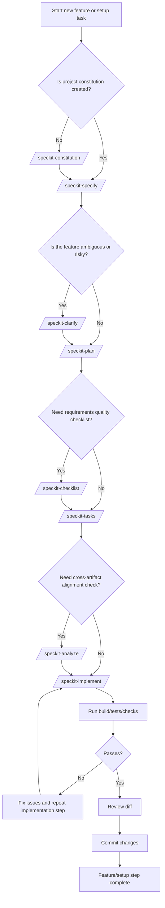
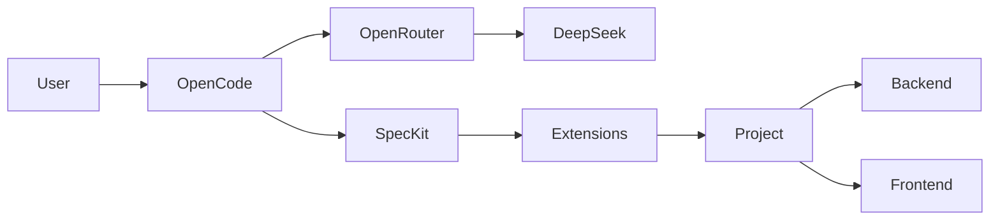
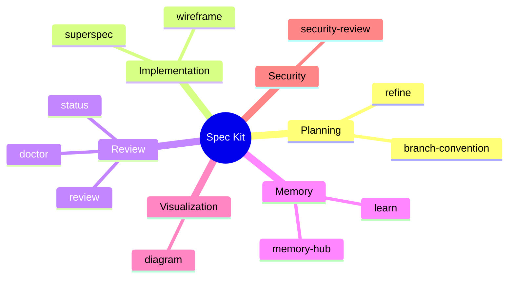
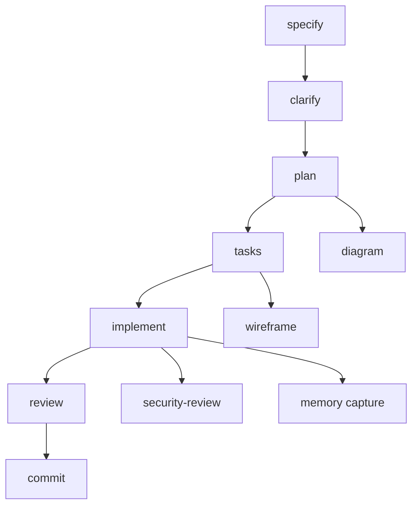

# Spec Kit setup

## Goal

Setup a lightweight Spec Kit development environment for:
- OpenCode
- OpenRouter
- DeepSeek
- Java + Vue monorepo
- Spec-Driven Development
- Long-term maintainability

## Core Stack

| Layer | Tool |
|---|---|
| Coding Harness | OpenCode |
| LLM Provider | OpenRouter |
| Main Model | DeepSeek V4 |
| Specification System | Spec Kit |
| Backend | Java Spring |
| Frontend | Vue 3 |
| Version Control | Git + GitHub Flow |
| Package Manager | uv |

## Spec Kit Workflow Tips

### 1. Core Spec Kit Flow

Use this as the default workflow:

```text
/speckit-constitution
/speckit-specify
/speckit-plan
/speckit-tasks
/speckit-implement
```

Meaning:

| Step | Command | Purpose |
|---|---|---|
| 1 | `/speckit-constitution` | Establish project principles and non-negotiable rules |
| 2 | `/speckit-specify` | Define what the feature should do and why |
| 3 | `/speckit-plan` | Define how the feature will be implemented |
| 4 | `/speckit-tasks` | Break implementation into actionable tasks |
| 5 | `/speckit-implement` | Execute implementation based on tasks |

### 2. Optional Enhancement Skills

Spec Kit may also install optional enhancement skills.

| Command | When to Use | Purpose |
|---|---|---|
| `/speckit-clarify` | Before `/speckit-plan` | Ask structured questions to reduce ambiguity before planning |
| `/speckit-checklist` | After `/speckit-plan` | Generate quality checklists for requirements completeness and clarity |
| `/speckit-analyze` | After `/speckit-tasks`, before `/speckit-implement` | Check consistency and alignment across artifacts |

### 3. Recommended Practical Workflow

For simple low-risk features:

```text
/speckit-specify
/speckit-plan
/speckit-tasks
/speckit-implement
```

For complex or risky features:

```text
/speckit-specify
/speckit-clarify
/speckit-plan
/speckit-checklist
/speckit-tasks
/speckit-analyze
/speckit-implement
```

For first project setup:

```text
/speckit-constitution
/speckit-specify
/speckit-plan
/speckit-tasks
/speckit-analyze
/speckit-implement
```

### 4. Mermaid Workflow Diagram




# Spec Kit Extensions

Community extensions and presets should support Spec Kit, not replace it.

**Main rule**:
> Spec Kit remains the source of workflow truth. Extensions add quality gates, visibility, memory, review, security, learning support, and visual feedback.

## High-Level Architecture




---

## Extensions Overview



---

## Selected and Installed Extensions

### Allow community extensions
Create file:
`.specify/extension-catalogs.yml`

Add there:
```yml
catalogs:
  - name: default
    url: https://raw.githubusercontent.com/github/spec-kit/main/extensions/catalog.json
    priority: 1
    install_allowed: true
    description: Built-in Spec Kit extension catalog

  - name: community
    url: https://raw.githubusercontent.com/github/spec-kit/main/extensions/catalog.community.json
    priority: 2
    install_allowed: true
    description: Community extensions allowed for this project after manual review
```

Check installed extensions:
```bash
specify extensions list
```

### `spec-kit-branch-convention`

**Repository:** `https://github.com/Quratulain-bilal/spec-kit-branch-convention`

**Installation command used:**
```powershell
specify extension add branch-convention --from https://github.com/Quratulain-bilal/spec-kit-branch-convention/archive/refs/tags/v1.0.0.zip
```

**Purpose:**
Defines branch naming rules and supports disciplined GitHub Flow.

**Problem solved:**
Without branch naming rules, feature branches may become inconsistent and hard to review.

**Project value:**
Helps keep implementation history professional and readable for recruiters, technical reviewers, and future maintainers.

**When to use:**
Use when creating or validating feature branches.

**Practical result:**
Branch names should stay clear, lowercase, scoped, and tied to one logical change.

Example:
```text
feature/spec-kit-initialization
feature/backend-hello-world
fix/docker-tomcat-startup
docs/update-setup-guide
```

---

### `spec-kit-extension-wireframe`

**Repository:** `https://github.com/TortoiseWolfe/spec-kit-extension-wireframe`

**Installation command Option A:**
```PowerShell
specify extension add wireframe
```

**Installation commands Option B:**
```powershell
git clone https://github.com/TortoiseWolfe/spec-kit-extension-wireframe
ren spec-kit-extension-wireframe wireframe
specify extension add wireframe --dev
```

**Purpose:**
Adds a visual feedback loop for wireframes and UI constraints.

**Problem solved:**
UI implementation can drift away from wireframes and user-approved design decisions.

**Project value:**
Useful because ResumAIner has many UI-heavy parts, including My Profile, Generate Resume, Resume Review, User Home resume listing, Admin tables, AI Model Details, Resume Details, and public PDF behavior.

**When to use:**
Use when a feature has UI screens or when visual constraints need to be carried into plan, tasks, and implementation.

**Practical result:**
Helps preserve wireframe intent during implementation.

Example:
```text
My Profile
Generate Resume
Resume Review
User Home resume listing
Admin tables
AI Model Details
Resume Details
Public PDF behavior
```

---

### `spec-kit-status`

**Repository:** `https://github.com/KhawarHabibKhan/spec-kit-status`

**Installation command Option A:**
```PowerShell
specify extension add status
```

**Installation command Option B:**
```powershell
specify extension add --from https://github.com/KhawarHabibKhan/spec-kit-status/archive/refs/tags/v1.0.0.zip
```

**Purpose:**
Shows the current state of the Spec Kit project.

**Problem solved:**
When many specs, tasks, plans, and extensions exist, it becomes hard to quickly understand where the project stands.

**Project value:**
Useful as a quick orientation command before continuing work.

**When to use:**
Use at the beginning of a session, after large changes, or before switching context.

**Practical result:**
Helps quickly understand what is active, completed, pending, or needs attention.

Example:
```text
Check current feature state
Check completed Spec Kit artifacts
Check pending work
Check possible workflow issues
```

---

### `spec-kit-doctor`

**Repository:** `https://github.com/KhawarHabibKhan/spec-kit-doctor`

**Installation command Option A:**
```PowerShell
specify extension add doctor
```

**Installation command Option B:**
```powershell
specify extension add doctor --from https://github.com/KhawarHabibKhan/spec-kit-doctor/archive/refs/tags/v1.0.0.zip
```

**Purpose:**
Performs a project health check.

**Problem solved:**
Spec Kit projects may become inconsistent when files are missing, generated artifacts are incomplete, or workflow steps are skipped.

**Project value:**
Useful for detecting setup and workflow problems early.

**When to use:**
Use after installing extensions, after creating a new feature spec, and before major implementation work.

**Practical result:**
Helps identify broken or incomplete Spec Kit structure before coding begins.

Example:
```text
Run after extension installation
Run after new spec generation
Run before implementation
Run before important review
```

---

### `spec-kit-security-review`

**Repository:** `https://github.com/DyanGalih/spec-kit-security-review`

**Installation command Option A:**
```PowerShell
specify extension add security-review
```

**Installation command Option B:**
```powershell
specify extension add security-review --from https://github.com/DyanGalih/spec-kit-security-review/archive/refs/tags/v1.5.1.zip
```

**Purpose:**
Adds a security review step to the Spec Kit workflow.

**Problem solved:**
Security-sensitive features can be implemented without enough attention to access control, secret handling, public routes, and input validation.

**Project value:**
Highly relevant for ResumAIner because the project includes authentication, user/admin roles, public PDF links, API key masking, AI provider configuration, HTML-in-JSON output, PDF generation, and user profile data.

**When to use:**
Use before and after implementing security-sensitive features.

**High-priority use cases:**
Use for Login/Register, Admin user management, AI Model Details, API key storage/replacement/deletion, public recruiter PDF links, HTML sanitization, and file/PDF access control.

**Practical result:**
Adds a security-focused checkpoint before code is considered ready.

Example:
```text
Login/Register
Admin user management
AI Model Details
API key storage
Public PDF links
HTML sanitization
PDF access control
```

---

### `superspec`

**Repository:** `https://github.com/WangX0111/superspec`

**Installation command Option:**
```powershell
mkdir C:\tempextension
cd C:\tempextension
git clone https://github.com/WangX0111/superspec.git
specify extension add "C:\temextension\superspec" --dev
rm "C:\tempextension" -r -f
```

**Additional requirement:**
This extension requires [Superpowers](https://github.com/obra/superpowers) to be installed for Open Code.
OpenCode uses its own plugin install; install Superpowers separately even if you already use it in another harness.

**Tell OpenCode:**
```powershell
Fetch and follow instructions from https://raw.githubusercontent.com/obra/superpowers/refs/heads/main/.opencode/INSTALL.md
```
This installs Superpowers plugin globally. Works best for Claude Code Desktop on Windows 11.

**Installation check - ask OpenCode:**
```powershell
tell me about your superpowers
```

**Purpose:**
Adds a more guided quality-control workflow on top of Spec Kit and Superpowers.

**Problem solved:**
AI coding agents may prematurely claim a task is done without enough execution discipline, review, or validation.

**Project value:**
Useful for a first serious AI-assisted Java/Vue project because it provides a stronger guided workflow.

**When to use:**
Use it to support brainstorming, task decomposition, execution, review, and resumable progress.

**Why this variant was selected first:**
This project uses `WangX0111/superspec` as the first Superpowers-related extension because it is more beginner-friendly and gives a more connected workflow experience.

**Caution:**
SuperSpec may add its own workflow logic. It must support Spec Kit, not override it.

**Practical result:**
Helps make AI-assisted implementation more structured and less likely to skip important validation steps.

Example:
```text
Brainstorm
Decompose tasks
Execute implementation
Review results
Resume progress
```

---

### `spec-kit-learn`

**Repository:** `https://github.com/imviancagrace/spec-kit-learn`

**Installation command Option A:**
```PowerShell
specify extension add learn
```

**Installation command Option B:**
```powershell
specify extension add learn --from https://github.com/imviancagrace/spec-kit-learn/archive/refs/tags/v1.1.0.zip
```

**Purpose:**
Adds educational guidance and mentoring context.

**Problem solved:**
Spec Kit and AI-assisted development can be hard to understand when the developer is still learning the workflow and technology stack.

**Project value:**
Useful because this project is both a Capstone implementation project and a personal learning project in Java, Spring MVC, Vue, Docker, and AI-assisted development.

**When to use:**
Use when the workflow, generated artifacts, or implementation decisions become unclear.

**Practical result:**
Helps explain what is happening and why, instead of only generating files.

Example:
```text
Explain Spec Kit workflow
Explain generated artifacts
Clarify implementation steps
Support learning during development
```

---

### `spec-kit-memory-hub`

**Repository:** `https://github.com/DyanGalih/spec-kit-memory-hub`

**Installation command Option A:**
```PowerShell
specify extension add memory-md
```

**Installation command Option B:**
```powershell
specify extension add memory-md --from https://github.com/DyanGalih/spec-kit-memory-hub/archive/refs/tags/v1.0.1.zip
```

**Initial command to run in Claude terminal:**
```text
/speckit.memory-md.init
```

**Status:**
Installed but not fully configured.

**Important note:**
Requires MCP configuration to be fully operational.

**Purpose:**
Provides repository-native memory for Spec Kit workflows, with caching and optional MCP support.

**Problem solved:**
Long-running AI-assisted projects lose context between sessions unless important decisions, mistakes, and lessons are persisted.

**Project value:**
Useful for preserving implementation lessons, recurring setup issues, architecture decisions, known errors and fixes, and agent workflow notes.

**When to use:**
Use after initial configuration is completed and after the memory strategy is reviewed.

**Caution:**
Memory must be curated. Bad memory can pollute future AI sessions.

**Practical result:**
Creates a path toward persistent project memory without forcing the AI to reload all documentation every time.

Example:
```text
Implementation lessons
Recurring setup issues
Architecture decisions
Known errors and fixes
Agent workflow notes
```

---

### `spec-kit-review`

**Repository:** `https://github.com/ismaelJimenez/spec-kit-review`

**Installation command Option A:**
```PowerShell
specify extension add review
```

**Installation command Option B:**
```powershell
specify extension add review --from https://github.com/ismaelJimenez/spec-kit-review/archive/refs/tags/v1.0.1.zip
```

**Purpose:**
Adds post-implementation code review with specialized review focus areas.

**Problem solved:**
AI-generated code can look complete while still having problems in tests, error handling, code quality, type design, comments, or simplification.

**Project value:**
Useful before commits and Pull Requests, especially for important features.

**When to use:**
Use after implementation and after the main Spec Kit/Superpowers review step.

**Recommended usage:**
Do not run full review every time. Use focused review for normal important features and full review for large PR-level checks.

**Practical result:**
Adds a focused final audit before code is considered ready.

Example:
```text
/speckit.review.run code tests errors
/speckit.review.run all parallel
```

Recommended workflow position:
```text
/speckit.superpowers.execute
/speckit.superpowers.review
/speckit.review.run code tests errors
```

---

### `spec-kit-diagram`

**Repository:** `https://github.com/Quratulain-bilal/spec-kit-diagram-`

**Installation command used:**
```powershell
specify extension add diagram --from https://github.com/Quratulain-bilal/spec-kit-diagram-/archive/refs/tags/v1.0.0.zip
```

**Purpose:**
Generates Mermaid diagrams for workflow visualization, feature progress, and task dependencies.

**Problem solved:**
Text-only Spec Kit artifacts can become hard to follow when workflows, task dependencies, or progress states become complex.

**Project value:**
Very useful for this project because visual understanding matters for learning, portfolio clarity, task planning, and explaining workflow to future readers.

**When to use:**
Use after generating tasks or when a feature workflow becomes hard to understand.

**Practical result:**
Creates quick visual explanations of Spec Kit structure and progress.

Example:
```text
Feature workflow diagram
Task dependency diagram
Progress state diagram
Spec Kit structure diagram
```

---

### `spec-kit-refine`

**Repository:** `https://github.com/Quratulain-bilal/spec-kit-refine`

**Installation command used:**
```powershell
specify extension add refine --from https://github.com/Quratulain-bilal/spec-kit-refine/archive/refs/tags/v1.0.0.zip
```

**Purpose:**
Supports iterative specification refinement.

**Problem solved:**
Specs may change after clarification, testing, implementation findings, or stakeholder decisions. Without a controlled refinement process, downstream artifacts may become stale.

**Project value:**
Useful because this project has many connected artifacts, including specs, plans, tasks, backend code, frontend code, database design, PDF rendering, and AI generation logic.

**When to use:**
Use when an approved spec changes and downstream artifacts must be updated.

**Practical result:**
Helps prevent spec/plan/task/code drift.

Example:
```text
Spec changes
Plan updates
Task updates
Implementation findings
Stakeholder clarification
```


---

## Extensions by Configuration Requirements

### No Configuration Required

| Extension | Purpose |
|---|---|
| `spec-kit-refine` | Spec updates |
| `spec-kit-status` | Project status |
| `spec-kit-doctor` | Health checks |
| `spec-kit-review` | Code review |
| `spec-kit-learn` | Learning support |
| `spec-kit-diagram` | Mermaid diagrams |
| `spec-kit-security-review` | Security checks |
| `spec-kit-extension-wireframe` | UI workflow |

---

### Configuration Required

| Extension                    | Required Setup       |
| ---------------------------- | -------------------- |
| `spec-kit-branch-convention` | Branch naming rules  |
| `superspec`                  | Superpowers plugin   |
| `spec-kit-memory-hub`        | Init + memory config |

---

## Explicit Task Dependencies Preset

**Repository:** `https://github.com/Quratulain-bilal/spec-kit-preset-explicit-task-dependencies`

**Installation command used:**
```powershell
specify preset add --from https://github.com/Quratulain-bilal/spec-kit-preset-explicit-task-dependencies/archive/refs/tags/v1.0.0.zip
```

**Purpose:**
Adds explicit inter-task dependencies and an execution wave DAG to generated `tasks.md`.

**Problem solved:**
Task lists can become misleading if they do not show which tasks must be done before others.

**Project value:**
Very useful for this project because many features depend on each other:

- database before DAO;
- DAO before services;
- services before controllers;
- backend API before Vue screens;
- generation response model before Resume Review;
- PDF rendering after final saved resume structure;
- security before public links.

**When to use:**
Use automatically as part of task generation.

**Practical result:**
Makes task order clearer and reduces the risk of asking Claude Code to implement tasks in the wrong order.

---
---

## Main Commands

```text
/speckit.superpowers.status
/speckit.superpowers.brainstorm
/speckit.superpowers.tasks
/speckit.superpowers.execute
/speckit.superpowers.review
```

---

## Recommended Workflow



---

## Git Strategy

| Area | Standard |
|---|---|
| Branches | GitHub Flow |
| Commits | Conventional Commits |
| PR Style | Summary + Why + Testing |
| Main Branch | Stable only |

---

## Practical Rules

1. Start simple.
2. Do not configure everything at once.
3. First goal = stable coding workflow.
4. Spec Kit is the source of truth.
5. Extensions support Spec Kit, not replace it.
6. Prefer stable workflow over complex automation.
7. Keep setup maintainable long-term.

---
