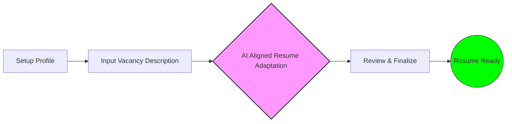
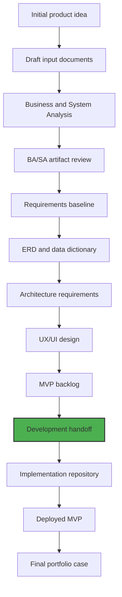

# ResumAIner — Resume AI Aligner

## Business & System Analysis Repository

> **Business Analysis and System Analysis case for an AI-assisted resume adaptation web application.**

---

## Overview

**ResumAIner**: *Resume AI Aligner* is an Java Capstone project focused on designing and implementing a web application for **AI-assisted resume adaptation**.

The application allows users to:
- maintain a structured professional profile;
- generate vacancy-specific resume versions with AI assistance;
- review and edit generated drafts;
- save final resume versions;
- download print-friendly PDFs;
- share public resume links with recruiters.

This repository contains the **business analysis and system analysis** consisting of requirements, domain modeling, UI/UX planning, architecture constraints, and other artifacts for the project.

---

## Why This Repository Exists

This repository is not only a preparation space for a Java Capstone project.

It is designed as a **professional showcase of analytical work**, demonstrating how a product idea can be transformed into structured requirements, system design inputs, and development-ready documentation.

The repository is intended to demonstrate:
- business problem understanding;
- stakeholder and persona analysis;
- MVP scoping;
- functional and non-functional requirements;
- user workflows and use cases;
- domain and data modeling;
- UI/UX requirements;
- technical and architecture constraints;
- risk, assumption, and open question management;
- traceability between requirements and future implementation.

---

## Product Summary

**Resume AI Aligner** helps job seekers create adapted resume versions for specific vacancies to highlight the most relevant skills, experience, achievements, and professional positioning.

The user enters full profile information once, then provides a target vacancy description and generation settings. The system uses an AI model to generate one or more adapted resume drafts. The user can review, edit, save, download, and share the final resume version.


---

## Core Product Idea

The product is built around the following workflow:
1. The user creates a structured career profile once.
2. The user provides a target vacancy description.
3. The system generates adapted resume drafts using AI.
4. The user reviews and edits the result.
5. The final resume is saved, exported as PDF, and can be shared through a public link.

### Simplified Process Flow


---

## Educational Context

This project is designed as a Java web application Capstone project finalizing a seven-month Java course.

The future implementation is expected to follow the required Java course stack and architecture constraints:
- Servlets
- Spring Core
- Spring MVC
- JDBC
- PostgreSQL
- Flyway
- Maven
- Layered Architecture
- MVC pattern
- DAO pattern
- Internationalization
- Unit testing
- Documentation

---

## Repository Status

**Current stage:** Business Analysis / System Analysis Complete — Ready for Development Handoff

Current repository state:

- [x]  Initial project concept defined
- [x]  Draft input documents prepared
- [x]  MVP direction identified
- [x]  Course technical constraints collected
- [x]  BA/SA analysis completed
- [x]  Reviewed BA/SA documentation prepared
- [x]  ERD finalized
- [x]  UI flows and wireframes prepared
- [x]  Development handoff package prepared
- [ ]  Implementation repository created

---

## Skills Applied

This repository demonstrates practical application of the following skills.

### Business Analysis

- Business problem framing
- Stakeholder identification
- Persona analysis
- Scope definition
- MVP planning
- Functional requirements writing
- Non-functional requirements writing
- Risk and assumption management
- Open question tracking
- Acceptance criteria preparation

### System Analysis

- Domain modeling
- Data model preparation
- Entity relationship analysis
- Technical constraints analysis
- Architecture requirements preparation
- Integration context analysis
- Security and access control considerations
- System boundary definition

### Product & UX Thinking

- User workflow design
- Basic information architecture
- UI scenario planning
- Public user journey analysis
- Admin workflow planning
- Recruiter-facing public resume flow

### Technical Understanding

- Java web application architecture
- Spring MVC constraints
- JDBC-based persistence
- PostgreSQL schema planning
- Docker Compose deployment planning
- AI provider integration planning
- PDF export requirements
- Internationalization requirements

---

## Methodology & Approach

The project follows a structured analysis-first approach:

1. **Discovery** — clarify the product idea, users, goals, and constraints.
2. **Business Analysis** — define scope, stakeholders, workflows, and requirements.
3. **System Analysis** — transform business needs into system, data, and architecture requirements.
4. **Design Preparation** — prepare ERD, UI flows, wireframes, and development handoff.
5. **Implementation Planning** — prepare the future Java/Vue implementation repository.
6. **Portfolio Packaging** — present the project as a complete BA/SA and development case.

---

## Repository Scope

This repository focuses on **analysis and design preparation**.
It does not contain the final application source code.

The future implementation will be stored in a separate repository:
- `resumainer-java-vue-webapp` — implementation repository

The final portfolio hub will be stored in a separate repository:
- `resumainer-capstone-project` — final portfolio and case study hub

---

## Repository Structure

```
drafts/                     Initial draft input documents for full analysis
docs/                       Reviewed and curated BA/SA documentation
assets/                     Diagrams, wireframes, screenshots
```

Current docs structure:
```
docs/
├── 01_project-overview/
├── 02_requirements/
│   └── elicitation/
├── 03_processes-and-workflows/
├── 04_domain-and-data-model/
├── 05_ui-ux/
├── 07_project-management/
│   └── ba-planning-and-monitoring/
├── 08_traceability/
└── 09_decisions/
```

---

## Current Documentation Areas

The current documentation covers:
- Project overview and strategic context
- Business goals with SMART KPIs
- Stakeholder analysis and engagement plan
- Methodology decision (Hybrid approach)
- Governance plan with change control workflows
- Information management plan
- BA process improvement plan
- Confirmed elicitation results
- 7 user workflows with extensions
- 5 functional requirements (profile, generation, management, admin)
- 32 non-functional requirements (error handling, code quality, testing, security, deployment)
- 3 business and stakeholder requirements
- Detailed wireframe descriptions and field-level requirements
- Resume template details with AI prompt contract and content budgets
- ERD (25 entities, 3NF) and data dictionary
- Traceability matrix with 47 trace rows
- Decision log with 59 decisions
- Change request log with 30 CRs
- Risk register with 14 risks
- Open questions log (all closed)

---

## Completed Deliverables

### Business Analysis Deliverables

- Strategic Context and Gap Analysis (docs/01_project-overview/)
- Business Goals and KPIs with SMART criteria (docs/01_project-overview/)
- Stakeholder Engagement Plan (Power/Interest Grid) (docs/07_project-management/ba-planning-and-monitoring/)
- Project Approach Decision (Hybrid methodology) (docs/07_project-management/ba-planning-and-monitoring/)
- Requirements Log with 40 requirements and acceptance criteria (docs/02_requirements/)
- Confirmed Elicitation Results (docs/02_requirements/elicitation/)
- Governance Plan with RACI matrix and change control workflows (docs/07_project-management/ba-planning-and-monitoring/)
- BA Process Improvement Plan (docs/07_project-management/ba-planning-and-monitoring/)

### System Analysis Deliverables

- Entity Relationship Diagram — DBML format (docs/04_domain-and-data-model/)
- Entity Relationship Diagram — Mermaid format (docs/04_domain-and-data-model/)
- Data Dictionary — 26 entities with field-level descriptions (docs/04_domain-and-data-model/)
- Requirements Traceability Matrix — 47 trace rows (docs/08_traceability/)
- Decision Log — 59 architecture, scope, and requirement decisions (docs/09_decisions/)
- Error Handling, DB Layer, UI Security, and Testing NFRs (docs/02_requirements/)

### UX/UI Deliverables

- User Workflows — 7 complete workflows with extensions (docs/03_processes-and-workflows/)
- Wireframes Detailed Description — 14 screens and modal (docs/05_ui-ux/)
- Wireframe Field Requirements — field-level validation and error messages (docs/05_ui-ux/)
- Resume Template Details and Logic — AI prompt contract, content budgets, template rules (docs/05_ui-ux/)
- HTML Templates — one-page and two-page resume variants (docs/05_ui-ux/)

### Project Management Deliverables

- Change Request Log — 30 tracked changes (docs/07_project-management/)
- Risk Register — 14 identified risks with mitigation plans (docs/07_project-management/)
- Open Questions Log — all questions closed with decisions (docs/07_project-management/)
- Information Management Plan (docs/07_project-management/ba-planning-and-monitoring/)
- Development Handoff Package — all artifacts approved and ready

---

## High-Level Roadmap



## Target MVP Scope

The MVP includes:
- user registration and login (email + BCrypt password);
- structured profile management (contact, experience, education, projects, courses);
- customizable additional profile info and settings;
- AI model selection and management (admin);
- adaptation level selection (Minimal, Balanced, Maximum) with all variants;
- AI-generated resume draft with mock and real OpenRouter integration;
- cover letter generation;
- editable generated resume content with review and final save;
- saved resume versions with search, sort, and pagination;
- soft-delete of resumes with HTTP 410;
- public recruiter resume links with direct PDF open;
- PDF download with A4 layout and selectable text;
- admin user, resume, and AI model management;
- AI usage statistics;
- Docker Compose deployment (3 containers);
- Swagger/OpenAPI documentation (ADMIN-only in prod);
- bilingual English and Russian UI.

---

## Future Implementation Direction

The future implementation is expected to use:
- Java
- Servlets
- Spring Core
- Spring MVC
- JDBC (plain, with custom thread-safe Connection Pool)
- PostgreSQL (3NF normalized)
- Flyway
- Vue 3 (Composition API) + Vite + PrimeVue
- Thymeleaf (Landing Page)
- Docker Compose (backend + frontend + database)
- OpenRouter API
- PDF generation library
- SLF4J + Logback
- Swagger/OpenAPI (springdoc-openapi)
- JUnit 5 + Mockito + JaCoCo

The implementation must respect the course requirement to use **plain JDBC** instead of ORM frameworks, and **no Spring Boot** — only pure Spring MVC.

---

## Author’s Role

In this project, I act as:
- Business Analyst
- System Analyst
- Java Developer
- Product Designer for the initial MVP scope
- Project owner responsible for documentation, design decisions, and implementation planning

---

## Notes

This repository is focused on analytical documentation and project preparation.

The goal is to demonstrate not only the final product idea, but also the structured thinking process behind it: from raw concept to requirements, system design, implementation planning, and future development handoff.
