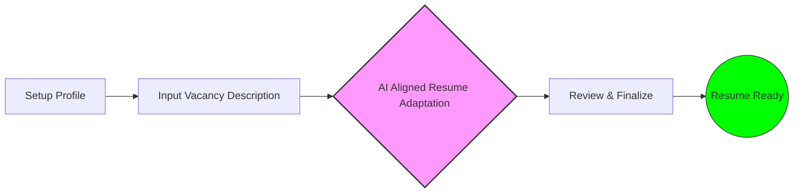
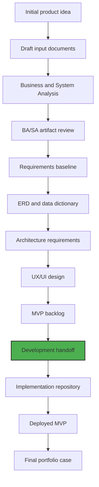

Project Path: agent-input

Source Tree:

```txt
ba-docs
├── README.md
└── docs
    ├── 01_project-overview
    │   ├── business_goals_and_kpis.md
    │   └── strategic_context_and_gap_analysis.md
    ├── 02_requirements
    │   ├── elicitation
    │   │   ├── confirmed_elicitation_results.md
    │   │   ├── ui_ux_elicitation_plan.md
    │   │   └── ui_ux_questionnaire.md
    │   └── requirements_log.md
    ├── 03_processes-and-workflows
    │   └── user_workflows.md
    ├── 04_domain-and-data-model
    │   ├── data_dictionary.md
    │   ├── dbml_erd.md
    │   ├── mermaid_erd.md
    │   └── plantuml_erd.puml
    ├── 05_ui-ux
    │   ├── one_pager_template.html
    │   ├── resume_template_details_and_logic.md
    │   ├── two_pager_template.html
    │   ├── wireframe_field_requirements.md
    │   └── wireframes_detailed_description.md
    ├── 07_project-management
    │   ├── ba-planning-and-monitoring
    │   │   ├── ba_process_improvement_plan.md
    │   │   ├── governance_plan.md
    │   │   ├── information_management_plan.md
    │   │   ├── project_approach_decision.md
    │   │   └── stakeholder_engagement_plan.md
    │   ├── change_request_log.md
    │   ├── open_questions_log.md
    │   └── risk_register.md
    ├── 08_traceability
    │   └── traceability_matrix.md
    └── 09_decisions
        └── decision_log.md

```

`README.md`:

```md
# ResumAIner — Resume AI Aligner

## Business & System Analysis Repository

> **Business Analysis and System Analysis case for an AI-assisted resume adaptation web application.**

---

## Overview

**ResumAIner**: *Resume AI Aligner* is an Java Capstone project focused on designing and implementing a web application for **AI-assisted resume adaptation**.

The application allows users to:
- maintain a structured professional profile;
- generate vacancy-specific resume versions with AI assistance;
- review and edit generated drafts;
- save final resume versions;
- download print-friendly PDFs;
- share public resume links with recruiters.

This repository contains the **business analysis and system analysis** consisting of requirements, domain modeling, UI/UX planning, architecture constraints, and other artifacts for the project.

---

## Why This Repository Exists

This repository is not only a preparation space for a Java Capstone project.

It is designed as a **professional showcase of analytical work**, demonstrating how a product idea can be transformed into structured requirements, system design inputs, and development-ready documentation.

The repository is intended to demonstrate:
- business problem understanding;
- stakeholder and persona analysis;
- MVP scoping;
- functional and non-functional requirements;
- user workflows and use cases;
- domain and data modeling;
- UI/UX requirements;
- technical and architecture constraints;
- risk, assumption, and open question management;
- traceability between requirements and future implementation.

---

## Product Summary

**Resume AI Aligner** helps job seekers create adapted resume versions for specific vacancies to highlight the most relevant skills, experience, achievements, and professional positioning.

The user enters full profile information once, then provides a target vacancy description and generation settings. The system uses an AI model to generate one or more adapted resume drafts. The user can review, edit, save, download, and share the final resume version.


---

## Core Product Idea

The product is built around the following workflow:
1. The user creates a structured career profile once.
2. The user provides a target vacancy description.
3. The system generates adapted resume drafts using AI.
4. The user reviews and edits the result.
5. The final resume is saved, exported as PDF, and can be shared through a public link.

### Simplified Process Flow


---

## Educational Context

This project is designed as a Java web application Capstone project finalizing a seven-month Java course.

The future implementation is expected to follow the required Java course stack and architecture constraints:
- Servlets
- Spring Core
- Spring MVC
- JDBC
- PostgreSQL
- Flyway
- Maven
- Layered Architecture
- MVC pattern
- DAO pattern
- Internationalization
- Unit testing
- Documentation

---

## Repository Status

**Current stage:** Business Analysis / System Analysis Complete — Ready for Development Handoff

Current repository state:

- [x]  Initial project concept defined
- [x]  Draft input documents prepared
- [x]  MVP direction identified
- [x]  Course technical constraints collected
- [x]  BA/SA analysis completed
- [x]  Reviewed BA/SA documentation prepared
- [x]  ERD finalized
- [x]  UI flows and wireframes prepared
- [x]  Development handoff package prepared
- [ ]  Implementation repository created

---

## Skills Applied

This repository demonstrates practical application of the following skills.

### Business Analysis

- Business problem framing
- Stakeholder identification
- Persona analysis
- Scope definition
- MVP planning
- Functional requirements writing
- Non-functional requirements writing
- Risk and assumption management
- Open question tracking
- Acceptance criteria preparation

### System Analysis

- Domain modeling
- Data model preparation
- Entity relationship analysis
- Technical constraints analysis
- Architecture requirements preparation
- Integration context analysis
- Security and access control considerations
- System boundary definition

### Product & UX Thinking

- User workflow design
- Basic information architecture
- UI scenario planning
- Public user journey analysis
- Admin workflow planning
- Recruiter-facing public resume flow

### Technical Understanding

- Java web application architecture
- Spring MVC constraints
- JDBC-based persistence
- PostgreSQL schema planning
- Docker Compose deployment planning
- AI provider integration planning
- PDF export requirements
- Internationalization requirements

---

## Methodology & Approach

The project follows a structured analysis-first approach:

1. **Discovery** — clarify the product idea, users, goals, and constraints.
2. **Business Analysis** — define scope, stakeholders, workflows, and requirements.
3. **System Analysis** — transform business needs into system, data, and architecture requirements.
4. **Design Preparation** — prepare ERD, UI flows, wireframes, and development handoff.
5. **Implementation Planning** — prepare the future Java/Vue implementation repository.
6. **Portfolio Packaging** — present the project as a complete BA/SA and development case.

---

## Repository Scope

This repository focuses on **analysis and design preparation**.
It does not contain the final application source code.

The future implementation will be stored in a separate repository:
- `resumainer-java-vue-webapp` — implementation repository

The final portfolio hub will be stored in a separate repository:
- `resumainer-capstone-project` — final portfolio and case study hub

---

## Repository Structure

```
drafts/                     Initial draft input documents for full analysis
docs/                       Reviewed and curated BA/SA documentation
assets/                     Diagrams, wireframes, screenshots
```

Current docs structure:
```
docs/
├── 01_project-overview/
├── 02_requirements/
│   └── elicitation/
├── 03_processes-and-workflows/
├── 04_domain-and-data-model/
├── 05_ui-ux/
├── 07_project-management/
│   └── ba-planning-and-monitoring/
├── 08_traceability/
└── 09_decisions/
```

---

## Current Documentation Areas

The current documentation covers:
- Project overview and strategic context
- Business goals with SMART KPIs
- Stakeholder analysis and engagement plan
- Methodology decision (Hybrid approach)
- Governance plan with change control workflows
- Information management plan
- BA process improvement plan
- Confirmed elicitation results
- 7 user workflows with extensions
- 5 functional requirements (profile, generation, management, admin)
- 32 non-functional requirements (error handling, code quality, testing, security, deployment)
- 3 business and stakeholder requirements
- Detailed wireframe descriptions and field-level requirements
- Resume template details with AI prompt contract and content budgets
- ERD (25 entities, 3NF) and data dictionary
- Traceability matrix with 47 trace rows
- Decision log with 59 decisions
- Change request log with 30 CRs
- Risk register with 14 risks
- Open questions log (all closed)

---

## Completed Deliverables

### Business Analysis Deliverables

- Strategic Context and Gap Analysis (docs/01_project-overview/)
- Business Goals and KPIs with SMART criteria (docs/01_project-overview/)
- Stakeholder Engagement Plan (Power/Interest Grid) (docs/07_project-management/ba-planning-and-monitoring/)
- Project Approach Decision (Hybrid methodology) (docs/07_project-management/ba-planning-and-monitoring/)
- Requirements Log with 40 requirements and acceptance criteria (docs/02_requirements/)
- Confirmed Elicitation Results (docs/02_requirements/elicitation/)
- Governance Plan with RACI matrix and change control workflows (docs/07_project-management/ba-planning-and-monitoring/)
- BA Process Improvement Plan (docs/07_project-management/ba-planning-and-monitoring/)

### System Analysis Deliverables

- Entity Relationship Diagram — DBML format (docs/04_domain-and-data-model/)
- Entity Relationship Diagram — Mermaid format (docs/04_domain-and-data-model/)
- Data Dictionary — 26 entities with field-level descriptions (docs/04_domain-and-data-model/)
- Requirements Traceability Matrix — 47 trace rows (docs/08_traceability/)
- Decision Log — 59 architecture, scope, and requirement decisions (docs/09_decisions/)
- Error Handling, DB Layer, UI Security, and Testing NFRs (docs/02_requirements/)

### UX/UI Deliverables

- User Workflows — 7 complete workflows with extensions (docs/03_processes-and-workflows/)
- Wireframes Detailed Description — 14 screens and modal (docs/05_ui-ux/)
- Wireframe Field Requirements — field-level validation and error messages (docs/05_ui-ux/)
- Resume Template Details and Logic — AI prompt contract, content budgets, template rules (docs/05_ui-ux/)
- HTML Templates — one-page and two-page resume variants (docs/05_ui-ux/)

### Project Management Deliverables

- Change Request Log — 30 tracked changes (docs/07_project-management/)
- Risk Register — 14 identified risks with mitigation plans (docs/07_project-management/)
- Open Questions Log — all questions closed with decisions (docs/07_project-management/)
- Information Management Plan (docs/07_project-management/ba-planning-and-monitoring/)
- Development Handoff Package — all artifacts approved and ready

---

## High-Level Roadmap



## Target MVP Scope

The MVP includes:
- user registration and login (email + BCrypt password);
- structured profile management (contact, experience, education, projects, courses);
- customizable additional profile info and settings;
- AI model selection and management (admin);
- adaptation level selection (Minimal, Balanced, Maximum) with all variants;
- AI-generated resume draft with mock and real OpenRouter integration;
- cover letter generation;
- editable generated resume content with review and final save;
- saved resume versions with search, sort, and pagination;
- soft-delete of resumes with HTTP 410;
- public recruiter resume links with direct PDF open;
- PDF download with A4 layout and selectable text;
- admin user, resume, and AI model management;
- AI usage statistics;
- Docker Compose deployment (3 containers);
- Swagger/OpenAPI documentation (ADMIN-only in prod);
- bilingual English and Russian UI.

---

## Future Implementation Direction

The future implementation is expected to use:
- Java
- Servlets
- Spring Core
- Spring MVC
- JDBC (plain, with custom thread-safe Connection Pool)
- PostgreSQL (3NF normalized)
- Flyway
- Vue 3 (Composition API) + Vite + PrimeVue
- Thymeleaf (Landing Page)
- Docker Compose (backend + frontend + database)
- OpenRouter API
- PDF generation library
- SLF4J + Logback
- Swagger/OpenAPI (springdoc-openapi)
- JUnit 5 + Mockito + JaCoCo

The implementation must respect the course requirement to use **plain JDBC** instead of ORM frameworks, and **no Spring Boot** — only pure Spring MVC.

---

## Author’s Role

In this project, I act as:
- Business Analyst
- System Analyst
- Java Developer
- Product Designer for the initial MVP scope
- Project owner responsible for documentation, design decisions, and implementation planning

---

## Notes

This repository is focused on analytical documentation and project preparation.

The goal is to demonstrate not only the final product idea, but also the structured thinking process behind it: from raw concept to requirements, system design, implementation planning, and future development handoff.

```

`docs\01_project-overview\business_goals_and_kpis.md`:

```md
# Business Goals and KPIs

**Project ID:** `resumainer`
**Product Name:** ResumAIner
**Date Created:** 2026-05-18
**Last Updated:** 2026-05-23
**Author:** Anton
**Version:** 10.0
**Status:** Approved
**Related BABOK Area:** 6.2 Define Future State (SMART Goals)

***

## 1. Description

This document defines the measurable business goals for the ResumAIner project. Each goal follows the **SMART** criteria — Specific, Measurable, Achievable, Relevant, and Time-bound. These goals translate the business need (BR-001) into quantifiable targets that will be used to evaluate project success.

## 2. Goal Overview

| ID     | Goal Title                                                            | Linked Business Need |
| ------ | --------------------------------------------------------------------- | -------------------- |
| BG-001 | Reduce resume adaptation time from manual hours to AI-powered minutes | BR-001               |
| BG-002 | Ensure system reliability and error transparency                      | Capstone Constraint  |
| BG-003 | Ensure code quality and maintainability                               | Capstone Constraint  |
| BG-004 | Ensure robust database access layer                                    | Capstone Constraint  |
| BG-005 | Ensure UI/UX security and validation integrity                         | Capstone Constraint  |
| BG-006 | Ensure consistent observability practices                              | Capstone Constraint  |
| BG-007 | Apply professional architecture and design patterns                    | Capstone Constraint  |
| BG-008 | Ensure testing quality and coverage                                     | Capstone Constraint  |
| BG-009 | Deliver complete UI and localization readiness                          | Capstone Constraint  |
| BG-010 | Ensure deployment and documentation readiness                           | Capstone Constraint  |
| BG-011 | Ensure configurable resume budget constraints                           | Governance Decision  |

## 3. SMART Goal Details

### BG-001: Reduce Resume Adaptation Time

#### Description

Users currently spend 2-3 hours manually adapting each resume using fragmented tools (Word, ChatGPT, email). ResumAIner should reduce this to under 10 minutes by providing structured profile storage and AI-powered vacancy-specific generation, enabling users to apply to more vacancies with professionally adapted resumes.

#### SMART Verification

| Criteria       | Assessment                                                                                                                                               |
| -------------- | -------------------------------------------------------------------------------------------------------------------------------------------------------- |
| **S**pecific   | Reduce the time required to produce a vacancy-adapted resume                                                                                             |
| **M**easurable | Tracked as "time from vacancy input to ready-to-save resume" (minutes)                                                                                   |
| **A**chievable | AI-powered generation with structured profile data can produce results in under 10 minutes; manual review/edit is the remaining user-controlled variable |
| **R**elevant   | Directly addresses the core business need (BR-001) — reducing manual adaptation effort                                                                   |
| **T**ime-bound | Target deadline aligned with Capstone project delivery                                                                                                   |

#### KPIs

| #   | KPI                     | Metric                                       | Baseline (Current)                           | Target (Goal)                      | Deadline   |
| --- | ----------------------- | -------------------------------------------- | -------------------------------------------- | ---------------------------------- | ---------- |
| 1   | Resume adaptation time  | Time to generate an adapted resume (minutes) | 120-180 minutes (manual)                     | <10 minutes                        | 2026-06-30 |
| 2   | Multilingual generation | Languages supported for automated generation | 1-2 (manual translation or separate version) | 2 (Russian and English, automated) | 2026-06-30 |

#### Measurement Approach

| KPI                     | How to Measure                                                                                  | Frequency           |
| ----------------------- | ----------------------------------------------------------------------------------------------- | ------------------- |
| Resume adaptation time  | Track from "Generate Resume" button click to draft preview displayed; exclude user editing time | Per-generation      |
| Multilingual generation | Language options available and functional in the generation flow                                | Verified at release |

### BG-002: Ensure System Reliability and Error Transparency

#### Description

The system must handle all errors consistently across controller, service, and DAO layers. Custom exceptions per layer enable quick failure localization. Errors are logged with sufficient context and returned to the user in a readable format without exposing stack traces.

#### SMART Verification

| Criteria       | Assessment |
| -------------- | ---------- |
| **S**pecific   | Handle, log, and report errors consistently across all application layers |
| **M**easurable | Count of uncovered try-catch blocks (target: zero); presence of per-layer custom exceptions |
| **A**chievable | Cross-cutting infrastructure concern; can be implemented once and applied everywhere |
| **R**elevant   | Directly required by Capstone specification and professional code quality standards |
| **T**ime-bound | Verified before final Capstone submission |

#### KPIs

| # | KPI | Metric | Baseline (Current) | Target (Goal) | Deadline |
|---|---|---|---|---|---|
| 1 | Custom exception coverage | Layers with dedicated exception class | 0 | 3 (controller, service, DAO) | 2026-06-30 |
| 2 | Stack trace exposure | Percentage of errors exposing trace to client | Unknown | 0% | 2026-06-30 |

### BG-003: Ensure Code Quality and Maintainability

#### Description

The codebase follows standard package structure, Java Code Convention, Javadoc on public methods, Maven CLI build capability, proper repository setup (.gitignore, README.md), and minimal dependencies. These quality standards are required by the Capstone specification.

#### SMART Verification

| Criteria | Assessment |
|---|---|
| **S**pecific | Establish package structure, code style, Javadoc, CLI build, and repository standards |
| **M**easurable | Package structure follows convention; `mvn clean package` succeeds; .gitignore and README.md present |
| **A**chievable | Standard developer practices; single configuration effort |
| **R**elevant | Required per Capstone specification for professional code presentation |
| **T**ime-bound | Verified before final Capstone submission |

#### KPIs

| # | KPI | Metric | Baseline (Current) | Target (Goal) | Deadline |
|---|---|---|---|---|---|
| 1 | Package structure compliance | Code organized by layer (controller/service/dao/model/config/util) | None | Full compliance | 2026-06-30 |
| 2 | CLI build success | `mvn clean package` completes without IDE | No project yet | Success | 2026-06-30 |
| 3 | Repository completeness | .gitignore and README.md present | No project yet | Both present | 2026-06-30 |

### BG-004: Ensure Robust Database Access Layer

#### Description

The database access layer must follow enterprise-grade practices: custom thread-safe Connection Pool with thorough documentation, Service-layer transaction management via manual JDBC commit/rollback, SQL scripts for complete database initialization, PreparedStatement for all queries, and UTF-8 encoding for Cyrillic support. These requirements are mandated by the Capstone specification.

#### SMART Verification

| Criteria | Assessment |
|---|---|
| **S**pecific | Implement custom thread-safe Connection Pool, transaction management, SQL scripts, PreparedStatement, and UTF-8 encoding |
| **M**easurable | Connection Pool operational with documented internals; `mvn clean package` includes SQL scripts; code review confirms PreparedStatement-only queries; UTF-8 data round-trips correctly |
| **A**chievable | Standard DAO infrastructure; Connection Pool is a single well-scoped component |
| **R**elevant | Directly required by Capstone specification and security best practices |
| **T**ime-bound | Verified before final Capstone submission |

#### KPIs

| # | KPI | Metric | Baseline (Current) | Target (Goal) | Deadline |
|---|---|---|---|---|---|
| 1 | Connection Pool documentation | Internal docs covering thread-safety, lifecycle, timeouts | None | Complete and review-ready | 2026-06-30 |
| 2 | Transaction coverage | Critical operations wrapped in manual transactions | None | 100% (register, generate+save) | 2026-06-30 |
| 3 | SQL injection prevention | DAO methods using PreparedStatement | None | 100% | 2026-06-30 |

### BG-005: Ensure UI/UX Security and Validation Integrity

#### Description

The system must protect against form resubmission (PRG pattern, button disable), sanitize user input against XSS attacks, and enforce dual validation — frontend validation for immediate UX feedback and backend validation with Spring @Valid and Jakarta Validation annotations (@Email, @NotNull, @NotEmpty, @Size) as the authoritative check.

#### SMART Verification

| Criteria | Assessment |
|---|---|
| **S**pecific | Implement PRG pattern, XSS sanitization, and dual frontend/backend validation across all forms |
| **M**easurable | All POST endpoints use PRG; all user input is sanitized; all required DTO fields have @NotNull/@NotEmpty |
| **A**chievable | Standard Spring/PrimeVue features; single implementation pass across all forms |
| **R**elevant | Required per Capstone specification covering form resubmission, XSS, and validation |
| **T**ime-bound | Verified before final Capstone submission |

#### KPIs

| # | KPI | Metric | Baseline (Current) | Target (Goal) | Deadline |
|---|---|---|---|---|---|
| 1 | Form resubmission prevention | POST endpoints implementing PRG | None | 100% | 2026-06-30 |
| 2 | User input sanitization coverage | User-facing text fields sanitized on input | None | 100% | 2026-06-30 |
| 3 | Backend validation completeness | Required DTO fields with @NotNull/@NotEmpty | None | 100% | 2026-06-30 |

### BG-006: Ensure Consistent Observability Practices

#### Description

All application layers must use a consistent log format with ISO 8601 timestamps, MDC context (user ID, request ID), and unified log levels. Logback replaces Log4j2 as a lighter logging implementation. Validation errors are logged at WARN level to support security monitoring.

#### SMART Verification

| Criteria | Assessment |
|---|---|
| **S**pecific | Define and apply a single log format pattern across Controller, Service, and DAO layers using SLF4J + Logback |
| **M**easurable | Log format consistency verified by inspecting log output from each layer; logback.xml defines one pattern |
| **A**chievable | Single configuration file (logback.xml) applied application-wide |
| **R**elevant | Consistent logging is required for debugging, monitoring, and audit |
| **T**ime-bound | Verified before final Capstone submission |

#### KPIs

| # | KPI | Metric | Baseline (Current) | Target (Goal) | Deadline |
|---|---|---|---|---|---|
| 1 | Log format consistency | Layers using the same log pattern | None | 100% (Controller, Service, DAO) | 2026-06-30 |
| 2 | MDC context coverage | Log entries containing user ID and request ID | None | 100% of ERROR and WARN entries | 2026-06-30 |

### BG-007: Apply Professional Architecture and Design Patterns

#### Description

The system must apply at least 4 documented GoF design patterns with clear rationale: Singleton (Connection Pool), Builder (AI prompt construction), Factory Method (mock vs real AI client creation), Strategy (adaptation level selection). Spring MVC Interceptors handle request logging and authorization. AOP handles service-layer cross-cutting concerns. SOLID and DRY principles guide all architecture decisions.

#### SMART Verification

| Criteria | Assessment |
|---|---|
| **S**pecific | Apply 4 GoF patterns, Spring MVC Interceptors, AOP, SOLID, DRY |
| **M**easurable | Pattern catalog documented in Decision Log; interceptor and aspect classes exist; code review confirms SOLID/DRY compliance |
| **A**chievable | Standard enterprise patterns for a Spring MVC application |
| **R**elevant | Required per Capstone specification |
| **T**ime-bound | Verified before final Capstone submission |

#### KPIs

| # | KPI | Metric | Baseline (Current) | Target (Goal) | Deadline |
|---|---|---|---|---|---|
| 1 | Documented patterns | GoF patterns with documented rationale | None | 4 (Singleton, Builder, Factory Method, Strategy) | 2026-06-30 |
| 2 | Interceptor coverage | Request paths covered by logging and auth interceptors | None | 100% of secured endpoints | 2026-06-30 |
| 3 | AOP aspect count | @Aspect classes implementing cross-cutting logic | None | 1+ aspect class | 2026-06-30 |

### BG-008: Ensure Testing Quality and Coverage

#### Description

The project must achieve 50%+ line coverage in Service and DAO layers using JUnit 5 and Mockito, measured by JaCoCo. Tests cover positive, negative, and boundary scenarios. Tests are structured, consistent, and readable. TDD approach is applied for new business logic.

#### SMART Verification

| Criteria | Assessment |
|---|---|
| **S**pecific | Achieve 50%+ test coverage in Service and DAO layers; cover positive, negative, and boundary scenarios |
| **M**easurable | JaCoCo coverage report; code review confirms scenario coverage and test structure |
| **A**chievable | Standard testing practices with JUnit 5 + Mockito + JaCoCo |
| **R**elevant | Required per Capstone specification |
| **T**ime-bound | Verified before final Capstone submission |

#### KPIs

| # | KPI | Metric | Baseline (Current) | Target (Goal) | Deadline |
|---|---|---|---|---|---|
| 1 | Service layer coverage | Line coverage percentage | 0% | 50%+ | 2026-06-30 |
| 2 | DAO layer coverage | Line coverage percentage | 0% | 50%+ | 2026-06-30 |
| 3 | Test structure compliance | Tests following naming convention and arrange-act-assert | None | 100% code review pass | 2026-06-30 |

### BG-009: Deliver Complete UI and Localization Readiness

#### Description

All data tables must implement pagination for performance and usability. The interface must support English and Russian languages via resource files (messages_en.properties, messages_ru.properties) for both Thymeleaf (Landing Page) and Vue SPA. All user-facing strings must be externalized.

#### SMART Verification

| Criteria | Assessment |
|---|---|
| **S**pecific | Implement pagination on all list views; provide i18n resource files for EN and RU for both Thymeleaf and Vue |
| **M**easurable | Pagination controls visible on all data tables; resource files exist; language switcher functions correctly |
| **A**chievable | Standard PrimeVue pagination component; standard Spring/Vue i18n patterns |
| **R**elevant | Required for maximum Capstone evaluation scores |
| **T**ime-bound | Verified before final Capstone submission |

#### KPIs

| # | KPI | Metric | Baseline (Current) | Target (Goal) | Deadline |
|---|---|---|---|---|---|
| 1 | Pagination coverage | List views with pagination | 0 | 4 (User Home, Admin Users, Admin Resumes, Admin AI Models) | 2026-06-30 |
| 2 | i18n resource files | .properties files for supported languages | 0 | 2 (EN, RU) | 2026-06-30 |

### BG-010: Ensure Deployment and Documentation Readiness

#### Description

The project must include Swagger/OpenAPI REST documentation with ADMIN-only access in production, Docker Compose with 3 containers (backend Tomcat, Vue Nginx, PostgreSQL), and separate dev/prod Spring profiles.

#### SMART Verification

| Criteria | Assessment |
|---|---|
| **S**pecific | Implement Swagger, Docker Compose, and dev/prod profiles |
| **M**easurable | Swagger UI accessible; docker compose up starts full stack; profile-specific configs exist |
| **A**chievable | Standard tools: springdoc-openapi, Docker Compose, Spring profile mechanism |
| **R**elevant | Required for portfolio demonstration and reproducible deployment |
| **T**ime-bound | Verified before final Capstone submission |

#### KPIs

| # | KPI | Metric | Baseline (Current) | Target (Goal) | Deadline |
|---|---|---|---|---|---|
| 1 | Docker Compose readiness | Containers defined | 0 | 3 (backend, frontend, database) | 2026-06-30 |
| 2 | Swagger availability | API documented endpoints | 0 | All controllers | 2026-06-30 |

### BG-011: Ensure Configurable Resume Budget Constraints

#### Description

Resume budget configuration (sentence counts, bullet limits, skill limits, job distribution rules) must be stored in PostgreSQL and configurable without Java code changes or application restart. The backend reads the active configuration before every resume generation.

#### SMART Verification

| Criteria | Assessment |
|---|---|
| **S**pecific | Store budget configuration in PostgreSQL; backend reads before each generation |
| **M**easurable | Config changes take effect on next generation without code/restart change |
| **A**chievable | DB-backed configuration with active config fallback and versioning |
| **R**elevant | Enables runtime budget tuning without developer intervention |
| **T**ime-bound | Verified before final Capstone submission |

#### KPIs

| # | KPI | Metric | Baseline (Current) | Target (Goal) | Deadline |
|---|---|---|---|---|---|
| 1 | Budget config tables created | Tables | 0 | 4 | 2026-06-30 |
| 2 | Config readiness delay | Generations without config | Unlimited | None (error returned) | 2026-06-30 |

## 4. Dependencies and Assumptions

| Dependency / Assumption                                        | Impact on Goal                                                                        |
| -------------------------------------------------------------- | ------------------------------------------------------------------------------------- |
| AI API (OpenRouter) must be accessible and responsive          | Generation time depends on API response speed; target of <10 min includes API latency |
| User must complete structured profile before generation        | Goal assumes profile data is already entered, first setup time is separate            |
| AI output quality must be sufficient for meaningful adaptation | If AI output requires heavy editing, effective time savings are reduced               |

***

*This document is part of the ResumAIner business analysis portfolio. Goals and KPIs should be reviewed after MVP delivery to validate assumptions and refine targets for future iterations.*

```

`docs\01_project-overview\strategic_context_and_gap_analysis.md`:

```md
# Strategic Context and Gap Analysis

**Project ID:** `resumainer`
**Product Name:** ResumAIner
**Date Created:** 2026-05-18
**Last Updated:** 2026-05-21
**Author:** Anton
**Version:** 7.0
**Status:** Approved
**Related BABOK Area:** 6.1 Analyze Current State / 6.2 Define Future State

***

## 1. Description

This document captures the strategic rationale for the ResumAIner project. It answers two fundamental questions:

- **Why are we building this?**
  by describing the current state, pain points, and root cause analysis.
- **What are we building toward?** 
  by defining the target state and the gap between where we are and where we need to be.

This is the foundational business analysis artifact for the project. It ensures that every requirement, design decision, and implementation task is traceable to a clearly articulated business need.

## 2. Current State (As-Is)

### 2.1 Business Context

Job seekers today must adapt their resume for each job application to pass ATS screening and stand out to recruiters. This is a fully manual process with no dedicated tools. Career information like skills, experience, achievements, education is scattered across Word files, Google Docs, LinkedIn, email attachments, and personal memory.

### 2.2 Pain Points

| # | Pain Point | Impact |
|---|-----------|--------|
| 1 | Manual adaptation takes 2-3 hours per vacancy | Candidates skip potentially suitable opportunities due to time cost |
| 2 | Career data scattered across multiple sources | No single source of truth; data must be re-discovered for each resume |
| 3 | Inconsistent adaptation quality | Quality varies by time, energy, and writing skill available at the moment |
| 4 | No version history | Cannot reliably recall which resume variant was sent to which employer |
| 5 | Dual-language support doubles effort | Russian and English versions must be manually synchronized |
| 6 | Difficulty phrasing achievements professionally | Candidates struggle with keyword optimization for ATS scoring |

### 2.3 Root Cause Analysis

**Technique:** Five Whys
**Problem Statement:** Job seekers spend 2-3 hours manually adapting their resume for each vacancy, causing them to skip opportunities or submit generic, poorly adapted resumes.

| Why?                                                       | Answer                                                                                                                                                          |
| ---------------------------------------------------------- | --------------------------------------------------------------------------------------------------------------------------------------------------------------- |
| Why does adaptation take so long?                          | Because there is no structured profile, career data must be gathered from multiple sources for each resume.                                                     |
| Why is there no structured profile?                        | Because general-purpose tools (Word, ChatGPT, email) are used instead of a dedicated system.                                                                    |
| Why are general-purpose tools used?                        | Because no integrated system exists that combines structured profile storage with AI-powered adaptation.                                                        |
| Why hasn't such a system been built for this user segment? | Because building one requires combining structured data management, AI integration, version tracking, and PDF generation — a non-trivial integration challenge. |

**Root Cause:** No integrated system exists that combines structured career profile storage with AI-powered vacancy-specific resume adaptation. Each adaptation starts from scratch.

**Contributing Factors:**
- Data fragmentation across multiple unconnected tools
- No structured data model for career information
- AI tools (ChatGPT) require manual context assembly every time
- No version tracking or vacancy-to-resume mapping
- PDF generation and formatting are manual and inconsistent

## 3. Future State (To-Be)

### 3.1 Target Vision

ResumAIner provides a single, integrated platform where users:

1. **Maintain a structured career profile** — enter career data once (contact, experience, education, skills, projects, certifications, languages, achievements).
2. **Generate adapted resumes in minutes** — paste a job, company description, select AI model and adaptation level, choose language (RU/EN/both), and receive an AI-generated draft.
3. **Review and refine** — edit generated content before saving the final version.
4. **Track version history** — view, search, filter, and manage all saved resume versions.
5. **Share professionally** — download print-friendly selectable-text PDF, share via permanent public URL, access ATS-optimized JSON endpoint (MVP Stretch).

### 3.2 Target Capabilities

| Capability | Current State | Target State |
|-----------|--------------|--------------|
| Profile storage | None (manual/files) | Single structured CRUD system |
| AI integration | Manual copy-paste to ChatGPT | Built-in with model selection and adaptation levels |
| Version management | Manual file naming with no tracking | Full history with search/filter/sort/pagination |
| Vacancy tracking | None | Stored per generation with company information |
| Language support | Manual translation or separate versions | Automated generation (Russian/English/both) |
| PDF generation | Manual export with formatting adjustments | Automated A4 selectable-text PDF |
| Public sharing | Email or file-sharing links | Permanent URL per resume version |

### 3.3 Technology Stack

| Layer | Target Technology |
|-------|------------------|
| Backend | Java, Spring MVC, Servlets |
| Data access | Plain JDBC with custom thread-safe Connection Pool |
| Database | PostgreSQL (3NF normalized) |
| Frontend | Vue 3 (Composition API) + Vite + PrimeVue (authenticated), Thymeleaf (landing page) |
| AI integration | OpenRouter API (isolated behind service interface) |
| PDF generation | Automated (selectable text, A4) |
| Deployment | Docker Compose (backend + frontend + database) |
| Migrations | Flyway (versioned SQL scripts) |
| Logging | SLF4J + Logback |
| API Documentation | Swagger/OpenAPI (springdoc-openapi), ADMIN-only access on prod |
| Deployment profiles | dev and prod Spring profiles via application-dev.yml and application-prod.yml |
| Design patterns | Singleton (Connection Pool), Builder (AI prompt), Factory Method (AI client), Strategy (adaptation level) |
| AOP | Spring AOP with AspectJ for cross-cutting logging and monitoring |
| Interceptors | Spring MVC HandlerInterceptors for request logging and authorization |
| Testing | JUnit 5, Mockito, JaCoCo coverage reports; 50%+ coverage in Service and DAO layers |

## 4. Constraints

| # | Constraint | Category | Status |
|---|-----------|----------|--------|
| 1 | Must use Capstone technology stack: Spring MVC, JDBC, PostgreSQL, Maven, Vue.js, Docker Compose | Technology | Confirmed |
| 2 | Solo developer, scope must be achievable within course timeframe | Resources | Confirmed |
| 3 | Database must be normalized to 3NF; no ORM frameworks allowed | Technology | Confirmed |
| 4 | Custom thread-safe Connection Pool must be implemented manually (no HikariCP, DBCP, or similar libraries) | Technology | Confirmed |
| 5 | Transactions must be managed manually via JDBC commit()/rollback() at Service layer | Technology | Confirmed |
| 6 | Database, connections, and all text columns must use UTF-8 encoding for Cyrillic support | Technology | Confirmed |

## 5. Gap Analysis Summary

| Element | Change Type | Complexity | Summary |
|---------|------------|-----------|---------|
| Business Needs | Improve | High | Transition from fragmented manual process to integrated AI-powered system |
| Capabilities | Improve | High | From zero dedicated capabilities to full-featured profile management and resume generation |
| Technology | Improve | High | From general-purpose office tools to purpose-built full-stack web application |

All three gaps represent a transformation from a tool-fragmented manual workflow to an integrated software solution. This is expected for a new system initiative, the gaps are not risks but rather define the scope of what needs to be built.

## 6. Potential Value Assessment

| Benefit | Type | Magnitude | Confidence |
|---------|------|-----------|-----------|
| Reduce resume adaptation time from 2-3 hours to under 10 minutes | Operational | High | High |
| Improve application quality and ATS performance | Strategic | High | Medium |
| Single source of truth for career data | Operational | Medium | High |
| Professional portfolio showcase (Capstone) | Strategic | Medium | High |

**Investment Level:** Medium
**Profile:** Attractive — high value at moderate investment, three out of four benefits have high confidence.

***

*This document follows the BABOK v3 framework (sections 6.1 and 6.2) adapted for lean portfolio documentation. It serves as the strategic foundation for all downstream requirements, design, and development activities.*
```

`docs\02_requirements\elicitation\confirmed_elicitation_results.md`:

```md
# Confirmed Elicitation Results

**Project ID:** `resumainer`  
**Product Name:** ResumAIner  
**Date Created:** 2026-05-12  
**Last Updated:** 2026-05-21  
**Author:** Anton  
**Version:** 6.0  
**Status:** Approved  
**Related BABOK Area:** 4.2 Conduct Elicitation / 4.3 Confirm Elicitation Results  

---

## 1. Description

This document confirms the results of UI/UX elicitation activities conducted for the ResumAIner Capstone project. It synthesizes role-based questionnaire responses, technical feasibility reviews, and stakeholder feedback into actionable UI/UX requirements, page-level decisions, and implementation guidance.

The confirmed results define MVP page scope, page-level structure, key user/admin flows, and implementation-relevant UI decisions. These results are used as input for wireframes, UI/UX requirements, sitemap, user flows, requirements traceability, and development handoff.

## 2. Elicitation Method Summary

The elicitation activity used a structured, role-based questionnaire covering four stakeholder perspectives:
- Registered User / Job Seeker (primary end-user)
- Recruiter / External Viewer (public resume consumers)
- Administrator (system oversight and control)
- Developer / Technical Reviewer (implementation feasibility)

The questionnaire focused on practical screen-level decisions including page necessity, required blocks, key actions, error/empty states, user guidance, and MVP prioritization. Responses were analyzed using both quantitative (priority scoring) and qualitative (thematic grouping) methods.

Confirmation Basis:
- project owner review;
- mentor feedback;
- questionnaire responses;
- technical feasibility review.

## 3. Respondent Segments / Review Sources

| Respondent Segment | Role | Input Method | Review Sources |
| :--- | :--- | :--- | :--- |
| **Registered User / Job Seeker** | End User | Role-based questionnaire section | Direct user feedback on profile, generation, review workflows |
| **Recruiter / External Viewer** | External Consumer | Role-based questionnaire section | Public resume access expectations, PDF usability |
| **Administrator** | System Manager | Role-based questionnaire section | User management, abuse prevention, usage monitoring needs |
| **Developer / Technical Reviewer** | Technical Validator | Role-based questionnaire section | Implementation complexity, feasibility, architecture constraints |

## 3. Confirmed MVP Page Map

### 3.1 Public / Visitor Pages

1. Landing Page
2. Login / Register
3. Public PDF Resume Link

### 3.2 Registered User Pages

1. User Home
2. My Profile
3. Generate Resume
4. Resume Review

Confirmed changes:

- Separate `Resume History` page is removed.
- Resume listing is integrated into `User Home`.
- Separate `User Settings` page is removed.
- User settings are integrated into `My Profile`.
- Separate `Resume Details` page is removed.
- PDF actions (download, public link copy) are available from User Home table and post-save flow.

### 3.3 Administrator Pages

1. Admin Home
2. Users
3. User Details
4. Resumes
5. AI Models
6. AI Model Details

Confirmed changes:

- Separate `Resume Details (admin view)` page is removed.
- Admin can view generated and saved resume PDFs from the Resumes table.

### 3.4 Recruiter / External Viewer Access

1. Public PDF Resume Link

Recruiters do not need an account or separate portal in MVP.

## 4. Confirmed Scope Classification

### 4.1 MVP

- Landing Page
- Login / Register
- User Home with integrated resume listing
- My Profile with core profile sections and settings
- Generate Resume
- Resume Review
- PDF download (from User Home and post-save flow)
- Public PDF resume link
- Admin Home
- Users
- User Details
- Resumes (with PDF preview and download actions)
- AI Models
- AI Model Details
- Token usage logging when provider data is available
- Mock AI provider fallback
- Generate all adaptation variants
- Cover letter generation

### 4.2 MVP Stretch

- ATS JSON endpoint
- Google OAuth2 login
- Language tabs for bilingual resume review
- Advanced filtering
- Admin access audit log
- Password change in My Profile
- Photo upload in My Profile
- Reorder skills, work experience, education, and projects

### 4.3 Post-MVP / Future Scope

- Payment system / subscription plans
- User-owned API keys
- Advanced analytics dashboard
- Resume scoring
- Prompt marketplace
- Recruiter accounts
- Recruiter comments/feedback
- Advanced PDF templates
- Full resume version comparison
- Values and Hobbies profile sections
- Advanced public resume defaults

## 5. Confirmed Page-Level Results

## 5.1 Landing Page

**Purpose:** Explain product value, provide login/register entry, and briefly show how the product works.

**MVP blocks:**

- product name and short value proposition;
- Login and Register links;
- short “How it works” explanation;
- key feature list;
- interface language switcher if i18n is included in MVP.

**Stretch blocks:**

- example generated resume preview;
- FAQ/help block;
- privacy/security note.

## 5.2 Login / Register

**Purpose:** Create account and access the system.

**Confirmed decisions:**

- If an authenticated user opens Login/Register page, the system redirects to the appropriate Home page.
- User role redirects to `User Home`.
- Admin role redirects to `Admin Home`.
- Log out action is not shown on Login/Register page.

**MVP blocks:**

- email field;
- password field;
- confirm password field for registration;
- Login/Register switch link;
- password requirements hint.

**Stretch/future:**

- Google login;
- password reset.

## 5.3 User Home

**Purpose:** Main post-login page for regular users. Provides quick access to profile editing, resume generation, and saved resumes.

**MVP blocks:**

- primary CTA: Edit Profile;
- secondary CTA: Generate New Resume;
- searchable/sortable table of saved resumes;
- columns: number, vacancy, resume title, language, adaptation level, created date, PDF link/status;
- filtering and pagination;
- basic empty states.

**MVP actions:**

- open My Profile;
- open Generate Resume;
- search resumes;
- sort resume table columns;
- download PDF directly from table;
- copy public resume link if available.

**Empty states:**

- empty profile: “Complete your profile first to generate better resumes.”
- no resumes: “Generate your first adapted resume.”
- no search results: “No resumes match your search.”

## 5.4 My Profile

**Purpose:** Central place for user profile data and user settings.

**Confirmed structure:**

- Use tabs, sidebar sections, or accordion sections.
- Do not create a separate User Settings page.
- Keep profile data and settings in separate sections inside My Profile.

**Confirmed My Profile sections:**

1. Contact Details
2. Work Experience
3. Projects & Volunteering
4. Education
5. Courses & Certificates
6. Additional Info

**Contact Details fields:**

- Full name — required;
- Professional title — optional;
- Email — required;
- Phone — required;
- Location — required;
- LinkedIn URL — optional;
- Portfolio / Website URL — optional;
- Telegram — optional;
- WhatsApp — optional.

**Work Experience fields:**

- Job title — required;
- Company name — required;
- Location — optional;
- Start date — required;
- End date — optional if current role;
- Role and job description — required;
- Company URL — optional.

**Projects & Volunteering fields:**

- Project name — required;
- Role — optional;
- Start date — optional;
- End date — optional;
- Description — required;
- Project URL — optional.

**Education fields:**

- Institution name — required;
- Degree / Qualification — required;
- Field of study / Major — optional;
- Start year — required;
- End year — optional if currently studying;
- Location — optional;
- Comment / Description — optional;
- GPA / Grade — optional.

**Courses & Certificates fields:**

- Course / Certificate name — required;
- Provider / Issuer — required;
- Start date — required;
- End date — optional;
- Credential URL — optional;
- Skills / Topics — optional;
- Short description — optional.

**Additional Info fields:**

- Skills — optional;
- Languages — optional;
- Professional aspirations — optional;
- Achievements — optional;
- Default resume language — optional dropdown;
- Additional resume language — optional dropdown;
- General information for AI context — optional;
- Profile picture — optional;
- Username — required and URL-friendly.

**MVP actions:**

- add record;
- edit record;
- delete record;
- save section.

**Confirmed UI pattern:**

- Repeatable profile sections use card list + Add/Edit form.
- Repeatable records are automatically sorted where applicable.

## 5.5 Generate Resume

**Purpose:** Collect vacancy context and generation settings.

**MVP structure:**

- Single page for MVP.
- Multi-step wizard remains future improvement.

**MVP fields:**

- Vacancy description — required;
- Company description — optional;
- Professional aspirations — optional;
- Language — required dropdown;
- Adaptation level — required dropdown;
- AI model — required dropdown;
- Additional comments for AI — optional.

**MVP actions:**

- generate resume;
- clear form;
- return to My Profile;
- select language;
- select adaptation level;
- select AI model.

**Error states:**

- vacancy description is empty;
- profile data is incomplete;
- user is not allowed to generate resumes;
- AI provider is unavailable;
- generation timeout;
- selected model is invalid or inactive;
- generated result is empty.

**Guidance:**

- Balanced adaptation should be the recommended default.
- User must review generated content before saving.

## 5.6 Resume Review

**Purpose:** Let user review, edit, and save generated resume draft.

**MVP blocks:**

- generated resume preview;
- editable resume sections;
- save final version button;
- discard draft button;
- warning about factual review.

**MVP actions:**

- edit generated text;
- save final version;
- discard draft.

**Stretch actions:**

- return to generation settings;
- regenerate resume;
- compare variants;
- download PDF before saving;
- copy public link before final save.

## 5.7 Resume Details — Removed from MVP

**Status:** Removed per DEC-014 / CR-013.
**Reason:** Page did not provide standalone value. All functions — PDF viewing, download, and public link copying — are available from User Home (resume listing row actions) and the post-save success flow after Resume Review.

## 5.8 Public Resume Access

**Confirmed decision:** Public resume link opens PDF directly.

**Confirmed behavior:**

- Recruiter does not need an account.
- Public URL opens selected saved PDF resume version.
- PDF must be readable in browser where supported.
- PDF must support text selection and copying.

**Recruiter actions:**

- view PDF;
- copy text from PDF;
- print PDF;
- save/download PDF to local PC.

**Privacy rule:**

- Public resume shows only the final saved resume version.
- Public access must not expose internal profile data, drafts, generation settings, token usage, or admin data.

## 5.9 PDF Resume Experience

**Confirmed PDF expectations:**

- two-page layout is acceptable;
- selectable text is required;
- easy printing is required;
- ATS-friendly formatting is important;
- clear human-readable sections are required;
- contact details must be easy to find.

## 6. Confirmed Admin Results

## 6.1 Admin Home

**Purpose:** Main admin overview page.

**MVP blocks:**

- total users count;
- total generated resumes;
- token usage summary;
- quick links to Users, Resumes, AI Models.

## 6.2 Users

**Purpose:** Show all registered users in a searchable/sortable table.

**MVP columns:**

- username;
- email;
- role;
- account status;
- generation permission;
- created date;
- resume count;
- token usage summary.

**MVP actions:**

- open User Details;
- search users;
- filter by role, status, and generation permission.

## 6.3 User Details

**Purpose:** Show selected user details and manage access.

**MVP blocks/actions:**

- basic user information;
- role editor: User/Admin;
- account status editor;
- generation permission editor;
- resume count;
- token usage statistics;
- generation history;
- link to user resumes.

**Required confirmations:**

- change role;
- set inactive;
- reactivate;
- forbid generation;
- allow generation.

## 6.4 Resumes

**Purpose:** Show all generated/saved resumes in a searchable/sortable table.

**MVP columns:**

- resume title;
- owner username/email;
- language;
- adaptation level;
- AI model used;
- token usage;
- created date;
- public/private status.

**MVP actions:**
- open resume details — removed (per DEC-014 / CR-013).
- Admin can view generated resume PDF directly from the Resumes table.

## 6.5 Resume Details for Admin — Removed

**Status:** Removed per DEC-014 / CR-013.
**Reason:** Admin can view generated and saved resume PDFs directly from the Resumes table. A separate detail page did not provide standalone value.

## 6.6 AI Models

**Purpose:** Show all AI models configured in the system.

**MVP columns:**

- display name;
- provider name;
- model code;
- provider base URL;
- active/inactive status;
- free/paid flag;
- max context tokens;
- usage count.

## 6.7 AI Model Details

**Purpose:** Show and manage selected AI model configuration.

**MVP blocks/actions:**

- display name;
- provider name;
- model code;
- provider base URL;
- masked API key;
- active/inactive status;
- free/paid flag;
- max context tokens;
- notes/description;
- replace API key;
- delete API key;
- activate/deactivate model.

**Security decision:**

- API key is always masked after saving.
- API key is never logged.
- Admin can replace or delete the key, but cannot view the saved key in full.

## 7. Developer / Technical Reviewer Results

## 7.1 Frontend Architecture

**Confirmed decision:** Use hybrid frontend approach.

- Thymeleaf only for Landing Page.
- Vue 3 (Composition API) + Vite + PrimeVue for the main authenticated application (DEC-052).
- Backend exposes RESTful endpoints for Vue frontend interaction.
- PrimeVue provides responsive components, ready themes, and cross-browser compatibility (Chrome, Firefox, Edge).
- Frontend validation uses Vuelidate library integrated with Vue 3 Composition API (DEC-055).

## 7.2 Highest Complexity Areas

| Area | Complexity | Reason |
|---|---|---|
| My Profile | High | Multiple sections and repeatable forms |
| Resume Review | High | Editable generated content and save flow |
| PDF Generation | High | A4 layout, selectable text, formatting |
| AI Model Details | High | API key security |
| OpenRouter Integration | High | External dependency and provider errors |
| Vue + Spring MVC Integration | Medium/High | Frontend/backend coordination |

## 7.3 Recommended MVP Vertical Slice

1. Register/login.
2. Complete minimal profile.
3. Enter vacancy and generation settings.
4. Generate draft using mock AI provider.
5. Review and edit generated draft.
6. Save final resume.
7. Display resume in User Home table with PDF actions.
8. Download PDF from User Home table or post-save flow.
9. Open public PDF link.
10. Admin can view users, resumes, usage, and AI models.

## 8. Open Questions

The following questions remain open:

1. Is Vue fully allowed for final implementation?
2. Is real OpenRouter API usage allowed during final demo?
3. Should ATS JSON endpoint remain MVP Stretch or move to MVP?
4. How much admin access logging is required for MVP?

The following questions are closed:

- Resume History is integrated into User Home.
- User Settings is integrated into My Profile.
- Public recruiter link opens PDF directly.
- API key is always masked after saving and never logged.
- Work Experience description is required.
- Education start year is required.
- Profile picture is optional.

## 9. Affected Project Control Artifacts

The confirmed results require updates to:

- `decision_log.md`
- `change_request_log.md`
- `open_questions_log.md`
- `risk_register.md`
- `requirement_readiness_checklist.md`
- `traceability_matrix.md`
- `wireframe_field_requirements.md`

## 10. Summary

The elicitation results confirm a focused but portfolio-worthy MVP.

The main product flow is:

1. Visitor opens Landing Page.
2. User registers or logs in.
3. User lands on User Home.
4. User completes profile and settings in My Profile.
5. User generates resume.
6. User reviews and saves final resume.
7. Saved resume appears in User Home table with PDF actions.
8. User downloads PDF or copies public recruiter link directly from User Home table or post-save flow.
9. Recruiter opens public PDF link directly.
10. Admin monitors users, resumes, AI models, and usage.
```

`docs\02_requirements\elicitation\ui_ux_elicitation_plan.md`:

```md
# UI/UX Elicitation Plan

**Project ID:** `resumainer`  
**Product Name:** ResumAIner  
**Date Created:** 2026-05-11  
**Last Updated:** 2026-05-11  
**Author:** Anton  
**Version:** 1.0  
**Status:** Approved  
**Related BABOK Area:** 4.1 Prepare for Elicitation  

---

## 1. Description

This document defines the plan for eliciting UI/UX requirements for the ResumAIner Capstone project.

The purpose of this elicitation activity is to identify which screens, page blocks, actions, error states, empty states, and user guidance elements are necessary for the MVP and which items should be moved to stretch goals or future scope.

The results of this elicitation activity will be used to prepare:
- UI/UX requirements;
- sitemap;
- page-level requirements;
- user flows;
- wireframes;
- mockups;
- acceptance criteria for key screens;
- development handoff notes.

## 2. Elicitation Objectives

The elicitation process has the following objectives:

1. Identify the screens required for the MVP.
2. Determine which page blocks are mandatory, optional, or unnecessary.
3. Clarify the key user actions available on each page.
4. Identify expected error states and empty states.
5. Define what user guidance, hints, and explanations are needed.
6. Validate the resume generation and review workflow.
7. Clarify public resume viewing expectations for recruiters.
8. Clarify admin panel needs for user management and abuse control.
9. Check UI feasibility from a developer perspective.
10. Convert survey results into actionable UI/UX requirements.

## 3. Respondent Segments

The questionnaire is divided into **role-based sections**. Each respondent should answer only the section relevant to their role.

| Respondent Segment | Purpose of Input | Key Focus |
|---|---|---|
| Registered User / Job Seeker | Understand how users create profiles, generate resumes, review drafts, save versions, and download/share resumes | Dashboard, profile, generation, review, history, settings |
| Recruiter / External Viewer | Understand how public resume links should work for people who do not have an account | Public resume page, PDF download, readability, ATS-friendly access |
| Administrator | Understand what admin functions are required for user control and system monitoring | User management, resume review, generation permissions, usage statistics |
| Developer / Technical Reviewer | Validate feasibility, complexity, integration risks, and implementation priorities | Architecture, UI complexity, data impact, validation, errors, deployment |

## 4. Elicitation Scope

### 4.1 Pages in Scope

The elicitation activity covers the following pages and UI areas:

| Page / UI Area | Primary Role | Purpose |
|---|---|---|
| Landing Page | Visitor / Registered User | Explain product value and provide entry to login/register |
| Login / Register | Registered User | Create account and access the system |
| Dashboard | Registered User | Show progress, quick actions, and recent activity |
| My Profile | Registered User | Manage structured professional profile data |
| Generate Resume | Registered User | Provide vacancy data and generation settings |
| Resume Review | Registered User | Review, compare, edit, and save generated resume drafts |
| Resume History | Registered User | Manage saved resume versions |
| Settings | Registered User | Manage default language, profile preferences, and account-related options |
| Public Resume Page | Recruiter / External Viewer | View and download shared resume without registration |
| Admin Dashboard | Administrator | Monitor users, resumes, and system usage |
| User Management | Administrator | View, search, and manage registered users |
| Resume Review by Admin | Administrator | Inspect generated resumes if needed |
| Technical Feasibility Review | Developer / Technical Reviewer | Confirm implementation feasibility and constraints |

### 4.2 Out of Scope for This Elicitation

The following topics are not the main focus of this questionnaire:
- detailed visual design style;
- color palette;
- final typography;
- final resume PDF template design;
- monetization flows;
- payment pages;
- advanced analytics;
- detailed API design.

These may be handled in later design or implementation activities.

## 5. Elicitation Technique

The selected elicitation technique is a structured role-based questionnaire.

### 5.1 Justification

A questionnaire is suitable because:
- it provides consistent input across different respondent types;
- it allows page-level comparison of priorities;
- it helps separate MVP needs from future ideas;
- it creates evidence for UI/UX decisions;
- it is lightweight and appropriate for a Capstone project;
- it can be reused for future iterations.

### 5.2 Complementary Techniques

If needed, the questionnaire may be supported by:
- short follow-up interviews;
- mockup review sessions;
- usability walkthroughs;
- mentor review;
- self-review against implementation constraints.

## 6. Questionnaire Structure

The questionnaire is stored in a separate file:

`docs/02_requirements/elicitation/ui_ux_questionnaire.md`

It is divided into four role-based sections:

1. Questions for Registered User / Job Seeker
2. Questions for Recruiter / External Viewer
3. Questions for Administrator
4. Questions for Developer / Technical Reviewer

Within each role section, questions are grouped by page or workflow area.

Each page-level group may include questions about:
- page necessity;
- required blocks;
- optional blocks;
- key actions;
- error states;
- empty states;
- user guidance and hints;
- prioritization;
- open comments.

## 7. Controlled Answer Values

To make answers easier to compare, the questionnaire uses controlled values.

### 7.1 Page Priority Values

| Value | Meaning |
|---|---|
| MVP | Required for the first working version |
| MVP Stretch | Useful if time allows but not required |
| Post-MVP | Should be implemented after MVP |
| Future Scope | Long-term idea |
| Not Needed | Not useful for this product |

### 7.2 Block Importance Values

| Value | Meaning |
|---|---|
| Must Have | Required for the page to work properly |
| Should Have | Important but not critical |
| Could Have | Nice to have if implementation is easy |
| Not Needed | Should not be included |
| Not Sure | Needs more discussion |

### 7.3 Action Importance Values

| Value | Meaning |
|---|---|
| Critical | The workflow cannot work without this action |
| Important | Strongly improves user experience |
| Optional | Useful but not necessary |
| Not Needed | Should not be included |
| Not Sure | Needs clarification |

### 7.4 Complexity Values for Developer Review

| Value | Meaning |
|---|---|
| Low | Simple to implement |
| Medium | Requires moderate effort |
| High | Requires significant effort or coordination |
| Critical | May threaten MVP timeline or architecture |

## 8. Analysis Method

Survey answers will be analyzed using the following approach:

### 8.1 Quantitative Analysis

For scale-based answers:
- calculate average importance score;
- identify high-priority pages and blocks;
- identify low-priority or unnecessary items;
- compare priorities across respondent segments.

### 8.2 Qualitative Analysis

For open answers:
- group answers into recurring themes;
- identify repeated pain points;
- identify missing page elements;
- convert useful suggestions into candidate requirements;
- record unclear items in the Open Questions Log.

### 8.3 Screen-Level Decision Rules

| Result Pattern | Suggested Decision |
|---|---|
| Strong need from primary role + feasible implementation | Include in MVP |
| Strong need but high implementation complexity | Consider MVP Stretch |
| Low user value + high complexity | Move to Post-MVP or Future Scope |
| Repeated confusion about a page or action | Add guidance, hint, or simplify flow |
| Repeated request for missing data/action | Add candidate requirement |
| Contradictory answers | Add to Open Questions Log |

## 9. Expected Outputs

The elicitation results should produce or update the following artifacts:

| Output Artifact                  | Location                                                        | Purpose                              |
| -------------------------------- | --------------------------------------------------------------- | ------------------------------------ |
| UI/UX Requirements               | `docs/05_ui-ux/ui_ux_requirements.md`                           | Define screen-level UI requirements  |
| Sitemap                          | `docs/05_ui-ux/information_architecture.md`                     | Define page structure and navigation |
| User Flows                       | `docs/03_processes-and-workflows/user_workflows.md`             | Define step-by-step flows            |
| Wireframe Notes                  | `docs/05_ui-ux/wireframes.md`                                   | Prepare screen wireframes            |
| Open Questions Log               | `docs/07_project-management/open_questions_log.md`              | Track unresolved questions           |
| Requirements Traceability Matrix | `docs/08_traceability/traceability_matrix.md`                   | Connect UI decisions to requirements |
| Requirement Readiness Checklist  | `docs/07_project-management/requirement_readiness_checklist.md` | Check implementation readiness       |

## 10. Elicitation Risks

Detailed elicitation-related risks are tracked in the project Risk Register:
`docs/07_project-management/risk_register.md`

The elicitation plan may introduce or update risks related to:
- unclear respondent expectations;
- overly broad questionnaire scope;
- insufficient screen-level feedback;
- UI preferences that conflict with MVP feasibility;
- missing developer feasibility review;
- privacy concerns around public resume access.

If a risk requires active monitoring or mitigation, it should be recorded in the Risk Register with a clear owner, severity, response strategy, and status.

## 11. Review and Approval

The elicitation plan should be reviewed before the questionnaire is used.

Review focus:
- Are the right respondent roles included?
- Are the questions specific enough to support wireframes?
- Are questions separated by role?
- Are screen-level blocks and actions covered?
- Are error states and empty states included?
- Are results easy to convert into requirements?

## 12. Summary

This elicitation plan defines a structured, role-based approach for collecting UI/UX requirements.

The plan is designed to support practical MVP decisions, not abstract interface preferences.

The expected result is a clear understanding of:
- which screens are necessary;
- what each screen must contain;
- which actions are required;
- what guidance users need;
- what errors and empty states must be handled;
- which UI features are MVP, stretch, or future scope.


```

`docs\02_requirements\elicitation\ui_ux_questionnaire.md`:

```md
# UI/UX Questionnaire

**Project ID:** `resumainer`  
**Product Name:** ResumAIner  
**Date Created:** 2026-05-11  
**Last Updated:** 2026-05-11  
**Author:** Anton  
**Version:** 1.0  
**Status:** Approved  
**Related BABOK Area:** 4.1 Prepare for Elicitation  

---

## 1. Description

This questionnaire is used to collect role-specific UI/UX requirements for the ResumAIner Capstone project.

The questionnaire focuses on practical screen-level decisions:

- which page blocks are necessary;
- which actions must be available;
- which errors and empty states should be handled;
- what user guidance is needed;
- what can be postponed to later versions;
- which UI decisions may create implementation risk.

The results will be used to create UI/UX requirements, sitemap, user flows, wireframes, acceptance criteria, and development handoff notes.

## 2. Usage Rules and Controlled Values

### 2.1 Usage Rules

- Respondents should answer only the section relevant to their role.
- If a question is not relevant, answer `N/A`.
- When possible, use the controlled values provided below.
- Open comments should be specific and practical.
- Feature ideas should be marked as MVP, MVP Stretch, Post-MVP, Future Scope, or Not Needed.
- This questionnaire is not intended to define the final visual design. It is intended to identify useful UI structure, behavior, and priorities.

### 2.2 Page Priority Values

| Value | Meaning |
|---|---|
| MVP | Required for the first working version |
| MVP Stretch | Useful if time allows but not required |
| Post-MVP | Should be implemented after MVP |
| Future Scope | Long-term idea |
| Not Needed | Not useful for this product |
| Not Sure | Requires further discussion |

### 2.3 Block Importance Values

| Value | Meaning |
|---|---|
| Must Have | Required for the page to work properly |
| Should Have | Important but not critical |
| Could Have | Nice to have if implementation is easy |
| Not Needed | Should not be included |
| Not Sure | Requires further discussion |

### 2.4 Action Importance Values

| Value | Meaning |
|---|---|
| Critical | The workflow cannot work without this action |
| Important | Strongly improves user experience |
| Optional | Useful but not necessary |
| Not Needed | Should not be included |
| Not Sure | Requires clarification |

### 2.5 Complexity Values for Developer Review

| Value | Meaning |
|---|---|
| Low | Simple to implement |
| Medium | Requires moderate effort |
| High | Requires significant effort or coordination |
| Critical | May threaten MVP timeline or architecture |

---

## 3. Respondent Profile

1. What role are you answering as?
   - Registered User / Job Seeker
   - Recruiter / External Viewer
   - Administrator
   - Developer / Technical Reviewer

2. How familiar are you with resume builders or job application tools?
   - Not familiar
   - Slightly familiar
   - Moderately familiar
   - Very familiar

3. What device would you most likely use for this system?
   - Laptop / Desktop
   - Tablet
   - Mobile phone
   - Multiple devices

4. What matters most for this product?
   - Fast resume generation workflow
   - Detailed control over resume content
   - Easy editing before saving
   - Clean public resume presentation
   - PDF download
   - Public sharing link
   - Other: [please specify]

---

## 4. Questions for Registered User / Job Seeker

This section is for users who create profiles, generate resumes, review drafts, save final versions, download PDFs, and share public links.

---

### 4.1 Landing Page

The Landing Page is mandatory. The purpose of these questions is not to decide whether the page exists, but to clarify what it should contain.

#### Candidate Blocks

Rate each block:

| Block | Importance |
|---|---|
| Product name and short value proposition | [Must Have / Should Have / Could Have / Not Needed / Not Sure] |
| Short “How it works” explanation | [Must Have / Should Have / Could Have / Not Needed / Not Sure] |
| Login and Register buttons | [Must Have / Should Have / Could Have / Not Needed / Not Sure] |
| Example generated resume preview | [Must Have / Should Have / Could Have / Not Needed / Not Sure] |
| Key feature list | [Must Have / Should Have / Could Have / Not Needed / Not Sure] |
| Privacy/security note | [Must Have / Should Have / Could Have / Not Needed / Not Sure] |
| Interface language switcher | [Must Have / Should Have / Could Have / Not Needed / Not Sure] |
| FAQ / help block | [Must Have / Should Have / Could Have / Not Needed / Not Sure] |

#### Actions

1. Which actions should be available on the Landing Page?
   - Log in
   - Register
   - View example resume
   - Change interface language
   - Read short product explanation
   - Other: [please specify]

#### Guidance

2. What should a new visitor understand within the first 10 seconds?

3. What information should not be shown on the Landing Page because it would distract from login or registration?

---

### 4.2 Login / Register Page

#### Candidate Blocks

| Block | Importance |
|---|---|
| Email field | [Must Have / Should Have / Could Have / Not Needed / Not Sure] |
| Username field | [Must Have / Should Have / Could Have / Not Needed / Not Sure] |
| Password field | [Must Have / Should Have / Could Have / Not Needed / Not Sure] |
| Confirm password field | [Must Have / Should Have / Could Have / Not Needed / Not Sure] |
| Login/Register switch link | [Must Have / Should Have / Could Have / Not Needed / Not Sure] |
| Google login button | [Must Have / Should Have / Could Have / Not Needed / Not Sure] |
| Password requirements hint | [Must Have / Should Have / Could Have / Not Needed / Not Sure] |
| Terms/privacy notice | [Must Have / Should Have / Could Have / Not Needed / Not Sure] |

#### Actions

1. Which actions are required?
   - Register account
   - Log in
   - Switch between login and registration
   - Show/hide password
   - Reset password
   - Other: [please specify]

2. If an already authenticated user opens Login/Register page, should the system redirect them to Home page?
   - Yes
   - No
   - Not sure

#### Errors and Empty States

3. Which error messages should be clear and user-friendly?
   - Empty email
   - Invalid email format
   - Empty password
   - Weak password
   - Passwords do not match
   - Email already exists
   - Wrong login or password
   - User account is inactive
   - Other: [please specify]

#### Guidance

4. What hints should be shown near password and email fields?

---

### 4.3 User Home Page

The User Home Page is the first page after login for a regular user.

#### Page Role

1. What should be the main purpose of the User Home Page?
   - Guide the user to complete their profile
   - Provide quick access to resume generation
   - Show recent resumes
   - Show generation progress/status
   - Show onboarding tips
   - Other: [please specify]

#### Candidate Blocks

| Block | Importance |
|---|---|
| Profile completion progress | [Must Have / Should Have / Could Have / Not Needed / Not Sure] |
| Main action: Generate New Resume | [Must Have / Should Have / Could Have / Not Needed / Not Sure] |
| Main action: Edit Profile | [Must Have / Should Have / Could Have / Not Needed / Not Sure] |
| Recent saved resumes | [Must Have / Should Have / Could Have / Not Needed / Not Sure] |
| Recent generation requests | [Must Have / Should Have / Could Have / Not Needed / Not Sure] |
| Quick onboarding hints | [Must Have / Should Have / Could Have / Not Needed / Not Sure] |
| Account status or generation permission warning | [Must Have / Should Have / Could Have / Not Needed / Not Sure] |
| Basic usage statistics | [Must Have / Should Have / Could Have / Not Needed / Not Sure] |

#### Actions

2. Which actions should be available from the User Home Page?
   - Edit profile
   - Generate resume
   - Open latest resume
   - Download latest PDF
   - Copy public link
   - Open resume history
   - Open settings
   - Other: [please specify]

#### Empty States

3. What should the User Home Page show if the user has not created any profile data yet?

4. What should the User Home Page show if the user has no saved resumes yet?

#### Guidance

5. What should the system recommend as the first action after registration?

---

### 4.4 My Profile Page

#### Page Structure

1. How should profile editing be organized?
   - One long page
   - Sidebar with sections
   - Tabs by section
   - Accordion sections
   - Separate page for each section
   - Not sure

#### Candidate Profile Sections

Rate each profile section:

| Profile Section | Importance |
|---|---|
| Photo | [Must Have / Should Have / Could Have / Not Needed / Not Sure] |
| Contact details | [Must Have / Should Have / Could Have / Not Needed / Not Sure] |
| Positioning / target title | [Must Have / Should Have / Could Have / Not Needed / Not Sure] |
| Professional summary | [Must Have / Should Have / Could Have / Not Needed / Not Sure] |
| Skills | [Must Have / Should Have / Could Have / Not Needed / Not Sure] |
| Work experience | [Must Have / Should Have / Could Have / Not Needed / Not Sure] |
| Education | [Must Have / Should Have / Could Have / Not Needed / Not Sure] |
| Courses and certificates | [Must Have / Should Have / Could Have / Not Needed / Not Sure] |
| Projects | [Must Have / Should Have / Could Have / Not Needed / Not Sure] |
| Achievements | [Must Have / Should Have / Could Have / Not Needed / Not Sure] |
| Languages | [Must Have / Should Have / Could Have / Not Needed / Not Sure] |
| Professional aspirations | [Must Have / Should Have / Could Have / Not Needed / Not Sure] |
| Personal information | [Must Have / Should Have / Could Have / Not Needed / Not Sure] |
| Hobbies | [Must Have / Should Have / Could Have / Not Needed / Not Sure] |
| Values | [Must Have / Should Have / Could Have / Not Needed / Not Sure] |

#### Candidate Blocks

| Block                               | Importance                                                     |
| ----------------------------------- | -------------------------------------------------------------- |
| Section navigation                  | [Must Have / Should Have / Could Have / Not Needed / Not Sure] |
| Profile completion progress         | [Must Have / Should Have / Could Have / Not Needed / Not Sure] |
| Required/optional section labels    | [Must Have / Should Have / Could Have / Not Needed / Not Sure] |
| Save button per section             | [Must Have / Should Have / Could Have / Not Needed / Not Sure] |
| Add/Edit/Delete controls per record | [Must Have / Should Have / Could Have / Not Needed / Not Sure] |
| Reorder items control               | [Must Have / Should Have / Could Have / Not Needed / Not Sure] |
| Example text / field hints          | [Must Have / Should Have / Could Have / Not Needed / Not Sure] |
| Warning about incomplete profile    | [Must Have / Should Have / Could Have / Not Needed / Not Sure] |

#### Actions

2. Which profile actions are required?
   - Add record
   - Edit record
   - Delete record
   - Save section
   - Upload photo
   - Reorder skills/experience/projects
   - Preview how profile data may appear in resume
   - Other: [please specify]

#### Errors and Empty States

3. Which validation errors are important?
   - Required field is empty
   - Invalid date range
   - Invalid link format
   - Invalid phone/email
   - Invalid photo file type
   - File too large
   - Duplicate language
   - Other: [please specify]

4. What should be shown when a profile section is empty?

#### Guidance

5. Which fields need examples or hints the most?

6. Should optional sections be hidden by default to reduce visual overload?

---

### 4.5 Generate Resume Page

#### Page Structure

1. Should resume generation be a single page or a multi-step wizard?
   - Single page
   - Multi-step wizard
   - Wizard for first-time users, single page for experienced users
   - Not sure

#### Candidate Blocks

| Block | Importance |
|---|---|
| Vacancy description textarea | [Must Have / Should Have / Could Have / Not Needed / Not Sure] |
| Company information textarea | [Must Have / Should Have / Could Have / Not Needed / Not Sure] |
| AI model selector | [Must Have / Should Have / Could Have / Not Needed / Not Sure] |
| Adaptation level selector | [Must Have / Should Have / Could Have / Not Needed / Not Sure] |
| Resume language selector | [Must Have / Should Have / Could Have / Not Needed / Not Sure] |
| Generate all variants option | [Must Have / Should Have / Could Have / Not Needed / Not Sure] |
| Cover letter checkbox | [Must Have / Should Have / Could Have / Not Needed / Not Sure] |
| ATS-friendly JSON option | [Must Have / Should Have / Could Have / Not Needed / Not Sure] |
| Profile completeness warning | [Must Have / Should Have / Could Have / Not Needed / Not Sure] |
| Short explanation of generation settings | [Must Have / Should Have / Could Have / Not Needed / Not Sure] |

#### Actions

2. Which actions are required?
   - Generate resume
   - Clear form
   - Return to profile
   - Preview selected profile data before generation
   - Select language
   - Select adaptation level
   - Select AI model
   - Other: [please specify]

#### Errors and Empty States

3. Which generation errors should be handled?
   - Empty vacancy description
   - Profile data is incomplete
   - User is not allowed to generate resumes
   - AI provider is unavailable
   - Generation timeout
   - Invalid selected model
   - Generated result is empty
   - Other: [please specify]

#### Guidance

4. What explanation is needed for adaptation levels?
   - Minimal
   - Balanced
   - Maximum
   - Generate all variants

5. What should the user understand before clicking Generate?

---

### 4.6 Resume Review Page

#### Page Structure

1. What is the best way to review generated results?
   - One editable document
   - Editable sections
   - Side-by-side comparison
   - Tabs for variants
   - Tabs for languages
   - Not sure

#### Candidate Blocks

| Block | Importance |
|---|---|
| Generated resume preview | [Must Have / Should Have / Could Have / Not Needed / Not Sure] |
| Editable resume sections | [Must Have / Should Have / Could Have / Not Needed / Not Sure] |
| Adaptation variant tabs | [Must Have / Should Have / Could Have / Not Needed / Not Sure] |
| Language tabs | [Must Have / Should Have / Could Have / Not Needed / Not Sure] |
| Vacancy context panel | [Must Have / Should Have / Could Have / Not Needed / Not Sure] |
| Save final version button | [Must Have / Should Have / context panel | [Must Have / Should Have / Could Have / Not Needed / Not Sure] |
| Save final version button | [Must Have / Should Have / Could Have / Not Needed / Not Sure] |
| Regenerate button | [Must Have / Should Have / Could Have / Not Needed / Not Sure] |
| Discard draft button | [Must Have / Should Have / Could Have / Not Needed / Not Sure] |
| Warning about factual review | [Must Have / Should Have / Could Have / Not Needed / Not Sure] |

#### Actions

2. Which actions are required?
   - Edit generated text
   - Select preferred variant
   - Save final version
   - Discard draft
   - Regenerate resume
   - Download PDF
   - Copy public link
   - Return to generation settings
   - Other: [please specify]

#### Errors and Empty States

3. What should happen if generation returns incomplete content?

4. What should happen if the user tries to leave the page with unsaved edits?

5. What should happen if saving the final version fails?

#### Guidance

6. Should the system warn users to verify factual accuracy before saving?

7. Should the system explain the difference between draft and final saved resume?

8. Should the system show which sections were adapted most strongly?

---

### 4.7 Resume History Page

#### Page Priority

1. How important is Resume History for MVP?
   - MVP
   - MVP Stretch
   - Post-MVP
   - Not Needed
   - Not Sure

#### Candidate Blocks

| Block | Importance |
|---|---|
| List/table of saved resumes | [Must Have / Should Have / Could Have / Not Needed / Not Sure] |
| Resume title | [Must Have / Should Have / Could Have / Not Needed / Not Sure] |
| Language | [Must Have / Should Have / Could Have / Not Needed / Not Sure] |
| Adaptation level | [Must Have / Should Have / Could Have / Not Needed / Not Sure] |
| Created date | [Must Have / Should Have / Could Have / Not Needed / Not Sure] |
| Vacancy/company reference | [Must Have / Should Have / Could Have / Not Needed / Not Sure] |
| Public link | [Must Have / Should Have / Could Have / Not Needed / Not Sure] |
| PDF download action | [Must Have / Should Have / Could Have / Not Needed / Not Sure] |
| Soft delete action | [Must Have / Should Have / Could Have / Not Needed / Not Sure] |
| Filters/search | [Must Have / Should Have / Could Have / Not Needed / Not Sure] |

#### Actions

2. Which actions should be available from Resume History?
   - Open resume details
   - Download PDF
   - Copy public link
   - Edit saved resume
   - Delete / soft delete resume
   - Restore deleted resume
   - Filter by language
   - Filter by adaptation level
   - Search by title/company
   - Other: [please specify]

#### Empty States

3. What should the page show if the user has no saved resumes?

4. What should the page show after a resume is deleted?

#### Guidance

5. Should the system explain the difference between deleting a resume and disabling public access?

---

### 4.8 Settings Page

#### Candidate Blocks

| Block | Importance |
|---|---|
| Interface language setting | [Must Have / Should Have / Could Have / Not Needed / Not Sure] |
| Default resume language setting | [Must Have / Should Have / Could Have / Not Needed / Not Sure] |
| Account information | [Must Have / Should Have / Could Have / Not Needed / Not Sure] |
| Public resume defaults | [Must Have / Should Have / Could Have / Not Needed / Not Sure] |
| Default AI model | [Must Have / Should Have / Could Have / Not Needed / Not Sure] |
| Password change | [Must Have / Should Have / Could Have / Not Needed / Not Sure] |
| Delete account option | [Must Have / Should Have / Could Have / Not Needed / Not Sure] |

#### Actions and Guidance

1. Which settings are important for MVP?

2. Which settings require confirmation before saving?

3. Which settings can be safely postponed to later versions?

---

## 5. Questions for Recruiter / External Viewer

This section is for people who open a public resume link without registration.

---

### 5.1 Public Resume Page

#### Page Structure

1. What should a public resume link open?
   - Web resume page
   - PDF directly
   - Web page with embedded PDF
   - Web page with Download PDF button
   - Not sure

#### Candidate Blocks

| Block | Importance |
|---|---|
| Candidate name | [Must Have / Should Have / Could Have / Not Needed / Not Sure] |
| Target position/title | [Must Have / Should Have / Could Have / Not Needed / Not Sure] |
| Professional summary | [Must Have / Should Have / Could Have / Not Needed / Not Sure] |
| Contact details | [Must Have / Should Have / Could Have / Not Needed / Not Sure] |
| Skills | [Must Have / Should Have / Could Have / Not Needed / Not Sure] |
| Work experience | [Must Have / Should Have / Could Have / Not Needed / Not Sure] |
| Education | [Must Have / Should Have / Could Have / Not Needed / Not Sure] |
| Projects | [Must Have / Should Have / Could Have / Not Needed / Not Sure] |
| Courses/certificates | [Must Have / Should Have / Could Have / Not Needed / Not Sure] |
| Languages | [Must Have / Should Have / Could Have / Not Needed / Not Sure] |
| Download PDF button | [Must Have / Should Have / Could Have / Not Needed / Not Sure] |
| ATS-friendly JSON link | [Must Have / Should Have / Could Have / Not Needed / Not Sure] |
| Last updated date | [Must Have / Should Have / Could Have / Not Needed / Not Sure] |

#### Actions

2. Which actions should be available to external viewers?
   - View resume
   - Download PDF
   - Print resume
   - Copy candidate email
   - Open ATS-friendly JSON
   - Switch language version
   - Copy public link
   - Other: [please specify]

#### Errors and Empty States

3. What should be shown if the public resume link is invalid?

4. What should be shown if the resume was deleted or made private?

5. What should be shown if PDF download fails?

#### Guidance and Privacy

6. Should the public page explain that the PDF text is selectable?

7. Should the public page include a note about ATS-friendly JSON access?

8. What information should not be visible to recruiters by default?

---

### 5.2 PDF Resume Experience

#### Content and Layout

1. What matters most in a downloaded PDF resume?
   - One-page layout
   - Two-page layout is acceptable
   - Clear sections
   - Selectable text
   - Easy printing
   - ATS-friendly formatting
   - Contact details are easy to find
   - Other: [please specify]

#### Actions and Links

2. Should the PDF include a public link back to the online resume page?

3. Should the PDF include a link to the ATS-friendly JSON version?

#### Pain Points

4. What makes a resume PDF difficult to use from a recruiter perspective?

---

## 6. Questions for Administrator

This section is for users who manage accounts, review users/resumes, manage AI models, and monitor usage.

---

### 6.1 Admin Home Page

The Admin Home Page is the first page after login for an administrator. It acts as the main admin overview.

#### Candidate Blocks

| Block | Importance |
|---|---|
| Total users count | [Must Have / Should Have / Could Have / Not Needed / Not Sure] |
| Active/inactive users count | [Must Have / Should Have / Could Have / Not Needed / Not Sure] |
| Users with generation forbidden | [Must Have / Should Have / Could Have / Not Needed / Not Sure] |
| Total generated resumes | [Must Have / Should Have / Could Have / Not Needed / Not Sure] |
| Token usage summary | [Must Have / Should Have / Could Have / Not Needed / Not Sure] |
| Recent generation failures | [Must Have / Should Have / Could Have / Not Needed / Not Sure] |
| Recent users | [Must Have / Should Have / Could Have / Not Needed / Not Sure] |
| Quick links to Users, Resumes, and AI Models | [Must Have / Should Have / Could Have / Not Needed / Not Sure] |

#### Actions

1. Which actions should be available from Admin Home?
   - Open Users page
   - Open Resumes page
   - Open AI Models page
   - Search user
   - View generation statistics
   - View failed generations
   - Other: [please specify]

#### Empty States

2. What should Admin Home show if there are no users, resumes, or usage statistics yet?

---

### 6.2 Users Page

The Users page shows all registered users in a table.

#### Candidate Blocks

| Block | Importance |
|---|---|
| Users table | [Must Have / Should Have / Could Have / Not Needed / Not Sure] |
| Username | [Must Have / Should Have / Could Have / Not Needed / Not Sure] |
| Email | [Must Have / Should Have / Could Have / Not Needed / Not Sure] |
| Role | [Must Have / Should Have / Could Have / Not Needed / Not Sure] |
| Account status | [Must Have / Should Have / Could Have / Not Needed / Not Sure] |
| Generation permission | [Must Have / Should Have / Could Have / Not Needed / Not Sure] |
| Created date | [Must Have / Should Have / Could Have / Not Needed / Not Sure] |
| Resume count | [Must Have / Should Have / Could Have / Not Needed / Not Sure] |
| Token usage summary | [Must Have / Should Have / Could Have / Not Needed / Not Sure] |
| Search/filter controls | [Must Have / Should Have / Could Have / Not Needed / Not Sure] |
| Pagination | [Must Have / Should Have / Could Have / Not Needed / Not Sure] |

#### Actions

1. Which actions should be available from the Users table?
   - Open user details
   - Search users
   - Filter by role
   - Filter by status
   - Filter by generation permission
   - Other: [please specify]

#### Empty States and Errors

2. What should the page show if no users match the search/filter?

3. What should the page show if loading users fails?

---

### 6.3 User Details Page

The User Details page shows details for a selected user.

#### Candidate Blocks

| Block | Importance |
|---|---|
| Basic user information | [Must Have / Should Have / Could Have / Not Needed / Not Sure] |
| Role editor: User/Admin | [Must Have / Should Have / Could Have / Not Needed / Not Sure] |
| Account status editor | [Must Have / Should Have / Could Have / Not Needed / Not Sure] |
| Generation permission editor | [Must Have / Should Have / Could Have / Not Needed / Not Sure] |
| User resume count | [Must Have / Should Have / Could Have / Not Needed / Not Sure] |
| User token usage statistics | [Must Have / Should Have / Could Have / Not Needed / Not Sure] |
| User generation history | [Must Have / Should Have / Could Have / Not Needed / Not Sure] |
| Link to user's resumes | [Must Have / Should Have / Could Have / Not Needed / Not Sure] |

#### Actions

1. Which admin actions are required?
   - Change user role
   - Set user inactive
   - Reactivate user
   - Forbid AI generation
   - Allow AI generation
   - Open user's resumes
   - View user's token usage
   - Other: [please specify]

#### Confirmation and Errors

2. Which actions require confirmation?
   - Change role
   - Set user inactive
   - Reactivate user
   - Forbid generation
   - Allow generation
   - Other: [please specify]

3. What should be shown if an admin action fails?

---

### 6.4 Resumes Page

The Resumes page shows all generated/saved resumes in a table.

#### Candidate Blocks

| Block | Importance |
|---|---|
| Resumes table | [Must Have / Should Have / Could Have / Not Needed / Not Sure] |
| Resume title | [Must Have / Should Have / Could Have / Not Needed / Not Sure] |
| Owner username/email | [Must Have / Should Have / Could Have / Not Needed / Not Sure] |
| Language | [Must Have / Should Have / Could Have / Not Needed / Not Sure] |
| Adaptation level | [Must Have / Should Have / Could Have / Not Needed / Not Sure] |
| AI model used | [Must Have / Should Have / Could Have / Not Needed / Not Sure] |
| Token usage | [Must Have / Should Have / Could Have / Not Needed / Not Sure] |
| Created date | [Must Have / Should Have / Could Have / Not Needed / Not Sure] |
| Public/private status | [Must Have / Should Have / Could Have / Not Needed / Not Sure] |
| Search/filter controls | [Must Have / Should Have / Could Have / Not Needed / Not Sure] |
| Pagination | [Must Have / Should Have / Could Have / Not Needed / Not Sure] |

#### Actions

1. Which actions should be available from the Resumes table?
   - Open resume details
   - Search resumes
   - Filter by user
   - Filter by language
   - Filter by adaptation level
   - Filter by model
   - Filter by public/private status
   - Other: [please specify]

#### Empty States and Errors

2. What should the page show if no resumes exist?

3. What should the page show if loading resumes fails?

---

### 6.5 Resume Details Page

The Resume Details page shows details for a selected resume.

#### Candidate Blocks

| Block | Importance |
|---|---|
| Resume metadata | [Must Have / Should Have / Could Have / Not Needed / Not Sure] |
| Resume owner information | [Must Have / Should Have / Could Have / Not Needed / Not Sure] |
| Generated resume content preview | [Must Have / Should Have / Could Have / Not Needed / Not Sure] |
| Public link | [Must Have / Should Have / Could Have / Not Needed / Not Sure] |
| PDF download link | [Must Have / Should Have / Could Have / Not Needed / Not Sure] |
| ATS JSON link | [Must Have / Should Have / Could Have / Not Needed / Not Sure] |
| AI model used | [Must Have / Should Have / Could Have / Not Needed / Not Sure] |
| Token usage details | [Must Have / Should Have / Could Have / Not Needed / Not Sure] |
| Generation status/error details | [Must Have / Should Have / Could Have / Not Needed / Not Sure] |

#### Actions

1. Which actions should be available?
   - View resume content
   - Open public link
   - Download PDF
   - Open ATS JSON
   - Return to Resumes table
   - Other: [please specify]

#### Security and Privacy

2. Should admin access to resume content be limited or logged?

3. Which resume/user data should admin not see unless necessary?

---

### 6.6 AI Models Page

The AI Models page shows all AI models configured in the system.

#### Candidate Blocks

| Block | Importance |
|---|---|
| AI models table | [Must Have / Should Have / Could Have / Not Needed / Not Sure] |
| Display name | [Must Have / Should Have / Could Have / Not Needed / Not Sure] |
| Provider name | [Must Have / Should Have / Could Have / Not Needed / Not Sure] |
| Model code | [Must Have / Should Have / Could Have / Not Needed / Not Sure] |
| Provider base URL | [Must Have / Should Have / Could Have / Not Needed / Not Sure] |
| Active/inactive status | [Must Have / Should Have / Could Have / Not Needed / Not Sure] |
| Free/paid flag | [Must Have / Should Have / Could Have / Not Needed / Not Sure] |
| Max context tokens | [Must Have / Should Have / Could Have / Not Needed / Not Sure] |
| Usage count | [Must Have / Should Have / Could Have / Not Needed / Not Sure] |
| Search/filter controls | [Must Have / Should Have / Could Have / Not Needed / Not Sure] |

#### Actions

1. Which actions should be available from the AI Models table?
   - Open model details
   - Search models
   - Filter by provider
   - Filter by active/inactive status
   - Filter by free/paid flag
   - Other: [please specify]

#### Empty States and Errors

2. What should be shown if no AI models are configured?

3. What should be shown if AI model loading fails?

---

### 6.7 AI Model Details Page

The AI Model Details page shows configuration details for a selected AI model.

#### Candidate Blocks

| Block | Importance |
|---|---|
| Display name | [Must Have / Should Have / Could Have / Not Needed / Not Sure] |
| Provider name | [Must Have / Should Have / Could Have / Not Needed / Not Sure] |
| Model code | [Must Have / Should Have / Could Have / Not Needed / Not Sure] |
| Provider base URL | [Must Have / Should Have / Could Have / Not Needed / Not Sure] |
| Masked API key | [Must Have / Should Have / Could Have / Not Needed / Not Sure] |
| Active/inactive status | [Must Have / Should Have / Could Have / Not Needed / Not Sure] |
| Free/paid flag | [Must Have / Should Have / Could Have / Not Needed / Not Sure] |
| Max context tokens | [Must Have / Should Have / Could Have / Not Needed / Not Sure] |
| Notes/description | [Must Have / Should Have / Could Have / Not Needed / Not Sure] |
| Created/updated date | [Must Have / Should Have / Could Have / Not Needed / Not Sure] |

#### Actions

1. Which actions should be available?
   - View model details
   - Edit display name
   - Edit provider base URL
   - Replace API key
   - Activate/deactivate model
   - Return to AI Models table
   - Other: [please specify]

#### Security and Errors

2. Should the API key be visible in full?
   - No, always masked
   - Visible only during creation
   - Visible only to admin after confirmation
   - Not sure

3. What should happen if an invalid API key is saved?

4. What should happen if a model is inactive but selected in a generation request?

---

## 7. Questions for Developer / Technical Reviewer

This section validates implementation feasibility and helps avoid UI decisions that are too complex for MVP.

---

### 7.1 Overall UI Architecture

1. Which frontend approach is most realistic for MVP?
   - Spring MVC + Thymeleaf/JSP
   - Spring MVC backend + Vue frontend
   - Hybrid approach
   - Not sure

2. What is the expected implementation complexity of each approach?
   - Thymeleaf/JSP: [Low / Medium / High / Critical]
   - Vue frontend: [Low / Medium / High / Critical]
   - Hybrid: [Low / Medium / High / Critical]

3. Which approach gives the best balance between implementation effort and user experience?

4. Which approach creates the lowest deployment risk?

---

### 7.2 Page Complexity Review

Rate implementation complexity:

| Page | Complexity |
|---|---|
| Landing Page | [Low / Medium / High / Critical] |
| Login/Register | [Low / Medium / High / Critical] |
| User Home | [Low / Medium / High / Critical] |
| My Profile | [Low / Medium / High / Critical] |
| Generate Resume | [Low / Medium / High / Critical] |
| Resume Review | [Low / Medium / High / Critical] |
| Resume History | [Low / Medium / High / Critical] |
| Settings | [Low / Medium / High / Critical] |
| Public Resume Page | [Low / Medium / High / Critical] |
| Admin Home | [Low / Medium / High / Critical] |
| Users | [Low / Medium / High / Critical] |
| User Details | [Low / Medium / High / Critical] |
| Resumes | [Low / Medium / High / Critical] |
| Resume Details | [Low / Medium / High / Critical] |
| AI Models | [Low / Medium / High / Critical] |
| AI Model Details | [Low / Medium / High / Critical] |
| PDF Download | [Low / Medium / High / Critical] |
| ATS JSON Endpoint | [Low / Medium / High / Critical] |

#### Follow-up

1. Which pages should be simplified for MVP?

2. Which pages can be postponed without damaging the main value flow?

3. Which page is the highest implementation risk?

---

### 7.3 Data, Validation, and Access Review

1. Which pages require the most server-side validation?
2. Which pages require pagination?
3. Which pages require file upload validation?
4. Which pages require ownership checks?
5. Which pages require admin-only access?
6. Which pages require public access without login?
7. Which pages require special handling for sensitive data?
8. Which pages require audit or logging?

---

### 7.4 Error and Empty State Feasibility

1. Which error states must be implemented for MVP?
   - Login failure
   - Validation error
   - Empty profile
   - Empty resume history
   - AI generation failure
   - PDF generation failure
   - Public resume not found
   - Access denied
   - Database error
   - Other: [please specify]

2. Which errors can use a generic error page in MVP?

3. Which errors require page-specific messages?

---

### 7.5 Development Prioritization

1. Which vertical slice should be implemented first?
   - Authentication
   - Profile CRUD
   - Resume generation request
   - Mock AI generation
   - Draft review and saving
   - Public resume link
   - PDF download
   - Admin pages
   - AI model management

2. Which UI feature should be MVP Stretch instead of MVP?

3. Which UI feature should be moved to Future Scope?

4. What is the minimum UI needed to demonstrate the full product value chain?

---

## 8. Final Open Questions

These questions may be answered by any respondent.

1. What is the single most important screen for making this product useful?

2. Which screen or feature is most likely to confuse users?

3. Which feature sounds useful but should probably not be in MVP?

4. What should be visible immediately after login for a regular user?

5. What should be visible immediately after login for an admin?

6. What should be the main success moment for the user?

7. What would make the generated resume review process feel trustworthy?

8. What would make the public resume link useful for recruiters?

9. What should be simplified to make the MVP more realistic?

10. What is one thing that should definitely not be added to the MVP?

11. Any additional comments or suggestions?
```

`docs\02_requirements\requirements_log.md`:

```md
# Requirements Log

**Project ID:** `resumainer`  
**Product Name:** ResumAIner  
**Date Created:** 2026-05-13  
**Last Updated:** 2026-05-23  
**Author:** Anton  
**Version:** 18.0  
**Status:** Active  
**Related BABOK Area:** 5.1 Trace Requirements / 5.3 Prioritize Requirements / 6.2 Specify and Model Requirements  

---

## 1. Description

This document is the main requirements register for the ResumAIner Capstone project.

It consolidates requirement tracking and requirement readiness checks in one lightweight artifact. Each requirement includes classification, scope, priority, status, acceptance criteria, affected areas, and implementation readiness checks.

This document replaces the separate working `requirement_readiness_checklist.md` artifact for this project. Readiness checks are now maintained inside each requirement detail section.

## 2. Usage Rules and Controlled Values

### 2.1 Usage Rules

- Use this document as the main source of truth for requirements tracking.
- Each requirement must have a stable unique ID.
- Do not delete historical requirements. Change their status instead.
- Keep requirements concise, testable, and traceable.
- Use only the controlled values defined in this document.
- Add new requirements to the Summary Table and create a corresponding entry in Details.
- Use the Readiness Check section to decide whether a requirement is ready for MVP implementation.
- Link important requirement changes to the Change Request Log.
- Link major requirement decisions to the Decision Log.
- Link implemented or planned verification to test cases when they become available.

### 2.2 ID Types

The requirement ID types follow the BABOK requirements classification schema.

| ID Prefix | Requirement Type           | Meaning                                                                                                       | When to Use                                                                                  |
| --------- | -------------------------- | ------------------------------------------------------------------------------------------------------------- | -------------------------------------------------------------------------------------------- |
| BR        | Business Requirement       | High-level business need, goal, or desired business outcome                                                   | Use for project goals and business value statements                                          |
| STK       | Stakeholder Requirement    | Need of a specific stakeholder or stakeholder group                                                           | Use when a user/admin/recruiter need must be captured before solution detail                 |
| FR        | Functional Requirement     | Solution behavior, capability, screen action, workflow, or system function                                    | Use for what the system must do                                                              |
| NFR       | Non-Functional Requirement | Quality, constraint, security, performance, usability, maintainability, deployment, or compliance requirement | Use for how well the system must work or under what constraints                              |
| TRN       | Transition Requirement     | Temporary requirement needed to move from current state to future state                                       | Use for migration, setup, deployment preparation, initial data, or one-time transition needs |

Note: BABOK defines Solution Requirements as a major requirement class. In this project, Solution Requirements are tracked through `FR` and `NFR` because this is more practical for development, testing, and traceability.

### 2.3 Priority Values

| Value | Meaning |
|---|---|
| High | Important for MVP success or core product value |
| Medium | Useful for MVP or important for polish, but not core-critical |
| Low | Nice to have or low urgency |

### 2.4 Scope Values

| Value | Meaning |
|---|---|
| MVP | Required for the first working version |
| MVP Stretch | Useful if time allows, but not required for MVP success |
| Post-MVP | Planned after MVP |
| Future Scope | Long-term idea |
| Out of Scope | Explicitly excluded |

### 2.5 Requirement Status Values

| Value | Meaning |
|---|---|
| Draft | Requirement is captured but not yet reviewed |
| Reviewed | Requirement was checked but not yet approved |
| Approved | Requirement is accepted for the current baseline |
| Implemented | Requirement is implemented in the application |
| Verified | Requirement is implemented and tested/confirmed |
| Postponed | Requirement is moved to later phase |
| Rejected | Requirement is not accepted |
| Superseded | Requirement was replaced by another requirement |

### 2.6 Readiness Values

| Value | Meaning |
|---|---|
| Ready | Requirement is clear enough for implementation planning |
| Needs Clarification | Requirement has gaps that should be resolved before implementation |
| Blocked | Requirement cannot move forward until an issue is resolved |
| Postponed | Requirement is intentionally moved out of current implementation scope |
| N/A | Readiness check does not apply |

### 2.7 Readiness Check Values

| Value | Meaning |
|---|---|
| Yes | Check is satisfied |
| No | Check is not satisfied |
| Partial | Check is partly satisfied but needs clarification |
| N/A | Check does not apply |

### 2.8 Source Values

| Value | Meaning |
|---|---|
| Project Vision | Requirement comes from initial product vision |
| Elicitation Results | Requirement comes from confirmed elicitation results |
| Wireframe Review | Requirement comes from wireframe preparation or field-level review |
| Technical Constraint | Requirement comes from architecture or implementation constraints |
| Security Review | Requirement comes from security/privacy review |
| Governance Decision | Requirement comes from Decision Log or Change Request Log |
| Capstone Constraint | Requirement comes from Capstone expectations or delivery constraints |

## 3. Summary Table

| ID      | Type               | Title                                            | Source               | Priority   | Scope   | Status   | Readiness               |
| ------- | ------------------ | ------------------------------------------------ | -------------------- | ---------- | ------- | -------- | ----------------------- |
| BR-001  | Business           | Reduce manual resume adaptation effort           | Project Vision       | High       | MVP     | Approved | Ready                   |
| STK-001 | Stakeholder        | Recruiter can open shared resume without account | Elicitation Results  | High       | MVP     | Approved | Ready                   |
| FR-001  | Functional         | Generate AI-assisted resume draft                | Project Vision       | High       | MVP     | Approved | Needs Clarification     |
| FR-002  | Functional         | Manage contact details                           | Wireframe Review     | High       | MVP     | Approved | Ready                   |
| FR-003  | Functional         | Manage work experience                           | Wireframe Review     | High       | MVP     | Approved | Ready                   |
| FR-004  | Functional         | Manage projects and volunteering                 | Wireframe Review     | High       | MVP     | Approved | Ready                   |
| FR-005  | Functional         | Manage education                                 | Wireframe Review     | High       | MVP     | Approved | Ready                   |
| FR-006  | Functional         | Manage courses and certificates                  | Wireframe Review     | Medium     | MVP     | Approved | Ready                   |
| FR-007  | Functional         | Manage additional profile info and settings      | Wireframe Review     | Medium     | MVP     | Approved | Needs Clarification     |
| FR-008  | Functional         | View saved resumes on User Home                  | Elicitation Results  | High       | MVP     | Approved | Ready                   |
| FR-009  | Functional         | View resume details and PDF actions (superseded) | Governance Decision  | Low        | Post-MVP | Superseded | N/A       |
| FR-010  | Functional         | Admin manages AI model details                   | Elicitation Results  | Medium     | MVP     | Approved | Ready                   |
| FR-011  | Functional         | Generate and edit cover letter                   | Governance Decision  | Medium     | MVP     | Draft    | Needs Clarification     |
| FR-012  | Functional         | Include cover letter in generation request       | Governance Decision  | Medium     | MVP     | Approved | Ready                   |
| FR-013  | Functional         | Delete saved resume from User Home               | Governance Decision  | Medium     | MVP     | Approved | Ready                   |
| NFR-001 | Non-Functional     | Mask and protect saved API keys                  | Security Review      | High       | MVP     | Approved | Ready                   |
| NFR-002 | Non-Functional     | Define custom exception hierarchy per layer       | Capstone Constraint  | High       | MVP     | Approved | Ready                   |
| NFR-003 | Non-Functional     | Implement global exception handler                | Capstone Constraint  | High       | MVP     | Approved | Ready                   |
| NFR-004 | Non-Functional     | Graceful error responses without stack trace      | Capstone Constraint  | High       | MVP     | Approved | Ready                   |
| NFR-005 | Non-Functional     | Log all errors with structured logging            | Capstone Constraint  | High       | MVP     | Approved | Ready                   |
| NFR-006 | Non-Functional     | Organize code in standard package structure       | Capstone Constraint  | High       | MVP     | Approved | Ready                   |
| NFR-007 | Non-Functional     | Follow Java Code Convention                       | Capstone Constraint  | High       | MVP     | Approved | Ready                   |
| NFR-008 | Non-Functional     | Add Javadoc to all public service methods         | Capstone Constraint  | Medium     | MVP     | Approved | Ready                   |
| NFR-009 | Non-Functional     | Enable Maven CLI build without IDE                | Capstone Constraint  | High       | MVP     | Approved | Ready                   |
| NFR-010 | Non-Functional     | Include .gitignore and README.md in repository    | Capstone Constraint  | High       | MVP     | Approved | Ready                   |
| NFR-011 | Non-Functional     | Keep pom.xml dependencies minimal and stable      | Capstone Constraint  | Medium     | MVP     | Approved | Ready                   |
| NFR-012 | Non-Functional     | Implement Service-layer transaction management    | Capstone Constraint  | High       | MVP     | Approved | Ready                   |
| NFR-013 | Non-Functional     | Create SQL scripts for DB initialization          | Capstone Constraint  | High       | MVP     | Approved | Ready                   |
| NFR-014 | Non-Functional     | Prevent SQL injection via PreparedStatement       | Capstone Constraint  | High       | MVP     | Approved | Ready                   |
| NFR-015 | Non-Functional     | Use UTF-8 encoding for database and connections   | Capstone Constraint  | High       | MVP     | Approved | Ready                   |
| NFR-016 | Non-Functional     | Implement custom thread-safe Connection Pool      | Capstone Constraint  | High       | MVP     | Approved | Ready                   |
| NFR-017 | Non-Functional     | Prevent form resubmission on frontend             | Capstone Constraint  | High       | MVP     | Approved | Ready                   |
| NFR-018 | Non-Functional     | Sanitize user input against XSS                   | Capstone Constraint  | High       | MVP     | Approved | Ready                   |
| NFR-019 | Non-Functional     | Implement dual validation (frontend + backend)    | Capstone Constraint  | High       | MVP     | Approved | Ready                   |
| NFR-020 | Non-Functional     | Use consistent log format across all layers       | Capstone Constraint  | Medium     | MVP     | Approved | Ready                   |
| NFR-021 | Non-Functional     | Use Spring MVC Interceptors for cross-cutting concerns | Capstone Constraint  | High       | MVP     | Approved | Ready                   |
| NFR-022 | Non-Functional     | Use AOP for cross-cutting logic                   | Capstone Constraint  | High       | MVP     | Approved | Ready                   |
| NFR-023 | Non-Functional     | Follow SOLID, DRY principles and ensure reusability | Capstone Constraint  | High       | MVP     | Approved | Ready                   |
| NFR-024 | Non-Functional     | Achieve 50%+ test coverage in Service and DAO layers | Capstone Constraint  | High       | MVP     | Approved | Ready                   |
| NFR-025 | Non-Functional     | Cover positive, negative, and boundary test scenarios | Capstone Constraint  | High       | MVP     | Approved | Ready                   |
| NFR-026 | Non-Functional     | Maintain structured, consistent, and readable tests   | Capstone Constraint  | High       | MVP     | Approved | Ready                   |
| NFR-027 | Non-Functional     | Apply Test-Driven Development approach               | Capstone Constraint  | Medium     | MVP     | Approved | Ready                   |
| NFR-028 | Non-Functional     | Externalize configuration in application.yml          | Capstone Constraint  | High       | MVP     | Approved | Ready                   |
| NFR-029 | Non-Functional     | Implement pagination for all long lists                | Capstone Constraint  | High       | MVP     | Approved | Ready                   |
| NFR-030 | Non-Functional     | Provide i18n resource files for Thymeleaf and Vue      | Capstone Constraint  | High       | MVP     | Approved | Ready                   |
| NFR-031 | Non-Functional     | Document REST API with Swagger/OpenAPI                 | Capstone Constraint  | Medium     | MVP     | Approved | Ready                   |
| NFR-032 | Non-Functional     | Define Docker Compose deployment with 3 containers     | Capstone Constraint  | High       | MVP     | Approved | Ready                   |
| NFR-033 | Non-Functional     | DB-backed resume budget configuration                  | Governance Decision  | High       | MVP     | Approved | Ready                   |
| NFR-034 | Non-Functional     | Active config fallback and versioning                  | Governance Decision  | Medium     | MVP     | Approved | Ready                   |
| TRN-001 | Transition         | Prepare initial active AI model configuration    | Technical Constraint | Medium     | MVP     | Draft    | Needs Clarification     |
| XX-XXX  | [Requirement Type] | [Requirement title]                              | [Source]             | [Priority] | [Scope] | Draft    | [Requirement Readiness] |

## 4. Details

### BR-001 Reduce Manual Resume Adaptation Effort

**Type:** Business Requirement  
**Source:** Project Vision  
**Priority:** High  
**Scope:** MVP  
**Status:** Approved  
**Readiness:** Ready  

**Description:**  
The product shall reduce the amount of manual work required to adapt a resume for a specific vacancy.

**Business Value:**  
This is the core reason for the product. The system should help users generate relevant resume drafts faster than manual rewriting.

**Acceptance Criteria:**
- User can provide profile data.
- User can provide vacancy information.
- User can generate an adapted resume draft.
- User can review, edit, save, and download the final resume.

**Affected UI:**  
User Home, My Profile, Generate Resume, Resume Review.

**Affected Data:**  
Profile data, ResumeGenerationRequest, GeneratedResumeDraft, SavedResume (pdf_file_path).

**Related Artifacts:**  
Project Vision, Confirmed Elicitation Results, Traceability Matrix.

**Readiness Check:**
- Business value clear: Yes
- Acceptance criteria clear: Yes
- Technically feasible: Yes
- UI/workflow identified: Yes
- Data impact identified: Yes
- Testable: Yes

**Notes:**  
This requirement is implemented through a set of lower-level functional and non-functional requirements.

### STK-001 Recruiter Can Open Shared Resume Without Account

**Type:** Stakeholder Requirement  
**Source:** Elicitation Results  
**Priority:** High  
**Scope:** MVP  
**Status:** Approved  
**Readiness:** Ready  

**Description:**  
Recruiters and external viewers need to open a shared resume link without registration or login.

**Business Value:**  
The public link makes the generated resume useful outside the system and supports real job application workflows.

**Acceptance Criteria:**
- Recruiter can open a public resume link without authentication.
- Public link opens the saved PDF directly.
- PDF text is selectable.
- Recruiter can view, copy text, print, and save the PDF.
- Private profile data, drafts, token usage, and admin data are not exposed.

**Affected UI:**  
Public PDF Resume Link.

**Affected Data:**  
Saved Resume, pdf file, public resume code/link.

**Related Artifacts:**  
Confirmed Elicitation Results, Decision Log, Traceability Matrix.

**Readiness Check:**
- Business value clear: Yes
- Acceptance criteria clear: Yes
- Technically feasible: Yes
- UI/workflow identified: Yes
- Data impact identified: Yes
- Testable: Yes

**Notes:**  
This stakeholder requirement is supported by public access and PDF-related functional requirements.

### FR-001 Generate AI-Assisted Resume Draft

**Type:** Functional Requirement  
**Source:** Project Vision  
**Priority:** High  
**Scope:** MVP  
**Status:** Approved  
**Readiness:** Ready  

**Description:**  
The system shall generate an AI-assisted resume draft based on user profile data, vacancy information, selected language, adaptation level, and selected AI model.

**Business Value:**  
This requirement supports the core product value: reducing manual resume adaptation effort.

**Acceptance Criteria:**
- User can submit required generation fields.
- System validates required fields before generation.
- System creates a resume generation request.
- System generates a draft using a mock AI provider during development and testing.
- System uses real OpenRouter integration for MVP demo; both implementations coexist behind the same interface (AiClientFactory).
- System displays the generated draft for user review.
- System handles empty output, timeout, unavailable provider, and inactive model errors.

**Affected UI:**  
Generate Resume, Resume Review.

**Affected Data:**  
ResumeGenerationRequest, GeneratedResumeDraft, AiModel, AiUsageLog, resume_generation_response (professional_title).

**Related Artifacts:**  
Confirmed Elicitation Results, Wireframe Field Requirements, Open Questions Log, Traceability Matrix.

**Readiness Check:**
- Business value clear: Yes
- Acceptance criteria clear: Partial
- Technically feasible: Yes
- UI/workflow identified: Yes
- Data impact identified: Yes
- Testable: Partial

**Notes:**  
Requirement is feasible if AI integration is isolated behind an interface and mock generation is implemented first.

### FR-002 Manage Contact Details

**Type:** Functional Requirement  
**Source:** Wireframe Review  
**Priority:** High  
**Scope:** MVP  
**Status:** Approved  
**Readiness:** Ready  

**Description:**  
The system shall allow a registered user to create, view, update, and save contact details in My Profile.

**Business Value:**  
Contact details provide candidate identity and communication information for generated resumes.

**Acceptance Criteria:**
- User can enter full name, email, phone, and location.
- User can optionally enter professional title, LinkedIn URL, portfolio URL, Telegram, and WhatsApp.
- System validates required fields, email format, URL format, and length limits.
- Saved contact details can be used in resume generation.

**Affected UI:**  
My Profile / Contact Details.

**Affected Data:**  
ContactDetails.

**Related Artifacts:**  
Wireframe Field Requirements, Traceability Matrix.

**Readiness Check:**
- Business value clear: Yes
- Acceptance criteria clear: Yes
- Technically feasible: Yes
- UI/workflow identified: Yes
- Data impact identified: Yes
- Testable: Yes

**Notes:**  
This is a core profile section for MVP.

### FR-003 Manage Work Experience

**Type:** Functional Requirement  
**Source:** Wireframe Review  
**Priority:** High  
**Scope:** MVP  
**Status:** Approved  
**Readiness:** Ready  

**Description:**  
The system shall allow a registered user to add, edit, delete, and view work experience records in My Profile.

**Business Value:**  
Work experience is one of the most important sources for resume generation.

**Acceptance Criteria:**
- User can add a work experience record.
- User can edit an existing record.
- User can delete a record.
- Job title, company name, start date, and role/job description are required.
- End date is optional for current role.
- End date cannot be earlier than start date.
- Work experience records are sorted automatically.

**Affected UI:**  
My Profile / Work Experience.

**Affected Data:**  
WorkExperience.

**Related Artifacts:**  
Wireframe Field Requirements, Decision Log, Traceability Matrix.

**Readiness Check:**
- Business value clear: Yes
- Acceptance criteria clear: Yes
- Technically feasible: Yes
- UI/workflow identified: Yes
- Data impact identified: Yes
- Testable: Yes

**Notes:**  
Repeatable section uses card list + Add/Edit form pattern.

### FR-004 Manage Projects and Volunteering

**Type:** Functional Requirement  
**Source:** Wireframe Review  
**Priority:** High  
**Scope:** MVP  
**Status:** Approved  
**Readiness:** Ready  

**Description:**  
The system shall allow a registered user to add, edit, delete, and view project and volunteering records in My Profile.

**Business Value:**  
Projects and volunteering help demonstrate practical experience and portfolio value.

**Acceptance Criteria:**
- User can add, edit, and delete project records.
- Project name and description are required.
- Role, start date, end date, and project URL are optional.
- End date cannot be earlier than start date.
- Project records are sorted automatically.

**Affected UI:**  
My Profile / Projects & Volunteering.

**Affected Data:**  
Project.

**Related Artifacts:**  
Wireframe Field Requirements, Traceability Matrix.

**Readiness Check:**
- Business value clear: Yes
- Acceptance criteria clear: Yes
- Technically feasible: Yes
- UI/workflow identified: Yes
- Data impact identified: Yes
- Testable: Yes

**Notes:**  
Volunteering is handled together with projects for MVP simplicity.

**Default Role Value:** If the user does not specify a role for a project entry, the system defaults to "Participant" at the UI/code level (DEC-031).

### FR-005 Manage Education

**Type:** Functional Requirement  
**Source:** Wireframe Review  
**Priority:** High  
**Scope:** MVP  
**Status:** Approved  
**Readiness:** Ready  

**Description:**  
The system shall allow a registered user to add, edit, delete, and view education records in My Profile.

**Business Value:**  
Education is a standard resume section and supports candidate background context.

**Acceptance Criteria:**
- User can add, edit, and delete education records.
- Institution name, degree/qualification, and start year are required.
- Field of study, end year, location, description, and GPA/grade are optional.
- End year cannot be earlier than start year.
- Education records are sorted automatically.

**Affected UI:**  
My Profile / Education.

**Affected Data:**  
Education.

**Related Artifacts:**  
Wireframe Field Requirements, Traceability Matrix.

**Readiness Check:**
- Business value clear: Yes
- Acceptance criteria clear: Yes
- Technically feasible: Yes
- UI/workflow identified: Yes
- Data impact identified: Yes
- Testable: Yes

**Notes:**  
Start year is required based on confirmed elicitation decision.

### FR-006 Manage Courses and Certificates

**Type:** Functional Requirement  
**Source:** Wireframe Review  
**Priority:** Medium  
**Scope:** MVP  
**Status:** Approved  
**Readiness:** Ready  

**Description:**  
The system shall allow a registered user to add, edit, delete, and view courses and certificates in My Profile.

**Business Value:**  
Courses and certificates support professional development evidence, especially for career transition and junior roles.

**Acceptance Criteria:**
- User can add, edit, and delete course/certificate records.
- Course/certificate name, provider/issuer, and start date are required.
- End date, credential URL, skills/topics, and description are optional.
- End date cannot be earlier than start date.
- Records are sorted automatically.

**Affected UI:**  
My Profile / Courses & Certificates.

**Affected Data:**  
CourseCertificate.

**Related Artifacts:**  
Wireframe Field Requirements, Traceability Matrix.

**Readiness Check:**
- Business value clear: Yes
- Acceptance criteria clear: Yes
- Technically feasible: Yes
- UI/workflow identified: Yes
- Data impact identified: Yes
- Testable: Yes

**Notes:**  
This section is important for portfolio and learning evidence.
Courses section is mandatory for MVP per DEC-018. Page distribution: page 1 shows max 7 most relevant courses; page 2 — if 5+ work experience records exist, max 5 courses; if fewer than 5 work experience records, max 8 courses.

### FR-007 Manage Additional Profile Info and Settings

**Type:** Functional Requirement  
**Source:** Wireframe Review  
**Priority:** Medium  
**Scope:** MVP  
**Status:** Approved  
**Readiness:** Ready  

**Description:**  
The system shall allow a registered user to manage additional profile information and basic settings inside My Profile.

**Business Value:**  
Additional info provides useful AI context and keeps user settings in one place without a separate settings page.

**Acceptance Criteria:**
- User can enter optional skills, languages, professional aspirations, achievements, and general AI context.
- User can set default resume language (English, Russian) and optional additional resume language.
- User can manage URL-friendly username.
- User can enter date of birth.
- User can select Ready for relocation (dropdown: Yes / No / Not specified).
- User can select Ready for business trips and rotational schedule (dropdown: Yes / No / Not specified).
- User can select Preferred work format (checkbox group: full-time, part-time, offline, remote, hybrid, on-site project based).
- Username must be unique and URL-friendly: only Latin letters (a-z, A-Z), digits (0-9), and hyphens (-) allowed.
- Date of birth must be a valid date.

**Affected UI:**  
My Profile / Additional Info.

**Affected Data:**  
AdditionalProfileInfo, User.

**Related Artifacts:**  
Wireframe Field Requirements, Decision Log (DEC-044, DEC-050), Traceability Matrix.

**Readiness Check:**
- Business value clear: Yes
- Acceptance criteria clear: Partial
- Technically feasible: Yes
- UI/workflow identified: Yes
- Data impact identified: Yes
- Testable: Partial

**Notes:**  
Needs final dropdown values for languages and username validation rules.

### FR-008 View Saved Resumes on User Home

**Type:** Functional Requirement  
**Source:** Elicitation Results  
**Priority:** High  
**Scope:** MVP  
**Status:** Approved  
**Readiness:** Ready  

**Description:**  
The system shall show saved/generated resumes in a searchable and sortable table on User Home.

**Business Value:**  
Users need quick access to all generated resumes without a separate Resume History page.

**Acceptance Criteria:**
- User Home shows saved resumes in a searchable and sortable table.
- Table includes a Details column with an `Open details` button for each resume row.
- Clicking `Open details` opens a modal popup on User Home.
- Modal contains: (1) public PDF resume link for copying, (2) PDF download button, (3) cover letter text for copying, (4) "Delete this resume" button.
- Clicking "Delete this resume" changes the button text to a confirmation prompt and reveals a "Confirm deletion" button.
- After confirming deletion, the resume is soft-deleted and removed from the table.
- Empty state is shown when no resumes exist.
- No-results state is shown when search returns no matches.

**Affected UI:**  
User Home, Resume Details modal.

**Affected Data:**  
SavedResume (pdf_file_path), CoverLetter.

**Related Artifacts:**  
Confirmed Elicitation Results, Decision Log (DEC-015, DEC-016), Change Request Log (CR-014), Traceability Matrix.

**Readiness Check:**
- Business value clear: Yes
- Acceptance criteria clear: Yes
- Technically feasible: Yes
- UI/workflow identified: Yes
- Data impact identified: Partial
- Testable: Partial

**Notes:**  
This requirement replaced a separate Resume History page. It now provides resume actions through a Details column modal per DEC-015/CR-014. Cover letter display added to modal because cover letter is MVP (DEC-016). The direct PDF download from table was replaced with Details column + modal approach.

### FR-009 View Resume Details and PDF Actions (Superseded)

**Type:** Functional Requirement  
**Source:** Governance Decision  
**Priority:** Low  
**Scope:** Post-MVP  
**Status:** Superseded  
**Readiness:** N/A  

**Description:**  
This requirement is superseded. The Resume Details page was removed. PDF viewing, download, and public link copying are handled directly from User Home (FR-008) and the post-save flow after Resume Review.

**Business Value:**  
N/A — requirement is superseded.

**Acceptance Criteria:**
- N/A. Requirement is superseded by FR-008.

**Affected UI:**  
N/A.

**Affected Data:**  
N/A.

**Related Artifacts:**  
Decision Log — DEC-014; Change Request Log — CR-013.

**Readiness Check:**
- Business value clear: N/A
- Acceptance criteria clear: N/A
- Technically feasible: N/A
- UI/workflow identified: N/A
- Data impact identified: N/A
- Testable: N/A

**Notes:**  
Superseded by DEC-014 / CR-013 (2026-05-15). Resume Details page removed from MVP. PDF and public link actions are provided by FR-008 (User Home) and the post-save success flow.

### FR-010 Admin Manages AI Model Details

**Type:** Functional Requirement  
**Source:** Elicitation Results  
**Priority:** Medium  
**Scope:** MVP  
**Status:** Approved  
**Readiness:** Ready  

**Description:**  
The system shall allow an admin to view and manage AI model details.

**Business Value:**  
Admin needs control over available AI models used for resume generation.

**Acceptance Criteria:**
- Admin can view AI model details.
- Admin can edit display name and provider base URL.
- Admin can replace API key.
- Admin can delete API key.
- Admin can activate or deactivate model.
- Saved API key is masked and cannot be viewed in full after saving.

**Affected UI:**  
AI Models, AI Model Details.

**Affected Data:**  
AiModel.

**Related Artifacts:**  
Confirmed Elicitation Results, Decision Log, Risk Register, Traceability Matrix.

**Readiness Check:**
- Business value clear: Yes
- Acceptance criteria clear: Yes
- Technically feasible: Yes
- UI/workflow identified: Yes
- Data impact identified: Yes
- Testable: Yes

**Notes:**  
Security behavior is also covered by NFR-001.

### NFR-001 Mask and Protect Saved API Keys

**Type:** Non-Functional Requirement  
**Source:** Security Review  
**Priority:** High  
**Scope:** MVP  
**Status:** Approved  
**Readiness:** Ready  

**Description:**  
The system shall protect saved API keys by masking them in the UI, preventing full key display after saving, and avoiding key exposure in logs.

**Business Value:**  
Protects secrets and prevents accidental exposure of provider credentials.

**Acceptance Criteria:**
- Saved API key is shown only as masked value.
- Admin can replace API key.
- Admin can delete API key.
- Admin cannot view saved API key in full after saving.
- API key is not logged.
- Error messages do not expose API key values.

**Affected UI:**  
AI Model Details.

**Affected Data:**  
AiModel.

**Related Artifacts:**  
Decision Log, Risk Register, Traceability Matrix.

**Readiness Check:**
- Business value clear: Yes
- Acceptance criteria clear: Yes
- Technically feasible: Yes
- UI/workflow identified: Yes
- Data impact identified: Yes
- Testable: Yes

**Notes:**  
This requirement supports DEC-008 and closes the API key exposure risk.

### NFR-002 Define Custom Exception Hierarchy Per Layer

**Type:** Non-Functional Requirement  
**Source:** Capstone Constraint  
**Priority:** High  
**Scope:** MVP  
**Status:** Approved  
**Readiness:** Ready

**Description:**  
The system shall define custom exception classes for each architectural layer: `ControllerException`, `ServiceException`, and `DaoException`. Each exception must include the originating layer, error context, and cause. This enables quick failure localization during development, testing, and debugging.

**Business Value:**  
Per-layer exceptions improve debugging speed and error traceability. The exception class itself identifies the failing layer without inspecting the stack trace.

**Acceptance Criteria:**
- `ControllerException` is thrown for controller-level errors (validation, binding, unauthorized access).
- `ServiceException` is thrown for business logic errors.
- `DaoException` is thrown for data access errors (SQL failures, connection issues).
- Each exception stores the original cause and a meaningful error message.
- Each exception stores a reference to the layer that originated it.

**Affected UI:**  
N/A (cross-cutting infrastructure)

**Affected Data:**  
N/A

**Related Artifacts:**  
Decision Log (DEC-051), Change Request Log (CR-020), Risk Register.

**Readiness Check:**
- Business value clear: Yes
- Acceptance criteria clear: Yes
- Technically feasible: Yes
- UI/workflow identified: N/A
- Data impact identified: N/A
- Testable: Yes

**Notes:**  
Part of the system-wide error handling strategy. Implemented alongside NFR-003, NFR-004, and NFR-005.

### NFR-003 Implement Global Exception Handler

**Type:** Non-Functional Requirement  
**Source:** Capstone Constraint  
**Priority:** High  
**Scope:** MVP  
**Status:** Approved  
**Readiness:** Ready

**Description:**  
The system shall implement a global exception handler using Spring's `@ControllerAdvice`. The handler catches exceptions from all controllers, delegates to the logging system, and returns standardized error responses to the Vue frontend.

**Business Value:**  
A single point of error handling prevents scattered try-catch blocks and ensures consistent error responses across the entire application.

**Acceptance Criteria:**
- `@ControllerAdvice` class handles all uncaught exceptions from controllers.
- Handler maps `ControllerException` → HTTP 4xx with user-friendly message.
- Handler maps `ServiceException` → HTTP 500 with user-friendly message.
- Handler maps `DaoException` → HTTP 500 with user-friendly message.
- Handler maps unclassified exceptions → HTTP 500 with generic message.
- Handler does not expose Java stack traces in the response body.

**Affected UI:**  
N/A (cross-cutting infrastructure)

**Affected Data:**  
N/A

**Related Artifacts:**  
Decision Log (DEC-051), Change Request Log (CR-020).

**Readiness Check:**
- Business value clear: Yes
- Acceptance criteria clear: Yes
- Technically feasible: Yes
- UI/workflow identified: N/A
- Data impact identified: N/A
- Testable: Yes

**Notes:**  
Works together with NFR-002 and NFR-005.

### NFR-004 Graceful Error Responses Without Stack Trace

**Type:** Non-Functional Requirement  
**Source:** Capstone Constraint  
**Priority:** High  
**Scope:** MVP  
**Status:** Approved  
**Readiness:** Ready

**Description:**  
The system shall never expose Java stack traces, SQL queries, or internal error details to the Vue frontend. All error responses returned to the client must contain only user-friendly messages. Internal error details must be logged server-side only.

**Business Value:**  
Prevents information leakage and provides a professional user experience. Stack traces in API responses are a security concern and look unprofessional.

**Acceptance Criteria:**
- JSON error response contains only: `message` (user-friendly), `errorCode` (optional), `timestamp`.
- JSON error response does NOT contain: `exception`, `trace`, `path`, `status` (unless mapped to a readable message).
- HTML error pages (if used) show a generic error message without technical details.
- All original exception details are logged server-side before returning the response.

**Affected UI:**  
All screens (global error behavior)

**Affected Data:**  
N/A

**Related Artifacts:**  
Decision Log (DEC-051), Risk Register, Change Request Log (CR-020).

**Readiness Check:**
- Business value clear: Yes
- Acceptance criteria clear: Yes
- Technically feasible: Yes
- UI/workflow identified: Yes
- Data impact identified: N/A
- Testable: Yes

**Notes:**  
Complements NFR-003 (global handler) and NFR-005 (logging).

### NFR-005 Log All Errors with Structured Logging

**Type:** Non-Functional Requirement  
**Source:** Capstone Constraint  
**Priority:** High  
**Scope:** MVP  
**Status:** Approved  
**Readiness:** Ready

**Description:**  
The system shall log all actions and errors through SLF4J/Logback with consistent format across all layers. ERROR level for system faults (database failures, external API errors). WARN level for validation failures and business rule violations. INFO level for successful operations. Log messages must include enough context to diagnose issues without exposing secrets or stack traces to the client. Validation errors are logged at WARN level to enable detection of suspicious behavior or tampering attempts.

**Business Value:**  
Structured logging with consistent format enables debugging, monitoring, and audit. Validation-error logging helps detect suspicious user behavior or attempted attacks.

**Acceptance Criteria:**
- ERROR level logs include: exception type, message, layer, timestamp, request context (user ID, action).
- WARN level logs include: validation failure details, business rule violations, field name, submitted value pattern.
- Log entries never contain: plaintext passwords, full API keys, personally identifiable information (PII).
- Log format is consistent across Controller, Service, and DAO layers (same timestamp format, delimiters, context keys).
- Validation errors from backend are logged at WARN level with field name and violation type to support security monitoring.

**Affected UI:**  
N/A (cross-cutting infrastructure)

**Affected Data:**  
N/A

**Related Artifacts:**  
Decision Log (DEC-051), Change Request Log (CR-020).

**Readiness Check:**
- Business value clear: Yes
- Acceptance criteria clear: Yes
- Technically feasible: Yes
- UI/workflow identified: N/A
- Data impact identified: N/A
- Testable: Yes

**Notes:**  
Builds on the existing SLF4J + Logback technology stack choice.

### NFR-006 Organize Code in Standard Package Structure

**Type:** Non-Functional Requirement  
**Source:** Capstone Constraint  
**Priority:** High  
**Scope:** MVP  
**Status:** Approved  
**Readiness:** Ready

**Description:**  
The project shall follow a standard layered package structure: `controller`, `service`, `dao`, `model`, `config`, `util`. Each layer has a clear responsibility. DAO classes contain only data access logic. Service classes contain only business logic. No business logic is placed in DAO classes.

**Business Value:**  
Clear package structure improves code readability, maintainability, and team onboarding. Layer separation prevents business logic from leaking into data access code.

**Acceptance Criteria:**
- Package structure: `com.ainalyst.resumainer.controller`, `com.ainalyst.resumainer.service`, `com.ainalyst.resumainer.dao`, `com.ainalyst.resumainer.model`, `com.ainalyst.resumainer.config`, `com.ainalyst.resumainer.util`.
- Controller classes handle HTTP requests and responses only.
- Service classes contain business logic and orchestration.
- DAO classes contain SQL queries and data access only — no business logic.
- Each DAO class maps to a single table/entity and implements full CRUD operations for that entity where applicable (create, read, update, delete). If certain CRUD operations are not meaningful for the entity (e.g., read-only lookup tables), they may be omitted with justification.

**Affected UI:**  
N/A (source code organization)

**Affected Data:**  
N/A

**Related Artifacts:**  
Decision Log (DEC-051), Change Request Log (CR-021).

**Readiness Check:**
- Business value clear: Yes
- Acceptance criteria clear: Yes
- Technically feasible: Yes
- UI/workflow identified: N/A
- Data impact identified: N/A
- Testable: No (code review only)

**Notes:**  
Part of CR-021. Follows layered architecture best practices.

### NFR-007 Follow Java Code Convention

**Type:** Non-Functional Requirement  
**Source:** Capstone Constraint  
**Priority:** High  
**Scope:** MVP  
**Status:** Approved  
**Readiness:** Ready

**Description:**  
All Java source code shall follow the Java Code Convention (Oracle standard): consistent indentation, meaningful naming (camelCase for variables/methods, PascalCase for classes), brace placement, and single-statement-per-line.

**Business Value:**  
Consistent code style improves readability and code review quality. Required per Capstone specification.

**Acceptance Criteria:**
- Class names use PascalCase.
- Method and variable names use camelCase.
- Constants use UPPER_SNAKE_CASE.
- Indentation is consistent (4 spaces per level).
- No unused imports or variables.
- No commented-out code.

**Affected UI:**  
N/A (source code style)

**Affected Data:**  
N/A

**Related Artifacts:**  
Decision Log (DEC-051), Change Request Log (CR-021).

**Readiness Check:**
- Business value clear: Yes
- Acceptance criteria clear: Yes
- Technically feasible: Yes
- UI/workflow identified: N/A
- Data impact identified: N/A
- Testable: No (code review only)

**Notes:**  
Code review and IDE formatter (e.g., Checkstyle) can enforce this automatically.

### NFR-008 Add Javadoc to All Public Service Methods

**Type:** Non-Functional Requirement  
**Source:** Capstone Constraint  
**Priority:** Medium  
**Scope:** MVP  
**Status:** Approved  
**Readiness:** Ready

**Description:**  
All public methods in service and DAO interfaces shall include Javadoc comments describing the method purpose, parameters (`@param`), return value (`@return`), and thrown exceptions (`@throws`).

**Business Value:**  
Javadoc provides in-code documentation for other developers and reviewers. This is explicitly required by the Capstone specification.

**Acceptance Criteria:**
- Every public interface method has a Javadoc block.
- Each Javadoc includes: description, @param for each parameter, @return for non-void methods, @throws for declared exceptions.
- Service implementation methods inherit interface Javadoc where possible.

**Affected UI:**  
N/A (code documentation)

**Affected Data:**  
N/A

**Related Artifacts:**  
Decision Log (DEC-051), Change Request Log (CR-021).

**Readiness Check:**
- Business value clear: Yes
- Acceptance criteria clear: Yes
- Technically feasible: Yes
- UI/workflow identified: N/A
- Data impact identified: N/A
- Testable: No (code review only)

**Notes:**  
Part of CR-021. Focus on service and DAO interfaces; internal utility methods may omit Javadoc where the code is self-explanatory. Follow the Oracle How to Write Doc Comments guide and Google Java Style Guide Section 7 as Javadoc style standards.

### NFR-009 Enable Maven CLI Build Without IDE

**Type:** Non-Functional Requirement  
**Source:** Capstone Constraint  
**Priority:** High  
**Scope:** MVP  
**Status:** Approved  
**Readiness:** Ready

**Description:**  
The project must build successfully from the command line using `mvn clean package` without requiring any IDE configuration. The build must produce a deployable WAR or JAR file.

**Business Value:**  
CLI build is required for CI/CD, code review (Capstone repository), and portfolio demonstration. It proves the project is properly configured and environment-independent.

**Acceptance Criteria:**
- `mvn clean package` completes without errors and runs all tests as part of the build lifecycle.
- `mvn test` can be run standalone to execute only the test phase without a full build.
- Build produces a WAR or JAR artifact in the `target/` directory.
- All unit tests pass during the build.
- Build works on a clean checkout without IDE-specific files.

**Affected UI:**  
N/A (build configuration)

**Affected Data:**  
N/A

**Related Artifacts:**  
Decision Log (DEC-051), Change Request Log (CR-021).

**Readiness Check:**
- Business value clear: Yes
- Acceptance criteria clear: Yes
- Technically feasible: Yes
- UI/workflow identified: N/A
- Data impact identified: N/A
- Testable: Yes

**Notes:**  
Part of CR-021. Maven wrapper (`mvnw`) may be included for environment independence.

### NFR-010 Include .gitignore and README.md in Repository

**Type:** Non-Functional Requirement  
**Source:** Capstone Constraint  
**Priority:** High  
**Scope:** MVP  
**Status:** Approved  
**Readiness:** Ready

**Description:**  
The repository shall contain a `.gitignore` file excluding IDE files, build output, runtime artifacts, and secrets. It shall also contain a `README.md` describing the project purpose, technology stack, build instructions, and run instructions.

**Business Value:**  
Required per Capstone specification. A proper `.gitignore` prevents accidental commits of IDE files, build artifacts, and secrets. A README provides essential project context.

**Acceptance Criteria:**
- `.gitignore` excludes: `target/`, `*.iml`, `.idea/`, `.vscode/`, `*.log`, `.env`, application-local properties with secrets.
- `README.md` includes: project name, purpose, technology stack, prerequisites, build steps, run instructions.
- Both files are present in the repository root.

**Affected UI:**  
N/A (repository root files)

**Affected Data:**  
N/A

**Related Artifacts:**  
Decision Log (DEC-051), Change Request Log (CR-021).

**Readiness Check:**
- Business value clear: Yes
- Acceptance criteria clear: Yes
- Technically feasible: Yes
- UI/workflow identified: N/A
- Data impact identified: N/A
- Testable: Yes (file presence check)

**Notes:**  
Part of CR-021. README is a portfolio artifact and should be well-written.

### NFR-011 Keep pom.xml Dependencies Minimal and Stable

**Type:** Non-Functional Requirement  
**Source:** Capstone Constraint  
**Priority:** Medium  
**Scope:** MVP  
**Status:** Approved  
**Readiness:** Ready

**Description:**  
The `pom.xml` shall include only directly used dependencies. Unused, deprecated, or unstable libraries must be excluded. Dependency versions should use stable releases.

**Business Value:**  
Minimal dependencies reduce build time, security surface, and risk of version conflicts. Required per Capstone specification.

**Acceptance Criteria:**
- Every dependency in `pom.xml` is actually imported or used in the codebase.
- No snapshot or beta dependencies unless explicitly justified.
- No duplicate or conflicting transitive dependencies.
- Dependency tree can be verified with `mvn dependency:tree`.

**Affected UI:**  
N/A (build configuration)

**Affected Data:**  
N/A

**Related Artifacts:**  
Decision Log (DEC-051), Change Request Log (CR-021).

**Readiness Check:**
- Business value clear: Yes
- Acceptance criteria clear: Yes
- Technically feasible: Yes
- UI/workflow identified: N/A
- Data impact identified: N/A
- Testable: Yes (dependency tree review)

**Notes:**  
Part of CR-021. Review `pom.xml` periodically as dependencies are added.

### NFR-012 Implement Service-Layer Transaction Management

**Type:** Non-Functional Requirement  
**Source:** Capstone Constraint  
**Priority:** High  
**Scope:** MVP  
**Status:** Approved  
**Readiness:** Ready

**Description:**  
The system shall manage database transactions at the Service layer using standard JDBC transaction control: `connection.setAutoCommit(false)`, `connection.commit()`, and `connection.rollback()`. Transactions are required for critical business operations to ensure data integrity. The Transaction Manager is implemented manually — no Spring `@Transactional` or declarative transaction management is used.

**Business Value:**  
Transaction management ensures data integrity. Manual JDBC transaction control demonstrates deep understanding of database concepts as required by the Capstone.

**Acceptance Criteria:**
- Each Service method that performs multiple DAO operations wraps them in a single transaction.
- Transaction starts with `connection.setAutoCommit(false)`.
- Transaction commits with `connection.commit()`.
- Transaction rollback on any exception with `connection.rollback()`.
- Connection is returned to the pool in a finally block regardless of success or failure.
- Minimum transaction-critical operations: user registration, resume generation request + response save.

**Affected UI:**  
N/A (cross-cutting infrastructure)

**Affected Data:**  
N/A

**Related Artifacts:**  
Decision Log (DEC-053), Change Request Log (CR-023).

**Readiness Check:**
- Business value clear: Yes
- Acceptance criteria clear: Yes
- Technically feasible: Yes
- UI/workflow identified: N/A
- Data impact identified: Yes
- Testable: Yes

**Notes:**  
Part of CR-023. Transactions are managed through the custom Connection Pool, not through frameworks.

### NFR-013 Create SQL Scripts for DB Initialization

**Type:** Non-Functional Requirement  
**Source:** Capstone Constraint  
**Priority:** High  
**Scope:** MVP  
**Status:** Approved  
**Readiness:** Ready

**Description:**  
The repository shall include `schema.sql` containing all DDL statements (CREATE TABLE, indexes, constraints, foreign keys) required to recreate the database from scratch, and `data.sql` containing seed data for lookup tables (role, user_status, user_permission, response_status, language, adaptation_level, work_format). Both files must be runnable against PostgreSQL without modifications.

**Business Value:**  
SQL scripts provide a documented, repeatable way to initialize the database. Required per Capstone specification.

**Acceptance Criteria:**
- `schema.sql` contains CREATE TABLE statements for all 25+ entities.
- `schema.sql` includes primary keys, foreign keys, NOT NULL constraints, unique constraints, and indexes.
- `data.sql` inserts seed data for all lookup tables.
- Both files can be executed sequentially against an empty PostgreSQL database.
- Scripts are idempotent where possible.

**Affected UI:**  
N/A (database setup)

**Affected Data:**  
All entities

**Related Artifacts:**  
Decision Log (DEC-053), Change Request Log (CR-023), ERD, Data Dictionary.

**Readiness Check:**
- Business value clear: Yes
- Acceptance criteria clear: Yes
- Technically feasible: Yes
- UI/workflow identified: N/A
- Data impact identified: Yes
- Testable: Yes

**Notes:**  
Part of CR-023. Flyway migrations may also be used for versioned schema changes; schema.sql and data.sql serve as the canonical DDL source.

### NFR-014 Prevent SQL Injection via PreparedStatement

**Type:** Non-Functional Requirement  
**Source:** Capstone Constraint  
**Priority:** High  
**Scope:** MVP  
**Status:** Approved  
**Readiness:** Ready

**Description:**  
All SQL queries must use `PreparedStatement` with parameterized placeholders (`?`). String concatenation for building SQL queries is strictly forbidden. This applies to all DAO classes across the entire project.

**Business Value:**  
Prevents SQL injection attacks. Required per Capstone specification and fundamental security best practice.

**Acceptance Criteria:**
- Every SQL query in every DAO class uses `PreparedStatement`.
- Parameters are passed via `setString()`, `setInt()`, `setDate()`, etc.
- No SQL query uses string concatenation or interpolation for parameter values.
- Dynamic query building (e.g., optional filters) uses `PreparedStatement` with conditional `?` placeholders.
- Code review enforces this rule across all DAO classes.

**Affected UI:**  
N/A (data access layer)

**Affected Data:**  
All entities

**Related Artifacts:**  
Decision Log (DEC-053), Change Request Log (CR-023).

**Readiness Check:**
- Business value clear: Yes
- Acceptance criteria clear: Yes
- Technically feasible: Yes
- UI/workflow identified: N/A
- Data impact identified: N/A
- Testable: Yes (code review + static analysis)

**Notes:**  
Part of CR-023. Enforced through code review and, optionally, static analysis tools.

### NFR-015 Use UTF-8 Encoding for Database and Connections

**Type:** Non-Functional Requirement  
**Source:** Capstone Constraint  
**Priority:** High  
**Scope:** MVP  
**Status:** Approved  
**Readiness:** Ready

**Description:**  
The database, all database connections, and all text columns must use UTF-8 encoding to support Cyrillic characters (Russian, Kazakh) and other Unicode content in resumes, profile data, and vacancy descriptions.

**Business Value:**  
UTF-8 support is required because the application stores and displays Russian-language resume content and UI text. Required per Capstone specification.

**Acceptance Criteria:**
- PostgreSQL database is created with UTF-8 encoding (`ENCODING 'UTF8'`).
- Connection URL includes `?characterEncoding=UTF-8` or equivalent parameter.
- All VARCHAR and TEXT columns store and retrieve UTF-8 data correctly.
- Cyrillic characters in profile data, vacancy descriptions, and generated resumes are stored and displayed without corruption.
- SQL scripts use UTF-8 encoding.

**Affected UI:**  
All screens that display text data

**Affected Data:**  
All text columns across all entities

**Related Artifacts:**  
Decision Log (DEC-053), Change Request Log (CR-023).

**Readiness Check:**
- Business value clear: Yes
- Acceptance criteria clear: Yes
- Technically feasible: Yes
- UI/workflow identified: N/A
- Data impact identified: Yes
- Testable: Yes

**Notes:**  
Part of CR-023. Configured at database creation and connection pool initialization.

### NFR-016 Implement Custom Thread-Safe Connection Pool

**Type:** Non-Functional Requirement  
**Source:** Capstone Constraint  
**Priority:** High  
**Scope:** MVP  
**Status:** Approved  
**Readiness:** Ready

**Description:**  
The system shall implement a custom thread-safe Connection Pool manually. No third-party connection pool libraries (HikariCP, Apache DBCP, C3P0, Tomcat JDBC Pool) are allowed. The implementation must be thoroughly documented so it can be explained and defended during code review. Documentation must include: pool initialization, connection lifecycle, thread-safety mechanism, timeout handling, and connection validation.

**Business Value:**  
Manual Connection Pool implementation is a mandatory Capstone requirement. It demonstrates deep understanding of JDBC connection management, thread safety, and resource lifecycle.

**Acceptance Criteria:**
- Custom Connection Pool class with configurable initial size, maximum size, and timeout.
- Thread-safe connection acquisition and release (e.g., using `BlockingQueue`, `Semaphore`, or synchronized blocks with `wait()/notify()`).
- Connections are validated before being returned to a caller.
- Idle connections are periodically validated or evicted.
- Connections are properly closed and removed from the pool on database errors.
- Pool blocks or throws when maximum size is reached and no connection is available within timeout.
- Pool is gracefully shut down on application stop.
- Internal documentation (Javadoc or design notes) explains: why a custom pool is needed, thread-safety approach, connection lifecycle, timeout handling, and edge cases.

**Affected UI:**  
N/A (infrastructure layer)

**Affected Data:**  
N/A

**Related Artifacts:**  
Decision Log (DEC-053), Change Request Log (CR-023), Risk Register.

**Readiness Check:**
- Business value clear: Yes
- Acceptance criteria clear: Partial
- Technically feasible: Yes
- UI/workflow identified: N/A
- Data impact identified: N/A
- Testable: Yes

**Notes:**  
Part of CR-023. This is a key Capstone differentiator. The pool implementation must be well-documented for code review defense.

### NFR-017 Prevent Form Resubmission on Frontend

**Type:** Non-Functional Requirement  
**Source:** Capstone Constraint  
**Priority:** High  
**Scope:** MVP  
**Status:** Approved  
**Readiness:** Ready

**Description:**  
The system shall prevent duplicate form submissions on all user-facing forms. Submit buttons must be disabled immediately after the first click. The browser back button must not re-submit a previously completed form (PRG — Post/Redirect/Get pattern). This applies to registration, login, resume generation, profile editing, and any other user submission forms.

**Business Value:**  
Prevents duplicate resumes, duplicate account registrations, and user confusion. Required per Capstone specification.

**Acceptance Criteria:**
- Submit button is disabled after first click; shows loading state.
- Browser F5 refresh does not re-submit the last form.
- Browser back button after form submission does not show "Confirm Form Resubmission" dialog.
- Post/Redirect/Get (PRG) pattern is implemented on the backend for form submissions.
- User is redirected to a new page (or the same page with GET) after successful submission.

**Affected UI:**  
Register, Login, My Profile (all sections), Generate Resume, Resume Review (Save & Create), AI Model Details (all admin forms).

**Affected Data:**  
N/A

**Related Artifacts:**  
Decision Log (DEC-054), Change Request Log (CR-024).

**Readiness Check:**
- Business value clear: Yes
- Acceptance criteria clear: Yes
- Technically feasible: Yes
- UI/workflow identified: Yes
- Data impact identified: N/A
- Testable: Yes

**Notes:**  
Part of CR-024. Backend implements PRG pattern via `RedirectView` or `redirect:` prefix. Frontend disables button via PrimeVue `:disabled` binding.

### NFR-018 Sanitize User Input Against XSS

**Type:** Non-Functional Requirement  
**Source:** Capstone Constraint  
**Priority:** High  
**Scope:** MVP  
**Status:** Approved  
**Readiness:** Ready

**Description:**  
The system shall sanitize all user-provided text input to prevent Cross-Site Scripting (XSS) attacks. This applies to all profile fields (skills, experience descriptions, etc.), vacancy description input, generation settings, and any other user-entered text that may be displayed in the UI or stored and later rendered.

**Business Value:**  
User input fields are a common XSS attack vector. Sanitization prevents injected scripts from executing in other users' browsers or the admin panel.

**Acceptance Criteria:**
- User input is sanitized on input (server-side before storage).
- User input is escaped on output (in Vue templates via Vue's built-in escaping).
- `<script>`, `onerror`, `onclick`, `onload`, `javascript:` and other dangerous patterns are stripped or escaped.
- Admin panel does not render user input as raw HTML.
- Backend uses an allowlist-based sanitizer for any user-provided HTML (or strips all HTML from user input).
- Vue's default template escaping (`{{ }}`) prevents XSS in rendered text.

**Affected UI:**  
My Profile (all text fields), Generate Resume (vacancy description, company description, additional comments), Admin User Details, Admin AI Model Details.

**Affected Data:**  
All user-editable text fields across all profile and generation entities.

**Related Artifacts:**  
Decision Log (DEC-054), Change Request Log (CR-024).

**Readiness Check:**
- Business value clear: Yes
- Acceptance criteria clear: Yes
- Technically feasible: Yes
- UI/workflow identified: Yes
- Data impact identified: Yes
- Testable: Yes

**Notes:**  
Part of CR-024. AI-generated HTML sanitization is already covered by DEC-037 and DEC-038. This NFR covers user input sanitization separately.

### NFR-019 Implement Dual Validation (Frontend + Backend)

**Type:** Non-Functional Requirement  
**Source:** Capstone Constraint  
**Priority:** High  
**Scope:** MVP  
**Status:** Approved  
**Readiness:** Ready

**Description:**  
The system shall implement validation on both frontend and backend layers. Frontend validation provides immediate user feedback. Backend validation is the authoritative check and uses Spring Framework's `@Valid` annotation with Jakarta Bean Validation annotations (`@Email`, `@NotNull`, `@NotEmpty`, `@Size`). Backend validation must check NOT NULL and NOT EMPTY for all required fields across all entities. Backend validation is enforced even if frontend validation is bypassed.

**Business Value:**  
Dual validation prevents invalid data from reaching the database regardless of frontend state. Required per Capstone specification.

**Acceptance Criteria:**
- Frontend validation: required fields show inline error messages before submission.
- Backend validation uses `@Valid` on all POST/PUT controller method parameters.
- Required fields use `@NotNull` / `@NotEmpty` annotations.
- Email fields use `@Email` annotation.
- String length constraints use `@Size` annotation.
- Backend rejects invalid input with HTTP 400 and field-level error messages.
- Backend validation covers all entity fields marked as Required in Wireframe Field Requirements.

**Affected UI:**  
Register, Login, My Profile (all sections), Generate Resume, AI Model Details, Admin User Details.

**Affected Data:**  
All entities with required fields.

**Related Artifacts:**  
Decision Log (DEC-054), Change Request Log (CR-024), Wireframe Field Requirements.

**Readiness Check:**
- Business value clear: Yes
- Acceptance criteria clear: Yes
- Technically feasible: Yes
- UI/workflow identified: Yes
- Data impact identified: Yes
- Testable: Yes

**Notes:**  
Part of CR-024. Wireframe Field Requirements document is the definitive source for field-level validation rules. Frontend validation uses Vuelidate library with native Vue 3 Composition API form handling (DEC-055).

### NFR-020 Use Consistent Log Format Across All Layers

**Type:** Non-Functional Requirement  
**Source:** Capstone Constraint  
**Priority:** Medium  
**Scope:** MVP  
**Status:** Approved  
**Readiness:** Ready

**Description:**  
All log entries across Controller, Service, and DAO layers must follow a consistent format. The format includes: timestamp (ISO 8601), log level, logger name, thread, message, and contextual data (user ID, action, layer). This ensures log readability and enables effective searching and filtering.

**Business Value:**  
Consistent log format makes debugging, monitoring, and log analysis predictable across the entire application.

**Acceptance Criteria:**
- Log pattern is defined once in `logback.xml` and applied application-wide.
- Timestamp format: ISO 8601 (e.g., `2026-05-21T14:30:00.123+06:00`).
- Each log entry includes: level, thread, logger/class name, message, and any additional context.
- Controller, Service, and DAO layers use the same format without per-layer customization.
- MDC (Mapped Diagnostic Context) is used to inject user ID and request ID into log entries.

**Affected UI:**  
N/A (cross-cutting)

**Affected Data:**  
N/A

**Related Artifacts:**  
Decision Log (DEC-051), Change Request Log (CR-025), NFR-005.

**Readiness Check:**
- Business value clear: Yes
- Acceptance criteria clear: Yes
- Technically feasible: Yes
- UI/workflow identified: N/A
- Data impact identified: N/A
- Testable: Yes

**Notes:**  
Part of CR-025. Works together with NFR-005 (structured error logging). Consistent format applies to both normal operations and error conditions.

### NFR-021 Use Spring MVC Interceptors for Cross-Cutting Concerns

**Type:** Non-Functional Requirement  
**Source:** Capstone Constraint  
**Priority:** High  
**Scope:** MVP  
**Status:** Approved  
**Readiness:** Ready

**Description:**  
The system shall use Spring MVC `HandlerInterceptor` implementations for cross-cutting concerns that execute before or after controller method calls. Minimum interceptors: request logging interceptor (log incoming requests, execution time, and response status) and authentication/authorization interceptor (verify user is authenticated and has required role for the endpoint).

**Business Value:**  
Interceptors separate cross-cutting logic from controller code, keeping controllers focused on request handling.

**Acceptance Criteria:**
- `RequestLoggingInterceptor` logs HTTP method, URI, execution time, and response status for each request.
- `AuthInterceptor` checks authentication before secured endpoints; redirects to login if not authenticated.
- `AdminInterceptor` checks ADMIN role before admin endpoints; returns 403 if unauthorized.
- Interceptors are registered in Spring configuration and applied to the appropriate URL patterns.
- Public endpoints (Landing Page, public resume link, login, register) are excluded from auth interceptor.

**Affected UI:**  
All pages (cross-cutting)

**Affected Data:**  
N/A

**Related Artifacts:**  
Decision Log (DEC-056), Change Request Log (CR-026).

**Readiness Check:**
- Business value clear: Yes
- Acceptance criteria clear: Yes
- Technically feasible: Yes
- UI/workflow identified: N/A
- Data impact identified: N/A
- Testable: Yes

**Notes:**  
Part of CR-026. Interceptors complement AOP (NFR-022) — interceptors handle web-layer concerns; AOP handles service-layer concerns.

### NFR-022 Use AOP for Cross-Cutting Logic

**Type:** Non-Functional Requirement  
**Source:** Capstone Constraint  
**Priority:** High  
**Scope:** MVP  
**Status:** Approved  
**Readiness:** Ready

**Description:**  
The system shall use Spring AOP (Aspect-Oriented Programming) with AspectJ annotations for cross-cutting concerns at the Service and DAO layers. AOP aspects shall be used for logging method entry/exit and execution time, and optionally for security checks and transaction boundary logging.

**Business Value:**  
AOP keeps cross-cutting logic out of business code, reducing duplication and improving maintainability. Required per Capstone specification.

**Acceptance Criteria:**
- At least one `@Aspect` class exists in the project.
- `LoggingAspect` logs method entry, exit, and execution time for all Service methods.
- Aspects use `@Before`, `@AfterReturning`, or `@Around` pointcuts as appropriate.
- Pointcut expressions are defined in a reusable manner.
- Aspect logic can be enabled or disabled via configuration without changing business code.

**Affected UI:**  
N/A (service layer cross-cutting)

**Affected Data:**  
N/A

**Related Artifacts:**  
Decision Log (DEC-056), Change Request Log (CR-026).

**Readiness Check:**
- Business value clear: Yes
- Acceptance criteria clear: Yes
- Technically feasible: Yes
- UI/workflow identified: N/A
- Data impact identified: N/A
- Testable: Yes

**Notes:**  
Part of CR-026. AOP handles service-layer logging and monitoring; web-layer concerns are handled by Interceptors (NFR-021).

### NFR-023 Follow SOLID, DRY Principles and Ensure Reusability

**Type:** Non-Functional Requirement  
**Source:** Capstone Constraint  
**Priority:** High  
**Scope:** MVP  
**Status:** Approved  
**Readiness:** Ready

**Description:**  
The system architecture shall follow SOLID and DRY principles. Each class has a single responsibility. Dependencies are inverted (abstractions, not concretions). Duplication is avoided through abstraction and reuse. Key modules (Service layer, DAO layer, UI components) must be designed for reusability across different parts of the application.

**Business Value:**  
SOLID and DRY produce maintainable, testable, and extensible code. Reusability reduces development time and improves consistency.

**Acceptance Criteria:**
- Single Responsibility: each class has one clearly defined purpose.
- Open/Closed: core modules are open for extension but closed for modification.
- Dependency Inversion: Service layer depends on DAO interfaces, not implementations.
- DRY: business logic and validation rules are not duplicated across layers.
- Reusable frontend components: common UI patterns (form fields, tables, modals) are extracted into shared Vue components.
- Reusable backend components: DAO base class or utility methods reduce repetitive JDBC code.

**Affected UI:**  
All layers (cross-cutting architecture principle)

**Affected Data:**  
All entities

**Related Artifacts:**  
Decision Log (DEC-056), Change Request Log (CR-026).

**Readiness Check:**
- Business value clear: Yes
- Acceptance criteria clear: Partial
- Technically feasible: Yes
- UI/workflow identified: N/A
- Data impact identified: N/A
- Testable: No (code review only)

**Notes:**  
Part of CR-026. Enforced through code review and refactoring cycles during development.

### NFR-024 Achieve 50%+ Test Coverage in Service and DAO Layers

**Type:** Non-Functional Requirement  
**Source:** Capstone Constraint  
**Priority:** High  
**Scope:** MVP  
**Status:** Approved  
**Readiness:** Ready

**Description:**  
The project must achieve at least 50% line coverage in Service and DAO layers, measured by JaCoCo. Tests use JUnit 5 with Mockito for dependency isolation. Coverage reports are generated during the Maven build and must be reviewable.

**Business Value:**  
Required per Capstone specification. Ensures business logic and data access code is verified.

**Acceptance Criteria:**
- JaCoCo plugin is configured in `pom.xml`.
- `mvn test` generates a JaCoCo coverage report.
- Service layer achieves at least 50% line coverage.
- DAO layer achieves at least 50% line coverage.
- Coverage threshold is checked during build (optional warning, not a hard fail for MVP).
- Report is accessible at `target/site/jacoco/index.html`.

**Affected UI:**  
N/A (testing infrastructure)

**Affected Data:**  
N/A

**Related Artifacts:**  
Decision Log (DEC-057), Change Request Log (CR-027).

**Readiness Check:**
- Business value clear: Yes
- Acceptance criteria clear: Yes
- Technically feasible: Yes
- UI/workflow identified: N/A
- Data impact identified: N/A
- Testable: Yes (JaCoCo report)

**Notes:**  
Part of CR-027. Coverage is measured per layer, not globally. Coverage target applies to MVP-delivered code only.

### NFR-025 Cover Positive, Negative, and Boundary Test Scenarios

**Type:** Non-Functional Requirement  
**Source:** Capstone Constraint  
**Priority:** High  
**Scope:** MVP  
**Status:** Approved  
**Readiness:** Ready

**Description:**  
Tests must cover three scenario types: positive scenarios (expected inputs produce correct results), negative scenarios (invalid inputs produce appropriate errors), and boundary values (edge cases for field lengths, date ranges, numeric limits). Validation logic and business rules must be tested explicitly.

**Business Value:**  
Comprehensive scenario coverage catches defects before demo. Required per Capstone specification.

**Acceptance Criteria:**
- Each Service method has at least one positive test and one negative test.
- Each DAO method has at least one positive test.
- Boundary value tests exist for fields with length limits (e.g., max 100 chars for `full_name`).
- Validation logic tests cover: required field missing, invalid email format, invalid date range.
- Business rule tests cover: sorting rules, profile minimum requirements, page placement logic.

**Affected UI:**  
N/A (testing)

**Affected Data:**  
N/A

**Related Artifacts:**  
Decision Log (DEC-057), Change Request Log (CR-027).

**Readiness Check:**
- Business value clear: Yes
- Acceptance criteria clear: Yes
- Technically feasible: Yes
- UI/workflow identified: N/A
- Data impact identified: N/A
- Testable: Yes

**Notes:**  
Part of CR-027. Tests should follow the naming pattern: `methodName_scenario_expectedResult`.

### NFR-026 Maintain Structured, Consistent, and Readable Tests

**Type:** Non-Functional Requirement  
**Source:** Capstone Constraint  
**Priority:** High  
**Scope:** MVP  
**Status:** Approved  
**Readiness:** Ready

**Description:**  
Test classes must be placed in `src/test/java/` mirroring the production package structure. Test names must be descriptive and indicate the method or behavior under test. JUnit annotations (@Test, @BeforeEach, @AfterEach) are used consistently. Tests within a class follow a consistent pattern (arrange-act-assert or given-when-then). Test data is consistent and reusable across related tests.

**Business Value:**  
Consistent and readable tests improve maintainability and make test failures easier to diagnose.

**Acceptance Criteria:**
- Test class location mirrors production class: `src/test/java/com/ainalyst/resumainer/service/UserServiceTest.java`.
- Each test method name describes the scenario: `createUser_withValidData_returnsUserId`, `createUser_withDuplicateEmail_throwsException`.
- `@BeforeEach` sets up common test fixtures.
- `@AfterEach` cleans up where needed.
- Tests follow arrange-act-assert pattern with clear section separation.
- No hardcoded magic values in test assertions — use named constants or test data builders.
- Test data is consistent: same test user, same test vacancy used across related tests.

**Affected UI:**  
N/A (testing)

**Affected Data:**  
N/A

**Related Artifacts:**  
Decision Log (DEC-057), Change Request Log (CR-027).

**Readiness Check:**
- Business value clear: Yes
- Acceptance criteria clear: Yes
- Technically feasible: Yes
- UI/workflow identified: N/A
- Data impact identified: N/A
- Testable: Yes (code review)

**Notes:**  
Part of CR-027. Test consistency is enforced through code review.

### NFR-027 Apply Test-Driven Development Approach

**Type:** Non-Functional Requirement  
**Source:** Capstone Constraint  
**Priority:** Medium  
**Scope:** MVP  
**Status:** Approved  
**Readiness:** Ready

**Description:**  
The project shall follow Test-Driven Development (TDD) where practical: write a failing test first, then implement the minimum code to make it pass, then refactor. TDD is applied to Service and DAO layer development.

**Business Value:**  
TDD produces testable code by design, catches regressions early, and ensures every piece of business logic has a corresponding test.

**Acceptance Criteria:**
- Service and DAO classes are developed test-first where feasible.
- Each new Service method has a corresponding test written before or alongside the implementation.
- Test coverage trends upward during development, not added retroactively.
- TDD is documented in development notes or commit messages where applicable.

**Affected UI:**  
N/A (development process)

**Affected Data:**  
N/A

**Related Artifacts:**  
Decision Log (DEC-057), Change Request Log (CR-027).

**Readiness Check:**
- Business value clear: Yes
- Acceptance criteria clear: Partial
- Technically feasible: Yes
- UI/workflow identified: N/A
- Data impact identified: N/A
- Testable: No (process requirement)

**Notes:**  
Part of CR-027. TDD is recommended but may be relaxed for simple getter/setter or CRUD boilerplate.

### NFR-028 Externalize Configuration in application.yml

**Type:** Non-Functional Requirement  
**Source:** Capstone Constraint  
**Priority:** High  
**Scope:** MVP  
**Status:** Approved  
**Readiness:** Ready

**Description:**  
All configurable application parameters must be externalized into an `application.yml` file. This includes database connection URL, credentials, connection pool settings, localization defaults, AI model defaults (provider base URL, model code, max tokens), and logging configuration. No hardcoded environment-specific values in Java source code. The project shall define separate Spring profiles for development and production via `application-dev.yml` and `application-prod.yml`.

**Business Value:**  
External configuration enables environment-independent deployment and simplifies setup for reviewers. Profile separation keeps development settings (local DB, debug logging) isolated from production settings.

**Acceptance Criteria:**
- `application.yml` exists in `src/main/resources/` as the base configuration.
- `application-dev.yml` contains development-specific overrides.
- `application-prod.yml` contains production-specific overrides.
- Database URL, username, password are defined in profile-specific files.
- Connection pool settings (initial size, max size, timeout) are configurable per profile.
- Logging level and pattern are configurable per profile.
- AI provider base URL, model code, and API key are configurable per profile.
- Secrets (DB password, API keys) are not hardcoded — use `${ENV_VARIABLE}` placeholders.
- Active profile is set via `SPRING_PROFILES_ACTIVE` environment variable or JVM argument.

**Affected UI:**  
N/A (configuration infrastructure)

**Affected Data:**  
N/A

**Related Artifacts:**  
Decision Log (CR-028).

**Readiness Check:**
- Business value clear: Yes
- Acceptance criteria clear: Yes
- Technically feasible: Yes
- UI/workflow identified: N/A
- Data impact identified: N/A
- Testable: Yes (file presence + value loading)

**Notes:**  
Part of CR-028. Environment-specific secrets (DB passwords, API keys) use `${ENV_VARIABLE}` placeholders in `application.yml` with actual values provided via environment variables or `.env` file.

### NFR-029 Implement Pagination for All Long Lists

**Type:** Non-Functional Requirement  
**Source:** Capstone Constraint  
**Priority:** High  
**Scope:** MVP  
**Status:** Approved  
**Readiness:** Ready

**Description:**  
The system shall implement pagination for all data tables displaying multiple records. This includes the User Home resume table, Admin Users table, Admin Resumes table, and Admin AI Models table. Each page must show a configurable number of items, display page navigation controls, and indicate total items and current page.

**Business Value:**  
Pagination improves page load performance and user experience for long lists. Required for maximum Capstone evaluation score.

**Acceptance Criteria:**
- User Home resume table displays paginated results (e.g., 10 items per page).
- Admin Users, Admin Resumes, and Admin AI Models tables display paginated results.
- Pagination controls include: Previous, page numbers, Next.
- Current page is visually highlighted.
- Total number of items and current page range are displayed.
- Page size is configurable via backend or application.yml default.
- Pagination works correctly with search and filter applied.

**Affected UI:**  
User Home, Admin Users, Admin Resumes, Admin AI Models.

**Affected Data:**  
N/A (pagination is a query/UI concern)

**Related Artifacts:**  
Change Request Log (CR-029).

**Readiness Check:**
- Business value clear: Yes
- Acceptance criteria clear: Yes
- Technically feasible: Yes
- UI/workflow identified: Yes
- Data impact identified: Yes (LIMIT/OFFSET queries)
- Testable: Yes

**Notes:**  
Part of CR-029. Pagination is mandatory for all list views — not optional. Backend implements LIMIT/OFFSET pagination; frontend PrimeVue components handle pagination display.

### NFR-030 Provide i18n Resource Files for Thymeleaf and Vue

**Type:** Non-Functional Requirement  
**Source:** Capstone Constraint  
**Priority:** High  
**Scope:** MVP  
**Status:** Approved  
**Readiness:** Ready

**Description:**  
The system shall support at least two interface languages (English and Russian) through resource files. For the Thymeleaf Landing Page, messages are loaded via Spring MessageSource from `.properties` files. For the Vue SPA, messages are loaded via a Vue i18n library from corresponding resource files. Both layers must provide consistent translations for all UI strings.

**Business Value:**  
i18n with resource files is required for maximum Capstone evaluation score. Proper resource file structure ensures translations are maintainable and consistent.

**Acceptance Criteria:**
- `messages_en.properties` and `messages_ru.properties` exist in `src/main/resources/i18n/`.
- Thymeleaf Landing Page reads translations via Spring MessageSource (`#{...}` syntax).
- Vue SPA reads translations from i18n resource files served by the backend or bundled at build time.
- Language switcher (top-right UI element) switches between EN and RU.
- All user-facing text is externalized — no hardcoded UI strings in Thymeleaf templates or Vue components.
- Default language follows browser locale (DEC-023); user override persists in session.

**Affected UI:**  
All pages (Landing Page, Register, Login, User Home, My Profile, Generate Resume, Resume Review, Admin pages).

**Affected Data:**  
N/A

**Related Artifacts:**  
Decision Log (DEC-023), Change Request Log (CR-029).

**Readiness Check:**
- Business value clear: Yes
- Acceptance criteria clear: Yes
- Technically feasible: Yes
- UI/workflow identified: Yes
- Data impact identified: N/A
- Testable: Yes

**Notes:**  
Part of CR-029. Thymeleaf uses Spring's built-in i18n. Vue uses a dedicated i18n library (e.g., vue-i18n). Both reference the same message keys for consistency.

### NFR-031 Document REST API with Swagger/OpenAPI

**Type:** Non-Functional Requirement  
**Source:** Capstone Constraint  
**Priority:** Medium  
**Scope:** MVP  
**Status:** Approved  
**Readiness:** Ready

**Description:**  
The system shall provide REST API documentation via Swagger/OpenAPI. All backend controller endpoints must be documented with request parameters, response formats, and HTTP status codes. In the production environment, Swagger UI access must be restricted to users with the ADMIN role via Spring Security.

**Business Value:**  
Swagger documentation enables reviewers to explore endpoints, simplifies frontend-backend integration, and demonstrates API design quality.

**Acceptance Criteria:**
- Swagger/OpenAPI dependency (springdoc-openapi) is configured in pom.xml.
- Swagger UI is accessible at `/swagger-ui.html` or `/api-docs` in dev mode.
- In production, Swagger UI requires authentication with ADMIN role; non-admin users receive 403.
- Controller endpoints are annotated with `@Operation` and `@ApiResponse` summaries.
- API documentation includes request/response schemas.
- Swagger can be disabled entirely via a configuration flag in prod profile.

**Affected UI:**  
N/A (API documentation)

**Affected Data:**  
N/A

**Related Artifacts:**  
Decision Log (DEC-058), Change Request Log (CR-030).

**Readiness Check:**
- Business value clear: Yes
- Acceptance criteria clear: Yes
- Technically feasible: Yes
- UI/workflow identified: N/A
- Data impact identified: N/A
- Testable: Yes

**Notes:**  
Part of CR-030. Uses springdoc-openapi for Spring MVC. Prod access restriction configured via Spring Security filter chain.

### NFR-032 Define Docker Compose Deployment with 3 Containers

**Type:** Non-Functional Requirement  
**Source:** Capstone Constraint  
**Priority:** High  
**Scope:** MVP  
**Status:** Approved  
**Readiness:** Ready

**Description:**  
The project shall include a `docker-compose.yml` file defining at least three containers: a Java Spring MVC application running on Tomcat, a Vue frontend served via Nginx or similar, and a PostgreSQL database. The Docker Compose configuration must support starting the entire application stack with a single command.

**Business Value:**  
Docker Compose provides a reproducible, portable deployment environment required for Capstone review and portfolio demonstration.

**Acceptance Criteria:**
- `docker-compose.yml` exists in the repository root.
- Three services defined: `backend` (Java Tomcat), `frontend` (Vue), `database` (PostgreSQL).
- Backend container builds from a `Dockerfile` in the project root.
- Frontend container builds from a `Dockerfile` in the Vue project directory.
- Database container uses the official PostgreSQL image.
- Database initialization runs schema.sql and data.sql automatically.
- Containers communicate via an internal Docker network.
- Environment variables (DB URL, credentials, active profile) are passed to containers.
- `docker compose up` starts the full stack without manual steps.

**Affected UI:**  
N/A (deployment infrastructure)

**Affected Data:**  
All entities

**Related Artifacts:**  
Decision Log (DEC-058), Change Request Log (CR-030), Strategic Context.

**Readiness Check:**
- Business value clear: Yes
- Acceptance criteria clear: Yes
- Technically feasible: Yes
- UI/workflow identified: N/A
- Data impact identified: N/A
- Testable: Yes

**Notes:**  
Part of CR-030. Flyway migrations run inside the backend container on startup. Vue frontend is served via Nginx or similar and proxies API calls to the backend.

### NFR-033 DB-Backed Resume Budget Configuration

**Type:** Non-Functional Requirement  
**Source:** Governance Decision  
**Priority:** High  
**Scope:** MVP  
**Status:** Approved  
**Readiness:** Ready

**Description:**  
The system shall store resume budget configuration in PostgreSQL instead of YAML files. Budget settings must be readable before every resume generation without requiring Java code changes or application restart.

**Business Value:**  
DB-backed configuration is easier to inspect, test, and demonstrate in a portfolio. It avoids hardcoding budget parameters in Java and allows runtime configuration changes.

**Acceptance Criteria:**
- Resume budget configuration is stored in PostgreSQL tables: `resume_budget_configs`, `resume_template_selection_rules`, `resume_work_experience_distribution_rules`, `resume_section_budget_rules`.
- Backend reads the active/newest config from DB before each generation.
- PostgreSQL partial unique index prevents more than one active config.
- Config values control: template selection, work experience distribution, section budgets, sentence counts, bullet limits, skill limits, project limits, and course limits.

**Affected UI:**  
N/A (backend infrastructure)

**Affected Data:**  
resume_budget_configs, resume_template_selection_rules, resume_work_experience_distribution_rules, resume_section_budget_rules

**Related Artifacts:**  
Decision Log, Change Request Log, DBML ERD, Data Dictionary, Resume Template Details

**Readiness Check:**
- Business value clear: Yes
- Acceptance criteria clear: Yes
- Technically feasible: Yes
- UI/workflow identified: N/A
- Data impact identified: Yes
- Testable: Yes

**Notes:**  
Replaces the previously planned YAML-based configuration approach (DEC-049). YAML-based configuration is no longer used.

### NFR-034 Active Config Fallback and Versioning

**Type:** Non-Functional Requirement  
**Source:** Governance Decision  
**Priority:** Medium  
**Scope:** MVP  
**Status:** Approved  
**Readiness:** Ready

**Description:**  
The system shall implement safe fallback behavior for budget configuration selection and version tracking.

**Business Value:**  
Fallback logic prevents generation failures when configuration is misconfigured. Version tracking enables traceability of which config version was used for each generation.

**Acceptance Criteria:**
- If one active config exists, use it.
- If multiple active configs exist, use the newest by `updated_at DESC, id DESC`.
- If no active config exists, use the newest config as fallback.
- If no config exists at all, backend throws a clear configuration error.
- `version_no` is incremented when config settings change.
- Generation request stores `budget_config_id` and `budget_config_version_used`.
- No cache is used for MVP — changes affect future generations immediately.
- No full config history/version tables required for MVP.

**Affected UI:**  
N/A (backend infrastructure)

**Affected Data:**  
resume_generation_request (budget_config_id, budget_config_version_used), resume_budget_configs

**Related Artifacts:**  
Decision Log, Change Request Log, Resume Template Details

**Readiness Check:**
- Business value clear: Yes
- Acceptance criteria clear: Yes
- Technically feasible: Yes
- UI/workflow identified: N/A
- Data impact identified: Yes
- Testable: Yes

**Notes:**  
Active config fallback applies to the config selection query, not to individual missing values. If a required rule row is missing from the active config, the backend should handle it gracefully.

### FR-011 Generate and Edit Cover Letter

**Type:** Functional Requirement  
**Source:** Governance Decision  
**Priority:** Medium  
**Scope:** MVP  
**Status:** Approved  
**Readiness:** Ready

**Description:**  
The system shall generate a cover letter alongside the resume draft and allow the user to review and edit it before saving the final version.

**Business Value:**  
Cover letter reduces the effort required to apply for a vacancy. Generating it alongside the resume is more efficient than adding it post-MVP since the LLM already has the vacancy and profile context.

**Acceptance Criteria:**
- System generates cover letter text as part of the resume generation process.
- Cover letter text is displayed in the Resume Review screen alongside generated resume fields.
- User can edit the generated cover letter before saving.
- Saved resume includes the final cover letter version.
- Cover letter text is viewable in the Resume Details modal on User Home.
- User can copy cover letter text from the modal.

**Affected UI:**  
Resume Review, Resume Details modal, Generate Resume.

**Affected Data:**  
ResumeGenerationRequest (cover_letter field), SavedResume (cover_letter field).

**Related Artifacts:**  
Decision Log (DEC-016), Change Request Log (CR-015), Traceability Matrix.

**Readiness Check:**
- Business value clear: Yes
- Acceptance criteria clear: Partial
- Technically feasible: Yes
- UI/workflow identified: Yes
- Data impact identified: Yes
- Testable: Partial

**Notes:**  
Cover letter generation reuses the same AI generation flow as resume draft. The LLM receives the same vacancy and profile context and produces cover letter as additional output. Cover letter format and length rules should be defined during implementation.

### FR-012 Include Cover Letter in Generation Request

**Type:** Functional Requirement  
**Source:** Governance Decision  
**Priority:** Medium  
**Scope:** MVP  
**Status:** Approved  
**Readiness:** Ready

**Description:**  
The system shall include cover letter generation as part of the resume generation request. The generation request shall instruct the AI to produce a cover letter alongside the adapted resume content.

**Business Value:**  
Cover letter generation must be explicitly requested as part of the AI generation call. Without this requirement, the AI would not produce cover letter output.

**Acceptance Criteria:**
- Generation request includes a flag or instruction for cover letter generation.
- AI prompt includes cover letter generation instructions.
- Cover letter output is stored separately from resume content.
- System handles cases where cover letter generation fails while resume generation succeeds.

**Affected UI:**  
Generate Resume (optional toggle for cover letter generation), Resume Review.

**Affected Data:**  
ResumeGenerationRequest (include_cover_letter).

**Related Artifacts:**  
Decision Log (DEC-016), FR-011, Traceability Matrix.

**Readiness Check:**
- Business value clear: Yes
- Acceptance criteria clear: Partial
- Technically feasible: Yes
- UI/workflow identified: Yes
- Data impact identified: Yes
- Testable: Partial

**Notes:**  
This requirement works together with FR-011. The generation request should include cover letter as a requested output alongside the resume adaptation.

**Generated Content Page Placement:** Generated work experience entries and course entries are placed on page 1 (primary, more relevant) or page 2 (additional) of the resume. Page placement is controlled by `is_first_page` flag in `generation_response_experience` and `generation_response_course` tables. AI model assigns relevance and placement during generation (DEC-030).

### TRN-001 Prepare Initial Active AI Model Configuration

**Type:** Transition Requirement  
**Source:** Technical Constraint  
**Priority:** Medium  
**Scope:** MVP  
**Status:** Approved  
**Readiness:** Ready  

**Description:**  
The project shall include initial AI model configuration data required for the MVP to run after deployment.

**Business Value:**  
The system needs at least one active AI model configuration for resume generation to work in demo or production-like environment.

**Acceptance Criteria:**
- Initial model configuration can be inserted through migration or seed data.
- At least one active AI model exists after setup.
- API key is provided through secure configuration, not committed to Git.
- Mock model/provider is available for stable demo flow.

**Affected UI:**  
AI Models, AI Model Details.

**Affected Data:**  
AiModel.

**Related Artifacts:**  
Technical Constraints, Deployment Plan, Decision Log.

**Readiness Check:**
- Business value clear: Yes
- Acceptance criteria clear: Partial
- Technically feasible: Yes
- UI/workflow identified: Yes
- Data impact identified: Yes
- Testable: Partial

**Notes:**  
Needs final setup approach for environment variables, seed data, and demo mode.

### FR-013 Delete Saved Resume from User Home

**Type:** Functional Requirement
**Source:** Governance Decision
**Priority:** Medium
**Scope:** MVP
**Status:** Approved
**Readiness:** Ready

**Description:**
The system shall allow a registered user to delete a saved resume from User Home. The delete action is initiated from the Resume Details modal on User Home. After soft-delete, the public resume link returns HTTP 410 Gone with the message "Пользователь решил удалить данное резюме. Больше оно не доступно."

**Business Value:**
Users need to remove outdated or unwanted resumes. Soft-delete ensures data is not permanently lost and the public link is properly deactivated.

**Acceptance Criteria:**
- User Home's Resume Details modal displays a "Delete this resume" button.
- Clicking "Delete this resume" shows a confirmation prompt: "Are you sure you want to delete this resume?" and reveals a "Confirm deletion" button.
- Clicking "Confirm deletion" soft-deletes the resume (sets `is_deleted = true` and `deleted_at` timestamp in `saved_resume`).
- After deletion, the resume row is removed from the User Home table.
- Accessing a deleted resume's public URL returns HTTP status code 410 Gone.
- The 410 page displays the message: "Пользователь решил удалить данное резюме. Больше оно не доступно."
- Private profile data, drafts, and other user data are not affected by the delete action.

**Affected UI:**
User Home (Resume Details modal).

**Affected Data:**
SavedResume (is_deleted, deleted_at).

**Related Artifacts:**
Decision Log (DEC-032), Change Request Log (CR-017), Traceability Matrix (TR-017).

**Readiness Check:**
- Business value clear: Yes
- Acceptance criteria clear: Partial
- Technically feasible: Yes
- UI/workflow identified: Yes
- Data impact identified: Yes
- Testable: Partial

**Notes:**
This requirement works together with FR-008. The Resume Details modal described in FR-008 gains a delete action. The existing `is_deleted` and `deleted_at` fields in `saved_resume` table are used for soft-delete. The `public_url_link` field in `saved_resume` stores the ready-made public resume URL.

### FR-999 [Requirement Title Template]

**Type:** [Functional Requirement / Non Functional Requirement / Transition Requirement / Stakeholder Requirement / Business Requirement]  
**Source:** [Project Vision / Elicitation Results / Wireframe Review / Technical Constraint / Security Review / Governance Decision / Capstone Constraint]  
**Priority:** [High / Medium / Low]  
**Scope:** [MVP / MVP Stretch / Post-MVP / Future Scope / Out of Scope]  
**Status:** [Draft]  
**Readiness:** [Needs Clarification  / Ready]

**Description:**  
[Write a concise requirement description.]

**Business Value:**  
[Explain why this requirement matters.]

**Acceptance Criteria:**
- [Criterion 1]
- [Criterion 2]
- [Criterion 3]

**Affected UI:**  
[Related screen/page/section or N/A.]

**Affected Data:**  
[Related entity/table/data object or N/A.]

**Related Artifacts:**  
[Decision Log, Change Request Log, Traceability Matrix, Risk Register, etc.]

**Readiness Check:**
- Business value clear: [Yes / No / Partial / N/A]
- Acceptance criteria clear: [Yes / No / Partial / N/A]
- Technically feasible: [Yes / No / Partial / N/A]
- UI/workflow identified: [Yes / No / Partial / N/A]
- Data impact identified: [Yes / No / Partial / N/A]
- Testable: [Yes / No / Partial / N/A]

**Notes:**  
[Additional notes, assumptions, gaps, or follow-up actions.]

```

`docs\03_processes-and-workflows\user_workflows.md`:

```md
# User Workflows

**Project ID:** `resumainer`
**Product Name:** ResumAIner
**Date Created:** 2026-05-18
**Last Updated:** 2026-05-18
**Author:** Anton
**Version:** 1.0
**Status:** Approved
**Related BABOK Area:** 6.2 Define Future State / 7.1 Specify Requirements

***

## 1. Description

This document defines the key user workflows for the ResumAIner system. Each workflow describes a complete interaction sequence from trigger to outcome, covering the main success scenario and relevant extensions (alternate paths and error handling).

**Purpose:**
- For **developers**: a clear behavioral specification of what the system must support
- For **testing**: the basis for test case design

**Scope:** All workflows are within MVP scope unless explicitly marked otherwise.

## 2. Conventions

| Notation | Meaning |
|---|---|
| **Step N** | Main success scenario step |
| **N.a** | Alternate path (valid but different) |
| **N.e** | Error/exception path |
| Precondition | Must be true before the workflow can start |
| Postcondition | Guaranteed true after the workflow completes |

---

## 3. Workflow 1: First-Time User Generates a Resume

**Actors:** Registered User (primary)
**Trigger:** User registers and wants to produce their first adapted resume.
**MVP:** Yes

### Preconditions
- System is running and accessible.
- At least one active AI model is configured in the system.

### Main Success Scenario

| Step | Actor   | Action                                                            | System Response                                                  |
| ---- | ------- | ----------------------------------------------------------------- | ---------------------------------------------------------------- |
| 1    | Visitor | Opens Landing Page                                                | Displays product information, Register and Login buttons         |
| 2    | Visitor | Clicks Register                                                   | Opens registration form (email, password, password confirmation) |
| 3    | Visitor | Submits registration                                              | Validates input, creates account, redirects to User Home         |
| 4    | User    | Clicks "Edit my profile"                                          | Opens Profile page with section navigation                       |
| 5    | User    | Fills Contact Details (name, email, phone, location)              | Saves and displays saved data                                    |
| 6    | User    | Adds Work Experience (job title, company, dates, description)     | Adds record card to the list                                     |
| 7    | User    | Adds Education, Skills, Languages (as needed)                     | Each section saved independently                                 |
| 8    | User    | Clicks "Generate new resume"                                      | Opens Generate Resume page                                       |
| 9    | User    | Pastes vacancy description, enters company info                   | Fields populated in the form                                     |
| 10   | User    | Selects AI model, adaptation level (Balanced), language (English) | Form complete                                                    |
| 11   | User    | Clicks "Generate Resume"                                          | Validates fields, creates generation request, sends prompt to AI |
| 12   | System  | —                                                                 | Displays loading state during generation                         |
| 13   | System  | —                                                                 | Returns generated draft, opens Resume Review page                |
| 14   | User    | Reviews generated content, edits several sections                 | Changes visible in the preview                                   |
| 15   | User    | Clicks "Save & Create"                                            | Saves final version, generates PDF, creates public link          |
| 16   | User    | Downloads PDF, copies public link                                 | PDF downloaded, link copied to clipboard                         |

### Postconditions
- User has a complete structured editable and reusable profile info.
- First resume version is saved with a permanent public URL and downloadable PDF.
- Resume appears in the User Home listing table.

### Extensions

| Step     | Condition                                                      | Action                                                                                                                                               |
| -------- | -------------------------------------------------------------- | ---------------------------------------------------------------------------------------------------------------------------------------------------- |
| **3.e**  | Email already registered                                       | System shows "Email already in use" error. User can switch to Login.                                                                                 |
| **3.e**  | Password too weak                                              | System shows validation error. User corrects and resubmits.                                                                                          |
| **5.a**  | User skips optional fields                                     | System saves required fields only, without optional fields. Non-required fields silently skipped.                                                    |
| **9.a**  | User pastes only vacancy description without company info      | System proceeds with vacancy data only — company info is optional.                                                                                   |
| **10.a** | User selects "Generate all three variants" instead of Balanced | System generates 3 versions (minimal, balanced, maximum). User selects preferred one on Resume Review.                                               |
| **10.b** | User selects "English and Russian"                             | System generates version in each language with separate save and public link.                                                                        |
| **11.e** | Profile incomplete for meaningful adaptation                   | System displays warning: "Your profile has fewer than 3 sections filled. AI adaptation quality may be reduced," but allows generation to proceed.    |
| **13.e** | AI API timeout or unavailable                                  | System shows error: "AI generation failed due to temporary service issue. Please try again." User can retry or cancel.                               |
| **13.e** | AI returns empty or malformed output                           | System shows error: "AI returned incomplete content. Please try a different AI model or adaptation level." Generation request is not charged/quoted. |

---

## 4. Workflow 2: Returning User Generates a Resume with Custom Settings

**Actors:** Registered User (primary)
**Trigger:** Returning user with existing profile applies to a new vacancy.
**MVP:** Yes

### Preconditions
- User is registered and logged in.
- User profile contains at least contact details, work experience, education, courses.

### Main Success Scenario

| Step | Actor | Action                                                                                                  | System Response                                                      |
| ---- | ----- | ------------------------------------------------------------------------------------------------------- | -------------------------------------------------------------------- |
| 1    | User  | Logs in                                                                                                 | Authenticates, redirects to User Home                                |
| 2    | User  | Reviews saved resume list on User Home                                                                  | Table shows existing resumes with search/sort/filter controls        |
| 3    | User  | Clicks "Generate new resume"                                                                            | Opens Generate Resume page                                           |
| 4    | User  | Pastes vacancy description                                                                              | Field populated                                                      |
| 5    | User  | Selects AI model (different from last used), adaptation level (Maximum), language (English and Russian) | All selections visible in the form                                   |
| 6    | User  | Enters optional comment for AI context                                                                  | Comment field populated                                              |
| 7    | User  | Clicks "Generate Resume"                                                                                | System validates, queues generation, returns both language versions  |
| 8    | User  | Compares English and Russian versions side by side                                                      | Both generated versions fields displayed on Resume Review page       |
| 9    | User  | Edits English version's professional summary                                                            | English draft updated                                                |
| 10   | User  | Reviews Russian version, accepts as-is                                                                  | Russian version ready                                                |
| 11   | User  | Clicks single "Save & Create" for both versions                                                         | English and Russian versions saved with its own public URLs and PDFs |


### Postconditions
- Two resume versions saved (English and Russian) with separate public links.
- Each version is independently editable and downloadable.
- Both versions appear in the User Home resume listing table.

### Extensions

| Step     | Condition                                 | Action                                                                                                                                                                                                                  |
| -------- | ----------------------------------------- | ----------------------------------------------------------------------------------------------------------------------------------------------------------------------------------------------------------------------- |
| **5.a**  | Selected AI model is deactivated by admin | System filters out inactive or hidden models from the dropdown. If the last-used model becomes inactive, the system selects the first available active model by default. If user is priveleged - can see hidden models. |
| **7.e**  | User's generation permission is FORBIDDEN | System shows error: "Your account is not allowed to generate resumes. Contact support for more information." Generation form is disabled.                                                                               |
| **10.a** | User wants to discard and regenerate      | System shows confirmation: "Discard current draft and start over?" On confirm, returns to Generate Resume with last inputs preserved.                                                                                   |

---

## 5. Workflow 3: User Manages Resumes

**Actors:** Registered User (primary)
**Trigger:** User wants to review, share, or clean up their saved resumes.
**MVP:** Yes

### Preconditions
- User is logged in.
- At least one saved resume exists.

### Main Success Scenario

| Step | Actor | Action | System Response |
|------|-------|--------|----------------|
| 1 | User | Views resume listing table on User Home | Displays table with columns: vacancy, title, language, adaptation level, created date. Filters visible. |
| 2 | User | Searches by vacancy title | Table filters in real-time as user types |
| 3 | User | Filters by language (English) | Table displays only English resume entries |
| 4 | User | Clicks "Open details" on a selected resume | Opens modal popup with public link (copyable), download PDF button, cover letter text |
| 5 | User | Copies public resume link | Link copied to clipboard |
| 6 | User | Downloads PDF | PDF file download starts |
| 7 | User | Closes modal | Returns to User Home with table unchanged |

### Extensions

| Step    | Condition                     | Action                                                                                                                                                                                                                                                                                                                                        |
| ------- | ----------------------------- | --------------------------------------------------------------------------------------------------------------------------------------------------------------------------------------------------------------------------------------------------------------------------------------------------------------------------------------------- |
| **1.a** | No resumes exist yet          | System shows empty state guidance: "You haven't created any resumes yet. Click 'Generate new resume' to get started."                                                                                                                                                                                                                         |
| **2.a** | Search returns no results     | System shows: "No resumes match your search. Try adjusting your filters."                                                                                                                                                                                                                                                                     |
| **7.a** | User wants to delete a resume | No delete action in the table (not in table to prevent accidental deletion). User must go to Open Details modal and press "Delete this resume" button which will make soft-delete after a separate in-place confirmation question to user and his/her confirmation button pressed in Open Details modal window (not a separate model window). |

---

## 6. Workflow 4: Soft Delete a Resume

**Actors:** Registered User (primary)
**Trigger:** User wants to remove an outdated or incorrect resume from their listing.
**MVP:** Yes

### Preconditions
- User is logged in.
- At least one saved resume exists.

### Main Success Scenario

| Step | Actor | Action                                           | System Response                                                                                                                                                                        |
| ---- | ----- | ------------------------------------------------ | -------------------------------------------------------------------------------------------------------------------------------------------------------------------------------------- |
| 1    | User  | Opens Resume Details modal for the target resume | Modal displays resume info                                                                                                                                                             |
| 2    | User  | Clicks "Delete" (or equivalent action)           | System shows confirmation dialog instead of pressed deletion button: "Are you sure you want to delete this resume? Public link will stop working."                                     |
| 3    | User  | Confirms deletion                                | System performs soft delete: sets `deleted_at` timestamp and `is_deleted` to true. Resume no longer appears in the listing. Public link returns custom page with 410 http status code. |

### Postconditions
- Resume is soft-deleted (not removed from database).
- Resume is hidden from the user's listing.
- Public link returns a "Resume not found" message on page with 410 http status code (not deleted username/code disclosure).

### Extensions

| Step | Condition | Action |
|------|-----------|--------|
| **2.e** | User clicks Cancel on confirmation | Modal closes. No changes. Resume remains active. |

---

## 7. Workflow 5: Recruiter Views Public Resume

**Actors:** Recruiter / External Viewer (secondary)
**Trigger:** Recruiter opens a shared resume link received from a candidate.
**MVP:** Yes

### Preconditions
- A saved resume exists and is not soft-deleted.
- The public URL is valid: `/{username}/{resumeCode}`.

### Main Success Scenario

| Step | Actor     | Action                              | System Response                                                             |
| ---- | --------- | ----------------------------------- | --------------------------------------------------------------------------- |
| 1    | Recruiter | Opens public URL in browser         | System validates username and resume code                                   |
| 2    | System    | —                                   | Opens saved resume PDF directly in the browser                              |
| 3    | Recruiter | Reads the resume                    | PDF displays with selectable text, proper formatting, print-friendly layout |
| 4    | Recruiter | Selects and copies text from resume | Text selection works (not a scanned image)                                  |
| 5    | Recruiter | Saves/downloads the PDF             | File download starts                                                        |
| 6    | Recruiter | Prints the resume                   | PDF prints with correct A4 layout by outside the system means               |

### Postconditions
- Recruiter viewed the resume without registration or authentication.
- No private data (drafts, token usage, admin data) was exposed.
- PDF maintained formatting, selectable text, and print compatibility.

### Extensions

| Step    | Condition                                                         | Action                                                                                                             |
| ------- | ----------------------------------------------------------------- | ------------------------------------------------------------------------------------------------------------------ |
| **1.a** | Recruiter opens ATS JSON endpoint `/{username}/{resumeCode}/json` | System returns structured JSON resume data for machine parsing by ATS systems. Stretch MVP or POST-MVP             |
| **1.e** | Invalid username or resume code                                   | System shows: "Resume not found." No disclosure whether username is invalid, code is wrong, or resume was deleted. |
| **1.e** | Resume was soft-deleted                                           | System shows: "Resume was deleted by owner".                                                                       |
| **2.a** | Recruiter opens link on mobile                                    | PDF viewer should handle mobile display gracefully (scrollable, zoomable).                                         |

---

## 8. Workflow 6: Admin Monitors and Manages Users

**Actors:** Administrator (primary)
**Trigger:** Admin wants to review system usage and manage users.
**MVP:** Yes

### Preconditions
- Admin is logged in with ADMIN role.

### Main Success Scenario

| Step | Actor | Action                                       | System Response                                                                                        |
| ---- | ----- | -------------------------------------------- | ------------------------------------------------------------------------------------------------------ |
| 1    | Admin | Logs in                                      | System detects ADMIN role, redirects to Admin Home (not User Home)                                     |
| 2    | Admin | Views Admin Home dashboard                   | Shows statistics: total users, active/inactive counts, total resumes, token usage summary              |
| 3    | Admin | Clicks Users card                            | Opens Users page with searchable/sortable/paginated user table                                         |
| 4    | Admin | Searches for a specific user                 | Table filters by username or email                                                                     |
| 5    | Admin | Opens user details                           | Displays user profile, resume count, token usage breakdown (tokens in, out, total), generation history |
| 6    | Admin | Reviews unusual token usage                  | Data shows if user is generating excessive resumes                                                     |
| 7    | Admin | Sets user generation permission to FORBIDDEN | System shows confirmation dialog                                                                       |
| 8    | Admin | Confirms                                     | User status updated. User cannot generate new resumes. Existing resumes remain accessible.             |

### Postconditions
- Admin took action based on usage data.
- User is restricted from AI generation but retains access to existing data.

### Extensions

| Step | Condition | Action |
|------|-----------|--------|
| **7.a** | Admin sets user status to INACTIVE | User cannot log in. Attempted login shows: "Your account is inactive. Contact support for assistance." |
| **7.b** | Admin removes INACTIVE status | User can log in again, retains all profile data and saved resumes. |

---

## 9. Workflow 7: Admin Manages AI Models

**Actors:** Administrator (primary)
**Trigger:** Admin needs to configure or update available AI models for resume generation.
**MVP:** Yes

### Preconditions
- Admin is logged in.

### Main Success Scenario

| Step | Actor | Action                                                                   | System Response                                                                                                    |
| ---- | ----- | ------------------------------------------------------------------------ | ------------------------------------------------------------------------------------------------------------------ |
| 1    | Admin | Opens AI Models from Admin Home                                          | Shows table of configured AI models: display name, provider, model code, active status, free/paid flag, max tokens |
| 2    | Admin | Clicks "Add AI Model"                                                    | Opens Add AI Model form                                                                                            |
| 3    | Admin | Enters display name, provider, model code, base URL, API key, max tokens | Form fields populated and validated                                                                                |
| 4    | Admin | Sets model as active and free                                            | Model ready for user selection                                                                                     |
| 5    | Admin | Submits form                                                             | System validates, saves model configuration. API key stored masked in display, encrypted in database.              |
| 6    | Admin | Verifies model appears in AI Models table                                | New row visible with correct data                                                                                  |
| 7    | Admin | Opens newly created model details                                        | Details show all fields. API key displayed as masked: `sk-op-v1••••••••`                                           |

### Postconditions
- New AI model is configured and immediately available for user selection in Generate Resume.
- API key is stored masked; never logged or exposed in plain text after save.

### Extensions

| Step | Condition | Action |
|------|-----------|--------|
| **6.e** | API key is invalid and model fails during first user generation | System logs the failure. Admin can view usage logs, test the model, and update the API key. |
| **7.a** | Admin deactivates an existing model | Model is no longer shown in user dropdown. Users with saved resumes using this model still have access to their saved data. |

---

## 10. Workflow Summary

| # | Workflow | Actors | MVP |
|---|----------|--------|-----|
| 1 | First-time user generates a resume | User, Visitor | Yes |
| 2 | Returning user generates a resume with custom settings | User | Yes |
| 3 | User manages saved resumes | User | Yes |
| 4 | Soft delete a resume | User | Yes |
| 5 | Recruiter views public resume | Recruiter | Yes |
| 6 | Admin monitors and manages users | Admin | Yes |
| 7 | Admin manages AI models | Admin | Yes |

---

## 11. Related Artifacts

| Artifact | Location |
|----------|----------|
| Requirements Log | `docs/02_requirements/requirements_log.md` |
| Strategic Context and Gap Analysis | `docs/01_project-overview/strategic_context_and_gap_analysis.md` |
| Business Goals and KPIs | `docs/01_project-overview/business_goals_and_kpis.md` |
| Wireframe Descriptions | `docs/05_ui-ux/wireframes_detailed_description.md` |
| Wireframe Field Requirements | `docs/05_ui-ux/wireframe_field_requirements.md` |
| Data Dictionary | `docs/04_domain-and-data-model/data_dictionary.md` |

***

*This document is maintained as part of the ResumAIner business analysis portfolio. Workflows should be updated when new features are added or when existing behavior changes through the Change Request process.*
```

`docs\04_domain-and-data-model\data_dictionary.md`:

```md
# Data Dictionary

**Project ID:** `resumainer`
**Product Name:** ResumAIner
**Date Created:** 2026-05-17
**Last Updated:** 2026-05-23
**Author:** Anton
**Version:** 2.0
**Status:** Approved
**Source:** dbml_erd.md
**Total Entities:** 30

---

## Entity: role

**Description:** User role lookup. Defines system access level for each user account.

| Attribute | Data type | Required | Constraints | Description |
|---------|-----------|--------------|-------------|----------|
| `id` | Integer | Yes | PK, AUTO_INCREMENT | Unique identifier |
| `code` | Varchar(20) | Yes | UNIQUE, NOT NULL | Role code: USER, ADMIN |
| `name` | Varchar(50) | Yes | NOT NULL | Display name: User, Admin |

**Business rules:**
- Seeded at deployment, not user-managed
- USER and ADMIN are the only valid values


## Entity: user_status

**Description:** Account status lookup. Controls whether a user can authenticate and use the system.

| Attribute | Data type | Required | Constraints | Description |
|---------|-----------|--------------|-------------|----------|
| `id` | Integer | Yes | PK, AUTO_INCREMENT | Unique identifier |
| `code` | Varchar(20) | Yes | UNIQUE, NOT NULL | Status code: ACTIVE, BLOCKED |
| `name` | Varchar(50) | Yes | NOT NULL | Display name: Active, Blocked |

**Business rules:**
- BLOCKED status prevents login and generation
- User deletion uses soft-delete (is_deleted flag), not status change


## Entity: user_permission

**Description:** Generation permission lookup. Controls whether a user is allowed to generate resumes via AI.

| Attribute | Data type | Required | Constraints | Description |
|---------|-----------|--------------|-------------|----------|
| `id` | Integer | Yes | PK, AUTO_INCREMENT | Unique identifier |
| `code` | Varchar(20) | Yes | UNIQUE, NOT NULL | Permission code: ALLOWED, FORBIDDEN |
| `name` | Varchar(50) | Yes | NOT NULL | Display name: Allowed, Forbidden |

**Business rules:**
- Admin sets permission per user in User Details page
- FORBIDDEN users can still log in and manage profile but cannot generate


## Entity: response_status

**Description:** Generation response status lookup. Tracks the lifecycle of an AI generation response from initial output to user approval.

| Attribute | Data type | Required | Constraints | Description |
|---------|-----------|--------------|-------------|----------|
| `id` | Integer | Yes | PK, AUTO_INCREMENT | Unique identifier |
| `code` | Varchar(20) | Yes | UNIQUE, NOT NULL | Status code: DRAFT, FINALIZED |
| `name` | Varchar(50) | Yes | NOT NULL | Display name: Draft, Finalized |

**Business rules:**
- DRAFT = AI generated, user has not completed review
- FINALIZED = user reviewed and approved; triggers PDF generation
- Only FINALIZED responses can create a `saved_resume` record


## Entity: language

**Description:** Supported interface and resume languages lookup.

| Attribute | Data type | Required | Constraints | Description |
|---------|-----------|--------------|-------------|----------|
| `id` | Integer | Yes | PK, AUTO_INCREMENT | Unique identifier |
| `code` | Varchar(10) | Yes | UNIQUE, NOT NULL | Language code: EN, RU |
| `name` | Varchar(50) | Yes | NOT NULL | Display name: English, Russian |

**Business rules:**
- Used for both interface language (DEC-023) and resume language (DEC-029)
- Dropdown selection ensures valid language identifiers for AI model


## Entity: adaptation_level

**Description:** Resume adaptation intensity lookup. Controls how aggressively the AI adapts the resume content to the target vacancy.

| Attribute | Data type | Required | Constraints | Description |
|---------|-----------|--------------|-------------|----------|
| `id` | Integer | Yes | PK, AUTO_INCREMENT | Unique identifier |
| `code` | Varchar(20) | Yes | UNIQUE, NOT NULL | Adaptation code: MINIMAL, BALANCED, MAXIMUM |
| `name` | Varchar(50) | Yes | NOT NULL | Display name: Minimal, Balanced, Maximum |
| `description` | Text | No |  | Explanation of adaptation behavior at this level |

**Business rules:**
- Used in both generation requests and saved resumes for traceability
- Adaptation level affects AI prompt instructions


## Entity: work_format

**Description:** Preferred work format lookup. Normalized values for multi-select work format preference (DEC-022).

| Attribute | Data type | Required | Constraints | Description |
|---------|-----------|--------------|-------------|----------|
| `id` | Integer | Yes | PK, AUTO_INCREMENT | Unique identifier |
| `code` | Varchar(30) | Yes | UNIQUE, NOT NULL | Format code: full-time, part-time, rotational_schedule, internship, offline, remote, hybrid, on_project_site |
| `name` | Varchar(50) | Yes | NOT NULL | Display name: Full-time, Part-time, Remote, etc. |

**Business rules:**
- Values are predefined and seeded
- Used through user_work_format junction table (M:N)
- Frontend renders as checkbox group


## Entity: resume_template

**Description:** Resume HTML template catalog (Post-MVP ready). Each record represents a template layout for resume PDF generation.

| Attribute | Data type | Required | Constraints | Description |
|---------|-----------|--------------|-------------|----------|
| `id` | Integer | Yes | PK, AUTO_INCREMENT | Unique identifier |
| `name` | Varchar(100) | Yes | NOT NULL | Template display name: Default Two-Page Template |
| `html_file_path` | Varchar(500) | Yes | NOT NULL | File system path to template HTML file |
| `description` | Text | No |  | Template description and use cases |
| `is_active` | Boolean | Yes | NOT NULL, DEFAULT true | Whether template is available for use |
| `created_at` | Timestamp | Yes | NOT NULL, DEFAULT now() | Record creation timestamp |
| `updated_at` | Timestamp | No |  | Last update timestamp |

**Business rules:**
- Post-MVP feature: users choose template (ATS-friendly, Human-friendly)
- MVP: single default template
- `saved_resume.template_id FK` is nullable for MVP backward compatibility


## Entity: users

**Description:** Registered user accounts. Stores authentication data and access control references. Profile data is stored in separate profile tables (DEC-021).

| Attribute               | Data type    | Required | Constraints                       | Description                                             |
| ----------------------- | ------------ | -------- | --------------------------------- | ------------------------------------------------------- |
| `id`                    | Integer      | Yes      | PK, AUTO_INCREMENT                | Unique identifier                                       |
| `username`              | Varchar(100) | Yes      | UNIQUE, NOT NULL                  | URL-friendly username for public resume links           |
| `email`                 | Varchar(255) | Yes      | UNIQUE, NOT NULL                  | Registration email (not exposed on resumes)             |
| `password_hash`         | Varchar(255) | Yes      | NOT NULL                          | BCrypt password hash                                    |
| `role_id`               | Integer      | Yes      | FK → role.id, NOT NULL            | User role reference                                     |
| `status_id`             | Integer      | Yes      | FK → user_status.id, NOT NULL     | Account status reference                                |
| `permission_id`         | Integer      | Yes      | FK → user_permission.id, NOT NULL | Generation permission reference                         |
| `default_language_id`   | Integer      | No       | FK → language.id                  | Default interface language                              |
| `secondary_language_id` | Integer      | No       | FK → language.id                  | Secondary interface language                            |
| `is_privileged`         | Boolean      | Yes      | NOT NULL, DEFAULT false           | Privileged user — can access hidden AI models (DEC-024) |
| `created_at`            | Timestamp    | Yes      | NOT NULL, DEFAULT now()           | Account creation timestamp                              |
| `updated_at`            | Timestamp    | No       |                                   | Last profile update timestamp                           |
| `deleted_at`            | Timestamp    | No       |                                   | Soft-delete timestamp                                   |
| `is_deleted`            | Boolean      | Yes      | NOT NULL, DEFAULT false           | Soft-delete flag                                        |

**Business rules:**
- Table name is plural (users) to avoid PostgreSQL reserved word conflict
- Email is used for authentication; `resume_email` in `contact_detail` is for resume display
- Username is part of public resume URL: `/{username}/{public_code}`
- Deactivation uses `status_id` = BLOCKED, not record deletion
- `is_privileged` grants access to hidden/paid AI models (DEC-024)


## Entity: contact_detail

**Description:** User profile contact information. One-to-one with users. Contains all resume-relevant contact data (DEC-021).

| Attribute            | Data type    | Required | Constraints                     | Description                                                    |
| -------------------- | ------------ | -------- | ------------------------------- | -------------------------------------------------------------- |
| `id`                 | Integer      | Yes      | PK, AUTO_INCREMENT              | Unique identifier                                              |
| `user_id`            | Integer      | Yes      | FK → users.id, UNIQUE, NOT NULL | User reference (1:1)                                           |
| `full_name`          | Varchar(255) | Yes      | NOT NULL                        | User's full name for resume display                            |
| `phone`              | Varchar(50)  | Yes      | NOT NULL                        | Contact phone number                                           |
| `resume_email`       | Varchar(255) | Yes      | NOT NULL                        | Email shown on resumes (may differ from account email)         |
| `location`           | Varchar(255) | Yes      | NOT NULL                        | City and country for resume                                    |
| `professional_title` | Varchar(255) | No       |                                 | Professional headline: Business Analyst, Junior Java Developer |
| `linkedin_url`       | Varchar(150) | No       |                                 | LinkedIn profile URL (DEC-026: max 150 chars for vanity URL)   |
| `portfolio_url`      | Varchar(500) | No       |                                 | Portfolio or personal website URL                              |
| `telegram`           | Varchar(100) | No       |                                 | Telegram username                                              |
| `whatsapp`           | Varchar(50)  | No       |                                 | WhatsApp phone number                                          |
| `created_at`         | Timestamp    | Yes      | NOT NULL, DEFAULT now()         | Record creation timestamp                                      |
| `updated_at`         | Timestamp    | No       |                                 | Last update timestamp                                          |

**Business rules:**
- One user has exactly one `contact_detail` record (created on registration)
- `full_name` is required for resume generation
- linkedin_url max 150 chars per LinkedIn vanity URL limit (DEC-026)


## Entity: work_experience

**Description:** User work history records. Each entry represents one job position held by the user.

| Attribute      | Data type    | Required | Constraints             | Description                                      |
| -------------- | ------------ | -------- | ----------------------- | ------------------------------------------------ |
| `id`           | Integer      | Yes      | PK, AUTO_INCREMENT      | Unique identifier                                |
| `user_id`      | Integer      | Yes      | FK → users.id, NOT NULL | User reference                                   |
| `job_title`    | Varchar(255) | Yes      | NOT NULL                | Position/job title                               |
| `company_name` | Varchar(255) | Yes      | NOT NULL                | Employer name                                    |
| `description`  | Text         | Yes      | NOT NULL                | Role description: responsibilities, achievements |
| `location`     | Varchar(255) | Yes      | NOT NULL                | Work location: city, remote                      |
| `start_date`   | Date         | Yes      | NOT NULL                | Employment start date                            |
| `end_date`     | Date         | No       |                         | Employment end date; NULL = current job          |
| `is_current`   | Boolean      | Yes      | NOT NULL, DEFAULT false | Flag: currently employed here                    |
| `company_url`  | Varchar(500) | No       |                         | Post-MVP: company profile URL (DEC-027)          |
| `created_at`   | Timestamp    | Yes      | NOT NULL, DEFAULT now() | Record creation timestamp                        |
| `updated_at`   | Timestamp    | No       |                         | Last update timestamp                            |

**Business rules:**
- Auto-sorted by start_date DESC, end_date DESC NULLS FIRST (DEC-012)
- description is confirmed required for useful resume generation
- `is_current` = true if `end_date` is NULL
- `company_url` is Post-MVP: not used in MVP generation flow


## Entity: education

**Description:** Formal education records: universities, colleges, degrees, programs.

| Attribute          | Data type    | Required | Constraints             | Description                                                 |
| ------------------ | ------------ | -------- | ----------------------- | ----------------------------------------------------------- |
| `id`               | Integer      | Yes      | PK, AUTO_INCREMENT      | Unique identifier                                           |
| `user_id`          | Integer      | Yes      | FK → users.id, NOT NULL | User reference                                              |
| `institution_name` | Varchar(255) | Yes      | NOT NULL                | School, university, or institution name                     |
| `degree`           | Varchar(100) | Yes      | NOT NULL                | Degree or qualification: Bachelor, Master, PhD, etc.        |
| `field_of_study`   | Varchar(255) | Yes      | NOT NULL                | Major or specialization: Information Systems                |
| `education_type`   | Varchar(150) | No       |                         | Optional: University, College, etc.                         |
| `description`      | Text         | No       |                         | Additional education details                                |
| `start_date`       | Date         | Yes      | NOT NULL                | Study start date                                            |
| `end_date`         | Date         | No       |                         | Graduation date; NULL = still studying; allows future dates |
| `location`         | Varchar(255) | No       |                         | Institution location                                        |
| `gpa_grade`        | Varchar(20)  | No       |                         | GPA or grade (text for flexible format)                     |
| `created_at`       | Timestamp    | Yes      | NOT NULL, DEFAULT now() | Record creation timestamp                                   |
| `updated_at`       | Timestamp    | No       |                         | Last update timestamp                                       |

**Business rules:**
- `start_date` (year) is required per confirmed elicitation decision
- `end_date` can be NULL (still studying) or in the future (planned graduation)
- degree field is free text to allow 'Other' values


## Entity: project

**Description:** Projects and volunteering records. Captures personal, academic, professional, and volunteer experience.

| Attribute      | Data type    | Required | Constraints             | Description                                                  |
| -------------- | ------------ | -------- | ----------------------- | ------------------------------------------------------------ |
| `id`           | Integer      | Yes      | PK, AUTO_INCREMENT      | Unique identifier                                            |
| `user_id`      | Integer      | Yes      | FK → users.id, NOT NULL | User reference                                               |
| `project_name` | Varchar(255) | Yes      | NOT NULL                | Project or activity name                                     |
| `role`         | Varchar(255) | No       |                         | User's role in project; code default = Participant (DEC-031) |
| `description`  | Text         | Yes      | NOT NULL                | Project description and contributions                        |
| `location`     | Varchar(255) | No       |                         | Project location                                             |
| `start_date`   | Date         | Yes      | NOT NULL                | Project start date                                           |
| `end_date`     | Date         | No       |                         | End date; NULL = ongoing; allows future dates                |
| `project_url`  | Varchar(500) | No       |                         | Project URL or repository link                               |
| `created_at`   | Timestamp    | Yes      | NOT NULL, DEFAULT now() | Record creation timestamp                                    |
| `updated_at`   | Timestamp    | No       |                         | Last update timestamp                                        |

**Business rules:**
- Volunteering handled together with projects under the same entity for MVP simplicity
- If role is NULL, code defaults to Participant / Participant (DEC-031)
- end_date allows future dates for planned project completions


## Entity: course_certificate

**Description:** Courses, certificates, and professional training records. Mandatory section per DEC-018.

| Attribute | Data type | Required | Constraints | Description |
|---------|-----------|--------------|-------------|----------|
| `id` | Integer | Yes | PK, AUTO_INCREMENT | Unique identifier |
| `user_id` | Integer | Yes | FK → users.id, NOT NULL | User reference |
| `name` | Varchar(255) | Yes | NOT NULL | Course or certificate name |
| `provider` | Varchar(255) | Yes | NOT NULL | Provider or issuer: Coursera, Udemy |
| `description` | Text | No |  | Course description and details |
| `course_focus` | Varchar(255) | No |  | Optional: key skills/topics covered (user input) |
| `start_date` | Date | Yes | NOT NULL | Course start date |
| `end_date` | Date | No |  | Completion date; NULL = in progress |
| `credential_url` | Varchar(500) | No |  | Link to credential or certificate verification |
| `created_at` | Timestamp | Yes | NOT NULL, DEFAULT now() | Record creation timestamp |
| `updated_at` | Timestamp | No |  | Last update timestamp |

**Business rules:**
- Mandatory section per DEC-018 — target users are professionals with completed courses
- Two-page template limits: Page 1 max 7 most relevant courses; Page 2 adjusts based on work experience count (DEC-019)
- `course_focus` is user-provided, not AI-generated


## Entity: additional_profile_info

**Description:** Simplified additional profile data (DEC-013). Single table replaces 7 tables for MVP. Stores free-text fields, resume language preferences, and personal information.

| Attribute                       | Data type    | Required | Constraints                     | Description                                                  |
| ------------------------------- | ------------ | -------- | ------------------------------- | ------------------------------------------------------------ |
| `id`                            | Integer      | Yes      | PK, AUTO_INCREMENT              | Unique identifier                                            |
| `user_id`                       | Integer      | Yes      | FK → users.id, UNIQUE, NOT NULL | User reference (1:1)                                         |
| `skills`                        | Text         | No       |                                 | Free-text: skills list (comma-separated or free form)        |
| `languages`                     | Text         | No       |                                 | Free-text: languages with proficiency levels                 |
| `professional_aspirations`      | Text         | No       |                                 | Target career direction and goals                            |
| `achievements`                  | Text         | No       |                                 | Key professional and personal achievements                   |
| `general_information`           | Text         | No       |                                 | AI context: any job-related info to help resume generation   |
| `default_resume_language_id`    | Integer      | No       | FK → language.id                | Default resume generation language (DEC-029)                 |
| `additional_resume_language_id` | Integer      | No       | FK → language.id                | Additional resume generation language (DEC-029)              |
| `ready_for_relocation`          | Varchar(20)  | No       |                                 | Relocation readiness: Yes, No, Not specified                 |
| `ready_for_business_trips`      | Varchar(20)  | No       |                                 | Business trip readiness: Yes, No, Not specified              |
| `date_of_birth`                 | Date         | YES      | NOT NULL                        | Date of birth                                                |
| `citizenship`                   | Varchar(150) | YES      | NOT NULL                        | Optional: user's citizenship                                 |
| `photo_file_path`               | Varchar(500) | No       |                                 | Profile photo file path (optional per confirmed requirement) |
| `created_at`                    | Timestamp    | Yes      | NOT NULL, DEFAULT now()         | Record creation timestamp                                    |
| `updated_at`                    | Timestamp    | No       |                                 | Last update timestamp                                        |

**Business rules:**
- Simplified MVP design (DEC-013): skills, languages, aspirations, achievements are text fields, not separate tables because used as feed for AI model only
- Resume language IDs are FKs to language table (DEC-029) — dropdown selection on frontend
- Relocation/travel readiness uses controlled dropdown values
- Photo is optional despite wireframe asterisk (confirmed decision)
- `preferred_work_format` moved to separate junction table `user_work_format` (DEC-022)


## Entity: user_work_format

**Description:** Junction table for many-to-many relationship between users and preferred work formats (DEC-022).

| Attribute | Data type | Required | Constraints | Description |
|---------|-----------|--------------|-------------|----------|
| `id` | Integer | Yes | PK, AUTO_INCREMENT | Unique identifier |
| `user_id` | Integer | Yes | FK → users.id, NOT NULL | User reference |
| `work_format_id` | Integer | Yes | FK → work_format.id, NOT NULL | Work format reference |

**Business rules:**
- Composite unique constraint on (`user_id`, `work_format_id`)
- One user can have multiple work formats (checkbox group on frontend)
- Follows 3NF — enables querying by format


## Entity: ai_model

**Description:** AI provider model configurations. Stores provider connection details, API keys, and visibility settings.

| Attribute           | Data type    | Required | Constraints             | Description                                   |
| ------------------- | ------------ | -------- | ----------------------- | --------------------------------------------- |
| `id`                | Integer      | Yes      | PK, AUTO_INCREMENT      | Unique identifier                             |
| `provider`          | Varchar(255) | Yes      | NOT NULL                | AI provider name: OpenRouter                  |
| `model_code`        | Varchar(255) | Yes      | NOT NULL                | Provider model code: deepseek/deepseek-v4-pro |
| `display_name`      | Varchar(255) | Yes      | NOT NULL                | Human-readable model display name             |
| `provider_api_url`  | Varchar(500) | Yes      | NOT NULL                | API base URL for provider                     |
| `api_key_encrypted` | Varchar(512) | Yes      | NOT NULL                | Encrypted API key (NFR-001)                   |
| `is_active`         | Boolean      | Yes      | NOT NULL, DEFAULT true  | Whether model is available for generation     |
| `is_paid`           | Boolean      | Yes      | NOT NULL, DEFAULT false | Flag: model requires payment                  |
| `is_hidden`         | Boolean      | Yes      | NOT NULL, DEFAULT false | Hidden from non-privileged users (DEC-024)    |
| `created_at`        | Timestamp    | Yes      | NOT NULL, DEFAULT now() | Record creation timestamp                     |
| `updated_at`        | Timestamp    | No       |                         | Last update timestamp                         |

**Business rules:**
- API key is masked after saving, never logged (NFR-001)
- `is_paid` marks paid models for admin awareness
- `is_hidden` controls visibility to non-privileged users (DEC-024)
- Admin manages Visibility dropdown (Visible/Hidden) in AI Model Details page


## Entity: resume_generation_request

**Description:** User's request to generate an adapted resume. Captures all input parameters for traceability and re-generation.

| Attribute              | Data type   | Required | Constraints                        | Description                                               |
| ---------------------- | ----------- | -------- | ---------------------------------- | --------------------------------------------------------- |
| `id`                   | Integer     | Yes      | PK, AUTO_INCREMENT                 | Unique identifier                                         |
| `user_id`              | Integer     | Yes      | FK → users.id, NOT NULL            | User who submitted the request                            |
| `ai_model_id`          | Integer     | Yes      | FK → ai_model.id, NOT NULL         | AI model used for generation                              |
| `vacancy_description`  | Text        | Yes      | NOT NULL                           | Vacancy description pasted by user                        |
| `company_description`  | Text        | No       |                                    | Optional company context                                  |
| `additional_comments`  | Text        | No       |                                    | Additional instructions for AI                            |
| `include_cover_letter` | Boolean     | Yes      | NOT NULL, DEFAULT false            | Whether to generate cover letter                          |
| `language_id`          | Integer     | Yes      | FK → language.id, NOT NULL         | Target resume language                                    |
| `adaptation_level_id`  | Integer     | Yes      | FK → adaptation_level.id, NOT NULL | Adaptation intensity                                      |
| `language_mode`        | Varchar(20) | Yes      | NOT NULL, DEFAULT 'default'        | Language mode: 'default', 'additional', 'both'            |
| `budget_config_id`        | BigInt | No       | FK → resume_budget_configs.id                  | Budget config used for this generation (DB-backed) |
| `budget_config_version_used` | Int    | No       |                                              | Version of config at generation time |
| `status`               | Varchar(30) | Yes      | NOT NULL, DEFAULT 'pending'        | Processing status: pending, processing, completed, failed |
| `error_message`        | Text        | No       |                                    | Error details if generation failed                        |
| `created_at`           | Timestamp   | Yes      | NOT NULL, DEFAULT now()            | Request creation timestamp                                |
| `completed_at`         | Timestamp   | No       |                                    | Generation completion timestamp                           |

**Business rules:**
- Each request produces exactly one response (1:1)
- Status transitions: pending → processing → completed | failed
- Vacancy description is required — it's the core input for AI adaptation
- include_cover_letter flag triggers additional AI output (DEC-016)


## Entity: resume_generation_response

**Description:** AI generation output and user-reviewed edits. Status tracks lifecycle: DRAFT (AI output) → FINALIZED (user approved).

| Attribute                  | Data type    | Required | Constraints                                         | Description                                         |
| -------------------------- | ------------ | -------- | --------------------------------------------------- | --------------------------------------------------- |
| `id`                       | Integer      | Yes      | PK, AUTO_INCREMENT                                  | Unique identifier                                   |
| `generation_request_id`    | Integer      | Yes      | FK → resume_generation_request.id, UNIQUE, NOT NULL | Source request (1:1)                                |
| `status_id`                | Integer      | Yes      | FK → response_status.id, NOT NULL                   | Response status: DRAFT or FINALIZED                 |
| `professional_title`       | Varchar(250) | Yes      | NOT NULL                                            | AI-generated and user-reviewed professional title   |
| `professional_summary`     | Text         | Yes      | NOT NULL                                            | AI-generated and user-reviewed professional summary |
| `professional_aspirations` | Text         | Yes      | NOT NULL                                            | AI-generated and user-reviewed career aspirations   |
| `cover_letter`             | Text         | No       |                                                     | Generated and user-edited cover letter (DEC-016)    |
| `created_at`               | Timestamp    | Yes      | NOT NULL, DEFAULT now()                             | Response creation timestamp                         |
| `updated_at`               | Timestamp    | No       |                                                     | Last update timestamp                               |

**Business rules:**
- Only FINALIZED responses can create a saved_resume record
- cover_letter stored here (not in saved_resume) because it's AI-generated output (DEC-028)
- Multi-value sections (experience, education, etc.) stored in generation_response_* tables


## Entity: generation_response_experience

**Description:** Reviewed and edited work experience items from a generation response. Each row represents one work entry in the final resume.

| Attribute         | Data type    | Required | Constraints                                  | Description                                                 |
| ----------------- | ------------ | -------- | -------------------------------------------- | ----------------------------------------------------------- |
| `id`              | Integer      | Yes      | PK, AUTO_INCREMENT                           | Unique identifier                                           |
| `response_id`     | Integer      | Yes      | FK → resume_generation_response.id, NOT NULL | Parent generation response                                  |
| `job_title`       | Varchar(255) | Yes      | NOT NULL                                     | Job title in generated resume                               |
| `company_name`    | Varchar(255) | Yes      | NOT NULL                                     | Company name in generated resume                            |
| `description`     | Text         | Yes      | NOT NULL                                     | AI-generated and user-reviewed description                  |
| `location`        | Varchar(255) | Yes      | NOT NULL                                     | Work location in generated resume                           |
| `is_first_page`   | Boolean      | Yes      | NOT NULL, DEFAULT true                       | Page 1 (primary) or Page 2 (additional) placement (DEC-030) |
| `start_date`      | Date         | Yes      | NOT NULL                                     | Start date in generated resume                              |
| `end_date`        | Date         | No       |                                              | End date; NULL = current                                    |
| `order_in_resume` | Integer      | Yes      | NOT NULL, DEFAULT 0                          | Fixed display order (DEC-030)                               |
| `created_at`      | Timestamp    | Yes      | NOT NULL, DEFAULT now()                      | Record creation timestamp                                   |
| `updated_at`      | Timestamp    | No       |                                              | Last update timestamp                                       |

**Business rules:**
- start_date is required — work experience without start date has no resume value
- is_first_page=true → primary experience on page 1; false → Additional work experience on page 2
- order_in_resume is fixed (not user-reorderable) as per DEC-030


## Entity: generation_response_education

**Description:** Reviewed education items from a generation response. Compact format for resume template.

| Attribute          | Data type    | Required | Constraints                                  | Description                          |
| ------------------ | ------------ | -------- | -------------------------------------------- | ------------------------------------ |
| `id`               | Integer      | Yes      | PK, AUTO_INCREMENT                           | Unique identifier                    |
| `response_id`      | Integer      | Yes      | FK → resume_generation_response.id, NOT NULL | Parent generation response           |
| `institution_name` | Varchar(255) | Yes      | NOT NULL                                     | Institution name in generated resume |
| `degree`           | Varchar(100) | Yes      | NOT NULL                                     | Degree in generated resume           |
| `field_of_study`   | Varchar(255) | Yes      | NOT NULL                                     | Field of study in generated resume   |
| `start_date`       | Date         | Yes      | NOT NULL                                     | Start date in generated resume       |
| `end_date`         | Date         | No       |                                              | End date in generated resume         |
| `location`         | Varchar(255) | No       |                                              | Institution location                 |
| `gpa_grade`        | Varchar(20)  | No       |                                              | GPA or grade                         |
| `order_in_resume`  | Integer      | Yes      | NOT NULL, DEFAULT 0                          | Fixed display order (DEC-030)        |
| `created_at`       | Timestamp    | Yes      | NOT NULL, DEFAULT now()                      | Record creation timestamp            |
| `updated_at`       | Timestamp    | No       |                                              | Last update timestamp                |

**Business rules:**
- No description field — education uses compact format in resume template (DEC-030)
- `order_in_resume` is fixed (not user-reorderable) as per DEC-030


## Entity: generation_response_course

**Description:** Reviewed course/certificate items from a generation response. Compact format for resume template.

| Attribute | Data type | Required | Constraints | Description |
|---------|-----------|--------------|-------------|----------|
| `id` | Integer | Yes | PK, AUTO_INCREMENT | Unique identifier |
| `response_id` | Integer | Yes | FK → resume_generation_response.id, NOT NULL | Parent generation response |
| `name` | Varchar(255) | Yes | NOT NULL | Course name in generated resume |
| `provider` | Varchar(255) | Yes | NOT NULL | Provider name in generated resume |
| `is_first_page` | Boolean | Yes | NOT NULL, DEFAULT true | Page 1 (primary) or Page 2 (additional) placement (DEC-030) |
| `course_focus` | Varchar(255) | No |  | Skills/topics covered |
| `order_in_resume` | Integer | Yes | NOT NULL, DEFAULT 0 | Fixed display order (DEC-030) |
| `created_at` | Timestamp | Yes | NOT NULL, DEFAULT now() | Record creation timestamp |
| `updated_at` | Timestamp | No |  | Last update timestamp |

**Business rules:**
- No description field — courses use compact format in resume template (DEC-030)
- is_first_page=true → primary courses on page 1; false → additional courses on page 2
- order_in_resume is fixed (not user-reorderable) as per DEC-030


## Entity: generation_response_project

**Description:** Reviewed project/volunteering items from a generation response.

| Attribute         | Data type    | Required | Constraints                                  | Description                             |
| ----------------- | ------------ | -------- | -------------------------------------------- | --------------------------------------- |
| `id`              | Integer      | Yes      | PK, AUTO_INCREMENT                           | Unique identifier                       |
| `response_id`     | Integer      | Yes      | FK → resume_generation_response.id, NOT NULL | Parent generation response              |
| `project_name`    | Varchar(255) | Yes      | NOT NULL                                     | Project name in generated resume        |
| `role`            | Varchar(255) | No       |                                              | User's role in project                  |
| `description`     | Text         | Yes      | NOT NULL                                     | Project description in generated resume |
| `location`        | Varchar(255) | No       |                                              | Project location                        |
| `start_date`      | Date         | Yes      | NOT NULL                                     | Project start date                      |
| `end_date`        | Date         | No       |                                              | Project end date                        |
| `order_in_resume` | Integer      | Yes      | NOT NULL, DEFAULT 0                          | Fixed display order (DEC-030)           |
| `created_at`      | Timestamp    | Yes      | NOT NULL, DEFAULT now()                      | Record creation timestamp               |
| `updated_at`      | Timestamp    | No       |                                              | Last update timestamp                   |

**Business rules:**
- start_date is required — project without start date has no resume value
- order_in_resume is fixed (not user-reorderable) as per DEC-030


## Entity: generation_response_skill

**Description:** Reviewed skill groups from a generation response. Skills are organized into groups with individual skill names.

| Attribute | Data type | Required | Constraints | Description |
|---------|-----------|--------------|-------------|----------|
| `id` | Integer | Yes | PK, AUTO_INCREMENT | Unique identifier |
| `response_id` | Integer | Yes | FK → resume_generation_response.id, NOT NULL | Parent generation response |
| `skill_group` | Varchar(255) | Yes | NOT NULL | Skill group name: Leadership, Reporting |
| `skill_name` | Varchar(255) | Yes | NOT NULL | Individual skill: Team Leadership, Process Improvement |
| `order_in_resume` | Integer | Yes | NOT NULL, DEFAULT 0 | Fixed display order (DEC-030) |
| `created_at` | Timestamp | Yes | NOT NULL, DEFAULT now() | Record creation timestamp |
| `updated_at` | Timestamp | No |  | Last update timestamp |

**Business rules:**
- Example structure: group 'Leadership' contains skills 'Team Leadership', 'Process Improvement'
- Skills are grouped for organized display in resume template
- order_in_resume is fixed (not user-reorderable) as per DEC-030


## Entity: saved_resume

**Description:** Finalized saved resume record. Created after user approves (FINALIZEs) the generation response. Stores metadata and PDF file path.

| Attribute               | Data type    | Required | Constraints                                  | Description                          |
| ----------------------- | ------------ | -------- | -------------------------------------------- | ------------------------------------ |
| `id`                    | Integer      | Yes      | PK, AUTO_INCREMENT                           | Unique identifier                    |
| `user_id`               | Integer      | Yes      | FK → users.id, NOT NULL                      | Resume owner                         |
| `generation_request_id` | Integer      | Yes      | FK → resume_generation_request.id, NOT NULL  | Source generation request            |
| `response_id`           | Integer      | Yes      | FK → resume_generation_response.id, NOT NULL | Finalized response                   |
| `template_id`           | Integer      | No       | FK → resume_template.id                      | Post-MVP: template used for PDF      |
| `adaptation_level_id`   | Integer      | Yes      | FK → adaptation_level.id, NOT NULL           | Adaptation level used                |
| `language_id`           | Integer      | Yes      | FK → language.id, NOT NULL                   | Resume language                      |
| `title`                 | Varchar(255) | Yes      | NOT NULL                                     | Resume title for user identification |
| `public_code`           | Varchar(4)   | Yes      | NOT NULL                                     | 4-char public code for sharing URL   |
| `public_url_link`       | Varchar(200) | Yes      | NOT NULL                                     | Full ready-made public resume URL    |
| `pdf_file_path`         | Varchar(500) | Yes      | NOT NULL                                     | Server path to generated PDF file    |
| `is_deleted`            | Boolean      | Yes      | NOT NULL, DEFAULT false                      | Soft-delete flag                     |
| `deleted_at`            | Timestamp    | No       |                                              | Soft-delete timestamp                |
| `created_at`            | Timestamp    | Yes      | NOT NULL, DEFAULT now()                      | Save timestamp                       |
| `updated_at`            | Timestamp    | No       |                                              | Last update timestamp                |

**Business rules:**
- Generated only from FINALIZED responses
- public_code: 4 chars from QWRYUPASEDFGHJKZXCVBNM, no repeated letters, unique per user (DEC-019)
- Public URL pattern: /{username}/{public_code}
- Composite unique index on (user_id, public_code)
- All resumes are public by design — is_public flag not needed (DEC-028)
- pdf_file_path replaces separate pdf_file table (DEC-017)
- Top-level text fields (professional_summary, professional_aspirations, cover_letter) stored in resume_generation_response


## Entity: ai_usage_log

**Description:** AI token usage log. One row per API call. Powers statistics on User Home and Admin Home dashboards.

| Attribute                | Data type | Required | Constraints                                  | Description                 |
| ------------------------ | --------- | -------- | -------------------------------------------- | --------------------------- |
| `id`                     | Integer   | Yes      | PK, AUTO_INCREMENT                           | Unique identifier           |
| `user_id`                | Integer   | Yes      | FK → users.id, NOT NULL                      | User who made the request   |
| `ai_model_id`            | Integer   | Yes      | FK → ai_model.id, NOT NULL                   | AI model used               |
| `generation_request_id`  | Integer   | Yes      | FK → resume_generation_request.id, NOT NULL  | Related generation request  |
| `generation_response_id` | Integer   | No       | FK → resume_generation_response.id, NOT NULL | Related generation response |
| `tokens_sent`            | Integer   | Yes      | NOT NULL, DEFAULT 0                          | Prompt/input tokens         |
| `tokens_generated`       | Integer   | Yes      | NOT NULL, DEFAULT 0                          | Completion/output tokens    |
| `cost`                   | Decimal   | No       |                                              | Post-MVP: request cost      |
| `created_at`             | Timestamp | Yes      | NOT NULL, DEFAULT now()                      | Log entry timestamp         |

**Business rules:**
- One row per API call for granular tracking
- token counters power dashboard stats: Total tokens sent/generated
- cost field reserved for Post-MVP billing/analytics

---

## Entity: resume_budget_configs

**Description:** DB-backed budget configuration for resume template budgets. Stores config identity and version metadata. Replaces YAML-based external configuration.

| Attribute | Data type | Required | Constraints | Description |
|---------|-----------|--------------|-------------|----------|
| `id` | BigInt | Yes | PK, AUTO_INCREMENT | Unique identifier |
| `name` | Varchar(100) | Yes | NOT NULL | Config display name |
| `version_no` | Int | Yes | NOT NULL, DEFAULT 1 | Incremented on settings change |
| `is_active` | Boolean | Yes | NOT NULL, DEFAULT false | Active flag; only one active config allowed |
| `description` | Text | No |  | Config description |
| `created_at` | Timestamp | Yes | NOT NULL | Record creation timestamp |
| `updated_at` | Timestamp | Yes | NOT NULL | Last update timestamp |

**Business rules:**
- Only one active config should exist — PostgreSQL partial unique index enforces this
- `version_no` is incremented when config settings are changed
- If multiple configs have `is_active = true`, backend selects newest by `updated_at DESC, id DESC`
- If no active config exists, backend falls back to newest config by `updated_at DESC, id DESC`
- If no config exists at all, backend must throw a clear configuration error


## Entity: resume_template_selection_rules

**Description:** General scalar configuration values for resume budget (key-value pattern). Uses typed columns (`int_value`, `boolean_value`, `text_value`) controlled by `value_type`.

| Attribute | Data type | Required | Constraints | Description |
|---------|-----------|--------------|-------------|----------|
| `id` | BigInt | Yes | PK, AUTO_INCREMENT | Unique identifier |
| `config_id` | BigInt | Yes | FK → resume_budget_configs.id, NOT NULL | Parent config |
| `rule_key` | Varchar(100) | Yes | NOT NULL | Rule identifier |
| `value_type` | Varchar(20) | Yes | NOT NULL | Value type: int, boolean, text |
| `int_value` | Int | No |  | Integer value (used when value_type = 'int') |
| `boolean_value` | Boolean | No |  | Boolean value (used when value_type = 'boolean') |
| `text_value` | Varchar(255) | No |  | Text value (used when value_type = 'text') |
| `description` | Text | No |  | Rule description |
| `created_at` | Timestamp | Yes | NOT NULL | Record creation timestamp |
| `updated_at` | Timestamp | Yes | NOT NULL | Last update timestamp |

**Business rules:**
- Unique index on (`config_id`, `rule_key`)
- Only one value column should be non-null per row, based on `value_type`
- PostgreSQL check constraint recommended to enforce value type consistency


## Entity: resume_work_experience_distribution_rules

**Description:** Work experience distribution rules per edge case. Each rule maps a job/project/course profile to a template mode and page distribution.

| Attribute | Data type | Required | Constraints | Description |
|---------|-----------|--------------|-------------|----------|
| `id` | BigInt | Yes | PK, AUTO_INCREMENT | Unique identifier |
| `config_id` | BigInt | Yes | FK → resume_budget_configs.id, NOT NULL | Parent config |
| `case_key` | Varchar(20) | Yes | NOT NULL | Edge case key: EC-001, EC-003, EC-010, etc. |
| `min_total_jobs` | Int | Yes | NOT NULL | Minimum total jobs for this rule |
| `max_total_jobs` | Int | Yes | NOT NULL | Maximum total jobs for this rule |
| `min_projects` | Int | Yes | NOT NULL, DEFAULT 0 | Minimum projects for this rule |
| `max_projects` | Int | No |  | Maximum projects; NULL = unlimited |
| `require_no_courses` | Boolean | Yes | NOT NULL, DEFAULT false | Whether no-courses condition is required |
| `template_mode` | Varchar(20) | Yes | NOT NULL | one_page or two_page |
| `page1_jobs` | Int | Yes | NOT NULL | Number of jobs on Page 1 |
| `page2_jobs` | Int | Yes | NOT NULL, DEFAULT 0 | Number of jobs on Page 2 |
| `page2_max_additional_jobs` | Int | No |  | Max additional jobs on Page 2 |
| `priority` | Int | Yes | NOT NULL, DEFAULT 100 | Lower value = higher priority |
| `notes` | Text | No |  | Rule notes |
| `created_at` | Timestamp | Yes | NOT NULL | Record creation timestamp |
| `updated_at` | Timestamp | Yes | NOT NULL | Last update timestamp |

**Business rules:**
- Unique index on (`config_id`, `case_key`)
- Lower `priority` value means higher priority
- Special cases (e.g., EC-017) should be evaluated before generic rules


## Entity: resume_section_budget_rules

**Description:** Section-level budget rules defining min/max values for content metrics. Each row defines a budget for one section/profile/metric combination.

| Attribute | Data type | Required | Constraints | Description |
|---------|-----------|--------------|-------------|----------|
| `id` | BigInt | Yes | PK, AUTO_INCREMENT | Unique identifier |
| `config_id` | BigInt | Yes | FK → resume_budget_configs.id, NOT NULL | Parent config |
| `section_key` | Varchar(100) | Yes | NOT NULL | Section: professional_summary, skills, courses, projects |
| `profile_key` | Varchar(100) | Yes | NOT NULL | Profile: light, medium, dense, one_page_light, etc. |
| `metric_key` | Varchar(100) | Yes | NOT NULL | Metric: sentences, bullet_points, max_courses, words_per_skill |
| `min_value` | Int | No |  | Minimum value for this metric |
| `max_value` | Int | No |  | Maximum value for this metric |
| `notes` | Text | No |  | Rule notes |
| `created_at` | Timestamp | Yes | NOT NULL | Record creation timestamp |
| `updated_at` | Timestamp | Yes | NOT NULL | Last update timestamp |

**Business rules:**
- Unique index on (`config_id`, `section_key`, `profile_key`, `metric_key`)
- Controls section-specific content budgets for each density profile


## Traceability

| Connection | Artifact |
|-------|----------|
| Source (4.3) | governance_plans/reports/docs/04_domain-and-data-model/dbml_erd.md (v2.0) |
```

`docs\04_domain-and-data-model\dbml_erd.md`:

```md
// ResumAIner — Entity-Relationship Data Model
// Format: DBML for dbdiagram.io
// Project ID: resumainer
// File: dbml_erd.md (v2.0)
// Date: 2026-05-23
// Author: Anton
// Status: Approved — MVP Baseline

// ============================================================
// GROUP 1: REFERENCE DATA
// ============================================================
// Lookup tables per 3NF. Reference data is immutable once seeded.

// ----- Section: Auth -----

Table role {
  id integer [primary key]
  code varchar(20) [not null, unique]      // USER, ADMIN
  name varchar(50) [not null]              // User, Admin
}

Table user_status {
  id integer [primary key]
  code varchar(20) [not null, unique]      // ACTIVE, BLOCKED
  name varchar(50) [not null]              // Active, Blocked
}

Table user_permission {
  id integer [primary key]
  code varchar(20) [not null, unique]      // ALLOWED, FORBIDDEN
  name varchar(50) [not null]              // Allowed, Forbidden
}

// ----- Section: Generated AI response -----

Table response_status {
  id integer [primary key]
  code varchar(20) [not null, unique]      // DRAFT, FINALIZED
  name varchar(50) [not null]              // Draft, Finalized
}

// ----- Section: Content -----

Table language {
  id integer [primary key]
  code varchar(10) [not null, unique]      // EN, RU
  name varchar(50) [not null]              // English, Russian
}

Table adaptation_level {
  id integer [primary key]
  code varchar(20) [not null, unique]      // MINIMAL, BALANCED, MAXIMUM
  name varchar(50) [not null]              // Minimal, Balanced, Maximum
  description text
}

// Junction + lookup for multi-select work format preference.
// DEC-022: Normalized approach instead of comma-separated TEXT.
Table work_format {
  id integer [primary key]
  code varchar(30) [not null, unique]      // full-time, part-time, rotational_schedule, internship, offline, remote, hybrid, on_project_site
  name varchar(50) [not null]              // Full-time, Part-time, Remote, etc.
}

// ----- Section: Post-MVP (DDL-ready, single seed record for MVP) -----

// DEC-025: resume_template table for future template selection feature.
// Post-MVP: Users choose template (ATS-friendly, Human-friendly).
// MVP: Single default template seeded.
Table resume_template {
  id integer [primary key]
  name varchar(100) [not null]             // "Default Two-Page Template"
  html_file_path varchar(500) [not null]   // Path to template HTML file
  description text
  is_active boolean [not null, default: true]
  created_at timestamp [not null, default: `now()`]
  updated_at timestamp
}

// ============================================================
// GROUP 2: CORE — User Account & Profile
// ============================================================

// ----- Section: User Account -----

// TABLE NAME: `users` (plural) — PostgreSQL reserves `user` as keyword.
// Java entity can be `User` (different package from Spring Security User).
Table users {
  id integer [primary key]
  username varchar(100) [not null, unique]     // Public URL: /{username}/{public_code}
  email varchar(255) [not null, unique]        // Registration email (NOT exposed on resumes)

  password_hash varchar(255) [not null]        // BCrypt hash

  role_id integer [not null, ref: > role.id]
  status_id integer [not null, ref: > user_status.id]
  permission_id integer [not null, ref: > user_permission.id]

  default_language_id integer [ref: > language.id]
  secondary_language_id integer [ref: > language.id]

  // DEC-024: Privileged users can access hidden (paid/experimental) AI models.
  // Controlled via "Privileged" checkbox in Admin User Details page.
  is_privileged boolean [not null, default: false]

  created_at timestamp [not null, default: `now()`]
  updated_at timestamp
  deleted_at timestamp
  is_deleted boolean [not null, default: false]
}

// ----- Section: Profile -----

// DEC-021: full_name, phone, resume_email moved from `users` to `contact_detail`.
// `users` = authentication & account control; `contact_detail` = resume profile data.
// Admin User Details JOINs both tables for complete view.
Table contact_detail {
  id integer [primary key]
  user_id integer [not null, unique, ref: > users.id]  // 1:1 with users

  // Contact info used on resumes
  full_name varchar(255) [not null]
  phone varchar(50) [not null]
  resume_email varchar(255) [not null]         // Email shown on resumes (may differ from account email)

  // Profile contacts
  location varchar(255) [not null]             // "Kazakhstan, Astana"
  professional_title varchar(255)              // "Business Analyst, Junior Java Developer"
  linkedin_url varchar(150)                    // DEC-026: LinkedIn vanity URL max 100 chars
  portfolio_url varchar(500)
  telegram varchar(100)
  whatsapp varchar(50)

  created_at timestamp [not null, default: `now()`]
  updated_at timestamp
}

// DEC-012: Auto-sort by start_date DESC, end_date DESC NULLS FIRST.
// Sort order managed at query level, not by sort_order column.
Table work_experience {
  id integer [primary key]
  user_id integer [not null, ref: > users.id]

  job_title varchar(255) [not null]
  company_name varchar(255) [not null]
  description text [not null]
  location varchar(255) [not null]

  start_date date [not null]
  end_date date                                 // NULL = current job
  is_current boolean [not null, default: false] // calcuated if no end_date

  // Post-MVP expansion (DEC-027): Company URL for linking in generated resumes.
  // Not used by MVP generation flow. DDL-ready for future phases.
  company_url varchar(500)                     // Post-MVP: company profile link

  created_at timestamp [not null, default: `now()`]
  updated_at timestamp
}

Table education {
  id integer [primary key]
  user_id integer [not null, ref: > users.id]

  institution_name varchar(255) [not null]
  degree varchar(100) [not null]               // Bachelor, Master, PhD, etc. (free text)
  field_of_study varchar(255) [not null]       // "Information Systems"
  education_type varchar(150)                  // Optional: "University", "College", etc.
  description text

  start_date date [not null]                   // Confirmed: required
  end_date date                                // NULL = still studying; allows future dates (planned graduation)

  location varchar(255)
  gpa_grade varchar(20)                        // "3.75" — stored as text for flexible formats

  created_at timestamp [not null, default: `now()`]
  updated_at timestamp
}

Table project {
  id integer [primary key]
  user_id integer [not null, ref: > users.id]

  project_name varchar(255) [not null]
  role varchar(255)                            // "Developer", "Lead"; defaults to "Participant" at code level if empty (DEC-031)
  description text [not null]
  location varchar(255)

  start_date date [not null]
  end_date date                                // NULL = still ongoing; allows future dates (planned end)
  project_url varchar(500)

  created_at timestamp [not null, default: `now()`]
  updated_at timestamp
}

// DEC-018: Course & certificate section is mandatory for MVP.
// DEC-019: Two-page template limits courses per page.
//   Page 1: max 7 most relevant courses.
//   Page 2: if 5+ work_exp → max 5 courses; if <5 work_exp → max 8 courses.
// Application logic — no DB column needed for page placement.
Table course_certificate {
  id integer [primary key]
  user_id integer [not null, ref: > users.id]

  name varchar(255) [not null]
  provider varchar(255) [not null]             // "Coursera", "Udemy"
  description text
  course_focus varchar(255)                    // Optional: skills/topics covered (user input, not AI-generated)

  start_date date [not null]
  end_date date                                // NULL = in progress
  credential_url varchar(500)

  created_at timestamp [not null, default: `now()`]
  updated_at timestamp
}

// DEC-013: Simplified Additional Info for MVP.
// Single table replaces 7 normalized tables (skill, value, achievement, hobby,
// positioning, professional_aspiration, user_language).
// Future Post-MVP refinement: can migrate to normalized per-type tables.
Table additional_profile_info {
  id integer [primary key]
  user_id integer [not null, unique, ref: > users.id]  // 1:1 with users

  // Free-text fields (DEC-013 simplification)
  skills text                                  // "Business Analysis, Java, Python, SQL"
  languages text                               // "English C1, Russian Native"
  professional_aspirations text                // Target career direction
  achievements text
  general_information text                     // AI context for generation

  // Resume language preferences — FK to language table (DEC-029)
  default_resume_language_id integer [ref: > language.id]
  additional_resume_language_id integer [ref: > language.id]

  // Relocation & travel
  ready_for_relocation varchar(20)             // "Yes", "No", "Not specified"
  ready_for_business_trips varchar(20)         // "Yes", "No", "Not specified"

  // Personal
  date_of_birth date  [not null]
  citizenship varchar(150) [not null]          // Optional: user's citizenship
  photo_file_path varchar(500)                 // Optional per confirmed requirement

  created_at timestamp [not null, default: `now()`]
  updated_at timestamp
}

// DEC-022: Junction table for many-to-many: users ↔ work_format.
// Enables querying by format (e.g., "find remote users") and follows 3NF.
Table user_work_format {
  id integer [primary key]
  user_id integer [not null, ref: > users.id]
  work_format_id integer [not null, ref: > work_format.id]

  indexes {
    (user_id, work_format_id) [unique]
  }
}

// ============================================================
// GROUP 3: GENERATION — AI Models, Generation Pipeline, Saved Resumes
// ============================================================

// ----- Section: AI Models -----

// DEC-024: is_hidden + is_privileged control access to paid/experimental models.
// Admin manages through AI Model Details page: Visibility dropdown (Visible/Hidden).
Table ai_model {
  id integer [primary key]

  provider varchar(255) [not null]             // "OpenRouter"
  model_code varchar(255) [not null]           // "deepseek/deepseek-v4-pro"
  display_name varchar(255) [not null]         // "Deepseek v4 Pro"
  provider_api_url varchar(500) [not null]     // Base URL for API calls

  // NFR-001: API key encrypted, never logged, masked in UI after saving
  api_key_encrypted varchar(512) [not null]    // Encrypted, not plaintext

  is_active boolean [not null, default: true]
  is_paid boolean [not null, default: false]   // Marks paid models for admin awareness
  is_hidden boolean [not null, default: false] // Hidden from non-privileged users (DEC-024)

  created_at timestamp [not null, default: `now()`]
  updated_at timestamp
}

// ----- Section: Resume Budget Configuration -----

// DB-backed configuration for resume template budgets.
// Replaces YAML-based external configuration.
// Only one active config should exist — enforce with partial unique index in PostgreSQL migration.
Table resume_budget_configs {
  id bigint [pk, increment]
  name varchar(100) [not null]
  version_no int [not null, default: 1]
  is_active boolean [not null, default: false]
  description text
  created_at timestamp [not null]
  updated_at timestamp [not null]

  Note: 'Only one active config should exist. Enforce with partial unique index in PostgreSQL migration.'
}

// General scalar configuration values (key-value pattern with typed columns).
// value_type: int, boolean, text. Only one value column used per row based on value_type.
Table resume_template_selection_rules {
  id bigint [pk, increment]
  config_id bigint [not null, ref: > resume_budget_configs.id]

  rule_key varchar(100) [not null]
  value_type varchar(20) [not null] // int, boolean, text

  int_value int
  boolean_value boolean
  text_value varchar(255)

  description text
  created_at timestamp [not null]
  updated_at timestamp [not null]

  indexes {
    (config_id, rule_key) [unique]
  }
}

// Work experience distribution rules per edge case.
// Each rule maps a job/project/course profile to a template mode and page distribution.
Table resume_work_experience_distribution_rules {
  id bigint [pk, increment]
  config_id bigint [not null, ref: > resume_budget_configs.id]

  case_key varchar(20) [not null] // EC-001, EC-003, EC-010, etc.
  min_total_jobs int [not null]
  max_total_jobs int [not null]
  min_projects int [not null, default: 0]
  max_projects int // null means unlimited
  require_no_courses boolean [not null, default: false]

  template_mode varchar(20) [not null] // one_page, two_page
  page1_jobs int [not null]
  page2_jobs int [not null, default: 0]
  page2_max_additional_jobs int

  priority int [not null, default: 100]
  notes text
  created_at timestamp [not null]
  updated_at timestamp [not null]

  indexes {
    (config_id, case_key) [unique]
  }
}

// Section-level budget rules defining min/max values for content metrics.
// Each row defines a budget for one section/profile/metric combination.
Table resume_section_budget_rules {
  id bigint [pk, increment]
  config_id bigint [not null, ref: > resume_budget_configs.id]

  section_key varchar(100) [not null] // professional_summary, skills, courses, projects
  profile_key varchar(100) [not null] // light, medium, dense, one_page_light, etc.
  metric_key varchar(100) [not null] // sentences, bullet_points, max_courses, words_per_skill

  min_value int
  max_value int

  notes text
  created_at timestamp [not null]
  updated_at timestamp [not null]

  indexes {
    (config_id, section_key, profile_key, metric_key) [unique]
  }
}

// ----- Section: Generation Pipeline -----
// Flow: request → AI response (DRAFT) → user review/edit → FINALIZED → saved_resume PDF

// DEC-020: Persists all input parameters for traceability.
// Each user can have many generation requests (different vacancies, settings).
Table resume_generation_request {
  id integer [primary key]

  user_id integer [not null, ref: > users.id]
  ai_model_id integer [not null, ref: > ai_model.id]

  // Generation input
  vacancy_description text [not null]           // Pasted vacancy text
  company_description text
  additional_comments text                      // "Focus on my courses"
  include_cover_letter boolean [not null, default: false]

  // Generation parameters
  language_id integer [not null, ref: > language.id]
  adaptation_level_id integer [not null, ref: > adaptation_level.id]
  language_mode varchar(20) [not null, default: 'default']
  // Values: 'default' (Default English), 'additional' (Additional Russian), 'both'

  // Budget config used for generation (DB-backed budget configuration)
  budget_config_id bigint [ref: > resume_budget_configs.id]
  budget_config_version_used int

  // Processing state
  status varchar(30) [not null, default: 'pending']
  // pending → processing → completed | failed
  error_message text

  created_at timestamp [not null, default: `now()`]
  completed_at timestamp
}

// DEC-028: Stores the AI generation output and user-reviewed edits.
// status_id = DRAFT (AI returned, not yet reviewed) or FINALIZED (user edited & approved).
// Single-value fields live here; multi-value sections go to response_* tables.
// cover_letter is stored in response (DEC-016) — AI-generated output, logically part of response, not saved_resume.
Table resume_generation_response {
  id integer [primary key]

  generation_request_id integer [not null, unique, ref: > resume_generation_request.id]
  // 1:1 — one response per request

  status_id integer [not null, ref: > response_status.id]
  // DRAFT = AI output, waiting for user review
  // FINALIZED = user reviewed and approved; ready for PDF generation

  // Top-level single-value fields (reviewed/edited by user)
  professional_title varchar(250) [not null]
  professional_summary text [not null]
  professional_aspirations text [not null]
  cover_letter text                            // DEC-016: Final edited cover letter

  created_at timestamp [not null, default: `now()`]
  updated_at timestamp
}

// DEC-028: Reviewed/edited work experience items from the generation response.
// Each row = one work experience entry edited by user on Resume Review page.
// order_in_resume = fixed display sequence (DEC-030, not user-reorderable).
// is_first_page = true → primary experience on page 1; false → "Additional work experience" on page 2.
Table generation_response_experience {
  id integer [primary key]
  response_id integer [not null, ref: > resume_generation_response.id]  // many-to-one (N:1)

  job_title varchar(255) [not null]
  company_name varchar(255) [not null]
  description text [not null]
  location varchar(255) [not null]
  is_first_page boolean [not null, default: true]  // DEC-030: page 1 (primary) or page 2 (additional)
  start_date date [not null]                       // Experience without start date has no resume value
  end_date date                                    // NULL = current
  order_in_resume integer [not null, default: 0]   // Fixed display order (DEC-030)

  created_at timestamp [not null, default: `now()`]
  updated_at timestamp
}

// DEC-028: Reviewed/edited education items.
// Compact format in resume template — description field not needed (DEC-030).
Table generation_response_education {
  id integer [primary key]
  response_id integer [not null, ref: > resume_generation_response.id]

  institution_name varchar(255) [not null]
  degree varchar(100) [not null]
  field_of_study varchar(255) [not null]
  start_date date [not null]
  end_date date
  location varchar(255)
  gpa_grade varchar(20)
  order_in_resume integer [not null, default: 0]   // Fixed display order (DEC-030)

  created_at timestamp [not null, default: `now()`]
  updated_at timestamp
}

// DEC-028: Reviewed/edited course items.
// Compact format in resume template — description field not needed (DEC-030).
// is_first_page = true → courses on page 1; false → additional courses on page 2.
Table generation_response_course {
  id integer [primary key]
  response_id integer [not null, ref: > resume_generation_response.id]

  name varchar(255) [not null]
  provider varchar(255) [not null]
  is_first_page boolean [not null, default: true]  // DEC-030: page 1 (primary) or page 2 (additional)
  course_focus varchar(255)
  order_in_resume integer [not null, default: 0]   // Fixed display order (DEC-030)

  created_at timestamp [not null, default: `now()`]
  updated_at timestamp
}

// DEC-028: Reviewed/edited project items.
// start_date is required — project without start date has no resume value.
Table generation_response_project {
  id integer [primary key]
  response_id integer [not null, ref: > resume_generation_response.id]

  project_name varchar(255) [not null]
  role varchar(255)
  description text [not null]
  location varchar(255)
  start_date date [not null]
  end_date date
  order_in_resume integer [not null, default: 0]   // Fixed display order (DEC-030)

  created_at timestamp [not null, default: `now()`]
  updated_at timestamp
}

// Skill groups with individual skill names within each group.
// Example: {"Leadership": ["Team Leadership", "Process Improvement"]},
//          {"Reporting": ["Performance Reporting", "Agile Frameworks"]}
Table generation_response_skill {
  id integer [primary key]
  response_id integer [not null, ref: > resume_generation_response.id]

  skill_group varchar(255) [not null]          // "Leadership", "Reporting"
  skill_name varchar(255) [not null]           // "Team Leadership", "Performance Reporting"
  order_in_resume integer [not null, default: 0]   // Fixed display order (DEC-030)

  created_at timestamp [not null, default: `now()`]
  updated_at timestamp
}

// ----- Section: Saved Resumes -----

// DEC-028: Finalized resume record. Stores metadata and path to generated PDF.
// pdf_file_path replaces the separate pdf_file table for MVP simplicity.
// All resumes are public by design — no is_public flag needed (DEC-028).
// Top-level text fields (professional_summary, professional_aspirations, cover_letter)
// live in resume_generation_response table.
Table saved_resume {
  id integer [primary key]

  user_id integer [not null, ref: > users.id]
  generation_request_id integer [not null, ref: > resume_generation_request.id]
  response_id integer [not null, ref: > resume_generation_response.id]
  template_id integer [ref: > resume_template.id]  // Post-MVP: template selection

  adaptation_level_id integer [not null, ref: > adaptation_level.id]
  language_id integer [not null, ref: > language.id]

  title varchar(255) [not null]
  public_code varchar(4) [not null]            // 4-char: QWRYUPASEDFGHJKZXCVBNM
  public_url_link varchar(200) [not null]      // Full ready-made public resume URL

  // Path to generated PDF file on server
  pdf_file_path varchar(500) [not null]        // DEC-017: HTML-to-PDF on Java backend

  is_deleted boolean [not null, default: false]
  deleted_at timestamp

  created_at timestamp [not null, default: `now()`]
  updated_at timestamp

  indexes {
    (user_id, public_code) [unique]
    (user_id)
    (created_at)
  }
}

// ============================================================
// GROUP 4: MONITORING — Usage tracking
// ============================================================

// One row per API call. Powers "Total tokens sent/generated" on User Home
// and Admin Home dashboards, plus per-model stats in AI Models table.
Table ai_usage_log {
  id integer [primary key]

  user_id integer [not null, ref: > users.id]
  ai_model_id integer [not null, ref: > ai_model.id]
  generation_request_id integer [not null, ref: > resume_generation_request.id]
  generation_response_id integer [not null, ref: > resume_generation_response.id]

  tokens_sent integer [not null, default: 0]          // Prompt tokens
  tokens_generated integer [not null, default: 0]     // Completion tokens
  cost decimal [note: 'Post-MVP: cost per request']

  created_at timestamp [not null, default: `now()`]   // When API call completed
}

// ============================================================
// RELATIONSHIPS OVERVIEW
// ============================================================

// === REFERENCE DATA (no FK into them, used as lookup) ===
// role, user_status, user_permission, response_status, language,
// adaptation_level, work_format, resume_template

// === CORE — User ===
// users → role:                   many-to-one
// users → user_status:            many-to-one
// users → user_permission:        many-to-one
// users → language:               many-to-one (default), many-to-one (secondary)

// === CORE — Profile ===
// users → contact_detail:          one-to-one
// users → work_experience:         one-to-many
// users → education:               one-to-many
// users → project:                 one-to-many
// users → course_certificate:      one-to-many
// users → additional_profile_info: one-to-one
// users → user_work_format:        one-to-many
// work_format → user_work_format:  one-to-many

// === GENERATION ===
// users → resume_generation_request:       one-to-many
// ai_model → resume_generation_request:    one-to-many
// resume_generation_request → resume_generation_response: one-to-one
// response_status → resume_generation_response: many-to-one
// resume_generation_response → generation_response_experience: one-to-many
// resume_generation_response → generation_response_education: one-to-many
// resume_generation_response → generation_response_course: one-to-many
// resume_generation_response → generation_response_project: one-to-many
// resume_generation_response → generation_response_skill: one-to-many

// === BUDGET CONFIG ===
// resume_budget_configs → resume_template_selection_rules: one-to-many
// resume_budget_configs → resume_work_experience_distribution_rules: one-to-many
// resume_budget_configs → resume_section_budget_rules: one-to-many

// === SAVED ===
// users → saved_resume:              one-to-many
// resume_generation_request → saved_resume: one-to-one
// resume_generation_response → saved_resume: one-to-one
// resume_template → saved_resume:    one-to-many (Post-MVP)

// === MONITORING ===
// users → ai_usage_log:              one-to-many
// ai_model → ai_usage_log:           one-to-many
// resume_generation_request → ai_usage_log: one-to-many
// resume_generation_response → ai_usage_log: one-to-many

// ============================================================
// TOTAL TABLE COUNT: 30 tables
// ============================================================
// Reference Data (8):     role, user_status, user_permission, response_status,
//                          language, adaptation_level, work_format, resume_template
// Core — User (1):        users
// Core — Profile (7):     contact_detail, work_experience, education, project,
//                          course_certificate, additional_profile_info, user_work_format
// Generation — Models (1): ai_model
// Generation — Pipeline (7): resume_generation_request, resume_generation_response,
//                          generation_response_experience, generation_response_education,
//                          generation_response_course, generation_response_project,
//                          generation_response_skill
// Budget Config (4):     resume_budget_configs, resume_template_selection_rules,
//                        resume_work_experience_distribution_rules, resume_section_budget_rules
// Saved (1):              saved_resume
// Monitoring (1):         ai_usage_log

// ============================================================
// KEY CHANGES FROM v0.1 TO v0.2
// ============================================================
//
// 1. Structure: Flat groups → Group > Section hierarchy
// 2. adaptation_level moved to Reference Data / Content (not User & Auth)
// 3. contact_detail: added full_name, phone, resume_email (DEC-021)
// 4. users: removed full_name, phone, resume_email; added is_privileged (DEC-024)
// 5. linkedin_url: varchar(500) → varchar(150) (DEC-026)
// 6. work_experience.company_url: marked Post-MVP (DEC-027)
// 7. education: added education_type (optional), end_date allows future dates
// 8. project.end_date: allows future dates
// 9. course_certificate: added course_focus (optional, user input)
// 10. additional_profile_info: added citizenship; removed preferred_work_format
// 11. work_format + user_work_format: junction tables (DEC-022)
// 12. response_status: lookup table (DRAFT, FINALIZED)
// 13. resume_generation_response: new table with status_id
// 14. generation_response_*: 5 section-level tables (DEC-028)
// 15. saved_resume: removed final_content, added professional_summary,
//     professional_aspirations, cover_letter, pdf_file_path, response_id,
//     template_id (Post-MVP)
// 16. pdf_file table removed → pdf_file_path in saved_resume
// 17. ai_model: added is_paid, is_hidden (DEC-024)
// 18. resume_template: new Post-MVP ready table (DEC-025)

// ============================================================
// KEY CHANGES FROM v0.2 TO v1.0
// ============================================================
//
// 1. resume_template: added updated_at timestamp for consistency
// 2. project.role: default value "Participant" at code level if empty (DEC-031)
// 3. additional_profile_info: resume language fields changed from varchar → FK to language table (DEC-029)
// 4. generation_response_experience: start_date made NOT NULL; sort_order renamed to order_in_resume (DEC-030)
// 5. generation_response_education: removed description field (compact template); order_in_resume (DEC-030)
// 6. generation_response_course: removed description field (compact template); order_in_resume (DEC-030)
// 7. generation_response_experience + generation_response_course: added is_first_page for two-page template (DEC-030)
// 8. generation_response_project: added updated_at; start_date made NOT NULL
// 9. generation_response_skill: added updated_at for data consistency; order_in_resume (DEC-030)
// 10. generation_response_education: added updated_at for data consistency
// 11. saved_resume: removed is_public (all resumes public by design); removed professional_summary,
//     professional_aspirations (live in resume_generation_response instead)
// 12. cover_letter: moved from saved_resume to resume_generation_response (DEC-028)
// 13. ai_usage_log: added generation_response_id FK
// 14. ai_usage_log.generation_rsponse_id → generation_response_id (typo fix)
// 15. response_status section relabeled to "Generated AI response" for clarity

// ============================================================
// KEY CHANGES FROM v1.0 TO v1.1
// ============================================================
//
// 1. saved_resume: added public_url_link varchar(200) for storing ready-made public resume URL (DEC-032)

// ============================================================
// KEY CHANGES FROM v1.1 TO v2.0
// ============================================================
//
// 1. YAML-based budget configuration replaced with DB-backed budget configuration.
// 2. New table: resume_budget_configs — config identity and version metadata.
// 3. New table: resume_template_selection_rules — general scalar config values.
// 4. New table: resume_work_experience_distribution_rules — edge case distribution rules.
// 5. New table: resume_section_budget_rules — section-level min/max budget rules.
// 6. resume_generation_request: added budget_config_id, budget_config_version_used.
// 7. Total table count: 25 → 30.
```

`docs\04_domain-and-data-model\mermaid_erd.md`:

```md
# ResumAIner — Entity-Relationship Diagram (Mermaid)

> **Project ID:** `resumainer`  
> **Version:** 2.0  
> **Date:** 2026-05-23  
> **Status:** Approved — MVP Baseline  
> **Normalization:** 3NF (Third Normal Form)  
> **Total Entities:** 30  
> **Total Relationships:** 36  

---

## Overview

This ERD covers the complete ResumAIner MVP data model across four groups:

| Group | Entities | Purpose |
|-------|----------|---------|
| **Reference Data** | 8 | Lookup tables for 3NF compliance |
| **Core (User & Profile)** | 8 | User accounts and structured profile data |
| **Generation Pipeline** | 13 | AI generation request → response → saved resume + budget configuration |
| **Monitoring** | 1 | Token usage tracking |

---

## Entity-Relationship Diagram

```mermaid
erDiagram
    %% ================================================================
    %% GROUP 1: REFERENCE DATA — Section: Auth
    %% ================================================================
    
    role {
        int id PK
        varchar code "USER | ADMIN"
        varchar name
    }
    
    user_status {
        int id PK
        varchar code "ACTIVE | BLOCKED"
        varchar name
    }
    
    user_permission {
        int id PK
        varchar code "ALLOWED | FORBIDDEN"
        varchar name
    }
    
    response_status {
        int id PK
        varchar code "DRAFT | FINALIZED"
        varchar name
    }
    
    %% ================================================================
    %% GROUP 1: REFERENCE DATA — Section: Content
    %% ================================================================
    
    language {
        int id PK
        varchar code "EN | RU"
        varchar name
    }
    
    adaptation_level {
        int id PK
        varchar code "MINIMAL | BALANCED | MAXIMUM"
        varchar name
        text description
    }
    
    work_format {
        int id PK
        varchar code
        varchar name
    }
    
    %% ================================================================
    %% GROUP 1: REFERENCE DATA — Section: Post-MVP
    %% ================================================================
    
    resume_template {
        int id PK
        varchar name
        varchar html_file_path
        text description
        boolean is_active
        timestamp created_at
        timestamp updated_at
    }
    
    %% ================================================================
    %% GROUP 2: CORE — Section: User Account
    %% ================================================================
    
    users {
        int id PK
        varchar username UK
        varchar email UK
        varchar password_hash
        int role_id FK
        int status_id FK
        int permission_id FK
        int default_language_id FK
        int secondary_language_id FK
        boolean is_privileged
        timestamp created_at
        timestamp updated_at
        timestamp deleted_at
        boolean is_deleted
    }
    
    %% ================================================================
    %% GROUP 2: CORE — Section: Profile
    %% ================================================================
    
    contact_detail {
        int id PK
        int user_id FK
        varchar full_name
        varchar phone "not null"
        varchar resume_email "not null"
        varchar location
        varchar professional_title
        varchar linkedin_url
        varchar portfolio_url
        varchar telegram
        varchar whatsapp
        timestamp created_at
        timestamp updated_at
    }
    
    work_experience {
        int id PK
        int user_id FK
        varchar job_title
        varchar company_name
        text description
        varchar location "not null"
        date start_date
        date end_date "NULL = current"
        boolean is_current
        varchar company_url "Post-MVP"
        timestamp created_at
        timestamp updated_at
    }
    
    education {
        int id PK
        int user_id FK
        varchar institution_name
        varchar degree
        varchar field_of_study "not null"
        varchar education_type
        text description
        date start_date
        date end_date "NULL = studying"
        varchar location
        varchar gpa_grade
        timestamp created_at
        timestamp updated_at
    }
    
    project {
        int id PK
        int user_id FK
        varchar project_name
        varchar role "default: Participant"
        text description
        varchar location
        date start_date "not null"
        date end_date "NULL = ongoing"
        varchar project_url
        timestamp created_at
        timestamp updated_at
    }
    
    course_certificate {
        int id PK
        int user_id FK
        varchar name
        varchar provider
        text description
        varchar course_focus
        date start_date
        date end_date "NULL = in progress"
        varchar credential_url
        timestamp created_at
        timestamp updated_at
    }
    
    additional_profile_info {
        int id PK
        int user_id FK
        text skills
        text languages
        text professional_aspirations
        text achievements
        text general_information
        int default_resume_language_id FK
        int additional_resume_language_id FK
        varchar ready_for_relocation
        varchar ready_for_business_trips
        date date_of_birth
        varchar citizenship
        varchar photo_file_path
        timestamp created_at
        timestamp updated_at
    }
    
    user_work_format {
        int id PK
        int user_id FK
        int work_format_id FK
    }
    
    %% ================================================================
    %% GROUP 3: GENERATION — Section: AI Models
    %% ================================================================
    
    ai_model {
        int id PK
        varchar provider
        varchar model_code
        varchar display_name
        varchar provider_api_url
        varchar api_key_encrypted
        boolean is_active
        boolean is_paid
        boolean is_hidden
        timestamp created_at
        timestamp updated_at
    }
    
    %% ================================================================
    %% GROUP 3: GENERATION — Section: Budget Configuration
    %% ================================================================
    
    resume_budget_configs {
        bigint id PK
        varchar name "not null"
        int version_no "default: 1"
        boolean is_active "default: false"
        text description
        timestamp created_at "not null"
        timestamp updated_at "not null"
    }
    
    resume_template_selection_rules {
        bigint id PK
        bigint config_id FK "not null"
        varchar rule_key "not null"
        varchar value_type "int | boolean | text"
        int int_value
        boolean boolean_value
        varchar text_value
        text description
        timestamp created_at "not null"
        timestamp updated_at "not null"
    }
    
    resume_work_experience_distribution_rules {
        bigint id PK
        bigint config_id FK "not null"
        varchar case_key "not null"
        int min_total_jobs "not null"
        int max_total_jobs "not null"
        int min_projects "default: 0"
        int max_projects "NULL = unlimited"
        boolean require_no_courses "default: false"
        varchar template_mode "one_page | two_page"
        int page1_jobs "not null"
        int page2_jobs "default: 0"
        int page2_max_additional_jobs
        int priority "default: 100"
        text notes
        timestamp created_at "not null"
        timestamp updated_at "not null"
    }
    
    resume_section_budget_rules {
        bigint id PK
        bigint config_id FK "not null"
        varchar section_key "not null"
        varchar profile_key "not null"
        varchar metric_key "not null"
        int min_value
        int max_value
        text notes
        timestamp created_at "not null"
        timestamp updated_at "not null"
    }
    
    %% ================================================================
    %% GROUP 3: GENERATION — Section: Generation Pipeline
    %% ================================================================
    
    resume_generation_request {
        int id PK
        int user_id FK
        int ai_model_id FK
        text vacancy_description
        text company_description
        text additional_comments
        boolean include_cover_letter
        int language_id FK
        int adaptation_level_id FK
        varchar language_mode
        bigint budget_config_id FK "DB-backed budget config"
        int budget_config_version_used
        varchar status "pending | processing | completed | failed"
        text error_message
        timestamp created_at
        timestamp completed_at
    }
    
    resume_generation_response {
        int id PK
        int generation_request_id FK
        int status_id FK "DRAFT | FINALIZED"
        varchar professional_title "not null"
        text professional_summary "not null"
        text professional_aspirations "not null"
        text cover_letter
        timestamp created_at
        timestamp updated_at
    }
    
    generation_response_experience {
        int id PK
        int response_id FK
        varchar job_title
        varchar company_name
        text description
        varchar location
        boolean is_first_page
        date start_date
        date end_date "NULL = current"
        int order_in_resume
        timestamp created_at
        timestamp updated_at
    }
    
    generation_response_education {
        int id PK
        int response_id FK
        varchar institution_name
        varchar degree
        varchar field_of_study
        date start_date
        date end_date
        varchar location
        varchar gpa_grade
        int order_in_resume
        timestamp created_at
        timestamp updated_at
    }
    
    generation_response_course {
        int id PK
        int response_id FK
        varchar name
        varchar provider
        boolean is_first_page
        varchar course_focus
        int order_in_resume
        timestamp created_at
        timestamp updated_at
    }
    
    generation_response_project {
        int id PK
        int response_id FK
        varchar project_name
        varchar role
        text description
        varchar location
        date start_date
        date end_date
        int order_in_resume
        timestamp created_at
        timestamp updated_at
    }
    
    generation_response_skill {
        int id PK
        int response_id FK
        varchar skill_group
        varchar skill_name
        int order_in_resume
        timestamp created_at
        timestamp updated_at
    }
    
    %% ================================================================
    %% GROUP 3: GENERATION — Section: Saved Resumes
    %% ================================================================
    
    saved_resume {
        int id PK
        int user_id FK
        int generation_request_id FK
        int response_id FK
        int template_id FK "Post-MVP"
        int adaptation_level_id FK
        int language_id FK
        varchar title
        varchar public_code
        varchar public_url_link "not null"
        varchar pdf_file_path "not null"
        boolean is_deleted
        timestamp deleted_at
        timestamp created_at
        timestamp updated_at
    }
    
    %% ================================================================
    %% GROUP 4: MONITORING — Usage tracking
    %% ================================================================
    
    ai_usage_log {
        int id PK
        int user_id FK
        int ai_model_id FK
        int generation_request_id FK
        int generation_response_id FK
        integer tokens_sent
        integer tokens_generated
        decimal cost "Post-MVP"
        timestamp created_at
    }
    
    %% ================================================================
    %% RELATIONSHIPS
    %% ================================================================
    
    %% --- REFERENCE DATA → USERS ---
    users }o--|| role : "has role"
    users }o--|| user_status : "has account status"
    users }o--|| user_permission : "has generation permission"
    users }o--|| language : "default interface language"
    users }o--|| language : "secondary interface language"
    
    %% --- USERS → PROFILE ---
    users ||--|| contact_detail : "has contact info (1:1)"
    users ||--o{ work_experience : "has work history"
    users ||--o{ education : "has education records"
    users ||--o{ project : "has projects & volunteering"
    users ||--o{ course_certificate : "has courses & certificates"
    users ||--|| additional_profile_info : "has additional info (1:1)"
    users ||--o{ user_work_format : "prefers work formats"
    work_format ||--o{ user_work_format : "selected by"
    
    %% --- ADDITIONAL PROFILE → LANGUAGE ---
    additional_profile_info }o--|| language : "default resume language"
    additional_profile_info }o--|| language : "additional resume language"
    
    %% --- USERS → GENERATION ---
    users ||--o{ resume_generation_request : "submits"
    ai_model ||--o{ resume_generation_request : "used in"
    resume_generation_request ||--|| resume_generation_response : "produces (1:1)"
    response_status ||--o{ resume_generation_response : "has status"
    resume_generation_response ||--o{ generation_response_experience : "contains experience"
    resume_generation_response ||--o{ generation_response_education : "contains education"
    resume_generation_response ||--o{ generation_response_course : "contains courses"
    resume_generation_response ||--o{ generation_response_project : "contains projects"
    resume_generation_response ||--o{ generation_response_skill : "contains skills"
    
    %% --- BUDGET CONFIG RELATIONSHIPS ---
    resume_budget_configs ||--o{ resume_template_selection_rules : "has selection rules"
    resume_budget_configs ||--o{ resume_work_experience_distribution_rules : "has distribution rules"
    resume_budget_configs ||--o{ resume_section_budget_rules : "has section budget rules"
    resume_budget_configs ||--o{ resume_generation_request : "used by generation"
    
    %% --- GENERATION → SAVED ---
    resume_generation_request ||--|| saved_resume : "results in (1:1)"
    resume_generation_response ||--|| saved_resume : "finalized as (1:1)"
    users ||--o{ saved_resume : "owns"
    resume_template ||--o{ saved_resume : "provides layout"
    
    %% --- MONITORING ---
    users ||--o{ ai_usage_log : "generates"
    ai_model ||--o{ ai_usage_log : "tracks"
    resume_generation_request ||--o{ ai_usage_log : "records"
    resume_generation_response ||--o{ ai_usage_log : "records"
```



---

## Entity Groups and Descriptions

### Reference Data (8 entities)

| Entity | Section | Values | Purpose |
|--------|---------|--------|---------|
| `role` | Auth | USER, ADMIN | User roles |
| `user_status` | Auth | ACTIVE, BLOCKED | Account status |
| `user_permission` | Auth | ALLOWED, FORBIDDEN | Generation permission |
| `response_status` | Auth | DRAFT, FINALIZED | Generation response state |
| `language` | Content | EN, RU | Supported interface/resume languages |
| `adaptation_level` | Content | MINIMAL, BALANCED, MAXIMUM | Resume adaptation intensity |
| `work_format` | Content | full-time, part-time, remote, etc. | Preferred work formats |
| `resume_template` | Post-MVP | Default Two-Page Template | Resume HTML templates (Post-MVP) |

### Core — User Account (1 entity)

| Entity | Description |
|--------|-------------|
| `users` | Registered accounts. Includes auth fields, role/status/permission FKs, language preferences, and `is_privileged` flag for hidden model access. |

### Core — Profile (7 entities)

| Entity | Cardinality | Description |
|--------|-------------|-------------|
| `contact_detail` | 1:1 with users | Full name, phone, resume email, LinkedIn, Telegram, portfolio links |
| `work_experience` | 1:N with users | Job history with descriptions, dates, `company_url` (Post-MVP) |
| `education` | 1:N with users | Degrees, institutions, field of study, GPA |
| `project` | 1:N with users | Projects & volunteering; `role` defaults to "Participant" at code level (DEC-031) |
| `course_certificate` | 1:N with users | Courses & certificates; `course_focus` for optional skills/topics input |
| `additional_profile_info` | 1:1 with users | Simplified profile (DEC-013): skills, languages, aspirations, relocation preferences, citizenship, photo |
| `user_work_format` | Junction | M:N between users ↔ work_format (DEC-022) |

### Generation — AI Models (1 entity)

| Entity | Description |
|--------|-------------|
| `ai_model` | AI provider configurations. Includes `is_active`, `is_paid`, `is_hidden` for visibility control (DEC-024). API key encrypted. |

### Generation — Budget Configuration (4 entities)

| Entity | Description |
|--------|-------------|
| `resume_budget_configs` | DB-backed budget configuration identity and version metadata. Replaces YAML-based external config. One active config enforced via partial unique index. |
| `resume_template_selection_rules` | General scalar configuration values (key-value pattern with typed columns: int, boolean, text). |
| `resume_work_experience_distribution_rules` | Work experience distribution rules per edge case (EC-001..EC-017). Each rule maps job/project/course profile to template mode and page distribution. |
| `resume_section_budget_rules` | Section-level min/max budget rules defining content limits per section, profile, and metric combination. |

### Generation Pipeline (7 entities)

The pipeline follows: **Request → Response (DRAFT) → User Review → FINALIZED → Saved Resume**

| Entity | Description |
|--------|-------------|
| `resume_generation_request` | User input: vacancy description, AI model, language, adaptation level, settings, budget config ID and version used |
| `resume_generation_response` | AI-generated output with status (DRAFT/FINALIZED). Stores `professional_summary`, `professional_aspirations`, `cover_letter` |
| `generation_response_experience` | Reviewed/edited work experience with `is_first_page` (DEC-030) |
| `generation_response_education` | Reviewed/edited education — compact format (no `description`) |
| `generation_response_course` | Reviewed/edited courses — compact format, `is_first_page` for two-page placement |
| `generation_response_project` | Reviewed/edited projects with required `start_date` |
| `generation_response_skill` | Reviewed skill groups (e.g. "Leadership" → "Team Leadership") |

### Saved (1 entity)

| Entity | Description |
|--------|-------------|
| `saved_resume` | Finalized resume metadata: `pdf_file_path`, `public_code`, `template_id`. Top-level text fields (summary, aspirations, cover letter) stored in `resume_generation_response`. |

### Monitoring (1 entity)

| Entity | Description |
|--------|-------------|
| `ai_usage_log` | Per-API-call token tracking. Powers User Home and Admin Home statistics. `cost` field Post-MVP. |

---

## Legend

| Notation | Meaning |
|----------|---------|
| `||--o{` | One-to-Many (one side mandatory, many side optional) |
| `||--||` | One-to-One (both sides mandatory) |
| `}o--||` | Many-to-One (many side optional, one side mandatory) |
| `UK` | Unique Key |
| `FK` | Foreign Key |
| `PK` | Primary Key |

---

## Key Design Decisions Applied

| Decision | Description | Reference |
|----------|-------------|-----------|
| 3NF Normalization | All lookup values externalized; no duplicate reference data across business tables | Technical Constraints |
| Simplified Additional Info | Skills, languages, aspirations, achievements as text fields instead of 7 separate tables | DEC-013 |
| Contact Fields Separation | `full_name`, `phone`, `resume_email` in `contact_detail`; `users` is auth-only | DEC-021 |
| Work Format Junction | Normalized M:N for work format preferences | DEC-022 |
| Generation Response Flow | Draft → Finalized with section-level storage for template rendering | DEC-020, DEC-028 |
| Page Placement | `is_first_page` flag for two-page template content distribution | DEC-030 |
| Future-Proof Schema | Post-MVP columns included in DDL (company_url, template_id, resume_template) | DEC-025, DEC-027 |
| Model Visibility | `is_hidden` + `is_privileged` for controlled model access | DEC-024 |
| DB-Backed Budget Config | YAML-based budget configuration replaced with PostgreSQL-backed configuration | DEC-060 |
| Budget Config Versioning | `version_no` incremented on settings change; generation request stores config ID and version | DEC-060 |
| Partial Unique Index | PostgreSQL partial unique index prevents multiple active budget configs | DEC-062 |

---

*This diagram complements the official BABOK ERD (PlantUML) and is designed for GitHub portfolio viewing. The authoritative source is `dbml_erd.md` (DBML format for dbdiagram.io) and `plantuml_erd.puml` (PlantUML format for BABOK compliance).*

```

`docs\04_domain-and-data-model\plantuml_erd.puml`:

```puml
@startuml erd_001_resumainer_mvp_data_
hide methods
hide stereotypes

skinparam classBackgroundColor #FAFAFA
skinparam classBorderColor #AAAAAA
skinparam backgroundColor #FFFFFF

title ERD — ResumAIner MVP Data Model (v2.0)

entity "role" as role {
  + id : Integer [PK]
  --
  code varchar UNIQUE
  name varchar
}

entity "user_status" as user_status {
  + id : Integer [PK]
  --
  code varchar UNIQUE
  name varchar
}

entity "user_permission" as user_permission {
  + id : Integer [PK]
  --
  code varchar UNIQUE
  name varchar
}

entity "response_status" as response_status {
  + id : Integer [PK]
  --
  code varchar UNIQUE
  name varchar
}

entity "language" as language {
  + id : Integer [PK]
  --
  code varchar UNIQUE
  name varchar
}

entity "adaptation_level" as adaptation_level {
  + id : Integer [PK]
  --
  code varchar UNIQUE
  name varchar
  description text
}

entity "work_format" as work_format {
  + id : Integer [PK]
  --
  code varchar UNIQUE
  name varchar
}

entity "resume_template" as resume_template {
  + id : Integer [PK]
  --
  name varchar
  html_file_path varchar
  description text
  is_active boolean
  created_at timestamp
  updated_at timestamp
}

entity "users" as users {
  + id : Integer [PK]
  --
  username varchar UNIQUE
  email varchar UNIQUE
  password_hash varchar
  role_id FK
  status_id FK
  permission_id FK
  default_language_id FK
  secondary_language_id FK
  is_privileged boolean
  created_at timestamp
  updated_at timestamp
  deleted_at timestamp
  is_deleted boolean
}

entity "contact_detail" as contact_detail {
  + id : Integer [PK]
  --
  user_id FK UNIQUE
  full_name varchar
  phone varchar "not null"
  resume_email varchar "not null"
  location varchar
  professional_title varchar
  linkedin_url varchar
  portfolio_url varchar
  telegram varchar
  whatsapp varchar
  created_at timestamp
  updated_at timestamp
}

entity "work_experience" as work_experience {
  + id : Integer [PK]
  --
  user_id FK
  job_title varchar
  company_name varchar
  description text
  location varchar "not null"
  start_date date
  end_date date
  is_current boolean
  company_url varchar
  created_at timestamp
  updated_at timestamp
}

entity "education" as education {
  + id : Integer [PK]
  --
  user_id FK
  institution_name varchar
  degree varchar
  field_of_study varchar "not null"
  education_type varchar
  description text
  start_date date
  end_date date
  location varchar
  gpa_grade varchar
  created_at timestamp
  updated_at timestamp
}

entity "project" as project {
  + id : Integer [PK]
  --
  user_id FK
  project_name varchar
  role varchar
  description text
  location varchar
  start_date date "not null"
  end_date date
  project_url varchar
  created_at timestamp
  updated_at timestamp
}

entity "course_certificate" as course_certificate {
  + id : Integer [PK]
  --
  user_id FK
  name varchar
  provider varchar
  description text
  course_focus varchar
  start_date date
  end_date date
  credential_url varchar
  created_at timestamp
  updated_at timestamp
}

entity "additional_profile_info" as additional_profile_info {
  + id : Integer [PK]
  --
  user_id FK UNIQUE
  skills text
  languages text
  professional_aspirations text
  achievements text
  general_information text
  default_resume_language_id FK
  additional_resume_language_id FK
  ready_for_relocation varchar
  ready_for_business_trips varchar
  date_of_birth date
  citizenship varchar
  photo_file_path varchar
  created_at timestamp
  updated_at timestamp
}

entity "user_work_format" as user_work_format {
  + id : Integer [PK]
  --
  user_id FK
  work_format_id FK
}

entity "ai_model" as ai_model {
  + id : Integer [PK]
  --
  provider varchar
  model_code varchar
  display_name varchar
  provider_api_url varchar
  api_key_encrypted varchar
  is_active boolean
  is_paid boolean
  is_hidden boolean
  created_at timestamp
  updated_at timestamp
}

entity "resume_budget_configs" as resume_budget_configs {
  + id : BigInt [PK]
  --
  name varchar
  version_no int
  is_active boolean
  description text
  created_at timestamp
  updated_at timestamp
}

entity "resume_template_selection_rules" as resume_template_selection_rules {
  + id : BigInt [PK]
  --
  config_id FK
  rule_key varchar
  value_type varchar
  int_value int
  boolean_value boolean
  text_value varchar
  description text
  created_at timestamp
  updated_at timestamp
}

entity "resume_work_experience_distribution_rules" as resume_work_experience_distribution_rules {
  + id : BigInt [PK]
  --
  config_id FK
  case_key varchar
  min_total_jobs int
  max_total_jobs int
  min_projects int
  max_projects int
  require_no_courses boolean
  template_mode varchar
  page1_jobs int
  page2_jobs int
  page2_max_additional_jobs int
  priority int
  notes text
  created_at timestamp
  updated_at timestamp
}

entity "resume_section_budget_rules" as resume_section_budget_rules {
  + id : BigInt [PK]
  --
  config_id FK
  section_key varchar
  profile_key varchar
  metric_key varchar
  min_value int
  max_value int
  notes text
  created_at timestamp
  updated_at timestamp
}

entity "resume_generation_request" as resume_generation_request {
  + id : Integer [PK]
  --
  user_id FK
  ai_model_id FK
  vacancy_description text
  company_description text
  additional_comments text
  include_cover_letter boolean
  language_id FK
  adaptation_level_id FK
  language_mode varchar
  budget_config_id bigint FK
  budget_config_version_used int
  status varchar
  error_message text
  created_at timestamp
  completed_at timestamp
}

entity "resume_generation_response" as resume_generation_response {
  + id : Integer [PK]
  --
  generation_request_id FK UNIQUE
  status_id FK
  professional_title varchar "not null"
  professional_summary text
  professional_aspirations text
  cover_letter text
  created_at timestamp
  updated_at timestamp
}

entity "generation_response_experience" as generation_response_experience {
  + id : Integer [PK]
  --
  response_id FK
  job_title varchar
  company_name varchar
  description text
  location varchar
  is_first_page boolean
  start_date date
  end_date date
  order_in_resume integer
  created_at timestamp
  updated_at timestamp
}

entity "generation_response_education" as generation_response_education {
  + id : Integer [PK]
  --
  response_id FK
  institution_name varchar
  degree varchar
  field_of_study varchar
  start_date date
  end_date date
  location varchar
  gpa_grade varchar
  order_in_resume integer
  created_at timestamp
  updated_at timestamp
}

entity "generation_response_course" as generation_response_course {
  + id : Integer [PK]
  --
  response_id FK
  name varchar
  provider varchar
  is_first_page boolean
  course_focus varchar
  order_in_resume integer
  created_at timestamp
  updated_at timestamp
}

entity "generation_response_project" as generation_response_project {
  + id : Integer [PK]
  --
  response_id FK
  project_name varchar
  role varchar
  description text
  location varchar
  start_date date
  end_date date
  order_in_resume integer
  created_at timestamp
  updated_at timestamp
}

entity "generation_response_skill" as generation_response_skill {
  + id : Integer [PK]
  --
  response_id FK
  skill_group varchar
  skill_name varchar
  order_in_resume integer
  created_at timestamp
  updated_at timestamp
}

entity "saved_resume" as saved_resume {
  + id : Integer [PK]
  --
  user_id FK
  generation_request_id FK
  response_id FK
  template_id FK
  adaptation_level_id FK
  language_id FK
  title varchar
  public_code varchar
  public_url_link varchar "not null"
  pdf_file_path varchar "not null"
  is_deleted boolean
  deleted_at timestamp
  created_at timestamp
  updated_at timestamp
}

entity "ai_usage_log" as ai_usage_log {
  + id : Integer [PK]
  --
  user_id FK
  ai_model_id FK
  generation_request_id FK
  generation_response_id FK
  tokens_sent integer
  tokens_generated integer
  cost decimal
  created_at timestamp
}

users }o--|| role : "has role"
users }o--|| user_status : "has status"
users }o--|| user_permission : "has permission"
users }o--|| language : "default interface language"
users }o--|| language : "secondary interface language"
users ||--|| contact_detail : "has profile contact info"
users ||--o{ work_experience : "has work experience records"
users ||--o{ education : "has education records"
users ||--o{ project : "has project/volunteering records"
users ||--o{ course_certificate : "has course/certificate records"
users ||--|| additional_profile_info : "has additional profile info"
users ||--o{ user_work_format : "prefers work formats"
work_format ||--o{ user_work_format : "selected by users"
additional_profile_info }o--|| language : "default resume language"
additional_profile_info }o--|| language : "additional resume language"
users ||--o{ resume_generation_request : "submits generation requests"
ai_model ||--o{ resume_generation_request : "used in requests"
resume_generation_request ||--|| resume_generation_response : "produces response"
response_status ||--o{ resume_generation_response : "has status"
resume_generation_response ||--o{ generation_response_experience : "contains experience items"
resume_generation_response ||--o{ generation_response_education : "contains education items"
resume_generation_response ||--o{ generation_response_course : "contains course items"
resume_generation_response ||--o{ generation_response_project : "contains project items"
resume_generation_response ||--o{ generation_response_skill : "contains skill items"
resume_generation_request ||--|| saved_resume : "results in saved resume"
resume_generation_response ||--|| saved_resume : "finalized as saved resume"
users ||--o{ saved_resume : "owns saved resumes"
resume_template ||--o{ saved_resume : "used as template"
users ||--o{ ai_usage_log : "has usage entries"
ai_model ||--o{ ai_usage_log : "has usage entries"
resume_generation_request ||--o{ ai_usage_log : "recorded in usage log"
resume_generation_response ||--o{ ai_usage_log : "recorded in usage log"
resume_budget_configs ||--o{ resume_template_selection_rules : "has selection rules"
resume_budget_configs ||--o{ resume_work_experience_distribution_rules : "has distribution rules"
resume_budget_configs ||--o{ resume_section_budget_rules : "has section budget rules"
resume_budget_configs ||--o{ resume_generation_request : "used by generation"

@enduml
```



`docs\05_ui-ux\one_pager_template.html`:

```html
<!DOCTYPE html>
<html lang="en">
<head>
  <meta charset="utf-8">
  <meta name="viewport" content="width=device-width, initial-scale=1">
  <title>John Doe - Project Manager Resume (Single Page v2)</title>

  <!-- =========================================================
       ONE-PAGE RESUME TEMPLATE
       Used when Page 2 Score = 0 (no additional WE, no projects).
       Everything fits on a single A4 page.
    ========================================================== -->

  <style>

    /* =========================================================
       PAGE SETUP — A4 single page, no overflow
    ========================================================== */

    @page {
      size: A4;
      margin: 0;
    }

    body {
      margin: 0;
      background: #f5f6f8;
      font-family: Arial, Helvetica, sans-serif;
      line-height: 1.32;
      color: #111111;
    }

    .resume-page {
      --font-scale: 1;
      --section-gap: 0px;
      --single-page-min-fill-ratio: 0.8;

      width: 210mm;
      min-height: 297mm;
      height: 297mm;                 /* Fixed height — content must fit */
      margin: 0 auto;
      background: #ffffff;
      box-sizing: border-box;
      padding: 11mm;
      position: relative;

      display: flex;
      flex-direction: column;

      font-size: calc(10.5px * var(--font-scale));
      line-height: 1.32;
    }

    .page-content {
      flex: 1;                       /* Fills available vertical space */
      display: flex;
      flex-direction: column;
      justify-content: flex-start;  /* Font size is fitted first; spacing is added after */
      row-gap: var(--section-gap);
      min-height: 265mm;             /* Keeps a usable content area */
    }

    /* =========================================================
       DYNAMIC TYPOGRAPHY — current sizes are minimum values
       Main text: min 10.5px, max 16px. Other font sizes scale
       proportionally through --font-scale.
    ========================================================== */

    .candidate-name {
      font-size: calc(25px * var(--font-scale));
      font-weight: 800;
      text-transform: uppercase;
      letter-spacing: 0.5px;
      line-height: 1;
      margin-bottom: 2px;
      color: #111111;
    }

    .candidate-title {
      font-size: calc(14px * var(--font-scale));
      font-weight: 700;
      color: #1f2937;
      margin-bottom: 6px;
    }

    .contact-line {
      font-size: calc(9.7px * var(--font-scale));
      color: #2b2b2b;
      margin-bottom: 2px;
    }

    .value-line {
      margin-top: 7px;
      padding: 5px 0;
      border-top: 1px solid #1f2937;
      border-bottom: 1px solid #1f2937;
      font-size: calc(9.8px * var(--font-scale));
      font-weight: 700;
      text-transform: uppercase;
      letter-spacing: 0.2px;
      color: #1f2937;
    }

    .section-title {
      font-size: calc(12px * var(--font-scale));
      font-weight: 800;
      text-transform: uppercase;
      letter-spacing: 0.7px;
      margin-top: 10px;
      margin-bottom: 5px;
      padding-bottom: 3px;
      border-bottom: 1px solid #444444;
      color: #111111;
    }

    .summary-text,
    .keyword-line,
    .skill-group,
    .education-line,
    .course-line,
    .info-line {
      font-size: calc(10px * var(--font-scale));
    }

    .summary-text {
      margin-bottom: 4px;
    }

    .keyword-line {
      margin-top: 4px;
      margin-bottom: 0;
    }

    strong {
      font-weight: 800;
    }

    /* =========================================================
       EXPERIENCE — job blocks with bullet points
    ========================================================== */

    .job-block,
    .project-block {
      margin-bottom: 9px;
      page-break-inside: avoid;
      break-inside: avoid;
    }

    .item-heading {
      font-size: calc(10.4px * var(--font-scale));
      font-weight: 700;
      margin-bottom: 2px;
      color: #111111;
    }

    .date {
      font-weight: 700;
      color: #1f2937;
    }

    ul {
      margin-top: 2px;
      margin-bottom: 0;
      padding-left: 17px;
    }

    li {
      margin-bottom: 2px;
      padding-left: 1px;
    }

    /* =========================================================
       SKILLS — groups with inline skills
    ========================================================== */

    .skill-group {
      margin-bottom: 4px;
    }

    .skill-label {
      font-weight: 800;
    }

    /* =========================================================
       COMPACT SECTIONS — education, courses, personal info
       In single-page mode these are extra compact to save space.
    ========================================================== */

    .compact-section .education-line,
    .compact-section .course-line {
      margin-bottom: 2px;
    }

    .compact-info {
      font-size: calc(9.5px * var(--font-scale));
      line-height: 1.25;
      display: flex;
      flex-wrap: wrap;
      gap: 4px 12px;                /* Horizontal wrapping */
    }

    .compact-info span {
      white-space: nowrap;
    }

    /* =========================================================
       PRINT
    ========================================================== */

    @media print {
      body {
        background: #ffffff;
        -webkit-print-color-adjust: exact;
        print-color-adjust: exact;
      }
      .resume-page {
        margin: 0;
        box-shadow: none;
      }
      a {
        color: inherit;
        text-decoration: none;
      }
    }

  </style>
</head>

<body>

<!-- =========================================================
     PAGE 1 — SINGLE PAGE
     Sections from top to bottom, fitted by shared font scaling first, then stretched with controlled section gaps.
     AI content budgets (see resume_template_details_and_logic.md):
       - Professional Summary: 5-10 sentences (expanded)
       - Work Experience: 3-5 sentences + 5-9 bullet points
       - Skills: 3-4 groups, 5-6 skills each
       - Courses: up to 10, compact format
       - Aspirations: 1-3 brief sentences
       - Personal Info: compact block at bottom
========================================================== -->

<main class="resume-page">

  <div class="page-content">

    <!-- ========== HEADER ========== -->
    <section>
      <div class="candidate-name">John Doe</div>
      <div class="candidate-title">Project Manager</div>

      <div class="contact-line">
        +7-777-777-77-77 | johndoe@example.com | linkedin.com/in/johndoe | Astana, Kazakhstan
      </div>

      <div class="contact-line">
        johndoe.com | Telegram: @johndoe | WhatsApp: +7-777-777-77-77
      </div>

      <div class="value-line">
        Project Management | Agile Delivery | Stakeholder Management | Risk Management | Process Improvement
      </div>
    </section>

    <!-- ========== PROFESSIONAL SUMMARY ========== -->
    <!--
      SINGLE-PAGE MODE: Expanded summary.
      Page Profile Light: 7-10 sentences.
      Page Profile Medium/Dense: 5-7 sentences.
    -->
    <section>
      <div class="section-title">Professional Summary</div>

      <p class="summary-text">
        <strong>Project Manager</strong> with 10+ years of experience coordinating
        international teams, managing multiple priorities, and turning business
        goals into actionable project plans. Known for clear communication,
        structured leadership, stakeholder management, and deadline control.
        Experienced in Agile methodologies, risk assessment, budget planning,
        workflow optimization, and performance reporting.
      </p>

      <p class="keyword-line">
        <strong>Keywords:</strong>
        Project Management, Agile Methodologies, Scrum, Sprint Planning,
        Stakeholder Management, Risk Assessment, Budget Planning,
        Resource Allocation, Project Scheduling, Performance Reporting.
      </p>
    </section>

    <!-- ========== WORK EXPERIENCE ========== -->
    <section>
      <div class="section-title">Work Experience</div>

      <!--
        SINGLE-PAGE MODE: All jobs on one page.
        Light (1 job): 3-5 sentences + 7-9 bullet points.
        Medium (2 jobs): 1-3 sentences + 5-7 bullet points.
        Dense (3 jobs): 1-3 sentences + 2-3 bullet points.
      -->

      <div class="job-block">
        <div class="item-heading">
          Business Analyst | Robosoft Digital Solutions – Astana, Kazakhstan |
          <span class="date">May 2025 – Present</span>
        </div>

        <p class="job-description">
          Working on public-sector and internal digital solutions, supporting the full requirements lifecycle from initial stakeholder request to implementation-ready documentation.
          Working on public-sector and internal digital solutions, supporting the full requirements lifecycle from initial stakeholder request to implementation-ready documentation.
          Working on public-sector and internal digital solutions, supporting the full requirements lifecycle from initial stakeholder request to implementation-ready documentation.
        </p>

        <ul>
          <li><strong>Analyzed</strong> business needs, user requests, and existing workflows to define functional requirements, acceptance criteria, and clear delivery notes.</li>
          <li><strong>Created</strong> specifications, wireframes, process descriptions, and traceability links to reduce ambiguity before development started.</li>
          
        </ul>
      </div>

      <div class="job-block">
        <div class="item-heading">
          Business Analyst | Robosoft Digital Solutions – Astana, Kazakhstan |
          <span class="date">May 2025 – Present</span>
        </div>

        <p class="job-description">
          Working on public-sector and internal digital solutions, supporting the full requirements lifecycle from initial stakeholder request to implementation-ready documentation.
          Working on public-sector and internal digital solutions, supporting the full requirements lifecycle from initial stakeholder request to implementation-ready documentation.
          Working on public-sector and internal digital solutions, supporting the full requirements lifecycle from initial stakeholder request to implementation-ready documentation.
        </p>

        <ul>
          <li><strong>Analyzed</strong> business needs, user requests, and existing workflows to define functional requirements, acceptance criteria, and clear delivery notes.</li>
          <li><strong>Created</strong> specifications, wireframes, process descriptions, and traceability links to reduce ambiguity before development started.</li>
          
        </ul>
      </div>      

      <div class="job-block">
        <div class="item-heading">
          Business Analyst | Robosoft Digital Solutions – Astana, Kazakhstan |
          <span class="date">May 2025 – Present</span>
        </div>

        <p class="job-description">
          Working on public-sector and internal digital solutions, supporting the full requirements lifecycle from initial stakeholder request to implementation-ready documentation.
          Working on public-sector and internal digital solutions, supporting the full requirements lifecycle from initial stakeholder request to implementation-ready documentation.
          Working on public-sector and internal digital solutions, supporting the full requirements lifecycle from initial stakeholder request to implementation-ready documentation.
        </p>

        <ul>
          <li><strong>Analyzed</strong> business needs, user requests, and existing workflows to define functional requirements, acceptance criteria, and clear delivery notes.</li>
          <li><strong>Created</strong> specifications, wireframes, process descriptions, and traceability links to reduce ambiguity before development started.</li>
          
        </ul>
      </div>      

    </section>

    <!-- ========== SKILLS ========== -->
    <!--
      Light + 1 education: 3-4 groups, 5-6 skills each.
      Light + 2+ educations: 3 groups, 5-6 skills each.
      Medium + 1 education: 3 groups, 4-5 skills each.
      Medium + 2+ educations: 2-3 groups, 4-5 skills each.
      Dense + any education: 2 groups, 3-4 skills each.
    -->
    <section>
      <div class="section-title">Skills</div>

      <div class="skill-group">
        <span class="skill-label">Business Analysis:</span>
        Requirements Elicitation, Stakeholder Interviews, User Stories, Use Cases, Acceptance Criteria, Business Rules, Gap Analysis
      </div>

      <div class="skill-group">
        <span class="skill-label">Systems Analysis:</span>
        Functional Specifications, System Requirements, Process Mapping, Data Flow Analysis, Traceability Matrices, Change Requests
      </div>

      <div class="skill-group">
        <span class="skill-label">Technical Skills:</span>
        Java, Spring MVC, JDBC, PostgreSQL, REST APIs, HTML/CSS, Vue Basics
      </div>


    </section>

    <!-- ========== EDUCATION ========== -->
    <section>
      <div class="section-title">Education</div>

      <div class="education-line">
        <strong>B.Sc. in Business Administration and Project Management</strong> |
        East Kazakhstan Technical University – Oskemen, Kazakhstan |
        September 2012 – June 2016
      </div>
    </section>

    <!-- ========== COURSES AND CERTIFICATIONS ========== -->
    <!--
      Light: up to 10 courses, format: Name — Provider | 1-2 word focus.
      Medium: up to 7 courses, format: Name — Provider | 2-5 keywords.
      Dense: up to 5 courses, format: Name — Provider | 1-2 word focus.
    -->
    <section>
      <div class="section-title">Courses and Certifications</div>

      <div class="course-line">
        <strong>Project Management Professional (PMP)</strong> –
        Project Management Institute (PMI) | Leadership, Risk
      </div>
      <div class="course-line">
        <strong>Agile Project Management Certification</strong> –
        Google Career Certificates | Agile, Scrum
      </div>
      <div class="course-line">
        <strong>Scrum Fundamentals Certified (SFC)</strong> –
        SCRUMstudy | Scrum
      </div>
      <div class="course-line">
        <strong>Change Management Foundations</strong> –
        Skillsoft | Change
      </div>
      <div class="course-line">
        <strong>Leadership and Team Management</strong> –
        Coursera | Leadership
      </div>
      <div class="course-line">
        <strong>Business Process Improvement</strong> –
        Udemy | BPM, Lean
      </div>
    </section>

    <!-- ========== PROFESSIONAL ASPIRATIONS (compact) ========== -->
    <!--
      SINGLE-PAGE MODE: 1-3 brief sentences.
    -->
    <section>
      <div class="section-title">Professional Aspirations</div>
      <p class="summary-text">
        Seeking to grow into a senior project leadership role focused on
        digital transformation and operational excellence. Aiming to deepen
        expertise in Agile portfolio management and data-driven reporting.
        Aiming to deepen expertise in Agile portfolio management and data-driven reporting.
        Aiming to deepen expertise in Agile portfolio management and data-driven reporting.
        Aiming to deepen expertise in Agile portfolio management and data-driven reporting.
      </p>
    </section>

    <!-- ========== PERSONAL INFORMATION (compact) ========== -->
    <!--
      SINGLE-PAGE MODE: inline/compact block at bottom.
      Only fields with user data are shown (code-determined).
    -->
    <section class="compact-section">
      <div class="section-title">Personal Information</div>
      <div class="compact-info">
        <span><strong>Location:</strong> Astana, Kazakhstan</span>
        <span><strong>Languages:</strong> English – Fluent; Russian – Native</span>
        <span><strong>Relocation:</strong> Yes</span>
        <span><strong>Work Format:</strong> Full-time, Hybrid, Remote</span>
        <span><strong>Citizenship:</strong> Kazakhstan</span>
        <span><strong>Date of Birth:</strong> 15.03.1990</span>
      </div>
    </section>

  </div>

</main>


<script>
  (function () {
    const MIN_SCALE = 1;
    const MAX_SCALE = 16 / 10.5; // Main inherited text cannot exceed 16px.
    const FIT_TOLERANCE_PX = 2;
    const GAP_SAFETY_PX = 1;
    const SINGLE_PAGE_MIN_FILL_RATIO = 0.8; // Content block must occupy at least 80% of A4 height.

    const pages = Array.from(document.querySelectorAll(".resume-page"));

    function setScale(page, scale) {
      page.style.setProperty("--font-scale", scale.toFixed(4));
    }

    function setSectionGap(page, gapPx) {
      page.style.setProperty("--section-gap", `${Math.max(0, gapPx).toFixed(2)}px`);
    }

    function resetSpacing() {
      pages.forEach(function (page) {
        setSectionGap(page, 0);
      });
    }

    function pageFits(page) {
      return page.scrollHeight <= page.clientHeight + FIT_TOLERANCE_PX;
    }

    function findMaxScaleForPage(page) {
      let low = MIN_SCALE;
      let high = MAX_SCALE;

      setSectionGap(page, 0);
      setScale(page, MIN_SCALE);

      if (!pageFits(page)) {
        page.dataset.overflowAtMinFont = "true";
        return MIN_SCALE;
      }

      delete page.dataset.overflowAtMinFont;

      for (let i = 0; i < 22; i++) {
        const mid = (low + high) / 2;
        setScale(page, mid);

        if (pageFits(page)) {
          low = mid;
        } else {
          high = mid;
        }
      }

      return low;
    }

    function getVisibleSections(content) {
      return Array.from(content.children).filter(function (child) {
        return child.offsetParent !== null;
      });
    }

    function getNaturalContentHeight(content) {
      const sections = getVisibleSections(content);

      if (!sections.length) {
        return 0;
      }

      const first = sections[0];
      const last = sections[sections.length - 1];

      return (last.offsetTop + last.offsetHeight) - first.offsetTop;
    }

    function distributeSectionGapsToTarget(page, targetHeightPx) {
      const content = page.querySelector(".page-content");
      if (!content) return;

      setSectionGap(page, 0);

      const sections = getVisibleSections(content);
      const gapSlots = Math.max(0, sections.length - 1);

      if (gapSlots === 0) return;

      const naturalContentHeight = getNaturalContentHeight(content);
      const maxUsableHeight = content.clientHeight;
      const safeTargetHeight = Math.min(targetHeightPx, maxUsableHeight - GAP_SAFETY_PX);
      const extraSpaceNeeded = safeTargetHeight - naturalContentHeight;

      if (extraSpaceNeeded <= 0) return;

      const gap = extraSpaceNeeded / gapSlots;
      setSectionGap(page, gap);
    }

    function distributeSinglePageMinimumFill() {
      const page = document.querySelector(".resume-page");
      if (!page) return;

      const a4PageHeightPx = page.clientHeight;
      const minimumContentBlockHeight = a4PageHeightPx * SINGLE_PAGE_MIN_FILL_RATIO;

      /*
        Single-page resume content should not remain compressed near the top.
        If the natural content block is shorter than 80% of the A4 page height,
        increase only the section gaps until the block reaches that minimum.
      */
      distributeSectionGapsToTarget(page, minimumContentBlockHeight);
    }

    function fitSinglePageResume() {
      if (!pages.length) return;

      resetSpacing();
      pages.forEach(function (page) {
        setScale(page, MIN_SCALE);
      });

      const maxScalesPerPage = pages.map(findMaxScaleForPage);
      const sharedScale = Math.min.apply(null, maxScalesPerPage);

      pages.forEach(function (page) {
        setScale(page, sharedScale);
        page.dataset.fontScale = sharedScale.toFixed(4);
      });

      /*
        Order matters:
        1. Fit font size using the shared scale.
        2. Only after that, add dynamic section spacing.
      */
      distributeSinglePageMinimumFill();
    }

    let resizeTimer;

    window.addEventListener("load", function () {
      requestAnimationFrame(fitSinglePageResume);
    });

    window.addEventListener("resize", function () {
      clearTimeout(resizeTimer);
      resizeTimer = setTimeout(function () {
        requestAnimationFrame(fitSinglePageResume);
      }, 100);
    });

    window.addEventListener("beforeprint", function () {
      fitSinglePageResume();
    });
  })();
</script>
</body>
</html>

```

`docs\05_ui-ux\resume_template_details_and_logic.md`:

```md
# Resume Template Details and Logic v3

**Project ID:** `resumainer`  
**Product Name:** ResumAIner  
**Date Created:** 2026-05-19  
**Last Updated:** 2026-05-23  
**Author:** Anton  
**Version:** 7.0  
**Status:** Approved  
**Related BABOK Area:** 7.1 Specify Requirements / 7.5 Design Options  

---

## 1. Description

This document defines the business rules, content budget logic, AI response contract, and backend rendering assumptions for ResumAIner resume templates.

The goal is to generate selectable-text, A4-friendly PDF resumes using one-page and two-page HTML templates while keeping the layout predictable and configurable.

This document adds:
- Professional Summary budget rules;
- explicit HTML-in-JSON formatting rules;
- more precise edge-case handling for one-page and two-page templates;
- configurable content budget parameters stored in PostgreSQL (DB-backed configuration);
- clearer limits for skills, courses, projects, work experience, and aspirations;
- backend-owned HTML/PDF rendering assumptions.

## 2. Implementation Assumptions

### 2.1 Suggested Backend Services

The final design may use the following Java/Spring service responsibilities.

| Service                      | Responsibility                                                                                   |
| ---------------------------- | ------------------------------------------------------------------------------------------------ |
| `ResumePageProfileService`   | Calculates raw counts, page scores, density labels, and template mode.                           |
| `ResumeContentBudgetService` | Converts page profile into AI content limits and section budgets.                                |
| `ResumePromptBuilder`        | Builds AI prompt using profile data, vacancy data, template mode, and content budget. Implements the **Builder** pattern (DEC-056): constructs a complex prompt object step by step (vacancy context, profile data, content budget, language, adaptation level) and returns the complete prompt string. |
| `ResumeTemplateRenderer`     | Renders final HTML from structured generation response and selected template.                    |
| `PdfGenerationService`       | Converts HTML to PDF, validates page count, and stores PDF metadata.                             |
| `ResumeBudgetConfigService`  | Reads DB-backed budget configuration from PostgreSQL and provides current budget values to backend services. |

## 2.2 Generation Pipeline

~~~text
1. Validate minimum profile data.
2. Read user profile, vacancy, company, and generation settings.
3. Calculate raw counts: jobs, education, courses, projects, optional fields.
4. Calculate Page 1 Score, Page 2 Score, and density labels.
5. Select template mode: one-page or two-page.
6. Build content budget rules from DB-backed configuration.
7. Build AI prompt with exact section limits.
8. AI returns structured JSON with limited HTML inside text fields.
9. Backend validates JSON structure.
10. Store AI response in generation response entities/tables.
11. Show structured editable review form in Vue.
12. User edits and saves final resume form.
13. Backend fills final HTML from selected template.
14. Backend generates/converts PDF from HTML.
15. Backend validates page count.
16. Backend saves PDF metadata and exposes public PDF link.
~~~

## 2.3 Storage Assumption

AI response is stored as structured data across generation response tables before final rendering. Generated content must be structured and editable before final PDF creation.

### 2.3.1 Pipeline Overview

~~~text
AI returns structured JSON
    ↓
Backend validates JSON structure and sanitizes HTML (see 9.3)
    ↓
Backend maps JSON fields to database tables:
  ├── resume_generation_response   — single-value fields, status, FKs
  ├── generation_response_experience  — work experience items
  ├── generation_response_education   — education items
  ├── generation_response_course      — course/certificate items
  ├── generation_response_project     — project/volunteering items
  └── generation_response_skill      — skill groups and names
    ↓
Vue reads from tables → shows editable review form
    ↓
User edits → submits final version
    ↓
Backend saves → creates saved_resume record + PDF
~~~

### 2.3.2 Entity Mapping (AI JSON → Tables)

**`resume_generation_response`** — single-value fields. One row per generation.

| JSON Field | Table Column | Type | Required | Notes |
|---|---|---|---|---|
| `professionalTitle` | `professional_title` | Varchar(250) | Yes | AI-generated, vacancy-specific |
| `professionalSummary.html` | `professional_summary` | Text | Yes | May contain limited HTML |
| `professionalAspirations.html` | `professional_aspirations` | Text | Yes | Always generated even if user input empty |
| `coverLetter` (via FR-011) | `cover_letter` | Text | No | Optional, generated only if requested |

**`generation_response_experience`** — one row per work experience entry on the resume.

| JSON Field (per item) | Table Column | Type | Required | Notes |
|---|---|---|---|---|
| `sourceId` | — | — | — | Maps to `work_experience.id` for traceability |
| `jobTitle` | `job_title` | Varchar(255) | Yes | |
| `companyName` | `company_name` | Varchar(255) | Yes | May be shortened by AI (see 6. edge cases) |
| `location` | `location` | Varchar(255) | Yes | |
| `dateRange` | — | — | — | Parsed into `start_date`, `end_date` |
| `descriptionHtml` | `description` | Text | Yes | May contain limited HTML; stored as HTML |
| `bulletsHtml` | — | — | — | Concatenated into `description` or stored separately |
| `is_first_page` | Boolean | Yes | Set by backend: true for page 1 jobs, false for page 2 |
| `order_in_resume` | Integer | Yes | Set by backend based on AI output order |

**`generation_response_education`** — one row per education entry on the resume.

| JSON Field | Table Column | Type | Required | Notes |
|---|---|---|---|---|
| `sourceId` | — | — | — | Maps to `education.id` for traceability |
| `institutionName` | `institution_name` | Varchar(255) | Yes | |
| `degree` | `degree` | Varchar(100) | Yes | |
| `fieldOfStudy` | `field_of_study` | Varchar(255) | Yes | |
| `location` | `location` | Varchar(255) | No | |
| `dateRange` | — | — | — | Parsed into `start_date`, `end_date` |
| `descriptionHtml` | — | — | — | Not used in compact template format (DEC-030) |
| `order_in_resume` | Integer | Yes | Set by backend |

**`generation_response_course`** — one row per course/certificate entry on the resume.

| JSON Field | Table Column | Type | Required | Notes |
|---|---|---|---|---|
| `sourceId` | — | — | — | Maps to `course_certificate.id` for traceability |
| `title` | `name` | Varchar(255) | Yes | |
| `provider` | `provider` | Varchar(255) | Yes | |
| `focus` | `course_focus` | Varchar(255) | No | Focus words/keywords per budget rules |
| `dateRange` | — | — | — | Not displayed on resume, used for internal ordering |
| `is_first_page` | Boolean | Yes | Default: true for page 1 courses |
| `order_in_resume` | Integer | Yes | Set by backend |

**`generation_response_project`** — one row per project/volunteering entry.

| JSON Field | Table Column | Type | Required | Notes |
|---|---|---|---|---|
| `sourceId` | — | — | — | Maps to `project.id` for traceability |
| `projectName` | `project_name` | Varchar(255) | Yes | |
| `role` | `role` | Varchar(255) | No | |
| `location` | `location` | Varchar(255) | No | |
| `dateRange` | — | — | — | Parsed into `start_date`, `end_date` |
| `descriptionHtml` | `description` | Text | Yes | May contain limited HTML |
| `bulletsHtml` | — | — | — | Concatenated into `description` or stored separately |
| `order_in_resume` | Integer | Yes | Set by backend |

**`generation_response_skill`** — one row per individual skill within a group.

| JSON Field | Table Column | Type | Required | Notes |
|---|---|---|---|---|
| `groupName` | `skill_group` | Varchar(255) | Yes | Thematic group (e.g. "Core Competencies") |
| `items[]` | `skill_name` | Varchar(255) | Yes | One row per skill; repeated `groupName` for each item in the group |
| `order_in_resume` | Integer | Yes | Set by backend; skills within a group have sequential order |

Example of skill storage: AI returns `{"groupName": "Leadership", "items": ["Team Leadership", "Process Improvement"]}` → two rows in table with same `skill_group` = "Leadership" and different `skill_name`.

### 2.3.3 Backend-Generated Fields

The following fields are set by the backend, not by AI:

| Table | Field | Source |
|---|---|---|
| `resume_generation_response` | `generation_request_id` | FK to `resume_generation_request.id` |
| `resume_generation_response` | `status_id` | Set to DRAFT initially; changed to FINALIZED after user approval |
| All `generation_response_*` tables | `response_id` | FK to `resume_generation_response.id` |
| All `generation_response_*` tables | `is_first_page` | Based on Page Profile distribution rules (see 4.2) |
| All `generation_response_*` tables | `order_in_resume` | Sequential order determined by backend |
| All `generation_response_*` tables | `created_at`, `updated_at` | Timestamps |
| `saved_resume` | All fields | Created after user finalizes; not populated by AI |

### 2.3.4 Profile Data (Not AI-Generated)

The following resume sections are populated from user profile tables directly, not from AI output:

| Resume Section | Source Table | Notes |
|---|---|---|
| Candidate name | `contact_detail.full_name` | Direct copy |
| Contact details | `contact_detail` | Phone, email, links; code-determined display |
| Value line / keywords | AI-generated | Generated by AI; stored in `resume_generation_response` via `professional_summary` context |
| Personal Information | `additional_profile_info` | Location, languages, etc.; code-determined, not AI |

## 3. Minimum Profile Requirements

Resume generation is blocked unless the user profile contains minimum required data.

| Requirement                                | Rule                                                                   | Reason                                                                                                |
| ------------------------------------------ | ---------------------------------------------------------------------- | ----------------------------------------------------------------------------------------------------- |
| Work Experience                            | At least 1 work experience record is required                          | Resume generation needs professional experience context.                                              |
| Education                                  | At least 1 education record is required                                | Education is a standard resume section and part of template structure.                                |
| Contact Details                            | Full name, email, phone, and location are required                     | Resume must contain candidate identity and contact data.                                              |
| Skills                                     | Optional. Skills text can ge generated by AI based on provided context | Skills are critical for role matching and resume positioning provided by AI model.                    |
| Projects                                   | Optional                                                               | If no projects exist, Projects section is omitted.                                                    |
| Courses                                    | Optional                                                               | If no courses exist, Courses section is omitted and Page 1 may receive more work experience capacity. |
| Aspirations                                | Optional as user input, required as AI output                          | AI generates this section if missing from profile input.                                              |
| LinkedIn / Portfolio / Telegram / WhatsApp | Optional                                                               | Missing optional contact fields are omitted from rendered template.                                   |
| Date of Birth                              | Optional input, included if provided                                   | If user provides it, renderer includes it in Personal Information.                                    |
| Citizenship                                | Optional input, included if provided                                   | If user provides it, renderer includes it in Personal Information.                                    |

## 4. Page Profile Classification

Page Profile is calculated programmatically before the AI generation call.

The purpose is to decide:
- template mode 1 or 2 pages;
- work experience distribution;
- Professional Summary length;
- content verbosity;
- section budget in sentences and bullet points;
- AI prompt limits.

## 4.1 Raw Counts

Backend calculates these values before generation.

| Raw Count | Description |
|---|---|
| `total_jobs` | Number of active work experience records. |
| `total_education` | Number of active education records. |
| `total_courses` | Number of active courses/certificates records. |
| `total_projects` | Number of active projects/volunteering records. |
| `has_linkedin` | Whether LinkedIn URL is provided. |
| `has_portfolio` | Whether portfolio/website URL is provided. |
| `has_telegram` | Whether Telegram is provided. |
| `has_whatsapp` | Whether WhatsApp is provided. |
| `has_date_of_birth` | Whether Date of Birth is provided. |
| `has_citizenship` | Whether Citizenship is provided. |
| `has_courses` | `total_courses > 0`. |
| `has_projects` | `total_projects > 0`. |

## 4.2 Work Experience Distribution Count

The system determines how many jobs are assigned to Page 1 and Page 2 before building the AI prompt.

| Total Jobs | Page 1 Jobs |                      Page 2 Jobs | Notes                                              |
| ---------- | ----------: | -------------------------------: | -------------------------------------------------- |
| 1          |           1 |                                0 | Single-page candidate if no projects.              |
| 2          |           2 |                                0 | Single-page candidate if no projects.              |
| 3          |           3 |                                0 | Single-page candidate if no projects.              |
| 4          |           2 |                                2 | Default two-page mode. Confirmed edge case EC-010. |
| 5          |           3 |                                2 | Default two-page mode. Confirmed edge case EC-012. |
| 6          |           3 |                                3 | Two-page mode.                                     |
| 7+         |           3 | Up to 7, capped by budget limits | Oldest or least relevant jobs may be trimmed.      |

Course-free expansion rule:

| Condition                                                          | Rule                                                                                                        |
| ------------------------------------------------------------------ | ----------------------------------------------------------------------------------------------------------- |
| `total_courses = 0` AND `total_projects = 0` AND `total_jobs <= 3` | Backend may allow up to 3 jobs on Page 1 if enabled by DB-backed budget configuration and PDF validation passes.        |
| `total_jobs > 5`                                                   | Two-page mode is required. Page 1 normally shows max 3 jobs; Page 2 shows max 7 additional jobs.            |
| `total_projects > 0`                                               | Projects create Page 2 driver. Course-free Page 1 expansion does not override project-driven two-page mode. |

This rule is intentionally configurable through DB-backed budget settings because it directly affects page density and PDF overflow risk.

## 4.3 Page 1 Score

| Element                     |                       Weight | Condition                                                            |
| --------------------------- | ---------------------------: | -------------------------------------------------------------------- |
| Page 1 work experience jobs | +1 per job, configurable max | Based on selected Page 1 jobs.                                       |
| Education records           |                 +0 / +1 / +2 | 1 education = +0; 2 education = +1; 3+ education = +2.               |
| Course records              |                 +0 / +1 / +2 | 0 courses = +0; 1-5 courses = +0; 6-7 courses = +1; 8+ courses = +2. |
| Professional Summary length |                Informational | Used as buffer; not scored directly.                                 |

## 4.4 Page 2 Score

| Element | Weight | Condition |
|---|---:|---|
| Additional work experience jobs | +0 / +1 / +2 / +3 | 0 jobs = +0; 1-2 = +1; 3-4 = +2; 5+ = +3. |
| Projects | +0 / +1 / +2 | 0 projects = +0; 1 project = +1; 2+ projects = +2. |

## 4.5 Density Labels

| Score | Label | Meaning |
|---:|---|---|
| 0 | Empty | No content for the page/section. |
| 1-3 | Light | Low density; content can be more detailed. |
| 4-5 | Medium | Moderate density; content should be balanced. |
| 6+ | Dense | High density; content should be compact. |

For Page 2, score `0` means there is no need for Page 2 unless other business rules force two-page mode.

## 5. Template Mode Decision Rules

## 5.1 Primary Rule

| Condition                                                                                                     | Template Mode                |
| ------------------------------------------------------------------------------------------------------------- | ---------------------------- |
| `total_projects = 0` AND `total_jobs <= 3`                                                                    | One-page candidate           |
| `total_projects = 0` AND `total_courses = 0` AND `total_jobs <= 3` AND `allowCourseFreePage1Expansion = true` | One-page expansion candidate |
| `total_projects > 0`                                                                                          | Two-page mode                |
| `total_jobs >= 4` AND course-free expansion is disabled or fails validation                                   | Two-page mode                |
| Page 2 Score > 0                                                                                              | Two-page mode                |

Template selection should be treated as a budget decision, not as a visual preference selected by the user.

## 5.2 Edge Case Matrix

| Case   | Jobs | Projects |    Additional Jobs | Page 2 Score Driver               | Template Mode                | Notes                                                                                                     |
| ------ | ---: | -------: | -----------------: | --------------------------------- | ---------------------------- | --------------------------------------------------------------------------------------------------------- |
| EC-001 |    1 |        0 |                  0 | None                              | One-page                     | Expanded summary/work experience may fill page.                                                           |
| EC-002 |    2 |        0 |                  0 | None                              | One-page                     | Both jobs on Page 1.                                                                                      |
| EC-003 |    3 |        0 |                  0 | None                              | One-page                     | All jobs on Page 1; compact if courses/education dense.                                                   |
| EC-004 |    1 |        1 |                  0 | Projects                          | Two-page                     | Page 2 contains Projects, Aspirations, Personal Info.                                                     |
| EC-005 |    2 |        1 |                  0 | Projects                          | Two-page                     | Page 1 has jobs; Page 2 has project section.                                                              |
| EC-006 |    3 |        1 |                  0 | Projects                          | Two-page                     | Page 1 can be dense; Page 2 still required for project.                                                   |
| EC-007 |    1 |       2+ |                  0 | Projects                          | Two-page                     | Projects may be detailed because Page 2 is light.                                                         |
| EC-008 |    2 |       2+ |                  0 | Projects                          | Two-page                     | Projects detail depends on Page 2 density.                                                                |
| EC-009 |    3 |       2+ |                  0 | Projects                          | Two-page                     | Projects may be medium/brief if Page 1 is dense.                                                          |
| EC-010 |    4 |        0 |                  2 | Additional WE                     | Two-page                     | Page 1 shows 2 jobs; Page 2 shows 2 jobs.                                                                 |
| EC-011 |    4 |       1+ |                  2 | Additional WE + Projects          | Two-page                     | Page 2 content budget becomes tighter.                                                                    |
| EC-012 |    5 |        0 |                  2 | Additional WE                     | Two-page                     | Page 1 shows 3 jobs; Page 2 shows 2 jobs.                                                                 |
| EC-013 |    5 |       1+ |                  2 | Additional WE + Projects          | Two-page                     | Projects may be limited to most relevant.                                                                 |
| EC-014 |    6 |        0 |                  3 | Additional WE                     | Two-page                     | Page 2 uses compact additional work format.                                                               |
| EC-015 |    6 |       1+ |                  3 | Additional WE + Projects          | Two-page                     | Dense Page 2; projects and additional WE become brief.                                                    |
| EC-016 |   7+ |      Any | 4+ (up to 7 total) | Additional WE + optional Projects | Two-page                     | Least relevant/oldest entries may be trimmed.                                                             |
| EC-017 |  4-5 |        0 |                  0 | None                              | One-page expansion candidate | Allowed only when `total_courses = 0`, `allowCourseFreePage1Expansion = true`, and PDF validation passes. |

## 5.3 End-to-End Budget Examples

The following examples trace a user profile through the entire Page Profile pipeline: raw counts → scores → density → template mode → content budgets.

Each example shows what the AI prompt receives.

---

**Example A: Junior profile (single-page)**

| Parameter | Value | Calculation |
|---|---|---|
| Jobs | 1 | Page 1: 1 job; Page 2: none |
| Education | 1 | Score +0 |
| Courses | 2 | Score +0 |
| Projects | 0 | Score +0 |
| Page 1 Score | 1 | Light |
| Page 2 Score | 0 | Light |
| Template | Single-page | Page 2 Score = 0, Jobs ≤ 3, Projects = 0 |

**Resulting AI budget:**
- Professional Summary: 5 sentences
- Work Experience (1 job): 5 description sentences + 7 bullet points
- Skills: 4 groups, 5-7 skills each, 1-3 words per skill
- Courses: up to 10, 3-5 focus words per course
- Aspirations: 5 sentences
- Personal Information: compact block at bottom

---

**Example B: Mid-level profile (two-page, balanced)**

| Parameter | Value | Calculation |
|---|---|---|
| Jobs | 4 | Page 1: 2 most relevant; Page 2: 2 oldest |
| Education | 2 | Score +1 |
| Courses | 6 | Score +1 |
| Projects | 1 | Score +1 (Page 2) |
| Page 1 Score | 4 | Medium |
| Page 2 Score | 2 | Medium |
| Template | Two-page | Page 2 Score > 0 |

**Resulting AI budget:**
- Professional Summary: 3-4 sentences
- Page 1 WE (2 jobs): 2-4 description sentences + 3-5 bullet points each
- Page 2 WE (2 jobs): 1-2 description sentences + 1-2 bullet points each
- Skills: 3-4 groups, 4-6 skills each
- Courses: up to 7, 1-3 focus words per course
- Projects (1): 2-3 sentences + 2-3 bullet points
- Aspirations: 3-5 sentences

---

**Example C: Senior profile (two-page, dense)**

| Parameter | Value | Calculation |
|---|---|---|
| Jobs | 6 | Page 1: 3 most relevant; Page 2: 3 oldest |
| Education | 3 | Score +2 |
| Courses | 10 | Score +2 |
| Projects | 2 | Score +2 (Page 2) |
| Page 1 Score | 7 | Dense |
| Page 2 Score | 4 | Dense |
| Template | Two-page | Page 2 Score > 0 |

**Resulting AI budget:**
- Professional Summary: 2-3 sentences
- Page 1 WE (3 jobs): 1-2 description sentences + 2-3 bullet points each
- Page 2 WE (3 jobs): 1 description sentence + 1 bullet point each
- Skills: 2-3 groups, 3-5 skills each
- Courses: top 5 most relevant, 2 focus words per course
- Projects (2 most relevant): 2 short sentences + 1-2 bullet points each
- Aspirations: 1-3 sentences

---

These values are budget targets for the AI prompt, not final visual guarantees. Final PDF validation still checks actual page count after rendering. | Skills | Courses | Projects | Aspirations | Additional WE | WE Total | Primary WE | Additional WE | Projects Total | Courses Total | Template Pages |
|---|---|---|---|---|---|---|---|---:|---:|---:|---:|---:|---:|
| EC-001 | 5 sentences | 5 sentences + 3 bullets | 5 groups, 5-7 skills/group, 1-3 words/skill | 0-5 focus words/course | 0 | 5 sentences | 0 | 1 | 1 | 0 | 0 | 0 | 1 |
| EC-002 | 5 sentences | 5 sentences + 3 bullets | 5 groups, 5-7 skills/group, 1-3 words/skill | 0-5 focus words/course | 0 | 5 sentences | 0 | 2 | 2 | 0 | 0 | 0 | 1 |
| EC-003 | 5 sentences | 3 sentences + 2 bullets | 3 groups, 5-7 skills/group, 1-3 words/skill | 0-5 focus words/course | 0 | 5 sentences | 0 | 3 | 3 | 0 | 0 | 0 | 1 |

These values are budget targets for the AI prompt, not final visual guarantees. Final PDF validation still checks actual page count after rendering.

## 5.4 Final Page Count Validation

Template selection is done before AI generation, but final page count is validated after PDF generation.

| Template | Required PDF Page Count | If Validation Fails |
|---|---:|---|
| One-page | 1 | Retry with compact budget or switch to two-page. |
| Two-page | 2 | Retry with compact budget and trim least relevant content. |

The prompt should try to fit content by budget rules first. Technical validation confirms the result after rendering.

## 6. Section Order

## 6.1 One-Page Template Order

1. Header and contact details
2. Value line / keyword positioning
3. Professional Summary
4. Work Experience
5. Skills
6. Education
7. Courses and Certifications
8. Professional Aspirations
9. Personal Information (inline not a separate line items)

## 6.2 Two-Page Template Order

Page 1:
1. Header and contact details
2. Value line / keyword positioning
3. Professional Summary
4. Primary Work Experience
5. Skills
6. Education
7. Courses and Certifications
8. “See the next page” note

Page 2:
1. “See the previous page” note
2. Candidate name / title continued header
3. Projects and Volunteering
4. Professional Aspirations
5. Additional Work Experience
6. Personal Information

## 7. Content Distribution Rules

## 7.1 Professional Summary

Professional Summary is a flexible buffer section. It can be expanded when the resume has little work/project/course content and compressed when the page is dense (but not less than 2 sentences).

| Page Profile | Target Length | Rule |
|---|---|---|
| One-page, 1 job, no projects | 5 sentences | Use as value-positioning buffer. |
| One-page, 2 jobs, no projects | 5 sentences | Keep strong but concise. |
| One-page, 3 jobs, no projects | 5 sentences | Use if page allows; compact Work Experience first if needed. |
| One-page dense profile | 2-3 sentences | Compress to protect Work Experience and Skills. |
| Two-page, light Page 1 | 4-5 sentences | Can explain positioning and transition. |
| Two-page, medium Page 1 | 3-4 sentences | Balanced summary. |
| Two-page, dense Page 1 | 2-3 sentences | Brief positioning only. |

Professional Summary may contain limited HTML tags such as `<p>`, `<strong>`, `<em>`, and `<br>`.

## 7.2 Work Experience Selection

| Total Jobs | Default Page 1 | Default Page 2 |
|---|---|---|
| 1-3 | All jobs on Page 1 | None |
| 4 | 2 most relevant jobs | 2 remaining jobs |
| 5 | 3 most relevant jobs | 2 remaining jobs |
| 6 | 3 most relevant jobs | 3 remaining jobs |
| 7+ | 3 most relevant jobs | Up to 7 additional jobs, capped by budget |

Selection priority for Page 1:

1. current job if relevant;
2. most relevant to vacancy;
3. second-most relevant;
4. newest/most recent if relevance tie exists.

Page 2 additional work experience should normally be shown in reverse chronological order among remaining jobs.

A job can appear on only one page.

## 7.3 Work Experience Verbosity

Page 1:

| Density / Case | Description | Bullet Points |
|---|---|---|
| Light, 1 job | 5 sentences | 3-9 bullets depending on available space |
| Light, 2 jobs | 5 sentences | 3-7 bullets |
| Light, 3 jobs | 3 sentences | 2-5 bullets |
| Medium | 2-4 sentences | 3-5 bullets |
| Dense | 1-2 sentences | 2-3 bullets |

Page 2 Additional Work Experience:

| Rule                          | Value                                                                          |
| ----------------------------- | ------------------------------------------------------------------------------ |
| Summary length                | 1 short and strong sentence per job (if 2nd page high density and 7 jobs)      |
| Bullet points                 | 0 (only for 7 and high density, for smaller density 1-3 points)                |
| Max additional jobs on Page 2 | 7                                                                              |
| Ordering                      | Reverse chronological among remaining jobs unless relevance requires otherwise |
| Overflow handling             | Trim oldest or least vacancy-relevant jobs first                               |

## 7.4 Skills

Skills are grouped thematically. Skill items should be concise because they are scanned quickly by recruiters and may affect ATS parsing.

| Page 1 Density | Skill Groups | Skills per Group | Skill Length |
|---|---:|---:|---|
| Light | 4-5 | 5-7 | 1-3 words per skill |
| Medium | 3-4 | 4-6 | 1-3 words per skill |
| Dense | 2-3 | 3-5 | 1-3 words per skill |
| Overflow | 2 | 3-4 | 1-2 words per skill |

Examples:

~~~text
Business Analysis: Requirements Elicitation, Stakeholder Interviews, BPMN, User Stories, Acceptance Criteria
~~~

**Note:** Education records affect Page 1 Score (see 4.3), which determines the Density label used in this table. Skills budgets are driven by the resulting Density, not by Education count directly.

## 7.5 Courses and Certifications

Course section is optional. If the user has no courses, the Courses section is omitted and Page 1 may receive more work experience capacity.

| Page 1 Density |      Max Courses | Focus Length               | Format                         |
| -------------- | ---------------: | -------------------------- | ------------------------------ |
| Light          |               10 | 3-5 focus words per course | Name — Provider \| short focus |
| Medium         |                7 | 1-3 focus words per course | Name — Provider \| keywords    |
| Dense          |                5 | 2 words                    | Name — Provider                |
| Overflow       | 3-5 relevant max | 1 words                    | Name — Provider only           |

Course selection is AI-assisted based on relevance to vacancy, but the maximum count and focus length come from backend budget rules.

## 7.6 Projects and Volunteering

Projects are rendered only if the user has project records.

| Page 2 Density | Projects Shown | Description                  | Bullet Points |
| -------------- | -------------: | ---------------------------- | ------------- |
| Light          |        Up to 2 | 4-5 sentences per project    | 2-4 bullets   |
| Medium         |        Up to 2 | 2-3 sentences per project    | 2-3 bullets   |
| Dense          |        Up to 2 | 2 short sentences per project | 1-2 bullets   |
| Overflow       |        Up to 2 | Title + 1 compact sentence   | 1 bullet      |

If there are no projects, the section is omitted.

If Page 2 contains both Additional Work Experience and Projects, Additional Work Experience has priority over detailed project text. Projects should be shortened first.

## 7.7 Professional Aspirations

AI output must always include Professional Aspirations.

| Page 2 Density / Template | Aspirations Volume |
|---|---|
| One-page | 5 sentences unless page is dense |
| One-page dense | 1-3 short sentences |
| Light Page 2 | 5-9 sentences as space filler |
| Medium Page 2 | 3-5 sentences |
| Dense Page 2 | 1-3 sentences |

AI may expand aspirations based on user profile data, vacancy context, and target role. The user reviews and edits the text before final save.

## 7.8 Personal Information

Personal Information is rendered by backend rules, not AI.

| Field | Rule |
|---|---|
| Location | Include if provided. |
| Languages | Include if provided. |
| Readiness for Relocation | Include if not “Not specified”. |
| Ready for Business Trips | Include if not “Not specified”. |
| Preferred Work Format | Include if at least one value is selected. |
| Citizenship | Include if provided. |
| Date of Birth | Include if provided. |

Missing optional fields are omitted without leaving empty labels or visual gaps.

## 8. Empty-Section Handling

| Section / Field                 | If Empty                                                                       |
| ------------------------------- | ------------------------------------------------------------------------------ |
| Work Experience                 | Block generation. At least 1 job is required.                                  |
| Education                       | Block generation. At least 1 education record is required.                     |
| Contact Details required fields | Block generation until fixed.                                                  |
| Skills                          | Warn user; generation may be not efficient if skills are skipped.              |
| Courses                         | Omit Courses section. Allow Page 1 capacity expansion according to DB-backed budget rules. |
| Projects                        | Omit Projects section.                                                         |
| Aspirations input               | AI still generates Professional Aspirations.                                   |
| LinkedIn                        | Omit from contact line.                                                        |
| Portfolio / Website             | Omit from contact line.                                                        |
| Telegram                        | Omit from contact line.                                                        |
| WhatsApp                        | Omit from contact line.                                                        |
| Date of Birth                   | Omit from Personal Information.                                                |
| Citizenship                     | Omit from Personal Information.                                                |

Renderer must not output empty section headers, empty labels, or placeholder text in final PDF.

## 9. Template Data Contract

## 9.1 AI Response Contract

AI must return structured JSON with fixed top-level sections.

Text fields may contain limited sanitized HTML.

Allowed tags:

| Tag | Purpose |
|---|---|
| `<p>` | Paragraphs |
| `<strong>` | Strong emphasis |
| `<em>` | Light emphasis |
| `<ul>` | Bullet list |
| `<li>` | Bullet item |
| `<br>` | Line break |

Disallowed:

- `<script>`;
- inline event handlers;
- external styles;
- external links inside generated text unless explicitly allowed;
- arbitrary HTML layouts.

~~~json
{
  "header": {
    "candidateName": "string",
    "professionalTitle": "string",
    "valueLine": "string"
  },
  "professionalSummary": {
    "html": "<p>string</p>"
  },
  "workExperience": {
    "primary": [
      {
        "sourceId": "string",
        "jobTitle": "string",
        "companyName": "string",
        "location": "string",
        "dateRange": "string",
        "descriptionHtml": "<p>string</p>",
        "bulletsHtml": "<ul><li>string</li></ul>"
      }
    ],
    "additional": [
      {
        "sourceId": "string",
        "jobTitle": "string",
        "companyName": "string",
        "location": "string",
        "dateRange": "string",
        "summaryHtml": "<p>one short strong sentence</p>"
      }
    ]
  },
  "skills": [
    {
      "groupName": "string",
      "items": ["string"]
    }
  ],
  "education": [
    {
      "sourceId": "string",
      "institutionName": "string",
      "degree": "string",
      "fieldOfStudy": "string",
      "location": "string",
      "dateRange": "string",
      "descriptionHtml": "<p>string</p>"
    }
  ],
  "coursesAndCertificates": [
    {
      "sourceId": "string",
      "title": "string",
      "provider": "string",
      "focus": "string",
      "dateRange": "string"
    }
  ],
  "projectsAndVolunteering": [
    {
      "sourceId": "string",
      "projectName": "string",
      "role": "string",
      "dateRange": "string",
      "descriptionHtml": "<p>string</p>",
      "bulletsHtml": "<ul><li>string</li></ul>"
    }
  ],
  "professionalAspirations": {
    "html": "<p>string</p>"
  },
  "renderingHints": {
    "templateMode": "one-page | two-page",
    "pageProfile": "string",
    "densityLevel": "Light | Medium | Dense"
  }
}
~~~

## 9.2 Backend-Generated Template Data

The backend adds non-AI fields before rendering. Considerations:

| Field | Source |
|---|---|
| Contact line | Contact Details profile data |
| Email / phone / links | Contact Details profile data |
| Personal Information | Additional Info profile data |
| Public resume code | Saved resume/public link service |
| PDF filename | Backend file naming rule |
| Template mode | ResumePageProfileService |
| Page count validation result | PdfGenerationService |

## 9.3 Contract Rules

- AI must not change source IDs.
- AI must not create work experience, education, courses, or projects that do not exist in source profile data.
- AI may rephrase, prioritize, compact, and expand text within the allowed content budget and based on adaptation level.
- AI may generate Professional Aspirations even if the user did not provide aspirations input.
- Backend validates JSON structure before showing review form.
- Backend sanitizes allowed HTML before storing/rendering.
- Vue displays formatted structured fields and allows user editing with formatting html tags.
- User edits structured sections before final save.

## 10. AI Prompt Instructions

## 10.1 Input to AI

Backend passes the following values to AI.

~~~text
Template Mode: one-page | two-page
Page Profile: Light / Medium / Dense combination
Page 1 Work Experience IDs: [IDs]
Page 2 Work Experience IDs: [IDs]
Education count: N
Courses count: N
Projects count: N
Professional Summary budget: sentence count
Skill budget: groups + skills per group + words per skill
Course budget: max count + focus words per course
Project budget: max count + sentences + bullet points
Aspirations budget: target sentence count
Vacancy description
Company information
Additional comments for AI
~~~

## 10.2 Content Budget Rules

PromptBuilder must include explicit limits. These limits are controlled through DB-backed budget configuration and can be changed without restarting the Java application.

~~~text
Professional Summary:
- Use {N} sentences.
- Use as a buffer: expand if profile is light, compact if page is dense.

Work Experience:
- Use only the provided source IDs.
- Page 1 jobs: {N}; description length: {X}; bullets: {Y}.
- Page 2 jobs: {N}; one short strong sentence per job; no bullet points.

Skills:
- Group skills thematically.
- Use {N} groups, {X-Y} skills per group, {Z} words per skill.

Courses:
- Select up to {N} most vacancy-relevant courses.
- Use {X} focus words per course.
- Use the required compact format.

Projects:
- Select up to {N} projects based on relevance.
- Use {X-Y} sentences and {Z} bullet points per project.

Professional Aspirations:
- Always return this section.
- Use {X-Y} sentences.
- May expand aspirations as space filler using profile and vacancy context.

Overflow:
- If content may exceed the budget, cut least vacancy-relevant items.
- Do not reduce font size or ask renderer to change CSS.
~~~

## 11. DB-Backed Resume Budget Configuration

## 11.1 Purpose

All key content budget parameters are stored in PostgreSQL and read before every resume generation.

Purpose:
- adjust sentence counts, bullet limits, skill limits, and density thresholds quickly;
- avoid hardcoding budget parameters in Java code;
- allow tuning after HTML/PDF testing;
- allow runtime configuration changes without Java code changes and without application restart.

Budget settings are stored in PostgreSQL and read by the Java backend before each resume generation.

## 11.2 Configuration Scope

The DB-backed configuration controls:

- one-page/two-page threshold;
- course-free Page 1 expansion;
- max Page 1 jobs;
- max Page 2 additional jobs;
- Professional Summary sentence counts;
- work experience description/bullet limits;
- skills groups and skill length;
- course count and focus length;
- project count, sentences, and bullets;
- aspirations length.

## 11.3 Active Config Selection

Backend uses the following logic before each resume generation:

1. Query `resume_budget_configs`.
2. Prefer configs where `is_active = true`.
3. If one active config exists, use it.
4. If multiple active configs exist, use the newest one by `updated_at DESC, id DESC`.
5. If no active config exists, use the newest config by `updated_at DESC, id DESC` as fallback.
6. If no config exists at all, stop generation and return a clear internal configuration error.

Recommended SQL query:

~~~sql
SELECT *
FROM resume_budget_configs
ORDER BY
    is_active DESC,
    updated_at DESC,
    id DESC
LIMIT 1;
~~~

This query is intentionally simple and MVP-friendly.

## 11.4 Versioning Rule

MVP versioning rules:

- There is one general active configuration for MVP.
- `version_no` is incremented when config settings are changed.
- The generation request stores `budget_config_id` and `budget_config_version_used`.
- No full config history/version tables are required for MVP.
- It is acceptable to update the same active config row and increment `version_no`.

## 11.5 Data Model

### resume_budget_configs

| Column | Type | Constraints | Description |
|--------|------|-------------|-------------|
| `id` | bigint | PK, AUTO_INCREMENT | Unique identifier |
| `name` | varchar(100) | NOT NULL | Config display name |
| `version_no` | int | NOT NULL, DEFAULT 1 | Incremented on settings change |
| `is_active` | boolean | NOT NULL, DEFAULT false | Active flag; only one active config allowed |
| `description` | text | | Config description |
| `created_at` | timestamp | NOT NULL | Record creation timestamp |
| `updated_at` | timestamp | NOT NULL | Last update timestamp |

PostgreSQL partial unique index to enforce one active config:

~~~sql
CREATE UNIQUE INDEX uq_one_active_resume_budget_config
ON resume_budget_configs (is_active)
WHERE is_active = true;
~~~

### resume_template_selection_rules

| Column | Type | Constraints | Description |
|--------|------|-------------|-------------|
| `id` | bigint | PK, AUTO_INCREMENT | Unique identifier |
| `config_id` | bigint | FK → resume_budget_configs.id, NOT NULL | Parent config |
| `rule_key` | varchar(100) | NOT NULL | Rule identifier |
| `value_type` | varchar(20) | NOT NULL | Value type: int, boolean, text |
| `int_value` | int | | Integer value |
| `boolean_value` | boolean | | Boolean value |
| `text_value` | varchar(255) | | Text value |
| `description` | text | | Rule description |
| `created_at` | timestamp | NOT NULL | Record creation timestamp |
| `updated_at` | timestamp | NOT NULL | Last update timestamp |

Indexes: unique on (`config_id`, `rule_key`).

Check constraint:

~~~sql
ALTER TABLE resume_template_selection_rules
ADD CONSTRAINT chk_template_rule_value_type
CHECK (
    (value_type = 'int' AND int_value IS NOT NULL AND boolean_value IS NULL AND text_value IS NULL)
 OR (value_type = 'boolean' AND boolean_value IS NOT NULL AND int_value IS NULL AND text_value IS NULL)
 OR (value_type = 'text' AND text_value IS NOT NULL AND int_value IS NULL AND boolean_value IS NULL)
);
~~~

### resume_work_experience_distribution_rules

| Column | Type | Constraints | Description |
|--------|------|-------------|-------------|
| `id` | bigint | PK, AUTO_INCREMENT | Unique identifier |
| `config_id` | bigint | FK → resume_budget_configs.id, NOT NULL | Parent config |
| `case_key` | varchar(20) | NOT NULL | Edge case key: EC-001, EC-003, EC-010, etc. |
| `min_total_jobs` | int | NOT NULL | Minimum total jobs for this rule |
| `max_total_jobs` | int | NOT NULL | Maximum total jobs for this rule |
| `min_projects` | int | NOT NULL, DEFAULT 0 | Minimum projects for this rule |
| `max_projects` | int | | Maximum projects; NULL = unlimited |
| `require_no_courses` | boolean | NOT NULL, DEFAULT false | Whether no-courses condition is required |
| `template_mode` | varchar(20) | NOT NULL | one_page or two_page |
| `page1_jobs` | int | NOT NULL | Number of jobs on Page 1 |
| `page2_jobs` | int | NOT NULL, DEFAULT 0 | Number of jobs on Page 2 |
| `page2_max_additional_jobs` | int | | Max additional jobs on Page 2 |
| `priority` | int | NOT NULL, DEFAULT 100 | Lower value = higher priority |
| `notes` | text | | Rule notes |
| `created_at` | timestamp | NOT NULL | Record creation timestamp |
| `updated_at` | timestamp | NOT NULL | Last update timestamp |

Indexes: unique on (`config_id`, `case_key`).

### resume_section_budget_rules

| Column | Type | Constraints | Description |
|--------|------|-------------|-------------|
| `id` | bigint | PK, AUTO_INCREMENT | Unique identifier |
| `config_id` | bigint | FK → resume_budget_configs.id, NOT NULL | Parent config |
| `section_key` | varchar(100) | NOT NULL | Section: professional_summary, skills, courses, projects, etc. |
| `profile_key` | varchar(100) | NOT NULL | Profile: light, medium, dense, one_page_light, etc. |
| `metric_key` | varchar(100) | NOT NULL | Metric: sentences, bullet_points, max_courses, words_per_skill, etc. |
| `min_value` | int | | Minimum value for this metric |
| `max_value` | int | | Maximum value for this metric |
| `notes` | text | | Rule notes |
| `created_at` | timestamp | NOT NULL | Record creation timestamp |
| `updated_at` | timestamp | NOT NULL | Last update timestamp |

Indexes: unique on (`config_id`, `section_key`, `profile_key`, `metric_key`).

### Updated resume_generation_requests

Add these columns to `resume_generation_request`:

| Column | Type | Constraints | Description |
|--------|------|-------------|-------------|
| `budget_config_id` | bigint | FK → resume_budget_configs.id | Budget config used for generation |
| `budget_config_version_used` | int | | Version of config at generation time |

## 11.6 Example Records

### resume_budget_configs

| id | name | version_no | is_active | description |
|---:|---|---:|---|---|
| 1 | Default MVP Resume Budget | 1 | true | Main budget configuration for one-page and two-page resume templates |

### resume_template_selection_rules

| config_id | rule_key | value_type | int_value | boolean_value | text_value | description |
|---:|---|---|---:|---|---|---|
| 1 | standard_one_page_max_jobs | int | 3 | null | null | Normal one-page candidate if no projects |
| 1 | allow_course_free_page1_expansion | boolean | null | true | null | Allow Page 1 expansion when no courses and no projects |
| 1 | course_free_page1_max_jobs | int | 5 | null | null | Max jobs on Page 1 when no courses and no projects |
| 1 | default_two_page_min_jobs | int | 4 | null | null | Default threshold for two-page template |
| 1 | page2_max_additional_jobs | int | 7 | null | null | Max additional Work Experience entries on Page 2 |

### resume_work_experience_distribution_rules

| case_key | min_total_jobs | max_total_jobs | min_projects | max_projects | require_no_courses | template_mode | page1_jobs | page2_jobs | page2_max_additional_jobs | priority |
|---|---:|---:|---:|---:|---|---|---:|---:|---:|---:|
| EC-001 | 1 | 1 | 0 | 0 | false | one_page | 1 | 0 | 0 | 10 |
| EC-003 | 3 | 3 | 0 | 0 | false | one_page | 3 | 0 | 0 | 10 |
| EC-010 | 4 | 4 | 0 | 0 | false | two_page | 2 | 2 | 2 | 20 |
| EC-012 | 5 | 5 | 0 | 0 | false | two_page | 3 | 2 | 2 | 20 |
| EC-016 | 7 | 99 | 0 | null | false | two_page | 3 | 7 | 7 | 30 |
| EC-017 | 4 | 5 | 0 | 0 | true | one_page | 5 | 0 | 0 | 5 |

Lower `priority` value means higher priority. Special cases such as `EC-017` should be evaluated before generic rules.

### resume_section_budget_rules

| section_key | profile_key | metric_key | min_value | max_value |
|---|---|---|---|---:|---:|
| professional_summary | one_page_light | sentences | 5 | 5 |
| professional_summary | one_page_dense | sentences | 2 | 3 |
| work_experience_page1 | one_job | description_sentences | 5 | 5 |
| work_experience_page1 | one_job | bullet_points | 3 | 9 |
| work_experience_page1 | three_jobs | description_sentences | 3 | 3 |
| work_experience_page1 | three_jobs | bullet_points | 2 | 5 |
| work_experience_page2 | default | summary_sentences_per_job | 1 | 1 |
| work_experience_page2 | default | bullet_points_per_job | 0 | 0 |
| skills | light | groups | 4 | 5 |
| skills | light | skills_per_group | 5 | 7 |
| skills | light | words_per_skill | 1 | 3 |
| courses | medium | max_courses | 0 | 7 |
| courses | medium | focus_words_per_course | 1 | 3 |
| projects | light | max_projects | 0 | 4 |
| projects | light | sentences_per_project | 2 | 3 |
| projects | light | bullet_points_per_project | 2 | 4 |
| aspirations | light_page2 | sentences | 5 | 9 |

## 11.7 Fixed Section Order

Do not store resume section order in DB for MVP.

Reason:

- Section order is fixed.
- There is no requirement to configure section order through admin panel.
- Storing section order in DB adds unnecessary complexity.
- Section order belongs to template rendering logic, not runtime budget configuration.

Fixed resume section order is implemented in backend rendering code and is not configurable through DB in MVP.

## 11.8 Runtime Flow

Before each resume generation:

1. Backend reads active/newest resume budget config from DB.
2. Backend reads template selection rules.
3. Backend reads work experience distribution rules.
4. Backend reads section budget rules.
5. Backend calculates raw profile counts.
6. Backend selects template mode and distribution rule.
7. Backend builds prompt budget.
8. AI receives exact section limits.
9. AI returns structured JSON.
10. Backend stores config ID and version used with generation request.

No cache is used in MVP.

This means:

- changing DB values affects future generations immediately;
- already generated PDFs remain unchanged;
- new resume generation requests use the latest selected config.

## 12. PDF Rendering and Validation

## 12.1 Rendering Ownership

Final PDF rendering is backend responsibility.

Vue responsibilities:

- show generation settings form;
- show structured Resume Review form;
- display formatted editable fields;
- allow editing generated fields with formatting;
- submit final version for save/finalize;
- show link to final PDF after generation.

Backend responsibilities:

- render final HTML from template;
- sanitize allowed HTML;
- generate PDF;
- validate page count;
- save PDF file metadata;
- expose public PDF link.

## 12.2 Validation Rules

| Validation | Rule |
|---|---|
| One-page PDF | Must be exactly 1 page. |
| Two-page PDF | Must be exactly 2 pages. |
| Text selectability | PDF text must be selectable. |
| Empty sections | Must not appear in final PDF. |
| HTML safety | AI-provided HTML must be sanitized by allowlist. |
| Overflow | Must trigger compact retry or trimming. |
| Public link | Must open final PDF directly. |

## 12.3 Fallback Rules

If rendering fails:

1. Retry with compact content budget.
2. Trim least vacancy-relevant optional items.
3. If one-page still overflows, switch to two-page template.
4. If two-page still overflows, return a clear generation/rendering error for manual adjustment.

## 13. PDF File Naming

Format:
~~~text
{FirstName}_{LastName}_{JobTitle}_Resume.pdf
~~~

Example:
~~~text
John_Doe_Project_Manager_Resume.pdf
~~~

Filename should be sanitized for invalid filesystem characters.

## 14. Acceptance Criteria

## AC-001 Template Mode Selection

Given a user has valid minimum profile data, when a resume generation request is created, then the backend calculates raw counts, page scores, density labels, selected template mode, and content budgets before AI generation.

## AC-002 Structured AI Output

Given AI generation is completed, when the backend receives the response, then the response must match the structured JSON contract before it is shown in Resume Review.

## AC-003 Limited HTML Formatting

Given AI returns formatted text fields, when the backend validates the response, then only approved HTML tags are accepted and unsafe HTML is removed or rejected.

## AC-004 Editable Review

Given a valid structured generation response, when the user opens Resume Review, then the user can edit generated sections with formatting before final save.

## AC-005 Backend PDF Rendering

Given the user saves the final resume, when the backend renders the final version, then it uses the selected HTML template and generates a selectable-text PDF.

## AC-006 Page Count Validation

Given PDF generation is completed, when the backend validates the PDF, then one-page template output must contain exactly 1 page and two-page template output must contain exactly 2 pages.

## AC-007 Empty Section Handling

Given optional fields or sections are missing, when the final PDF is rendered, then missing optional data is omitted without empty labels, empty headers, or placeholder text.

## AC-008 Configurable Budget Rules

Given the DB-backed budget configuration is updated in PostgreSQL, when a new resume generation request is processed, then the updated content budget values are used without requiring Java code changes or application restart.

## 15. Related Artifacts

| Artifact | Location |
|---|---|
| DBML ERD | `docs/04_domain-and-data-model/dbml_erd.md` |
| Data Dictionary | `docs/04_domain-and-data-model/data_dictionary.md` |
| User Workflows | `docs/03_processes-and-workflows/user_workflows.md` |
| Wireframe Descriptions | `docs/05_ui-ux/wireframes_detailed_description.md` |
| HTML Template: One-page | `docs/05_ui-ux/one_pager_template.html` |
| HTML Template: Two-page | `docs/05_ui-ux/two_pager_template.html` |
| Resume Generation Requirements | `docs/02_requirements/requirements_log.md` |
| Decision Log | `docs/09_decisions/decision_log.md` |
| Risk Register | `docs/07_project-management/risk_register.md` |

## 16. Template content adaptation in HTML rules for 2 pager

### Dynamic Resume Layout: Full Technical Description

The solution is designed for a strict two-page A4 resume layout. Its goal is to make the resume visually adapt to the amount of content while keeping typography controlled, professional, and predictable.

The layout follows two core principles:

1. **Font size is adapted first.**
2. **Section spacing is adjusted only after the font size has been calculated.**

This avoids the common problem where empty space is hidden by large gaps before the text size has been properly optimized.

#### 1. Page Structure

Each resume page is represented by a `.resume-page` element:

```html
<main class="resume-page page-1">
  <div class="page-content">
    ...
  </div>
</main>

<main class="resume-page page-2">
  <div class="page-content">
    ...
  </div>
</main>
```

The pages are fixed to A4 dimensions:

```css
.resume-page {
  width: 210mm;
  height: 297mm;
  min-height: 297mm;
  padding: 11mm;
  box-sizing: border-box;
}
```

This means every page has a hard physical size equal to one A4 sheet.

The template also forces a page break after every resume page:

```css
.resume-page {
  page-break-after: always;
  break-after: page;
}
```

The final page disables the extra break:

```css
.resume-page:last-child {
  page-break-after: auto;
  break-after: auto;
}
```

#### 2. CSS Variables Used for Adaptation

The adaptive behavior is controlled by CSS custom properties:

```css
.resume-page {
  --font-scale: 1;
  --section-gap: 0px;
  --page-two-min-fill-ratio: 0.5;
}
```

##### `--font-scale`

This controls all proportional font scaling.

At the minimum value:

```css
--font-scale: 1;
```

all fonts use their original base sizes.

For example:

```css
font-size: calc(10.5px * var(--font-scale));
```

When `--font-scale` is `1`, the text is `10.5px`.

When `--font-scale` is `1.5238`, the text becomes approximately `16px`.

##### `--section-gap`

This controls vertical space between major sections inside `.page-content`.

```css
.page-content {
  row-gap: var(--section-gap);
}
```

Initially, this is `0px`.

It is calculated dynamically only after the shared font size has been finalized.

##### `--page-two-min-fill-ratio`

This represents the minimum visual fill target for page 2.

```css
--page-two-min-fill-ratio: 0.5;
```

In the JavaScript logic, the same rule is represented as:

```js
const PAGE_2_MIN_FILL_RATIO = 0.5;
```

This means page 2 content should occupy at least **50% of the full A4 page height**.

#### 3. Dynamic Font Scaling

The current font sizes are treated as the **absolute minimum**.

The main inherited body text starts from:

```css
font-size: calc(10.5px * var(--font-scale));
```

The maximum allowed main text size is equivalent to `16px`, similar to a large Microsoft Word body text size.

The maximum scale is calculated as:

```js
const MAX_SCALE = 16 / 10.5;
```

That gives approximately:

```js
MAX_SCALE = 1.5238
```

So the allowed scale range is:

```js
MIN_SCALE = 1
MAX_SCALE = 1.5238
```

The font can grow, but it can never shrink below the original template size.

#### 4. Proportional Font Scaling

All important font sizes are multiplied by the same `--font-scale`.

For example:

```css
.candidate-name {
  font-size: calc(25px * var(--font-scale));
}

.candidate-title {
  font-size: calc(14px * var(--font-scale));
}

.section-title {
  font-size: calc(12px * var(--font-scale));
}

.item-heading {
  font-size: calc(10.4px * var(--font-scale));
}

.summary-text,
.keyword-line,
.skill-group,
.education-line,
.course-line,
.info-line {
  font-size: calc(10px * var(--font-scale));
}
```

This keeps the visual hierarchy consistent.

If the body text grows by 20%, all headings and section labels also grow by 20%.

That means the design does not become visually distorted.

#### 5. Shared Font Scale for the Whole Resume

The template does **not** calculate separate font sizes for page 1 and page 2.

Instead, it calculates the maximum possible scale for each page individually, then chooses the smallest value.

Conceptually:

```js
page1MaxScale = maximum scale where page 1 still fits
page2MaxScale = maximum scale where page 2 still fits

sharedScale = Math.min(page1MaxScale, page2MaxScale)
```

Then the same `sharedScale` is applied to both pages.

This ensures both pages look like one consistent document.

Example:

```text
Page 1 can fit scale 1.12
Page 2 can fit scale 1.45

Final shared scale = 1.12
```

Even though page 2 could support larger text, it still uses `1.12` so that the whole resume remains visually consistent.

#### 6. How the Maximum Scale Is Found

The JavaScript uses a binary search algorithm.

The function is:

```js
function findMaxScaleForPage(page) {
  let low = MIN_SCALE;
  let high = MAX_SCALE;

  setSectionGap(page, 0);
  setScale(page, MIN_SCALE);

  if (!pageFits(page)) {
    page.dataset.overflowAtMinFont = "true";
    return MIN_SCALE;
  }

  delete page.dataset.overflowAtMinFont;

  for (let i = 0; i < 22; i++) {
    const mid = (low + high) / 2;
    setScale(page, mid);

    if (pageFits(page)) {
      low = mid;
    } else {
      high = mid;
    }
  }

  return low;
}
```

The algorithm works like this:

1. Start with the minimum font scale.
2. Check whether the page fits.
3. If the page does not fit even at minimum size, mark it as overflowing.
4. If it fits, try a larger scale.
5. If the larger scale still fits, keep increasing.
6. If it overflows, reduce the scale.
7. Repeat this process 22 times for precision.
8. Return the largest scale that still fits.

The page fit check is:

```js
function pageFits(page) {
  return page.scrollHeight <= page.clientHeight + FIT_TOLERANCE_PX;
}
```

`scrollHeight` is the actual height required by the content.

`clientHeight` is the available height of the fixed A4 page.

A small tolerance is allowed:

```js
const FIT_TOLERANCE_PX = 2;
```

This prevents tiny rendering differences from causing false overflow.

#### 7. Why Spacing Is Reset Before Font Fitting

Before calculating font size, the template resets section gaps:

```js
function resetSpacing() {
  pages.forEach(function (page) {
    setSectionGap(page, 0);
  });
}
```

This is important.

If section gaps were already large, the algorithm might think the page cannot support a larger font, even though the problem is actually the gaps.

So the order is always:

```text
1. Remove dynamic gaps.
2. Find maximum possible font scale.
3. Apply shared font scale.
4. Add dynamic gaps only after font size is finalized.
```

This makes the adaptation predictable.

#### 8. Replacing `space-between`

The original template used:

```css
justify-content: space-between;
```

That caused the browser to spread sections vertically before the font size was calculated.

In v3, this was changed to:

```css
.page-content {
  justify-content: flex-start;
  row-gap: var(--section-gap);
}
```

This gives JavaScript full control over vertical spacing.

Instead of letting the browser automatically distribute all remaining space, the script calculates exactly how much spacing is needed.

This makes the layout more controlled and easier to debug.

#### 9. Dynamic Section Gap Calculation

The function responsible for spacing is:

```js
function distributeSectionGapsToTarget(page, targetHeightPx) {
  const content = page.querySelector(".page-content");
  if (!content) return;

  setSectionGap(page, 0);

  const sections = getVisibleSections(content);
  const gapSlots = Math.max(0, sections.length - 1);

  if (gapSlots === 0) return;

  const naturalContentHeight = getNaturalContentHeight(content);
  const maxUsableHeight = content.clientHeight;
  const safeTargetHeight = Math.min(targetHeightPx, maxUsableHeight - GAP_SAFETY_PX);
  const extraSpaceNeeded = safeTargetHeight - naturalContentHeight;

  if (extraSpaceNeeded <= 0) return;

  const gap = extraSpaceNeeded / gapSlots;
  setSectionGap(page, gap);
}
```

This function works as follows:

1. Find the `.page-content` element.
2. Reset the current section gap to `0px`.
3. Get all visible direct child sections.
4. Count the number of gaps between sections.
5. Measure the natural content height.
6. Compare it with the desired target height.
7. If the content is shorter than the target, calculate the missing space.
8. Divide the missing space evenly between section gaps.
9. Apply the calculated gap via `--section-gap`.

Example:

```text
Target height: 500px
Natural content height: 380px
Extra space needed: 120px
Number of section gaps: 4

Gap per section = 120 / 4 = 30px
```

Then the page receives:

```css
--section-gap: 30px;
```

#### 10. Measuring Natural Content Height

The natural content height is calculated with:

```js
function getNaturalContentHeight(content) {
  const sections = getVisibleSections(content);

  if (!sections.length) {
    return 0;
  }

  const first = sections[0];
  const last = sections[sections.length - 1];

  return (last.offsetTop + last.offsetHeight) - first.offsetTop;
}
```

This does not simply use `content.scrollHeight`.

Instead, it measures the distance from the top of the first visible section to the bottom of the last visible section.

This gives a better estimate of the actual visual content block.

#### 11. Page 1 Spacing Behavior

Page 1 is allowed to use its available content area more fully.

After the shared font scale is applied, this function runs:

```js
function distributePageOneRemainingSpace() {
  const page = document.querySelector(".page-1");
  if (!page) return;

  const content = page.querySelector(".page-content");
  if (!content) return;

  distributeSectionGapsToTarget(page, content.clientHeight);
}
```

This means page 1 tries to spread sections across the available `.page-content` height.

The target is:

```js
content.clientHeight
```

So page 1 can use most of the usable page area after padding.

#### 12. Page 2 Minimum Fill Behavior

Page 2 has a different rule.

It should not leave all content compressed at the top if there is little content.

The function is:

```js
function distributePageTwoMinimumFill() {
  const page = document.querySelector(".page-2");
  if (!page) return;

  const content = page.querySelector(".page-content");
  if (!content) return;

  const a4PageHeightPx = page.clientHeight;
  const minimumContentBlockHeight = a4PageHeightPx * PAGE_2_MIN_FILL_RATIO;

  distributeSectionGapsToTarget(page, minimumContentBlockHeight);
}
```

The target height is calculated from the full A4 page height:

```js
minimumContentBlockHeight = page.clientHeight * 0.5
```

So if the A4 page is approximately `1122px` high in the browser, the minimum content block height is approximately:

```text
1122px * 0.5 = 561px
```

If page 2 content naturally occupies less than that, section gaps are increased until the content visually occupies 50% of the page.

If page 2 content already occupies more than 50%, no extra gap is added.

#### 13. Safety Limits for Gaps

The gap calculation includes a safety margin:

```js
const GAP_SAFETY_PX = 1;
```

The target height is capped:

```js
const safeTargetHeight = Math.min(targetHeightPx, maxUsableHeight - GAP_SAFETY_PX);
```

This prevents the script from adding gaps that push content beyond the usable page height.

So even if the target is large, the algorithm will not intentionally create overflow.

#### 14. Full Adaptation Order

The full adaptation process is handled by:

```js
function fitResumeWithSharedScale() {
  if (!pages.length) return;

  resetSpacing();

  pages.forEach(function (page) {
    setScale(page, MIN_SCALE);
  });

  const maxScalesPerPage = pages.map(findMaxScaleForPage);
  const sharedScale = Math.min.apply(null, maxScalesPerPage);

  pages.forEach(function (page) {
    setScale(page, sharedScale);
    page.dataset.fontScale = sharedScale.toFixed(4);
  });

  distributePageOneRemainingSpace();
  distributePageTwoMinimumFill();
}
```

The order is:

```text
1. Reset all dynamic section gaps to 0.
2. Set all pages to the minimum font scale.
3. Calculate the maximum scale each page can support.
4. Choose the smallest page scale as the shared resume scale.
5. Apply that shared scale to all pages.
6. Add dynamic spacing to page 1.
7. Add minimum-fill spacing to page 2.
```

This is the most important rule in the whole solution.

#### 15. When the Adaptation Runs

The script runs in three situations.

##### On page load

```js
window.addEventListener("load", function () {
  requestAnimationFrame(fitResumeWithSharedScale);
});
```

This ensures the layout is calculated after the page is loaded.

##### On browser resize

```js
window.addEventListener("resize", function () {
  clearTimeout(resizeTimer);
  resizeTimer = setTimeout(function () {
    requestAnimationFrame(fitResumeWithSharedScale);
  }, 100);
});
```

This recalculates the layout if the viewport or rendering dimensions change.

The `100ms` delay prevents excessive recalculations while resizing.

##### Before printing

```js
window.addEventListener("beforeprint", function () {
  fitResumeWithSharedScale();
});
```

This is important for PDF generation.

Before the browser opens the print/PDF process, the layout is recalculated to make sure the printed output uses the final adapted scale and spacing.

#### 16. Overflow Handling

If a page does not fit even at the minimum scale, the script does not shrink the font further.

Instead, it marks the page:

```js
page.dataset.overflowAtMinFont = "true";
```

This means the content is too large for the page under the current rules.

The minimum font size is protected.

The template intentionally does **not** solve this by making the font smaller than the original design.

In that case, the content itself needs to be reduced, moved, split, or restructured.

#### 17. Summary of Rules

The adaptive rules are:

```text
1. A4 page size is fixed: 210mm × 297mm.
2. Current font sizes are the minimum allowed values.
3. Main inherited text starts at 10.5px.
4. Main inherited text can grow up to 16px.
5. Maximum font scale is 16 / 10.5.
6. All other text sizes scale proportionally.
7. Each page is tested individually to find its maximum fitting scale.
8. The final resume scale is the smallest maximum scale among all pages.
9. The same font scale is applied to all pages.
10. Section gaps are reset before measuring fonts.
11. Section gaps are added only after font scaling is complete.
12. Page 1 may distribute sections across its usable content height.
13. Page 2 must occupy at least 50% of the full A4 page height.
14. If page 2 content is shorter than 50%, section gaps are increased.
15. If page 2 content is already taller than 50%, no artificial extra spacing is added.
16. The font never shrinks below the original template size.
17. If content still overflows at minimum size, the page is marked as overflowing.
```

#### 18. General Principle for Another AI

The general idea is:

> Treat the original template typography as the minimum design. Measure each fixed-size page with zero dynamic spacing. Use binary search to find the largest font scale each page can support without overflow. Apply the smallest of those scales globally to preserve visual consistency. Then, and only then, distribute remaining vertical space through controlled section gaps according to page-specific rules.

For this template:

```text
Page 1 rule:
Use available content height more fully.

Page 2 rule:
If content is short, expand section gaps until the visible content block reaches at least 50% of A4 height.
```

This produces a resume that adapts to content density while avoiding uncontrolled browser spacing and preserving a consistent typographic hierarchy across both pages.


## 17. Template content adaptation in HTML rules for 1 pager

### Dynamic Resume Layout: Full Technical Description

This solution is designed for a strict single-page A4 resume template. Its goal is to make a one-page resume adapt visually to different amounts of content while keeping typography consistent, controlled, and professional.

The adaptation follows two strict stages:

1. **Font size adaptation happens first.**
2. **Section spacing adaptation happens only after the final font scale is selected.**

This order is important because the template should first use typography to improve readability. Only after the font size has reached the best possible value should the layout use vertical gaps to fill the page.

The original template font sizes are treated as the absolute minimum. The template may enlarge text, but it must never reduce text below the original design values.

#### 1. Page Structure

The resume uses a single `.resume-page` element:

```html
<main class="resume-page">
  <div class="page-content">
    ...
  </div>
</main>
```

The page is fixed to A4 dimensions:

```css
.resume-page {
  width: 210mm;
  min-height: 297mm;
  height: 297mm;
  padding: 11mm;
  box-sizing: border-box;
}
```

This means the page has a hard physical size equal to one A4 sheet.

The page does not grow beyond A4 height. All content must either fit inside this page or be reduced manually by changing the actual resume content.

#### 2. Main Layout Container

The internal content wrapper is `.page-content`.

In the previous version, the template used:

```css
justify-content: space-between;
```

That made the browser automatically spread sections vertically before font size was calculated.

In the updated version, this was replaced with controlled spacing:

```css
.page-content {
  flex: 1;
  display: flex;
  flex-direction: column;
  justify-content: flex-start;
  row-gap: var(--section-gap);
  min-height: 265mm;
}
```

This means sections are placed from top to bottom normally.

The browser no longer decides the gaps automatically.

Instead, JavaScript calculates the correct section gap after font scaling is complete.

#### 3. CSS Variables Used for Adaptation

The adaptive behavior is controlled through CSS custom properties:

```css
.resume-page {
  --font-scale: 1;
  --section-gap: 0px;
  --single-page-min-fill-ratio: 0.8;
}
```

These variables control the entire layout.

##### `--font-scale`

This variable controls proportional font scaling.

At the minimum value:

```css
--font-scale: 1;
```

all fonts use the original template sizes.

For example:

```css
font-size: calc(10.5px * var(--font-scale));
```

When `--font-scale` is `1`, the inherited body text is `10.5px`.

When `--font-scale` is approximately `1.5238`, the inherited body text becomes `16px`.

##### `--section-gap`

This controls the vertical distance between major resume sections:

```css
row-gap: var(--section-gap);
```

Initially, the gap is:

```css
--section-gap: 0px;
```

The value is calculated dynamically only after font size adaptation has completed.

##### `--single-page-min-fill-ratio`

This defines the minimum visual fill target for the one-page resume:

```css
--single-page-min-fill-ratio: 0.8;
```

The JavaScript uses the same rule:

```js
const SINGLE_PAGE_MIN_FILL_RATIO = 0.8;
```

This means the visible content block should occupy at least **80% of the full A4 page height**.

If the natural content is shorter than 80% of the A4 page height, the template increases the gaps between sections.

#### 4. Dynamic Font Scaling

The original font sizes are the hard minimum.

The inherited main text starts from:

```css
font-size: calc(10.5px * var(--font-scale));
```

The maximum allowed main text size is `16px`.

The maximum scale is calculated as:

```js
const MAX_SCALE = 16 / 10.5;
```

This gives approximately:

```js
MAX_SCALE = 1.5238;
```

The allowed scale range is:

```js
const MIN_SCALE = 1;
const MAX_SCALE = 16 / 10.5;
```

The font can grow from the original design size up to the maximum size.

It can never shrink below the original size.

#### 5. Proportional Font Scaling

All important font sizes scale proportionally through the same `--font-scale`.

Examples:

```css
.candidate-name {
  font-size: calc(25px * var(--font-scale));
}

.candidate-title {
  font-size: calc(14px * var(--font-scale));
}

.contact-line {
  font-size: calc(9.7px * var(--font-scale));
}

.value-line {
  font-size: calc(9.8px * var(--font-scale));
}

.section-title {
  font-size: calc(12px * var(--font-scale));
}

.summary-text,
.keyword-line,
.skill-group,
.education-line,
.course-line,
.info-line {
  font-size: calc(10px * var(--font-scale));
}

.item-heading {
  font-size: calc(10.4px * var(--font-scale));
}

.compact-info {
  font-size: calc(9.5px * var(--font-scale));
}
```

This keeps the visual hierarchy stable.

If the main text grows by 20%, headings, labels, section titles, contact lines, and compact info also grow proportionally.

The document does not become visually distorted.

#### 6. Shared Scale Rule for the One-Page Template

Even though this is a one-page template, it still uses the same conceptual rule as the two-page version:

```js
const maxScalesPerPage = pages.map(findMaxScaleForPage);
const sharedScale = Math.min.apply(null, maxScalesPerPage);
```

For a single-page resume, there is only one page, so the shared scale equals the maximum scale that this one page can support.

This keeps the logic compatible with multi-page templates.

Conceptually:

```text
pageMaxScale = maximum scale where the single A4 page still fits

sharedScale = pageMaxScale
```

The selected scale is then applied to the page:

```js
setScale(page, sharedScale);
page.dataset.fontScale = sharedScale.toFixed(4);
```

#### 7. How the Maximum Font Scale Is Found

The JavaScript uses a binary search algorithm.

The function responsible for finding the maximum fitting scale is:

```js
function findMaxScaleForPage(page) {
  let low = MIN_SCALE;
  let high = MAX_SCALE;

  setSectionGap(page, 0);
  setScale(page, MIN_SCALE);

  if (!pageFits(page)) {
    page.dataset.overflowAtMinFont = "true";
    return MIN_SCALE;
  }

  delete page.dataset.overflowAtMinFont;

  for (let i = 0; i < 22; i++) {
    const mid = (low + high) / 2;
    setScale(page, mid);

    if (pageFits(page)) {
      low = mid;
    } else {
      high = mid;
    }
  }

  return low;
}
```

The algorithm works like this:

1. Start at the minimum scale.
2. Reset dynamic section gaps to zero.
3. Check whether the page fits.
4. If the page does not fit even at minimum scale, stop and mark the page as overflowing.
5. If it fits, test a larger scale.
6. If the larger scale fits, continue increasing.
7. If it overflows, reduce the scale.
8. Repeat this process 22 times.
9. Return the largest scale that still fits inside the fixed A4 page.

#### 8. Page Fit Check

The page fit check is:

```js
function pageFits(page) {
  return page.scrollHeight <= page.clientHeight + FIT_TOLERANCE_PX;
}
```

`scrollHeight` is the actual height required by the content.

`clientHeight` is the available height of the fixed A4 page.

A small tolerance is allowed:

```js
const FIT_TOLERANCE_PX = 2;
```

This avoids false overflow caused by tiny browser rendering differences.

#### 9. Why Section Gaps Are Reset Before Font Fitting

Before font size is calculated, all dynamic spacing is removed:

```js
function resetSpacing() {
  pages.forEach(function (page) {
    setSectionGap(page, 0);
  });
}
```

This is essential.

If the page already had large section gaps, the algorithm might incorrectly conclude that larger fonts do not fit.

The correct order is:

```text
1. Remove dynamic gaps.
2. Measure how large the font can become.
3. Apply the final font scale.
4. Add dynamic gaps only after font scaling is complete.
```

This keeps the layout predictable and avoids mixing two different adaptation mechanisms at the same time.

#### 10. Dynamic Section Gap Calculation

After the final font scale is applied, the template calculates vertical spacing between sections.

The main function is:

```js
function distributeSectionGapsToTarget(page, targetHeightPx) {
  const content = page.querySelector(".page-content");
  if (!content) return;

  setSectionGap(page, 0);

  const sections = getVisibleSections(content);
  const gapSlots = Math.max(0, sections.length - 1);

  if (gapSlots === 0) return;

  const naturalContentHeight = getNaturalContentHeight(content);
  const maxUsableHeight = content.clientHeight;
  const safeTargetHeight = Math.min(targetHeightPx, maxUsableHeight - GAP_SAFETY_PX);
  const extraSpaceNeeded = safeTargetHeight - naturalContentHeight;

  if (extraSpaceNeeded <= 0) return;

  const gap = extraSpaceNeeded / gapSlots;
  setSectionGap(page, gap);
}
```

The function works like this:

1. Find the `.page-content` element.
2. Reset section gap to `0px`.
3. Find all visible direct child sections.
4. Count how many spaces exist between those sections.
5. Measure the natural height of the content block.
6. Compare natural content height with the target height.
7. If the content is shorter than the target, calculate the missing vertical space.
8. Divide the missing space equally between section gaps.
9. Apply the result through `--section-gap`.

Example:

```text
Target height: 900px
Natural content height: 720px
Extra space needed: 180px
Visible sections: 7
Gap slots: 6

Section gap = 180 / 6 = 30px
```

The page receives:

```css
--section-gap: 30px;
```

#### 11. Measuring Natural Content Height

The natural height of the content block is calculated with:

```js
function getNaturalContentHeight(content) {
  const sections = getVisibleSections(content);

  if (!sections.length) {
    return 0;
  }

  const first = sections[0];
  const last = sections[sections.length - 1];

  return (last.offsetTop + last.offsetHeight) - first.offsetTop;
}
```

This measures the distance from the top of the first visible section to the bottom of the last visible section.

It does not simply use `content.scrollHeight`.

This gives a more accurate measurement of the visible content block itself.

#### 12. Minimum 80% A4 Fill Rule

The one-page template has a strict visual fill rule:

```js
const SINGLE_PAGE_MIN_FILL_RATIO = 0.8;
```

The minimum target height is calculated from the full A4 page height:

```js
const a4PageHeightPx = page.clientHeight;
const minimumContentBlockHeight = a4PageHeightPx * SINGLE_PAGE_MIN_FILL_RATIO;
```

This means:

```text
minimumContentBlockHeight = A4 page height × 0.8
```

If the A4 page is approximately `1122px` high in the browser, then:

```text
1122px × 0.8 = 897.6px
```

So the visible content block should occupy at least about `898px`.

If the content naturally occupies less than this, section gaps are increased.

If the content already occupies 80% or more, no artificial spacing is added.

#### 13. Safety Limit for Gaps

The gap calculation includes a small safety limit:

```js
const GAP_SAFETY_PX = 1;
```

The target height is capped:

```js
const safeTargetHeight = Math.min(targetHeightPx, maxUsableHeight - GAP_SAFETY_PX);
```

This prevents dynamic gaps from pushing the content beyond the usable area.

Even if the target height is large, the algorithm will not intentionally create overflow.

#### 14. Full Adaptation Order

The full adaptation process is handled by:

```js
function fitSinglePageResume() {
  if (!pages.length) return;

  resetSpacing();
  pages.forEach(function (page) {
    setScale(page, MIN_SCALE);
  });

  const maxScalesPerPage = pages.map(findMaxScaleForPage);
  const sharedScale = Math.min.apply(null, maxScalesPerPage);

  pages.forEach(function (page) {
    setScale(page, sharedScale);
    page.dataset.fontScale = sharedScale.toFixed(4);
  });

  distributeSinglePageMinimumFill();
}
```

The order is:

```text
1. Reset all dynamic section gaps to 0.
2. Set the page to the minimum font scale.
3. Find the maximum font scale that still fits inside A4.
4. Apply that final scale to the whole page.
5. Only after font scaling, calculate section gaps.
6. If the visible content block is shorter than 80% of A4 height, increase gaps between sections.
7. If the content already occupies at least 80%, leave gaps at zero.
```

This order is the main principle of the solution.

#### 15. When Adaptation Runs

The adaptation runs in three situations.

##### On Page Load

```js
window.addEventListener("load", function () {
  requestAnimationFrame(fitSinglePageResume);
});
```

This runs the layout calculation after the page has loaded.

##### On Browser Resize

```js
window.addEventListener("resize", function () {
  clearTimeout(resizeTimer);
  resizeTimer = setTimeout(function () {
    requestAnimationFrame(fitSinglePageResume);
  }, 100);
});
```

This recalculates the layout when browser rendering dimensions change.

The `100ms` delay prevents excessive recalculations during resizing.

##### Before Printing or PDF Export

```js
window.addEventListener("beforeprint", function () {
  fitSinglePageResume();
});
```

This ensures the final adapted layout is applied before the browser generates a PDF or sends the page to print.

#### 16. Overflow Handling

If content does not fit even at the minimum font scale, the script does not shrink text below the original design.

Instead, it marks the page:

```js
page.dataset.overflowAtMinFont = "true";
```

This means the content is too large for the one-page template under the current rules.

The algorithm will not break the minimum font-size constraint.

In that case, the resume content must be shortened, split, or moved to a multi-page template.

#### 17. Summary of Rules

The adaptive rules are:

```text
1. The resume is fixed to one A4 page: 210mm × 297mm.
2. Original template font sizes are the minimum allowed sizes.
3. Main inherited text starts at 10.5px.
4. Main inherited text may grow up to 16px.
5. Maximum font scale is calculated as 16 / 10.5.
6. All other font sizes scale proportionally from their original values.
7. Dynamic section gaps are removed before measuring font size.
8. The largest fitting font scale is found using binary search.
9. The final font scale is applied to the whole page.
10. Section spacing is calculated only after font scaling is complete.
11. The visible content block must occupy at least 80% of the full A4 page height.
12. If content is shorter than 80%, gaps between sections are increased.
13. If content is already 80% or taller, no extra spacing is added.
14. The algorithm never shrinks text below the original template sizes.
15. If content overflows at minimum size, the page is marked as overflowing.
```

#### 18. General Principle for Another AI

The general idea is:

> Treat the original one-page resume typography as the minimum design. First, measure the fixed A4 page with zero dynamic section spacing. Use binary search to find the largest font scale that fits without overflow, with the main text capped at 16px. Apply that final scale to the whole page. Then, and only then, distribute remaining vertical space through controlled section gaps so that the visible content block occupies at least 80% of the A4 page height.

For this one-page template:

```text
Font rule:
Use one shared font scale for the whole page.

Minimum font rule:
Never go below the original CSS font sizes.

Maximum font rule:
Main inherited text may not exceed 16px.

Spacing rule:
After font scaling, increase only the gaps between major sections.

Minimum fill rule:
The content block should occupy at least 80% of the A4 page height.
```

This produces a one-page resume that adapts to content density while keeping typography predictable and preventing the browser from creating uncontrolled spacing.
```

`docs\05_ui-ux\two_pager_template.html`:

```html
<!DOCTYPE html>
<html lang="en">
<head>
  <meta charset="utf-8">
  <meta name="viewport" content="width=device-width, initial-scale=1">
  <title>EC-016 v3 - Two-page, shared dynamic font scale with page 2 minimum fill</title>
  <style>

    /* =========================================================
       PAGE SETUP — strict A4, hard page break between pages
    ========================================================== */

    @page {
      size: A4;
      margin: 0;
    }

    body {
      margin: 0;
      background: #f5f6f8;
      font-family: Arial, Helvetica, sans-serif;
      line-height: 1.32;
      color: #111111;
    }

    .resume-page {
      --font-scale: 1;
      --section-gap: 0px;
      --page-two-min-fill-ratio: 0.5;

      width: 210mm;
      min-height: 297mm;
      height: 297mm;                 /* Fixed height = strict 1 page */
      margin: 0 auto;
      background: #ffffff;
      box-sizing: border-box;
      padding: 11mm;
      position: relative;

      display: flex;
      flex-direction: column;

      font-size: calc(10.5px * var(--font-scale));
      line-height: 1.32;

      page-break-after: always;     /* Forces PDF to create new page */
      break-after: page;
    }

    .resume-page:last-child {
      page-break-after: auto;       /* No break after last page */
      break-after: auto;
    }

    .page-content {
      flex: 1;
      display: flex;
      flex-direction: column;
      justify-content: flex-start;  /* Font size is fitted first; spacing is added after */
      row-gap: var(--section-gap);
    }

    /* Page 1: content fills most of A4 height */
    .page-1 .page-content {
      min-height: 265mm;
    }

    /* Page 2 keeps a usable content area. Extra section gaps are calculated after font fitting. */
    .page-2 .page-content {
      min-height: 220mm;
    }

    /* =========================================================
       DYNAMIC TYPOGRAPHY — current sizes are minimum values
       Main text: min 10.5px, max 16px. Other font sizes scale
       proportionally through --font-scale.
    ========================================================== */

    .candidate-name {
      font-size: calc(25px * var(--font-scale));
      font-weight: 800;
      text-transform: uppercase;
      letter-spacing: 0.5px;
      line-height: 1;
      margin-bottom: 2px;
      color: #111111;
    }

    .candidate-title {
      font-size: calc(14px * var(--font-scale));
      font-weight: 700;
      color: #1f2937;
      margin-bottom: 6px;
    }

    .contact-line {
      font-size: calc(9.7px * var(--font-scale));
      color: #2b2b2b;
      margin-bottom: 2px;
    }

    .value-line {
      margin-top: 7px;
      padding: 5px 0;
      border-top: 1px solid #1f2937;
      border-bottom: 1px solid #1f2937;
      font-size: calc(9.8px * var(--font-scale));
      font-weight: 700;
      text-transform: uppercase;
      letter-spacing: 0.2px;
      color: #1f2937;
    }

    .section-title {
      font-size: calc(12px * var(--font-scale));
      font-weight: 800;
      text-transform: uppercase;
      letter-spacing: 0.7px;
      margin-top: 10px;
      margin-bottom: 5px;
      padding-bottom: 3px;
      border-bottom: 1px solid #444444;
      color: #111111;
    }

    .summary-text,
    .keyword-line,
    .skill-group,
    .education-line,
    .course-line,
    .info-line {
      font-size: calc(10px * var(--font-scale));
    }

    .summary-text {
      margin-bottom: 4px;
    }

    strong {
      font-weight: 800;
    }

    /* =========================================================
       EXPERIENCE / PROJECTS
    ========================================================== */

    .job-block,
    .project-block,
    .additional-job-block {
      margin-bottom: 9px;
      page-break-inside: avoid;
      break-inside: avoid;
    }

    .item-heading {
      font-size: calc(10.4px * var(--font-scale));
      font-weight: 700;
      margin-bottom: 2px;
      color: #111111;
    }

    .date {
      font-weight: 700;
      color: #1f2937;
    }

    ul {
      margin-top: 2px;
      margin-bottom: 0;
      padding-left: 17px;
    }

    li {
      margin-bottom: 2px;
      padding-left: 1px;
    }

    /* =========================================================
       SKILLS
    ========================================================== */

    .skill-group {
      margin-bottom: 4px;
    }

    .skill-label {
      font-weight: 800;
    }

    /* =========================================================
       PAGE NAVIGATION NOTES — "see next/previous page"
    ========================================================== */

    .page-note-bottom {
      margin-top: 5mm;
      border-top: 1px solid #cccccc;
      padding-top: 4px;
      text-align: right;
      font-size: calc(9px * var(--font-scale));
      font-weight: 700;
      text-transform: uppercase;
      letter-spacing: 0.3px;
      color: #666666;
    }

    .page-note-top {
      margin-bottom: 6px;
      border-bottom: 1px solid #cccccc;
      padding-bottom: 4px;
      text-align: right;
      font-size: calc(9px * var(--font-scale));
      font-weight: 700;
      text-transform: uppercase;
      letter-spacing: 0.3px;
      color: #666666;
    }

    .page-two-name {
      font-size: calc(16px * var(--font-scale));
      font-weight: 800;
      text-transform: uppercase;
      margin-bottom: 2px;
    }

    .page-two-title {
      font-size: calc(11px * var(--font-scale));
      font-weight: 700;
      color: #444444;
      margin-bottom: 6px;
    }

    /* =========================================================
       PRINT
    ========================================================== */

    @media print {
      body {
        background: #ffffff;
        -webkit-print-color-adjust: exact;
        print-color-adjust: exact;
      }
      .resume-page {
        margin: 0;
        box-shadow: none;
      }
      a {
        color: inherit;
        text-decoration: none;
      }
    }

  </style>
</head>
<body>

<main class="resume-page page-1">
  <div class="page-content">
    <section>
      <div class="candidate-name">Alex Morgan</div>
      <div class="candidate-title">Business Analyst / Junior Java Developer</div>
      <div class="contact-line">+7-701-245-66-88 | alex.morgan@example.com | linkedin.com/in/alexmorgan | Astana, Kazakhstan</div>
      <div class="contact-line">github.com/alexmorgan | Telegram: @alexmorgan | WhatsApp: +7-701-245-66-88</div>
      <div class="value-line">Business Analysis | Java Web Development | Requirements Engineering | SQL | Process Improvement</div>
    </section>

    <!-- Professional Summary -->

    <section>
      <div class="section-title">Professional Summary</div>
      <p class="summary-text">
        <strong>Business Analyst and junior Java developer</strong> with practical experience in requirements analysis, documentation, process review, and structured delivery support.
        Skilled at translating business needs into clear functional requirements, user stories, wireframes, data structures, and testable implementation scenarios.
      </p>
    </section>


    <!-- Primary Work Experience -->

    <section>
      <div class="section-title">Primary Work Experience</div>

      <div class="job-block">
        <div class="item-heading">
          Business Analyst | Robosoft Digital Solutions – Astana, Kazakhstan |
          <span class="date">May 2025 – Present</span>
        </div>

        <p class="job-description">
          Working on public-sector and internal digital solutions, supporting the full requirements lifecycle from initial stakeholder request to implementation-ready documentation.
          Working on public-sector and internal digital solutions, supporting the full requirements lifecycle from initial stakeholder request to implementation-ready documentation.
          Working on public-sector and internal digital solutions, supporting the full requirements lifecycle from initial stakeholder request to implementation-ready documentation.
        </p>

        <ul>
          <li><strong>Analyzed</strong> business needs, user requests, and existing workflows to define functional requirements, acceptance criteria, and clear delivery notes.</li>
          <li><strong>Created</strong> specifications, wireframes, process descriptions, and traceability links to reduce ambiguity before development started.</li>
        </ul>
      </div>

      <div class="job-block">
        <div class="item-heading">
          Technical Translator / Documentation Specialist | Worley / TCO FGP – Atyrau, Kazakhstan |
          <span class="date">May 2017 – Nov 2024</span>
        </div>

        <p class="job-description">
          Supported large-scale engineering and construction teams by managing complex technical documentation and ensuring accurate communication between multilingual project stakeholders. Worked with high-volume document flows where consistency, terminology control, and attention to detail were critical.
        </p>

        <ul>
          <li><strong>Managed</strong> technical documentation flows, including engineering procedures, reports, correspondence, and project-related records.</li>
          <li><strong>Translated</strong> and reviewed technical materials while maintaining accuracy, consistent terminology, and alignment with project standards.</li>
        </ul>
      </div>

      <div class="job-block">
        <div class="item-heading">
          Process Documentation Coordinator | NorthStep Services LLP – Astana, Kazakhstan |
          <span class="date">Jan 2015 – Apr 2017</span>
        </div>

        <p class="job-description">
          Focused on documenting internal operational processes and improving the clarity of procedures used by business and administrative teams. Helped structure workflows, responsibilities, approvals, and reporting rules into practical documentation for daily use.
        </p>

        <ul>
          <li><strong>Documented</strong> internal workflows, team responsibilities, approval steps, and reporting procedures for operations teams.</li>
          <li><strong>Reviewed</strong> existing process descriptions to identify gaps, unclear steps, and inconsistencies in operational documentation.</li>
        </ul>
      </div>
    </section>

    <!-- Skills -->

    <section>
      <div class="section-title">Skills</div>

      <div class="skill-group">
        <span class="skill-label">Business Analysis:</span>
        Requirements Elicitation, Stakeholder Interviews, User Stories, Use Cases, Acceptance Criteria, Business Rules, Gap Analysis
      </div>

      <div class="skill-group">
        <span class="skill-label">Systems Analysis:</span>
        Functional Specifications, System Requirements, Process Mapping, Data Flow Analysis, Traceability Matrices, Change Requests
      </div>

      <div class="skill-group">
        <span class="skill-label">Technical Skills:</span>
        Java, Spring MVC, JDBC, PostgreSQL, REST APIs, HTML/CSS, Vue Basics
      </div>

    </section>

    <!-- Education -->

    <section>
      <div class="section-title">Education</div>

      <div class="education-line">
        <strong>B.Sc. in Information Systems</strong> | Eurasian Technical University – Astana, Kazakhstan | 2022 – 2026
      </div>

      <div class="education-line">
        <strong>Diploma in Technical Translation</strong> | Astana College of Humanities and Technology – Astana, Kazakhstan | 2013 – 2015
      </div>

      <div class="education-line">
        <strong>Certificate in Java Backend Development</strong> | IT Academy – Astana, Kazakhstan | 2024 – 2025
      </div>
    </section>

    <!-- Courses and Certifications -->
     
    <section>
      <div class="section-title">Courses and Certifications</div>

      <div class="course-line"><strong>Microsoft Business Analyst Professional Certificate</strong> — Coursera | Business analysis, requirements management, and stakeholder communication.</div>
      <div class="course-line"><strong>Java Web Development Foundations</strong> — Training Platform | Java basics, MVC structure, and backend application fundamentals.</div>
      <div class="course-line"><strong>Spring MVC and JDBC Practical Course</strong> — LinkedIn Learning | Spring MVC, JDBC, SQL queries, and database-driven web applications.</div>
    </section>

  </div>
  <div class="page-note-bottom">See the next page</div>
</main>

<main class="resume-page page-2">
  <div class="page-note-top">See the previous page</div>
  <div class="page-content">
    <section>
      <div class="page-two-name">Alex Morgan</div>
      <div class="page-two-title">Business Analyst / Junior Java Developer | Continued Resume</div>
    </section>

    <!-- Projects and Volunteering -->

    <section>
      <div class="section-title">Projects and Volunteering</div>

      <div class="project-block">
        <div class="item-heading">
          AI Resume Tailor Capstone Project | Business Analyst / Java Developer | <span class="date">2026</span>
        </div>

        <p class="project-description">
          Designed a Java web application that generates vacancy-specific resumes from structured user profile data and AI-assisted content adaptation. The project focused on connecting business requirements, resume templates, keyword matching, and export-ready document generation into one clear workflow.
        </p>

        <ul>
          <li><strong>Prepared</strong> functional requirements, user stories, acceptance criteria, wireframes, and implementation-ready workflows.</li>
          <li><strong>Designed</strong> the ERD, data dictionary, resume template structure, and traceability links between profile data and generated resume sections.</li>
          <li><strong>Implemented</strong> core backend logic using Java, Spring MVC, JDBC, and PostgreSQL with basic frontend interaction for resume preview and editing.</li>
        </ul>
      </div>

      <div class="project-block">
        <div class="item-heading">
          Volunteer Event Registration Platform | Business Analyst / Documentation Coordinator | <span class="date">2025</span>
        </div>

        <p class="project-description">
          Supported the design of a simple registration and coordination platform for local volunteer events, including participant sign-up, role assignment, and organizer reporting. The project aimed to reduce manual spreadsheet work and make volunteer coordination more transparent for small community teams.
        </p>

        <ul>
          <li><strong>Collected</strong> requirements from organizers and volunteers to define registration forms, participant statuses, event roles, and notification needs.</li>
          <li><strong>Created</strong> process maps, wireframes, field descriptions, and user scenarios covering registration, approval, cancellation, and attendance tracking.</li>
          <li><strong>Documented</strong> reporting requirements, basic admin workflows, and test scenarios to support future development and user acceptance testing.</li>
        </ul>
      </div>
    </section>

    <!-- Professional Aspirations -->

    <section>
      <div class="section-title">Professional Aspirations</div>
      <p class="summary-text">Seeking a role that combines business analysis, systems thinking, and Java web development. Motivated to work on products where user workflows, data quality, and implementation constraints must be aligned carefully. Interested in growing toward a business/system analyst role with stronger technical depth and the ability to support backend development when needed.</p>
      <!-- <p class="summary-text">Aiming to build practical experience with Spring MVC, JDBC, PostgreSQL, Vue, PDF generation, and AI-assisted workflows while maintaining clear documentation and responsible scope control.</p> -->
    </section>

    <!-- Additional Work Experience -->

    <section>
      <div class="section-title">Additional Work Experience</div>

      <div class="additional-job-block">
        <div class="item-heading">
          Junior Operations Analyst | Steppe Logistics Group – Karaganda, Kazakhstan |
          <span class="date">Jun 2013 – Dec 2014</span>
        </div>

        <p class="job-description">
          Supported logistics operations by preparing reports, checking source data, and helping teams track daily performance indicators.
        </p>

      </div>

      <div class="additional-job-block">
        <div class="item-heading">
          Administrative Assistant | City Service Center – Pavlodar, Kazakhstan |
          <span class="date">Feb 2012 – May 2013</span>
        </div>

        <p class="job-description">
          Assisted front-office and administrative teams with client communication, document handling, scheduling, and basic reporting.
        </p>

      </div>

      <div class="additional-job-block">
        <div class="item-heading">
          Customer Support Specialist | InfoLine Contact Center – Remote |
          <span class="date">Apr 2011 – Jan 2012</span>
        </div>

        <p class="job-description">
          Provided remote customer support for service users by answering inquiries, recording issues, and following standard communication scripts.
        </p>

      </div>

      <div class="additional-job-block">
        <div class="item-heading">
          Intern, Documentation Department | Regional IT Office – Astana, Kazakhstan |
          <span class="date">Sep 2010 – Mar 2011</span>
        </div>

        <p class="job-description">
          Assisted the documentation department with organizing technical records, updating registers, and preparing files for internal review.
        </p>

      </div>

      <div class="additional-job-block">
        <div class="item-heading">
          Data Entry Operator | Central Records Bureau – Astana, Kazakhstan |
          <span class="date">Jan 2010 – Aug 2010</span>
        </div>

        <p class="job-description">
          Entered, checked, and organized administrative data while maintaining accuracy and confidentiality of internal records.
        </p>

      </div>

    </section>

    <!-- Personal Information -->

    <section>
      <div class="section-title">Personal Information</div>
      <div class="info-line"><strong>Location:</strong> Astana, Kazakhstan</div>
      <div class="info-line"><strong>Languages:</strong> English – Fluent; Russian – Native; Kazakh – Intermediate</div>
      <div class="info-line"><strong>Relocation:</strong> Negotiable</div>
      <div class="info-line"><strong>Business Trips:</strong> Yes</div>
      <div class="info-line"><strong>Work Format:</strong> Full-time, Hybrid, Remote</div>
      <div class="info-line"><strong>Citizenship:</strong> Kazakhstan</div>
      <div class="info-line"><strong>Date of Birth:</strong> 15.03.1995</div>
    </section>
  </div>
</main>

<script>
  (function () {
    const MIN_SCALE = 1;
    const MAX_SCALE = 16 / 10.5; // Main inherited text cannot exceed 16px.
    const FIT_TOLERANCE_PX = 2;
    const GAP_SAFETY_PX = 1;
    const PAGE_2_MIN_FILL_RATIO = 0.5; // Page 2 content block must occupy at least 50% of A4 height.

    const pages = Array.from(document.querySelectorAll(".resume-page"));

    function setScale(page, scale) {
      page.style.setProperty("--font-scale", scale.toFixed(4));
    }

    function setSectionGap(page, gapPx) {
      page.style.setProperty("--section-gap", `${Math.max(0, gapPx).toFixed(2)}px`);
    }

    function resetSpacing() {
      pages.forEach(function (page) {
        setSectionGap(page, 0);
      });
    }

    function pageFits(page) {
      return page.scrollHeight <= page.clientHeight + FIT_TOLERANCE_PX;
    }

    function findMaxScaleForPage(page) {
      let low = MIN_SCALE;
      let high = MAX_SCALE;

      setSectionGap(page, 0);
      setScale(page, MIN_SCALE);

      if (!pageFits(page)) {
        page.dataset.overflowAtMinFont = "true";
        return MIN_SCALE;
      }

      delete page.dataset.overflowAtMinFont;

      for (let i = 0; i < 22; i++) {
        const mid = (low + high) / 2;
        setScale(page, mid);

        if (pageFits(page)) {
          low = mid;
        } else {
          high = mid;
        }
      }

      return low;
    }

    function getVisibleSections(content) {
      return Array.from(content.children).filter(function (child) {
        return child.offsetParent !== null;
      });
    }

    function getNaturalContentHeight(content) {
      const sections = getVisibleSections(content);

      if (!sections.length) {
        return 0;
      }

      const first = sections[0];
      const last = sections[sections.length - 1];

      return (last.offsetTop + last.offsetHeight) - first.offsetTop;
    }

    function distributeSectionGapsToTarget(page, targetHeightPx) {
      const content = page.querySelector(".page-content");
      if (!content) return;

      setSectionGap(page, 0);

      const sections = getVisibleSections(content);
      const gapSlots = Math.max(0, sections.length - 1);

      if (gapSlots === 0) return;

      const naturalContentHeight = getNaturalContentHeight(content);
      const maxUsableHeight = content.clientHeight;
      const safeTargetHeight = Math.min(targetHeightPx, maxUsableHeight - GAP_SAFETY_PX);
      const extraSpaceNeeded = safeTargetHeight - naturalContentHeight;

      if (extraSpaceNeeded <= 0) return;

      const gap = extraSpaceNeeded / gapSlots;
      setSectionGap(page, gap);
    }

    function distributePageOneRemainingSpace() {
      const page = document.querySelector(".page-1");
      if (!page) return;

      const content = page.querySelector(".page-content");
      if (!content) return;

      /* Page 1 may still use the remaining usable area after font fitting. */
      distributeSectionGapsToTarget(page, content.clientHeight);
    }

    function distributePageTwoMinimumFill() {
      const page = document.querySelector(".page-2");
      if (!page) return;

      const content = page.querySelector(".page-content");
      if (!content) return;

      const a4PageHeightPx = page.clientHeight;
      const minimumContentBlockHeight = a4PageHeightPx * PAGE_2_MIN_FILL_RATIO;

      /*
        Page 2 should not leave all content compressed at the top.
        If natural content is shorter than 50% of the A4 page height,
        increase only the section gaps until the block reaches that minimum.
      */
      distributeSectionGapsToTarget(page, minimumContentBlockHeight);
    }

    function fitResumeWithSharedScale() {
      if (!pages.length) return;

      resetSpacing();
      pages.forEach(function (page) {
        setScale(page, MIN_SCALE);
      });

      const maxScalesPerPage = pages.map(findMaxScaleForPage);
      const sharedScale = Math.min.apply(null, maxScalesPerPage);

      pages.forEach(function (page) {
        setScale(page, sharedScale);
        page.dataset.fontScale = sharedScale.toFixed(4);
      });

      /*
        Order matters:
        1. Fit font size using a shared scale.
        2. Only after that, add dynamic section spacing.
      */
      distributePageOneRemainingSpace();
      distributePageTwoMinimumFill();
    }

    let resizeTimer;

    window.addEventListener("load", function () {
      requestAnimationFrame(fitResumeWithSharedScale);
    });

    window.addEventListener("resize", function () {
      clearTimeout(resizeTimer);
      resizeTimer = setTimeout(function () {
        requestAnimationFrame(fitResumeWithSharedScale);
      }, 100);
    });

    window.addEventListener("beforeprint", function () {
      fitResumeWithSharedScale();
    });
  })();
</script>
</body>
</html>
```

`docs\05_ui-ux\wireframe_field_requirements.md`:

```md
# Wireframe Field Requirements

**Project ID:** `resumainer`  
**Product Name:** ResumAIner  
**Date Created:** 2026-05-13  
**Last Updated:** 2026-05-16  
**Author:** Anton  
**Version:** 2.0  
**Status:** Active  
**Related BABOK Area:** 7.1 Specify and Model Requirements  

---

## 1. Description

This document captures field-level requirements identified during early stage of wireframe preparation.

It connects UI design, validation rules, error messages, and draft data model notes. The document is not a final database schema. It is a practical input for UI/UX requirements, ERD, implementation planning, and test case design.

## 2. Usage Rules

- Use this document as the field-level source for wireframes and form requirements.
- Keep final database decisions in the data model / ERD artifacts.
- Keep field names stable once they are used in requirements and traceability.
- Validation rules here should be reflected in acceptance criteria and tests.
- If a field changes significantly, update the Change Request Log.

## 3. Global UI Pattern Decisions

### 3.1 Repeatable Profile Sections

The following sections use card list + Add/Edit form pattern:
- Work Experience;
- Projects & Volunteering;
- Education;
- Courses & Certificates.

Common pattern:
- section title;
- short hint;
- `+ Add` button;
- record cards;
- card preview with key fields;
- Edit action;
- Delete action;
- Add/Edit form.

### 3.2 Sorting Rules

Repeatable records are sorted automatically in MVP.

| Section                 | Sorting Rule                                                                   |
| ----------------------- | ------------------------------------------------------------------------------ |
| Work Experience         | Current role first, then end date descending, then start date descending       |
| Projects & Volunteering | Ongoing projects first, then end date descending, then start date descending   |
| Education               | Currently studying first, then end year descending, then start year descending |
| Courses & Certificates  | Start date descending, then end date descending                                |

## 4. My Profile Field Requirements

### 4.1 Contact Details

#### Fields

| Field | Required | Type | Notes |
|---|---|---|---|
| Full name | Yes | Text | Candidate name for resume |
| Professional title | No | Text | Example: Business Analyst, Junior Java Developer |
| Email | Yes | Email | Main contact email |
| Phone | Yes | Text | Phone number as text to preserve formatting |
| Location | Yes | Text | Country + city, e.g. Kazakhstan, Astana |
| LinkedIn URL | No | URL | Professional profile link |
| Portfolio / Website URL | No | URL | Personal website, portfolio, GitHub Pages, etc. |
| Telegram | No | Text | Username or contact value |
| WhatsApp | No | Text | WhatsApp contact value |

#### Validation Rules

| Field | Validation |
|---|---|
| Full name | Required, 2–100 characters |
| Professional title | Optional, max 120 characters |
| Email | Required, valid email format |
| Phone | Required, 5–30 characters |
| Location | Required, max 100 characters |
| LinkedIn URL | Optional, valid URL if provided |
| Portfolio / Website URL | Optional, valid URL if provided |
| Telegram / WhatsApp | Optional, max 100 characters |

#### Error Messages

~~~text
Full name is required.
Email is required.
Please enter a valid email address.
Phone is required.
Phone number is too long.
Location is required.
Please enter a valid LinkedIn URL.
Please enter a valid portfolio URL.
Messenger value is too long.
~~~

#### Draft Data Model Notes

~~~text
contact_details
---------------
id
user_id
full_name
professional_title
email
phone
location
linkedin_url
portfolio_url
telegram
whatsapp
created_at
updated_at
is_deleted
deleted_at
~~~

### 4.2 Work Experience

#### Fields

| Field | Required | Type | Notes |
|---|---|---|---|
| Job title | Yes | Text | Position name |
| Company name | Yes | Text | Employer name |
| Location | No | Text | City/country or Remote |
| Start date | Yes | Date | Role start date |
| End date | Conditional | Date | Not required for current role |
| Role and job description | Yes | Textarea | Responsibilities, achievements, tools, measurable results |
| Company URL | No | URL | Employer website |

#### Validation Rules

| Field | Validation |
|---|---|
| Job title | Required, 2–120 characters |
| Company name | Required, 2–120 characters |
| Location | Optional, max 120 characters |
| Start date | Required |
| End date | Optional if current role |
| Date range | End date must not be before start date |
| Role and job description | Required, max 5000 characters |
| Company URL | Optional, valid URL if provided |

#### Error Messages

~~~text
Job title is required.
Company name is required.
Start date is required.
End date cannot be earlier than start date.
Role and job description is required.
Role and job description is too long.
Please enter a valid company URL.
~~~

#### Draft Data Model Notes

~~~text
work_experience
---------------
id
user_id
job_title
company_name
location
start_date
end_date
is_current
summary
company_url
created_at
updated_at
is_deleted
deleted_at
~~~

### 4.3 Projects & Volunteering

#### Fields

| Field | Required | Type | Notes |
|---|---|---|---|
| Project name | Yes | Text | Project or volunteering initiative name |
| Role | No | Text | User role in the project |
| Start date | No | Date | Project start date |
| End date | No | Date | Project end date if finished |
| Description | Yes | Textarea | Project goal, contribution, tools, results |
| Project URL | No | URL | Repository, website, portfolio link |

#### Validation Rules

| Field | Validation |
|---|---|
| Project name | Required, 2–150 characters |
| Role | Optional, max 120 characters |
| Start date | Optional |
| End date | Optional |
| Date range | End date must not be before start date |
| Description | Required, max 5000 characters |
| Project URL | Optional, valid URL if provided |

#### Error Messages

~~~text
Project name is required.
Description is required.
End date cannot be earlier than start date.
Project description is too long.
Please enter a valid project or repository URL.
~~~

#### Draft Data Model Notes

~~~text
projects
--------
id
user_id
project_name
role
start_date
end_date
description
project_url
created_at
updated_at
is_deleted
deleted_at
~~~

### 4.4 Education

#### Fields

| Field | Required | Type | Notes |
|---|---|---|---|
| Institution name | Yes | Text | University, college, school |
| Degree / Qualification | Yes | Text | Bachelor, Master, Diploma, Certificate, etc. |
| Field of study / Major | No | Text | Example: Information Systems |
| Start year | Yes | Year | Education start year |
| End year | Conditional | Year | Not required if currently studying |
| Location | No | Text | City/country |
| Comment / Description | No | Textarea | Relevant courses, thesis, focus area |
| GPA / Grade | No | Text | Optional academic result |

#### Validation Rules

| Field | Validation |
|---|---|
| Institution name | Required, 2–150 characters |
| Degree / Qualification | Required, 2–150 characters |
| Field of study / Major | Optional, max 150 characters |
| Start year | Required, valid year |
| End year | Optional, valid year |
| Date range | End year must not be earlier than start year |
| Location | Optional, max 120 characters |
| Description | Optional, max 3500 characters |
| GPA / Grade | Optional, max 50 characters |

#### Error Messages

~~~text
Institution name is required.
Degree / qualification is required.
Start year is required.
Start year must be a valid year.
End year must be a valid year.
End year cannot be earlier than start year.
Description is too long.
~~~

#### Draft Data Model Notes

~~~text
education
---------
id
user_id
institution_name
degree
field_of_study
location
start_year
end_year
is_current
description
gpa
created_at
updated_at
is_deleted
deleted_at
~~~

### 4.5 Courses & Certificates

#### Fields

| Field | Required | Type | Notes |
|---|---|---|---|
| Course / Certificate name | Yes | Text | Course or certificate title |
| Provider / Issuer | Yes | Text | Coursera, Microsoft, LinkedIn Learning, etc. |
| Start date | Yes | Date | Useful for in-progress learning |
| End date | No | Date | Completion date if available |
| Credential URL | No | URL | Certificate link |
| Skills / Topics | No | Text | Java, SQL, Business Analysis, Spring MVC, etc. |
| Short description | No | Textarea | What was learned and why it is relevant |

#### Validation Rules

| Field | Validation |
|---|---|
| Course / Certificate name | Required, 2–250 characters |
| Provider / Issuer | Required, 2–150 characters |
| Start date | Required, valid date |
| End date | Optional, valid date |
| Date range | End date must not be earlier than start date |
| Credential URL | Optional, valid URL if provided |
| Skills / Topics | Optional, max 2000 characters |
| Description | Optional, max 5000 characters |

#### Error Messages

~~~text
Course or certificate name is required.
Provider or issuer is required.
Start date is required.
Completion date cannot be earlier than start date.
Please enter a valid credential URL.
Skills / topics text is too long.
Description is too long.
~~~

#### Draft Data Model Notes

~~~text
courses_certificates
--------------------
id
user_id
title
provider
start_date
end_date
credential_url
skills
description
created_at
updated_at
is_deleted
deleted_at
~~~

### 4.6 Additional Info and Settings

#### Fields

| Field | Required | Type | Notes |
|---|---|---|---|
| Skills | No | Textarea | General skills for AI context |
| Languages | No | Textarea | Languages spoken by user |
| Professional aspirations | No | Textarea | Desired career direction |
| Achievements | No | Textarea | Achievements not tied to specific job/project |
| Default resume language | No | Dropdown | Default language for generation |
| Additional resume language | No | Dropdown | Optional second language |
| General information | No | Textarea | Additional AI context |
| Profile picture | No | File | Optional image |
| Date of birth | No | Date | Candidate date of birth |
| Ready for relocation | No | Dropdown | Yes / No / Not specified |
| Ready for business trips and rotational schedule | No | Dropdown | Yes / No / Not specified |
| Preferred work format | No | Checkbox group | Full-time, Part-time, Offline, Remote, Hybrid, On-site project based |
| Username | Yes | Text | Unique URL-friendly value for public resume links |

#### Validation Rules

| Field | Validation |
|---|---|
| Skills | Optional, max 3000 characters |
| Languages | Optional, max 1000 characters |
| Professional aspirations | Optional, max 3000 characters |
| Achievements | Optional, max 3000 characters |
| Default resume language | Optional, valid dropdown value |
| Additional resume language | Optional, valid dropdown value and different from default if provided |
| General information | Optional, max 10000 characters |
| Profile picture | Optional, valid image type and size if provided |
| Date of birth | Optional, valid date |
| Ready for relocation | Optional, valid dropdown value (Yes / No / Not specified) |
| Ready for business trips | Optional, valid dropdown value (Yes / No / Not specified) |
| Preferred work format | Optional, valid checkbox values (full-time, part-time, offline, remote, hybrid, on-site project based) |
| Username | Required, URL-friendly, unique |

#### Error Messages

~~~text
Skills text is too long.
Languages text is too long.
Professional aspirations text is too long.
Achievements text is too long.
Default resume language has invalid value.
Additional resume language has invalid value.
Additional resume language must be different from default resume language.
General information text is too long.
Please upload a valid image file.
Username is required.
Username must be URL-friendly.
Username is already taken.
Date of birth must be a valid date.
Preferred work format has invalid value.
~~~

#### Draft Data Model Notes

~~~text
additional_profile_info
-----------------------
id
user_id
skills
languages
professional_aspirations
achievements
default_resume_language
additional_resume_language
general_info
date_of_birth
ready_for_relocation
ready_for_business_trips
preferred_work_format
profile_picture_path
username
created_at
updated_at
is_deleted
deleted_at
~~~

### 5. Generate Resume Field Requirements

#### Fields

| Field | Required | Type | Notes |
|---|---|---|---|
| Vacancy description | Yes | Textarea | Target vacancy text |
| Company description | No | Textarea | Target employer context |
| Professional aspirations | No | Textarea | Optional user goal for this application |
| Language | Yes | Dropdown | Output resume language |
| Adaptation level | Yes | Dropdown | Minimal, Balanced, Maximum |
| AI model | Yes | Dropdown | Active model selected for generation |
| Additional comments for AI | No | Textarea | Extra instructions for resume generation |
| Include cover letter | No | Checkbox / Toggle | Include cover letter generation with resume |

#### Validation Rules

| Field | Validation |
|---|---|
| Vacancy description | Required, max 20000 characters |
| Company description | Optional, max 10000 characters |
| Professional aspirations | Optional, max 3000 characters |
| Language | Required, valid dropdown value |
| Adaptation level | Required, valid dropdown value |
| AI model | Required, active model only |
| Additional comments for AI | Optional, max 10000 characters |
| Include cover letter | Optional, boolean |

#### Error Messages

~~~text
Vacancy description is required.
Vacancy description is too long.
Company description is too long.
Professional aspirations text is too long.
Please select resume language.
Please select adaptation level.
Please select active AI model.
Additional comments text is too long.
Selected AI model is inactive or unavailable.
~~~

#### Draft Data Model Notes

~~~text
resume_generation_requests
--------------------------
id
user_id
ai_model_id
vacancy_description
company_information
professional_aspirations
resume_language
adaptation_level
additional_comments
include_cover_letter
status
error_message
created_at
updated_at
is_deleted
deleted_at
~~~

#### Status Values

~~~text
Draft
Pending
Processing
Completed
Failed
Cancelled
~~~

#### Possible API Routes

~~~text
GET  /api/profile/readiness
GET  /api/ai-models/active
POST /api/resume-generation-requests
GET  /api/resume-generation-requests/{id}
~~~

### 6. Resume Review Field Requirements

#### Fields

| Field | Required | Type | Notes |
|---|---|---|---|
| Professional summary | Generated | Text | AI-generated, editable |
| Professional role | Generated | Text | AI-generated, editable |
| Professional aspiration | Generated | Text | AI-generated, editable |
| Work Experience rows | Generated | Repeatable | AI-generated, editable |
| Skills rows | Generated | Repeatable | AI-generated, editable |
| Courses & Certificates rows | Generated | Repeatable | AI-generated, editable |
| Projects & Volunteering rows | Generated | Repeatable | AI-generated, editable |
| Cover letter text | Generated | Textarea | AI-generated, editable before saving |

#### Validation Rules

| Field | Validation |
|---|---|
| Professional summary | Editable, max 5000 characters |
| Professional role | Editable, max 200 characters |
| Professional aspiration | Editable, max 1000 characters |
| Work Experience rows | Editable sections |
| Skills rows | Editable sections |
| Courses & Certificates rows | Editable sections |
| Projects & Volunteering rows | Editable sections |
| Cover letter text | Editable, max 10000 characters |

#### Error Messages

~~~text
Cover letter text is too long.
~~~

#### Main Action

| Button | Description |
|---|---|
| Save & Create | Saves final resume version, creates PDF and public link |

#### Draft Data Model Notes

~~~text
saved_resumes
-------------
id
user_id
source_draft_id
adaptation_level_id
language_id
title
final_content
cover_letter
public_code
is_public
is_deleted
created_at
updated_at
deleted_at
~~~

---

## 7. Summary

These field requirements should be used as a practical bridge between wireframes, validation rules, data model refinement, and implementation planning.

They are approved as MVP field-level input but may still be refined during ERD and implementation design.

```

`docs\05_ui-ux\wireframes_detailed_description.md`:

```md
# Wireframes Detailed Description

**Project ID:** `resumainer`  
**Product Name:** ResumAIner  
**Source File:** `Wireframes scheme.drawio`  
**Source Tool:** diagrams.net / draw.io  
**Date Prepared:** 2026-05-16  
**Status:** Draft for downstream BA analysis  
**Related BABOK Area:** 7.1 Specify and Model Requirements  

---

## 1. Purpose

This document describes the full content of the ResumAIner wireframes exported from diagrams.net.

The goal is to provide a clear, structured, and unambiguous description of all visible screens, flows, UI blocks, fields, tables, buttons, and role-specific areas for downstream business analysis and requirements refinement.

This document describes what is shown in the wireframes and incorporates confirmed interpretation decisions provided by the project owner.

---

## 2. Confirmed Interpretation Rules

The following decisions must be used when interpreting the wireframes:

| Topic | Confirmed Interpretation |
|---|---|
| Removed duplicate Generate Resume screen | The accidental duplicate was removed from the updated XML. Only the current `Generate Resume 6` screen should be described. |
| Resume Details | Resume Details is not a separate full page. It is represented as a modal popup opened from the `Open details` button in the User Home resume table. |
| Public resume access | Public recruiter link opens PDF directly. |
| AI model API key | API key is entered in full during Add AI Model, but after saving it must be displayed as masked value in AI Model Details. |
| User Details examples | In Admin User Details, `eg. John Doe` means full name and `eg. johndoe` means username. |
| User Home resume table | The table visibly shows `Open details`; download/copy link actions are available in the modal popup. |
| Resume Review `Save & Create` | Saves the final resume version and creates PDF/public link. |
| Cover letter | Cover letter is included in MVP. |
| Tables search/filter/sort | Describe only visible search/filter fields. Sorting is intended for columns, but do not invent filters that are not visible. |
| Profile picture | Although the wireframe visually marks Photo with an asterisk, confirmed requirement is that profile picture is optional. |

---

## 3. Overall Role-Based Flow

The wireframe contains a general role-based scheme with four swimlanes:

1. Visitor
2. Registered User
3. Admin
4. Recruiter

### 3.1 Visitor Flow

Visible nodes:

- Landing page
- Register
- Login

Flow:

1. Visitor opens Landing Page.
2. Visitor can proceed to Register.
3. Visitor can proceed to Login.
4. After authentication, the user is routed according to role.

### 3.2 Registered User Flow

Visible nodes:

- User Home
- Profile
- Generate Resume
- Resume Review

Flow:

1. Registered user lands on User Home.
2. From User Home, user can open Profile.
3. From User Home, user can open Generate Resume.
4. Generate Resume leads to Resume Review.
5. Resume Review `Save & Create` creates final resume, PDF, and public link.
6. Saved resumes are listed on User Home.
7. User opens Resume Details modal from User Home table.

### 3.3 Admin Flow

Visible nodes:

- Admin Home
- Users
- User Details
- Resumes
- AI Models
- Add AI Model
- AI Model Details

Flow:

1. Admin lands on Admin Home.
2. Admin Home links to Users.
3. Admin Home links to Resumes.
4. Admin Home links to AI Models.
5. Users leads to User Details.
6. AI Models leads to Add AI Model.
7. Add AI Model leads to AI Model Details.

### 3.4 Recruiter Flow

Visible node:

- Resume PDF page

Flow:

1. Recruiter opens public resume URL.
2. Public URL opens PDF directly.
3. Recruiter can view, print, copy selectable text, and save/download PDF.

---

## 4. Shared Layout Elements

Most application pages share these elements:

| Element | Description |
|---|---|
| Logo | Located near the top-left area. |
| URL bar / route indicator | Shows example application URL, usually `https://www.project.com/app`. |
| Language Switcher | Located in the top-right area. |
| Logout button | Visible on authenticated user/admin pages. Not shown on Landing/Register/Login pages. |
| Main content area | Central area where page-specific forms, tables, or cards are displayed. |

---

# 5. Screen Descriptions

---

## 5.1 Landing Page 1

**Role:** Visitor  
**Route shown:** `https://www.project.com/`  
**Purpose:** Introduce the product and provide entry points to registration and login.

### Visible Blocks

| Block | Description |
|---|---|
| Logo | Brand or application logo. |
| Language Switcher | Allows user to switch interface language. |
| Hero Value Proposition | Main product value statement. Visible text: `1. HERO VALUE PROPOSITION`. |
| Register button | Primary entry to account creation. |
| Login button | Entry for existing users. |
| Short “How it works” explanation | Brief explanation of product workflow. |

### Main Actions

- Open Register page.
- Open Login page.
- Switch interface language.

### Notes

Landing Page is mandatory for MVP.

---

## 5.2 Register 2

**Role:** Visitor  
**Route shown:** `https://www.project.com/app`  
**Purpose:** Create a new account.

### Visible Blocks and Fields

| Element | Description |
|---|---|
| Logo | Application logo. |
| Language Switcher | Interface language selector. |
| Page title | `Register`. |
| Email field | User email input. |
| Password field | User password input. |
| Password confirmation field | Repeated password input. |
| Login link | `Already Registered? Login now!` |

### Main Actions

- Enter email.
- Enter password.
- Confirm password.
- Switch to Login page.
- Switch interface language.

### Expected Validation

- Email is required.
- Password is required.
- Password confirmation is required.
- Password and confirmation must match.

---

## 5.3 Login 2.1

**Role:** Visitor  
**Route shown:** `https://www.project.com/app`  
**Purpose:** Authenticate existing user.

### Visible Blocks and Fields

| Element | Description |
|---|---|
| Logo | Application logo. |
| Language Switcher | Interface language selector. |
| Page title | `Login`. |
| Email field | User email input. |
| Password field | User password input. |
| Register link | `Don't have account: Register now!` |

### Main Actions

- Enter email.
- Enter password.
- Log in.
- Switch to Register page.
- Switch interface language.

### Confirmed Behavior

If an already authenticated user opens Login/Register, the system redirects them to the appropriate Home page:

- regular user → User Home;
- admin → Admin Home.

---

## 5.4 User Home 3

**Role:** Registered User  
**Route shown:** `https://www.project.com/app`  
**Purpose:** Main page after login for regular users. Provides resume generation entry, profile entry, user statistics, hints, and saved resume listing.

### Visible Blocks

| Block | Description |
|---|---|
| Logo | Application logo. |
| Language Switcher | Interface language selector. |
| Logout | Logout button. |
| Stats Summary | Shows `Total tokens sent`, `Total tokens generated`, `Total resumes created`. |
| Edit my profile | Button to open Profile. |
| Generate new resume | Button to open Generate Resume. |
| Profile Hints | Help/hint block for profile completion or next steps. |
| Resume listing table | Main table of generated/saved resumes. |
| Pagination | Previous, page numbers, Next. |

### Resume Listing Table Columns

| Column | Description |
|---|---|
| № | Row number. |
| Vacancy | Vacancy title or reference. |
| Resume Title | Saved resume title. |
| Language | Resume language. |
| Adaptation level | Minimal / Balanced / Maximum. |
| Created | Creation date. |
| Details | Action column with `Open details`. |

### Visible Filter/Search Elements

Visible filter/search-like elements are shown for:

- Vacancy title;
- Resume title;
- Language;
- Adaptation level;
- Created date.

### Main Actions

- Open Profile.
- Open Generate Resume.
- View saved resumes in table.
- Use visible table filters/search fields.
- Navigate pages through pagination.
- Click `Open details` for a selected resume.

### Confirmed Behavior

`Open details` opens a Resume Details modal popup on User Home.

---

## 5.5 Resume Details Modal Popup

**Role:** Registered User  
**Opened from:** User Home → resume table → `Open details`  
**Purpose:** Show selected resume output details and provide PDF/link actions.

### Visible Blocks

| Block | Description |
|---|---|
| Modal pop-up window | Popup container. |
| Link to your pdf resume | Public link block. |
| Public URL | Example: `https://example/username/YRFJ`. |
| Download PDF | Button to download generated PDF. |
| Cover letter | Cover letter block. |
| Cover letter text | Example text: `Interested in your vacancy would be glad if you consider my CV`. |

### Main Actions

- Copy public PDF resume link.
- Download PDF.
- View cover letter text.

### Confirmed Behavior

This modal is the replacement for a separate Resume Details page in the current MVP wireframe.

---

## 5.6 Admin Home 4

**Role:** Admin  
**Route shown:** `https://www.project.com/app`  
**Purpose:** Main page after login for admin. Provides overview and entry points to admin areas.

### Visible Blocks

| Block | Description |
|---|---|
| Logo | Application logo. |
| Language Switcher | Interface language selector. |
| Logout | Logout button. |
| Stats Summary | Shows `Total tokens sent`, `Total tokens generated`, `Total resumes created`, `Total users`. |
| Users card/link | Entry to Users page. |
| Users description/help text | Short explanation of Users area. |
| Resumes card/link | Entry to Resumes page. |
| Resumes description/help text | Short explanation of Resumes area. |
| AI Models card/link | Entry to AI Models page. |
| AI Models description/help text | Short explanation of AI Models area. |

### Main Actions

- Open Users page.
- Open Resumes page.
- Open AI Models page.
- Logout.
- Switch language.

---

## 5.7 Profile 5 — Contact Details

**Role:** Registered User  
**Route shown:** `https://www.project.com/app`  
**Purpose:** Manage contact information that may be included in generated resumes.

### Shared Profile Navigation

Profile screens share a left-side section navigation:

- Contact Details
- Work Experience
- Projects & Volunteering
- Education
- Courses and Certificates
- Additional info

### Visible Instruction

`Add the contact information that can be safely included in your resume. Only selected contact fields will be shown in generated resume versions.`

### Fields

| Field | Required Marker Visible | Example / Notes |
|---|---:|---|
| Full name | Yes | `eg. John Doe` |
| Location (Country + City) | Yes | `eg. Kazakhstan, Astana` |
| Professional title | No | `eg. Business Analyst, Junior Java Developer` |
| Phone | Yes | `eg. +7-777-777-77-77` |
| Email | Yes | `eg. johndoe@example.com` |
| LinkedIn URL | No | `eg. https://www.linkedin.com/in/john/` |
| Portfolio / Personal Website URL | No | `eg. https://johndoe.portfolio.com` |
| Telegram | No | `eg. @johndoe` |
| WhatsApp | No | `eg. +7-777-777-77-77` |

### Main Actions

- Edit contact fields.
- Save changes.

---

## 5.8 Profile 5.1 — Work Experience

**Role:** Registered User  
**Purpose:** Add and edit recent and relevant work experience.

### Visible Instruction

`Add your recent and relevant work experience. Focus on responsibilities, achievements, tools, and measurable results.`

### Visible Controls

| Control | Description |
|---|---|
| `+ Add Work Experience` | Adds a new work experience record. |
| Delete | Deletes selected work experience record. |
| Save | Saves work experience record. |

### Fields

| Field | Required Marker Visible | Example / Notes |
|---|---:|---|
| Job Title | No explicit asterisk | `eg. Business Analyst` |
| Company name | No explicit asterisk | `eg. Mickey Mouse LLP` |
| Start date | No explicit asterisk | `01.05.2026` |
| End date | No explicit asterisk | `DD.MM.YYYY`; note says leave empty if still working here. |
| Role and job description | No explicit asterisk | Example describes completed requirements gathering and stakeholder meetings. Confirmed requirement: description is required. |
| Location | Yes | `eg. Kazakhstan, Astana (remote work)` |
| Company URL | No | `eg. company.com` |

### Hint Text

`Can include here your responsibilities and achievements.`

### Main Actions

- Add work experience.
- Edit fields.
- Delete record.
- Save record.

---

## 5.9 Profile 5.2 — Projects & Volunteering

**Role:** Registered User  
**Purpose:** Add projects, volunteering, and practical experience records.

### Visible Instruction

`Add personal, academic, professional, or volunteering projects that demonstrate your skills, initiative, and practical experience.`

### Visible Controls

| Control | Description |
|---|---|
| `+ Add Project` | Adds a new project/volunteering record. |
| Delete | Deletes selected project record. |
| Save | Saves project record. |

### Fields

| Field | Example / Notes |
|---|---|
| Project Name | `eg. AI Telegram chat bot` |
| Role | `eg. Developer` |
| Start date | `01.05.2026` |
| End date | `DD.MM.YYYY`; note says leave empty if still part of it. |
| Role and project description | Example describes requirements gathering and stakeholder meetings. |
| Location | `eg. Kazakhstan, Astana (remote work)` |
| Project URL | `eg. project.com` |

### Hint Text

`Describe the project in 2–5 sentences: what it is, who it helps, and what problem it solves. Can include here your responsibilities and achievements.`

### Main Actions

- Add project.
- Edit fields.
- Delete record.
- Save record.

---

## 5.10 Profile 5.3 — Education

**Role:** Registered User  
**Purpose:** Add formal education records.

### Visible Instruction

`Add your formal education, including universities, colleges, degrees, and relevant programs.`

### Visible Controls

| Control | Description |
|---|---|
| `+ Add Study record` | Adds new education record. |
| Delete | Deletes selected education record. |
| Save | Saves education record. |

### Fields

| Field | Example / Notes |
|---|---|
| Institution name | `eg. University ABC` |
| Degree / Qualification | `eg. Bachelor` |
| Start date | `01.05.2026`; confirmed requirement: start year/date is required. |
| End date | `DD.MM.YYYY`; note says leave empty if still studying. |
| Field of study / Major | `eg. Information Systems` |
| Location | `eg. Kazakhstan, Astana (remote work)` |
| Comment | `eg. International University (online study)` |
| GPA / Grade | `eg. 3.75` |

### Main Actions

- Add study record.
- Edit fields.
- Delete record.
- Save record.

---

## 5.11 Profile 5.4 — Courses and Certificates

**Role:** Registered User  
**Purpose:** Add completed or in-progress courses, certificates, and professional training.

### Visible Instruction

`Add completed or in-progress courses, certificates, and professional training that support your target role.`

### Visible Controls

| Control | Description |
|---|---|
| `+ Add Course or certificate record` | Adds course/certificate record. |
| Delete | Deletes selected record. |
| Save | Saves record. |

### Fields

| Field | Example / Notes |
|---|---|
| Course / Certificate name | `eg. Java for everyone` |
| Provider / Issuer | `eg. Coursera` |
| Start date | `01.05.2026` |
| End date | `DD.MM.YYYY`; note says leave empty if still studying. |
| Skills / Topics | `eg. Information Systems` |
| Location | `eg. Kazakhstan, Astana (remote online study)` |
| Description | `eg. International University (online study)` |
| Credential URL | `eg. https://sf.com/4as` |

### Main Actions

- Add course/certificate.
- Edit fields.
- Delete record.
- Save record.

---

## 5.12 Profile 5.5 — Additional Info

**Role:** Registered User  
**Purpose:** Store additional user context, preferences, and settings for resume generation.

### Fields

| Field | Example / Notes |
|---|---|
| Languages | `eg. English C1, Russian native` |
| General Information | `eg. any job related info which can help AI to align data on you to specific vacancy` |
| Skills | `eg. Business Analysis, Java, Python, SQL` |
| Professional aspirations | `eg. Business Analysis, Java, Python, SQL` |
| Achievements | `eg. Business Analysis, Java, Python, SQL` |
| Default language for resume | Example value: `English` |
| Additional language for resume | Example value: `Russian` |
| Ready for relocation | Example value: `Yes` |
| Ready for business trips and rotational schedule | Visible as separate readiness field. |
| Date of birth | Example value: `31.12.1992` |
| Photo | File upload control. Confirmed requirement: optional despite visible asterisk. |
| Username | Example text shown; used in public resume links. |

### Visible Hint

For Username:

`Will be used in your public resume links.`

### Main Actions

- Edit additional information.
- Upload optional photo.
- Save changes.

### Important Notes

- Profile picture is optional.
- Username is important for public resume URL structure.
- Additional info combines user settings and extra AI context; there is no separate Settings page.

---

## 5.13 Generate Resume 6

**Role:** Registered User  
**Route shown:** `https://www.project.com/app`  
**Purpose:** Provide vacancy context and generation settings for AI resume adaptation.

### Visible Instruction

`Paste a target vacancy and choose how the system should adapt your resume.`

### Sections

| Section | Description |
|---|---|
| Vacancy context for AI | Input area for target vacancy and company context. |
| Generation settings for AI | Dropdown settings for resume language, adaptation level, and AI model. |

### Fields

| Field | Required Marker Visible | Example / Options |
|---|---:|---|
| Vacancy description | Yes | `eg. Business Analyst... Main Responsibilities; Key skills...` |
| Company description | No | `eg. ABC Company working in Fintech` |
| Language | Dropdown | Default (English), Additional (Russian), Both |
| Adaptation level | Dropdown | Min, Balanced, Max |
| AI model | Dropdown | GPT, Llama, Qwen, Nematron |
| Additional comments for AI to consider while generating resume | No | `eg. Focus in resume on my courses and certificates` |

### Main Actions

- Select language.
- Select adaptation level.
- Select AI model.
- Enter vacancy context.
- Enter optional company description.
- Enter optional additional comments for AI.
- Click Generate.

### Output Flow

Generate Resume leads to Resume Review.

---

## 5.14 Resume Review 7

**Role:** Registered User  
**Route shown:** `https://www.project.com/app`  
**Purpose:** Review generated resume fields before saving the final version and creating PDF/public link.

### Visible Instruction

`Your adopted resume fields are ready. Please review them below before saving your final version.`

### Top-Level Generated Fields

| Field | Example |
|---|---|
| Professional summary | `eg. Business Analyst with 5 years of experience in ...` |
| Professional role | `eg. Project Management | Agile Delivery` |
| Professional aspiration | `eg. Become the best ever manager` |

### Work Experience Section

Visible repeated rows include:

| Field | Example |
|---|---|
| Job Title | `eg. Business Analyst` |
| Company | `eg. MickeyMouse LLP` |
| Location | `eg. Kazakhstan, Astana` |
| Start date | `01.05.2024` |
| End date | `01.05.2026` |

### Skills Section

Visible repeated rows include:

| Field | Example |
|---|---|
| Skill group | `eg. Leadership`, `eg. Reporting` |
| Skill details | `eg. Team Leadership, Process Improvement, Strategic Planning`; `eg. Performance Reporting, Agile Frameworks, Process Mapping` |

### Courses & Certifications Section

Visible repeated rows include:

| Field | Example |
|---|---|
| Course / Certificate name | `eg. Java for everyone` |
| Provider / Issuer | `eg. Coursera` |
| Focus | `eg. Java Backend Development` |

### Projects & Volunteering Section

Visible repeated rows include:

| Field | Example |
|---|---|
| Project Name | `eg. Java for everyone` |
| Your Role | `eg. Lead Project Manager` |
| Description | `eg. 1 sentence overview of the project's goal and your core responsibility` |
| Impact | `eg. 1 sentence outlining the scale, tech stack, or measurable results of your work` |

### Cover Letter Section

| Field | Example |
|---|---|
| Cover letter text | `eg. Interested in your vacancy would be glad if you consider my CV` |

### Main Action

| Button | Confirmed Meaning |
|---|---|
| Save & Create | Saves final resume version and creates PDF/public link. |

### Notes

- Cover letter is included in MVP.
- The review screen shows generated fields as editable/reviewable content before final saving.
- After `Save & Create`, the resulting resume can be accessed from User Home resume table and details modal.

---

## 5.15 Users 8

**Role:** Admin  
**Route shown:** `https://www.project.com/app`  
**Purpose:** View registered users in a table.

### Visible Blocks

| Block | Description |
|---|---|
| Page title | `Users`. |
| Description/help text | Explains Users area. |
| Users table | Main table with user data and pagination. |
| Pagination | Previous, page numbers, Next. |

### Table Columns

| Column | Description |
|---|---|
| № | Row number. |
| username | User username. |
| email | User email. |
| total resumes | Number of generated/saved resumes. |
| Total tokens sent | Token usage sent to AI. |
| Total tokens generated | Token usage generated by AI. |
| Created | User creation date. |

### Visible Search/Filter Fields

- username
- email
- Created date

### Main Actions

- View users table.
- Use visible search/filter fields.
- Use pagination.
- Open User Details from user table flow.

---

## 5.16 User Details 9

**Role:** Admin  
**Route shown:** `https://www.project.com/app`  
**Purpose:** View and edit selected user account/contact data and access controls.

### Confirmed Interpretation

This is admin view of user account + contact data:

- `eg. John Doe` means full name;
- `eg. johndoe` means username.

### Visible Controls / Dropdown Values

| Control | Values |
|---|---|
| Role | User, Admin |
| Status | Active, Blocked |
| Generation Permission | Allowed, Forbidden |

### Fields

| Field | Example / Notes |
|---|---|
| Full name | `eg. John Doe` |
| Username | `eg. johndoe` |
| Phone | `eg. +7-777-777-77-77` |
| Resume Email | `eg. johndoe@example.com` |
| Created date | `01.05.2026` |

### Main Action

- Save changes.

### Admin Capabilities Represented

- Change role.
- Change account status.
- Change generation permission.
- Review basic account/contact information.

---

## 5.17 Resumes 10

**Role:** Admin  
**Route shown:** `https://www.project.com/app`  
**Purpose:** View generated/saved resumes across users.

### Visible Blocks

| Block | Description |
|---|---|
| Page title | `Resumes`. |
| Description/help text | Explains Resumes area. |
| Resumes table | Main table with resume records. |
| Pagination | Previous, page numbers, Next. |

### Table Columns

| Column | Description |
|---|---|
| № | Row number. |
| username | Resume owner. |
| Resume title | Resume title. |
| Adaptation level | Min / Balanced / Max. |
| Language | Default (English), Additional (Russian), Both. |
| AI model | AI model used. |
| Created | Creation date. |

### Visible Search/Filter Fields

- username
- Resume title
- Created date
- Language dropdown

### Main Actions

- View resumes table.
- Use visible search/filter fields.
- Use pagination.

---

## 5.18 AI Models 11

**Role:** Admin  
**Route shown:** `https://www.project.com/app`  
**Purpose:** View AI models configured in the system.

### Visible Blocks

| Block | Description |
|---|---|
| Page title | `AI Models`. |
| Description/help text | Explains AI Models area. |
| `+ Add AI Model` button | Opens Add AI Model screen. |
| AI models table | Main table with AI model metadata. |
| Pagination | Previous, page numbers, Next. |

### Table Columns

| Column | Description |
|---|---|
| № | Row number. |
| Provider | AI provider. |
| Model name | Human-readable model display name. |
| Model codes | Provider model code. |
| Total tokens sent | Total prompt/input tokens sent through model. |
| Total tokens generated | Total completion/output tokens generated by model. |
| Created | Creation date. |

### Visible Search/Filter Fields

- provider
- Model name
- Model codes
- Created date

### Main Actions

- Open Add AI Model.
- View AI models table.
- Use visible search/filter fields.
- Use pagination.

---

## 5.19 Add AI Model 12

**Role:** Admin  
**Route shown:** `https://www.project.com/app`  
**Purpose:** Add a new AI model/provider configuration.

### Visible Controls / Dropdown Values

| Control | Values |
|---|---|
| Status | Active, Disabled |

### Fields

| Field | Example / Notes |
|---|---|
| Provider | `eg. OpenRouter` |
| Provider API URL | `eg. https://openrouter.ai` |
| API key | `eg. sk-or-v1-your_actual_key_here`; entered in full during creation. |
| Model Display Name | `eg. Deepseek v4 Pro` |
| Model code | `eg. deepseek/deepseek-v4-pro` |

### Main Action

- Save new AI model.

### Security Notes

- API key is entered in full only during creation/replacement.
- API key must not be logged.
- After saving, API key must be masked in details view.

---

## 5.20 AI Model Details 13

**Role:** Admin  
**Route shown:** `https://www.project.com/app`  
**Purpose:** View and edit AI model configuration.

### Visible Controls / Dropdown Values

| Control | Values |
|---|---|
| Status | Active, Disabled |

### Fields

| Field | Example / Notes |
|---|---|
| Provider | `eg. OpenRouter` |
| Provider API URL | `eg. https://openrouter.ai` |
| API key | Wireframe shows full example, but confirmed requirement is masked value after saving. |
| Model Display Name | `eg. Deepseek v4 Pro` |
| Model code | `eg. deepseek/deepseek-v4-pro` |
| Created date | `01.05.2026` |

### Main Action

- Save changes.

### Confirmed API Key Behavior

- Saved API key is displayed only as masked value.
- Admin can replace API key.
- Admin cannot view saved API key in full after saving.
- API key must not be logged.

---

## 5.21 Resume PDF Page 14

**Role:** Recruiter / External Viewer  
**Route shown:** `https://www.project.com/username/WRYJ`  
**Purpose:** Public resume access through direct PDF link.

### Visible Blocks

| Block | Description |
|---|---|
| Public URL | Example public resume URL. |
| PDF Resume | Main PDF content area. |

### Confirmed Behavior

- Public recruiter link opens PDF directly.
- Recruiter does not need an account.
- PDF must support direct viewing in browser where supported.
- PDF must support selectable text.
- Recruiter can print and save/download the PDF.

---

## 6. Page Inventory Summary

| No. | Screen / Component | Role | Type |
|---:|---|---|---|
| 1 | Landing Page | Visitor | Public page |
| 2 | Register | Visitor | Authentication page |
| 2.1 | Login | Visitor | Authentication page |
| 3 | User Home | Registered User | Main user page |
| 3a | Resume Details Modal | Registered User | Modal popup on User Home |
| 4 | Admin Home | Admin | Main admin page |
| 5 | Profile — Contact Details | Registered User | Profile section |
| 5.1 | Profile — Work Experience | Registered User | Profile section |
| 5.2 | Profile — Projects & Volunteering | Registered User | Profile section |
| 5.3 | Profile — Education | Registered User | Profile section |
| 5.4 | Profile — Courses and Certificates | Registered User | Profile section |
| 5.5 | Profile — Additional Info | Registered User | Profile/settings section |
| 6 | Generate Resume | Registered User | Resume generation page |
| 7 | Resume Review | Registered User | Review and save page |
| 8 | Users | Admin | Admin table page |
| 9 | User Details | Admin | Admin details/edit page |
| 10 | Resumes | Admin | Admin table page |
| 11 | AI Models | Admin | Admin table page |
| 12 | Add AI Model | Admin | Admin create form |
| 13 | AI Model Details | Admin | Admin details/edit form |
| 14 | Resume PDF Page | Recruiter | Public PDF page |

---

## 7. Confirmed MVP Navigation Summary

### Public / Visitor

- Landing Page → Register
- Landing Page → Login
- Register/Login → User Home for regular user
- Register/Login → Admin Home for admin

### Registered User

- User Home → Profile
- User Home → Generate Resume
- User Home → Resume Details modal through `Open details`
- Generate Resume → Resume Review
- Resume Review → creates saved resume + PDF/public link
- Resume Details modal → PDF link/download + cover letter

### Admin

- Admin Home → Users
- Admin Home → Resumes
- Admin Home → AI Models
- Users → User Details
- AI Models → Add AI Model
- Add AI Model → AI Model Details

### Recruiter

- Public link → Resume PDF page

---

## 8. Key MVP Decisions Reflected in Wireframes

| Decision | Reflected In |
|---|---|
| Landing Page is mandatory | Landing Page 1 |
| User and Admin have different Home pages | User Home 3, Admin Home 4 |
| Separate Resume History page is removed | Resume table is on User Home 3 |
| Resume Details is modal popup | Open details button + modal popup |
| Settings are inside My Profile | Profile 5.5 Additional Info |
| Profile uses section navigation | Profile 5–5.5 |
| Repeatable profile sections use Add/Edit/Delete pattern | Profile 5.1–5.4 |
| Generate Resume includes Additional comments for AI | Generate Resume 6 |
| Cover letter is MVP | Resume Review 7 and Resume Details modal |
| Public recruiter link opens PDF directly | Resume PDF page 14 |
| Admin manages users, resumes, AI models | Admin Home 4, Users 8, Resumes 10, AI Models 11 |
| API key is masked after saving | AI Model Details 13 confirmed interpretation |

---

## 9. Items That Need Care During Requirements Conversion

These items are visible in the wireframes but should be handled carefully when converting to final requirements:

1. **Profile picture marker**  
   Wireframe visually shows `Photo*`, but confirmed requirement is profile picture optional.

2. **AI Model Details API key example**  
   Wireframe shows a full example key, but final requirement is masked display after saving.

3. **Search/filter controls**  
   Describe only visible filters/search fields. Do not add hidden filters unless later confirmed.

4. **Resume Details modal**  
   This is not a separate page in the current MVP wireframe.

5. **Work Experience description**  
   Confirmed required for useful resume generation, even if no explicit asterisk is visible on the wireframe.

6. **Education start date/year**  
   Confirmed required.

7. **Location in Work Experience**  
   Wireframe visually marks Location with an asterisk. Treat as visible required marker unless later changed in requirements.

---

## 10. Recommended Downstream Artifacts to Update

The wireframe description should be used to update or refine:

- UI/UX requirements;
- sitemap / information architecture;
- user workflows;
- confirmed elicitation results;
- wireframe field requirements;
- requirements traceability matrix;
- requirement readiness checklist;
- data model draft;
- acceptance criteria for key screens;
- development handoff notes.

---

## 11. Summary

The wireframes define a compact but complete MVP structure:

1. Visitor can register or log in from Landing Page.
2. Regular user works from User Home, Profile, Generate Resume, Resume Review, and Resume Details modal.
3. Saved resumes are listed directly on User Home.
4. Resume Details is a modal popup with public PDF link, Download PDF, and cover letter.
5. Recruiter opens a public URL that directly displays the PDF resume.
6. Admin has Home, Users, User Details, Resumes, AI Models, Add AI Model, and AI Model Details.
7. AI model configuration includes API keys, but saved keys must be masked and not logged.
8. The MVP includes cover letter generation and PDF resume sharing.

```

`docs\07_project-management\ba-planning-and-monitoring\ba_process_improvement_plan.md`:

```md
# Business Analysis Process Improvement Plan for ResumAIner

**Project ID:** `resumainer`
**Date:** 2026-05-10
**Chapter:** 3.5 Evaluating BA Performance
**Author:** Anton
**Version:** 1.0
**Status:** Approved

***


## 1. Purpose  
  
This document defines how the business analysis process will be monitored and improved during the ResumAIner Capstone project.  
  
The goal is to make sure that the BA work remains useful, traceable, technically feasible, and aligned with the MVP without creating unnecessary bureaucracy.
  
The improvement approach is intentionally lightweight but professional enough to support a real project workflow.  
  
## 2. Improvement Focus  
  
The main improvement focus is alignment between:  
- business goals;  
- MVP scope;  
- user workflows;  
- functional and non-functional requirements;  
- mandatory capstone technical constraints;  
- database and UI design;  
- future implementation feasibility.  
  
The project has a higher risk of scope growth because it includes AI-assisted resume generation, PDF export, public links, admin features, and future monetization ideas. Therefore, the BA process must actively prevent uncontrolled expansion of the MVP.  
  
## 3. BA Performance Goals  
  
The BA process should achieve the following goals:  
  
| Goal                     | Description                                                                        |
| ------------------------ | ---------------------------------------------------------------------------------- |
| Scope clarity            | MVP, stretch goals, post-MVP, and future scope are clearly separated               |
| Requirement readiness    | Requirements are clear enough to support implementation                            |
| Technical feasibility    | Requirements respect the mandatory Java/Spring MVC/JDBC stack                      |
| Traceability             | Business objectives, requirements, workflows, data model, UI, and tests are linked |
| Decision transparency    | Key decisions are documented and explainable                                       |
| Documentation usefulness | BA artifacts support real development and are not created only for formality       |
  
## 4. Identified Process Risks  
  
| Risk ID     | Risk Area                   | Description                                                                              | Impact |
| ----------- | --------------------------- | ---------------------------------------------------------------------------------------- | ------ |
| BA-RISK-001 | Scope creep                 | AI, PDF, public links, admin panel, and future payment ideas can expand the MVP too much | High   |
| BA-RISK-002 | Technical feasibility gap   | Some ideas may not fit the mandatory Spring MVC + JDBC capstone stack or available time    | High   |
| BA-RISK-003 | Documentation-code mismatch | BA documents may describe features that are later not implemented                        | Medium |
| BA-RISK-004 | Requirement ambiguity       | Some requirements may be too broad or not testable                                       | Medium |
| BA-RISK-005 | Overdocumentation           | Too many documents may reduce focus and create non-value work                            | Medium |
| BA-RISK-006 | Underdocumentation          | Too little structure may weaken the portfolio and development handoff                    | Medium |
  
## 5. Improvement Actions  
  
### 5.1 Requirement Readiness Checklist  
  
Before a requirement is added to the MVP baseline, it should pass a short readiness check.  
  
A requirement is ready when:  
- it has a unique ID;  
- it has a clear business reason;  
- it belongs to MVP, MVP Stretch, Post-MVP, or Future Scope;  
- it is technically feasible within the mandatory capstone stack;  
- it has clear acceptance criteria;  
- it has an identified affected workflow or UI screen;  
- it has an identified affected data entity if applicable;  
- it does not conflict with approved technical constraints;  
- it can be tested or demonstrated.  
  
Recommended artifact:  
`docs/07_project-management/requirement_readiness_checklist.md`  
  
### 5.2 Technical Feasibility Filter  
  
Each significant requirement should be checked against technical constraints before it is approved for MVP.
  
The check should answer:  
- Does this requirement fit Spring MVC + JDBC architecture?  
- Does it require forbidden technologies such as Hibernate, JPA, or Spring Data JPA?  
- Does it affect the database schema?  
- Does it require external API integration?  
- Does it affect security, privacy, or public data exposure?  
- Can it be implemented within the Capstone timeline?  
- Can it be tested or demonstrated?  
  
Recommended implementation:   
Add a `Technical Feasibility` column to:  
- Requirements Backlog;  
- Traceability Matrix;  
- MVP Backlog.  
  
### 5.3 Lightweight De-scoping Rule 
  
If a feature is valuable but too complex for the MVP, it should not be deleted from the project vision. It should be moved to one of the following categories:  
- MVP Stretch Goal  
- Post-MVP  
- Future Scope  
  
Examples:

| Feature                 | Possible Decision                                              |
| ----------------------- | -------------------------------------------------------------- |
| User-owned API keys     | Future Scope                                                   |
| Full payment system     | Future Scope                                                   |
| Google OAuth2           | MVP Stretch Goal or Post-MVP                                   |
| Cover letter generation | MVP Stretch Goal                                               |
| ATS JSON endpoint       | MVP or MVP Stretch Goal depending on implementation complexity |
| Full resume analytics   | Future Scope                                                   |
  
Recommended artifact:  
`docs/07_project-management/change_request_log.md`  
  
### 5.4 Decision Log Discipline  
  
Major decisions should be recorded in the Decision Log.  
  
This helps explain why the project took a specific direction and prevents repeated debates.  
  
Examples of decisions to record:  
- Use plain JDBC instead of ORM.  
- Use a custom thread-safe Connection Pool.  
- Use Tomcat as the beginner-friendly deployment server.  
- Use Docker Compose for VPS deployment.  
- Use Flyway for minimal database migration management.  
- Use mock AI generation as fallback if external API access fails.  
- Decide whether Vue is allowed for the Capstone MVP.  
  
Recommended artifact:  
`docs/09_decisions/decision_log.md`  
  
### 5.5 Open Questions Management  
  
Unresolved questions should be tracked explicitly.  
  
This prevents silent assumptions from becoming hidden risks.  
  
Examples:  
- Is Vue allowed for the final implementation?  
- Is real OpenRouter API usage allowed during final review?  
- Is Google OAuth2 required or optional?  
- Should ATS JSON endpoint remain in MVP?  
- Should final resume content be stored as text, JSON, or structured sections?  
  
Recommended artifact:
`docs/07_project-management/open_questions_log.md`  
  
### 5.6 Traceability Improvement  
  
The project should maintain a lightweight Requirements Traceability Matrix.  
  
The matrix should connect:  
- business objectives;  
- functional requirements;  
- non-functional requirements;  
- use cases;  
- UI screens;  
- data entities;  
- test cases;  
- implementation references after development starts.  
  
Recommended artifact:  
`docs/08_traceability/traceability_matrix.md`  
  
The traceability matrix should be expanded gradually. It should not become a blocker for development.  
  
## 6. BA Process Metrics  
  
The project will use a small number of practical BA process metrics.  
  
| Metric                                                 | Purpose                         | Healthy Direction                       |
| ------------------------------------------------------ | ------------------------------- | --------------------------------------- |
| Number of open questions                               | Shows unresolved uncertainty    | Decreasing over time                    |
| Number of MVP requirements without acceptance criteria | Shows requirement readiness gap | Should approach zero before development |
| Number of unresolved technical feasibility concerns    | Shows implementation risk       | Should approach zero before development |
| Number of changed MVP requirements                     | Shows scope stability           | Should decrease after MVP baseline      |
| Number of documentation-code mismatches                | Shows handoff quality           | Should be zero before final submission  |
  
These metrics are not intended for heavy reporting. They are checkpoints for keeping the project under control.  
  
## 7. Review Cadence  
  
The BA process should be reviewed at practical checkpoints. 
  
| Checkpoint                             | Review Questions                                                                               |
| -------------------------------------- | ---------------------------------------------------------------------------------------------- |
| After initial planning documents       | Are approach, stakeholders, governance, information management, and improvement process clear? |
| Before ERD finalization                | Are entities driven by real requirements and user workflows?                                   |
| Before development repository creation | Is the MVP baseline clear enough for implementation?                                           |
| After first working vertical slice     | Do requirements match actual implementation complexity?                                        |
| Before final submission                | Do documentation, code, tests, and demo tell the same story?                                   |
  
## 8. Improvement Backlog  
  
The following improvement backlog will be used to keep BA work practical and focused.  
  
| ID      | Improvement Item                                              | Priority | Status  |
| ------- | ------------------------------------------------------------- | -------- | ------- |
| IMP-001 | Create Requirement Readiness Checklist                        | High     | Planned |
| IMP-002 | Create Decision Log                                           | High     | Planned |
| IMP-003 | Create Change Request Log                                     | Medium   | Planned |
| IMP-004 | Create Open Questions Log                                     | High     | Planned |
| IMP-005 | Create initial Traceability Matrix                            | High     | Planned |
| IMP-006 | Add technical feasibility field to requirements tracking      | High     | Planned |
| IMP-007 | Review MVP scope before development repository creation       | High     | Planned |
| IMP-008 | Review documentation-code consistency before final submission | High     | Planned |
  
## 9. Recommended Supporting Artifacts  
  
To keep the process professional without creating excessive documentation, only the following supporting artifacts are recommended:  
  
| Artifact                        | Location                                                        | Value                                              |
| ------------------------------- | --------------------------------------------------------------- | -------------------------------------------------- |
| Requirement Readiness Checklist | `docs/07_project-management/requirement_readiness_checklist.md` | Prevents vague requirements from entering MVP      |
| Decision Log                    | `docs/09_decisions/decision_log.md`                             | Makes key decisions transparent                    |
| Change Request Log              | `docs/07_project-management/change_request_log.md`              | Controls meaningful scope and requirement changes  |
| Open Questions Log              | `docs/07_project-management/open_questions_log.md`              | Makes uncertainty visible                          |
| Traceability Matrix             | `docs/08_traceability/traceability_matrix.md`                   | Connects BA work to design, development, and tests |
| Risk Register                   | `docs/07_project-management/risk_register.md`                   | Allows to manage risks and mitigate them           |
  
## 10. Definition of Improved BA Process  
  
The BA process is considered improved when:  
- MVP requirements are clear and feasible;  
- major decisions are documented;  
- open questions are visible and gradually resolved;  
- scope changes are controlled;  
- requirements have acceptance criteria;  
- technical constraints are respected;  
- documentation supports actual development;  
- final documentation matches the implemented product.  
  
## 11. Summary  
  
The BA process for ResumAIner should stay lightweight, practical, and implementation-oriented.  
  
The goal is not to create documents for their own sake. The goal is to create a clear analytical foundation that supports:  
- better design decisions;  
- easier implementation;  
- stronger Capstone review;  
- stronger portfolio presentation;  
- fewer late-stage surprises.
```

`docs\07_project-management\ba-planning-and-monitoring\governance_plan.md`:

```md
# Governance Plan for ResumAIner

**Project ID:** `resumainer`
**Product Name:** ResumAIner
**Date Created:** 2026-05-10
**Last Updated:** 2026-05-21
**Chapter:** 3.3 Governance
**Author:** Anton
**Version:** 1.0
**Status:** Approved

***

### 1. Governance Objective

The primary goal of this Governance Plan is to establish formal, auditable, and transparent rules for decision-making, change management, and scope control. This is crucial to maintain stability while allowing the necessary flexibility of the Hybrid approach.

### 2. Roles and Authority Matrix (RACI)

The following roles define the authority structure for the project:

| Role                          | Decision Making Authority                          | Responsibility                                       | Accountability                                         |
| :---------------------------- | :------------------------------------------------- | :--------------------------------------------------- | :----------------------------------------------------- |
| **BA**                        | **Consulted** (Proposes solutions, flags risks).   | Eliciting, documenting, and proposing solutions.     | Ensuring documentation fidelity and process adherence. |
| **Mentor (Technical Lead)**   | **Approver** (Final technical sign-off).           | Reviewing all architecture and implementation plans. | Technical compliance and quality assurance.            |
| **Sponsor**                   | **Approver** (Final business sign-off).            | Funding, overall business mandate, risk acceptance.  | Project viability and ultimate business success.       |


*Note: All major changes must pass through the **Mentor** for technical approval and the **Sponsor** for business approval.*

### 3. Change Management Process (Change Request - CR)

Since the system is critical and uses a Hybrid model, all changes must be controlled.

1.  **Submission:** A stakeholder (BA, or Mentor) submits a Change Request (CR).
2.  **Impact Assessment:** BA documents the full scope of the change (inputs, required logic, affected modules).
3.  **Review & Analysis:** Mentor performs technical feasibility review; BA assesses impact on requirements and other modules.
4.  **Resolution:** The CR is presented to a **Change Approval Board (CAB)**.
5.  **Change Approval Board (CAB):** Consists of BA, Mentor, and Sponsor. The Sponsor must approve any change that impacts core business value, and the Mentor must approve any change that impacts the technical stack/architecture.
6.  **Implementation:** Only after approval the change can be introduced into the development cycle.

#### 3.1 Change Classification  
  
To keep the process lightweight, all changes are classified into three types:  
  
| Change Type                          | Description                                                                                                     | Approval Needed                                  |
| ------------------------------------ | --------------------------------------------------------------------------------------------------------------- | ------------------------------------------------ |
| **Minor** documentation change       | Typos, formatting, wording clarification, repository path correction                                            | BA approval only                                 |
| **Requirement** change               | New, removed, or significantly modified FR/NFR, user flow, or data entity                                       | BA + Mentor review                               |
| **Scope** or **architecture** change | Any change affecting MVP scope, mandatory capstone stack, database structure, deployment model, or security model | BA + Mentor approval; Sponsor informed if needed |

#### 3.2 Decision Log  
  
All major decisions must be recorded in a Decision Log.  
  
Recommended location:    
`docs/09_decisions/decision_log.md`  
  
Each decision should include:  
- decision ID;  
- date;  
- decision title;  
- context;  
- selected option;  
- rejected alternatives;  
- rationale;  
- impact on scope, requirements, data model, or implementation.

##### Example of decision log table

| ID      | Date       | Title                         | Rationale                                             | Impact                                          | Status   |
| :------ | :--------- | :---------------------------- | :---------------------------------------------------- | :---------------------------------------------- | :------- |
| DEC-001 | 2026-05-10 | Use plain JDBC instead of ORM | Mandatory capstone requirement; no Hibernate allowed. | Affects DAO layer and Data Access architecture. | Approved |
| DEC-002 | 2026-05-10 | Decision Title                | Brief rationale here.                                 | Scope/Data Model/Impl impact.                   | Draft    |

#### 3.3 Change Request Log  
  
All non-trivial changes should be recorded in a Change Request Log.  
  
Recommended location:  
`docs/07_project-management/change_request_log.md`  
  
Each change request should include:  
- CR ID;  
- date;  
- requester;  
- description;  
- reason;  
- affected artifacts;  
- impact assessment;  
- decision;  
- status.

#### 3.4 De-scoping Rule  
  
If a feature is valuable but too complex for the MVP, it should not be deleted from the project vision. It should be moved to one of the following categories:  
- MVP Stretch Goal  
- Post-MVP  
- Future Scope  
  
This rule protects the MVP from *scope creep* while preserving useful ideas for future versions.

### 4. Conflict Resolution

When conflicts arise (e.g., business need vs. technical feasibility), the following escalation path must be followed:
1.  **BA:** Facilitates discussion, presents options with clear pros/cons, and documents the conflict.
2.  **Mentor:** Assesses the technical risk associated with each option.
3.  **Sponsor:** Makes the final, binding business decision, accepting the associated risk profile.

### 5. Governance Principles

*   **Traceability:** Every requirement (FR) must be linked back to a validated business need or a regulatory constraint.
*   **Single Source of Truth:** All requirements and decisions are logged in the project documentation repository.
*   **Non-Negotiables:** The core technical constraints (JDBC, Spring MVC, PostgreSQL, etc.) are non-negotiable and must guide all architectural decisions.


### 6. Requirements Change Control Workflow

This section defines the add/update/change sequence for project logs, matrices, and related BA artifacts when requirements are added, changed, or removed.

The goal is to keep documentation consistent without creating unnecessary bureaucracy.

#### 6.1 Artifacts Used in Requirement Change Control

| Artifact                         | Location                                           | Purpose                                                                                  |
| -------------------------------- | -------------------------------------------------- | ---------------------------------------------------------------------------------------- |
| Requirements Log                 | `docs/02_requirements/requirements_log.md`         | Main source of truth for requirements                                                    |
| Change Request Log               | `docs/07_project-management/change_request_log.md` | Tracks meaningful changes to scope, requirements, architecture, UI/UX, data, or security |
| Decision Log                     | `docs/09_decisions/decision_log.md`                | Records major approved decisions and rationale                                           |
| Open Questions Log               | `docs/07_project-management/open_questions_log.md` | Tracks unresolved questions before decisions are made                                    |
| Requirements Traceability Matrix | `docs/08_traceability/traceability_matrix.md`      | Links requirements to objectives, workflows, UI, data, services, and tests               |
| Risk Register                    | `docs/07_project-management/risk_register.md`      | Tracks risks created, changed, reduced, or closed by requirement changes                 |


#### 6.2 General Update Rule

**Requirements Log** is the primary *source of truth* for requirement content.

**Traceability Matrix** does not define requirements. It *links* approved or candidate requirements to other artifacts.

**Decision Log** *explains why* major choices were made.

**Change Request Log** explains *what changed* and why.

**Open Questions Log** *tracks uncertainty* until it becomes an answer, decision, or change request.

**Risk Register** tracks *project risks* created or affected by the change.

#### 6.3 Scenario A: Adding a New Requirement

Use this workflow when a **new requirement**, page, field, feature, validation rule, or constraint is added.

##### Step-by-step process
1. **Capture the need.**
   - If the need is unclear, add it to the *Open Questions Log*.
   - If the need is clear and affects scope or approved artifacts, add a *Change Request*.
2. **Assess impact.**
   - Check *affected scope*, UI, data model, services, tests, risks, and timeline.
3. **Record decision if needed.**
   - Add a *Decision Log* entry if the requirement affects MVP scope, architecture, security, data model, or public behavior.
4. **Update Requirements Log.**
   - Add a new *requirement ID*.
   - Define type, source, priority, scope, status, acceptance criteria, affected UI, affected data, and readiness check.
5. **Update supporting artifacts.**
   - Update Wireframe Field Requirements if fields, validation, or UI forms are affected.
   - *Update* relevant elicitation/design *artifacts* if the new requirement changes confirmed scope.
1. **Update Traceability Matrix.**
   - Add a *new trace* row linking business objective, requirement, workflow, UI screen, data entity, service/component, and test case.
1. **Update Risk Register.**
   - Add or update *risks* if the new requirement increases scope, technical, security, data, UX, or schedule risk.
1. **Close related OQ/CR.**
   - Mark the *Open Question* as Answered/Closed or Converted.
   - Mark the *Change Request* as Implemented once artifacts are updated.

##### Add a Requirement Workflow

~~~mermaid
flowchart TD
    A[New need identified] --> B{Is it clear?}
    B -- No --> C[Add / update Open Questions Log]
    C --> D[Clarify answer]
    B -- Yes --> E{Affects approved scope/artifacts?}
    D --> E
    E -- Yes --> F[Create Change Request]
    E -- No --> G[Add draft requirement]
    F --> H[Assess impact]
    G --> H
    H --> I{Major decision needed?}
    I -- Yes --> J[Update Decision Log]
    I -- No --> K[Update Requirements Log]
    J --> K
    K --> L[Update Wireframe / Design artifacts if affected]
    L --> M[Update Traceability Matrix]
    M --> N[Update Risk Register]
    N --> O[Close related OQ / CR]
~~~

#### 6.4 Scenario B: Removing a Requirement

Use this workflow when an existing requirement is **removed** from MVP, moved to later scope, or rejected.

##### Step-by-step process

1. **Create a Change Request.**
   - Removing an existing requirement is always a meaningful *change*.
2. **Define removal reason.**
   - Typical *reasons*: out of scope, too complex for MVP, duplicate, low value, security concern, technical constraint, or replaced by another requirement.
2. **Decide removal type.**
   - Remove from MVP and move to MVP Stretch.
   - Move to Post-MVP.
   - Move to Future Scope.
   - Reject as Not Needed.
   - Supersede by another requirement.
4. **Record decision if needed.**
   - Add *Decision Log entry* if removal affects MVP value, architecture, security, public behavior, or data model.
5. **Update Requirements Log.**
   - Do not delete the requirement row.
   - Change scope/status to the selected outcome.
   - Add removal reason in Details.
6. **Update Traceability Matrix.**
   - Mark related trace rows as Superseded, Removed, or Not Applicable.
   - Link to replacement requirement if one exists.
7. **Update supporting artifacts.**
   - Remove or mark affected UI fields, wireframe blocks, flows, or data fields as postponed/out of scope.
8. **Update Risk Register.**
   - Close or reduce risks if removal lowers scope or technical risk.
   - Add risk if removal creates product value or demo risk.
9. **Close CR/OQ.**
   - Mark the Change Request as Implemented.
   - Close related Open Questions if answered.

##### Remove a Requirement Workflow

~~~mermaid
flowchart TD
    A[Requirement removal proposed] --> B[Create Change Request]
    B --> C[Define removal reason]
    C --> D{Removal type}
    D --> D1[Move to MVP Stretch]
    D --> D2[Move to Post-MVP]
    D --> D3[Move to Future Scope]
    D --> D4[Reject / Not Needed]
    D --> D5[Supersede by another requirement]
    D1 --> E{Major decision needed?}
    D2 --> E
    D3 --> E
    D4 --> E
    D5 --> E
    E -- Yes --> F[Update Decision Log]
    E -- No --> G[Update Requirements Log]
    F --> G
    G --> H[Update Traceability Matrix]
    H --> I[Update UI / Data / Wireframe artifacts]
    I --> J[Update Risk Register]
    J --> K[Close related CR / OQ]
~~~

#### 6.5 Scenario C: Changing an Existing Requirement

Use this workflow when an existing requirement changes in behavior, scope, validation, UI, data, security, or implementation impact.

##### Step-by-step process

1. **Create a Change Request.**
   - Any non-trivial change to an existing requirement must be tracked.
2. **Clarify the change.**
   - If details are unclear, add or update an Open Question.
3. **Assess impact.**
   - Check affected FR/NFR, UI, data entity, service/component, test case, risk, timeline, and MVP scope.
4. **Record decision if needed.**
   - Add Decision Log entry if the change affects scope, architecture, data model, security, public behavior, or major UX flow.
5. **Update Requirements Log.**
   - Keep the same requirement ID if the core intent remains the same.
   - Create a new requirement ID if the change creates a different requirement.
   - Update description, acceptance criteria, affected UI/data, and readiness check.
6. **Update supporting artifacts.**
   - Update wireframe field requirements, UI requirements, user flows, or data model notes if affected.
7. **Update Traceability Matrix.**
   - Update affected trace row.
   - Add new trace row if the changed requirement creates a new workflow, UI screen, data entity, service, or test case.
8. **Update Risk Register.**
   - Add, update, mitigate, or close risks affected by the change.
9. **Close related OQ/CR.**
   - Close or convert related Open Questions.
   - Mark Change Request as Implemented after all affected artifacts are updated.

##### Change an Existing Requirement Workflow

~~~mermaid
flowchart TD
    A[Requirement change proposed] --> B[Create Change Request]
    B --> C{Is the change clear?}
    C -- No --> D[Add / update Open Questions Log]
    D --> E[Clarify answer]
    C -- Yes --> F[Assess impact]
    E --> F
    F --> G{Major decision needed?}
    G -- Yes --> H[Update Decision Log]
    G -- No --> I[Update Requirements Log]
    H --> I
    I --> J{Same requirement intent?}
    J -- Yes --> K[Keep same requirement ID]
    J -- No --> L[Create new requirement ID]
    K --> M[Update supporting artifacts]
    L --> M
    M --> N[Update Traceability Matrix]
    N --> O[Update Risk Register]
    O --> P[Close related OQ / CR]
~~~

#### 6.6 Minimal Documentation Update Checklist

Before closing a Change Request, verify the following:

| Check | Required? |
|---|---|
| Requirements Log updated | Always |
| Change Request Log updated | Always for non-trivial changes |
| Decision Log updated | If major decision was made |
| Open Questions Log updated | If uncertainty existed |
| Traceability Matrix updated | If requirement is added, removed, or changed |
| Risk Register updated | If risk level changed or new risk appeared |
| Wireframe Field Requirements updated | If UI fields, validation, or page blocks changed |
| Related UI/data/design artifacts updated | If affected |

#### 6.7 Practical Rule

Do not create extra documents for small changes.

Use the smallest update set that keeps the repository consistent:
- Requirements Log for requirement content;
- Change Request Log for meaningful changes;
- Decision Log for major decisions;
- Open Questions Log for unresolved questions;
- Traceability Matrix for requirement links;
- Risk Register for risks;
- Wireframe Field Requirements for UI fields and validation.

```

`docs\07_project-management\ba-planning-and-monitoring\information_management_plan.md`:

```md
# Information Management Plan for ResumAIner

**Project ID:** `resumainer`
**Date:** 2026-05-10
**Chapter:** 3.4 Information Management
**Author:** Anton
**Version:** 1.0
**Status:** Approved

***
## 1. Purpose  
  
This document defines how business analysis and system analysis information will be organized, stored, reviewed, maintained, and reused during the ResumAIner Capstone project.  
  
The goal is to create a clear and auditable information structure that supports:  
- project planning;  
- requirements management;  
- decision tracking;  
- traceability;  
- future development handoff;  
- portfolio presentation.  
  
The information management approach remains lightweight enough for a Capstone project while still demonstrating professional business analysis discipline.  
  
## 2. Information Management Objectives  
  
The information management process has the following objectives:    
1. Maintain a single source of truth for approved project documentation.  
2. Separate source materials, working drafts, and approved artifacts.  
3. Keep requirements traceable from business need to implementation and testing.  
4. Ensure that key decisions and changes are recorded.  
5. Make the repository understandable for mentors, reviewers, and future portfolio readers.  
6. Prevent documentation from becoming outdated or inconsistent with the final application.

## 3. Repository Information Structure  
  
The BA repository is the main storage location for business analysis and system analysis documentation.  
  
Repository structure:  
```text  
ai-resume-tailor-business-analysis/  
│  
├── README.md  
├── CHANGELOG.md  
├── GLOSSARY.md  
│  
├── drafts/  
│ └── source project materials and initial context  
│  
├── docs/
│ ├── 01_project-overview/  
│ ├── 02_requirements/  
│ ├── 03_processes-and-workflows/  
│ ├── 04_domain-and-data-model/  
│ ├── 05_ui-ux/  
│ ├── 07_project-management/  
│ ├── 08_traceability/  
│ └── 09_decisions/  
│  
├── assets/  
│ ├── diagrams/  
│ ├── wireframes/  
│ └── screenshots/  
│  
└── templates/  
├── adr_template.md  
├── use_case_template.md  
├── user_story_template.md  
└── requirement_template.md
```


## 4. Information Categories and Storage Plan

| Information Category    | Purpose                                                                                 | Repository Location                | Format                        | Owner          |
| ----------------------- | --------------------------------------------------------------------------------------- | ---------------------------------- | ----------------------------- | -------------- |
| Source materials        | Initial project ideas, capstone constraints, early notes, and context                   | `drafts/`                          | Markdown, text, PDF if needed | BA             |
| Project overview        | Vision, business context, scope, MVP definition                                         | `docs/01_project-overview/`        | Markdown                      | BA             |
| Requirements            | BR, FR, NFR, user stories, acceptance criteria                                          | `docs/02_requirements/`            | Markdown, tables              | BA             |
| Workflows and use cases | User workflows, use cases, process diagrams                                             | `docs/03_processes-and-workflows/` | Markdown, Mermaid             | BA             |
| Domain and data model   | Domain model, ERD, data dictionary, normalization notes                                 | `docs/04_domain-and-data-model/`   | Markdown, Mermaid, images     | BA             |
| UI/UX documentation     | UI requirements, information architecture, wireframes, prototype notes                  | `docs/05_ui-ux/`                   | Markdown, images              | BA             |
| Project management      | Roadmap, MVP backlog, risk register, open questions, change requests                    | `docs/07_project-management/`      | Markdown, tables              | BA             |
| Traceability            | Links between goals, requirements, use cases, data entities, UI, tests                  | `docs/08_traceability/`            | Markdown tables               | BA             |
| Decisions               | Decision log, ADRs, key architectural and scope decisions                               | `docs/09_decisions/`               | Markdown                      | BA / Developer |
| Visual assets           | Diagrams, wireframes, screenshots                                                       | `assets/`                          | PNG, SVG, Mermaid             | BA / Developer |
| Templates               | Reusable templates for documentation consistency                                        | `templates/`                       | Markdown                      | BA             |


## 5. Artifact Status Model

Each important artifact should have a clear status.

| Status     | Meaning                                               |
| ---------- | ----------------------------------------------------- |
| Draft      | Initial working version; not yet reviewed             |
| Reviewed   | Checked for correctness, consistency, and project fit |
| Approved   | Stable enough to be used as a baseline                |
| Archived   | Kept for history but not used in active planning      |

Approved artifacts should be used as the source for development planning and implementation decisions.

## 6. Information Lifecycle

Business analysis information will follow this lifecycle:

1. **Capture**  
    Initial ideas, constraints, and source materials are stored in `drafts/`.
2. **Structure**  
    Raw information is transformed into structured BA artifacts.
3. **Review**  
    Artifacts are checked for consistency, technical feasibility, scope alignment, and usefulness.
4. **Approve**  
    Stable documents are marked as approved and stored in the appropriate `docs/` section.
5. **Trace**  
    Requirements and decisions are connected through the traceability matrix and decision log.
6. **Maintain**  
    Changes are handled through the lightweight governance process.
7. **Handoff**  
    Approved artifacts are used to prepare development tasks, implementation plans, and final project documentation.

## 7. Traceability Management

Traceability will be maintained through:
- unique item IDs;
- stable file naming;
- Requirements Traceability Matrix (RTM):
  `docs/08_traceability/traceability_matrix.md`;
- decision log:
  `docs/09_traceability/decision_log.md`;
- change request log:
  `docs/07_traceability/change_request_log.md`;
- links between business objectives, requirements, use cases, UI screens, data entities, and test cases.

Traceability will be maintained through documentation structure, ID conventions, and review discipline.

Recommended traceability chain:

```text
Business Objective
    ↓
Business Requirement
    ↓
Functional / Non-Functional Requirement
    ↓
Use Case / User Story
    ↓
UI Screen / Data Entity / Service
    ↓
Test Case
    ↓
Implementation Reference
```

### 7.1 ID Conventions
To ensure seamless traceability, the following ID prefixes are mandatory for all project artifacts:

| Prefix | Category | Example |
| :--- | :--- | :--- |
| **BG** | Business Goals / Objectives | `BG-001` |
| **BR** | Business Requirements | `BR-005` |
| **FR** | Functional Requirements | `FR-012` |
| **NFR** | Non-Functional Requirements | `NFR-002` |
| **UC** | Use Cases | `UC-04` (reserved for future use) |
| **US** | User Stories | `US-01` (reserved for future use) |
| **UI** | UI Screens / Wireframes | `UI-07` (reserved for future use) |
| **DEC** | Architectural/Design Decisions | `DEC-003` |
| **CR** | Change Requests | `CR-001` |
| **TC** | Test Cases | `TC-010` |

## 8. Naming Conventions

Repository file names should be clear, stable, and easy to navigate.

Recommended style:
- use English names;
- use lowercase file names where possible;
- separate words with underscores or hyphens consistently;
- avoid temporary names in approved documentation;
- avoid tool-specific names in public documentation.

Examples:
```bash
project_vision.md
business_context.md
stakeholder_engagement_plan.md
governance_plan.md
information_management_plan.md
ba_process_improvement_plan.md
functional_requirements.md
non_functional_requirements.md
traceability_matrix.md
decision_log.md
change_request_log.md
```


## 9. Versioning and Change Control

Documentation changes are managed through Git history and the lightweight governance process.

Minor changes may be committed directly.

Examples:
- typo fixes;
- formatting corrections;
- wording clarification;
- broken link fixes.

Significant changes should be recorded in the Change Request Log.

Examples:
- adding or removing MVP functionality;
- changing technical constraints;
- changing database structure;
- changing public URL behavior;
- changing deployment approach;
- changing security-related requirements.

Recommended artifact:
`docs/07_project-management/change_request_log.md`


## 10. Decision Management

Major decisions should be recorded in the Decision Log.

Examples:
- choosing plain JDBC instead of ORM;
- choosing Tomcat for deployment;
- deciding whether Vue is part of MVP;
- deciding whether public ATS JSON endpoint remains in MVP;
- deciding whether Google OAuth2 is MVP or post-MVP;
- deciding whether OpenRouter integration is real or mocked for demonstration.

Recommended artifact:
`docs/09_decisions/decision_log.md`

## 11. Information Quality Criteria

Approved BA documentation should meet the following quality criteria:

| Criterion    | Description                                                                  |
| ------------ | ---------------------------------------------------------------------------- |
| Clear        | The artifact is understandable without additional verbal explanation         |
| Consistent   | It does not contradict other approved artifacts                              |
| Traceable    | Key requirements can be traced to business needs and future implementation   |
| Feasible     | It respects capstone constraints and project timeline                        |
| Useful       | It supports real design, development, testing, or presentation decisions     |
| Proportional | It is detailed enough for a Capstone project without unnecessary bureaucracy |

## 12. Security and Confidentiality of Information

The repository must not contain sensitive secrets.

Exclude from commits:
- database passwords;
- OpenRouter API keys;
- private access tokens;
- `.env` files with real credentials;
- private personal data not required for demonstration;
- production server credentials.

Safe examples may be stored in:
```text
.env.example
application.example.properties
```

## 13. Documentation Review Points

Documentation should be reviewed at these checkpoints:

|Checkpoint|Review Focus|
|---|---|
|Before finalizing MVP scope|Scope boundaries, feasibility, must-have vs future scope|
|Before ERD finalization|Entity consistency, relationships, normalization|
|Before development repository creation|Development readiness and technical constraints|
|Before implementation demo|Documentation-code consistency|
|Before final portfolio publication|Clarity, completeness, and public presentation quality|


## 14. Minimal Supporting Artifacts

To keep the project professional but not overengineered, the following supporting artifacts planned to be applied:

| Artifact                        | Location                                                        | Purpose                                                             |
| ------------------------------- | --------------------------------------------------------------- | ------------------------------------------------------------------- |
| Decision Log                    | `docs/09_decisions/decision_log.md`                             | Record major project decisions                                      |
| Change Request Log              | `docs/07_project-management/change_request_log.md`              | Record non-trivial changes                                          |
| Open Questions Log              | `docs/07_project-management/open_questions_log.md`              | Track unresolved questions                                          |
| Traceability Matrix             | `docs/08_traceability/traceability_matrix.md`                   | Maintain requirement traceability                                   |
| Requirement Readiness Checklist | `docs/07_project-management/requirement_readiness_checklist.md` | Check whether a requirement is ready for implementation             |
| Risk Register                   | `docs/07_project-management/risk_register.md`                   | Identify, assess, and track project risks and mitigation strategies |

## 15. Summary

The `docs/` folder is the canonical location for approved, portfolio-ready business analysis and system analysis documentation.

The `drafts/` folder stores source materials.

The `assets/` folder stores diagrams, wireframes, screenshots, and visual evidence.

The `templates/` folder stores reusable documentation templates.

This structure keeps project information organized, auditable, and suitable for both Capstone delivery and portfolio presentation.


git commit -m "docs: add reusable BA log templates" -m "Add unified templates for unified log, decision log, change request log, open questions log, traceability matrix, requirement readiness checklist, and risk register.  These templates define consistent structure, controlled values, placeholder rows, and reusable details sections for future BA and project governance artifacts."


```

`docs\07_project-management\ba-planning-and-monitoring\project_approach_decision.md`:

```md
# Project Approach Decision: ResumAIner AI Resume Alignment System

**Project ID:** `resumainer`
**Date:** 2026-05-10
**Author:** Anton
**Version:** 1.0
**Status:** Approved

***

### 1. Executive Summary

This document formalizes the methodology adopted for the development of the ResumAIner system. Given the project's dual nature - requiring a robust, stable technical foundation while operating in an environment of complex, evolving business needs - a **Hybrid Methodology** is recommended.

This approach combines the detailed planning of **Predictive (Waterfall)** methods with the flexibility and feedback loops of **Adaptive (Agile)** methods, ensuring technical compliance while allowing business features to evolve safely.

### 2. Project Context & Drivers

**Goal:** To create an AI-powered platform that aligns candidate resumes with specific job descriptions to maximize application success rates.
**Domain Challenge:** The intersection of sophisticated AI logic (high uncertainty) and mandatory, rigid technical constraints (low flexibility).

### 3. Rationale for Hybrid Approach

The selection of a Hybrid model is a direct response to mitigating risks associated with both the business domain and the technical implementation, as detailed below.

#### 3.1. Predictive Components (The "Architecture and Skeleton")
The predictive approach will be used to establish the foundational, non-negotiable parts of the system. This guarantees stability and allows for early, confident planning.

**Scope:**
1.  **Technical Architecture:** The mandatory technology stack (Spring MVC, JDBC, PostgreSQL, Maven) and the core architectural patterns (Layered, DAO, MVC).
2.  **Data Model:** Establishing a stable, normalized data schema (e.g., User, Job Description, Resume Data).
3.  **Governance:** Defining the clear processes for change control and decision-making (Who decides? How is it logged?).

**Benefit:** By locking down the skeleton first, we build a robust, stable, and review-ready foundation that meets strict engineering requirements, mitigating the risk of last-minute structural changes.

#### 3.2. Adaptive Components (The "Features and AI Logic")
The adaptive approach will be used for the business logic and the AI integration layer. This acknowledges that while the goal is clear, the optimal path to achieve it is not.

**Scope:**
1.  **Feature Implementation:** Developing and iterating on specific features (e.g., "AI matching algorithm refinement," "new industry-specific alignment modules").
2.  **User Workflow:** Testing user journeys and refining the product based on feedback.
3.  **Risk Mitigation:** Allowing for constant small adjustments and pivots based on test results or stakeholder feedback.

**Benefit:** This flexibility prevents "analysis paralysis" and ensures the product remains market-relevant and highly usable, even if the AI/ML component needs multiple refinement cycles.

### 4. Methodology Integration: The "How"

| Aspect | Method Used | Principle | Rationale |
| :--- | :--- | :--- | :--- |
| **Architecture** | Predictive | Stability / Control | Must adhere to the rigid technical stack (JDBC, etc.) for successful review and deployment. |
| **Feature Development** | Adaptive | Iteration / Feedback | AI logic and complex business rules are too uncertain for a single Waterfall pass. Small, testable increments are best. |
| **Change Control** | Hybrid | Guardrails | Changes are proposed *adaptively* (as needed), but they must pass through the *predictively* defined Governance process. |

### 5. Conclusion

By adopting this Hybrid Model, we gain the best of both worlds: **Architectural Stability** from the *Predictive* phase, and **Market Relevance** from the *Adaptive* phase. This decision maximizes our chances of delivering a high-quality, fully documented, and technically sound portfolio showcase.


***
*Developed in alignment with BABOK v3 principles and technical constraints.*


git commit -m "docs: add active BA governance and control logs" -m "Add active project governance and control documents based on the reusable BA log templates.  
Included documents:  
- decision log  
- change request log  
- open questions log  
- requirements traceability matrix  
- requirement readiness checklist  
- risk register  
  
The first populated record in each document is intentionally used as an initial example entry. These example entries will be reviewed, updated, replaced, or expanded during the next project stages as the MVP scope, requirements, risks, and implementation decisions become more stable."
```

`docs\07_project-management\ba-planning-and-monitoring\stakeholder_engagement_plan.md`:

```md
# Stakeholder Engagement Plan for ResumAIner AI Resume Alignment System

**Project ID:** `resumainer`
**Date:** 2026-05-10
**Chapter:** 3.2 Stakeholder Planning
**Author:** Anton
**Version:** 1.0
**Status:** Approved

***

### 1. Stakeholder Identification and Analysis

*Based on project inputs and BABOK v3 methodology.*

| Stakeholder Group/Role             | Influence (Power) | Interest | Attitude | Primary Goal                                                                        | Risk/Concern                                                    |
| :--------------------------------- | :---------------- | :------- | :------- | :---------------------------------------------------------------------------------- | :-------------------------------------------------------------- |
| **BA**                             | High              | High     | Champion | Deliver a comprehensive, portfolio-ready solution.                                  | Scope creep, technical debt.                                    |
| **Mentor (Technical Lead)**        | High              | High     | Champion | Technical soundness, adherence to rigid stack (JDBC/Spring MVC), High code quality. | Architectural shortcuts, failure to meet technical constraints. |
| **Sponsor (Capstone Coordinator)** | High              | Medium   | Champion | Successful completion of the project; demonstrable business value.                  | Delay, failure to meet business objectives.                     |
| **Development Team**               | Medium            | Medium   | Neutral  | Implementable, maintainable, and testable code.                                     | Overly complex requirements, difficult to test areas.           |
| **End-Users (Candidates/HR)**      | Low               | High     | Champion | Ease of use; fast, accurate, and unintrusive experience.                            | Technical friction, confusing UI/UX.                            |

#### 2. Engagement Strategy (Communication Plan)

We use the Power/Interest Grid to manage expectations and maximize buy-in.

| Quadrant                            | Stakeholders         | Strategy                                                                                                     | Trigger Points                                                                    |
| :---------------------------------- | :------------------- | :----------------------------------------------------------------------------------------------------------- | :-------------------------------------------------------------------------------- |
| **Manage Closely** (High P, High I) | BA, Mentor           | **Involve/Consult.** Keep them involved in all decision-making, but use structured decision gates.           | Any decision impacting scope, governance, or core architecture.                   |
| **Keep Satisfied** (High P, Med I)  | Capstone Coordinator | **Inform.** Keep them updated on high-level milestones, but avoid involving them in daily technical debates. | Project Milestone completion, or critical risk mitigation.                        |
| **Keep Informed** (Low P, High I)   | End-Users            | **Communicate/Demo.** Continuous feedback loops via usability testing and prototypes.                        | Prototype completion, User Acceptance Testing (UAT), or specific feature rollout. |
| **Monitor** (Low P, Low I)          | Development Team     | **Monitor.** Ensure they have clear requirements, but avoid over-communication.                              | When a design choice impacts their implementation path.                           |

#### 3. Communication Protocols

| Protocol | Action | Frequency | Responsible Party |
| :--- | :--- | :--- | :--- |
| **Decision Gate Review** | Formal review of proposed architectural changes or scope increases. | On Demand (only when required by the plan). | Mentor/Sponsor. |
| **Progress Checkpoint** | Demonstration of completed features (vertical slice). | Weekly/Bi-weekly. | BA. |
| **Feedback Loop** | Usability testing and requirement gathering. | Continuous (during adaptive cycles). | BA. |

***
*This document is the foundation for all future requirement elicitation and forms a key deliverable for the portfolio.*

```

`docs\07_project-management\change_request_log.md`:

```md
# Change Request Log

**Project ID:** `resumainer`  
**Product Name:** ResumAIner  
**Date Created:** 2026-05-10  
**Last Updated:** 2026-05-23  
**Author:** Anton  
**Version:** 16.0  
**Status:** Active  
**Related BABOK Area:** 3.3 Plan Business Analysis Governance  

---

## 1. Description

This document tracks non-trivial **changes** to requirements, scope, architecture, data model, UI/UX, deployment, security, and project documentation.

It helps keep the project baseline controlled and explains why meaningful changes were introduced.

## 2. Usage Rules and Controlled Values

### 2.1 Usage Rules

- Use this log for meaningful changes only.
- Do not use this log for typos, small formatting edits, or minor wording improvements.
- Each change request must have a unique ID: `CR-001`, `CR-002`, `CR-003`.
- If a change is approved, update affected artifacts and mark the request as `Implemented` or `Closed`.
- If a change is valuable but not suitable for MVP, use `Postponed`.
- If a change affects a major project decision, create or update a Decision Log entry.

### 2.2 Change Type Values

| Value | Meaning | When to Use |
|---|---|---|
| Scope | Change affects MVP, stretch goals, post-MVP, or future scope | Adding/removing feature from MVP |
| Requirement | Change affects FR/NFR, user story, or acceptance criteria | Changing behavior or validation |
| Architecture | Change affects layers, frameworks, integrations, or system structure | Switching backend/frontend approach |
| Data Model | Change affects entities, tables, fields, or relationships | Adding table or field |
| UI/UX | Change affects screens, navigation, workflow, or layout | Changing resume review flow |
| Deployment | Change affects Docker, VPS, domain, server, or environment | Adding Flyway container |
| Security | Change affects auth, roles, permissions, secrets, or public access | Changing public link behavior |
| Process | Change affects BA workflow, governance, traceability, or planning | Adding readiness checklist |
| Documentation | Change affects documentation structure or repository organization | Updating repo paths |

### 2.3 Impact Values

| Value | Meaning                                                          | When to Use |
|-------|------------------------------------------------------------------|-------------|
| Low   | Documentation only or small isolated change                      | No major rework |
| Medium| Affects one area or several related artifacts                    | Moderate rework |
| High  | Affects multiple areas, implementation, or review strategy       | Significant rework |
| Critical| Affects core architecture, MVP viability, or capstone compliance | Must be handled urgently |

### 2.4 Decision Values

| Value | Meaning |
|-------|---------|
| Pending | Not yet decided |
| Approved | Accepted for implementation |
| Rejected | Not accepted |
| Postponed | Moved to later phase |
| Needs More Info | Cannot be decided without clarification |

### 2.5 Status Values

| Value | Meaning |
|-------|---------|
| Draft | Request is captured but not ready for review |
| Open | Request is ready for review |
| Approved | Request is approved but not implemented |
| Implemented | Change was applied |
| Closed | Change is complete and needs no further action |
| Rejected | Request was rejected |
| Postponed | Request was moved to later phase |

## 3. Summary Table

| CR ID  | Date       | Title                                                      | Type          | Requester   | Affected Area                       | Impact                     | Decision | Status      |
| ------ | ---------- | ---------------------------------------------------------- | ------------- | ----------- | ----------------------------------- | -------------------------- | -------- | ----------- |
| CR-001 | 2026-05-10 | Update repository structure in planning documents          | Documentation | BA          | Information Management, Governance  | Low                        | Approved | Implemented |
| CR-002 | 2026-05-11 | Update UI/UX terminology from Dashboard to Home            | UI/UX         | BA          | Elicitation, sitemap, UI docs       | Medium                     | Approved | Implemented |
| CR-003 | 2026-05-11 | Remove separate User Settings page from MVP                | Scope         | BA          | My Profile, navigation              | Medium                     | Approved | Implemented |
| CR-004 | 2026-05-11 | Add Resume Details page to user flow                       | Scope         | BA          | Resume flow, details page           | Medium                     | Approved | Implemented |
| CR-005 | 2026-05-11 | Refine admin page map                                      | Scope         | BA          | Admin pages                         | Medium                     | Approved | Implemented |
| CR-006 | 2026-05-11 | Change public resume behavior to direct PDF opening        | UI/UX         | BA          | Public access, PDF delivery         | Medium                     | Approved | Implemented |
| CR-007 | 2026-05-12 | Integrate resume listing into User Home                    | Scope         | BA          | User Home, navigation               | Medium                     | Approved | Implemented |
| CR-008 | 2026-05-12 | Update downstream UI requirements from elicitation results | Requirement   | BA          | UI/UX requirements, sitemap, flows  | Medium                     | Approved | Implemented |
| CR-009 | 2026-05-13 | Apply wireframe field findings to My Profile               | UI/UX         | BA          | My Profile, profile data fields     | Medium                     | Approved | Implemented |
| CR-010 | 2026-05-13 | Update Generate Resume fields from wireframe findings      | UI/UX         | BA          | Generate Resume, generation request | Medium                     | Approved | Implemented |
| CR-011 | 2026-05-13 | Replace full API key visibility with masked key handling   | Security      | BA          | AI Model Details, logging, admin UI | High                       | Approved | Implemented |
| CR-012 | 2026-05-13 | Clean validation inconsistencies from wireframe notes      | Requirement   | BA          | Validation rules, error messages    | Medium                     | Approved | Implemented |
| CR-013 | 2026-05-15 | Remove Resume Details pages (user and admin)                | Scope         | BA          | User and admin page maps, FR-009    | Medium                     | Approved | Implemented |
| CR-014 | 2026-05-16 | Replace PDF column with Details modal on User Home         | UI/UX         | BA          | User Home table, Resume Details modal, FR-008 | Medium                | Approved | Draft       |
| CR-015 | 2026-05-16 | Add Cover Letter generation and editing to MVP             | Scope         | BA          | Generate Resume, Resume Review, FR-001, new FR-011, FR-012 | Medium    | Approved | Draft       |
| CR-016 | 2026-05-16 | Expand Additional Info fields in My Profile                | Requirement   | BA          | My Profile, FR-007, Wireframe Field Requirements | Low                  | Approved | Draft       |
| CR-017 | 2026-05-18 | Add resume delete from User Home and public_url_link field | Requirement   | BA          | Requirements Log, ERD, Data Dictionary, Traceability Matrix, Risk Register, Decision Log | Medium | Approved | Implemented |
| CR-018 | 2026-05-18 | Add professional_title to resume_generation_response       | Requirement   | BA          | Requirements Log, Decision Log, ERD, Data Dictionary, Traceability Matrix | Low | Approved | Draft       |
| CR-019 | 2026-05-20 | Move profile picture from MVP to POST-MVP                  | Scope         | BA          | Requirements Log (FR-007), Wireframe Field Requirements, Decision Log | Low | Approved | Draft       |
| CR-020 | 2026-05-21 | Add error handling, custom exceptions, and logging NFRs    | Requirement   | BA          | Requirements Log, Decision Log, Risk Register, Traceability Matrix    | Medium | Approved | Draft       |
| CR-021 | 2026-05-21 | Add code quality, package structure, and build NFRs        | Requirement   | BA          | Requirements Log, Decision Log, Strategic Context, Traceability Matrix | Medium | Approved | Draft       |
| CR-022 | 2026-05-21 | Define frontend stack as Vue 3 + Vite + PrimeVue           | Architecture  | BA          | Decision Log, Strategic Context, Confirmed Elicitation Results, Traceability Matrix | Medium | Approved | Draft       |
| CR-023 | 2026-05-21 | Add DB layer NFRs: transactions, SQL scripts, connection pool, PreparedStatement, UTF-8 | Requirement | BA | Requirements Log, Decision Log, Strategic Context, Traceability Matrix, Risk Register | Medium | Approved | Draft |
| CR-024 | 2026-05-21 | Add UI security and dual validation NFRs | Requirement | BA | Requirements Log, Decision Log, Traceability Matrix | Medium | Approved | Draft |
| CR-025 | 2026-05-21 | Refine logging stack, add consistent logging NFR, add Vuelidate | Requirement | BA | Requirements Log, Decision Log, Strategic Context, Confirmed Elicitation Results | Low | Approved | Draft |
| CR-026 | 2026-05-21 | Document design patterns, add interceptors, AOP, SOLID NFRs | Requirement | BA | Requirements Log, Decision Log, Strategic Context, Traceability Matrix, Resume Template Details | Medium | Approved | Draft |
| CR-027 | 2026-05-21 | Add testing NFRs: coverage, scenarios, structure, TDD | Requirement | BA | Requirements Log, Decision Log, Strategic Context, Traceability Matrix | Medium | Approved | Draft |
| CR-028 | 2026-05-21 | Add external configuration and Javadoc style reference | Requirement | BA | Requirements Log, Decision Log | Low | Approved | Draft |
| CR-029 | 2026-05-21 | Add pagination NFR and i18n resource file requirements | Requirement | BA | Requirements Log, Decision Log, Confirmed Elicitation Results | Medium | Approved | Draft |
| CR-030 | 2026-05-21 | Add dev/prod profiles, Swagger, Docker Compose NFRs | Requirement | BA | Requirements Log, Decision Log, Strategic Context | Medium | Approved | Draft |
| CR-031 | 2026-05-23 | Replace YAML budget configuration with DB-backed config | Architecture | Project Owner | Resume Template Details, DBML ERD, Data Dictionary, Mermaid ERD, PlantUML ERD, Requirements Log, Decision Log, Traceability Matrix, Risk Register | Medium | Approved | Implemented |

## 4. Details

### CR-001 Update Repository Structure in Planning Documents

**Date:** 2026-05-10  
**Type:** Documentation  
**Requester:** Business Analyst  
**Status:** Implemented  
**Description:** Update planning artifacts to match the actual BA repository structure.  
**Reason:** Earlier drafts used placeholder paths.  
**Affected Artifacts:** `information_management_plan.md`, `governance_plan.md`  
**Impact Assessment:** Low. Documentation only.  
**Decision:** Approved  
**Resolution Date:** 2026-05-10  
**Follow-up Actions:** Keep future artifacts aligned with repository structure.

### CR-002 Update UI/UX Terminology from Dashboard to Home

**Date:** 2026-05-11  
**Type:** UI/UX  
**Status:** Implemented  
**Description:** Replace Dashboard terminology with `User Home` and `Admin Home`.  
**Reason:** Home page wording is clearer for main post-login pages.  
**Affected Artifacts:** `confirmed_elicitation_results.md`, `sitemap.md`, wireframes, UI docs  
**Impact Assessment:** Medium. Affects terminology across artifacts.  
**Decision:** Approved  
**Resolution Date:** 2026-05-11
**Follow-up Actions:** Ensure all future documents use "User Home" and "Admin Home" terminology consistently.
### CR-003 Remove Separate User Settings Page from MVP

**Date:** 2026-05-11  
**Type:** Scope  
**Status:** Implemented  
**Description:** Move settings into My Profile.  
**Reason:** Reduces page count and navigation complexity.  
**Affected Artifacts:** My Profile, sitemap, user flow  
**Impact Assessment:** Medium. Simplifies navigation.  
**Decision:** Approved  
**Resolution Date:** 2026-05-11
**Follow-up Actions:** Implement My Profile with integrated settings tabs/sections for interface language, resume language preferences, account settings, etc.
### CR-004 Add Resume Details Page to User Flow

**Date:** 2026-05-11  
**Type:** Scope  
**Status:** Implemented  
**Description:** Add Resume Details page for selected saved resume.  
**Reason:** Users need a focused place to view PDF, download it, and copy recruiter link.  
**Affected Artifacts:** Resume flow, sitemap, wireframes  
**Impact Assessment:** Medium. Adds one necessary user page.  
**Decision:** Approved  
**Resolution Date:** 2026-05-11
**Follow-up Actions:** Implement Resume Details page with PDF preview/download, public link copying, and navigation back to history.
### CR-005 Refine Admin Page Map

**Date:** 2026-05-11  
**Type:** Scope  
**Status:** Implemented  
**Description:** Confirm admin pages: Admin Home, Users, User Details, Resumes, Resume Details, AI Models, AI Model Details.  
**Reason:** Admin needs management pages for users, resumes, usage, and AI models.  
**Affected Artifacts:** Admin sitemap, admin wireframes, UI requirements  
**Impact Assessment:** Medium. Expands admin scope but supports required oversight.  
**Decision:** Approved  
**Resolution Date:** 2026-05-11
**Follow-up Actions:** Implement all admin pages: Admin Home, Users, User Details, Resumes, Resume Details (admin), AI Models, AI Model Details.
### CR-006 Change Public Resume Behavior to Direct PDF Opening

**Date:** 2026-05-11  
**Type:** UI/UX  
**Status:** Implemented  
**Description:** Public recruiter link opens PDF directly.  
**Reason:** Recruiters need fast viewing, printing, text copying, and saving.  
**Affected Artifacts:** Public access flow, PDF delivery, Resume Details  
**Impact Assessment:** Medium. Simplifies recruiter flow.  
**Decision:** Approved  
**Resolution Date:** 2026-05-11
**Follow-up Actions:** Implement public URL routing to serve PDF files directly with appropriate caching and access controls.
### CR-007 Integrate Resume Listing into User Home

**Date:** 2026-05-12  
**Type:** Scope  
**Status:** Implemented  
**Description:** Remove separate Resume History page and integrate resume listing table into User Home.  
**Reason:** Faster access and fewer navigation steps.  
**Affected Artifacts:** User Home, navigation, sitemap, wireframes  
**Impact Assessment:** Medium. Simplifies page map.  
**Decision:** Approved  
**Resolution Date:** 2026-05-12
**Follow-up Actions:** Implement User Home with integrated searchable/sortable table with filter of user's resumes including PDF download and details access.
### CR-008 Update Downstream UI Requirements from Elicitation Results

**Date:** 2026-05-12  
**Type:** Requirement  
**Status:** Implemented  
**Description:** Align UI/UX requirements, sitemap, and flows with confirmed elicitation decisions.  
**Reason:** Prevents contradictions between elicitation and design artifacts.  
**Affected Artifacts:** UI/UX requirements, sitemap, user flows, wireframes  
**Impact Assessment:** Medium. Improves consistency.  
**Decision:** Approved  
**Resolution Date:** 2026-05-12
**Follow-up Actions:** Use updated requirements as basis for wireframe creation and UI implementation.
### CR-009 Apply Wireframe Field Findings to My Profile

**Date:** 2026-05-13  
**Type:** UI/UX  
**Status:** Implemented  
**Description:** Add concrete fields, validation, and section structure from wireframe preparation to My Profile documentation.  
**Reason:** Wireframes clarified actual fields needed for profile data entry.  
**Affected Artifacts:** `confirmed_elicitation_results.md`, `wireframe_field_requirements.md`, readiness checklist, traceability matrix  
**Impact Assessment:** Medium. Adds field-level clarity.  
**Decision:** Approved  
**Resolution Date:** 2026-05-13
**Follow-up Actions:** Use updated My Profile field requirements as the basis for profile wireframes, validation logic, and test case preparation.
### CR-010 Update Generate Resume Fields from Wireframe Findings

**Date:** 2026-05-13  
**Type:** UI/UX  
**Status:** Implemented  
**Description:** Add `Additional comments for AI` and clean Generate Resume validation rules.  
**Reason:** Wireframe notes clarified generation input fields and removed unrelated validation items.  
**Affected Artifacts:** Generate Resume, generation request fields, readiness checklist, traceability matrix  
**Impact Assessment:** Medium. Improves form accuracy.  
**Decision:** Approved  
**Resolution Date:** 2026-05-13
**Follow-up Actions:** Update Generate Resume wireframes, validation scenarios, and traceability links to reflect the finalized generation input fields.
### CR-011 Replace Full API Key Visibility with Masked Key Handling

**Date:** 2026-05-13  
**Type:** Security  
**Status:** Implemented  
**Description:** Replace full API key display with masked key display. Admin can replace or delete the key but cannot view it in full after saving.  
**Reason:** API keys are secrets and should not be exposed or logged.  
**Affected Artifacts:** Decision Log, Risk Register, AI Model Details requirements  
**Impact Assessment:** High. Reduces security risk.  
**Decision:** Approved  
**Resolution Date:** 2026-05-13
**Follow-up Actions:** Apply masked API key handling in UI design, implementation requirements, security test cases, and risk mitigation tracking.
### CR-012 Clean Validation Inconsistencies from Wireframe Notes

**Date:** 2026-05-13  
**Type:** Requirement  
**Status:** Implemented  
**Description:** Resolve inconsistencies in required fields, validation rules, and error messages found during wireframe review.  
**Reason:** Work Experience description and Education start year are required; profile picture is optional; Generate Resume validation must match actual fields.  
**Affected Artifacts:** `wireframe_field_requirements.md`, `confirmed_elicitation_results.md`, readiness checklist  
**Impact Assessment:** Medium. Improves requirement quality and testability.  
**Decision:** Approved  
**Resolution Date:** 2026-05-13
**Follow-up Actions:** Use the cleaned validation rules as the source of truth for UI validation, error message design, QA checks, and acceptance criteria.

### CR-013 Remove Resume Details Pages from MVP (User and Admin)

**Date:** 2026-05-15  
**Type:** Scope  
**Requester:** Business Analyst  
**Status:** Implemented  
**Description:** Remove both user and admin Resume Details pages from MVP. PDF viewing, download, and public link copying are handled directly from User Home table and the post-save flow after Resume Review for users. Admin can view generated and saved resume PDFs the same way — from the Resumes table without a separate detail page.  
**Reason:** Neither page provides standalone value. All functions (PDF preview, download, public link access) are accessible from list/table views — User Home for users, Resumes table for admin.  
**Affected Artifacts:** `requirements_log.md`, `confirmed_elicitation_results.md`, `decision_log.md`, `traceability_matrix.md`, `risk_register.md`, `sitemap.md`  
**Impact Assessment:** Medium. Eliminates two pages from MVP but all functions remain available through table-level actions.  
**Decision:** Approved  
**Resolution Date:** 2026-05-15
**Follow-up Actions:** Mark FR-009 as Superseded. Remove Resume Details from user and admin page maps in Confirmed Elicitation Results. Update sitemap to remove both user and admin Resume Details entries. Supersede TR-011.

### CR-014 Replace PDF Column with Details Modal on User Home

**Date:** 2026-05-16
**Type:** UI/UX
**Requester:** Business Analyst
**Status:** Draft
**Description:** Replace the Link to PDF column in the User Home resume table with a Details column. Each row shows an `Open details` button that opens a modal popup containing: (1) public PDF link for copying, (2) PDF download button, (3) cover letter text for copying.
**Reason:** Wireframe refinement showed that a modal provides all resume output actions in one place without cluttering the table or requiring a separate page. Cover letter display is included because cover letter is now MVP.
**Affected Artifacts:** `requirements_log.md` (FR-008), `wireframe_field_requirements.md`, `traceability_matrix.md` (TR-010), `decision_log.md` (DEC-015)
**Impact Assessment:** Medium. Changes User Home table column structure and adds modal component.
**Decision:** Approved
**Resolution Date:** N/A
**Follow-up Actions:** Update FR-008 acceptance criteria to reflect modal behavior. Update Wireframe Field Requirements. Add cover letter to modal content.

### CR-015 Add Cover Letter Generation and Editing to MVP

**Date:** 2026-05-16
**Type:** Scope
**Requester:** Business Analyst
**Status:** Draft
**Description:** Add cover letter generation to MVP. LLM generates cover letter text as part of the resume generation process. User can view and edit the cover letter in Resume Review before saving.
**Reason:** Cover letter was already visible in wireframes. Generating alongside the resume is less effort than post-MVP. LLM already has the context needed.
**Affected Artifacts:** `requirements_log.md` (FR-001, new FR-011, FR-012), `decision_log.md` (DEC-016), `traceability_matrix.md`, `wireframe_field_requirements.md`
**Impact Assessment:** Medium. Adds cover letter field to generation flow but reuses existing infrastructure.
**Decision:** Approved
**Resolution Date:** N/A
**Follow-up Actions:** Create FR-011 and FR-012. Update FR-001. Add cover letter to Generate Resume and Resume Review field requirements. Add trace rows.

### CR-016 Expand Additional Info Fields in My Profile

**Date:** 2026-05-16
**Type:** Requirement
**Requester:** Business Analyst
**Status:** Draft
**Description:** Add new fields to Additional Info section: Date of Birth, Ready for relocation (dropdown), Ready for business trips (dropdown), Preferred work format (checkbox group: full-time, part-time, offline, remote, hybrid, on-site project based).
**Reason:** Wireframes show these fields are needed for complete profile data supporting resume generation and candidate positioning.
**Affected Artifacts:** `requirements_log.md` (FR-007), `wireframe_field_requirements.md` (Section 4.6), `traceability_matrix.md` (TR-009)
**Impact Assessment:** Low. Expands existing section without adding new pages.
**Decision:** Approved
**Resolution Date:** N/A
**Follow-up Actions:** Update FR-007 description and acceptance criteria. Add validation rules to Wireframe Field Requirements. Update TR-009 trace notes.

### CR-017 Add Resume Delete from User Home and public_url_link Field

**Date:** 2026-05-18
**Type:** Requirement
**Requester:** Business Analyst
**Status:** Implemented
**Description:** Add user-facing resume delete capability from User Home and add `public_url_link` varchar(200) field to `saved_resume` table for storing ready-made public resume URLs.

**Reason:** Users need to delete saved resumes directly from User Home. The delete button ("Delete this resume") is placed in the Open Details modal. After clicking, the button changes to a confirmation prompt with a new "Confirm deletion" button. Additionally, `public_url_link` is needed to store the generated public link for direct access. The existing `is_deleted` boolean field in `saved_resume` (default: false) is set to true on deletion to deactivate the link. If a recruiter or external visitor accesses a deleted resume link, the system returns HTTP 410 Gone with a custom page stating "Пользователь решил удалить данное резюме. Больше оно не доступно."

**Affected Artifacts:** `requirements_log.md`, `dbml_erd.md`, `mermaid_erd.md`, `plantuml_erd.puml`, `data_dictionary.md`, `traceability_matrix.md`, `risk_register.md`, `decision_log.md`

**Impact Assessment:** Medium. Adds new user-facing delete flow, a new DB field, and custom HTTP 410 handling.

**Decision:** Approved

**Resolution Date:** 2026-05-18

**Follow-up Actions:** Create FR-013. Update ERD files with `public_url_link`. Update Data Dictionary. Add trace row TR-017. Add risk RISK-011. [Completed 2026-05-18]

### CR-018 Add professional_title to resume_generation_response

**Date:** 2026-05-18
**Type:** Requirement
**Requester:** Business Analyst
**Status:** Draft
**Description:** Add `professional_title` varchar(250) NOT NULL field to `resume_generation_response` table. The AI model generates the most relevant professional title matching the target vacancy and stores it in this field.

**Reason:** The generated resume needs a professional title that is specifically adapted to the target vacancy, distinct from the user's general `professional_title` in `contact_detail`. The AI model determines the best-fit title based on the vacancy requirements.

**Affected Artifacts:** `requirements_log.md` (FR-001), `dbml_erd.md`, `mermaid_erd.md`, `plantuml_erd.puml`, `data_dictionary.md`, `traceability_matrix.md` (TR-003), `decision_log.md`

**Impact Assessment:** Low. Adds one field to existing table; uses existing AI generation flow.

**Decision:** Approved

**Resolution Date:** N/A

**Follow-up Actions:** Update FR-001 affected data. Add DEC-033. Update ERDs and Data Dictionary. Update TR-003 trace notes.

### CR-019 Move Profile Picture from MVP to POST-MVP

**Date:** 2026-05-20
**Type:** Scope
**Requester:** Business Analyst
**Status:** Draft
**Description:** Move profile picture (photo_file_path) from MVP scope to POST-MVP. Profile picture is not supported by current HTML templates and is not required for resume generation.

**Reason:** The profile picture field (optional in FR-007) is not used by current one-page or two-page HTML templates. Keeping it in MVP creates unnecessary UI and data handling complexity without delivering resume output value. Deferred to POST-MVP when templates may support photos.

**Affected Artifacts:** `requirements_log.md` (FR-007), `wireframe_field_requirements.md`, `decision_log.md` (DEC-050)

**Impact Assessment:** Low. Removes optional field from MVP scope.

**Decision:** Approved

**Resolution Date:** N/A

**Follow-up Actions:** Update FR-007 acceptance criteria. Remove photo_file_path from MVP scope.

### CR-020 Add Error Handling, Custom Exceptions, and Logging NFRs

**Date:** 2026-05-21
**Type:** Requirement
**Requester:** Business Analyst
**Status:** Draft
**Description:** Add NFRs for system-wide error handling: global `@ControllerAdvice`, per-layer custom exceptions (`ControllerException`, `ServiceException`, `DaoException`), graceful error responses (no Java stack traces exposed to Vue frontend), and structured logging of all errors via SLF4J/Log4j2.
**Reason:** Mandatory per Capstone specification: all errors must be handled at controller, service, and DAO layers, logged, and displayed to the user in a readable format.
**Affected Artifacts:** `requirements_log.md` (new NFR-002–NFR-005), `decision_log.md`, `risk_register.md`, `traceability_matrix.md`
**Impact Assessment:** Medium. Cross-cutting infrastructure NFRs. MVP scope unchanged.
**Decision:** Approved
**Resolution Date:** N/A
**Follow-up Actions:** Create NFR-002, NFR-003, NFR-004, NFR-005. Add DEC-051. Add RISK-013.

### CR-021 Add Code Quality, Package Structure, and Build NFRs

**Date:** 2026-05-21
**Type:** Requirement
**Requester:** Business Analyst
**Status:** Draft
**Description:** Add NFRs for code quality and build automation: package structure (`controller`, `service`, `dao`, `model`, `config`, `util`); clear DAO/Service separation — no business logic in DAO; Java Code Convention; Javadoc on all public interface and service methods; Maven CLI build (`mvn clean package`); `.gitignore` and `README.md` in repository; minimal and stable `pom.xml` dependencies.
**Reason:** Mandatory per Capstone specification covering package organization, code conventions, Javadoc documentation, build automation, and repository setup.
**Affected Artifacts:** `requirements_log.md` (new NFR-006–NFR-011), `decision_log.md`, `strategic_context_and_gap_analysis.md`, `traceability_matrix.md`
**Impact Assessment:** Medium. Quality and process NFRs. MVP scope unchanged.
**Decision:** Approved
**Resolution Date:** N/A
**Follow-up Actions:** Create NFR-006 through NFR-011. Add DEC-051. Update technology stack notes.

### CR-022 Define Frontend Stack as Vue 3 + Vite + PrimeVue

**Date:** 2026-05-21
**Type:** Architecture
**Requester:** Business Analyst
**Status:** Draft
**Description:** Replace generic "Vue.js" reference with explicit frontend stack: Vue 3 (Composition API) + Vite + PrimeVue. The hybrid approach (Thymeleaf for Landing Page, SPA for authenticated app) is kept. PrimeVue provides Vue-native responsive components with ready themes and responsive/touch-friendly elements, covering the cross-browser and responsive design requirement. Cross-browser support targets Chrome, Firefox, and Edge.
**Reason:** Cross-browser compatibility and responsive design are mandatory per Capstone. PrimeVue is chosen over Bootstrap because it provides Vue-native components, reducing integration complexity for a developer new to Vue SPA.
**Affected Artifacts:** `decision_log.md` (DEC-052), `strategic_context_and_gap_analysis.md`, `confirmed_elicitation_results.md`, `traceability_matrix.md`
**Impact Assessment:** Medium. Defines the frontend stack precisely. Documentation-only — no code written yet.
**Decision:** Approved
**Resolution Date:** N/A
**Follow-up Actions:** Add DEC-052. Update technology stack in Strategic Context and Confirmed Elicitation Results.

### CR-023 Add DB Layer NFRs

**Date:** 2026-05-21
**Type:** Requirement
**Requester:** Business Analyst
**Status:** Draft
**Description:** Add NFRs for the database access layer: Service-layer transaction management via `connection.commit()/rollback()`; custom thread-safe Connection Pool implemented manually (no HikariCP or similar libraries); SQL scripts (schema.sql for DDL, data.sql for seed data) for manual DB initialization; PreparedStatement for all SQL queries with a strict ban on string concatenation; UTF-8 encoding for database, connection, and all text columns to support Cyrillic. Additionally, clarify that each DAO class maps to a single table/entity and implements full CRUD where applicable.
**Reason:** Mandatory per Capstone specification covering JDBC transaction management, manual Connection Pool implementation, SQL script initialization, SQL injection prevention, and UTF-8 encoding for Cyrillic support.
**Affected Artifacts:** `requirements_log.md` (NFR-012–NFR-016, NFR-006 update), `decision_log.md` (DEC-053, DEC-001 update), `strategic_context_and_gap_analysis.md`, `traceability_matrix.md`, `risk_register.md`
**Impact Assessment:** Medium. 5 new NFRs plus NFR-006 clarification. Establishes critical DB access standards. MVP scope unchanged.
**Decision:** Approved
**Resolution Date:** N/A
**Follow-up Actions:** Create NFR-012 through NFR-016. Update NFR-006 with DAO-to-entity mapping. Add DEC-053. Update DEC-001 with Connection Pool detail.

### CR-024 Add UI Security and Dual Validation NFRs

**Date:** 2026-05-21
**Type:** Requirement
**Requester:** Business Analyst
**Status:** Draft
**Description:** Add NFRs for UI/UX security and validation: frontend protection against form resubmission (PRG pattern, button disable on submit); XSS sanitization for user input fields (profile, vacancy, generation settings); dual validation — frontend (PrimeVue form validation) and backend (Spring @Valid with Jakarta Validation annotations @Email, @NotNull, @NotEmpty, @Size).
**Reason:** Mandatory per Capstone specification covering form resubmission prevention, XSS protection, input validation on both layers, and Spring validation annotations.
**Affected Artifacts:** requirements_log.md (NFR-017–NFR-019), decision_log.md (DEC-054), traceability_matrix.md
**Impact Assessment:** Medium. 3 new NFRs. MVP scope unchanged.
**Decision:** Approved
**Resolution Date:** N/A
**Follow-up Actions:** Create NFR-017, NFR-018, NFR-019. Add DEC-054. Add trace rows.

### CR-025 Refine Logging Stack, Add Consistent Logging NFR, Add Vuelidate

**Date:** 2026-05-21
**Type:** Requirement
**Requester:** Business Analyst
**Status:** Draft
**Description:** Switch logging implementation from Log4j2 to Logback (SLF4J facade kept). Add NFR-020 for consistent log format across all application layers. Add DEC-055 confirming Vuelidate + native Vue validation as the frontend validation approach. Update NFR-005 with acceptance criteria for log consistency and validation-error logging as security events.
**Reason:** Logback is lighter and simpler than Log4j2 for a Capstone project. Vuelidate pairs naturally with Vue 3 Composition API and avoids jQuery dependency. Validation-error logging helps detect suspicious behavior per Capstone specification.
**Affected Artifacts:** `requirements_log.md` (NFR-005, NFR-020), `decision_log.md` (DEC-055), `strategic_context_and_gap_analysis.md`, `confirmed_elicitation_results.md`
**Impact Assessment:** Low. Log stack change is implementation-only. Vuelidate is a documentation update.
**Decision:** Approved
**Resolution Date:** N/A
**Follow-up Actions:** Update Strategic Context: SLF4J + Logback. Add DEC-055. Create NFR-020. Update NFR-005 acceptance criteria. Add Vuelidate to Confirmed Elicitation Results frontend section.

### CR-026 Document Design Patterns, Add Interceptors, AOP, SOLID NFRs

**Date:** 2026-05-21
**Type:** Requirement
**Requester:** Business Analyst
**Status:** Draft
**Description:** Document 4 applied design patterns with rationale: Singleton (Connection Pool), Builder (AI prompt construction), Factory Method (mock vs real AI client), Strategy (adaptation level / AI model selection). Add NFR-021 (Spring MVC Interceptors for logging and authorization), NFR-022 (AOP for cross-cutting concerns), NFR-023 (SOLID + DRY principles and reusability). Formalize ResumePromptBuilder as a Builder pattern instance in Resume Template Details.
**Reason:** Mandatory per Capstone specification: minimum 4 design patterns with justification, Spring MVC Interceptors, AOP, SOLID, and DRY principles.
**Affected Artifacts:** `requirements_log.md` (NFR-021–NFR-023), `decision_log.md` (DEC-056), `strategic_context_and_gap_analysis.md`, `resume_template_details_and_logic.md`, `traceability_matrix.md`
**Impact Assessment:** Medium. 3 new NFRs and pattern documentation. MVP scope unchanged.
**Decision:** Approved
**Resolution Date:** N/A
**Follow-up Actions:** Add DEC-056. Create NFR-021, NFR-022, NFR-023. Update Resume Template Details to formalize Builder pattern. Update tech stack.

### CR-027 Add Testing NFRs

**Date:** 2026-05-21
**Type:** Requirement
**Requester:** Business Analyst
**Status:** Draft
**Description:** Add testing NFRs: JUnit 5 + Mockito as the test framework; 50%+ coverage in Service and DAO layers measured by JaCoCo; positive, negative, and boundary test scenarios; structured and consistent test practices (src/test/java, descriptive naming, @Test/@BeforeEach/@AfterEach); and Test-Driven Development approach. Also update NFR-009 to explicitly require `mvn test` execution.
**Reason:** Mandatory per Capstone specification covering JUnit 5, 50%+ coverage, Mockito, JaCoCo reports, test structure, and TDD.
**Affected Artifacts:** `requirements_log.md` (NFR-009, NFR-024–NFR-027), `decision_log.md` (DEC-057), `strategic_context_and_gap_analysis.md`, `traceability_matrix.md`
**Impact Assessment:** Medium. 4 new NFRs plus NFR-009 update. Defines testing standards before implementation starts.
**Decision:** Approved
**Resolution Date:** N/A
**Follow-up Actions:** Update NFR-009 with mvn test requirement. Create NFR-024, NFR-025, NFR-026, NFR-027. Add DEC-057. Update tech stack testing line. Add BG-008 and trace rows.

### CR-028 Add External Configuration and Javadoc Style Reference

**Date:** 2026-05-21
**Type:** Requirement
**Requester:** Business Analyst
**Status:** Draft
**Description:** Add NFR-028 requiring all configurable parameters (DB URL, credentials, localization settings, AI model defaults) to be externalized in `application.yml`. Update NFR-008 notes to reference the Oracle How to Write Doc Comments guide and Google Java Style Guide Section 7 as Javadoc style standards.
**Reason:** External configuration is a quality requirement per Capstone specification. Javadoc style reference provides a clear standard beyond "must have Javadoc."
**Affected Artifacts:** `requirements_log.md` (NFR-008 notes, new NFR-028)
**Impact Assessment:** Low. One new NFR and one notes update. No scope change.
**Decision:** Approved
**Resolution Date:** N/A
**Follow-up Actions:** Create NFR-028. Update NFR-008 notes.

### CR-029 Add Pagination NFR and i18n Resource File Requirements

**Date:** 2026-05-21
**Type:** Requirement
**Requester:** Business Analyst
**Status:** Draft
**Description:** Add NFR-029 requiring pagination for all long lists (User Home resume table, Admin Users, Admin Resumes, Admin AI Models). Add NFR-030 requiring i18n resource files (messages_en.properties, messages_ru.properties) for both Thymeleaf (Landing Page) and Vue (authenticated SPA), loaded via Spring MessageSource with a Vue i18n library. Update Confirmed Elicitation Results to remove "if feasible" qualifier from pagination references.
**Reason:** Required to achieve maximum Capstone evaluation scores for pagination (5 points) and localization (5 points).
**Affected Artifacts:** requirements_log.md (NFR-029, NFR-030), decision_log.md (DEC-023 update), confirmed_elicitation_results.md
**Impact Assessment:** Medium. 2 new NFRs. Makes pagination mandatory. Formalizes i18n resource file structure.
**Decision:** Approved
**Resolution Date:** N/A
**Follow-up Actions:** Create NFR-029, NFR-030. Update DEC-023. Update Confirmed Elicitation Results pagination references.

### CR-030 Add dev/prod Profiles, Swagger, Docker Compose NFRs

**Date:** 2026-05-21
**Type:** Requirement
**Requester:** Business Analyst
**Status:** Draft
**Description:** Add NFR-031 (Swagger/OpenAPI REST API documentation; access restricted to ADMIN role on prod via Spring Security), NFR-032 (Docker Compose deployment with 3 containers: Java Spring MVC Tomcat, Vue frontend, PostgreSQL). Update NFR-028 to require dev and prod profile separation (application-dev.yml, application-prod.yml).
**Reason:** Swagger documents REST endpoints for reviewers and portfolio. Docker Compose ensures reproducible deployment. Profile separation enables environment-specific configuration without hardcoded values.
**Affected Artifacts:** requirements_log.md (NFR-028 update, NFR-031, NFR-032), decision_log.md (DEC-058), strategic_context_and_gap_analysis.md
**Impact Assessment:** Medium. 2 new NFRs, NFR-028 update, tech stack extension. MVP scope unchanged.
**Decision:** Approved
**Resolution Date:** N/A
**Follow-up Actions:** Update NFR-028 with profile requirement. Create NFR-031, NFR-032. Add DEC-058. Update tech stack.

### CR-031 Replace YAML Budget Configuration with DB-Backed Config

**Date:** 2026-05-23
**Type:** Architecture
**Requester:** Project Owner
**Status:** Implemented
**Description:** Replace the previously approved YAML-based resume budget configuration with DB-backed configuration stored in PostgreSQL. This affects the Resume Template Details document (Section 11), data model (4 new tables + fields in resume_generation_request), and related artifacts.
**Reason:** YAML is developer-oriented, not admin/data-oriented. The project already uses PostgreSQL and has admin-side concepts. DB-backed configuration is easier to inspect, test, and demonstrate in a portfolio.
**Affected Artifacts:** `resume_template_details_and_logic.md`, `dbml_erd.md`, `mermaid_erd.md`, `plantuml_erd.puml`, `data_dictionary.md`, `requirements_log.md`, `decision_log.md`, `change_request_log.md`, `traceability_matrix.md`, `risk_register.md`
**Impact Assessment:** Medium. Replaces existing YAML approach with DB-backed approach. New tables and fields required. Existing YAML-specific requirements are superseded.
**Decision:** Approved
**Resolution Date:** 2026-05-23
**Follow-up Actions:** Create DEC-060, DEC-061, DEC-062. Add NFR-033, NFR-034. Update all ERDs and Data Dictionary. Update section 11 in Resume Template Details. Add RISK-015.
```

`docs\07_project-management\open_questions_log.md`:

```md
# Open Questions Log
 
**Project ID:** `resumainer`  
**Product Name:** ResumAIner  
**Date Created:** 2026-05-10  
**Last Updated:** 2026-05-21  
**Author:** Anton  
**Version:** 5.0  
**Status:** Active  
**Related BABOK Area:** 3.2 Plan Stakeholder Engagement / 3.3 Plan Business Analysis Governance  
 
---
 
## 1. Description
 
This document tracks unresolved **questions** that may affect scope, requirements, architecture, data model, UI/UX, deployment, security, or project delivery.
 
The goal is to prevent hidden assumptions and make uncertainty visible until a decision is made.
 
## 2. Usage Rules and Controlled Values
 
### 2.1 Usage Rules
 
- Use this log for questions that may affect project decisions.
- Do not use this log for minor personal reminders.
- Each question must have a unique ID: `OQ-001`, `OQ-002`, `OQ-003`.
- If a question results in a decision, link it to a Decision Log entry.
- If a question results in a change, link it to a Change Request.
- Close questions only after an answer is documented.
 
### 2.2 Question Category Values
 
| Value               | Meaning                                                                 | When to Use                              |
| ------------------- | ----------------------------------------------------------------------- | ---------------------------------------- |
| Scope               | Question affects MVP, stretch goals, or future scope                    | Is feature X in MVP?                     |
| Requirement         | Question affects FR/NFR or acceptance criteria                          | What should happen in edge case?         |
| Architecture        | Question affects system structure or technology                         | Is Vue allowed?                          |
| Data Model          | Question affects entities, fields, relationships, or storage            | Should resume be stored as JSON?         |
| UI/UX               | Question affects screens, workflows, or user interaction                | Should public link open PDF or web page? |
| Deployment          | Question affects server, Docker, domain, or environment                 | How to deploy on VPS?                    |
| Security            | Question affects authentication, authorization, secrets, or public data | Can public link expose contact info?     |
| Process             | Question affects documentation, governance, traceability, or workflow   | How to review requirements?              |
| Capstone Constraint | Question affects mandatory capstone rules                               | Is external API allowed?                 |
 
### 2.3 Impact Values
 
| Value | Meaning                                                              |
|---|---|
| Low | Answer has minor documentation impact                                |
| Medium | Answer affects one requirement, screen, or artifact                  |
| High | Answer affects MVP, architecture, data model, or implementation plan |
| Critical | Answer may block implementation or capstone compliance               |
 
### 2.4 Question Status Values
 
| Value | Meaning |
|---|---|
| Open | Question is unresolved |
| In Review | Question is being clarified |
| Answered | Answer is known and recorded |
| Converted | Question became a decision or change request |
| Closed | No further action is required |
 
## 3. Summary Table
 
| OQ ID | Date | Question | Category | Owner | Impact | Target Resolution | Status | Answer / Decision Link |
|---|---|---|---|---|---|---|---|---|
| OQ-001 | 2026-05-10 | Is Vue allowed for the final Capstone implementation? | Architecture | BA / Mentor | High | 2026-05-21 | Closed | DEC-052 |
| OQ-002 | 2026-05-13 | Should Resume History be a separate page? | Scope | BA | Medium | Resolved during wireframe review | Closed | DEC-005, CR-007 |
| OQ-003 | 2026-05-13 | Should saved API keys ever be visible in full? | Security | BA | High | Resolved during security review | Closed | DEC-008, CR-011 |
| OQ-004 | 2026-05-13 | Should Work Experience description be required? | Requirement | BA | Medium | Resolved during wireframe review | Closed | CR-012 |
| OQ-005 | 2026-05-13 | Should Education start year be required? | Requirement | BA | Medium | Resolved during wireframe review | Closed | CR-012 |
| OQ-006 | 2026-05-13 | Should profile picture be required? | Requirement | BA | Low | Resolved during wireframe review | Closed | CR-012 |
| OQ-007 | 2026-05-13 | Is real OpenRouter API usage allowed during final demo? | Capstone Constraint | BA / Mentor | High | 2026-05-21 | Closed | DEC-009, DEC-059 |
| OQ-008 | 2026-05-13 | Should ATS JSON endpoint remain MVP Stretch or move to MVP? | Scope | BA | Medium | 2026-05-21 | Closed | Confirmed as MVP Stretch |
| OQ-009 | 2026-05-13 | How much admin access logging is required for MVP? | Security | BA / Developer | Medium | 2026-05-21 | Closed | DEC-059 |
| OQ-010 | 2026-05-16 | What information does LLM return as structured JSON vs taken directly from profile? | Architecture | BA / Developer | Medium | Before AI prompt design | Open | N/A |
| OQ-999 | YYYY-MM-DD | [Question text] | [Category] | [Owner] | [Low/Medium/High/Critical] | YYYY-MM-DD | Open | [DEC/CR link or N/A] |
 
## 4. Details
 
### OQ-001 Is Vue Allowed for the Final Capstone Implementation?
 
**Date:** 2026-05-10
**Category:** Architecture
**Owner:** BA / Mentor
**Status:** Open
**Question:** Is Vue allowed for the final Java Capstone implementation, or should the project use Thymeleaf/JSP for all UI pages?
**Why It Matters:** This affects frontend architecture, routing, deployment, Docker Compose structure, and the amount of work required for integration.
**Options Considered:**
    -   Option A: Spring MVC backend + Vue frontend.
    -   Option B: Spring MVC + Thymeleaf/JSP for all pages.
    -   Option C: Hybrid approach with Thymeleaf landing page and Vue app for authenticated UI.
**Answer / Decision:** Vue 3 + Vite + PrimeVue for authenticated SPA; Thymeleaf for Landing Page (DEC-052). Hybrid approach confirmed viable.
**Related Artifacts:**
    -   `decision_log.md` — DEC-052
    -   `strategic_context_and_gap_analysis.md`
    -   `confirmed_elicitation_results.md`
**Follow-up Actions:** Implement SPA with Vue 3 Composition API. Use PrimeVue components for responsive design and cross-browser compatibility.

### OQ-002 Should Resume History Be a Separate Page?

**Date:** 2026-05-13
**Category:** Scope
**Owner:** BA
**Status:** Closed
**Question:** Should Resume History be a separate page, or should resume listing be integrated into User Home?
**Why It Matters:** This affects navigation structure, User Home scope, sitemap, wireframes, and implementation effort.
**Options Considered:**
    -   Option A: Keep Resume History as a separate page.
    -   Option B: Integrate resume listing into User Home.
**Answer / Decision:** Resume listing is integrated into User Home. A separate Resume History page is not included in MVP.
**Related Artifacts:**
    -   `decision_log.md` — DEC-005
    -   `change_request_log.md` — CR-007
    -   `confirmed_elicitation_results.md`
    -   `wireframe_field_requirements.md`
**Follow-up Actions:** Keep all future navigation, sitemap, UI/UX, and requirements documents aligned with User Home as the resume listing location.

### OQ-003 Should Saved API Keys Ever Be Visible in Full?

**Date:** 2026-05-13
**Category:** Security
**Owner:** BA
**Status:** Closed
**Question:** Should saved API keys ever be visible in full in AI Model Details?
**Why It Matters:** This affects admin security, secret handling, logging rules, and trustworthiness of the project architecture.
**Options Considered:**
    -   Option A: Always mask saved API keys and allow only replace/delete actions.
    -   Option B: Allow full API key reveal after admin confirmation.
    -   Option C: Always show full API keys in admin UI.
**Answer / Decision:** Saved API keys must always be masked, must never be logged, and can only be replaced or deleted.
**Related Artifacts:**
    *   `decision_log.md` — DEC-008
    -   `change_request_log.md` — CR-011
    -   `risk_register.md` — RISK-007
    -   `wireframe_field_requirements.md`
**Follow-up Actions:** Ensure AI Model Details, security requirements, and implementation notes consistently use masked API key behavior.

### OQ-004 Should Work Experience Description Be Required?

**Date:** 2026-05-13
**Category:** Requirement
**Owner:** BA
**Status:** Closed
**Question:** Should Work Experience description be required or optional?
**Why It Matters:** Work experience descriptions provide critical context for resume generation, especially for role-specific adaptation.
**Options Considered:**
    -   Option A: Require Work Experience description.
    -   Option B: Keep Work Experience description optional.
**Answer / Decision:** Work Experience description is required.
**Related Artifacts:**
    -   `change_request_log.md` — CR-012
    -   `wireframe_field_requirements.md`
    -   `requirement_readiness_checklist.md`
**Follow-up Actions:** Update validation rules, error messages, and field-level requirements for Work Experience.

### OQ-005 Should Education Start Year Be Required?

**Date:** 2026-05-13
**Category:** Requirement
**Owner:** BA
**Status:** Closed
**Question:** Should Education start year be required or optional?
**Why It Matters:** Start year supports consistent education record structure, sorting, validation, and resume timeline clarity.
**Options Considered:**
    -   Option A: Require start year for Education records.
    -   Option B: Keep start year optional.
**Answer / Decision:** Education start year is required.
**Related Artifacts:**
    -   `change_request_log.md` — CR-012
    -   `wireframe_field_requirements.md`
    -   `requirement_readiness_checklist.md`
**Follow-up Actions:** Update Education validation rules and field-level requirements.

### OQ-006 Should Profile Picture Be Required?

**Date:** 2026-05-13
**Category:** Requirement
**Owner:** BA
**Status:** Closed
**Question:** Should profile picture be required or optional?
**Why It Matters:** Requiring a photo may increase friction and may not be necessary for all resume formats or regions.
**Options Considered:**
    -   Option A: Make profile picture required.
    -   Option B: Make profile picture optional.
    -   Option C: Move profile picture to MVP Stretch.
**Answer / Decision:** Profile picture is optional.
**Related Artifacts:**
    -   `change_request_log.md` — CR-012
    -   `wireframe_field_requirements.md`
    -   `confirmed_elicitation_results.md`
**Follow-up Actions:** Update My Profile and PDF/resume generation rules so photo is optional.

### OQ-007 Is Real OpenRouter API Usage Allowed During Final Demo?

**Date:** 2026-05-13
**Category:** Capstone Constraint
**Owner:** BA / Mentor
**Status:** Closed
**Question:** Is real OpenRouter API usage allowed during the final demo?
**Why It Matters:** If real external API calls are not allowed or unreliable, mock AI generation must be used for demo stability.
**Options Considered:**
    -   Option A: Use real OpenRouter integration during demo.
    -   Option B: Use mock-only demo.
    -   Option C: Support both real and mock modes.
**Answer / Decision:** Mock AI for early dev tests and stable pipeline; real OpenRouter integration for MVP demo. Both implementations coexist behind the same interface (AiClientFactory — DEC-056).
**Related Artifacts:**
    -   `decision_log.md` — DEC-009, DEC-059
    -   `requirements_log.md` — FR-001
**Follow-up Actions:** Closed. Decision confirmed.

### OQ-008 Should ATS JSON Endpoint Remain MVP Stretch or Move to MVP?

**Date:** 2026-05-13
**Category:** Scope
**Owner:** BA
**Status:** Closed
**Question:** Should the ATS JSON endpoint remain MVP Stretch or move into MVP?
**Why It Matters:** ATS JSON is portfolio-friendly but adds an additional public output format, validation rules, and traceability requirements.
**Options Considered:**
    -   Option A: Include ATS JSON in MVP.
    -   Option B: Keep ATS JSON as MVP Stretch.
    -   Option C: Move ATS JSON to Post-MVP.
**Answer / Decision:** Keep ATS JSON as MVP Stretch. Not moved to MVP — no dedicated FR/NFR created. Documented in Target Vision as MVP Stretch and listed in Confirmed Elicitation Results section 4.2.
**Related Artifacts:**
    -   `confirmed_elicitation_results.md`
    -   `strategic_context_and_gap_analysis.md`
**Follow-up Actions:** Close. No further action — confirmed decision.

### OQ-009 How Much Admin Access Logging Is Required for MVP?

**Date:** 2026-05-13
**Category:** Security
**Owner:** BA / Developer
**Status:** Closed
**Question:** How much admin access logging is required for MVP?
**Why It Matters:** Admin can view user and resume data. Access logging improves accountability but adds implementation effort.
**Options Considered:**
    *   Option A: No admin access logging in MVP.
    *   Option B: Minimal — log only critical admin actions.
    *   Option C: Full admin audit log.
**Answer / Decision:** Minimal admin action logging (Option B). Log only critical admin actions: change user role, block/unblock user, forbid/allow generation. Non-critical operations (viewing, searching) are not logged. Standard request logging via Interceptors (NFR-021) covers basic access tracking.
**Related Artifacts:**
    *   `decision_log.md` — DEC-059
    *   `requirements_log.md` — NFR-021
**Follow-up Actions:** Closed. Decision confirmed.

### OQ-010 LLM Output Format — JSON vs Direct Profile Data

**Date:** 2026-05-16
**Category:** Architecture
**Owner:** BA / Developer
**Status:** Closed
**Question:** What information does the LLM return as structured JSON (generated fields) vs what is taken directly from user profile data and inserted into the resume without AI processing?
**Why It Matters:** This affects prompt design, generation request format, resume review screen behavior, and how much of the profile data is editable in the generated output vs hardcoded.
**Options Considered:**
- Option A: LLM returns only generated fields (summary, adaptation of experience, cover letter); profile data (name, contact, education, courses) is inserted directly from user profile.
- Option B: LLM returns all resume content including profile data; user reviews everything.
- Option C: Hybrid — LLM returns generated content and a transformed version of profile sections with adaptation applied.
**Answer / Decision:** AI returns structured JSON matching the generation response contract. Backend parses JSON and populates `resume_generation_response` and `generation_response_*` tables directly (DEC-036). Profile data (name, contact, education, courses) is taken from user profile; AI generates adapted content (summary, experience descriptions, skills, aspirations) in JSON format.
**Related Artifacts:**
- `decision_log.md` (DEC-016, DEC-017, DEC-036)
- `requirements_log.md` (FR-001, FR-011)
**Follow-up Actions:** Monitor complexity; revisit for structured JSON contract after MVP baseline.
**Status:** Closed

### OQ-999 [Question Short Title Template]

**Date:** YYYY-MM-DD
**Category:** [Scope / Requirement / Architecture / Data Model / UI/UX / Deployment / Security / Process / Capstone Constraint]
**Owner:** [Owner]
**Status:** Open
**Question:** [Full question]
**Why It Matters:** [Impact if unresolved]
**Options Considered:** [Option A / Option B / Option C]
**Answer / Decision:** [Answer or N/A]
**Related Artifacts:** [Files, requirements, decisions]
**Follow-up Actions:** [What should happen next]

***

*This open questions log follows the Information Management Plan structure and conventions for the ResumAIner project.*
```

`docs\07_project-management\risk_register.md`:

```md
# Risk Register

**Project ID:** `resumainer`
**Product Name:** ResumAIner
**Date Created:** 2026-05-10
**Last Updated:** 2026-05-23
**Author:** Anton
**Version:** 8.0
**Status:** Active
**Related BABOK Area:** 3.1 Plan Business Analysis Approach / 3.3 Plan Business Analysis Governance

---
## 1. Description

This document identifies, assesses, and tracks project **risks** that may affect scope, requirements, architecture, implementation, testing, deployment, or final presentation.

The purpose is to make risks visible early and define practical mitigation strategies.

## 2. Usage Rules and Controlled Values

### 2.1 Usage Rules

- Add risks that may meaningfully affect project success.
- Do not add every minor inconvenience.
- Keep mitigation actions practical.
- Update risk status as the project evolves.
- If a risk becomes an issue, create a change request or decision if needed.

### 2.2 Risk Category Values

| Value       | Meaning                                                     |
| ----------- | ----------------------------------------------------------- |
| Scope       | Risk related to uncontrolled feature growth or unclear MVP  |
| Technical   | Risk related to implementation, framework, or architecture  |
| Data        | Risk related to database model, migration, or data quality  |
| Security    | Risk related to auth, permissions, secrets, or public data  |
| UX          | Risk related to usability, navigation, or user confusion    |
| Integration | Risk related to external APIs or third-party services       |
| Deployment  | Risk related to Docker, VPS, domain, or runtime environment |
| Schedule    | Risk related to time, workload, or project deadlines        |
| Quality     | Risk related to testing, maintainability, or defects        |
| Compliance  | Risk related to mandatory capstone requirements             |

### 2.3 Probability Values

| Value | Meaning |
|---|---|
| Low | Unlikely to happen |
| Medium | Possible |
| High | Likely |

### 2.4 Impact Values

| Value | Meaning                                             |
| -------- | --------------------------------------------------- |
| Low | Minor inconvenience                                 |
| Medium | Noticeable rework or delay                          |
| High | Major rework, demo risk, or quality issue           |
| Critical | May block project completion or capstone compliance |

### 2.5 Severity Values

| Value | Meaning |
|---|---|
| Low | Low priority risk |
| Medium | Should be monitored |
| High | Requires mitigation |
| Critical | Requires immediate attention |

### 2.6 Response Strategy Values

| Value | Meaning |
|---|---|
| Avoid | Change plan to remove the risk |
| Mitigate | Reduce probability or impact |
| Transfer | Move responsibility or dependency elsewhere |
| Accept | Acknowledge and proceed without active mitigation |
| Monitor | Watch the risk and act if it grows |

### 2.7 Risk Status Values

| Value | Meaning |
|---|---|
| Open | Risk is active |
| Monitoring | Risk is being watched |
| Mitigated | Mitigation was applied |
| Accepted | Risk is accepted |
| Closed | Risk is no longer relevant |

## 3. Summary Table

| Risk ID | Date | Risk | Category | Probability | Impact | Severity | Response Strategy | Owner | Status |
|---|---|---|---|---|---|---|---|---|---|
| RISK-001 | 2026-05-10 | MVP may become too large due to AI, PDF, public links, admin pages, and future monetization ideas | Scope | High | High | Critical | Mitigate | BA | Open |
| RISK-002 | 2026-05-11 | UI/UX questionnaire may become too broad and difficult to analyze | UX | Medium | Medium | Medium | Mitigate | BA | Mitigated |
| RISK-003 | 2026-05-11 | UI feedback may focus on visual preferences instead of functional decisions | UX | Medium | High | High | Mitigate | BA | Mitigated |
| RISK-004 | 2026-05-11 | UI ideas may be accepted into MVP without feasibility check | Technical | Medium | High | High | Mitigate | BA / Developer | Open |
| RISK-005 | 2026-05-13 | UI scope may become too large due to many user/admin pages | Scope / UX | Medium | Medium | Medium | Mitigate | BA | Open |
| RISK-006 | 2026-05-13 | PDF generation may become technically difficult | Technical | Medium | High | High | Mitigate | BA / Developer | Open |
| RISK-007 | 2026-05-13 | API key handling in AI Model Details may expose secrets | Security | Medium | High | High | Mitigate | BA / Developer | Closed |
| RISK-008 | 2026-05-13 | Vue + Spring MVC integration may increase implementation workload | Technical / Schedule | Medium | Medium | Medium | Monitor | BA / Developer | Open |
| RISK-009 | 2026-05-13 | Resume Review page may become complex due to editing, variants, and languages | UX / Technical | Medium | High | High | Mitigate | BA / Developer | Open |
| RISK-010 | 2026-05-13 | Wireframe field inconsistencies may create requirement ambiguity | Quality | Medium | Medium | Medium | Mitigate | BA | Mitigated |
| RISK-011 | 2026-05-18 | Accidental resume deletion may cause user frustration and data loss | UX / Data | Low | High | Medium | Mitigate | BA | Open |
| RISK-012 | 2026-05-20 | AI-generated HTML may break template layout or introduce XSS | Security / Technical | Medium | High | High | Mitigate | BA / Developer | Open |
| RISK-013 | 2026-05-21 | Inconsistent error handling may expose stack traces or miss critical failures | Quality / Technical | Medium | High | High | Mitigate | BA / Developer | Open |
| RISK-014 | 2026-05-21 | Custom Connection Pool may have thread-safety bugs or performance issues | Technical | Medium | High | High | Mitigate | BA / Developer | Open |
| RISK-015 | 2026-05-23 | Misconfigured budget settings may cause bad PDF layout or generation errors | Data | Low | High | Medium | Monitor | BA / Developer | Monitoring |
| RISK-999 | YYYY-MM-DD | [Risk description] | [Category] | [Low/Medium/High] | [Low/Medium/High/Critical] | [Low/Medium/High/Critical] | [Avoid/Mitigate/Transfer/Accept/Monitor] | [Owner] | Open |

## 4. Details
 
### RISK-001 MVP Scope Creep
 
**Date Identified:** 2026-05-10  
**Category:** Scope  
**Probability:** High  
**Impact:** High  
**Severity:** Critical  
**Response Strategy:** Mitigate  
**Owner:** BA  
**Status:** Open  
**Risk Description:** MVP may become too large because the project includes AI generation, PDF export, public links, admin pages, token usage, AI model management, and future monetization ideas.  
**Cause:** The product idea has strong expansion potential and combines several technically different areas.  
**Impact if Occurs:** Development may become delayed, core functionality may remain unfinished, and the final demo may become weaker.  
**Mitigation Plan:** Freeze MVP around the core flow and move advanced features to MVP Stretch or Future Scope.  
**Trigger / Early Warning:** New MVP features are added without removing or postponing other features.  
**Contingency Plan:** Implement core vertical slice first: profile → generate → review → save → PDF → public link.
 
### RISK-002 UI/UX Questionnaire Scope Becomes Too Broad
 
**Date Identified:** 2026-05-11  
**Category:** UX  
**Probability:** Medium  
**Impact:** Medium  
**Severity:** Medium  
**Response Strategy:** Mitigate  
**Owner:** BA  
**Status:** Mitigated  
**Risk Description:** Questionnaire could produce noisy results that are hard to analyze.  
**Cause:** The product includes many possible pages, user roles, actions, states, and future features.  
**Impact if Occurs:** Elicitation results may become noisy, making it harder to identify MVP screens and page-level requirements.  
**Mitigation Plan:** Use role-based and screen-by-screen structure with controlled answer values.  
**Trigger / Early Warning:** Respondents provide vague feedback or many answers cannot be converted into concrete UI decisions.  
**Contingency Plan:** Reduce the questionnaire to the core MVP screens and move secondary questions to a follow-up review.
 
### RISK-003 UI Feedback Focuses on Visual Preferences
 
**Date Identified:** 2026-05-11  
**Category:** UX  
**Probability:** Medium  
**Impact:** High  
**Severity:** High  
**Response Strategy:** Mitigate  
**Owner:** BA  
**Status:** Mitigated  
**Risk Description:** Feedback may focus on colors/style instead of useful page behavior.  
**Cause:** UI/UX discussions often drift toward visual design instead of functional usability.  
**Impact if Occurs:** Questionnaire results may not provide enough useful input for sitemap, wireframes, UI requirements, and acceptance criteria.  
**Mitigation Plan:** Ask about pages, blocks, actions, errors, empty states, and guidance.  
**Trigger / Early Warning:** Most feedback mentions visual style but does not clarify required functionality.  
**Contingency Plan:** Conduct a follow-up review focused only on screen structure, workflow, and MVP actions.
 
### RISK-004 UI Requirements Are Not Checked for Implementation Feasibility
 
**Date Identified:** 2026-05-11  
**Category:** Technical  
**Probability:** Medium  
**Impact:** High  
**Severity:** High  
**Response Strategy:** Mitigate  
**Owner:** BA / Developer  
**Status:** Mitigated  
**Risk Description:** UI ideas may be accepted into MVP without checking architecture, timeline, and implementation complexity.  
**Cause:** User-facing features such as tabs, comparison views, PDF download, public pages, admin statistics, and ATS JSON may increase implementation complexity.  
**Impact if Occurs:** MVP scope may become too difficult to implement, causing delays or unfinished features.  
**Mitigation Plan:** Use Developer / Technical Reviewer checks, readiness checks in Requirements Log, and MVP/Stretch/Future classification.  
**Trigger / Early Warning:** Several UI requirements are marked as MVP but have High or Critical implementation complexity.  
**Contingency Plan:** Move complex UI items to MVP Stretch or Future Scope.

### RISK-005 UI Scope May Become Too Large Due to Many User/Admin Pages

**Date Identified:** 2026-05-13  
**Category:** Scope / UX  
**Probability:** Low  
**Impact:** Low  
**Severity:** Low  
**Response Strategy:** Monitor  
**Owner:** BA  
**Status:** Monitoring  
**Risk Description:** Confirmed page map includes several user and admin pages.  
**Cause:** The confirmed elicitation results show numerous pages and sections for both user and admin roles that could expand scope.  
**Impact if Occurs:** Development timeline may extend, core features may receive less attention, and integration complexity may increase.  
**Mitigation Plan:** Keep pages simple, prioritize tables/forms over advanced UI, and implement vertical slices.  
**Trigger / Early Warning:** More than the agreed number of UI elements are marked as MVP during detailed design.  
**Contingency Plan:** Reduce admin analytics and advanced filters first if schedule pressure appears.
**Update (2026-05-15):** Risk reduced. Resume Details page removed from MVP per DEC-014 / CR-013. User page count decreased, lowering overall scope risk.
 
### RISK-006 PDF Generation May Become Technically Difficult
 
**Date Identified:** 2026-05-13  
**Category:** Technical  
**Probability:** Medium  
**Impact:** High  
**Severity:** High  
**Response Strategy:** Mitigate  
**Owner:** BA / Developer  
**Status:** Open  
**Risk Description:** Generating selectable, printable, ATS-friendly PDFs may be harder than expected.  
**Cause:** Generating PDFs with proper layout, selectable text, and ATS-friendly formatting can be technically challenging.  
**Impact if Occurs:** PDF download feature may fail or produce low-quality output, affecting user experience and recruiter usability.  
**Mitigation Plan:** Start with a simple A4 PDF layout with selectable text and minimal styling.  
**Trigger / Early Warning:** Initial PDF generation attempts produce poor formatting or missing text selection.  
**Contingency Plan:** Use a proven PDF library and postpone advanced templates.
**Update (2026-05-16):** Risk scope expanded. Two-page HTML template (DEC-019) and HTML-to-PDF conversion approach (DEC-017) add template design and content distribution complexity. Even content spreading across two pages (courses count limits per page) needs careful implementation. Cover letter content also appears in the PDF, affecting page layout calculations.
 
### RISK-007 API Key Handling May Expose Secrets
 
**Date Identified:** 2026-05-13  
**Category:** Security  
**Probability:** Medium  
**Impact:** High  
**Severity:** High  
**Response Strategy:** Mitigate  
**Owner:** BA / Developer  
**Status:** Closed  
**Risk Description:** Showing or logging full API keys could expose secrets.  
**Cause:** Displaying and managing full API keys in the admin interface creates potential security vulnerabilities.  
**Impact if Occurs:** API keys could be exposed, leading to unauthorized AI usage and potential costs.  
**Mitigation Plan:** API keys are masked after saving, never logged, and can only be replaced or deleted.  
**Trigger / Early Warning:** Security review identifies potential key exposure in logs or UI.  
**Contingency Plan:** Keep masked key display, allow key replacement/deletion only, and log only key management actions without storing full key values.
 
### RISK-008 Vue + Spring MVC Integration May Increase Implementation Workload
 
**Date Identified:** 2026-05-13  
**Category:** Technical / Schedule  
**Probability:** Medium  
**Impact:** Medium  
**Severity:** Medium  
**Response Strategy:** Monitor  
**Owner:** BA / Developer  
**Status:** Open  
**Risk Description:** Vue + Spring MVC requires additional integration work, API design, and deployment setup.  
**Cause:** Integrating Vue frontend with Spring backend requires additional setup for API communication, state management, and build configuration.  
**Impact if Occurs:** Development velocity may decrease, and integration issues may delay MVP completion.  
**Mitigation Plan:** Validate integration early with one vertical slice.  
**Trigger / Early Warning:** Initial integration attempts show significant configuration complexity or data mapping issues.  
**Contingency Plan:** Keep Landing Page simple and reduce frontend complexity if needed.
 
### RISK-009 Resume Review Page Complexity
 
**Date Identified:** 2026-05-13  
**Category:** UX / Technical  
**Probability:** Medium  
**Impact:** High  
**Severity:** High  
**Response Strategy:** Mitigate  
**Owner:** BA / Developer  
**Status:** Open  
**Risk Description:** Resume Review can become complex due to editable sections, languages, variants, and regeneration.  
**Cause:** Supporting multiple adaptation variants, language versions, and editable sections increases UI and implementation complexity.  
**Impact if Occurs:** The resume review process may become confusing or difficult to implement within timeline.  
**Mitigation Plan:** MVP supports one generated draft first; variants and language tabs are stretch.  
**Trigger / Early Warning:** UI mockups show excessive complexity or user testing reveals confusion with multiple options.  
**Contingency Plan:** Simplify to section-based editing and single save flow.
**Update (2026-05-16):** Risk scope expanded. Cover letter generation (DEC-016) adds a new editable section in Resume Review. Cover letter text needs editing, saving, and display in the Resume Details modal. This increases Resume Review complexity moderately but is managed within the existing generation flow.

### RISK-010 Wireframe Field Inconsistencies Create Requirement Ambiguity

**Date Identified:** 2026-05-13  
**Category:** Quality  
**Probability:** Medium  
**Impact:** Medium  
**Severity:** Medium  
**Response Strategy:** Mitigate  
**Owner:** BA  
**Status:** Mitigated  
**Risk Description:** Early wireframe notes had inconsistencies in required fields and validation rules.  
**Cause:** Wireframe fields, validation rules, and error messages were drafted iteratively and some fields had conflicting required/optional status.  
**Impact if Occurs:** Requirements, wireframes, data model drafts, and tests may become inconsistent.  
**Mitigation Plan:** Field rules were cleaned and consolidated in `wireframe_field_requirements.md`.  
**Trigger / Early Warning:** Same field has different required/optional status in different artifacts.
**Contingency Plan:** Use `wireframe_field_requirements.md` as the field-level source of truth and update related requirements/logs if contradictions appear.

### RISK-011 Accidental Resume Deletion May Cause User Frustration and Data Loss

**Date Identified:** 2026-05-18
**Category:** UX / Data
**Probability:** Low
**Impact:** High
**Severity:** Medium
**Response Strategy:** Mitigate
**Owner:** BA / Developer
**Status:** Open
**Risk Description:** A user may accidentally delete a saved resume, causing frustration and potential data loss.
**Cause:** The delete action is available from the Resume Details modal with a confirmation step, but a user might still confirm accidentally or regret the decision.
**Impact if Occurs:** User loses access to the generated resume and its public sharing link. Data is soft-deleted but cannot be restored without admin intervention.
**Mitigation Plan:** Implement confirmation dialog with two-step process: first click shows confirmation prompt, second click confirms. Consider undo option within a short time window.
**Trigger / Early Warning:** User reports accidentally deleting a resume or requests data restoration.
**Contingency Plan:** Provide admin ability to restore soft-deleted resumes by setting `is_deleted` back to `false`.

### RISK-012 AI-Generated HTML May Break Template Layout or Introduce XSS

**Date Identified:** 2026-05-20
**Category:** Security / Technical
**Probability:** Medium
**Impact:** High
**Severity:** High
**Response Strategy:** Mitigate
**Owner:** BA / Developer
**Status:** Open
**Risk Description:** AI may generate HTML with unsafe tags, malformed markup, or unintended content that breaks the resume layout or introduces XSS vulnerabilities.
**Cause:** AI text fields may contain limited HTML for formatting (DEC-037). Without strict sanitization, unsafe tags or broken markup could be rendered in the final HTML/PDF.
**Impact if Occurs:** Resume PDF may have broken layout, missing content, or — in worst case — XSS vulnerability if HTML is rendered in a web context.
**Mitigation Plan:** Backend sanitizes all AI-provided HTML using an allowlist (DEC-038). Allowlist: `<strong>`, `<b>`, `<i>`, `<em>`, `<ul>`, `<ol>`, `<li>`, `<p>`, `<br>`. All other tags stripped.
**Trigger / Early Warning:** AI output contains unexpected HTML tags or malformed markup during testing.
**Contingency Plan:** If sanitization fails, fall back to plain text rendering and strip all HTML.

### RISK-013 Inconsistent Error Handling May Expose Stack Traces or Miss Critical Failures

**Date Identified:** 2026-05-21
**Category:** Quality / Technical
**Probability:** Medium
**Impact:** High
**Severity:** High
**Response Strategy:** Mitigate
**Owner:** BA / Developer
**Status:** Open
**Risk Description:** Inconsistent error handling across controller, service, and DAO layers may result in Java stack traces exposed to the frontend, unhandled exceptions causing blank pages, or critical errors being silently swallowed.
**Cause:** Without a global exception handler, per-layer custom exceptions, and structured logging, each developer may handle errors differently, creating gaps in coverage.
**Impact if Occurs:** Stack traces in API responses create security and professionalism issues. Silent failures may hide data corruption or generation bugs. Debugging becomes harder without consistent logging.
**Mitigation Plan:** Implement custom exception hierarchy (ControllerException, ServiceException, DaoException), global `@ControllerAdvice` handler, user-friendly error responses, and structured logging per NFR-002 through NFR-005.
**Trigger / Early Warning:** Code review reveals try-catch blocks swallowing exceptions without logging, or generic error responses without context.
**Contingency Plan:** Add error handling audit to code review checklist. Fix gaps identified during review before each demo iteration.

### RISK-014 Custom Connection Pool May Have Thread-Safety Bugs or Performance Issues

**Date Identified:** 2026-05-21
**Category:** Technical
**Probability:** Medium
**Impact:** High
**Severity:** High
**Response Strategy:** Mitigate
**Owner:** BA / Developer
**Status:** Open
**Risk Description:** The custom Connection Pool may contain thread-safety bugs, connection leaks, deadlocks, or performance bottlenecks that affect the entire application's database access layer.
**Cause:** Manual Connection Pool implementation is a Capstone requirement. Thread-safety, timeout handling, connection validation, and graceful shutdown are complex to implement correctly.
**Impact if Occurs:** Connection leaks may exhaust database connections. Thread-safety bugs may cause data corruption or application crashes. Performance issues may slow all database operations.
**Mitigation Plan:** Thorough internal documentation of the pool's thread-safety mechanism, connection lifecycle, timeout handling, and edge cases. Unit tests for concurrent connection acquisition/release. Stress testing with multiple concurrent requests.
**Trigger / Early Warning:** Application hangs during concurrent database operations. Database connection limit is reached unexpectedly.
**Contingency Plan:** Add connection leak detection (e.g., tracking unreleased connections with stack traces). Increase pool timeout and maximum size temporarily while investigating root cause.

### RISK-015 Misconfigured Budget Settings May Cause Bad PDF Layout or Generation Errors

**Date Identified:** 2026-05-23
**Category:** Data
**Probability:** Low
**Impact:** High
**Severity:** Medium
**Response Strategy:** Monitor
**Owner:** BA / Developer
**Status:** Monitoring
**Risk Description:** Incorrect or inconsistent budget configuration values in PostgreSQL may cause AI to generate content that does not fit the selected template, resulting in PDF overflow, overcrowded layout, or poor visual balance.
**Cause:** Budget configuration values (sentence counts, bullet limits, job distribution rules) are stored in PostgreSQL and manually editable. Data entry errors, conflicting rules, or missing rule rows may produce unexpected content budgets.
**Impact if Occurs:** Generated resume PDF may have overflow, missing sections, or visually unbalanced layout requiring regeneration.
**Mitigation Plan:** Active config fallback logic (NFR-034) prevents generation failure when config is misconfigured. Partial unique index prevents multiple active configs. Config version is stored with generation request for traceability. Backend validation should check basic budget consistency before generation.
**Trigger / Early Warning:** Generation produces content that overflows the template or produces unexpected section lengths.
**Contingency Plan:** Fix budget values in PostgreSQL and regenerate. Maintain a known-good default seed config.

### RISK-999 [Risk Short Title Template]

**Date Identified:** YYYY-MM-DD  
**Category:** [Scope / Technical / Data / Security / UX / Integration / Deployment / Schedule / Quality / Compliance]  
**Probability:** [Low / Medium / High]  
**Impact:** [Low / Medium / High / Critical]  
**Severity:** [Low / Medium / High / Critical]  
**Response Strategy:** [Avoid / Mitigate / Transfer / Accept / Monitor]  
**Owner:** [Owner]  
**Status:** Open  
**Risk Description:** [What may happen]  
**Cause:** [Why it may happen]  
**Impact if Occurs:** [What will be affected]  
**Mitigation Plan:** [How to reduce probability/impact]  
**Trigger / Early Warning:** [How to know the risk is becoming real]  
**Contingency Plan:** [What to do if the risk happens]

***
*This risk register follows the Information Management Plan structure and conventions for the ResumAIner project. Risks are reviewed regularly and mitigation actions are updated as the project progresses.*

```

`docs\08_traceability\traceability_matrix.md`:

```md
# Requirements Traceability Matrix

**Project ID:** `resumainer`  
**Product Name:** ResumAIner  
**Date Created:** 2026-05-10  
**Last Updated:** 2026-05-23  
**Author:** Anton  
**Version:** 16.0  
**Status:** Active  
**Related BABOK Area:** 3.4 Plan Business Analysis Information Management  

---

## 1. Description

This document maintains **traceability** between business objectives, requirements, workflows, UI screens, data entities, test cases, and implementation references.

The goal is to ensure that project scope remains controlled and that each important requirement can be traced from business value to implementation and verification.

## 2. Usage Rules and Controlled Values

### 2.1 Usage Rules

- Add a row for each important requirement or requirement group.
- Keep traceability lightweight and useful.
- Do not block development because of excessive traceability detail.
- Update implementation references after development starts.
- Use `N/A` when a column is not applicable.
- Use stable IDs for business objectives, requirements, use cases, and tests.

### 2.2 Requirement Type Values

| Value | Meaning |
|---|---|
| BR | Business Requirement |
| STK | Stakeholder Requirement |
| FR | Functional Requirement |
| NFR | Non-Functional Requirement |
| TRN | Transition Requirement |

### 2.3 Trace Status Values

| Value | Meaning |
|---|---|
| Draft | Trace row is incomplete or not reviewed |
| Reviewed | Trace row was checked |
| Approved | Trace row is stable enough for baseline |
| Implemented | Related functionality is implemented |
| Verified | Related test or review confirms implementation |
| Superseded | Trace row was replaced by a newer one |

### 2.4 Test Coverage Values

| Value | Meaning |
|---|---|
| Not Started | No test case identified yet |
| Planned | Test case is planned but not implemented |
| Covered | Test case exists or manual test is documented |
| Not Applicable | Testing does not apply directly |


## 3. Summary Table

| Trace ID | Business Objective | Requirement ID | Requirement Type | Use Case / Workflow | UI Screen | Data Entity | Service / Component | Test Case | Test Coverage | Status |
|---|---|---|---|---|---|---|---|---|---|---|
| TR-001 | BO-001 | BR-001 | BR | End-to-end resume adaptation workflow | User Home, My Profile, Generate Resume, Resume Review | Profile data, ResumeGenerationRequest, GeneratedResumeDraft, SavedResume | ProfileService, ResumeGenerationService, SavedResumeService, PdfGenerationService | TC-001 | Planned | Approved |
| TR-002 | BO-004 | STK-001 | STK | Recruiter opens public resume link | Public PDF Resume Link | SavedResume, PublicCode | PublicResumeService, PdfGenerationService | TC-002 | Planned | Approved |
| TR-003 | BO-001 | FR-001 | FR | Generate AI-assisted resume draft | Generate Resume, Resume Review | ResumeGenerationRequest, GeneratedResumeDraft, AiModel, AiUsageLog | ResumeGenerationService, AiClient, AiUsageLogService | TC-003 | Planned | Draft |
| TR-004 | BO-002 | FR-002 | FR | Complete contact profile | My Profile / Contact Details | ContactDetails | ProfileService, ContactDetailsDao | TC-004 | Planned | Approved |
| TR-005 | BO-002 | FR-003 | FR | Manage work experience | My Profile / Work Experience | WorkExperience | ProfileService, WorkExperienceDao | TC-005 | Planned | Approved |
| TR-006 | BO-002 | FR-004 | FR | Manage projects and volunteering | My Profile / Projects & Volunteering | Project | ProfileService, ProjectDao | TC-006 | Planned | Approved |
| TR-007 | BO-002 | FR-005 | FR | Manage education | My Profile / Education | Education | ProfileService, EducationDao | TC-007 | Planned | Approved |
| TR-008 | BO-002 | FR-006 | FR | Manage courses and certificates | My Profile / Courses & Certificates | CourseCertificate | ProfileService, CourseCertificateDao | TC-008 | Planned | Approved |
| TR-009 | BO-002 | FR-007 | FR | Manage additional profile info and settings | My Profile / Additional Info | AdditionalProfileInfo | ProfileService, AdditionalInfoDao | TC-009 | Planned | Draft |
| TR-010 | BO-003 | FR-008 | FR | View saved resumes on User Home | User Home | SavedResume | SavedResumeService, PdfGenerationService | TC-010 | Planned | Approved |
| TR-011 | BO-003 | FR-009 | FR | View resume PDF and actions from User Home (superseded) | User Home | SavedResume, PublicCode | SavedResumeService, PdfGenerationService, PublicResumeService | TC-011 | Not Applicable | Superseded |
| TR-012 | BO-005 | FR-010 | FR | Admin manages AI model details | AI Model Details | AiModel | AiModelService, AiModelDao | TC-012 | Planned | Approved |
| TR-013 | BO-005 | NFR-001 | NFR | Protect saved API keys | AI Model Details | AiModel | AiModelService, Security/Logging Components | TC-013 | Planned | Approved |
| TR-014 | BO-005 | TRN-001 | TRN | Prepare initial active AI model configuration | AI Models, AI Model Details | AiModel | AiModelService, Migration/Seed Script | TC-014 | Not Started | Draft |
| TR-015 | BO-001 | FR-011 | FR | Generate and edit cover letter | Resume Review, Resume Details modal | SavedResume (cover_letter), ResumeGenerationRequest (cover_letter) | ResumeGenerationService, AiClient | TC-015 | Not Started | Draft |
| TR-016 | BO-001 | FR-012 | FR | Include cover letter in generation request | Generate Resume | ResumeGenerationRequest (include_cover_letter) | ResumeGenerationService | TC-016 | Not Started | Draft |
| TR-017 | BO-003 | FR-013 | FR | Delete saved resume from User Home | User Home (Resume Details modal) | SavedResume (is_deleted, deleted_at) | SavedResumeService | TC-017 | Not Started | Draft |
| TR-018 | BO-006 | NFR-002 | NFR | Custom exception hierarchy | All layers (cross-cutting) | N/A | GlobalExceptionHandler, ServiceException, DaoException | TC-018 | Not Started | Draft |
| TR-019 | BO-006 | NFR-003 | NFR | Global exception handler | All controllers | N/A | GlobalExceptionHandler | TC-019 | Not Started | Draft |
| TR-020 | BO-006 | NFR-004 | NFR | Graceful error responses | All screens | N/A | GlobalExceptionHandler, ApiErrorResponse | TC-020 | Not Started | Draft |
| TR-021 | BO-006 | NFR-005 | NFR | Structured error logging | All layers (cross-cutting) | N/A | LoggingAspect, Services, DAOs | TC-021 | Not Started | Draft |
| TR-022 | BO-007 | NFR-006 | NFR | Standard package structure | N/A (code organization) | N/A | Entire project | TC-022 | Not Started | Draft |
| TR-023 | BO-007 | NFR-007 | NFR | Java Code Convention | N/A (code style) | N/A | Entire project | TC-023 | Not Started | Draft |
| TR-024 | BO-007 | NFR-008 | NFR | Javadoc on public service methods | N/A (code documentation) | N/A | Service and DAO interfaces | TC-024 | Not Started | Draft |
| TR-025 | BO-007 | NFR-009 | NFR | Maven CLI build | N/A (build) | N/A | pom.xml, Maven wrapper | TC-025 | Not Started | Draft |
| TR-026 | BO-007 | NFR-010 | NFR | .gitignore and README.md | N/A (repo root) | N/A | Repository root files | TC-026 | Not Started | Draft |
| TR-027 | BO-007 | NFR-011 | NFR | Minimal dependencies | N/A (build) | N/A | pom.xml | TC-027 | Not Started | Draft |
| TR-028 | BO-008 | NFR-012 | NFR | Service-layer transaction management | N/A (cross-cutting) | N/A | Service layer, ConnectionPool | TC-028 | Not Started | Draft |
| TR-029 | BO-008 | NFR-013 | NFR | SQL scripts for DB initialization | N/A (DB setup) | All entities | schema.sql, data.sql | TC-029 | Not Started | Draft |
| TR-030 | BO-008 | NFR-014 | NFR | Prevent SQL injection via PreparedStatement | N/A (data access) | N/A | All DAO classes | TC-030 | Not Started | Draft |
| TR-031 | BO-008 | NFR-015 | NFR | UTF-8 encoding for database | N/A (DB config) | All text columns | ConnectionPool, DB config | TC-031 | Not Started | Draft |
| TR-032 | BO-008 | NFR-016 | NFR | Custom thread-safe Connection Pool | N/A (infrastructure) | N/A | ConnectionPool | TC-032 | Not Started | Draft |
| TR-033 | BO-009 | NFR-017 | NFR | Form resubmission prevention | All forms | N/A | Controllers (PRG pattern), PrimeVue forms | TC-033 | Not Started | Draft |
| TR-034 | BO-009 | NFR-018 | NFR | User input XSS sanitization | My Profile, Generate Resume | All user-editable text fields | Validator/Sanitizer service | TC-034 | Not Started | Draft |
| TR-035 | BO-009 | NFR-019 | NFR | Dual validation frontend + backend | All forms | All entities with required fields | Controllers (@Valid), PrimeVue forms | TC-035 | Not Started | Draft |
| TR-036 | BO-010 | NFR-020 | NFR | Consistent log format | N/A (cross-cutting) | N/A | Logback config, all layers | TC-036 | Not Started | Draft |
| TR-037 | BO-011 | NFR-021 | NFR | Spring MVC Interceptors | All pages | N/A | HandlerInterceptors (logging, auth) | TC-037 | Not Started | Draft |
| TR-038 | BO-011 | NFR-022 | NFR | AOP for cross-cutting logic | N/A (service layer) | N/A | LoggingAspect | TC-038 | Not Started | Draft |
| TR-039 | BO-011 | NFR-023 | NFR | SOLID, DRY, and reusability | N/A (architecture) | All entities | All layers | TC-039 | Not Started | Draft |
| TR-040 | BO-012 | NFR-024 | NFR | Test coverage 50%+ Service+DAO | N/A (testing) | N/A | JaCoCo, JUnit 5, Mockito | TC-040 | Not Started | Draft |
| TR-041 | BO-012 | NFR-025 | NFR | Test scenarios (positive, negative, boundary) | N/A (testing) | N/A | Service, DAO test classes | TC-041 | Not Started | Draft |
| TR-042 | BO-012 | NFR-026 | NFR | Test structure and consistency | N/A (testing) | N/A | Test classes in src/test/java | TC-042 | Not Started | Draft |
| TR-043 | BO-012 | NFR-027 | NFR | Test-Driven Development approach | N/A (process) | N/A | All Service and DAO code | TC-043 | Not Started | Draft |
| TR-044 | BO-013 | NFR-029 | NFR | Pagination for all long lists | User Home, Admin tables | N/A | Backend LIMIT/OFFSET, PrimeVue pagination | TC-044 | Not Started | Draft |
| TR-045 | BO-013 | NFR-030 | NFR | i18n resource files | All pages | N/A | Spring MessageSource, vue-i18n | TC-045 | Not Started | Draft |
| TR-046 | BO-014 | NFR-031 | NFR | Swagger/OpenAPI documentation | N/A (API docs) | N/A | springdoc-openapi, Spring Security | TC-046 | Not Started | Draft |
| TR-047 | BO-014 | NFR-032 | NFR | Docker Compose deployment | N/A (infra) | All entities | docker-compose.yml, Dockerfiles | TC-047 | Not Started | Draft |
| TR-048 | BO-015 | NFR-033 | NFR | DB-backed budget configuration | N/A (backend) | resume_budget_configs, resume_template_selection_rules, resume_work_experience_distribution_rules, resume_section_budget_rules | ResumeBudgetConfigService | TC-048 | Not Started | Approved |
| TR-049 | BO-015 | NFR-034 | NFR | Active config fallback and versioning | N/A (backend) | resume_generation_request (budget_config_id), resume_budget_configs | ResumeBudgetConfigService | TC-049 | Not Started | Approved |
| TR-999 | BO-XXX | FR-XXX | FR | [Use case] | [Screen] | [Entity] | [Component] | TC-XXX | Not Started | Draft |

## 4. Details

### TR-001 Business Value Trace

**Business Objective:** BO-001 Reduce manual resume adaptation effort  
**Requirement ID:** BR-001  
**Requirement Type:** BR  
**Use Case / Workflow:** End-to-end resume adaptation workflow  
**UI Screen:** User Home, My Profile, Generate Resume, Resume Review  
**Data Entity:** Profile data, ResumeGenerationRequest, GeneratedResumeDraft, SavedResume  
**Service / Component:** ProfileService, ResumeGenerationService, SavedResumeService, PdfGenerationService  
**Test Case:** TC-001  
**Status:** Approved  
**Traceability Notes:** This trace connects the main business requirement with the complete MVP value chain: profile data, vacancy input, generated draft, review/edit, saved resume, PDF download (from User Home), and public sharing.  
**Gaps / Follow-up:** Define final end-to-end demo test after implementation plan is created.

### TR-002 Recruiter Public Resume Access

**Business Objective:** BO-004 Support recruiter-friendly resume sharing  
**Requirement ID:** STK-001  
**Requirement Type:** STK  
**Use Case / Workflow:** Recruiter opens public resume link  
**UI Screen:** Public PDF Resume Link  
**Data Entity:** SavedResume, PublicCode  
**Service / Component:** PublicResumeService, PdfGenerationService  
**Test Case:** TC-002  
**Status:** Approved  
**Traceability Notes:** This trace connects recruiter needs with direct public PDF access without registration. It also supports the privacy rule that only the saved resume PDF is exposed.  
**Gaps / Follow-up:** Define public URL validation and not-found/private/deleted resume behavior.

### TR-003 AI Resume Generation

**Business Objective:** BO-001 Reduce manual resume adaptation effort  
**Requirement ID:** FR-001  
**Requirement Type:** FR  
**Use Case / Workflow:** Generate AI-assisted resume draft  
**UI Screen:** Generate Resume, Resume Review  
**Data Entity:** ResumeGenerationRequest, GeneratedResumeDraft, AiModel, AiUsageLog, ResumeGenerationResponse (professional_title)  
**Service / Component:** ResumeGenerationService, AiClient, AiUsageLogService  
**Test Case:** TC-003  
**Status:** Draft  
**Traceability Notes:** This trace connects the core resume generation feature with vacancy input, model selection, draft generation, and review flow. The AI returns structured JSON (DEC-036) matching the generation response contract — backend parses JSON and populates entities directly. The AI generates a `professional_title` specific to the target vacancy, distinct from the user's `professional_title` in `contact_detail`. Text fields may contain limited HTML (`<strong>`, `<b>`, `<i>`, etc.) for formatting — backend sanitizes via allowlist (DEC-037, DEC-038). Resume sections follow fixed order defined in Resume Template Details (DEC-039).  
**Gaps / Follow-up:** Define final acceptance criteria for mock AI generation, real OpenRouter integration, timeout handling, and empty response handling.

### TR-004 Contact Details

**Business Objective:** BO-002 Maintain structured user profile data  
**Requirement ID:** FR-002  
**Requirement Type:** FR  
**Use Case / Workflow:** Complete contact profile  
**UI Screen:** My Profile / Contact Details  
**Data Entity:** ContactDetails  
**Service / Component:** ProfileService, ContactDetailsDao  
**Test Case:** TC-004  
**Status:** Approved  
**Traceability Notes:** Contact details provide candidate identity and contact information for generated resumes.  
**Gaps / Follow-up:** Confirm final username/public URL validation rules if username is stored with contact or account settings.

### TR-005 Work Experience

**Business Objective:** BO-002 Maintain structured user profile data  
**Requirement ID:** FR-003  
**Requirement Type:** FR  
**Use Case / Workflow:** Manage work experience  
**UI Screen:** My Profile / Work Experience  
**Data Entity:** WorkExperience  
**Service / Component:** ProfileService, WorkExperienceDao  
**Test Case:** TC-005  
**Status:** Approved  
**Traceability Notes:** Work experience is a core resume source section and must support add/edit/delete, required description, validation, and automatic sorting.  
**Gaps / Follow-up:** Confirm final employment type values only if employment type is added to MVP.

### TR-006 Projects and Volunteering

**Business Objective:** BO-002 Maintain structured user profile data  
**Requirement ID:** FR-004  
**Requirement Type:** FR  
**Use Case / Workflow:** Manage projects and volunteering  
**UI Screen:** My Profile / Projects & Volunteering  
**Data Entity:** Project  
**Service / Component:** ProfileService, ProjectDao  
**Test Case:** TC-006  
**Status:** Approved  
**Traceability Notes:** Projects and volunteering support practical experience, portfolio positioning, and career-change evidence.  
**Gaps / Follow-up:** Confirm whether project type is needed in MVP.

### TR-007 Education

**Business Objective:** BO-002 Maintain structured user profile data  
**Requirement ID:** FR-005  
**Requirement Type:** FR  
**Use Case / Workflow:** Manage education  
**UI Screen:** My Profile / Education  
**Data Entity:** Education  
**Service / Component:** ProfileService, EducationDao  
**Test Case:** TC-007  
**Status:** Approved  
**Traceability Notes:** Education supports formal background in resume generation. Start year is required.  
**Gaps / Follow-up:** Confirm valid year range rules.

### TR-008 Courses and Certificates

**Business Objective:** BO-002 Maintain structured user profile data  
**Requirement ID:** FR-006  
**Requirement Type:** FR  
**Use Case / Workflow:** Manage courses and certificates  
**UI Screen:** My Profile / Courses & Certificates  
**Data Entity:** CourseCertificate  
**Service / Component:** ProfileService, CourseCertificateDao  
**Test Case:** TC-008  
**Status:** Approved  
**Traceability Notes:** Courses and certificates support professional development and career-change evidence.  
**Gaps / Follow-up:** Confirm whether certificate type is needed in MVP.

### TR-009 Additional Info and Settings

**Business Objective:** BO-002 Maintain structured user profile data  
**Requirement ID:** FR-007  
**Requirement Type:** FR  
**Use Case / Workflow:** Manage additional profile info and settings  
**UI Screen:** My Profile / Additional Info  
**Data Entity:** AdditionalProfileInfo  
**Service / Component:** ProfileService, AdditionalInfoDao  
**Test Case:** TC-009  
**Status:** Draft  
**Traceability Notes:** Additional Info stores simplified profile context and user preferences for MVP, including skills, languages, aspirations, achievements, resume language settings, general AI context, and username. Profile picture moved to POST-MVP per DEC-050/CR-019.  
**Gaps / Follow-up:** Confirm language dropdown values, username uniqueness rules, and final field length limits.

### TR-010 User Home Resume Listing

**Business Objective:** BO-003 Reuse and manage saved resume versions  
**Requirement ID:** FR-008  
**Requirement Type:** FR  
**Use Case / Workflow:** View saved resumes on User Home  
**UI Screen:** User Home  
**Data Entity:** SavedResume  
**Service / Component:** SavedResumeService, PdfGenerationService  
**Test Case:** TC-010  
**Status:** Approved  
**Traceability Notes:** User Home replaces the separate Resume History page and provides saved resume table, search, sorting, pagination, and a Details column. Clicking `Open details` opens a modal popup with PDF link copy, PDF download, and cover letter text per DEC-015/CR-014.  
**Gaps / Follow-up:** Define minimum search/sort behavior and pagination threshold.

### TR-011 Resume Details and PDF Actions (Superseded)

**Business Objective:** BO-003 Reuse and manage saved resume versions  
**Requirement ID:** FR-009 (Superseded)  
**Requirement Type:** FR  
**Use Case / Workflow:** View resume PDF and actions from User Home  
**UI Screen:** User Home  
**Data Entity:** SavedResume, PublicCode  
**Service / Component:** SavedResumeService, PdfGenerationService, PublicResumeService  
**Test Case:** TC-011  
**Status:** Superseded  
**Traceability Notes:** This trace is superseded. The Resume Details page was removed per DEC-014 / CR-013. PDF actions (download, public link copy) are handled directly from User Home (TR-010) and the post-save success flow.  
**Gaps / Follow-up:** Verify that TR-010 covers all required PDF actions from User Home.

### TR-012 Admin AI Model Management

**Business Objective:** BO-005 Support controlled AI model configuration  
**Requirement ID:** FR-010  
**Requirement Type:** FR  
**Use Case / Workflow:** Admin manages AI model details  
**UI Screen:** AI Model Details  
**Data Entity:** AiModel  
**Service / Component:** AiModelService, AiModelDao  
**Test Case:** TC-012  
**Status:** Approved  
**Traceability Notes:** AI Model Details allows admin to view and manage model metadata, provider settings, active status, and API key replacement/deletion.  
**Gaps / Follow-up:** Define exact validation rules for provider base URL, model code, and active/inactive model behavior.

### TR-013 API Key Protection

**Business Objective:** BO-005 Support controlled AI model configuration  
**Requirement ID:** NFR-001  
**Requirement Type:** NFR  
**Use Case / Workflow:** Protect saved API keys  
**UI Screen:** AI Model Details  
**Data Entity:** AiModel  
**Service / Component:** AiModelService, Security/Logging Components  
**Test Case:** TC-013  
**Status:** Approved  
**Traceability Notes:** Saved API keys must be masked, never logged, and available only for replacement or deletion after saving.  
**Gaps / Follow-up:** Define storage/encryption approach and logging exclusions during implementation.

### TR-014 Initial AI Model Configuration

**Business Objective:** BO-005 Support controlled AI model configuration  
**Requirement ID:** TRN-001  
**Requirement Type:** TRN  
**Use Case / Workflow:** Prepare initial active AI model configuration  
**UI Screen:** AI Models, AI Model Details  
**Data Entity:** AiModel  
**Service / Component:** AiModelService, Migration/Seed Script  
**Test Case:** TC-014  
**Status:** Draft  
**Traceability Notes:** The system needs at least one configured active AI model before generation can be demonstrated reliably.  
**Gaps / Follow-up:** Confirm whether seed data is created through SQL migration, admin UI, or manual setup before demo.

### TR-015 Cover Letter Generation

**Business Objective:** BO-001 Reduce manual resume adaptation effort
**Requirement ID:** FR-011
**Requirement Type:** FR
**Use Case / Workflow:** Generate and edit cover letter
**UI Screen:** Resume Review, Resume Details modal
**Data Entity:** SavedResume (cover_letter), ResumeGenerationRequest (cover_letter)
**Service / Component:** ResumeGenerationService, AiClient
**Test Case:** TC-015
**Status:** Draft
**Traceability Notes:** Cover letter is generated alongside resume draft. User can edit cover letter text in Resume Review before saving. Cover letter is viewable in the Resume Details modal on User Home per DEC-016/CR-015.
**Gaps / Follow-up:** Define cover letter generation prompt, max length, and whether cover letter generation is always on or toggleable.

### TR-016 Cover Letter in Generation Request

**Business Objective:** BO-001 Reduce manual resume adaptation effort
**Requirement ID:** FR-012
**Requirement Type:** FR
**Use Case / Workflow:** Include cover letter in generation request
**UI Screen:** Generate Resume
**Data Entity:** ResumeGenerationRequest (include_cover_letter)
**Service / Component:** ResumeGenerationService
**Test Case:** TC-016
**Status:** Draft
**Traceability Notes:** Generation request must include cover letter generation instruction for the AI. Cover letter output is stored separately from resume content.
**Gaps / Follow-up:** Define prompt format for cover letter generation and error handling if cover letter fails but resume succeeds.

### TR-017 Resume Delete from User Home

**Business Objective:** BO-003 Reuse and manage saved resume versions
**Requirement ID:** FR-013
**Requirement Type:** FR
**Use Case / Workflow:** Delete saved resume from User Home
**UI Screen:** User Home (Resume Details modal)
**Data Entity:** SavedResume (is_deleted, deleted_at)
**Service / Component:** SavedResumeService
**Test Case:** TC-017
**Status:** Draft
**Traceability Notes:** Resume delete action is initiated from the Resume Details modal. Soft-delete sets `is_deleted = true`. Public URL returns HTTP 410 Gone for deleted resumes.
**Gaps / Follow-up:** Define exact confirmation UI behavior and 410 page design.

### TR-018 Custom Exception Hierarchy

**Business Objective:** BO-006 Ensure system reliability and error transparency  
**Requirement ID:** NFR-002  
**Requirement Type:** NFR  
**Use Case / Workflow:** Custom exception hierarchy  
**UI Screen:** N/A (cross-cutting)  
**Data Entity:** N/A  
**Service / Component:** GlobalExceptionHandler, ServiceException, DaoException  
**Test Case:** TC-018  
**Status:** Draft  
**Traceability Notes:** Per-layer custom exceptions (ControllerException, ServiceException, DaoException) enable quick failure localization. Part of CR-020 error handling package.  
**Gaps / Follow-up:** Define exception class hierarchy and constructors during implementation.

### TR-019 Global Exception Handler

**Business Objective:** BO-006 Ensure system reliability and error transparency  
**Requirement ID:** NFR-003  
**Requirement Type:** NFR  
**Use Case / Workflow:** Global exception handler  
**UI Screen:** N/A (cross-cutting)  
**Data Entity:** N/A  
**Service / Component:** GlobalExceptionHandler  
**Test Case:** TC-019  
**Status:** Draft  
**Traceability Notes:** `@ControllerAdvice` catches all uncaught exceptions and returns standardized error responses. Works with NFR-002 and NFR-005.  
**Gaps / Follow-up:** Define error response JSON structure.

### TR-020 Graceful Error Responses

**Business Objective:** BO-006 Ensure system reliability and error transparency  
**Requirement ID:** NFR-004  
**Requirement Type:** NFR  
**Use Case / Workflow:** Graceful error responses  
**UI Screen:** All screens (global error behavior)  
**Data Entity:** N/A  
**Service / Component:** GlobalExceptionHandler, ApiErrorResponse  
**Test Case:** TC-020  
**Status:** Draft  
**Traceability Notes:** No Java stack traces exposed to Vue frontend. All technical details logged server-side.  
**Gaps / Follow-up:** Define error response DTO fields.

### TR-021 Structured Error Logging

**Business Objective:** BO-006 Ensure system reliability and error transparency  
**Requirement ID:** NFR-005  
**Requirement Type:** NFR  
**Use Case / Workflow:** Structured error logging  
**UI Screen:** N/A (cross-cutting)  
**Data Entity:** N/A  
**Service / Component:** LoggingAspect, Services, DAOs  
**Test Case:** TC-021  
**Status:** Draft  
**Traceability Notes:** SLF4J/Log4j2 with ERROR, WARN, INFO levels. Log messages include context without exposing secrets.  
**Gaps / Follow-up:** Define log format standards and sensitive data filters.

### TR-022 Standard Package Structure

**Business Objective:** BO-007 Ensure code quality and maintainability  
**Requirement ID:** NFR-006  
**Requirement Type:** NFR  
**Use Case / Workflow:** Standard package structure  
**UI Screen:** N/A (code organization)  
**Data Entity:** N/A  
**Service / Component:** Entire project  
**Test Case:** TC-022  
**Status:** Draft  
**Traceability Notes:** Package structure: controller, service, dao, model, config, util. Clear DAO/Service separation — no business logic in DAO.  
**Gaps / Follow-up:** Define base package name.

### TR-023 Java Code Convention

**Business Objective:** BO-007 Ensure code quality and maintainability  
**Requirement ID:** NFR-007  
**Requirement Type:** NFR  
**Use Case / Workflow:** Java Code Convention  
**UI Screen:** N/A (code style)  
**Data Entity:** N/A  
**Service / Component:** Entire project  
**Test Case:** TC-023  
**Status:** Draft  
**Traceability Notes:** Oracle Java Code Convention standards: naming, formatting, braces, indentation.  
**Gaps / Follow-up:** Configure IDE formatter or Checkstyle rules.

### TR-024 Javadoc on Public Service Methods

**Business Objective:** BO-007 Ensure code quality and maintainability  
**Requirement ID:** NFR-008  
**Requirement Type:** NFR  
**Use Case / Workflow:** Javadoc documentation  
**UI Screen:** N/A (code documentation)  
**Data Entity:** N/A  
**Service / Component:** Service and DAO interfaces  
**Test Case:** TC-024  
**Status:** Draft  
**Traceability Notes:** All public interface and service methods include @param, @return, @throws.  
**Gaps / Follow-up:** Define minimum Javadoc completeness standard.

### TR-025 Maven CLI Build

**Business Objective:** BO-007 Ensure code quality and maintainability  
**Requirement ID:** NFR-009  
**Requirement Type:** NFR  
**Use Case / Workflow:** Maven CLI build  
**UI Screen:** N/A (build)  
**Data Entity:** N/A  
**Service / Component:** pom.xml, Maven wrapper  
**Test Case:** TC-025  
**Status:** Draft  
**Traceability Notes:** `mvn clean package` completes without IDE. Build produces WAR/JAR artifact.  
**Gaps / Follow-up:** Verify build on clean checkout during implementation.

### TR-026 .gitignore and README.md

**Business Objective:** BO-007 Ensure code quality and maintainability  
**Requirement ID:** NFR-010  
**Requirement Type:** NFR  
**Use Case / Workflow:** Repository setup  
**UI Screen:** N/A (repo root)  
**Data Entity:** N/A  
**Service / Component:** Repository root files  
**Test Case:** TC-026  
**Status:** Draft  
**Traceability Notes:** .gitignore excludes IDE/build/secrets. README.md covers project, tech stack, build/run instructions.  
**Gaps / Follow-up:** Draft README.md during implementation.

### TR-027 Minimal Dependencies

**Business Objective:** BO-007 Ensure code quality and maintainability  
**Requirement ID:** NFR-011  
**Requirement Type:** NFR  
**Use Case / Workflow:** Dependency management  
**UI Screen:** N/A (build)  
**Data Entity:** N/A  
**Service / Component:** pom.xml  
**Test Case:** TC-027  
**Status:** Draft  
**Traceability Notes:** Only directly used, stable dependencies in pom.xml. No snapshots or beta versions.  
**Gaps / Follow-up:** Review dependency tree before implementation baseline.

### TR-028 Service-Layer Transaction Management

**Business Objective:** BO-008 Ensure robust database access layer  
**Requirement ID:** NFR-012  
**Requirement Type:** NFR  
**Use Case / Workflow:** Service-layer transaction management  
**UI Screen:** N/A (cross-cutting)  
**Data Entity:** N/A  
**Service / Component:** Service layer, ConnectionPool  
**Test Case:** TC-028  
**Status:** Draft  
**Traceability Notes:** Manual JDBC transaction control via connection.commit()/rollback() in Service layer. No Spring @Transactional.  
**Gaps / Follow-up:** Define transaction boundaries for each critical operation.

### TR-029 SQL Scripts for DB Initialization

**Business Objective:** BO-008 Ensure robust database access layer  
**Requirement ID:** NFR-013  
**Requirement Type:** NFR  
**Use Case / Workflow:** SQL scripts for DB initialization  
**UI Screen:** N/A (DB setup)  
**Data Entity:** All entities  
**Service / Component:** schema.sql, data.sql  
**Test Case:** TC-029  
**Status:** Draft  
**Traceability Notes:** schema.sql for DDL, data.sql for seed data. Runable against empty PostgreSQL.  
**Gaps / Follow-up:** Generate scripts from ERD during implementation.

### TR-030 SQL Injection Prevention

**Business Objective:** BO-008 Ensure robust database access layer  
**Requirement ID:** NFR-014  
**Requirement Type:** NFR  
**Use Case / Workflow:** Prevent SQL injection via PreparedStatement  
**UI Screen:** N/A (data access)  
**Data Entity:** N/A  
**Service / Component:** All DAO classes  
**Test Case:** TC-030  
**Status:** Draft  
**Traceability Notes:** All SQL queries use PreparedStatement with ? placeholders. String concatenation forbidden.  
**Gaps / Follow-up:** Enforce via code review checklist.

### TR-031 UTF-8 Encoding

**Business Objective:** BO-008 Ensure robust database access layer  
**Requirement ID:** NFR-015  
**Requirement Type:** NFR  
**Use Case / Workflow:** UTF-8 encoding for database  
**UI Screen:** N/A (DB config)  
**Data Entity:** All text columns  
**Service / Component:** ConnectionPool, DB configuration  
**Test Case:** TC-031  
**Status:** Draft  
**Traceability Notes:** UTF-8 encoding for DB, connections, and all text columns. Supports Cyrillic.  
**Gaps / Follow-up:** Configure at database creation and connection pool initialization.

### TR-032 Custom Thread-Safe Connection Pool

**Business Objective:** BO-008 Ensure robust database access layer  
**Requirement ID:** NFR-016  
**Requirement Type:** NFR  
**Use Case / Workflow:** Custom thread-safe Connection Pool  
**UI Screen:** N/A (infrastructure)  
**Data Entity:** N/A  
**Service / Component:** ConnectionPool  
**Test Case:** TC-032  
**Status:** Draft  
**Traceability Notes:** Manual implementation. No third-party pool libraries. Must be thoroughly documented for code review.  
**Gaps / Follow-up:** Document thread-safety mechanism, connection lifecycle, timeout handling, and edge cases.

### TR-033 Form Resubmission Prevention

**Business Objective:** BO-009 Ensure UI/UX security and validation integrity  
**Requirement ID:** NFR-017  
**Requirement Type:** NFR  
**Use Case / Workflow:** Form submission prevention  
**UI Screen:** All forms (Register, Login, My Profile, Generate Resume, Admin forms)  
**Data Entity:** N/A  
**Service / Component:** Controllers (PRG pattern), PrimeVue form components  
**Test Case:** TC-033  
**Status:** Draft  
**Traceability Notes:** PRG pattern prevents duplicate submissions on F5/Back. Button disable prevents double-clicks.  
**Gaps / Follow-up:** Confirm PRG implementation in all POST controllers.

### TR-034 User Input XSS Sanitization

**Business Objective:** BO-009 Ensure UI/UX security and validation integrity  
**Requirement ID:** NFR-018  
**Requirement Type:** NFR  
**Use Case / Workflow:** User input XSS mitigation  
**UI Screen:** My Profile, Generate Resume, Admin forms  
**Data Entity:** All user-editable text fields  
**Service / Component:** Input sanitizer, Vue template escaping  
**Test Case:** TC-034  
**Status:** Draft  
**Traceability Notes:** User input sanitized server-side on input; Vue's built-in escaping handles output. Covers gap not addressed by DEC-037/038 (which covers AI output only).  
**Gaps / Follow-up:** Define sanitization allowlist or approach.

### TR-035 Dual Validation Frontend + Backend

**Business Objective:** BO-009 Ensure UI/UX security and validation integrity  
**Requirement ID:** NFR-019  
**Requirement Type:** NFR  
**Use Case / Workflow:** Dual validation  
**UI Screen:** All forms  
**Data Entity:** All entities with required fields  
**Service / Component:** Controllers (@Valid), PrimeVue form validation  
**Test Case:** TC-035  
**Status:** Draft  
**Traceability Notes:** Frontend provides immediate UX feedback; backend enforces via @Valid with @Email, @NotNull, @NotEmpty, @Size. Backend is authoritative — enforces even if frontend is bypassed.  
**Gaps / Follow-up:** Map all Wireframe Field Requirements to DTO annotations.

### TR-036 Consistent Log Format

**Business Objective:** BO-010 Ensure consistent observability practices  
**Requirement ID:** NFR-020  
**Requirement Type:** NFR  
**Use Case / Workflow:** Log format consistency  
**UI Screen:** N/A (cross-cutting)  
**Data Entity:** N/A  
**Service / Component:** Logback config, all layers  
**Test Case:** TC-036  
**Status:** Draft  
**Traceability Notes:** Single log pattern (ISO 8601, level, thread, logger, message) applied across all layers via logback.xml. MDC injects user ID and request ID context.  
**Gaps / Follow-up:** Define exact log pattern and MDC keys.

### TR-037 Spring MVC Interceptors

**Business Objective:** BO-011 Apply professional architecture and design patterns  
**Requirement ID:** NFR-021  
**Requirement Type:** NFR  
**Use Case / Workflow:** Request logging and authorization  
**UI Screen:** All pages (cross-cutting)  
**Data Entity:** N/A  
**Service / Component:** HandlerInterceptor implementations (logging, auth)  
**Test Case:** TC-037  
**Status:** Draft  
**Traceability Notes:** RequestLoggingInterceptor logs HTTP method, URI, execution time, response status. AuthInterceptor checks authentication before secured endpoints. AdminInterceptor checks ADMIN role.  
**Gaps / Follow-up:** Define URL patterns for each interceptor.

### TR-038 AOP for Cross-Cutting Logic

**Business Objective:** BO-011 Apply professional architecture and design patterns  
**Requirement ID:** NFR-022  
**Requirement Type:** NFR  
**Use Case / Workflow:** AOP logging and monitoring  
**UI Screen:** N/A (service layer)  
**Data Entity:** N/A  
**Service / Component:** LoggingAspect (Spring AOP + AspectJ)  
**Test Case:** TC-038  
**Status:** Draft  
**Traceability Notes:** At least one @Aspect class with @Before, @AfterReturning, or @Around pointcuts for Service methods. Complements NFR-021 (interceptors handle web layer, AOP handles service layer).  
**Gaps / Follow-up:** Define pointcut expressions.

### TR-039 SOLID, DRY, and Reusability

**Business Objective:** BO-011 Apply professional architecture and design patterns  
**Requirement ID:** NFR-023  
**Requirement Type:** NFR  
**Use Case / Workflow:** Architecture principles  
**UI Screen:** N/A (architecture)  
**Data Entity:** All entities  
**Service / Component:** All layers  
**Test Case:** TC-039  
**Status:** Draft  
**Traceability Notes:** SOLID enforced via SRP (single-purpose classes), DIP (interface-based dependencies), OCP (extensible modules). DRY via reusable DAO utilities and shared Vue components.  
**Gaps / Follow-up:** Enforce via code review checklist.

### TR-040 Test Coverage 50%+ Service and DAO

**Business Objective:** BO-012 Ensure testing quality and coverage  
**Requirement ID:** NFR-024  
**Requirement Type:** NFR  
**Use Case / Workflow:** Coverage measurement  
**UI Screen:** N/A (testing)  
**Data Entity:** N/A  
**Service / Component:** JaCoCo, JUnit 5, Mockito  
**Test Case:** TC-040  
**Status:** Draft  
**Traceability Notes:** 50%+ line coverage in Service and DAO layers measured by JaCoCo. Report at target/site/jacoco/index.html.  
**Gaps / Follow-up:** Configure JaCoCo in pom.xml before development starts.

### TR-041 Test Scenarios

**Business Objective:** BO-012 Ensure testing quality and coverage  
**Requirement ID:** NFR-025  
**Requirement Type:** NFR  
**Use Case / Workflow:** Test scenario types  
**UI Screen:** N/A (testing)  
**Data Entity:** N/A  
**Service / Component:** Service and DAO test classes  
**Test Case:** TC-041  
**Status:** Draft  
**Traceability Notes:** Positive, negative, and boundary tests for Service and DAO methods. Validation and business rule consistency checked.  
**Gaps / Follow-up:** Define test scenario checklist.

### TR-042 Test Structure and Consistency

**Business Objective:** BO-012 Ensure testing quality and coverage  
**Requirement ID:** NFR-026  
**Requirement Type:** NFR  
**Use Case / Workflow:** Test organization  
**UI Screen:** N/A (testing)  
**Data Entity:** N/A  
**Service / Component:** Test classes in src/test/java  
**Test Case:** TC-042  
**Status:** Draft  
**Traceability Notes:** Mirror production package structure. Descriptive naming. arrange-act-assert pattern. Consistent test data.  
**Gaps / Follow-up:** Define naming convention examples.

### TR-043 Test-Driven Development

**Business Objective:** BO-012 Ensure testing quality and coverage  
**Requirement ID:** NFR-027  
**Requirement Type:** NFR  
**Use Case / Workflow:** TDD approach  
**UI Screen:** N/A (process)  
**Data Entity:** N/A  
**Service / Component:** All Service and DAO code  
**Test Case:** TC-043  
**Status:** Draft  
**Traceability Notes:** Test-first approach for Service and DAO development. Tests written before or alongside implementation code.  
**Gaps / Follow-up:** Apply to new Service methods; may relax for simple CRUD boilerplate.

### TR-044 Pagination for All Long Lists

**Business Objective:** BO-013 Deliver complete UI and localization readiness  
**Requirement ID:** NFR-029  
**Requirement Type:** NFR  
**Use Case / Workflow:** Paginated data browsing  
**UI Screen:** User Home, Admin Users, Admin Resumes, Admin AI Models  
**Data Entity:** N/A  
**Service / Component:** Backend LIMIT/OFFSET queries, PrimeVue pagination component  
**Test Case:** TC-044  
**Status:** Draft  
**Traceability Notes:** Pagination is mandatory for all list views. Configurable page size. Works with search and filters.  
**Gaps / Follow-up:** Define default page size.

### TR-045 i18n Resource Files

**Business Objective:** BO-013 Deliver complete UI and localization readiness  
**Requirement ID:** NFR-030  
**Requirement Type:** NFR  
**Use Case / Workflow:** Internationalization  
**UI Screen:** All pages (Landing Page, User app, Admin pages)  
**Data Entity:** N/A  
**Service / Component:** Spring MessageSource, vue-i18n  
**Test Case:** TC-045  
**Status:** Draft  
**Traceability Notes:** Resource files for EN and RU. Thymeleaf uses Spring MessageSource. Vue uses vue-i18n library. Language switcher in both layers.  
**Gaps / Follow-up:** Create initial resource files during implementation.

### TR-046 Swagger/OpenAPI Documentation

**Business Objective:** BO-014 Ensure deployment and documentation readiness  
**Requirement ID:** NFR-031  
**Requirement Type:** NFR  
**Use Case / Workflow:** REST API documentation  
**UI Screen:** N/A (API docs)  
**Data Entity:** N/A  
**Service / Component:** springdoc-openapi, Spring Security  
**Test Case:** TC-046  
**Status:** Draft  
**Traceability Notes:** Swagger UI at /swagger-ui.html in dev; ADMIN-only access in prod. All controller endpoints annotated with @Operation.  
**Gaps / Follow-up:** Configure springdoc-openapi in pom.xml.

### TR-047 Docker Compose Deployment

**Business Objective:** BO-014 Ensure deployment and documentation readiness  
**Requirement ID:** NFR-032  
**Requirement Type:** NFR  
**Use Case / Workflow:** Containerized deployment  
**UI Screen:** N/A (infrastructure)  
**Data Entity:** All entities  
**Service / Component:** docker-compose.yml, Dockerfiles  
**Test Case:** TC-047  
**Status:** Draft  
**Traceability Notes:** 3 containers: backend (Tomcat), frontend (Vue/Nginx), database (PostgreSQL). Flyway runs on startup. Single command deployment.  
**Gaps / Follow-up:** Create Dockerfiles during implementation.

### TR-048 DB-Backed Budget Configuration

**Business Objective:** BO-015 Ensure configurable resume budget constraints  
**Requirement ID:** NFR-033  
**Requirement Type:** NFR  
**Use Case / Workflow:** DB-backed budget configuration  
**UI Screen:** N/A (backend infrastructure)  
**Data Entity:** resume_budget_configs, resume_template_selection_rules, resume_work_experience_distribution_rules, resume_section_budget_rules  
**Service / Component:** ResumeBudgetConfigService  
**Test Case:** TC-048  
**Status:** Approved  
**Traceability Notes:** Resume budget configuration is stored in PostgreSQL instead of YAML. Four new tables store config identity, template selection rules, work experience distribution rules, and section budget rules. Backend reads active/newest config before every generation.  
**Gaps / Follow-up:** Define initial seed data for MVP budget configuration.

### TR-049 Active Config Fallback and Versioning

**Business Objective:** BO-015 Ensure configurable resume budget constraints  
**Requirement ID:** NFR-034  
**Requirement Type:** NFR  
**Use Case / Workflow:** Active config fallback and versioning  
**UI Screen:** N/A (backend infrastructure)  
**Data Entity:** resume_generation_request (budget_config_id, budget_config_version_used), resume_budget_configs  
**Service / Component:** ResumeBudgetConfigService  
**Test Case:** TC-049  
**Status:** Approved  
**Traceability Notes:** Backend implements multi-level fallback: prefer active config → newest active → newest any → configuration error. Generation request stores config ID and version for traceability.  
**Gaps / Follow-up:** Define error handling for missing required rule rows.

### TR-999 [Trace Item Title Template]

**Business Objective:** BO-XXX  
**Requirement ID:** FR-XXX  
**Requirement Type:** [BR / STK / FR / NFR / TRN]  
**Use Case / Workflow:** [Use case or workflow]  
**UI Screen:** [Related screen]  
**Data Entity:** [Related entity/table]  
**Service / Component:** [Related service/component]  
**Test Case:** TC-XXX  
**Status:** Draft  
**Traceability Notes:** [Explain why these items are connected]  
**Gaps / Follow-up:** [Missing links or next steps]

---

*This traceability matrix follows the Information Management Plan structure and conventions for the ResumAIner project.*
```

`docs\09_decisions\decision_log.md`:

```md
# Decision Log

**Project ID:** `resumainer`
**Product Name:** ResumAIner
**Date Created:** 2026-05-10
**Last Updated:** 2026-05-23
**Author:** Anton
**Version:** 16.0
**Status:** Active
**Related BABOK Area:** 3.3 Plan Business Analysis Governance

---

## 1. Description

This document records major business analysis, system analysis, architecture, scope, security, and implementation decisions made during the project.

Each decision includes context, selected option, rejected alternatives, rationale, impact, and follow-up actions.

## 2. Usage Rules and Controlled Values

### 2.1 Usage Rules

- Record only meaningful decisions that affect scope, requirements, architecture, data model, UI/UX, deployment, security, or project process.
- Do not record minor wording or formatting changes here.
- Do not delete decisions after they are made.
- If a decision changes, mark the old decision as `Superseded` and create a new decision.
- Use `Change Request Log` if a decision causes a non-trivial change to approved artifacts.
- Use consistent decision IDs: `DEC-001`, `DEC-002`, `DEC-003`.

### 2.2 Decision Type Values

| Value | Meaning |
|---|---|
| Architecture | System structure, layers, frameworks, backend/frontend approach |
| Scope | MVP, stretch goals, post-MVP, or future scope |
| Requirement | FR/NFR, acceptance criteria, or business rule decision |
| Data Model | Entities, tables, fields, relationships, or storage format |
| UI/UX | Screens, flows, layout, interaction, or page behavior |
| Deployment | Hosting, Docker, server, domain, or environment |
| Security | Authentication, authorization, secrets, public access, API keys |
| Process | BA workflow, governance, documentation, or implementation sequence |

### 2.3 Decision Status Values

| Value | Meaning |
|---|---|
| Proposed | Decision is suggested but not approved |
| Approved | Decision is accepted and active |
| Superseded | Decision was replaced by a newer decision |
| Rejected | Decision option was considered but not selected |

## 3. Summary Table

| ID | Date | Type | Title | Rationale | Impact | Status |
|---|---|---|---|---|---|---|
| DEC-001 | 2026-05-10 | Architecture | Use plain JDBC instead of ORM | Mandatory capstone constraint; ORM is not allowed | Affects DAO layer, transaction handling, and object mapping | Approved |
| DEC-002 | 2026-05-11 | Scope | Landing Page is mandatory for MVP | Needed for visitor understanding and login/register entry | Adds Landing Page to MVP scope | Approved |
| DEC-003 | 2026-05-11 | UI/UX | Replace Dashboard terminology with Home page | Home is clearer for main post-login pages | Affects UI labels, sitemap, and documentation | Approved |
| DEC-004 | 2026-05-11 | Scope | Move User Settings into My Profile | Reduces page count and navigation complexity | Eliminates separate Settings page | Approved |
| DEC-005 | 2026-05-12 | Scope | Integrate resume listing into User Home | Faster access to saved resumes | Eliminates separate Resume History page | Approved |
| DEC-006 | 2026-05-11 | UI/UX | Public recruiter link opens PDF directly | Recruiters need fast PDF viewing, printing, and saving | Changes public access behavior | Approved |
| DEC-007 | 2026-05-11 | Architecture | Use hybrid frontend approach | Thymeleaf is enough for Landing Page; Vue fits main app dynamics | Affects frontend architecture and deployment | Approved |
| DEC-008 | 2026-05-13 | Security | Mask saved API keys in AI Model Details | Prevents accidental secret exposure | Affects admin UI, logging, and model settings | Approved |
| DEC-009 | 2026-05-11 | Process | Use mock AI generation before real OpenRouter integration | Reduces external dependency risk | Affects implementation sequence and testing | Approved |
| DEC-010 | 2026-05-13 | UI/UX | Use wireframe field findings as approved input | Field-level details were confirmed during wireframe preparation | Affects My Profile and Generate Resume requirements | Approved |
| DEC-011 | 2026-05-13 | UI/UX | Use card list + Add/Edit form for repeatable profile sections | Clear and reusable pattern for profile records | Affects Work Experience, Projects, Education, Courses | Approved |
| DEC-012 | 2026-05-13 | UI/UX | Use automatic sorting for repeatable profile sections | Reduces manual ordering effort and keeps resumes logical | Affects profile list display and query ordering | Approved |
| DEC-013 | 2026-05-13 | Data Model | Use simplified Additional Info table for MVP | Keeps profile data manageable within MVP timeline | Affects profile data model and My Profile scope | Approved |
| DEC-014 | 2026-05-15 | Scope | Remove Resume Details pages (user and admin) | Pages add no value; PDF actions belong in list views and post-save flow | Eliminates user and admin Resume Details pages; PDF actions from User Home and Resumes table | Approved |
| DEC-015 | 2026-05-16 | UI/UX | Resume Details as modal popup on User Home | Provides PDF link copy, download, and cover letter in one place without a separate page | Replaces PDF action column with Details column + modal popup | Approved |
| DEC-016 | 2026-05-16 | Scope | Cover letter generation is MVP | Less implementation effort than post-MVP phase | Cover letter is generated by LLM, editable in Resume Review, viewable in Details modal | Approved |
| DEC-017 | 2026-05-16 | Architecture | HTML-to-PDF generation on Java server side | Easier to maintain structured layout with HTML templates than direct PDF generation | Resume generated as HTML first, then converted to PDF on Java backend | Approved |
| DEC-018 | 2026-05-16 | Scope | Courses and Certificates section is mandatory for MVP | System targets users with practical experience and completed courses | Courses section stays in MVP scope, FR-006 priority unchanged (Medium) | Approved |
| DEC-019 | 2026-05-16 | Data Model | Two-page default HTML resume template for all resumes | Ensures consistent visual quality and even content spreading | Standard two-page layout; separate technical approach doc needed for content distribution rules | Approved |
| DEC-032 | 2026-05-18 | UI/UX | Resume delete from User Home with confirmation | Users can delete saved resumes; soft-delete deactivates public link with HTTP 410 | New FR-013; `public_url_link` field in `saved_resume`; HTTP 410 Gone page | Approved |
| DEC-033 | 2026-05-18 | Data Model | Add professional_title to resume_generation_response | AI generates vacancy-specific professional title distinct from user's contact_detail title | New field `professional_title varchar(250)` in `resume_generation_response` | Approved |
| DEC-034 | 2026-05-20 | Architecture | Backend controls template rendering | Java backend generates final HTML/PDF from structured data and templates | Vue does not render final PDF templates | Approved |
| DEC-035 | 2026-05-20 | Architecture | Resume Review: Vue shows editable review form only | During review, Vue shows structured editable fields, not PDF preview | Final PDF preview available only after save/finalize | Approved |
| DEC-036 | 2026-05-20 | Architecture | AI returns structured JSON (MVP) | AI returns structured JSON matching generation response contract; backend parses and stores in DB | Enables direct entity mapping from AI output; simplifies prompt-to-DB pipeline | Approved |
| DEC-037 | 2026-05-20 | Data Model | Text fields may contain limited HTML in generated content | AI may use approved HTML tags inside text fields for formatting | Backend must sanitize AI-provided HTML using allowlist | Approved |
| DEC-038 | 2026-05-20 | Security | Backend sanitizes AI-generated HTML | Backend sanitizes AI-provided HTML using allowlist before storing/rendering | Prevents XSS and template breakage | Approved |
| DEC-039 | 2026-05-20 | Requirement | Fixed resume section order | Resume sections follow fixed order; AI adjusts content not order | Section order defined in Resume Template Details document | Approved |
| DEC-040 | 2026-05-20 | Scope | One-page and two-page templates both in MVP | Both template modes included in MVP scope | Backend decides mode programmatically via Page Profile scoring | Approved |
| DEC-041 | 2026-05-20 | Scope | Page Profile scoring is part of MVP | Density scoring and content budget selection are MVP features | Backend calculates Page Profile before AI generation call | Approved |
| DEC-042 | 2026-05-20 | Architecture | PDF generated server-side | Final PDF generation on Java backend for stability and consistency | HTML-to-PDF conversion on server | Approved |
| DEC-043 | 2026-05-20 | Requirement | PDF page count is technically validated | One-page template → exactly 1 PDF page; two-page → exactly 2 pages | Post-generation validation via PDF library | Approved |
| DEC-044 | 2026-05-20 | Requirement | Date of Birth included in Personal Information | If user provides DOB, it is included in resume Personal Information | Code-determined field display | Approved |
| DEC-045 | 2026-05-20 | Requirement | Professional Aspirations always expected in AI output | Even without user input, AI must generate Aspirations | Rendered as standard resume section | Approved |
| DEC-046 | 2026-05-20 | Design | AI may expand Aspirations as space filler | AI expands Aspirations to fill available space on page 2 | User reviews and edits before final save | Approved |
| DEC-047 | 2026-05-20 | UI/UX | Page navigation notes kept on two-page template | "See the next page" / "See the previous page" notes maintained | Standard UX pattern for multi-page resumes | Approved |
| DEC-048 | 2026-05-20 | Requirement | Page 2 Additional WE compact at high density | Additional WE uses one short sentence per job at max density | No bullet points when 7+ additional jobs | Approved |
| DEC-049 | 2026-05-20 | Architecture | Content budgets in external YAML configuration | Sentence counts, bullet limits stored in external config file | Easier tuning without code changes | Superseded |
| DEC-050 | 2026-05-20 | Scope | Profile picture moved from MVP to POST-MVP | Photo field not supported by current templates; removes unnecessary MVP complexity | FR-007 updated; photo_file_path deferred | Approved |
| DEC-051 | 2026-05-21 | Process | Add error handling, code quality, and build NFRs | Mandatory per Capstone specification; ensures professional codebase quality | New NFRs added to requirements log; affects implementation process | Approved |
| DEC-052 | 2026-05-21 | Architecture | Use Vue 3 + Vite + PrimeVue for frontend SPA | PrimeVue provides Vue-native responsive components with ready themes and good documentation; best fit for a developer new to Vue SPA | Replaces generic "Vue.js" placeholder; hybrid approach kept for Landing Page | Approved |
| DEC-053 | 2026-05-21 | Data Model | Add DB layer NFRs: transactions, SQL scripts, PreparedStatement, UTF-8, custom Connection Pool | Mandatory per Capstone specification covering transaction management, SQL injection prevention, Cyrillic support, and manual Connection Pool | NFR-012–NFR-016 added to Requirements Log; Connection Pool documentation required | Approved |
| DEC-054 | 2026-05-21 | Security | Add UI security and dual validation NFRs | Mandatory per Capstone specification covering form resubmission, XSS sanitization, and dual frontend/backend validation with Spring annotations | NFR-017–NFR-019 added to Requirements Log; validation layer expanded | Approved |
| DEC-055 | 2026-05-21 | UI/UX | Use Vuelidate + native Vue 3 validation for frontend | Vuelidate pairs naturally with Vue 3 Composition API, avoids jQuery dependency, and is lighter than PrimeVue's built-in validation for complex rules | Frontend validation tool defined; mentioned in NFR-019 and Confirmed Elicitation Results | Approved |
| DEC-056 | 2026-05-21 | Architecture | Document 4 design patterns with rationale | Mandatory per Capstone: minimum 4 patterns with justification, Interceptors, AOP, SOLID, DRY | NFR-021–NFR-023 added; ResumePromptBuilder formalized as Builder; patterns listed in Strategic Context | Approved |
| DEC-057 | 2026-05-21 | Process | Establish testing standards: JUnit 5, Mockito, JaCoCo, TDD | Mandatory per Capstone: JUnit 5, 50%+ coverage, Mockito, JaCoCo reports, test structure, TDD | NFR-024–NFR-027 added; JaCoCo in pom.xml; coverage reports generated during build | Approved |
| DEC-058 | 2026-05-21 | Architecture | Add dev/prod profiles, Swagger, Docker Compose | Swagger for API docs with ADMIN-only prod access; Docker Compose with backend, frontend, PostgreSQL; dev/prod Spring profiles | NFR-031, NFR-032 added; NFR-028 updated; Docker tech stack extended | Approved |
| DEC-059 | 2026-05-21 | Process | Approve NFR baseline for development handoff | All NFRs reviewed and approved; acceptance criteria confirmed; open questions closed | 32 NFRs set to Approved/Ready; OQ-007 and OQ-009 closed; FR-001/007/011-013 acceptance criteria finalized | Approved |
| DEC-060 | 2026-05-23 | Architecture | Replace YAML budget config with DB-backed config | YAML is developer-oriented, not admin/data-oriented; DB-backed config is easier to inspect, test, and demonstrate | YAML config section replaced with DB-backed approach; new DB tables added; Decision Log, Requirements Log, Change Request Log, ERDs updated | Approved |
| DEC-061 | 2026-05-23 | Requirement | Fixed resume section order stays in backend code | Section order is fixed and not configurable through DB admin panel | Section order belongs to template rendering logic, not runtime budget configuration | Approved |
| DEC-062 | 2026-05-23 | Data Model | PostgreSQL partial unique index for one active budget config | Protects data integrity even though backend has fallback logic | Partial unique index in Flyway migration; DBML notes added | Approved |

## 4. Details

### DEC-001 Use Plain JDBC Instead of ORM

**Date:** 2026-05-10  
**Type:** Architecture  
**Status:** Approved  
**Context:** The Capstone requires database access through plain JDBC and demonstration of DAO pattern, SQL handling, transactions, and custom Connection Pool.  
**Selected Option:** Plain JDBC with DAO layer and manual Connection Pool.  
**Rejected Alternatives:** Hibernate, JPA, Spring Data JPA, MyBatis.  
**Rationale:** Plain JDBC is required and demonstrates direct database access skills.  
**Impact:** Requires DAO classes, SQL scripts, ResultSet mapping, explicit transaction handling, and a custom documented Connection Pool.  
**Follow-up Actions:** Keep architecture and requirements documents free of ORM-based assumptions. The custom Connection Pool must include thorough internal documentation covering thread-safety mechanism, connection lifecycle, timeout handling, and edge cases (DEC-053).

### DEC-002 Landing Page Is Mandatory for MVP

**Date:** 2026-05-11  
**Type:** Scope  
**Status:** Approved  
**Context:** UI/UX elicitation confirmed that the Landing Page is essential for explaining product value and converting visitors to users.
**Selected Option:** Landing Page is included in MVP.  
**Rejected Alternatives:** Optional or post-MVP Landing Page.  
**Rationale:** Visitors need a clear entry point and short product explanation before login/register.  
**Impact:** Adds Landing Page to MVP and frontend scope.  
**Follow-up Actions:** Implement Landing Page with product value, short “How it works”, and login/register links.

### DEC-003 Replace Dashboard Terminology with Home Page

**Date:** 2026-05-11  
**Type:** UI/UX  
**Status:** Approved  
**Context:** UI/UX elicitation found "Dashboard" terminology confusing; "Home page" is clearer for main post-login pages.
**Selected Option:** Use `User Home` and `Admin Home`.  
**Rejected Alternatives:** Generic `Dashboard` wording.  
**Rationale:** Home page wording is clearer for main post-login pages.  
**Impact:** Affects sitemap, UI labels, wireframes, and documentation.  
**Follow-up Actions:** Use Home terminology consistently.

### DEC-004 Move User Settings into My Profile

**Date:** 2026-05-11  
**Type:** Scope  
**Status:** Approved 
**Context:** UI/UX elicitation confirmed that separate User Settings page increases navigation complexity without sufficient benefit.
**Selected Option:** User settings are sections inside My Profile.  
**Rejected Alternatives:** Separate User Settings page.  
**Rationale:** Reduces navigation complexity and keeps user-owned data in one place.  
**Impact:** Eliminates separate Settings page and expands My Profile structure.  
**Follow-up Actions:** Add language, account, and resume preference settings to My Profile.

### DEC-005 Integrate Resume Listing into User Home

**Date:** 2026-05-12  
**Type:** Scope  
**Status:** Approved
**Context:** Updated elicitation results showed it is more logical to display user's resumes directly in User Home for quick access rather than separate page.
**Selected Option:** User Home includes searchable/sortable resume listing table.  
**Rejected Alternatives:** Separate Resume History page.  
**Rationale:** Users need fast access to saved resumes after login.  
**Impact:** Eliminates separate Resume History page and expands User Home.  
**Follow-up Actions:** User Home must support resume search, sorting, details access, PDF download, and link copying.

### DEC-006 Public Recruiter Link Opens PDF Directly

**Date:** 2026-05-11  
**Type:** UI/UX  
**Status:** Approved  
**Context:** UI/UX elicitation confirmed that recruiters prefer direct PDF access without intermediate web page.
**Selected Option:** Public link serves the saved PDF directly.  
**Rejected Alternatives:** Public web wrapper page before PDF.  
**Rationale:** Recruiters need direct viewing, printing, copying text, and saving PDF.  
**Impact:** Public access flow serves PDF, not HTML.  
**Follow-up Actions:** Implement public URL routing with safe access checks.

### DEC-007 Use Hybrid Frontend Approach

**Date:** 2026-05-11  
**Type:** Architecture  
**Status:** Approved  
**Context:** UI/UX elicitation confirmed need for simple landing page but dynamic UI for authenticated sections.
**Selected Option:** Thymeleaf only for Landing Page; Vue for main application if feasible.  
**Rejected Alternatives:** Pure Thymeleaf/JSP or pure Vue for everything.  
**Rationale:** Landing Page is simple; authenticated UI needs dynamic forms, tables, and review flows.  
**Impact:** Affects frontend structure, Docker Compose, and backend endpoint design.  
**Follow-up Actions:** Validate Vue feasibility before implementation baseline.

### DEC-008 Mask Saved API Keys in AI Model Details

**Date:** 2026-05-13  
**Type:** Security  
**Status:** Approved  
**Context:** UI/UX elicitation confirmed that administrators need to see full API keys for oversight and management.
**Selected Option:** Saved API keys are always masked; admin can replace or delete the key, but cannot view it in full after saving.  
**Rejected Alternatives:** Showing full API keys in admin UI; logging API keys.  
**Rationale:** API keys are secrets. Displaying or logging them creates unnecessary security risk.  
**Impact:** Affects AI Model Details UI, logging rules, and admin model settings.  
**Follow-up Actions:** Define API key storage, masking, replacement, deletion, and logging rules.

### DEC-009 Use Mock AI Generation Before Real OpenRouter Integration

**Date:** 2026-05-11  
**Type:** Process  
**Status:** Approved  
**Context:** UI/UX elicitation confirmed that mock AI generation should be used initially to reduce dependency risk.
**Selected Option:** Implement mock AI generation first.  
**Rejected Alternatives:** Starting with real OpenRouter integration immediately.  
**Rationale:** Protects MVP development from external API dependency and allows earlier vertical slice testing.  
**Impact:** Affects implementation sequence and testing.  
**Follow-up Actions:** Build AI integration behind an interface with mock and OpenRouter implementations.

### DEC-010 Use Wireframe Field Findings as Approved Input

**Date:** 2026-05-13  
**Type:** UI/UX  
**Status:** Approved  
**Context:** During wireframes preparation updated information arised on fields to be used.
**Selected Option:** Use field-level wireframe findings as approved input for UI/UX requirements and data model drafts.  
**Rejected Alternatives:** Keeping only high-level page descriptions.  
**Rationale:** Wireframe preparation clarified actual fields, validation rules, error messages, and data model needs.  
**Impact:** Affects My Profile, Generate Resume, validation requirements, and traceability.  
**Follow-up Actions:** Create `wireframe_field_requirements.md` and update related logs/matrices.

### DEC-011 Use Card List + Add/Edit Form Pattern for Repeatable Profile Sections

**Date:** 2026-05-13  
**Type:** UI/UX  
**Status:** Approved  
**Context:** During wireframes preparations decision was made to use card list
**Selected Option:** Repeatable sections use a card list with Add/Edit form.  
**Rejected Alternatives:** One large form for all records; table-only editing.  
**Rationale:** Card lists are clearer for profile records and easier to review on wireframes.  
**Impact:** Applies to Work Experience, Projects & Volunteering, Education, Courses & Certificates.  
**Follow-up Actions:** Reflect this pattern in wireframes and UI requirements.

### DEC-012 Use Automatic Sorting for Repeatable Profile Sections

**Date:** 2026-05-13  
**Type:** UI/UX  
**Status:** Approved  
**Context:** During wireframes preparations decision was made on how to sort cards.
**Selected Option:** Sort repeatable profile records automatically.  
**Rejected Alternatives:** Manual ordering in MVP.  
**Rationale:** Automatic sorting keeps records consistent and reduces implementation/UI complexity.  
**Impact:** Affects display logic and DAO/service query ordering.  
**Follow-up Actions:** Define sorting rules in wireframe field requirements.

### DEC-013 Use Simplified Additional Info Table for MVP

**Date:** 2026-05-13  
**Type:** Data Model  
**Status:** Approved  
**Context:** During wireframes preparations Additional Info section of Profile page was simplified for MVP
**Selected Option:** Use a simplified Additional Info model for MVP.  
**Rejected Alternatives:** Fully normalized separate tables for every additional profile item.  
**Rationale:** Simplifies MVP implementation while preserving useful AI context.  
**Impact:** Affects profile data model and My Profile scope.  
**Follow-up Actions:** Keep fields clear and migrate to normalized structures only if needed later.

### DEC-014 Remove Resume Details Pages (User and Admin)

**Date:** 2026-05-15
**Type:** Scope
**Status:** Approved
**Context:** Wireframe review revealed that neither user nor admin Resume Details pages provide standalone value. All functions — PDF preview, download, public link copying — can be performed directly from table-level actions (User Home for users, Resumes table for admin) or the post-save success flow after Resume Review.
**Selected Option:** Remove both user and admin Resume Details pages. PDF viewing, download, and public link actions are available from User Home table and the admin Resumes table. Post-save flow offers immediate PDF preview and link copy.
**Rejected Alternatives:** Keeping dedicated Resume Details pages for user or admin.
**Rationale:** Eliminates unnecessary pages that add navigation complexity and implementation effort without incremental value. Admin can view any generated and saved resume PDF the same way as a user — from the list view.
**Impact:**
- **Scope:** Eliminates both user and admin Resume Details pages from MVP.
- **Requirements:** FR-009 is superseded; FR-008 covers PDF and public link actions from User Home.
- **Data Model:** No data model change; SavedResume and PdfFile remain.
- **UI/UX:** User Home table and admin Resumes table provide direct PDF actions; post-save flow shows PDF preview and link copy.
- **Risks:** Reduces UI scope and implementation effort.

### DEC-015 Resume Details as Modal Popup on User Home

**Date:** 2026-05-16
**Type:** UI/UX
**Status:** Approved
**Context:** Early wireframes showed PDF actions as a direct Link to PDF column in the User Home resume table. Refined wireframe design revealed a Details column with an `Open details` button, leading to a modal popup containing PDF link copy, PDF download, and cover letter text.
**Selected Option:** Replace the Link to PDF column with a Details column. Clicking `Open details` opens a modal popup with PDF link copy, PDF download, and cover letter display.
**Rejected Alternatives:** Direct PDF download column; separate Resume Details page; no modal with all actions in table row.
**Rationale:** Modal provides all resume output actions (PDF link, download, cover letter) in one focused view without navigating away from User Home. Cover letter display is included because cover letter is MVP.
**Impact:**
- **Scope:** No new page; modal replaces both the separate Resume Details page (already removed in DEC-014) and the simple PDF column.
- **Requirements:** FR-008 acceptance criteria updated to reflect modal behavior.
- **Data Model:** No change.
- **UI/UX:** User Home table has Details column; clicking opens modal.
- **Risks:** Reduces need for a separate page; modal complexity is manageable.
**Follow-up Actions:** Update FR-008 acceptance criteria and User Home wireframe field requirements.

### DEC-016 Cover Letter Generation Is MVP

**Date:** 2026-05-16
**Type:** Scope
**Status:** Approved
**Context:** During wireframe refinement, the question arose whether cover letter generation should remain part of MVP or be moved to post-MVP. The cover letter feature was already visible in the Resume Review wireframe and in the Resume Details modal.
**Selected Option:** Include cover letter generation in MVP. LLM generates cover letter text as part of the resume generation process. User can edit the generated cover letter before saving. Cover letter is viewable in the Resume Details modal and can be copied.
**Rejected Alternatives:** Post-MVP cover letter generation; manual cover letter entry without AI generation.
**Rationale:** Generating the cover letter at the same time as the resume requires less implementation effort than adding it as a separate post-MVP feature. The LLM already has the vacancy context and profile data — asking it to generate a cover letter as additional output adds minimal complexity.
**Impact:**
- **Scope:** Cover letter moves from stretch/future to MVP.
- **Requirements:** New FR-011 (Cover letter generation) and FR-012 (Cover letter in generation request).
- **Data Model:** Cover letter text field in generation request and saved resume.
- **UI/UX:** Cover letter field in Resume Review; cover letter display in Details modal.
- **Risks:** Slightly increases generation complexity but managed within existing generation flow.
**Follow-up Actions:** Create FR-011 and FR-012. Add cover letter to generation request data model and Resume Review UI requirements.

### DEC-017 HTML-to-PDF Generation on Java Server Side

**Date:** 2026-05-16
**Type:** Architecture
**Status:** Approved
**Context:** PDF generation is required for resume download. Two approaches were considered: generating PDF directly on the Java side, or rendering HTML first and converting to PDF. Wireframe confirmation and technical review favored HTML-first approach.
**Selected Option:** Resume is generated as HTML first using a structured template with replaceable sections. The HTML is then converted to PDF on the Java backend using a PDF generation library. Vue does not handle PDF creation.
**Rejected Alternatives:** Direct PDF generation in Java without HTML intermediate; client-side PDF generation in Vue.
**Rationale:** HTML templates are easier to create, maintain, and review for layout correctness. The structured two-page template ensures consistent output. Java-side conversion keeps PDF logic centralized and avoids browser-dependent behavior.
**Impact:**
- **Scope:** PDF generation approach is defined and stable.
- **Architecture:** PDF library required on Java backend.
- **Data Model:** No change. PDF metadata stored in existing PdfFile entity.
- **UI/UX:** Resume Review generates synchronized HTML preview (not separate PDF preview).
**Follow-up Actions:** Create a separate technical approach document for the two-page HTML template and even content spreading rules.

### DEC-018 Courses and Certificates Section Is Mandatory for MVP

**Date:** 2026-05-16
**Type:** Scope
**Status:** Approved
**Context:** During wireframe review, the question arose whether Courses and Certificates should remain optional or become mandatory for the MVP profile. The target users for the system are professionals with practical experience and completed courses, not complete beginners.
**Selected Option:** Courses and Certificates section is mandatory for MVP. Users must provide at least some course/certificate records for the resume generation to produce meaningful output.
**Rejected Alternatives:** Making Courses optional; removing Courses from MVP.
**Rationale:** The system is designed for users who have courses and practical experience to adapt their resumes for specific vacancies. Excluding or making Courses optional weakens the core value proposition for the target audience.
**Impact:**
- **Scope:** Courses section stays in MVP with mandatory status.
- **Requirements:** FR-006 priority stays Medium but scope confirmed MVP.
- **Data Model:** No change.
- **UI/UX:** Courses section prominently placed in profile flow.
**Follow-up Actions:** Reflect mandatory status in FR-006 notes.

### DEC-019 Two-Page Default HTML Resume Template

**Date:** 2026-05-16
**Type:** Data Model
**Status:** Approved
**Context:** The project needs a consistent resume output format. Wireframes confirmed that a two-page layout is acceptable. A standard template ensures all generated resumes have consistent visual quality and professional appearance.
**Selected Option:** All generated resumes use a standard two-page HTML template. Content is spread evenly across two pages. A separate technical approach document (Approach for Even Spreading A4) explains how sections, courses count, and work experience records are distributed to maintain visual balance.
**Rejected Alternatives:** One-page only template; dynamic page count; no template standard.
**Rationale:** A standard template ensures consistent quality, simplifies PDF generation (DEC-017), and is easier to review and maintain. Two pages provide enough space for profile sections, work experience, education, courses, and projects without feeling cramped.
**Impact:**
- **Scope:** Template approach is defined.
- **Data Model:** No change to entities.
- **Implementation:** Requires HTML template with section placeholders and content distribution logic.
**Follow-up Actions:** Create the Approach for Even Spreading A4 document with page 1 and page 2 section mapping and distribution rules.
**Follow-up Items:**
- Page 1: max 10 most relevant courses (adjusted from 7 to 10 per Resume Template Details v0.1).
- Page 2: if 5+ work experience records, max 5 courses; if fewer than 5 work experience records, max 8 courses.

### DEC-020 Generation Response Status Flow (Draft → Finalized)

**Date:** 2026-05-17
**Type:** Data Model
**Status:** Approved
**Context:** The data model needs to distinguish between AI-generated content (draft) and user-reviewed/finalized content.
**Selected Option:** Two-phase flow with `response_status` lookup table (DRAFT, FINALIZED) and `resume_generation_response.status_id` FK. Response section tables store AI output and user edits per section.
**Rejected Alternatives:** Single in-memory draft; single flat table.
**Rationale:** Persisting the generation response allows users to revisit and resume interrupted review sessions. Section-level storage provides structured data for template rendering.
**Impact:**
- **Data Model:** New tables: `response_status`, `resume_generation_response`, `generation_response_experience`, `generation_response_education`, `generation_response_course`, `generation_response_project`, `generation_response_skill`.
- **Requirements:** Affects FR-001, FR-011.
**Follow-up Actions:** Map response section tables to Resume Review UI blocks.

### DEC-021 Contact Fields in Contact Detail

**Date:** 2026-05-17
**Type:** Data Model
**Status:** Approved
**Context:** Profile contact data should be separated from account/authentication data. `full_name`, `phone`, and `resume_email` are profile data shown on resumes.
**Selected Option:** `full_name`, `phone`, `resume_email` → `contact_detail`. `users` keeps: `username`, `email`, `password_hash`, `is_privileged`, FKs.
**Rejected Alternatives:** All in `users`; duplication.
**Rationale:** Clean separation: `users` = auth/account control; `contact_detail` = resume profile data.
**Impact:**
- **Data Model:** `users` removes full_name, phone, resume_email. `contact_detail` adds them.
**Follow-up Actions:** Update admin User Details description to JOIN contact_detail.

### DEC-022 Work Format as Junction Table

**Date:** 2026-05-17
**Type:** Data Model
**Status:** Approved
**Context:** Preferred work format is multi-select in wireframes.
**Selected Option:** `work_format` lookup + `user_work_format` junction table.
**Rejected Alternatives:** TEXT comma-separated; JSON array.
**Rationale:** Junction table follows 3NF, queryable, consistent.
**Impact:**
- **Data Model:** New tables: `work_format`, `user_work_format`. Remove `preferred_work_format` from `additional_profile_info`.
**Follow-up Actions:** Define final work format values in seed data.

### DEC-023 UI Language from Browser Locale

**Date:** 2026-05-17
**Type:** Architecture
**Status:** Approved
**Context:** Default interface language should be automatic. Capstone requires i18n with resource files for two languages.
**Selected Option:** Browser locale (Accept-Language header). User overrides via Language Switcher. Session-persisted. UI strings stored in resource files: `messages_en.properties` and `messages_ru.properties` in `src/main/resources/i18n/`. Thymeleaf uses Spring MessageSource (`#{...}`). Vue SPA uses a dedicated i18n library (e.g., vue-i18n) reading the same resource keys.
**Rejected Alternatives:** Default English; manual selection; hardcoded strings in templates.
**Rationale:** Seamless first-visit experience. Resource files provide maintainable translations. Both Thymeleaf and Vue share consistent message keys.
**Impact:**
- **Architecture:** LocaleResolver in Spring MVC. i18n resource files required.
- **Frontend:** Vue i18n library added to package.json. Language switcher in both Thymeleaf and Vue layouts.
**Follow-up Actions:** Implement LocaleChangeInterceptor. Create resource files for EN and RU. Integrate vue-i18n in SPA.

### DEC-024 AI Model Visibility and Privileged Users

**Date:** 2026-05-17
**Type:** Data Model / Security
**Status:** Approved
**Context:** Some models (paid/experimental) should not be available to all users.
**Selected Option:** `ai_model.is_hidden` + `users.is_privileged`. Hidden models visible only to privileged users. Admin sets Visibility dropdown (Visible/Hidden) and Privileged checkbox.
**Rejected Alternatives:** Role-based model access.
**Rationale:** Simple boolean flags sufficient for MVP.
**Impact:**
- **Data Model:** `ai_model.is_hidden`, `users.is_privileged`.
- **UI/UX:** AI Model Details — Visibility dropdown. Admin User Details — Privileged checkbox.
**Follow-up Actions:** Update wireframe descriptions.

### DEC-025 Resume Template Table (Post-MVP Ready)

**Date:** 2026-05-17
**Type:** Data Model
**Status:** Approved
**Context:** Future feature: user-selectable resume templates (ATS-friendly, Human-friendly).
**Selected Option:** `resume_template` table with name, html_file_path, description. Single seed record for MVP. `saved_resume.template_id` FK (nullable for MVP).
**Rejected Alternatives:** No template table; hardcoded.
**Rationale:** DDL-ready prevents migration cycle later. Single seed keeps MVP lean.
**Impact:**
- **Data Model:** New table `resume_template`. `saved_resume.template_id` FK nullable.
**Follow-up Actions:** Seed default template in MVP data.sql.

### DEC-026 LinkedIn URL Field Length

**Date:** 2026-05-17
**Type:** Data Model
**Status:** Approved
**Context:** LinkedIn vanity URL max 100 characters after linkedin.com/in/.
**Selected Option:** `contact_detail.linkedin_url` varchar(150).
**Rejected Alternatives:** varchar(500).
**Rationale:** Business-aware field sizing.
**Impact:**
- **Data Model:** Field size change only.
**Follow-up Actions:** Add server-side validation.

### DEC-027 Post-MVP Columns in DDL

**Date:** 2026-05-17
**Type:** Data Model
**Status:** Approved
**Context:** Include Post-MVP columns now to avoid future migrations.
**Selected Option:** Include with clear docs/comments. Developer ignores in MVP DAO.
**Rejected Alternatives:** Add later via migration.
**Rationale:** Stable schema, documented intent.
**Impact:**
- **Data Model:** `work_experience.company_url`, `resume_template` table, `saved_resume.template_id` marked Post-MVP.
**Follow-up Actions:** Document Post-MVP columns.

### DEC-028 Resume Generation Response Structure

**Date:** 2026-05-17
**Type:** Data Model
**Status:** Approved
**Context:** `saved_resume.final_content` as a single text blob violates 3NF. Reviewed content should be stored per-section for template rendering.
**Selected Option:** Structure:
- `resume_generation_response` — professional_summary, professional_aspirations, cover_letter, status_id
- `generation_response_*` tables per section (experience, education, course, project, skill)
- `saved_resume` — user_id, response_id, adaptation_level_id, language_id, title, pdf_file_path, public_code, template_id (no professional_summary/aspirations/cover_letter — those live in response table)
**Rejected Alternatives:** Single `final_content` blob; JSON columns.
**Rationale:** 3NF compliance, per-section editing, template rendering. Cover letter is AI-generated output — logically belongs with the rest of generation response, not with saved_resume metadata.
**Impact:**
- **Data Model:** Multiple new tables. `saved_resume.final_content` removed. `saved_resume.is_public` removed (all resumes are public by design).
- **Requirements:** FR-008, FR-011, FR-012.
**Follow-up Actions:** Map response tables to Resume Review UI sections.

### DEC-029 Resume Language Preferences as FK to Language Table

**Date:** 2026-05-17
**Type:** Data Model
**Status:** Approved
**Context:** Resume language preferences (default and additional resume language) were initially stored as varchar free-text fields. To ensure valid input and simplify AI model integration, dropdown selection from available languages is preferred.
**Selected Option:** Replace `additional_profile_info.default_resume_language` and `additional_profile_info.additional_resume_language` varchar fields with FKs to `language` table: `default_resume_language_id`, `additional_resume_language_id`.
**Rejected Alternatives:** Free-text varchar fields; separate junction table for user languages.
**Rationale:** FK constraint ensures only valid language values are stored. Dropdown on the frontend provides clear options. AI model receives consistent language identifiers.
**Impact:**
- **Data Model:** `additional_profile_info.default_resume_language_id integer ref: language.id`, `additional_profile_info.additional_resume_language_id integer ref: language.id`.
**Follow-up Actions:** Update frontend dropdown values to match language table seed data.

### DEC-030 Resume Content Order and Page Placement

**Date:** 2026-05-17
**Type:** Data Model
**Status:** Approved
**Context:** Generated resume content needs to distinguish between first-page and second-page placement, and maintain a fixed display order. Sort_order semantics were unclear — whether user-controlled or system-controlled.
**Selected Option:**
- Rename `sort_order` to `order_in_resume` in all `generation_response_*` tables (fixed display order, not user-reorderable).
- Add `is_first_page boolean not null default true` to `generation_response_experience` and `generation_response_course` — items on page 1 are primary; items on page 2 go to "Additional work experience" or "Additional courses" sections.
- Add `description` removed from `generation_response_education` and `generation_response_course` (not needed in final resume template — education/courses use compact format).
- Add `updated_at` to `generation_response_education`, `generation_response_project`, `generation_response_skill` for data consistency.
- Make `start_date not null` in `generation_response_experience` and `generation_response_project` (experience/project without start date has no meaning in resume).
- Add `generation_response_education.description` removed (education is summary-only in template).
**Rejected Alternatives:** User-reorderable sort_order; single page without placement distinction.
**Rationale:** Fixed order simplifies template rendering. Page placement flags give the two-page template (DEC-019) the data it needs to distribute content without complex heuristics.
**Impact:**
- **Data Model:** sort_order → order_in_* tables. New columns: `generation_response_experience.is_first_page`, `generation_response_course.is_first_page`, `generation_response_experience.start_date not null`, `generation_response_project.start_date not null`. Removed: `generation_response_education.description`, `generation_response_course.description`.
- **Requirements:** New requirement: generated work experience and course entries can be placed on page 1 (primary, more relevant) or page 2 (additional) of the resume.
**Follow-up Actions:** Add is_first_page logic to generation prompt engineering.

### DEC-031 Default Role Value for Project Participants

**Date:** 2026-05-17
**Type:** Requirement
**Status:** Approved
**Context:** The `project.role` field is optional in the database (wireframes show it as non-mandatory). However, when generating resume content, every project entry needs a role descriptor.
**Selected Option:** If user does not provide a role for a project record, the system defaults to "Participant" / "Участник" at UI/code level. Database schema remains unchanged (optional field).
**Rejected Alternatives:** Making `project.role` required in DB; not providing any default.
**Rationale:** Keeping the DB field optional respects the wireframe design. The code-level default ensures generated resumes never show an empty role field, which would look unprofessional.
**Impact:**
- **Data Model:** No change.
- **Implementation:** Service layer default value logic.
**Follow-up Actions:** Document default value rule in implementation notes.

### DEC-032 Resume Delete from User Home with Confirmation

**Date:** 2026-05-18
**Type:** UI/UX
**Status:** Approved
**Context:** Users need to delete saved resumes from User Home. The delete action must have a confirmation step to prevent accidental deletion. After deletion, the public resume link should no longer work and must return a meaningful HTTP status code.

**Selected Option:** A "Delete this resume" button is placed in the Resume Details modal on User Home. On click, the button changes to a confirmation prompt and a "Confirm deletion" button appears. After confirmation, the resume is soft-deleted (`is_deleted = true` in `saved_resume`). Public access to a deleted resume returns HTTP 410 Gone with a custom message: "Пользователь решил удалить данное резюме. Больше оно не доступно."

**Rejected Alternatives:** Hard-delete (permanent removal); delete action from table row instead of modal; no confirmation step.

**Rationale:** Soft-delete preserves data integrity and allows potential undo. The confirmation step prevents accidental deletion. The HTTP 410 Gone semantically indicates that the resource was intentionally removed, distinguishing from 404 Not Found.

**Impact:**
- **Scope:** New FR-013; adds delete action to existing modal.
- **Requirements:** FR-008 modal gains delete functionality; new FR-013 created.
- **Data Model:** `saved_resume` already has `is_deleted` and `deleted_at`. New field: `public_url_link varchar(200)` for storing ready-made public URL.
- **UI/UX:** Resume Details modal gains delete button with confirmation step.
- **Risks:** Adds new UI complexity but follows existing modal pattern.

**Follow-up Actions:** Create FR-013. Update FR-008 modal description. Add `public_url_link` to saved_resume in ERDs. Implement HTTP 410 handling for public resume endpoint.

### DEC-033 Add professional_title to resume_generation_response

**Date:** 2026-05-18
**Type:** Data Model
**Status:** Approved
**Context:** The generated resume needs a professional title adapted to the target vacancy, which may differ from the user's general `professional_title` in `contact_detail`. The AI model determines the best-fit title based on vacancy requirements.

**Selected Option:** Add `professional_title varchar(250) NOT NULL` to `resume_generation_response`. The AI generates and the user can review/edit this field as part of the generation response.

**Rejected Alternatives:** Reusing `contact_detail.professional_title` (too generic); storing only in generated content without a dedicated field.

**Rationale:** A dedicated field ensures the AI-generated title is stored separately from the user's profile title, enabling vacancy-specific professional positioning.

**Impact:**
- **Data Model:** New field `professional_title` in `resume_generation_response`.
- **Requirements:** FR-001 affected data updated.

**Follow-up Actions:** Update FR-001 affected data. Update ERDs and Data Dictionary. Update TR-003 trace notes.

### DEC-034 Backend Controls Template Rendering

**Date:** 2026-05-20
**Type:** Architecture
**Status:** Approved
**Context:** Resume HTML/PDF generation must be server-side to ensure consistent output and ATS-friendly formatting.
**Selected Option:** Java backend generates final HTML from structured response data and HTML templates, then converts to PDF. Vue does not render final PDF templates.
**Rejected Alternatives:** Client-side PDF generation in Vue.
**Rationale:** Server-side generation ensures consistent layout, selectable text, and ATS-friendly output regardless of browser.
**Impact:** Template rendering responsibility assigned to backend. Vue handles only structured editable forms.

### DEC-035 Resume Review: Vue Shows Editable Review Form Only

**Date:** 2026-05-20
**Type:** Architecture
**Status:** Approved
**Context:** During Resume Review the user needs to edit generated content before final save.
**Selected Option:** Vue shows structured editable fields (text areas, inputs). Final PDF preview is available only after save/finalize.
**Rejected Alternatives:** Live PDF preview during editing; client-side HTML rendering.
**Rationale:** Reduces frontend complexity and keeps PDF generation centralized on backend.
**Impact:** Resume Review in Vue displays editable form, not PDF preview.

### DEC-036 AI Returns Structured JSON

**Date:** 2026-05-20
**Type:** Architecture
**Status:** Approved
**Context:** AI output needs to be parseable into database entities for structured storage and template rendering.
**Selected Option:** AI returns structured JSON matching the generation response contract. Backend parses the JSON and populates `resume_generation_response` and `generation_response_*` tables directly.
**Rejected Alternatives:** Free-form AI text parsed by backend; no structured output contract.
**Rationale:** Structured JSON enables direct entity mapping from AI output, simplifies prompt-to-DB pipeline, and eliminates parsing errors from free-form text.
**Impact:** AI prompt includes JSON schema requirements. Backend validates JSON structure before storage. JSON contract is part of the AI prompt instructions.

### DEC-037 Text Fields May Contain Limited HTML in Generated Content

**Date:** 2026-05-20
**Type:** Data Model
**Status:** Approved
**Context:** AI-generated resume content needs basic formatting (bold, bullets, emphasis) for professional appearance.
**Selected Option:** AI may use approved HTML tags inside JSON text fields. Backend sanitizes using allowlist.
**Rejected Alternatives:** Plain text only; full HTML with no restrictions.
**Rationale:** Limited HTML enables professional formatting without security risk.
**Impact:** Allowlist defined: `<strong>`, `<b>`, `<i>`, `<em>`, `<ul>`, `<ol>`, `<li>`, `<p>`, `<br>`.

### DEC-038 Backend Sanitizes AI-Generated HTML

**Date:** 2026-05-20
**Type:** Security
**Status:** Approved
**Context:** AI-generated HTML may contain unsafe tags, closing tag errors, or unexpected markup.
**Selected Option:** Backend sanitizes all AI-provided HTML using an allowlist before storing or rendering.
**Rejected Alternatives:** Storing raw AI output; client-side sanitization.
**Rationale:** Prevents XSS and template breakage. Centralized control.
**Impact:** Sanitization step added to generation pipeline.

### DEC-039 Fixed Resume Section Order

**Date:** 2026-05-20
**Type:** Requirement
**Status:** Approved
**Context:** Resume sections need consistent ordering for professional appearance and ATS parsing.
**Selected Option:** Resume sections follow fixed order defined in Resume Template Details. AI adjusts content, not section order.
**Rejected Alternatives:** AI determines section order dynamically.
**Rationale:** Consistent ordering improves professional appearance and simplifies template rendering.
**Impact:** Section order enforced by template, not AI.

### DEC-040 One-Page and Two-Page Templates Both in MVP

**Date:** 2026-05-20
**Type:** Scope
**Status:** Approved
**Context:** Different user profiles have different content volumes requiring different page counts.
**Selected Option:** Both template modes included in MVP. Backend decides mode programmatically via Page Profile scoring.
**Rejected Alternatives:** Only one template mode; user chooses mode manually.
**Rationale:** Automatic mode selection provides optimal presentation without user confusion.
**Impact:** Both HTML templates are MVP. Backend selection logic is MVP.

### DEC-041 Page Profile Scoring Is Part of MVP

**Date:** 2026-05-20
**Type:** Scope
**Status:** Approved
**Context:** Content budget and template mode selection depend on Page Profile scoring.
**Selected Option:** Density scoring and content budget selection are MVP features.
**Rejected Alternatives:** Manual content budget; no scoring system.
**Rationale:** Enables automatic content distribution without user intervention.
**Impact:** Page Profile calculation service is MVP.

### DEC-042 PDF Generated Server-Side

**Date:** 2026-05-20
**Type:** Architecture
**Status:** Approved
**Context:** Final PDF must be generated reliably with consistent formatting.
**Selected Option:** HTML-to-PDF conversion on Java backend.
**Rejected Alternatives:** Client-side PDF generation; external PDF service.
**Rationale:** Centralized, stable, and independent of browser capabilities.
**Impact:** PDF generation library required on backend.

### DEC-043 PDF Page Count Is Technically Validated

**Date:** 2026-05-20
**Type:** Requirement
**Status:** Approved
**Context:** Generated PDF must match expected page count (1 or 2).
**Selected Option:** One-page template must produce exactly 1 PDF page; two-page template must produce exactly 2 pages. Validated via PDF library.
**Rejected Alternatives:** No validation; visual inspection only.
**Rationale:** Automated validation catches content overflow bugs before user sees the PDF.
**Impact:** PDF post-generation validation step added.

### DEC-044 Date of Birth Included in Personal Information

**Date:** 2026-05-20
**Type:** Requirement
**Status:** Approved
**Context:** If user provides Date of Birth, it should appear in resume Personal Information.
**Selected Option:** DOB included if provided by user. Code-determined display (no AI involvement).
**Rejected Alternatives:** Always include DOB; never include DOB.
**Rationale:** User-provided data is shown; follows same pattern as other Personal Information fields.
**Impact:** DOB added to Personal Information section fields list.

### DEC-045 Professional Aspirations Always Expected in AI Output

**Date:** 2026-05-20
**Type:** Requirement
**Status:** Approved
**Context:** Aspirations section provides career context for recruiters. Even without user input, it should appear.
**Selected Option:** AI must generate Professional Aspirations even if user input is empty.
**Rejected Alternatives:** Omit Aspirations if user left field empty.
**Rationale:** Aspirations add professional context and fill page 2 space.
**Impact:** AI prompt always requests Aspirations generation.

### DEC-046 AI May Expand Aspirations as Space Filler

**Date:** 2026-05-20
**Type:** Design
**Status:** Approved
**Context:** Page 2 may have empty space if projects and additional WE are minimal.
**Selected Option:** AI may expand Aspirations to fill available space. User reviews and edits before final save.
**Rejected Alternatives:** Fixed-length Aspirations regardless of page density.
**Rationale:** Aspirations act as a content buffer for visual balance.
**Impact:** Aspirations length varies by Page 2 Density per content budget rules.

### DEC-047 Page Navigation Notes on Two-Page Template

**Date:** 2026-05-20
**Type:** UI/UX
**Status:** Approved
**Context:** Multi-page resumes need navigation cues for readers.
**Selected Option:** "See the next page" at bottom of page 1; "See the previous page" at top of page 2.
**Rejected Alternatives:** No navigation notes; watermark-style notes.
**Rationale:** Standard professional resume pattern; low implementation cost.
**Impact:** Notes included in HTML template markup.

### DEC-048 Page 2 Additional WE Compact at High Density

**Date:** 2026-05-20
**Type:** Requirement
**Status:** Approved
**Context:** When page 2 has many additional work experiences, bullet points make it overcrowded.
**Selected Option:** At max density (7+ additional jobs), Additional WE uses one short sentence per job without bullet points.
**Rejected Alternatives:** Always use same format regardless of count.
**Rationale:** Maintains visual balance and readability.
**Impact:** Content budget rule: 6+ jobs → title, company, dates, location only.

### DEC-049 Content Budgets in External YAML Configuration

**Date:** 2026-05-20
**Type:** Architecture
**Status:** Superseded
**Superseded By:** DEC-060 (2026-05-23)
**Context:** Content budgets (sentence counts, bullet limits, skill limits) need to be adjustable without code changes.
**Selected Option:** Sentence counts, bullet limits, skill limits stored in external YAML config file.
**Rejected Alternatives:** Hardcoded values in Java code; database-stored configuration.
**Rationale:** YAML is simple to edit, version-controllable, and independent of database schema.
**Impact:** External config file created; service reads budget values at startup.

### DEC-060 Use DB-Backed Resume Budget Configuration Instead of YAML

**Date:** 2026-05-23
**Type:** Architecture
**Status:** Approved
**Supersedes:** DEC-049
**Context:** The previously approved YAML-based configuration approach is less suitable for this project because YAML is developer-oriented, not admin/data-oriented; runtime changes are less convenient with YAML; the project already uses PostgreSQL and has admin-side concepts for AI models and runtime settings.
**Selected Option:** Resume budget settings stored in PostgreSQL tables. Backend reads DB config before every generation. No cache in MVP. One active config with version_no. PostgreSQL partial unique index prevents multiple active configs.
**Rejected Alternatives:** YAML-based configuration (previous approach); caching for MVP; configurable section order in DB.
**Rationale:** DB-backed configuration is easier to inspect, test, and demonstrate in a portfolio. It avoids hardcoding budget parameters in Java and allows runtime configuration changes without application restart.
**Impact:**
- **Data Model:** 4 new tables: resume_budget_configs, resume_template_selection_rules, resume_work_experience_distribution_rules, resume_section_budget_rules.
- **Resume Template Details:** Section 11 replaced, YAML examples removed, DB-backed config behavior added.
- **Requirements:** NFR-033, NFR-034 added. DEC-049 superseded.
- **ERD/Data Dictionary:** Updated with new entities and fields.
- **Governance:** Change request CR-031 created.
- **Risks:** RISK-015 added for misconfigured budget settings.

### DEC-061 Fixed Resume Section Order Stays in Backend Code

**Date:** 2026-05-23
**Type:** Requirement
**Status:** Approved
**Context:** The decision to move budget configuration to DB raised the question whether section order should also be configurable through DB.
**Selected Option:** Fixed resume section order is implemented in backend rendering code and is not configurable through DB in MVP.
**Rejected Alternatives:** Storing section order in DB; admin panel for section order configuration.
**Rationale:** Section order is fixed and not configurable. There is no requirement to configure section order through admin panel. Storing it in DB adds unnecessary complexity. Section order belongs to template rendering logic, not runtime budget configuration.
**Impact:** Section order explicitly excluded from DB-backed budget configuration scope. Documented in Resume Template Details.

### DEC-062 Use PostgreSQL Partial Unique Index to Protect One Active Config

**Date:** 2026-05-23
**Type:** Data Model
**Status:** Approved
**Context:** Even though backend has fallback logic for multiple active configs, database-level protection is recommended to prevent data integrity issues.
**Selected Option:** Add PostgreSQL partial unique index in Flyway migration: `CREATE UNIQUE INDEX uq_one_active_resume_budget_config ON resume_budget_configs (is_active) WHERE is_active = true;`
**Rejected Alternatives:** Application-level enforcement only; no enforcement.
**Rationale:** Database-level constraint prevents multiple active configs regardless of how data is modified (direct SQL, application, future admin tools). Partial unique index is PostgreSQL-specific and cannot be fully expressed in DBML.
**Impact:** Migration SQL includes partial unique index. DBML notes document the constraint. Data Dictionary mentions it as migration-level constraint.

### DEC-050 Profile Picture Moved from MVP to POST-MVP

**Date:** 2026-05-20
**Type:** Scope
**Status:** Approved
**Context:** Profile picture is not supported by current HTML templates and adds unnecessary MVP complexity.
**Selected Option:** Move profile picture field from MVP to POST-MVP scope. FR-007 updated; photo_file_path deferred.
**Rejected Alternatives:** Keep optional photo in MVP; remove photo entirely.
**Rationale:** Reduces MVP complexity without losing the feature permanently. Templates can support photos post-MVP.
**Impact:** FR-007 acceptance criteria updated. photo_file_path removed from MVP scope.

### DEC-051 Add Error Handling, Code Quality, and Build NFRs

**Date:** 2026-05-21
**Type:** Process
**Status:** Approved
**Context:** Capstone specification requires comprehensive error handling across all layers, code quality standards, Javadoc documentation, Maven CLI build, and proper repository setup (.gitignore, README.md).
**Selected Option:** Add 10 new NFRs covering: custom exception hierarchy (ControllerException, ServiceException, DaoException), global `@ControllerAdvice` handler, graceful error responses without stack trace exposure, structured logging, package structure with clear DAO/Service separation, Java Code Convention, Javadoc on public methods, Maven CLI build, .gitignore and README.md, and minimal pom.xml dependencies.
**Rejected Alternatives:** Single generic "error handling" NFR; omitting Javadoc requirement; keeping frontend stack as generic "Vue.js".
**Rationale:** Clear and testable NFRs ensure Capstone compliance. Per-layer custom exceptions enable quick failure localization. Explicit DAO/Service separation follows layered architecture best practices.
**Impact:** New NFR-002 through NFR-011 in Requirements Log. Implementation scope extends to error infrastructure, code style enforcement, and build automation.
**Follow-up Actions:** Create NFR-002 through NFR-011. Link related trace rows.

### DEC-052 Use Vue 3 + Vite + PrimeVue for Frontend SPA

**Date:** 2026-05-21
**Type:** Architecture
**Status:** Approved
**Context:** The generic "Vue.js" technology placeholder needed to be resolved to a specific stack. The stack must support responsive design and cross-browser compatibility (Chrome, Firefox, Edge) per Capstone specification.
**Selected Option:** Vue 3 (Composition API) + Vite + PrimeVue. Hybrid approach maintained: Thymeleaf for Landing Page, SPA for authenticated application.
**Rejected Alternatives:** Bootstrap (CSS-only, not Vue-native); pure Vue without component library; Quasar Framework (too heavy for MVP).
**Rationale:** PrimeVue provides Vue-native responsive components with ready themes, responsive/touch-friendly elements, and comprehensive documentation. For a developer new to Vue SPA, this reduces integration overhead and frontend complexity compared to pairing Bootstrap with a separate Vue compatibility layer.
**Impact:** Technology stack updated in Strategic Context and Confirmed Elicitation Results. Cross-browser and responsive requirements are covered by PrimeVue's built-in capabilities.
**Follow-up Actions:** Update Strategic Context technology stack table. Update Confirmed Elicitation Results frontend section. Add trace rows.

### DEC-053 Add DB Layer NFRs

**Date:** 2026-05-21
**Type:** Data Model
**Status:** Approved
**Context:** Capstone specification requires: (1) Service-layer JDBC transaction management using manual `commit()/rollback()`; (2) SQL scripts (schema.sql, data.sql) for database initialization; (3) PreparedStatement for all SQL queries to prevent injection; (4) UTF-8 encoding for Cyrillic support; (5) a custom thread-safe Connection Pool with thorough documentation covering thread-safety mechanism, connection lifecycle, timeout handling, and edge cases.
**Selected Option:** Add NFR-012 (Transaction management), NFR-013 (SQL scripts), NFR-014 (PreparedStatement), NFR-015 (UTF-8), NFR-016 (Custom Connection Pool). Clarify NFR-006 with DAO-to-entity mapping.
**Rejected Alternatives:** Using Spring `@Transactional` (not allowed — must be manual JDBC); using HikariCP or Apache DBCP (not allowed — must be custom implementation); storing plain-text passwords (explicitly forbidden).
**Rationale:** These are mandatory Capstone requirements. Manual Connection Pool with thorough documentation is a Capstone differentiator and must be defensible in code review.
**Impact:** NFR-012–NFR-016 in Requirements Log. NFR-006 updated with DAO-to-entity mapping. Connection Pool requires thorough internal documentation.
**Follow-up Actions:** Create NFR-012 through NFR-016. Add RISK-014. Add trace rows.

### DEC-054 Add UI Security and Dual Validation NFRs

**Date:** 2026-05-21
**Type:** Security
**Status:** Approved
**Context:** Capstone specification requires: form resubmission prevention (F5, back button), XSS protection for user input fields, and dual validation (frontend + backend with Spring @Valid and Jakarta Validation annotations).
**Selected Option:** Add NFR-017 (Form resubmission prevention via PRG pattern and button disable), NFR-018 (User input XSS sanitization via backend sanitizer and Vue template escaping), NFR-019 (Dual validation: PrimeVue frontend + Spring @Valid with @Email, @NotNull, @NotEmpty, @Size annotations on backend).
**Rejected Alternatives:** Single-layer validation (frontend only — can be bypassed; backend only — poor UX).
**Rationale:** Dual validation provides both immediate UX feedback and authoritative server-side checks. XSS sanitization covers the gap between user input and AI output (already covered by DEC-037/038).
**Impact:** NFR-017–NFR-019 added to Requirements Log. PRG pattern affects all POST controllers. Validation annotations affect all entity DTOs.

### DEC-055 Use Vuelidate + Native Vue 3 Validation for Frontend

**Date:** 2026-05-21
**Type:** UI/UX
**Status:** Approved
**Context:** Frontend validation approach needed to be defined. PrimeVue form components have basic validation, but complex rules (cross-field validation, conditional required fields) needed a dedicated validation library.
**Selected Option:** Vuelidate library with native Vue 3 Composition API form validation. PrimeVue components handle basic display; Vuelidate handles validation rules and error states.
**Rejected Alternatives:** jQuery Validation (adds jQuery dependency to a Vue project); PrimeVue built-in validation only (limited for complex rules); no dedicated validation library.
**Rationale:** Vuelidate integrates naturally with Vue 3 Composition API (`reactive`, `computed`), avoids pulling jQuery or Bootstrap JS into the Vue SPA, and provides composable validation rules that are easy to test and maintain.
**Impact:** Frontend validation tool defined. Vuelidate added to `package.json`. NFR-019 notes updated. Confirmed Elicitation Results frontend section updated.

### DEC-056 Document 4 Design Patterns with Rationale

**Date:** 2026-05-21
**Type:** Architecture
**Status:** Approved
**Context:** Capstone requires minimum 4 design patterns with documented rationale. Spring MVC Interceptors, AOP, SOLID, and DRY are also required.
**Selected Option:** Apply and document 4 GoF patterns:
- **Singleton** — single instance of the custom Connection Pool, ensuring all DAO classes share one connection pool.
- **Builder** — `ResumePromptBuilder` constructs complex AI prompts step by step (vacancy context, profile data, content budget, language settings), returning a complete prompt string.
- **Factory Method** — `AiClientFactory` creates either a `MockAiClient` or `OpenRouterAiClient` depending on configuration/environment, isolating creation logic from the calling service.
- **Strategy** — each `AdaptationLevel` (Minimal, Balanced, Maximum) is implemented as a separate strategy class that adjusts AI prompt instructions, allowing selection at runtime.
**Rejected Alternatives:** Formal pattern documentation without code justification; fewer than 4 patterns.
**Rationale:** Each pattern solves a real architectural problem: Singleton prevents redundant Connection Pool instances; Builder handles parameter-rich prompt creation; Factory Method isolates AI provider choice; Strategy separates adaptation algorithms cleanly.
**Impact:** DEC-056 documents the pattern catalog. NFR-021 (Interceptors), NFR-022 (AOP), NFR-023 (SOLID/DRY/reusability) added. ResumePromptBuilder formalized as Builder pattern. Technology stack updated.

### DEC-057 Establish Testing Standards

**Date:** 2026-05-21
**Type:** Process
**Status:** Approved
**Context:** Capstone requires: JUnit 5, 50%+ coverage in Service and DAO layers via JaCoCo, Mockito for mocking, structured tests, positive/negative/boundary scenarios, and TDD approach.
**Selected Option:** Add NFR-024 (50%+ coverage target), NFR-025 (test scenario types), NFR-026 (structure and consistency), NFR-027 (TDD). Update NFR-009 with explicit `mvn test` requirement.
**Rejected Alternatives:** No coverage target; retroactive testing; less than 50% coverage.
**Rationale:** JUnit 5 + Mockito is the standard Capstone test stack. JaCoCo provides visual coverage reports. TDD ensures tests exist for all business logic.
**Impact:** NFR-024–NFR-027 added. JaCoCo plugin required in pom.xml. Test structure and naming standards defined.

### DEC-058 Add dev/prod Profiles, Swagger, Docker Compose

**Date:** 2026-05-21
**Type:** Architecture
**Status:** Approved
**Context:** Capstone project needs Swagger API documentation with restricted prod access, Docker Compose deployment, and separate dev/prod Spring profiles.
**Selected Option:** Add NFR-031 (Swagger/OpenAPI via springdoc-openapi; ADMIN-only access on prod via Spring Security). Add NFR-032 (Docker Compose with backend Tomcat, Vue Nginx, PostgreSQL). Update NFR-028 with dev/prod profile requirement.
**Rejected Alternatives:** No API documentation; single deployment without Docker; single application.yml for all environments.
**Rationale:** Swagger provides essential API documentation for reviewers. Docker Compose guarantees reproducible deployment. Profile separation follows standard Spring practices.
**Impact:** NFR-031, NFR-032 added. NFR-028 updated with profile requirement. Tech stack extended.

### DEC-059 Approve NFR Baseline for Development Handoff

**Date:** 2026-05-21
**Type:** Process
**Status:** Approved
**Context:** All 32 NFRs have been defined with detailed acceptance criteria. Open questions OQ-007 (OpenRouter demo) and OQ-009 (admin logging) were resolved. FR-001, FR-007, FR-011, FR-012, FR-013 acceptance criteria were finalized. The requirements baseline is ready for development handoff.
**Selected Option:** Bulk-approve all NFR-002 through NFR-032 as Approved/Ready. Set FR-001, FR-007, FR-011, FR-012, FR-013 to Approved with clarified acceptance criteria. Close OQ-007 and OQ-009.
**Key decisions confirmed:**
- Mock AI for dev; real OpenRouter for MVP demo (OQ-007).
- Admin logging: only critical actions — role change, block/unblock, forbid/allow generation (OQ-009).
- Languages: English and Russian only. Username: Latin letters, digits, hyphens only (FR-007).
- Cover letter: plain text field, no formatting rules (FR-011/FR-012).
- Resume delete: confirmation dialog text "Are you sure you want to delete this resume?" (FR-013).
**Impact:** All requirements baseline approved and ready for development handoff. Decision Log, Requirements Log, Open Questions Log updated.

***

*This decision log follows the Information Management Plan structure and conventions for the ResumAIner project. Decisions are recorded with full context for auditability and reuse.*
```