# ResumAIner — Entity-Relationship Diagram (Mermaid)

> **Project ID:** `resumainer`  
> **Version:** 2.0  
> **Date:** 2026-05-23  
> **Status:** Approved — MVP Baseline  
> **Normalization:** 3NF (Third Normal Form)  
> **Total Entities:** 30  
> **Total Relationships:** 36  

---

## Overview

This ERD covers the complete ResumAIner MVP data model across four groups:

| Group | Entities | Purpose |
|-------|----------|---------|
| **Reference Data** | 8 | Lookup tables for 3NF compliance |
| **Core (User & Profile)** | 8 | User accounts and structured profile data |
| **Generation Pipeline** | 13 | AI generation request → response → saved resume + budget configuration |
| **Monitoring** | 1 | Token usage tracking |

---

## Entity-Relationship Diagram

```mermaid
erDiagram
    %% ================================================================
    %% GROUP 1: REFERENCE DATA — Section: Auth
    %% ================================================================
    
    role {
        int id PK
        varchar code "USER | ADMIN"
        varchar name
    }
    
    user_status {
        int id PK
        varchar code "ACTIVE | BLOCKED"
        varchar name
    }
    
    user_permission {
        int id PK
        varchar code "ALLOWED | FORBIDDEN"
        varchar name
    }
    
    response_status {
        int id PK
        varchar code "DRAFT | FINALIZED"
        varchar name
    }
    
    %% ================================================================
    %% GROUP 1: REFERENCE DATA — Section: Content
    %% ================================================================
    
    language {
        int id PK
        varchar code "EN | RU"
        varchar name
    }
    
    adaptation_level {
        int id PK
        varchar code "MINIMAL | BALANCED | MAXIMUM"
        varchar name
        text description
    }
    
    work_format {
        int id PK
        varchar code
        varchar name
    }
    
    %% ================================================================
    %% GROUP 1: REFERENCE DATA — Section: Post-MVP
    %% ================================================================
    
    resume_template {
        int id PK
        varchar name
        varchar html_file_path
        text description
        boolean is_active
        timestamp created_at
        timestamp updated_at
    }
    
    %% ================================================================
    %% GROUP 2: CORE — Section: User Account
    %% ================================================================
    
    users {
        int id PK
        varchar username UK
        varchar email UK
        varchar password_hash
        int role_id FK
        int status_id FK
        int permission_id FK
        int default_language_id FK
        int secondary_language_id FK
        boolean is_privileged
        timestamp created_at
        timestamp updated_at
        timestamp deleted_at
        boolean is_deleted
    }
    
    %% ================================================================
    %% GROUP 2: CORE — Section: Profile
    %% ================================================================
    
    contact_detail {
        int id PK
        int user_id FK
        varchar full_name
        varchar phone "not null"
        varchar resume_email "not null"
        varchar location
        varchar professional_title
        varchar linkedin_url
        varchar portfolio_url
        varchar telegram
        varchar whatsapp
        timestamp created_at
        timestamp updated_at
    }
    
    work_experience {
        int id PK
        int user_id FK
        varchar job_title
        varchar company_name
        text description
        varchar location "not null"
        date start_date
        date end_date "NULL = current"
        boolean is_current
        varchar company_url "Post-MVP"
        timestamp created_at
        timestamp updated_at
    }
    
    education {
        int id PK
        int user_id FK
        varchar institution_name
        varchar degree
        varchar field_of_study "not null"
        varchar education_type
        text description
        date start_date
        date end_date "NULL = studying"
        varchar location
        varchar gpa_grade
        timestamp created_at
        timestamp updated_at
    }
    
    project {
        int id PK
        int user_id FK
        varchar project_name
        varchar role "default: Participant"
        text description
        varchar location
        date start_date "not null"
        date end_date "NULL = ongoing"
        varchar project_url
        timestamp created_at
        timestamp updated_at
    }
    
    course_certificate {
        int id PK
        int user_id FK
        varchar name
        varchar provider
        text description
        varchar course_focus
        date start_date
        date end_date "NULL = in progress"
        varchar credential_url
        timestamp created_at
        timestamp updated_at
    }
    
    additional_profile_info {
        int id PK
        int user_id FK
        text skills
        text languages
        text professional_aspirations
        text achievements
        text general_information
        int default_resume_language_id FK
        int additional_resume_language_id FK
        varchar ready_for_relocation
        varchar ready_for_business_trips
        date date_of_birth
        varchar citizenship
        varchar photo_file_path
        timestamp created_at
        timestamp updated_at
    }
    
    user_work_format {
        int id PK
        int user_id FK
        int work_format_id FK
    }
    
    %% ================================================================
    %% GROUP 3: GENERATION — Section: AI Models
    %% ================================================================
    
    ai_model {
        int id PK
        varchar provider
        varchar model_code
        varchar display_name
        varchar provider_api_url
        varchar api_key_encrypted
        boolean is_active
        boolean is_paid
        boolean is_hidden
        timestamp created_at
        timestamp updated_at
    }
    
    %% ================================================================
    %% GROUP 3: GENERATION — Section: Budget Configuration
    %% ================================================================
    
    resume_budget_configs {
        bigint id PK
        varchar name "not null"
        int version_no "default: 1"
        boolean is_active "default: false"
        text description
        timestamp created_at "not null"
        timestamp updated_at "not null"
    }
    
    resume_template_selection_rules {
        bigint id PK
        bigint config_id FK "not null"
        varchar rule_key "not null"
        varchar value_type "int | boolean | text"
        int int_value
        boolean boolean_value
        varchar text_value
        text description
        timestamp created_at "not null"
        timestamp updated_at "not null"
    }
    
    resume_work_experience_distribution_rules {
        bigint id PK
        bigint config_id FK "not null"
        varchar case_key "not null"
        int min_total_jobs "not null"
        int max_total_jobs "not null"
        int min_projects "default: 0"
        int max_projects "NULL = unlimited"
        boolean require_no_courses "default: false"
        varchar template_mode "one_page | two_page"
        int page1_jobs "not null"
        int page2_jobs "default: 0"
        int page2_max_additional_jobs
        int priority "default: 100"
        text notes
        timestamp created_at "not null"
        timestamp updated_at "not null"
    }
    
    resume_section_budget_rules {
        bigint id PK
        bigint config_id FK "not null"
        varchar section_key "not null"
        varchar profile_key "not null"
        varchar metric_key "not null"
        int min_value
        int max_value
        text notes
        timestamp created_at "not null"
        timestamp updated_at "not null"
    }
    
    %% ================================================================
    %% GROUP 3: GENERATION — Section: Generation Pipeline
    %% ================================================================
    
    resume_generation_request {
        int id PK
        int user_id FK
        int ai_model_id FK
        text vacancy_description
        text company_description
        text additional_comments
        boolean include_cover_letter
        int language_id FK
        int adaptation_level_id FK
        varchar language_mode
        bigint budget_config_id FK "DB-backed budget config"
        int budget_config_version_used
        varchar status "pending | processing | completed | failed"
        text error_message
        timestamp created_at
        timestamp completed_at
    }
    
    resume_generation_response {
        int id PK
        int generation_request_id FK
        int status_id FK "DRAFT | FINALIZED"
        varchar professional_title "not null"
        text professional_summary "not null"
        text professional_aspirations "not null"
        text cover_letter
        timestamp created_at
        timestamp updated_at
    }
    
    generation_response_experience {
        int id PK
        int response_id FK
        varchar job_title
        varchar company_name
        text description
        varchar location
        boolean is_first_page
        date start_date
        date end_date "NULL = current"
        int order_in_resume
        timestamp created_at
        timestamp updated_at
    }
    
    generation_response_education {
        int id PK
        int response_id FK
        varchar institution_name
        varchar degree
        varchar field_of_study
        date start_date
        date end_date
        varchar location
        varchar gpa_grade
        int order_in_resume
        timestamp created_at
        timestamp updated_at
    }
    
    generation_response_course {
        int id PK
        int response_id FK
        varchar name
        varchar provider
        boolean is_first_page
        varchar course_focus
        int order_in_resume
        timestamp created_at
        timestamp updated_at
    }
    
    generation_response_project {
        int id PK
        int response_id FK
        varchar project_name
        varchar role
        text description
        varchar location
        date start_date
        date end_date
        int order_in_resume
        timestamp created_at
        timestamp updated_at
    }
    
    generation_response_skill {
        int id PK
        int response_id FK
        varchar skill_group
        varchar skill_name
        int order_in_resume
        timestamp created_at
        timestamp updated_at
    }
    
    %% ================================================================
    %% GROUP 3: GENERATION — Section: Saved Resumes
    %% ================================================================
    
    saved_resume {
        int id PK
        int user_id FK
        int generation_request_id FK
        int response_id FK
        int template_id FK "Post-MVP"
        int adaptation_level_id FK
        int language_id FK
        varchar title
        varchar public_code
        varchar public_url_link "not null"
        varchar pdf_file_path "not null"
        boolean is_deleted
        timestamp deleted_at
        timestamp created_at
        timestamp updated_at
    }
    
    %% ================================================================
    %% GROUP 4: MONITORING — Usage tracking
    %% ================================================================
    
    ai_usage_log {
        int id PK
        int user_id FK
        int ai_model_id FK
        int generation_request_id FK
        int generation_response_id FK
        integer tokens_sent
        integer tokens_generated
        decimal cost "Post-MVP"
        timestamp created_at
    }
    
    %% ================================================================
    %% RELATIONSHIPS
    %% ================================================================
    
    %% --- REFERENCE DATA → USERS ---
    users }o--|| role : "has role"
    users }o--|| user_status : "has account status"
    users }o--|| user_permission : "has generation permission"
    users }o--|| language : "default interface language"
    users }o--|| language : "secondary interface language"
    
    %% --- USERS → PROFILE ---
    users ||--|| contact_detail : "has contact info (1:1)"
    users ||--o{ work_experience : "has work history"
    users ||--o{ education : "has education records"
    users ||--o{ project : "has projects & volunteering"
    users ||--o{ course_certificate : "has courses & certificates"
    users ||--|| additional_profile_info : "has additional info (1:1)"
    users ||--o{ user_work_format : "prefers work formats"
    work_format ||--o{ user_work_format : "selected by"
    
    %% --- ADDITIONAL PROFILE → LANGUAGE ---
    additional_profile_info }o--|| language : "default resume language"
    additional_profile_info }o--|| language : "additional resume language"
    
    %% --- USERS → GENERATION ---
    users ||--o{ resume_generation_request : "submits"
    ai_model ||--o{ resume_generation_request : "used in"
    resume_generation_request ||--|| resume_generation_response : "produces (1:1)"
    response_status ||--o{ resume_generation_response : "has status"
    resume_generation_response ||--o{ generation_response_experience : "contains experience"
    resume_generation_response ||--o{ generation_response_education : "contains education"
    resume_generation_response ||--o{ generation_response_course : "contains courses"
    resume_generation_response ||--o{ generation_response_project : "contains projects"
    resume_generation_response ||--o{ generation_response_skill : "contains skills"
    
    %% --- BUDGET CONFIG RELATIONSHIPS ---
    resume_budget_configs ||--o{ resume_template_selection_rules : "has selection rules"
    resume_budget_configs ||--o{ resume_work_experience_distribution_rules : "has distribution rules"
    resume_budget_configs ||--o{ resume_section_budget_rules : "has section budget rules"
    resume_budget_configs ||--o{ resume_generation_request : "used by generation"
    
    %% --- GENERATION → SAVED ---
    resume_generation_request ||--|| saved_resume : "results in (1:1)"
    resume_generation_response ||--|| saved_resume : "finalized as (1:1)"
    users ||--o{ saved_resume : "owns"
    resume_template ||--o{ saved_resume : "provides layout"
    
    %% --- MONITORING ---
    users ||--o{ ai_usage_log : "generates"
    ai_model ||--o{ ai_usage_log : "tracks"
    resume_generation_request ||--o{ ai_usage_log : "records"
    resume_generation_response ||--o{ ai_usage_log : "records"
```

---

## Entity Groups and Descriptions

### Reference Data (8 entities)

| Entity | Section | Values | Purpose |
|--------|---------|--------|---------|
| `role` | Auth | USER, ADMIN | User roles |
| `user_status` | Auth | ACTIVE, BLOCKED | Account status |
| `user_permission` | Auth | ALLOWED, FORBIDDEN | Generation permission |
| `response_status` | Auth | DRAFT, FINALIZED | Generation response state |
| `language` | Content | EN, RU | Supported interface/resume languages |
| `adaptation_level` | Content | MINIMAL, BALANCED, MAXIMUM | Resume adaptation intensity |
| `work_format` | Content | full-time, part-time, remote, etc. | Preferred work formats |
| `resume_template` | Post-MVP | Default Two-Page Template | Resume HTML templates (Post-MVP) |

### Core — User Account (1 entity)

| Entity | Description |
|--------|-------------|
| `users` | Registered accounts. Includes auth fields, role/status/permission FKs, language preferences, and `is_privileged` flag for hidden model access. |

### Core — Profile (7 entities)

| Entity | Cardinality | Description |
|--------|-------------|-------------|
| `contact_detail` | 1:1 with users | Full name, phone, resume email, LinkedIn, Telegram, portfolio links |
| `work_experience` | 1:N with users | Job history with descriptions, dates, `company_url` (Post-MVP) |
| `education` | 1:N with users | Degrees, institutions, field of study, GPA |
| `project` | 1:N with users | Projects & volunteering; `role` defaults to "Participant" at code level (DEC-031) |
| `course_certificate` | 1:N with users | Courses & certificates; `course_focus` for optional skills/topics input |
| `additional_profile_info` | 1:1 with users | Simplified profile (DEC-013): skills, languages, aspirations, relocation preferences, citizenship, photo |
| `user_work_format` | Junction | M:N between users ↔ work_format (DEC-022) |

### Generation — AI Models (1 entity)

| Entity | Description |
|--------|-------------|
| `ai_model` | AI provider configurations. Includes `is_active`, `is_paid`, `is_hidden` for visibility control (DEC-024). API key encrypted. |

### Generation — Budget Configuration (4 entities)

| Entity | Description |
|--------|-------------|
| `resume_budget_configs` | DB-backed budget configuration identity and version metadata. Replaces YAML-based external config. One active config enforced via partial unique index. |
| `resume_template_selection_rules` | General scalar configuration values (key-value pattern with typed columns: int, boolean, text). |
| `resume_work_experience_distribution_rules` | Work experience distribution rules per edge case (EC-001..EC-017). Each rule maps job/project/course profile to template mode and page distribution. |
| `resume_section_budget_rules` | Section-level min/max budget rules defining content limits per section, profile, and metric combination. |

### Generation Pipeline (7 entities)

The pipeline follows: **Request → Response (DRAFT) → User Review → FINALIZED → Saved Resume**

| Entity | Description |
|--------|-------------|
| `resume_generation_request` | User input: vacancy description, AI model, language, adaptation level, settings, budget config ID and version used |
| `resume_generation_response` | AI-generated output with status (DRAFT/FINALIZED). Stores `professional_summary`, `professional_aspirations`, `cover_letter` |
| `generation_response_experience` | Reviewed/edited work experience with `is_first_page` (DEC-030) |
| `generation_response_education` | Reviewed/edited education — compact format (no `description`) |
| `generation_response_course` | Reviewed/edited courses — compact format, `is_first_page` for two-page placement |
| `generation_response_project` | Reviewed/edited projects with required `start_date` |
| `generation_response_skill` | Reviewed skill groups (e.g. "Leadership" → "Team Leadership") |

### Saved (1 entity)

| Entity | Description |
|--------|-------------|
| `saved_resume` | Finalized resume metadata: `pdf_file_path`, `public_code`, `template_id`. Top-level text fields (summary, aspirations, cover letter) stored in `resume_generation_response`. |

### Monitoring (1 entity)

| Entity | Description |
|--------|-------------|
| `ai_usage_log` | Per-API-call token tracking. Powers User Home and Admin Home statistics. `cost` field Post-MVP. |

---

## Legend

| Notation | Meaning |
|----------|---------|
| `||--o{` | One-to-Many (one side mandatory, many side optional) |
| `||--||` | One-to-One (both sides mandatory) |
| `}o--||` | Many-to-One (many side optional, one side mandatory) |
| `UK` | Unique Key |
| `FK` | Foreign Key |
| `PK` | Primary Key |

---

## Key Design Decisions Applied

| Decision | Description | Reference |
|----------|-------------|-----------|
| 3NF Normalization | All lookup values externalized; no duplicate reference data across business tables | Technical Constraints |
| Simplified Additional Info | Skills, languages, aspirations, achievements as text fields instead of 7 separate tables | DEC-013 |
| Contact Fields Separation | `full_name`, `phone`, `resume_email` in `contact_detail`; `users` is auth-only | DEC-021 |
| Work Format Junction | Normalized M:N for work format preferences | DEC-022 |
| Generation Response Flow | Draft → Finalized with section-level storage for template rendering | DEC-020, DEC-028 |
| Page Placement | `is_first_page` flag for two-page template content distribution | DEC-030 |
| Future-Proof Schema | Post-MVP columns included in DDL (company_url, template_id, resume_template) | DEC-025, DEC-027 |
| Model Visibility | `is_hidden` + `is_privileged` for controlled model access | DEC-024 |
| DB-Backed Budget Config | YAML-based budget configuration replaced with PostgreSQL-backed configuration | DEC-060 |
| Budget Config Versioning | `version_no` incremented on settings change; generation request stores config ID and version | DEC-060 |
| Partial Unique Index | PostgreSQL partial unique index prevents multiple active budget configs | DEC-062 |

---

*This diagram complements the official BABOK ERD (PlantUML) and is designed for GitHub portfolio viewing. The authoritative source is `dbml_erd.md` (DBML format for dbdiagram.io) and `plantuml_erd.puml` (PlantUML format for BABOK compliance).*
