# Learnings

> Engineering decisions, trade-offs, and insights from the ResumAIner project.
> Organized by project stage. New entries are appended as the project progresses.

---

## Stage: Specification & Brainstorming

> Feature: `001-hello-world-tomcat` — Java Spring MVC + Tomcat + Docker local setup.
> Stage: Specification, clarification, and brainstorming before implementation.

---

### 2026-05-30 | Startup Readiness: wait-for-it.sh over Docker HEALTHCHECK

**Tags**: `docker`, `compose`, `startup-order`, `reliability`

**Context**: Docker Compose starts Tomcat and PostgreSQL containers in parallel. Tomcat tries to connect to the database before PostgreSQL is ready, causing connection errors on first startup.

**Decision**: Use a `wait-for-it.sh` script inside the Tomcat entrypoint rather than Docker HEALTHCHECK.

**Why**: Docker HEALTHCHECK only tells _Docker_ the container is unhealthy — it doesn't stop the application process. `wait-for-it.sh` blocks the Tomcat startup _until_ PostgreSQL is reachable, which gives clean first-time startup. It also doubles as a general-purpose tool for any future dependency.

**Alternatives considered**:
- **Docker HEALTHCHECK**: Signals container health to Docker, but doesn't prevent the app from starting too early. Better for orchestration (Kubernetes) than for Compose.
- **depends_on with condition**: Docker Compose v2 supports `depends_on` with `condition: service_healthy`, but it couples startup logic to Compose config rather than keeping it in the container itself.

**Example**:
```
# docker-compose.yml — Tomcat waits for PostgreSQL before starting
command: ["./wait-for-it.sh", "db:5432", "--", "catalina.sh", "run"]
```

**Further reading**: Docker Compose startup order docs, `docker-compose depends_on` vs entrypoint scripts.

---

### 2026-05-30 | Maven Wrapper for Reproducible Builds

**Tags**: `build`, `maven`, `reproducibility`, `ci`

**Context**: The project uses Maven for building. Different developers or CI environments may have different Maven versions (3.6 vs 3.9), which can cause subtle build differences or failures.

**Decision**: Add Maven Wrapper (`mvnw`) to the repository.

**Why**: Maven Wrapper pins the exact Maven version (3.9.x) in a `.mvn/` config file. Everyone — developer laptop, Docker build, CI — uses the same version. No "works on my machine" issues. Developers don't even need Maven installed locally.

**Alternatives considered**:
- **No wrapper, rely on system Maven**: Simple, but version mismatch is a common source of CI failures. Saves ~100KB in repo but costs debugging time.
- **Docker-only Maven**: Build only inside Docker. Works for CI, but slows down local dev — every code change requires a full Docker build to compile.

**Example**:
```
# Generate wrapper (one-time setup):
mvn wrapper:wrapper -Dmaven=3.9.9

# Developer builds without installing Maven:
./mvnw clean package
```

**Further reading**: Maven Wrapper docs (`mvn wrapper:wrapper`), differences between Maven 3.6 and 3.9.

---

### 2026-05-30 | Docker Compose: Include PostgreSQL from Day One

**Tags**: `docker`, `compose`, `infrastructure`, `postgresql`

**Context**: The Hello World feature doesn't need a database — it's a static page. But every future feature (auth, profiles, resume storage) depends on PostgreSQL.

**Decision**: Add PostgreSQL as a service in Docker Compose immediately, alongside Tomcat.

**Why**: Adding a service to Docker Compose later is easy, but removing it from developers' mental model is hard. Including PostgreSQL now means:
- Developers don't need to install PostgreSQL locally — it runs in a container.
- Docker volumes for data persistence are configured once and forgotten.
- The `wait-for-it.sh` approach is tested from day one.

The Hello World page itself doesn't use PostgreSQL — it's just infrastructure scaffolding.

**Alternatives considered**:
- **No PostgreSQL, add later**: Saves one container in early dev. Risk: developer forgets to add it, or adds it incorrectly when the first DB-dependent feature arrives.
- **Local PostgreSQL install**: Each developer manages their own DB. More setup steps in README, more "works on my machine" risk.

**Example**:
```yaml
# docker-compose.yml snippet
services:
  db:
    image: postgres:16-alpine
    volumes:
      - pgdata:/var/lib/postgresql/data
    environment:
      POSTGRES_DB: resumainer
      POSTGRES_PASSWORD: ${DB_PASSWORD}
  app:
    build: .
    ports:
      - "8080:8080"
    depends_on:
      - db
    # entrypoint calls wait-for-it.sh db:5432 before starting Tomcat
```

**Further reading**: PostgreSQL Docker image docs, Docker Compose service dependencies, PostgreSQL connection pooling basics.

---

### 2026-05-30 | .gitignore: Community Best Practices

**Tags**: `git`, `hygiene`, `security`, `setup`

**Context**: The repository had no `.gitignore`. Developers risk accidentally committing IDE files, compiled classes, `node_modules`, or — worst case — `.env` files with secrets.

**Decision**: Add a `.gitignore` with rules covering Java, Maven, Node, IDE (IntelliJ, VS Code), OS files (Windows, macOS, Linux), Docker, and secrets.

**Why**: A missing `.gitignore` is a security and hygiene risk. Accidental commits of IDE config or `.env` files are hard to undo (they stay in git history). Better to have a comprehensive ignore file from the start and never think about it again.

**Alternatives considered**:
- **Minimal `.gitignore`** (Java + Maven only): Fewer lines, but misses IDE files (`.idea/`, `.vscode/`) that developers commonly commit by accident.
- **No `.gitignore`**: Every developer manages their own `.git/info/exclude`. Works only in teams that never make mistakes — unrealistic.

**Example**:
```
# Key patterns every Java project should have:
target/
*.class
*.jar
*.war
!.mvn/wrapper/maven-wrapper.jar

# IDE — developers always forget these:
.idea/
.vscode/
*.iml
*.iws

# Secrets — must never be committed:
.env
.env.*

# OS files:
.DS_Store
Thumbs.db
```

**Further reading**: GitHub's `.gitignore` templates (`github/gitignore`), `git secrets` for pre-commit secret scanning.

---

> _To add a new learning: copy the template block above, fill in date, title, tags, context, and append under the relevant project stage._

# Learnings & Dev Notes

## Flyway Migrations — What It Is and How It Works

**Flyway** is a database version control tool. Think of it as a folder of numbered SQL files that Flyway applies to PostgreSQL in order, automatically.

### File Structure

```
backend/src/main/resources/db/migration/
├── V1__create_role_table.sql
├── V2__create_user_status_table.sql
├── V3__create_user_permission_table.sql
├── V4__create_language_table.sql
├── V5__create_users_table.sql
├── V6__create_contact_detail_table.sql
└── V7__seed_lookup_data.sql
```

### How It Works (Simplified)

1. **First run**: Flyway creates a tracking table `flyway_schema_history` in PostgreSQL
2. **Scans `db/migration/`**: finds all files matching `V{number}__{description}.sql`
3. **Sorts by version**: V1 → V2 → V3 → ... → V7
4. **Applies in order**: executes SQL from each file exactly once
5. **Remembers what ran**: `flyway_schema_history` stores checksums of executed migrations

### Important Rules

| Rule | Why |
|------|-----|
| **Never modify an already-run migration** | Flyway detects checksum mismatch → throws error |
| **Need to change a table? Create V8** | New migration with ALTER TABLE, DROP COLUMN, etc. |
| **Naming: `V{number}__{description}.sql`** | Double underscore between number and description |
| **Numbers must be sequential** | V1, V2, V3... no gaps |
| **Seed data is a migration too** | V7 populates lookup tables with initial values |

### Example: V1

```sql
-- V1__create_role_table.sql
CREATE TABLE role (
    id BIGINT GENERATED BY DEFAULT AS IDENTITY PRIMARY KEY,
    code VARCHAR(20) NOT NULL UNIQUE,
    name VARCHAR(50) NOT NULL
);
```

### How It Starts

Add Flyway dependency to `pom.xml`. On Tomcat startup, Flyway automatically:
1. Connects to PostgreSQL (configured in `application.properties`)
2. Checks `flyway_schema_history` — which migrations have already run
3. Applies any new ones
4. Application starts only after migrations succeed

### Common Beginner Mistake

```bash
# Error: Validation failed
# Cause: modified V1__create_role_table.sql after it already ran
```

**Fix**: Don't touch old migrations. Create `V8__fix_role_table.sql` with ALTER TABLE.

### Why Flyway Instead of Raw SQL Scripts

| Without Flyway | With Flyway |
|---------------|-------------|
| Forget to run script → DB out of sync with code | Auto-applied on startup |
| Don't know which schema version is in production | `flyway_schema_history` has full history |
| Scared to change tables — unclear what exists | Every migration is a documented change |
| Different dev databases drift apart | Always the same schema version everywhere |

---

## Model — What It Is and How It Works

### What Is a Model?

A **Model** is a Java class that represents one row in a database table.

```java
// One User.java object = one row in the 'users' table
public class User {
    private UUID id;       // column: id
    private String email;  // column: email
    private String passwordHash; // column: password_hash
    // ...getters and setters...
}
```

### ELI5: Model is a *rubber stamp*

Imagine a rubber stamp that stamps out paper forms. The stamp says:
```
┌─────────────────────┐
│     USER FORM       │
│  id: [________]     │
│  email: [________]  │
│  password: [_______]│
└─────────────────────┘
```

Every time you stamp, you get a blank form. **The stamp itself is the Model class.** Each stamped sheet is one **object** (one user). You fill in the blanks with real data.

### The Big Picture

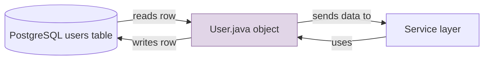

### What a Model Does

| Job | Example |
|-----|---------|
| Hold data from one DB row | A `User` object holds one user's email, password hash, etc. |
| Define the data structure | `private String email;` — every user has an email |
| Move data between layers | Controller → Service → DAO → Database and back |
| Keep data organized | Instead of passing 10 separate variables, pass one `User` object |

### Our Models in This Project

| Model | Database Table | What It Represents |
|-------|---------------|-------------------|
| `User.java` | `users` | One registered user |
| `Role.java` | `role` | A role like USER or ADMIN |
| `UserStatus.java` | `user_status` | ACTIVE or BLOCKED status |
| `UserPermission.java` | `user_permission` | ALLOWED or FORBIDDEN to generate |
| `Language.java` | `language` | EN or RU language option |
| `ContactDetail.java` | `contact_detail` | User's profile contact info |

### Code Example with Explanation

```java
// Step 1: Create a new User object (blank form)
User user = new User();

// Step 2: Fill in the fields (fill the blanks)
user.setEmail("alice@example.com");      // column: email
user.setPasswordHash("$2a$10$xyz...");  // column: password_hash
user.setRoleId(1L);                      // column: role_id (FK to role table)

// Step 3: Pass the filled object to DAO for saving
userDao.create(user);
// → DAO extracts values: user.getEmail(), user.getPasswordHash()...
// → Builds SQL: INSERT INTO users (email, password_hash, role_id) VALUES (?, ?, ?)
// → Sends to PostgreSQL
```

### Model vs DTO vs DAO — The Difference at a Glance

| Concept | Job | Example |
|---------|-----|---------|
| **Model** | Represents a DB row | `User.java` maps to `users` table |
| **DTO** | Carries data between frontend and backend | `RegisterRequest.java` carries email + password from browser |
| **DAO** | Talks to the database | `UserDao.java` runs SQL queries |

### Key Rules for Models

1. **One Model = One Table** — `User.java` ↔ `users` table. Never mix tables.
2. **Field names match column names** (slightly different is OK, but close).
3. **Use wrapper types** for nullable columns (`Long` not `long`, `LocalDateTime` not `LocalDateTime`).
4. **Add `equals()` and `hashCode()`** based on `id` — needed for collections and testing.
5. **Keep `toString()` clean** — never include passwords in toString.

---

## DTO — What It Is and How It Works

### What Is a DTO?

**DTO** = **D**ata **T**ransfer **O**bject.

A DTO is a simple Java class that carries data between the frontend (Vue browser app) and the backend (Java server). Unlike a Model, a DTO does NOT represent a database table.

```java
// RegisterRequest.java — carries registration data from browser to server
public class RegisterRequest {
    @NotBlank(message = "Email is required")
    @Email(message = "Invalid email format")
    private String email;

    @NotBlank(message = "Password is required")
    @Size(min = 8, message = "Password must be at least 8 characters")
    private String password;

    private String passwordConfirmation;
    // ...getters and setters...
}
```

### ELI5: DTO is a *shipping box*

Imagine you're ordering something online:
```
┌────────────────────────┐
│     SHIPPING BOX       │
│                        │
│  Contains: email       │
│            password    │
│            rememberMe  │
│                        │
│  Label: "LoginRequest" │
└────────────────────────┘
```

The **DTO is the shipping box**. You put data inside (email, password), seal it with validation tape (`@NotBlank`, `@Email`), and ship it from the browser to the server. The server opens the box, takes out the data, and processes it.

### The Data Flow

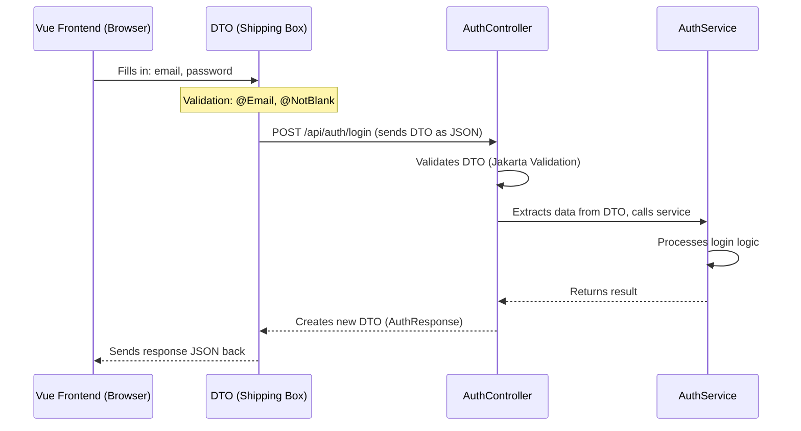

### Why We Need DTOs (Not Models)

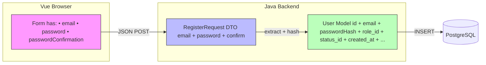

The browser sends only 3 fields (email, password, confirm). But the database stores 15+ columns (id, passwordHash, roleId, statusId, timestamps, etc.). **DTO = what the user sends. Model = what the database stores.** They're different shapes for different jobs.

### Our DTOs in This Project

| DTO | Direction | What It Carries |
|-----|-----------|----------------|
| `RegisterRequest` | Browser → Server | email, password, passwordConfirmation |
| `LoginRequest` | Browser → Server | email, password, rememberMe |
| `AuthResponse` | Server → Browser | success, role, message, redirectUrl |
| `UserSession` | Server-side only | userId, email, role (stored in HttpSession) |

### Code Example with Line-by-Line Explanation

```java
// ====== The DTO ======
public class RegisterRequest {
    
    @NotBlank(message = "{auth.email.required}")   // 1: email can't be empty
    @Email(message = "{auth.email.invalid}")        // 2: must be valid email format
    @Size(max = 255)                                 // 3: max length
    private String email;                            // 4: the actual data field
    
    @NotBlank(message = "{auth.password.required}")
    @Size(min = 8, max = 128)
    private String password;
    
    private String passwordConfirmation;             // 5: no @NotBlank — validated in controller
    
    // Setter also trims and lowercases email automatically
    public void setEmail(String email) {
        this.email = email != null ? email.trim().toLowerCase() : null;
    }
}

// ====== How the controller uses the DTO ======
@PostMapping("/api/auth/register")
public AuthResponse register(@Valid @RequestBody RegisterRequest request) {
    // @Valid tells Spring: run all @NotBlank/@Email/@Size checks
    // If validation fails → return 400 Bad Request automatically
    
    String email = request.getEmail();          // extract from DTO
    String password = request.getPassword();    // extract from DTO
    
    authService.register(request);              // pass DTO to service
    return AuthResponse.success("USER", "/home");
}
```

### Key Rules for DTOs

1. **DTOs have validation annotations** — `@NotBlank`, `@Email`, `@Size` on the fields.
2. **DTOs are NOT stored in the database** — they're temporary messaging objects.
3. **Never put sensitive data in DTO `toString()`** — no passwords, no tokens.
4. **DTOs can have factory methods** — `AuthResponse.success()` and `AuthResponse.failure()` for clean creation.
5. **One DTO per request/response shape** — don't reuse the same DTO for different endpoints if the fields differ.

### Beginner Mistake: Using Model as DTO

```java
// ❌ WRONG: Exposing the Model directly to the browser
@PostMapping("/api/auth/register")
public User register(@RequestBody User user) {
    // User model has passwordHash field!
    // Browser could set ANY field including role_id, is_privileged, etc.
}

// ✅ RIGHT: Using a DTO that only exposes needed fields
@PostMapping("/api/auth/register")
public AuthResponse register(@Valid @RequestBody RegisterRequest request) {
    // Browser can only send: email, password, passwordConfirmation
    // Server controls: role, status, permission, etc.
}
```

---

## DAO Layer — What It Is and How It Works

### What Is a DAO?

**DAO** = **D**ata **A**ccess **O**bject.

A DAO is a Java class that talks to the database. It runs SQL queries, reads results, and converts them into Model objects.

```java
// RoleDao.java — one file = one table = one set of SQL operations
public class RoleDao {
    // SQL query written as a constant
    private static final String SELECT_BY_CODE = 
        "SELECT id, code, name FROM role WHERE code = ?";
    
    public Role findByCode(String code) {
        // 1. Get connection from pool
        // 2. Create PreparedStatement with SQL
        // 3. Set parameters (the "?" in SQL)
        // 4. Execute query
        // 5. Convert ResultSet → Role object
        // 6. Return Role (or null if not found)
    }
}
```

### ELI5: DAO is a *restaurant kitchen order*

```
You (waiter)             Kitchen (DAO)          Pantry (Database)
    │                        │                       │
    │ "I need Role: USER"    │                       │
    │───────────────────────>│                       │
    │                        │  "SELECT * FROM role  │
    │                        │   WHERE code = 'USER'"│
    │                        │──────────────────────>│
    │                        │                       │
    │                        │  "Here's the row:"    │
    │                        │<──────────────────────│
    │                        │  id=1, code=USER      │
    │                        │  name=Regular User    │
    │                        │                       │
    │   Role{id=1,           │                       │
    │   code="USER"}         │                       │
    │<───────────────────────│                       │
```

The **DAO is the kitchen**: you tell it what you need (findByCode), it prepares the SQL (recipe), talks to the database (pantry), and serves you back a ready-to-use object (dish).

### The Full Request Flow

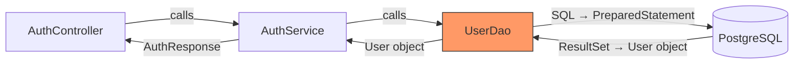

### Three Rules of DAO

1. **One DAO = One Table** — `UserDao.java` only talks to `users` table
2. **All SQL via PreparedStatement** — never concatenate strings (prevents SQL injection)
3. **Each method = one SQL operation** — `findByEmail()`, `create()`, `updateLoginAttempts()`

### PreparedStatement: Why It Matters

```java
// ❌ DANGEROUS: String concatenation (SQL injection risk)
String sql = "SELECT * FROM users WHERE email = '" + userInput + "'";
// If userInput = "admin' OR '1'='1" → deletes all users!

// ✅ SAFE: PreparedStatement with ? placeholders
String sql = "SELECT * FROM users WHERE email = ?";
PreparedStatement stmt = connection.prepareStatement(sql);
stmt.setString(1, userInput);  // Database treats this as VALUE, not SQL code
ResultSet rs = stmt.executeQuery();
// Even if userInput = "admin' OR '1'='1", database treats it as a literal string
```

### Live Example: UserDao.create()

```java
public class UserDao {
    // STEP 1: Define SQL as a constant (stored once, never changes)
    // ? = placeholder, filled by stmt.setXxx()
    private static final String INSERT = 
        "INSERT INTO users (email, password_hash, role_id, status_id, permission_id) " +
        "VALUES (?, ?, ?, ?, ?)";

    private final DataSource dataSource;  // Connection pool (gives us DB connections)

    public UserDao(DataSource dataSource) {
        this.dataSource = dataSource;
    }

    public void create(User user) {
        // STEP 2: try-with-resources = auto-closes connection + statement
        try (Connection conn = dataSource.getConnection();      // Get DB connection
             PreparedStatement stmt = conn.prepareStatement(INSERT)) {  // Prepare SQL
             
            // STEP 3: Fill in placeholders (index starts at 1)
            stmt.setString(1, user.getEmail());          // 1st ? → email
            stmt.setString(2, user.getPasswordHash());   // 2nd ? → password
            stmt.setLong(3, user.getRoleId());           // 3rd ? → role_id
            stmt.setLong(4, user.getStatusId());         // 4th ? → status_id
            stmt.setLong(5, user.getPermissionId());     // 5th ? → permission_id
            
            // STEP 4: Execute
            stmt.executeUpdate();  // executeUpdate() for INSERT/UPDATE/DELETE
            
        } catch (SQLException e) {
            // STEP 5: Handle errors
            throw new RuntimeException("Database error", e);
        }
        // STEP 6: Connection + Statement auto-closed (try-with-resources)
    }
}
```

### Converting Database Results to Java Objects

```java
public User findByEmail(String email) {
    try (Connection conn = dataSource.getConnection();
         PreparedStatement stmt = conn.prepareStatement(SELECT_BY_EMAIL)) {
        
        stmt.setString(1, email);          // Fill in the email
        
        try (ResultSet rs = stmt.executeQuery()) {  // Execute SELECT
            if (rs.next()) {                        // If a row was found
                return mapRow(rs);                  // Convert to Java object
            }
        }
        return null;  // No user with this email
        
    } catch (SQLException e) {
        throw new RuntimeException("Database error", e);
    }
}

// Helper: converts one database row → one Java object
private User mapRow(ResultSet rs) throws SQLException {
    User user = new User();
    user.setId(rs.getObject("id", UUID.class));           // UUID column
    user.setEmail(rs.getString("email"));                  // VARCHAR column
    user.setPasswordHash(rs.getString("password_hash"));   // VARCHAR column
    user.setRoleId(rs.getLong("role_id"));                 // BIGINT column
    user.setStatusId(rs.getLong("status_id"));
    user.setFailedLoginAttempts(rs.getInt("failed_login_attempts"));
    user.setCreatedAt(rs.getObject("created_at", LocalDateTime.class));  // TIMESTAMP
    return user;
}
```

### Our DAOs in This Project

| DAO | Operations | Why Needed |
|-----|-----------|------------|
| `UserDao` | create, findByEmail, findById, updateLoginAttempts, resetLoginAttempts | Register + Login + rate limiting |
| `RoleDao` | findByCode | Check if user is USER or ADMIN |
| `UserStatusDao` | findByCode | Check if user is ACTIVE or BLOCKED |
| `UserPermissionDao` | findByCode | Check if user can generate resumes |
| `LanguageDao` | findByCode | Read language options |
| `ContactDetailDao` | create | Create empty profile on registration |

### The Three Layers Working Together

```mermaid
flowchart TB
    subgraph Browser [Vue Frontend]
        FORM["Registration form (email + password)"]
    end
    
    subgraph Controller [Controller Layer]
        AC["AuthController • Receives HTTP request • Validates DTO (@Valid) • Calls service • Returns response"]
    end
    
    subgraph Service [Service Layer]
        AS["AuthService • Business logic • Password hashing (BCrypt) • Transaction management • Error handling"]
    end
    
    subgraph DAO [Data Access Layer]
        UD["UserDao • INSERT users • SELECT users"]
        CD["ContactDetailDao • INSERT contact_detail"]
    end
    
    subgraph DB [(PostgreSQL)]
        UT[users table]
        CT[contact_detail table]
    end
    
    FORM -->|"POST /api/auth/register JSON: {email, password}"| AC
    AC -->|"RegisterRequest DTO"| AS
    AS -->|"User object"| UD
    AS -->|"ContactDetail object"| CD
    UD -->|"INSERT INTO users ..."| UT
    CD -->|"INSERT INTO contact_detail ..."| CT
    UT -->|"Row inserted"| UD
    CT -->|"Row inserted"| CD
    UD -->|"success"| AS
    CD -->|"success"| AS
    AS -->|"AuthResponse{success:true}"| AC
    AC -->|"JSON 200 OK"| FORM
    
    style Controller fill:#bbf,stroke:#333
    style Service fill:#bfb,stroke:#333
    style DAO fill:#f96,stroke:#333
```

### Beginner Mistake: Doing SQL in the Controller

```java
// ❌ WRONG: SQL in controller (mixes responsibilities, hard to test)
@PostMapping("/api/auth/login")
public String login(...) {
    Connection conn = dataSource.getConnection();
    PreparedStatement stmt = conn.prepareStatement("SELECT * FROM users WHERE email = ?");
    // ...20 lines of SQL code in the controller...
}

// ✅ RIGHT: Controller calls Service, Service calls DAO, DAO runs SQL
@PostMapping("/api/auth/login")
public AuthResponse login(@Valid @RequestBody LoginRequest request) {
    return authService.authenticate(request);  // Clean, testable, single responsibility
}
```

---

## Summary: How It All Connects

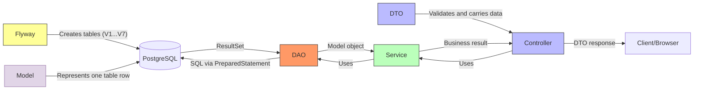

| Component | Tagline | Job |
|-----------|---------|-----|
| **Flyway** | 🏗️ DB architect | Creates tables automatically in order |
| **Model** | 📋 Data blueprint | One Java class = one database table row |
| **DTO** | 📦 Shipping box | Carries validated data between browser and server |
| **DAO** | 🍳 Kitchen chef | Runs SQL, converts database rows to Java objects |
| **Service** | 🧠 Brain of the operation | Business logic, validation, transaction management |
| **Controller** | 🚪 Front door / Receptionist | Receives HTTP requests, delegates to Service, returns response |
| **Exception** | 🚨 Alarm system | Carries error codes and messages when something goes wrong |

---

## Service Layer — What It Is and How It Works

### What Is a Service?

A **Service** is a Java class that contains **business logic**. It sits between the Controller (which handles HTTP) and the DAO (which handles the database). The Service decides WHAT should happen. The Controller decides WHEN to call the Service. The DAO decides HOW to store it.

```java
// AuthService.java — contains the business logic for registration
public class AuthService {
    
    public User register(RegisterRequest request) {
        // 1. Validate business rules
        // 2. Check email uniqueness
        // 3. Hash password (BCrypt)
        // 4. Create User + ContactDetail in one transaction
        // 5. Return created User
    }
}
```

### ELI5: Service is the *restaurant manager*

Imagine a restaurant:
```
  Customer           Waiter (Controller)         Manager (Service)          Kitchen (DAO)
     │                      │                          │                       │
     │ "I'd like pasta"     │                          │                       │
     │─────────────────────>│                          │                       │
     │                      │  "Customer wants pasta"  │                       │
     │                      │─────────────────────────>│                       │
     │                      │                          │                       │
     │                      │                          │  "Do we have pasta?"  │
     │                      │                          │──────────────────────>│
     │                      │                          │  "Yes, in stock"      │
     │                      │                          │<──────────────────────│
     │                      │                          │                       │
     │                      │  "Make pasta + salad"    │                       │
     │                      │  (two things, must be    │                       │
     │                      │   ready together)        │                       │
     │                      │─────────────────────────>│                       │
     │                      │                          │─── Cook pasta ───────>│
     │                      │                          │─── Make salad ───────>│
     │                      │                          │                       │
     │                      │                          │"Both ready, serve!"   │
     │                      │<─────────────────────────│                       │
     │    "Here's your meal"│                          │                       │
     │<─────────────────────│                          │                       │
```

The **Manager (Service)** makes decisions: checks if the request is valid, coordinates multiple departments (UserDao + ContactDetailDao), ensures everything happens in the right order (transaction), and handles problems if something goes wrong.

### What a Service Does

| Job | Example |
|-----|---------|
| **Business rules** | "Password must be at least 8 characters with uppercase, lowercase, digit" |
| **Validation logic** | "Email is already registered? Reject." |
| **Transaction management** | "Create user AND profile — both or neither" |
| **Coordination** | "Call UserDao, then ContactDetailDao, in order" |
| **Error handling** | "Database error? Wrap in ServiceException with error code" |
| **Security** | "Hash password before storing. Never log plaintext passwords." |

### The Big Picture

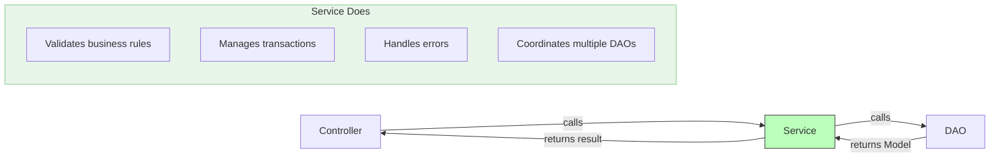

### Code Example with Line-by-Line Explanation

```java
public class AuthService {

    // === Dependencies (Injected via constructor) ===
    private final UserDao userDao;             // To create/find users
    private final RoleDao roleDao;             // To look up default role
    private final ContactDetailDao contactDetailDao; // To create empty profile
    private final PasswordService passwordService;   // To hash passwords
    private final DataSource dataSource;       // For transaction management

    public AuthService(UserDao userDao, RoleDao roleDao,
                       ContactDetailDao contactDetailDao,
                       PasswordService passwordService,
                       DataSource dataSource) {
        // Constructor injection — all dependencies are passed in
        // This makes testing easy: pass mocks instead of real objects
        this.userDao = userDao;
        // ...
    }

    public User register(RegisterRequest request) {
        // STEP 1: Validate business rules
        if (!request.getPassword().equals(request.getPasswordConfirmation())) {
            // Business rule: passwords must match
            throw new ServiceException("auth.password.mismatch", "Passwords do not match");
        }

        // STEP 2: Check password strength (business rule)
        if (!passwordService.isStrongPassword(request.getPassword())) {
            throw new ServiceException("auth.password.weak", "Password too weak");
        }

        // STEP 3: Check email uniqueness
        String email = request.getEmail().toLowerCase().trim();
        User existing = userDao.findByEmail(email);
        if (existing != null) {
            throw new ServiceException("auth.email.alreadyRegistered", "Email taken");
        }

        // STEP 4: Hash the password (security — never store plaintext)
        String passwordHash = passwordService.hashPassword(request.getPassword());

        // STEP 5: Create User entity
        User user = new User();
        user.setEmail(email);
        user.setPasswordHash(passwordHash);
        user.setRoleId(userRole.getId());   // Default: USER role
        user.setStatusId(1L);               // Default: ACTIVE status
        user.setPermissionId(1L);           // Default: ALLOWED permission

        // STEP 6: Execute in a JDBC TRANSACTION
        // Both User and ContactDetail must be created ATOMICALLY
        Connection conn = null;
        try {
            conn = dataSource.getConnection();       // Get DB connection
            conn.setAutoCommit(false);               // START TRANSACTION

            userDao.create(user, conn);              // 1st operation: create user
            ContactDetail cd = ContactDetail.createEmpty(user.getId());
            contactDetailDao.create(cd, conn);       // 2nd operation: create profile

            conn.commit();                           // ✅ COMMIT — both saved
            log.info("User registered: {}", email);
            return user;

        } catch (SQLException e) {
            if (conn != null) conn.rollback();       // ❌ ROLLBACK — neither saved
            throw new ServiceException("auth.registration.failed", "DB error", e);
        } finally {
            if (conn != null) conn.close();          // Always close connection
        }
    }
}
```

### Why Service Exists (Not Just Put Logic in Controller)

```java
// ❌ WRONG: Business logic in Controller (fat controller anti-pattern)
@PostMapping("/api/auth/register")
public ResponseEntity<?> register(@RequestBody RegisterRequest req) {
    if (!req.getPassword().equals(req.getPasswordConfirmation())) {
        return ResponseEntity.badRequest().body("Passwords don't match");
    }
    // ... 50 more lines of business logic ...
    Connection conn = dataSource.getConnection();
    // ... SQL code in controller ...
}

// ✅ RIGHT: Controller is thin, Service has the logic
@PostMapping("/api/auth/register")
public ResponseEntity<AuthResponse> register(@Valid @RequestBody RegisterRequest req) {
    User user = authService.register(req);  // ONE LINE — delegate to service
    // ... just session/response handling ...
}
```

### Why Controller Calls Service, Not DAO Directly

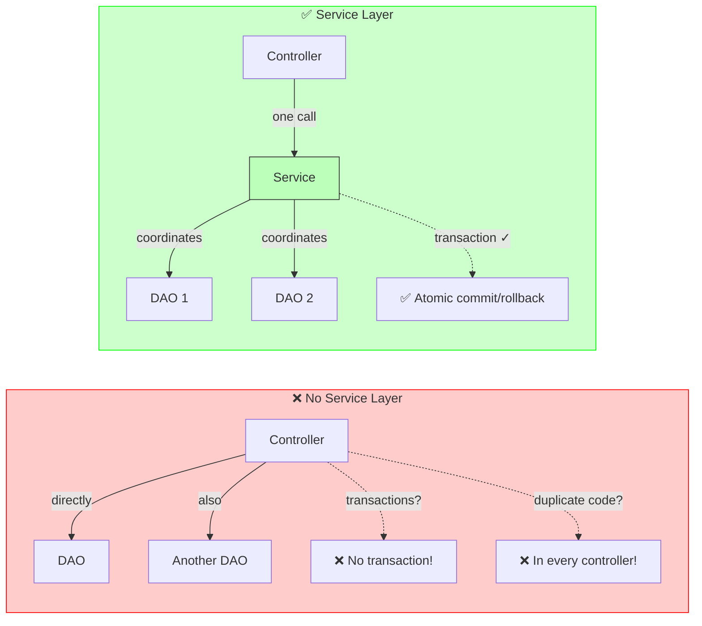

### Key Rules for Services

1. **One method = one business operation** — `register()`, `authenticate()`, `logout()`
2. **Service calls DAO, never the other way** — dependencies flow: Controller → Service → DAO
3. **Service manages transactions** — gets Connection, setAutoCommit(false), commit/rollback
4. **Service throws ServiceException** — with error codes for i18n
5. **Service is testable** — all dependencies are injected via constructor (easy to mock)
6. **Service never handles HTTP** — no `HttpServletRequest`, no `@RequestMapping`

---

## Controller Layer — What It Is and How It Works

### What Is a Controller?

A **Controller** is a Java class that handles HTTP requests. It's the "front door" of your backend. The browser sends an HTTP request → the Controller receives it → calls the Service → returns an HTTP response.

```java
@RestController
@RequestMapping("/api/auth")
public class AuthController {

    @PostMapping("/register")
    public ResponseEntity<AuthResponse> register(
            @Valid @RequestBody RegisterRequest request,
            HttpSession session) {
        // 1. Receive HTTP request with JSON body
        // 2. Validate it (@Valid)
        // 3. Call Service
        // 4. Create session
        // 5. Return HTTP response
    }
}
```

### ELI5: Controller is the *receptionist at a company*

```
  Visitor (Browser)          Receptionist (Controller)       Manager (Service)
        │                             │                          │
        │ "I want to register"        │                          │
        │ POST /api/auth/register     │                          │
        │ {email, password}           │                          │
        │────────────────────────────>│                          │
        │                             │                          │
        │                             │  "Processing..."         │
        │                             │─────────────────────────>│
        │                             │                          │
        │                             │  "Done! Here's the       │
        │                             │   result"                │
        │                             │<─────────────────────────│
        │                             │                          │
        │ "200 OK"                    │                          │
        │ {success: true,             │                          │
        │  redirectUrl: '/home'}      │                          │
        │<────────────────────────────│                          │
```

The **Receptionist (Controller)**:
1. **Takes the request** (HTTP POST with JSON body)
2. **Checks the form is filled correctly** (@Valid — "is the email field filled?")
3. **Finds the right person** (calls AuthService)
4. **Gets the result** and **writes a response** (HTTP 200 with JSON)
5. **Never does the actual work** — that's for the Service/Manager

### Controller Annotations Explained

```java
@RestController                    // 1: This class handles HTTP + returns JSON automatically
@RequestMapping("/api/auth")       // 2: All URLs in this class start with /api/auth
public class AuthController {

    private final AuthService authService;  // 3: Service dependency

    public AuthController(AuthService authService) {  // 4: Constructor injection
        this.authService = authService;
    }

    @PostMapping("/register")      // 5: This method handles POST /api/auth/register
    public ResponseEntity<AuthResponse> register(
            @Valid @RequestBody RegisterRequest request,  // 6: @Valid = validate the JSON body
                                                          //    @RequestBody = deserialize JSON → Java object
            HttpSession session) {   // 7: Spring auto-injects the HTTP session

        // 8: Delegate to Service
        User user = authService.register(request);

        // 9: Create session (auto-login)
        UserSession userSession = new UserSession(user.getId(), user.getEmail(), "USER");
        session.setAttribute("user", userSession);

        // 10: Return response (Spring auto-serializes AuthResponse → JSON)
        return ResponseEntity.ok(AuthResponse.success("USER", "/home"));
    }
}
```

### HTTP Status Codes — The Controller's Vocabulary

| Code | Meaning | When to Use |
|------|---------|-------------|
| **200 OK** | Success | Registration successful, login successful |
| **400 Bad Request** | Invalid input | Validation failed, passwords don't match |
| **401 Unauthorized** | Not authenticated | Wrong password, expired session |
| **409 Conflict** | Duplicate | Email already registered |
| **423 Locked** | Temporarily blocked | Too many failed login attempts |
| **500 Internal Server Error** | Server broken | Database connection failed |

### Controller With Error Handling

```java
@PostMapping("/register")
public ResponseEntity<AuthResponse> register(
        @Valid @RequestBody RegisterRequest request,
        HttpSession session) {

    try {
        User user = authService.register(request);
        // Success → 200 OK
        return ResponseEntity.ok(AuthResponse.success("USER", "/home"));

    } catch (ServiceException e) {
        // Business logic error → map to appropriate HTTP status
        HttpStatus status = switch (e.getErrorCode()) {
            case "auth.email.alreadyRegistered" -> HttpStatus.CONFLICT;     // 409
            case "auth.password.weak",
                 "auth.password.mismatch"       -> HttpStatus.BAD_REQUEST;  // 400
            default                             -> HttpStatus.INTERNAL_SERVER_ERROR; // 500
        };

        return ResponseEntity.status(status)
                .body(AuthResponse.failure(e.getMessage()));
    }
}
```

### The Controller Flow (Complete Picture)

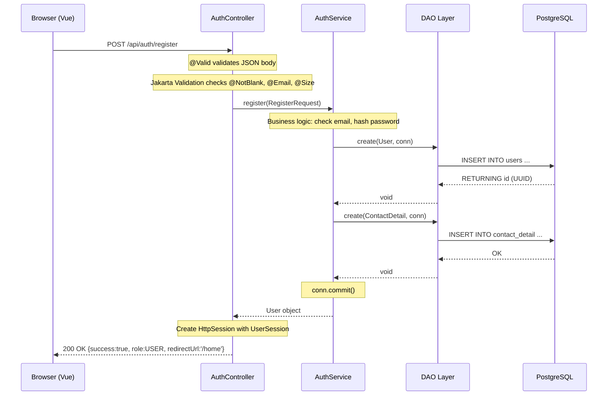

### Controller Testing with MockMvc

```java
class AuthControllerTest {

    private MockMvc mockMvc;
    private AuthService authService;

    @BeforeEach
    void setUp() {
        authService = mock(AuthService.class);           // Mock the Service

        AuthController controller = new AuthController(authService);

        // Standalone setup — only this controller, no full Spring context
        mockMvc = standaloneSetup(controller)
                .setMessageConverters(new MappingJackson2HttpMessageConverter(new ObjectMapper()))
                .build();
    }

    @Test
    void register_validInput_returns200() throws Exception {
        // Arrange: make the mock Service return a User
        User user = new User();
        user.setId(UUID.randomUUID());
        user.setEmail("test@example.com");
        when(authService.register(any(RegisterRequest.class))).thenReturn(user);

        // Act + Assert: send HTTP request, verify response
        mockMvc.perform(post("/api/auth/register")
                        .contentType(MediaType.APPLICATION_JSON)
                        .content("""{"email":"test@example.com","password":"StrongPass1","passwordConfirmation":"StrongPass1"}"""))
                .andExpect(status().isOk())                              // HTTP 200
                .andExpect(jsonPath("$.success").value(true))            // JSON field check
                .andExpect(jsonPath("$.role").value("USER"));
    }
}
```

### Key Rules for Controllers

1. **Controller is thin** — one line to call Service, then handle response
2. **No business logic in Controller** — that's the Service's job
3. **No SQL in Controller** — that's the DAO's job
4. **@Valid for input validation** — Jakarta Validation annotations on DTO fields
5. **Controller returns HTTP-specific things** — status codes, response headers, sessions
6. **One method per endpoint** — `@PostMapping("/register")`, `@PostMapping("/login")`, etc.

---

## Exception Layer — What It Is and How It Works

### What Is an Exception?

An **Exception** is a Java class that carries error information when something goes wrong. In a layered architecture, we create **custom exceptions** that carry error codes (for i18n) and structured error messages, instead of throwing generic `RuntimeException`.

```java
// ServiceException.java — a custom exception for business logic errors
public class ServiceException extends RuntimeException {
    
    private final String errorCode;  // "auth.email.alreadyRegistered"
    
    public ServiceException(String errorCode, String message) {
        super(message);           // Pass message to parent (RuntimeException)
        this.errorCode = errorCode;
    }
    
    public String getErrorCode() {
        return errorCode;         // The Controller uses this to pick HTTP status
    }
}
```

### ELI5: Exception is a *fire alarm with a label*

```
Generic fire alarm:         🔔 BEEP BEEP BEEP! (What's on fire? Where?)

Custom fire alarm:          🔔 "KITCHEN FIRE - Use extinguisher #3"
                            🔔 "SERVER ROOM - Call electrician"
                            🔔 "BASEMENT FLOOD - Call plumber"
```

A generic exception (`RuntimeException`) just says "Something broke! 💥".  
A custom exception (`ServiceException`) says:

```
"Registration failed! 
 → Error code: auth.email.alreadyRegistered 
 → Message: 'Email already registered'
 → For the UI: show this message in the user's language"
```

### The Three Exception Partners

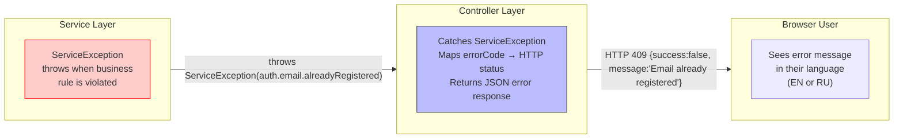

### Why Custom Exceptions (Not Just RuntimeException)

```java
// ❌ WITHOUT custom exception — the Controller doesn't know what went wrong
throw new RuntimeException("Email already registered");
// Controller catches it... but what status code? 400? 409? 500?
// It has NO IDEA. So it returns 500 Internal Server Error. Wrong!

// ✅ WITH ServiceException — the Controller knows exactly what to do
throw new ServiceException("auth.email.alreadyRegistered", "Email already registered");
// Controller catches it, reads getErrorCode() → "auth.email.alreadyRegistered"
// → Maps to HttpStatus.CONFLICT (409)
// → Returns JSON with the message
// → Frontend shows the message in the user's language
```

### The Error Flow (End to End)

```java
// STEP 1: Service detects a problem and throws ServiceException
if (existing != null) {
    throw new ServiceException(
        "auth.email.alreadyRegistered",  // error code (for i18n)
        "Email already registered"        // default message (English)
    );
}

// STEP 2: Controller catches it and maps to HTTP status + JSON
try {
    return authService.register(request);
} catch (ServiceException e) {
    HttpStatus status = switch (e.getErrorCode()) {
        case "auth.email.alreadyRegistered" -> HttpStatus.CONFLICT;     // 409
        // ...
    };
    return ResponseEntity.status(status)
            .body(AuthResponse.failure(e.getMessage()));
}

// STEP 3: Frontend receives structured JSON error
// HTTP 409
// {
//   "success": false,
//   "role": null,
//   "message": "Email already registered",
//   "redirectUrl": null
// }

// STEP 4: Frontend uses i18n to show the message
// If language = ru → shows "Email уже зарегистрирован"
// If language = en → shows "Email already registered"
```

### Exception Hierarchy

```
java.lang.RuntimeException
    └── ServiceException          ← Our custom exception
            ├── errorCode: String  ← "auth.email.alreadyRegistered"
            └── message: String   ← "Email already registered"
```

### Error Codes in This Project

| Error Code | HTTP Status | Message (EN) | When |
|-----------|-------------|--------------|------|
| `auth.email.alreadyRegistered` | 409 Conflict | Email already registered | Duplicate registration |
| `auth.password.mismatch` | 400 Bad Request | Passwords do not match | Confirmation != Password |
| `auth.password.weak` | 400 Bad Request | Password too weak | Doesn't meet requirements |
| `auth.registration.failed` | 500 Server Error | Registration failed | Database error during registration |
| `auth.role.notFound` | 500 Server Error | Default role not found | Role table is empty (setup issue) |

### Key Rules for Exceptions

1. **Custom exceptions carry error codes** — the code is a string key for i18n message lookup
2. **Service throws, Controller catches** — the boundary between business logic and HTTP
3. **Never expose stack traces to the client** — return user-friendly messages only
4. **Log the full error server-side** — stack traces in server logs, not in HTTP responses
5. **One exception class per layer** — `ServiceException` for all business errors
6. **Error codes are hierarchical** — `auth.email.alreadyRegistered`, `auth.password.weak`

---

## Final Summary: The Complete Request Flow

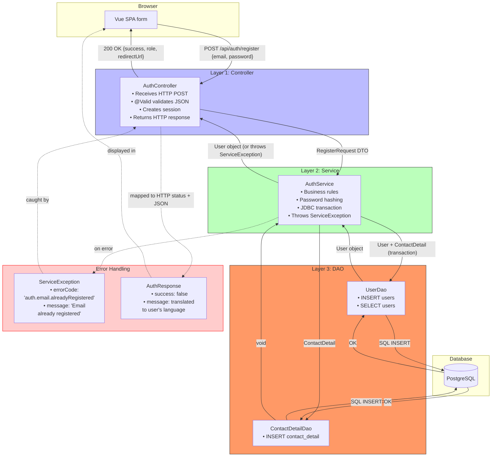

| Component | Tagline | Job | Lives in |
|-----------|---------|-----|----------|
| **Flyway** | 🏗️ DB architect | Creates tables in order | `db/migration/` |
| **Model** | 📋 Data blueprint | One Java class = one DB row | `model/` |
| **DTO** | 📦 Shipping box | Carries validated data between browser and server | `dto/` |
| **DAO** | 🍳 Kitchen chef | Runs SQL, converts rows to Java objects | `dao/` |
| **Service** | 🧠 Brain | Business logic, transactions, coordination | `service/` |
| **Controller** | 🚪 Receptionist | Handles HTTP, validates, delegates, responds | `controller/` |
| **Exception** | 🚨 Alarm | Error code + message for structured errors | `exception/` |
| **Interceptor** | 🛂 Security checkpoint | Checks session before controller, path-based rules | `interceptor/` |
| **Filter** | 🚧 Metal detector | Low-level request/response preprocessing (CSRF, encoding) | `filter/` |

---

## Interceptor — What It Is and How It Works

### What Is an Interceptor?

An **Interceptor** (HandlerInterceptor in Spring) is a Java class that "intercepts" HTTP requests **before they reach your Controller**. It can decide: let the request through (return `true`) or block it and return an error (return `false`).

```java
// AuthInterceptor.java — checks if user is logged in before accessing protected routes
public class AuthInterceptor implements HandlerInterceptor {

    @Override
    public boolean preHandle(HttpServletRequest request,
                             HttpServletResponse response,
                             Object handler) throws Exception {

        HttpSession session = request.getSession(false);
        if (session != null && session.getAttribute("user") != null) {
            return true;  // ✅ Let the request through
        }

        // ❌ Block — send 401 Unauthorized
        response.setStatus(401);
        response.getWriter().write("{\"error\":\"Unauthorized\"}");
        return false;
    }
}
```

### ELI5: Interceptor is a *security checkpoint at the office entrance*

```
  Visitor                     Security Checkpoint (Interceptor)         Office (Controller)
    │                                │                                      │
    │ "I want to see the            │                                      │
    │  manager on floor 3"          │                                      │
    │ ─────────────────────────────>│                                      │
    │                                │                                      │
    │                                │ "Do you have a badge?"               │
    │                                │ (checks HttpSession for "user")      │
    │                                │                                      │
    │   "No, I don't"               │                                      │
    │ <─────────────────────────────│                                      │
    │    (401 Unauthorized)         │                                      │
    │                                │                                      │
    │                                │ vs.                                  │
    │                                │                                      │
    │ "I work here, here's          │                                      │
    │  my badge"                    │                                      │
    │ ─────────────────────────────>│                                      │
    │                                │ "Badge valid! Proceed to floor 3"  │
    │                                │ ───────────────────────────────────>│
    │                                │       (Controller handles request)  │
```

The **Interceptor is the security checkpoint**. It checks your badge before letting you into the office. No badge? No entry.

### Where Interceptor Sits in the Request Flow

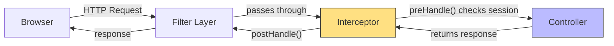

An Interceptor runs **between the Filter and the Controller**. It's closer to the Controller than a Filter is.

### Path Pattern Matching

Interceptors can be configured to only apply to certain URL paths:

```java
// In WebConfig.java — register interceptor with path rules
@Override
public void addInterceptors(InterceptorRegistry registry) {
    registry.addInterceptor(authInterceptor())
            .addPathPatterns("/api/**")              // Apply to /api/users, /api/resumes, etc.
            .excludePathPatterns("/api/auth/**");     // But NOT to /api/auth/login, /api/auth/register
}
```

Path patterns use Ant-style matchers:

| Pattern | Matches | Doesn't Match |
|---------|---------|---------------|
| `/api/**` | `/api/users`, `/api/auth/login` | `/`, `/home` |
| `/api/auth/*` | `/api/auth/login` | `/api/auth/login/extra` |
| `/api/**` but exclude `/api/auth/**` | `/api/users/me` | `/api/auth/login` |

### Interceptor vs Filter — The Differences at a Glance

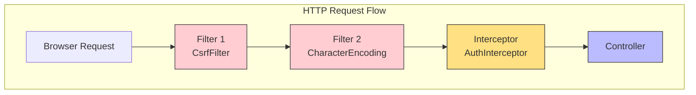

| Feature | Filter | Interceptor |
|---------|--------|-------------|
| **Level** | Servlet level (lower) | Spring MVC level (higher) |
| **Knows about** | `ServletRequest`, `ServletResponse` | Controller, Handler mapping |
| **Can access** | Request, Response, Session | Request, Response, Session, Model, View |
| **Configured via** | `AppInitializer.getServletFilters()` | `WebMvcConfigurer.addInterceptors()` |
| **Path patterns** | Applied to ALL requests (unless using Spring's FilterRegistrationBean — not available in pure Spring MVC) | Built-in `addPathPatterns()` / `excludePathPatterns()` |
| **Use for** | Low-level: CSRF, encoding, CORS, compression | MVC-level: auth checks, logging, locale |
| **Can modify** | Request and Response objects | Request, Response, Model, View |

### AuthInterceptor in this Project

```java
public class AuthInterceptor implements HandlerInterceptor {

    @Override
    public boolean preHandle(HttpServletRequest request,
                             HttpServletResponse response,
                             Object handler) throws Exception {

        // Allow CORS preflight requests through
        if ("OPTIONS".equalsIgnoreCase(request.getMethod())) {
            return true;
        }

        // Check for valid session with "user" attribute
        HttpSession session = request.getSession(false);
        if (session != null && session.getAttribute("user") != null) {
            return true; // ✅ Authenticated — let through
        }

        // ❌ Not authenticated — return 401 JSON
        log.warn("Unauthorized access: {} {}", request.getMethod(), request.getRequestURI());
        response.setStatus(HttpServletResponse.SC_UNAUTHORIZED);
        response.setContentType(MediaType.APPLICATION_JSON_VALUE);

        objectMapper.writeValue(response.getWriter(), Map.of(
                "error", "Unauthorized",
                "message", "Authentication required"
        ));
        return false;
    }
}
```

### How It's Registered

```java
// WebConfig.java — step 1: @Bean
@Bean
public AuthInterceptor authInterceptor() {
    return new AuthInterceptor();
}

// WebConfig.java — step 2: register with path patterns
@Override
public void addInterceptors(InterceptorRegistry registry) {
    registry.addInterceptor(authInterceptor())
            .addPathPatterns("/api/**")           // All API paths
            .excludePathPatterns("/api/auth/**");  // Except auth endpoints
}
```

### Testing an Interceptor with MockMvc

```java
class AuthInterceptorTest {

    private MockMvc mockMvc;

    // A minimal controller for testing
    @RestController
    static class TestController {
        @GetMapping("/api/users/me")
        public String protectedEndpoint() { return "OK"; }
    }

    @BeforeEach
    void setUp() {
        mockMvc = standaloneSetup(new TestController())
                .addInterceptors(new AuthInterceptor()) // Add interceptor
                .build();
    }

    @Test
    void withoutSession_returns401() throws Exception {
        mockMvc.perform(get("/api/users/me"))
                .andExpect(status().isUnauthorized());
    }

    @Test
    void withSession_returns200() throws Exception {
        UserSession session = new UserSession(UUID.randomUUID(), "test@test.com", "USER");
        mockMvc.perform(get("/api/users/me")
                        .sessionAttr("user", session))
                .andExpect(status().isOk());
    }
}
```

> **⚠️ Important**: In standalone MockMvc, `addInterceptors()` applies interceptors to ALL paths — path pattern exclusions configured in `WebConfig` are NOT applied here. They only work when the interceptor is registered via `WebMvcConfigurer.addInterceptors()` in the actual Spring context.

### Key Rules for Interceptors

1. **Interceptor checks, Controller does the work** — interceptor only verifies conditions, doesn't handle business logic
2. **preHandle() returns boolean** — `true` = proceed, `false` = block
3. **Path patterns are configured at registration** — not in the interceptor class itself
4. **Keep interceptors thin** — one responsibility per interceptor
5. **Always allow OPTIONS** — CORS preflight requests need to pass through
6. **Interceptors run AFTER filters** — filters are lower level, interceptors are closer to controllers

---

## Filter — What It Is and How It Works

### What Is a Filter?

A **Filter** is a Java class that intercepts HTTP requests **at the Servlet level**, before they even reach Spring's DispatcherServlet. It's the outermost layer of request processing — the first thing that touches every incoming request.

```java
// CsrfFilter.java — protects against Cross-Site Request Forgery
public class CsrfFilter extends OncePerRequestFilter {

    @Override
    protected void doFilterInternal(HttpServletRequest request,
                                    HttpServletResponse response,
                                    FilterChain filterChain) throws IOException, ServletException {

        // Generate CSRF token if missing
        String token = (String) request.getSession().getAttribute("CSRF_TOKEN");
        if (token == null) {
            token = generateToken();
            request.getSession().setAttribute("CSRF_TOKEN", token);
        }

        // Set cookie so frontend can read it
        response.addCookie(new Cookie("XSRF-TOKEN", token));

        // Validate for POST/PUT/DELETE
        if (isStateChanging(request) && !tokenMatches(request, token)) {
            response.setStatus(403);
            response.getWriter().write("{\"error\":\"Invalid CSRF token\"}");
            return; // ❌ Block the request
        }

        filterChain.doFilter(request, response); // ✅ Continue to next filter/interceptor
    }
}
```

### ELI5: Filter is a *metal detector at the building entrance*

```
  Visitor                  Metal Detector (Filter)         Security Checkpoint (Interceptor)    Office
    │                              │                              │                              │
    │ "I'm entering"              │                              │                              │
    │ ───────────────────────────>│                              │                              │
    │                              │                              │                              │
    │                              │ "beep beep!                  │                              │
    │                              │  CSRF token missing!"        │                              │
    │   (403 Forbidden)           │                              │                              │
    │ <───────────────────────────│                              │                              │
    │                              │                              │                              │
    │                              │ vs.                          │                              │
    │                              │                              │                              │
    │ "I have a token"            │                              │                              │
    │ ───────────────────────────>│                              │                              │
    │                              │ "Token valid. Move along."  │                              │
    │                              │ ───────────────────────────>│                              │
    │                              │                              │ "Badge?" → "Valid!"          │
    │                              │                              │ ───────────────────────────>│
    │                              │                              │       (Controller runs)      │
```

The **Filter is the metal detector** at the building entrance. Everyone must go through it, no exceptions. It's lower-level than the security checkpoint (Interceptor) — it catches problems before the person even reaches the elevator.

### The Filter Chain

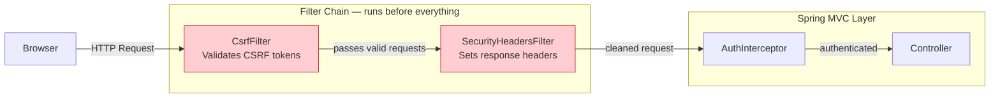

Filters run in the order they are registered. Each filter can:
1. **Block** the request (return error response)
2. **Modify** the request/response (add headers, wrap streams)
3. **Pass through** (call `filterChain.doFilter()`)

### OncePerRequestFilter: Why It Matters

```java
// Spring's OncePerRequestFilter guarantees the filter runs exactly ONCE per request.
// Without it, a filter might run multiple times if there are forward/error dispatches.

public class CsrfFilter extends OncePerRequestFilter {
    // doFilterInternal() is guaranteed to run once per request
}
```

In a normal scenario: Browser → Filter A → Filter B → Servlet → done.  
In a forwarding scenario: Browser → Filter A → Servlet → forward to error page → Filter A again! ❌

`OncePerRequestFilter` prevents the double-run problem. This is why CsrfFilter extends it, not just `implements Filter`.

### CsrfFilter in this Project

```java
public class CsrfFilter extends OncePerRequestFilter {

    private static final SecureRandom secureRandom = new SecureRandom();

    @Override
    protected void doFilterInternal(HttpServletRequest request,
                                    HttpServletResponse response,
                                    FilterChain filterChain) throws IOException, ServletException {

        HttpSession session = request.getSession(true);

        // STEP 1: Generate CSRF token if this is a new session
        String sessionToken = (String) session.getAttribute("CSRF_TOKEN");
        if (sessionToken == null) {
            sessionToken = generateToken();                     // SecureRandom 32 bytes
            session.setAttribute("CSRF_TOKEN", sessionToken);  // Store in session
        }

        // STEP 2: Set cookie for frontend (non-HTTP-only so JS can read it)
        Cookie csrfCookie = new Cookie("XSRF-TOKEN", sessionToken);
        csrfCookie.setPath("/");
        csrfCookie.setHttpOnly(false);  // ❗ Must be false — Vue needs to read it via document.cookie
        response.addCookie(csrfCookie);

        // STEP 3: Validate for state-changing requests
        String path = request.getRequestURI();
        boolean isExcluded = path.startsWith("/api/auth/") || path.startsWith("/api/public/");

        if (isStateChanging(request) && !isExcluded) {
            String headerToken = request.getHeader("X-CSRF-Token");

            if (headerToken == null || !sessionToken.equals(headerToken)) {
                // ❌ Token missing or wrong
                response.setStatus(403);
                response.getWriter().write("{\"error\":\"Invalid or missing CSRF token\"}");
                return;
            }
        }

        // ✅ All checks passed — proceed to next filter/interceptor/controller
        filterChain.doFilter(request, response);
    }

    private String generateToken() {
        byte[] bytes = new byte[32];
        secureRandom.nextBytes(bytes);
        return Base64.getUrlEncoder().withoutPadding().encodeToString(bytes);
    }
}
```

### How It's Registered (Pure Spring MVC)

In pure Spring MVC (no Spring Boot), filters are registered by overriding `getServletFilters()` in `AppInitializer`:

```java
// AppInitializer.java — registers filters for ALL requests
@Override
protected Filter[] getServletFilters() {
    return new Filter[]{
            new CsrfFilter()      // Runs on every request
    };
}
```

> **⚠️ Important**: In pure Spring MVC, do NOT use `FilterRegistrationBean` — that's a Spring Boot class and will cause compilation errors (see BUGS.md B6).

### CSRF Explained Simply

**CSRF (Cross-Site Request Forgery)** — Imagine you're logged into your bank. An attacker sends you a link to a "fun cat video" that actually contains:

```html

```

Your browser automatically sends your bank's session cookie with this request (cookies are sent with any request to that domain). The bank sees a valid session and performs the transfer.

**How the cookie-to-header pattern stops this:**

1. The bank's website sets a special CSRF token as a **non-HTTP-only cookie**
2. The bank's JavaScript reads this cookie and sends it as a **custom HTTP header** (X-CSRF-Token)
3. The attacker's `` tag can't read the cookie (different domain) and can't set the custom header
4. The server validates: request has the header AND it matches the session → safe ✅

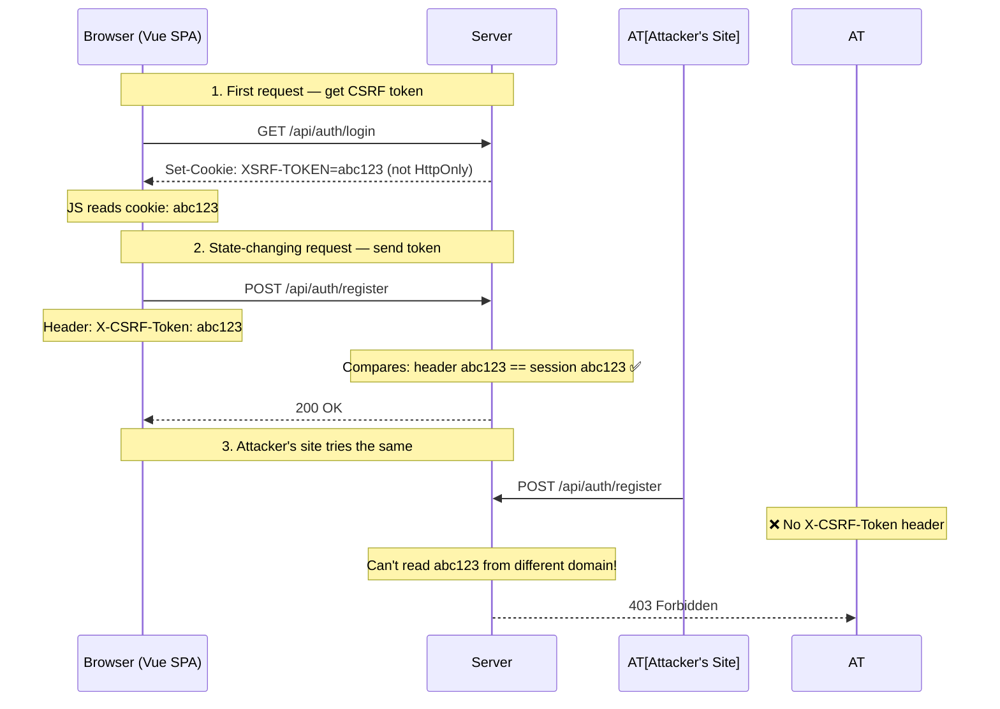

### Key Rules for Filters

1. **Filters run before Interceptors** — they're lower level
2. **OncePerRequestFilter** prevents double execution on forwards/errors
3. **Filters can't use Spring beans** (easily) — they're Servlet level, not Spring level
4. **Register via `getServletFilters()`** in pure Spring MVC — NOT `FilterRegistrationBean`
5. **Filters apply to ALL requests** — you can't easily exclude paths (unlike Interceptors with `excludePathPatterns`)
6. **Use `filterChain.doFilter()`** to pass the request to the next filter in the chain

---

## Filter vs Interceptor — When to Use What

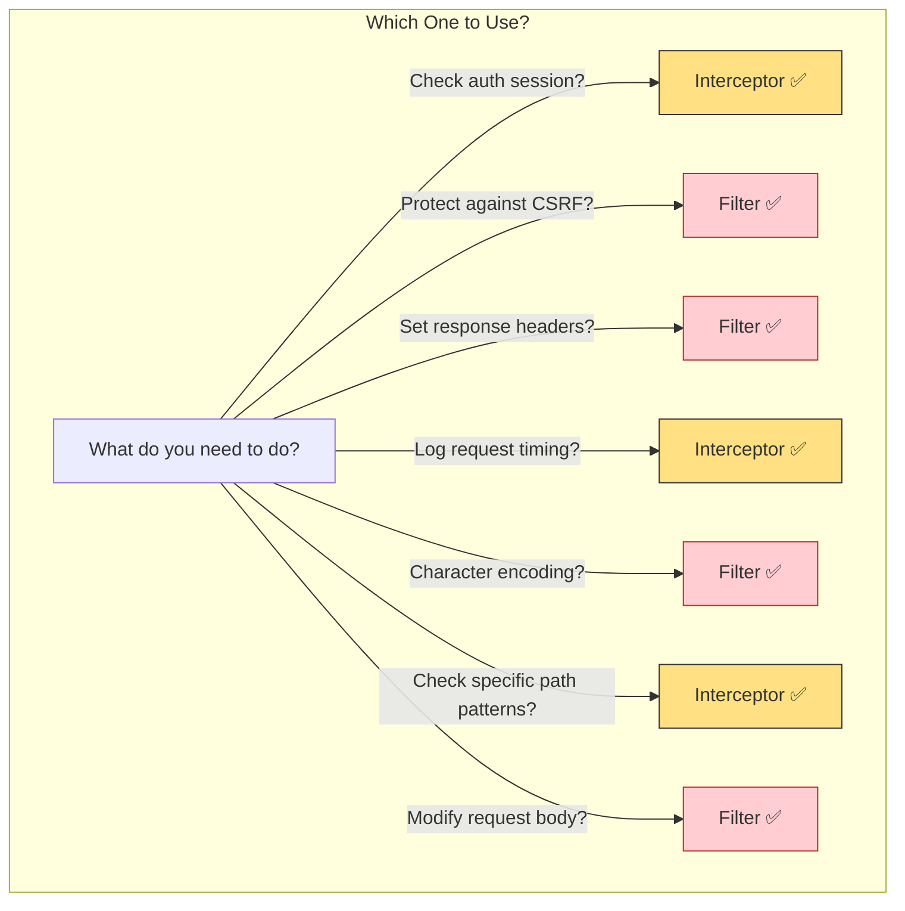

| Criteria | Filter | Interceptor |
|----------|--------|-------------|
| **Level** | Servlet (before Spring) | Spring MVC (after DispatcherServlet) |
| **Path exclusion** | Not easily (applies to all) | Built-in `excludePathPatterns()` |
| **Can access** | `ServletRequest`, `ServletResponse`, `HttpSession` | Same + Model, View, Exception |
| **Configured in** | `AppInitializer.getServletFilters()` | `WebMvcConfigurer.addInterceptors()` |
| **Use for** | CSRF, encoding, CORS, security headers | Auth, logging, locale, performance timing |
| **Multiple runs?** | Can run multiple times per request | Always runs once per request |
| **Spring beans** | Hard to inject | Easy — registered as @Bean in WebConfig |

### Quick Decision Guide

```
Need to prevent cross-site attacks?        → Filter (CsrfFilter)
Need to set charset/encoding?               → Filter
Need to check if user is logged in?         → Interceptor (AuthInterceptor)
Need to log how long requests take?         → Interceptor
Need to add CORS headers?                   → Filter
Need to redirect unauthenticated users?     → Interceptor
Need to modify the response body?           → Filter
Need to add data to the Model for views?    → Interceptor
```

---

## Final Summary: The Complete Request Flow

```mermaid
flowchart TB
    subgraph Layer0 [Layer 0: Servlet Container — Tomcat]
        TC[Tomcat receives HTTP request]
    end
    
    subgraph Layer1 [Layer 1: Filter Chain]
        CF[CsrfFilter
        • Sets CSRF cookie
        • Validates X-CSRF-Token header
        • Blocks 403 if invalid]
        SHF[SecurityHeadersFilter
        • X-Content-Type-Options
        • X-Frame-Options
        • CSP headers]
    end
    
    subgraph Layer2 [Layer 2: Spring MVC — Interceptor]
        AI[AuthInterceptor
        • preHandle checks session
        • 401 if no "user" attribute
        • Allows /api/auth/* through]
    end
    
    subgraph Layer3 [Layer 3: Controller]
        CT[AuthController
        • @Valid @RequestBody
        • Calls Service
        • Returns JSON response]
    end
    
    subgraph Layer4 [Layer 4: Service]
        SV[AuthService
        • Business logic
        • Transactions
        • Throws ServiceException]
    end
    
    subgraph Layer5 [Layer 5: Exception Handler]
        EH[AuthExceptionHandler
        • @ControllerAdvice
        • Maps errorCode → HTTP status
        • Returns JSON error body]
    end
    
    TC --> CF
    CF -->|"CSRF OK"| SHF
    SHF --> AI
    AI -->|"Session valid"| CT
    CT --> SV
    SV -.->|"on error"| EH
    EH -->|"JSON error response"| TC
    SV -->|"success"| CT
    CT -->|"JSON 200 OK"| TC
    
    style Layer1 fill:#ffcdd2,stroke:#c62828
    style Layer2 fill:#ffe082,stroke:#333
    style Layer3 fill:#bbf,stroke:#333
    style Layer4 fill:#bfb,stroke:#333
    style Layer5 fill:#e1d5e7,stroke:#9673a6
```

| Component | Tagline | Job | Lives in |
|-----------|---------|-----|----------|
| **Flyway** | 🏗️ DB architect | Creates tables in order | `db/migration/` |
| **Model** | 📋 Data blueprint | One Java class = one DB row | `model/` |
| **DTO** | 📦 Shipping box | Carries validated data between browser and server | `dto/` |
| **DAO** | 🍳 Kitchen chef | Runs SQL, converts rows to Java objects | `dao/` |
| **Service** | 🧠 Brain | Business logic, transactions, coordination | `service/` |
| **Controller** | 🚪 Receptionist | Handles HTTP, validates, delegates, responds | `controller/` |
| **Exception** | 🚨 Alarm | Error code + message for structured errors | `exception/` |
| **Interceptor** | 🛂 Security checkpoint | Checks session before controller, path-based rules | `interceptor/` |
| **Filter** | 🚧 Metal detector | Low-level preprocessing (CSRF, encoding, headers) | `filter/` |
