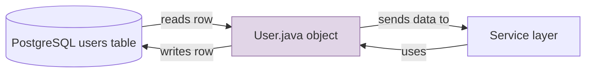
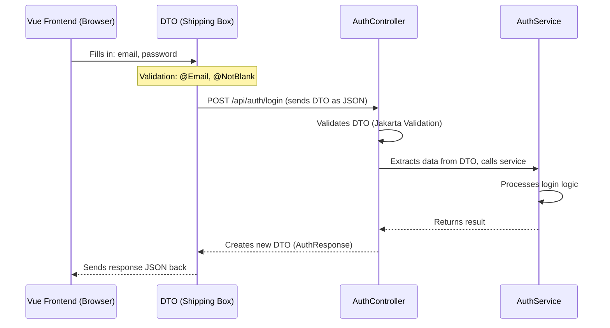
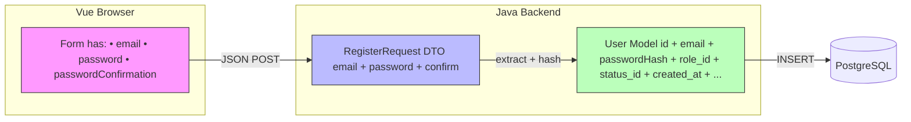
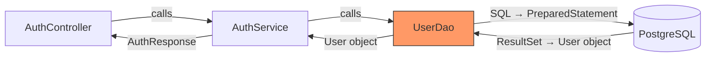
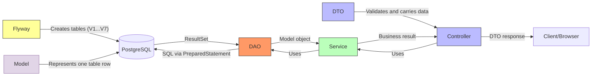

# Learnings

> Engineering decisions, trade-offs, and insights from the ResumAIner project.
> Organized by project stage. New entries are appended as the project progresses.

---

## Stage: Specification & Brainstorming

> Feature: `001-hello-world-tomcat` — Java Spring MVC + Tomcat + Docker local setup.
> Stage: Specification, clarification, and brainstorming before implementation.

---

### 2026-05-30 | Startup Readiness: wait-for-it.sh over Docker HEALTHCHECK

**Tags**: `docker`, `compose`, `startup-order`, `reliability`

**Context**: Docker Compose starts Tomcat and PostgreSQL containers in parallel. Tomcat tries to connect to the database before PostgreSQL is ready, causing connection errors on first startup.

**Decision**: Use a `wait-for-it.sh` script inside the Tomcat entrypoint rather than Docker HEALTHCHECK.

**Why**: Docker HEALTHCHECK only tells _Docker_ the container is unhealthy — it doesn't stop the application process. `wait-for-it.sh` blocks the Tomcat startup _until_ PostgreSQL is reachable, which gives clean first-time startup. It also doubles as a general-purpose tool for any future dependency.

**Alternatives considered**:
- **Docker HEALTHCHECK**: Signals container health to Docker, but doesn't prevent the app from starting too early. Better for orchestration (Kubernetes) than for Compose.
- **depends_on with condition**: Docker Compose v2 supports `depends_on` with `condition: service_healthy`, but it couples startup logic to Compose config rather than keeping it in the container itself.

**Example**:
```
# docker-compose.yml — Tomcat waits for PostgreSQL before starting
command: ["./wait-for-it.sh", "db:5432", "--", "catalina.sh", "run"]
```

**Further reading**: Docker Compose startup order docs, `docker-compose depends_on` vs entrypoint scripts.

---

### 2026-05-30 | Maven Wrapper for Reproducible Builds

**Tags**: `build`, `maven`, `reproducibility`, `ci`

**Context**: The project uses Maven for building. Different developers or CI environments may have different Maven versions (3.6 vs 3.9), which can cause subtle build differences or failures.

**Decision**: Add Maven Wrapper (`mvnw`) to the repository.

**Why**: Maven Wrapper pins the exact Maven version (3.9.x) in a `.mvn/` config file. Everyone — developer laptop, Docker build, CI — uses the same version. No "works on my machine" issues. Developers don't even need Maven installed locally.

**Alternatives considered**:
- **No wrapper, rely on system Maven**: Simple, but version mismatch is a common source of CI failures. Saves ~100KB in repo but costs debugging time.
- **Docker-only Maven**: Build only inside Docker. Works for CI, but slows down local dev — every code change requires a full Docker build to compile.

**Example**:
```
# Generate wrapper (one-time setup):
mvn wrapper:wrapper -Dmaven=3.9.9

# Developer builds without installing Maven:
./mvnw clean package
```

**Further reading**: Maven Wrapper docs (`mvn wrapper:wrapper`), differences between Maven 3.6 and 3.9.

---

### 2026-05-30 | Docker Compose: Include PostgreSQL from Day One

**Tags**: `docker`, `compose`, `infrastructure`, `postgresql`

**Context**: The Hello World feature doesn't need a database — it's a static page. But every future feature (auth, profiles, resume storage) depends on PostgreSQL.

**Decision**: Add PostgreSQL as a service in Docker Compose immediately, alongside Tomcat.

**Why**: Adding a service to Docker Compose later is easy, but removing it from developers' mental model is hard. Including PostgreSQL now means:
- Developers don't need to install PostgreSQL locally — it runs in a container.
- Docker volumes for data persistence are configured once and forgotten.
- The `wait-for-it.sh` approach is tested from day one.

The Hello World page itself doesn't use PostgreSQL — it's just infrastructure scaffolding.

**Alternatives considered**:
- **No PostgreSQL, add later**: Saves one container in early dev. Risk: developer forgets to add it, or adds it incorrectly when the first DB-dependent feature arrives.
- **Local PostgreSQL install**: Each developer manages their own DB. More setup steps in README, more "works on my machine" risk.

**Example**:
```yaml
# docker-compose.yml snippet
services:
  db:
    image: postgres:16-alpine
    volumes:
      - pgdata:/var/lib/postgresql/data
    environment:
      POSTGRES_DB: resumainer
      POSTGRES_PASSWORD: ${DB_PASSWORD}
  app:
    build: .
    ports:
      - "8080:8080"
    depends_on:
      - db
    # entrypoint calls wait-for-it.sh db:5432 before starting Tomcat
```

**Further reading**: PostgreSQL Docker image docs, Docker Compose service dependencies, PostgreSQL connection pooling basics.

---

### 2026-05-30 | .gitignore: Community Best Practices

**Tags**: `git`, `hygiene`, `security`, `setup`

**Context**: The repository had no `.gitignore`. Developers risk accidentally committing IDE files, compiled classes, `node_modules`, or — worst case — `.env` files with secrets.

**Decision**: Add a `.gitignore` with rules covering Java, Maven, Node, IDE (IntelliJ, VS Code), OS files (Windows, macOS, Linux), Docker, and secrets.

**Why**: A missing `.gitignore` is a security and hygiene risk. Accidental commits of IDE config or `.env` files are hard to undo (they stay in git history). Better to have a comprehensive ignore file from the start and never think about it again.

**Alternatives considered**:
- **Minimal `.gitignore`** (Java + Maven only): Fewer lines, but misses IDE files (`.idea/`, `.vscode/`) that developers commonly commit by accident.
- **No `.gitignore`**: Every developer manages their own `.git/info/exclude`. Works only in teams that never make mistakes — unrealistic.

**Example**:
```
# Key patterns every Java project should have:
target/
*.class
*.jar
*.war
!.mvn/wrapper/maven-wrapper.jar

# IDE — developers always forget these:
.idea/
.vscode/
*.iml
*.iws

# Secrets — must never be committed:
.env
.env.*

# OS files:
.DS_Store
Thumbs.db
```

**Further reading**: GitHub's `.gitignore` templates (`github/gitignore`), `git secrets` for pre-commit secret scanning.

---

> _To add a new learning: copy the template block above, fill in date, title, tags, context, and append under the relevant project stage._

# Learnings & Dev Notes

## Flyway Migrations — What It Is and How It Works

**Flyway** is a database version control tool. Think of it as a folder of numbered SQL files that Flyway applies to PostgreSQL in order, automatically.

### File Structure

```
backend/src/main/resources/db/migration/
├── V1__create_role_table.sql
├── V2__create_user_status_table.sql
├── V3__create_user_permission_table.sql
├── V4__create_language_table.sql
├── V5__create_users_table.sql
├── V6__create_contact_detail_table.sql
└── V7__seed_lookup_data.sql
```

### How It Works (Simplified)

1. **First run**: Flyway creates a tracking table `flyway_schema_history` in PostgreSQL
2. **Scans `db/migration/`**: finds all files matching `V{number}__{description}.sql`
3. **Sorts by version**: V1 → V2 → V3 → ... → V7
4. **Applies in order**: executes SQL from each file exactly once
5. **Remembers what ran**: `flyway_schema_history` stores checksums of executed migrations

### Important Rules

| Rule | Why |
|------|-----|
| **Never modify an already-run migration** | Flyway detects checksum mismatch → throws error |
| **Need to change a table? Create V8** | New migration with ALTER TABLE, DROP COLUMN, etc. |
| **Naming: `V{number}__{description}.sql`** | Double underscore between number and description |
| **Numbers must be sequential** | V1, V2, V3... no gaps |
| **Seed data is a migration too** | V7 populates lookup tables with initial values |

### Example: V1

```sql
-- V1__create_role_table.sql
CREATE TABLE role (
    id BIGINT GENERATED BY DEFAULT AS IDENTITY PRIMARY KEY,
    code VARCHAR(20) NOT NULL UNIQUE,
    name VARCHAR(50) NOT NULL
);
```

### How It Starts

Add Flyway dependency to `pom.xml`. On Tomcat startup, Flyway automatically:
1. Connects to PostgreSQL (configured in `application.properties`)
2. Checks `flyway_schema_history` — which migrations have already run
3. Applies any new ones
4. Application starts only after migrations succeed

### Common Beginner Mistake

```bash
# Error: Validation failed
# Cause: modified V1__create_role_table.sql after it already ran
```

**Fix**: Don't touch old migrations. Create `V8__fix_role_table.sql` with ALTER TABLE.

### Why Flyway Instead of Raw SQL Scripts

| Without Flyway | With Flyway |
|---------------|-------------|
| Forget to run script → DB out of sync with code | Auto-applied on startup |
| Don't know which schema version is in production | `flyway_schema_history` has full history |
| Scared to change tables — unclear what exists | Every migration is a documented change |
| Different dev databases drift apart | Always the same schema version everywhere |

---

## Model — What It Is and How It Works

### What Is a Model?

A **Model** is a Java class that represents one row in a database table.

```java
// One User.java object = one row in the 'users' table
public class User {
    private UUID id;       // column: id
    private String email;  // column: email
    private String passwordHash; // column: password_hash
    // ...getters and setters...
}
```

### ELI5: Model is a *rubber stamp*

Imagine a rubber stamp that stamps out paper forms. The stamp says:
```
┌─────────────────────┐
│     USER FORM       │
│  id: [________]     │
│  email: [________]  │
│  password: [_______]│
└─────────────────────┘
```

Every time you stamp, you get a blank form. **The stamp itself is the Model class.** Each stamped sheet is one **object** (one user). You fill in the blanks with real data.

### The Big Picture



### What a Model Does

| Job | Example |
|-----|---------|
| Hold data from one DB row | A `User` object holds one user's email, password hash, etc. |
| Define the data structure | `private String email;` — every user has an email |
| Move data between layers | Controller → Service → DAO → Database and back |
| Keep data organized | Instead of passing 10 separate variables, pass one `User` object |

### Our Models in This Project

| Model | Database Table | What It Represents |
|-------|---------------|-------------------|
| `User.java` | `users` | One registered user |
| `Role.java` | `role` | A role like USER or ADMIN |
| `UserStatus.java` | `user_status` | ACTIVE or BLOCKED status |
| `UserPermission.java` | `user_permission` | ALLOWED or FORBIDDEN to generate |
| `Language.java` | `language` | EN or RU language option |
| `ContactDetail.java` | `contact_detail` | User's profile contact info |

### Code Example with Explanation

```java
// Step 1: Create a new User object (blank form)
User user = new User();

// Step 2: Fill in the fields (fill the blanks)
user.setEmail("alice@example.com");      // column: email
user.setPasswordHash("$2a$10$xyz...");  // column: password_hash
user.setRoleId(1L);                      // column: role_id (FK to role table)

// Step 3: Pass the filled object to DAO for saving
userDao.create(user);
// → DAO extracts values: user.getEmail(), user.getPasswordHash()...
// → Builds SQL: INSERT INTO users (email, password_hash, role_id) VALUES (?, ?, ?)
// → Sends to PostgreSQL
```

### Model vs DTO vs DAO — The Difference at a Glance

| Concept | Job | Example |
|---------|-----|---------|
| **Model** | Represents a DB row | `User.java` maps to `users` table |
| **DTO** | Carries data between frontend and backend | `RegisterRequest.java` carries email + password from browser |
| **DAO** | Talks to the database | `UserDao.java` runs SQL queries |

### Key Rules for Models

1. **One Model = One Table** — `User.java` ↔ `users` table. Never mix tables.
2. **Field names match column names** (slightly different is OK, but close).
3. **Use wrapper types** for nullable columns (`Long` not `long`, `LocalDateTime` not `LocalDateTime`).
4. **Add `equals()` and `hashCode()`** based on `id` — needed for collections and testing.
5. **Keep `toString()` clean** — never include passwords in toString.

---

## DTO — What It Is and How It Works

### What Is a DTO?

**DTO** = **D**ata **T**ransfer **O**bject.

A DTO is a simple Java class that carries data between the frontend (Vue browser app) and the backend (Java server). Unlike a Model, a DTO does NOT represent a database table.

```java
// RegisterRequest.java — carries registration data from browser to server
public class RegisterRequest {
    @NotBlank(message = "Email is required")
    @Email(message = "Invalid email format")
    private String email;

    @NotBlank(message = "Password is required")
    @Size(min = 8, message = "Password must be at least 8 characters")
    private String password;

    private String passwordConfirmation;
    // ...getters and setters...
}
```

### ELI5: DTO is a *shipping box*

Imagine you're ordering something online:
```
┌────────────────────────┐
│     SHIPPING BOX       │
│                        │
│  Contains: email       │
│            password    │
│            rememberMe  │
│                        │
│  Label: "LoginRequest" │
└────────────────────────┘
```

The **DTO is the shipping box**. You put data inside (email, password), seal it with validation tape (`@NotBlank`, `@Email`), and ship it from the browser to the server. The server opens the box, takes out the data, and processes it.

### The Data Flow



### Why We Need DTOs (Not Models)



The browser sends only 3 fields (email, password, confirm). But the database stores 15+ columns (id, passwordHash, roleId, statusId, timestamps, etc.). **DTO = what the user sends. Model = what the database stores.** They're different shapes for different jobs.

### Our DTOs in This Project

| DTO | Direction | What It Carries |
|-----|-----------|----------------|
| `RegisterRequest` | Browser → Server | email, password, passwordConfirmation |
| `LoginRequest` | Browser → Server | email, password, rememberMe |
| `AuthResponse` | Server → Browser | success, role, message, redirectUrl |
| `UserSession` | Server-side only | userId, email, role (stored in HttpSession) |

### Code Example with Line-by-Line Explanation

```java
// ====== The DTO ======
public class RegisterRequest {
    
    @NotBlank(message = "{auth.email.required}")   // 1: email can't be empty
    @Email(message = "{auth.email.invalid}")        // 2: must be valid email format
    @Size(max = 255)                                 // 3: max length
    private String email;                            // 4: the actual data field
    
    @NotBlank(message = "{auth.password.required}")
    @Size(min = 8, max = 128)
    private String password;
    
    private String passwordConfirmation;             // 5: no @NotBlank — validated in controller
    
    // Setter also trims and lowercases email automatically
    public void setEmail(String email) {
        this.email = email != null ? email.trim().toLowerCase() : null;
    }
}

// ====== How the controller uses the DTO ======
@PostMapping("/api/auth/register")
public AuthResponse register(@Valid @RequestBody RegisterRequest request) {
    // @Valid tells Spring: run all @NotBlank/@Email/@Size checks
    // If validation fails → return 400 Bad Request automatically
    
    String email = request.getEmail();          // extract from DTO
    String password = request.getPassword();    // extract from DTO
    
    authService.register(request);              // pass DTO to service
    return AuthResponse.success("USER", "/home");
}
```

### Key Rules for DTOs

1. **DTOs have validation annotations** — `@NotBlank`, `@Email`, `@Size` on the fields.
2. **DTOs are NOT stored in the database** — they're temporary messaging objects.
3. **Never put sensitive data in DTO `toString()`** — no passwords, no tokens.
4. **DTOs can have factory methods** — `AuthResponse.success()` and `AuthResponse.failure()` for clean creation.
5. **One DTO per request/response shape** — don't reuse the same DTO for different endpoints if the fields differ.

### Beginner Mistake: Using Model as DTO

```java
// ❌ WRONG: Exposing the Model directly to the browser
@PostMapping("/api/auth/register")
public User register(@RequestBody User user) {
    // User model has passwordHash field!
    // Browser could set ANY field including role_id, is_privileged, etc.
}

// ✅ RIGHT: Using a DTO that only exposes needed fields
@PostMapping("/api/auth/register")
public AuthResponse register(@Valid @RequestBody RegisterRequest request) {
    // Browser can only send: email, password, passwordConfirmation
    // Server controls: role, status, permission, etc.
}
```

---

## DAO Layer — What It Is and How It Works

### What Is a DAO?

**DAO** = **D**ata **A**ccess **O**bject.

A DAO is a Java class that talks to the database. It runs SQL queries, reads results, and converts them into Model objects.

```java
// RoleDao.java — one file = one table = one set of SQL operations
public class RoleDao {
    // SQL query written as a constant
    private static final String SELECT_BY_CODE = 
        "SELECT id, code, name FROM role WHERE code = ?";
    
    public Role findByCode(String code) {
        // 1. Get connection from pool
        // 2. Create PreparedStatement with SQL
        // 3. Set parameters (the "?" in SQL)
        // 4. Execute query
        // 5. Convert ResultSet → Role object
        // 6. Return Role (or null if not found)
    }
}
```

### ELI5: DAO is a *restaurant kitchen order*

```
You (waiter)             Kitchen (DAO)          Pantry (Database)
    │                        │                       │
    │ "I need Role: USER"    │                       │
    │───────────────────────>│                       │
    │                        │  "SELECT * FROM role  │
    │                        │   WHERE code = 'USER'"│
    │                        │──────────────────────>│
    │                        │                       │
    │                        │  "Here's the row:"    │
    │                        │<──────────────────────│
    │                        │  id=1, code=USER      │
    │                        │  name=Regular User    │
    │                        │                       │
    │   Role{id=1,           │                       │
    │   code="USER"}         │                       │
    │<───────────────────────│                       │
```

The **DAO is the kitchen**: you tell it what you need (findByCode), it prepares the SQL (recipe), talks to the database (pantry), and serves you back a ready-to-use object (dish).

### The Full Request Flow



### Three Rules of DAO

1. **One DAO = One Table** — `UserDao.java` only talks to `users` table
2. **All SQL via PreparedStatement** — never concatenate strings (prevents SQL injection)
3. **Each method = one SQL operation** — `findByEmail()`, `create()`, `updateLoginAttempts()`

### PreparedStatement: Why It Matters

```java
// ❌ DANGEROUS: String concatenation (SQL injection risk)
String sql = "SELECT * FROM users WHERE email = '" + userInput + "'";
// If userInput = "admin' OR '1'='1" → deletes all users!

// ✅ SAFE: PreparedStatement with ? placeholders
String sql = "SELECT * FROM users WHERE email = ?";
PreparedStatement stmt = connection.prepareStatement(sql);
stmt.setString(1, userInput);  // Database treats this as VALUE, not SQL code
ResultSet rs = stmt.executeQuery();
// Even if userInput = "admin' OR '1'='1", database treats it as a literal string
```

### Live Example: UserDao.create()

```java
public class UserDao {
    // STEP 1: Define SQL as a constant (stored once, never changes)
    // ? = placeholder, filled by stmt.setXxx()
    private static final String INSERT = 
        "INSERT INTO users (email, password_hash, role_id, status_id, permission_id) " +
        "VALUES (?, ?, ?, ?, ?)";

    private final DataSource dataSource;  // Connection pool (gives us DB connections)

    public UserDao(DataSource dataSource) {
        this.dataSource = dataSource;
    }

    public void create(User user) {
        // STEP 2: try-with-resources = auto-closes connection + statement
        try (Connection conn = dataSource.getConnection();      // Get DB connection
             PreparedStatement stmt = conn.prepareStatement(INSERT)) {  // Prepare SQL
             
            // STEP 3: Fill in placeholders (index starts at 1)
            stmt.setString(1, user.getEmail());          // 1st ? → email
            stmt.setString(2, user.getPasswordHash());   // 2nd ? → password
            stmt.setLong(3, user.getRoleId());           // 3rd ? → role_id
            stmt.setLong(4, user.getStatusId());         // 4th ? → status_id
            stmt.setLong(5, user.getPermissionId());     // 5th ? → permission_id
            
            // STEP 4: Execute
            stmt.executeUpdate();  // executeUpdate() for INSERT/UPDATE/DELETE
            
        } catch (SQLException e) {
            // STEP 5: Handle errors
            throw new RuntimeException("Database error", e);
        }
        // STEP 6: Connection + Statement auto-closed (try-with-resources)
    }
}
```

### Converting Database Results to Java Objects

```java
public User findByEmail(String email) {
    try (Connection conn = dataSource.getConnection();
         PreparedStatement stmt = conn.prepareStatement(SELECT_BY_EMAIL)) {
        
        stmt.setString(1, email);          // Fill in the email
        
        try (ResultSet rs = stmt.executeQuery()) {  // Execute SELECT
            if (rs.next()) {                        // If a row was found
                return mapRow(rs);                  // Convert to Java object
            }
        }
        return null;  // No user with this email
        
    } catch (SQLException e) {
        throw new RuntimeException("Database error", e);
    }
}

// Helper: converts one database row → one Java object
private User mapRow(ResultSet rs) throws SQLException {
    User user = new User();
    user.setId(rs.getObject("id", UUID.class));           // UUID column
    user.setEmail(rs.getString("email"));                  // VARCHAR column
    user.setPasswordHash(rs.getString("password_hash"));   // VARCHAR column
    user.setRoleId(rs.getLong("role_id"));                 // BIGINT column
    user.setStatusId(rs.getLong("status_id"));
    user.setFailedLoginAttempts(rs.getInt("failed_login_attempts"));
    user.setCreatedAt(rs.getObject("created_at", LocalDateTime.class));  // TIMESTAMP
    return user;
}
```

### Our DAOs in This Project

| DAO | Operations | Why Needed |
|-----|-----------|------------|
| `UserDao` | create, findByEmail, findById, updateLoginAttempts, resetLoginAttempts | Register + Login + rate limiting |
| `RoleDao` | findByCode | Check if user is USER or ADMIN |
| `UserStatusDao` | findByCode | Check if user is ACTIVE or BLOCKED |
| `UserPermissionDao` | findByCode | Check if user can generate resumes |
| `LanguageDao` | findByCode | Read language options |
| `ContactDetailDao` | create | Create empty profile on registration |

### The Three Layers Working Together

```mermaid
flowchart TB
    subgraph Browser [Vue Frontend]
        FORM["Registration form (email + password)"]
    end
    
    subgraph Controller [Controller Layer]
        AC["AuthController • Receives HTTP request • Validates DTO (@Valid) • Calls service • Returns response"]
    end
    
    subgraph Service [Service Layer]
        AS["AuthService • Business logic • Password hashing (BCrypt) • Transaction management • Error handling"]
    end
    
    subgraph DAO [Data Access Layer]
        UD["UserDao • INSERT users • SELECT users"]
        CD["ContactDetailDao • INSERT contact_detail"]
    end
    
    subgraph DB [(PostgreSQL)]
        UT[users table]
        CT[contact_detail table]
    end
    
    FORM -->|"POST /api/auth/register JSON: {email, password}"| AC
    AC -->|"RegisterRequest DTO"| AS
    AS -->|"User object"| UD
    AS -->|"ContactDetail object"| CD
    UD -->|"INSERT INTO users ..."| UT
    CD -->|"INSERT INTO contact_detail ..."| CT
    UT -->|"Row inserted"| UD
    CT -->|"Row inserted"| CD
    UD -->|"success"| AS
    CD -->|"success"| AS
    AS -->|"AuthResponse{success:true}"| AC
    AC -->|"JSON 200 OK"| FORM
    
    style Controller fill:#bbf,stroke:#333
    style Service fill:#bfb,stroke:#333
    style DAO fill:#f96,stroke:#333
```

### Beginner Mistake: Doing SQL in the Controller

```java
// ❌ WRONG: SQL in controller (mixes responsibilities, hard to test)
@PostMapping("/api/auth/login")
public String login(...) {
    Connection conn = dataSource.getConnection();
    PreparedStatement stmt = conn.prepareStatement("SELECT * FROM users WHERE email = ?");
    // ...20 lines of SQL code in the controller...
}

// ✅ RIGHT: Controller calls Service, Service calls DAO, DAO runs SQL
@PostMapping("/api/auth/login")
public AuthResponse login(@Valid @RequestBody LoginRequest request) {
    return authService.authenticate(request);  // Clean, testable, single responsibility
}
```

---

## Summary: How It All Connects



| Component | Tagline | Job |
|-----------|---------|-----|
| **Flyway** | 🏗️ DB architect | Creates tables automatically in order |
| **Model** | 📋 Data blueprint | One Java class = one database table row |
| **DTO** | 📦 Shipping box | Carries validated data between browser and server |
| **DAO** | 🍳 Kitchen chef | Runs SQL, converts database rows to Java objects |
