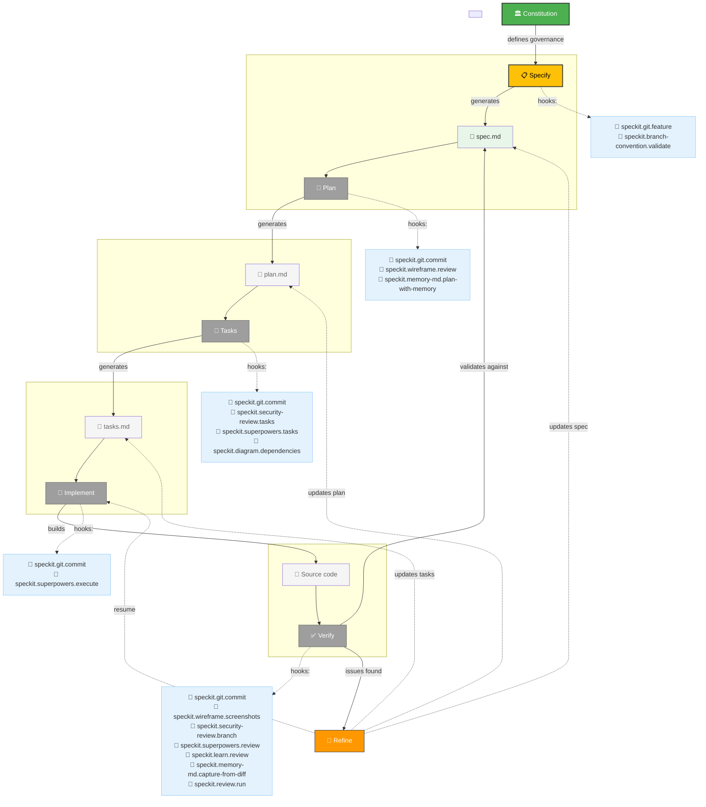

# Workflow Diagram

# Legend

| Color        | Status                  | Phase                                |
| ------------ | ----------------------- | ------------------------------------ |
| 🟢 Green     | **Completed**           | Constitution v1.0.0 ✅               |
| 🟡 Yellow    | **Current / Next**      | Specify — ready to start             |
| ⚪ Gray       | **Not Started**         | Plan, Tasks, Implement, Verify       |
| 🟠 Orange    | **Refinement Cycle**    | Refine (feedback loop)               |
| 🔵 Blue      | **Extension Hooks**     | Integration points for extensions    |

# Current Status

| Phase | Status | Artifacts |
|------|--------|-----------|
| **Constitution** | ✅ Completed | `.specify/memory/constitution.md` v1.0.0 |
| **Specify** | 🟡 **Ready to Start** | `/speckit.specify` |
| **Plan** | ⏸ Pending | will follow specify |
| **Tasks** | ⏸ Pending | will follow plan |
| **Implement** | ⏸ Pending | will follow tasks |
| **Verify** | ⏸ Pending | will follow implement |

**12 extensions** active: `branch-convention`, `diagram`, `doctor`, `git`, `learn`, `memory-md`, `refine`, `review`, `security-review`, `status`, `superpowers`, `wireframe`