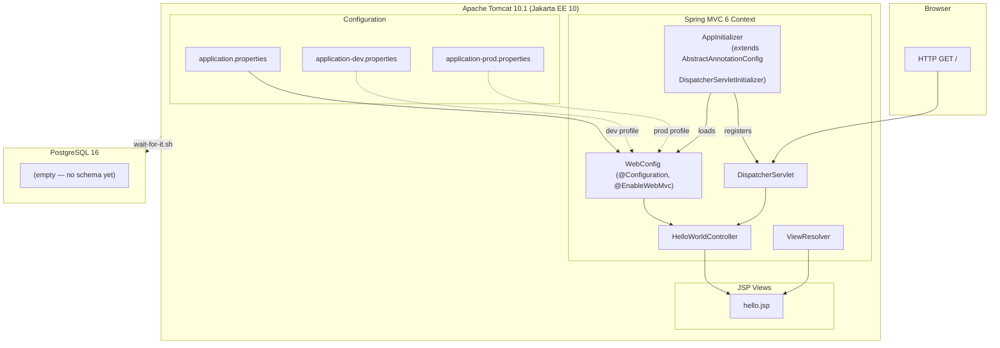

# Component Diagram: Hello World Tomcat Setup

**Feature**: Java Spring MVC Hello World with Docker Compose (Tomcat + PostgreSQL)
**Generated**: 2026-05-30
**Scope**: Full feature

---

## Overview

This diagram shows the internal components of the Spring MVC application and their relationships — what code lives where, how requests flow, and what boundaries exist.

## Component Diagram

## Component Breakdown

### HelloWorldController

**Role**: Handles `GET /` requests and returns a model with dynamic content.

**Why this exists as a separate component**: Single-responsibility — the controller only maps URLs to views. Keeping it separate from configuration isolates routing logic from infrastructure setup.

**Key interactions**:
- ← `DispatcherServlet`: receives mapped HTTP request
- → `hello.jsp`: passes model data (app name, server time, active profile)
- → `application.properties`: reads profile setting

---

### AppInitializer

**Role**: Servlet container initializer that bootstraps Spring MVC — registers `DispatcherServlet` and loads `WebConfig`.

**Why this exists as a separate component**: Tomcat 10+ auto-discovers classes implementing `WebApplicationInitializer` via Servlet 3.0+ SPI (no web.xml needed). `AppInitializer` extends `AbstractAnnotationConfigDispatcherServletInitializer` — the standard Spring MVC approach for Jakarta EE 10 environments. Keeping it separate from `WebConfig` isolates servlet-level concerns (mappings, registration) from Spring configuration.

**Key interactions**:
- → `DispatcherServlet`: registers it with `"/"` mapping
- → `WebConfig`: loads it as the servlet config class (no root config needed for now)

---

### WebConfig

**Role**: Java-based Spring MVC configuration — `@EnableWebMvc`, view resolver, annotation-driven MVC.

**Why this exists as a separate component**: Separates framework configuration from business logic. Without Spring Boot, all Spring setup must be explicit — `WebConfig` is the single place where framework wiring happens.

**Key interactions**:
- → `ViewResolver`: configures JSP prefix/suffix
- → `Controller`: enables annotation-based mappings
- ← `AppInitializer`: loaded as servlet config class on startup

---

### hello.jsp

**Role**: Renders a simple HTML page showing application name, server time, and active profile.

**Why this exists as a separate component**: Separates presentation (HTML markup) from logic (Java controller). JSP is minimal for Hello World; will be replaced by Thymeleaf for the Landing Page feature.

**Key interactions**:
- ← `HelloWorldController`: receives model attributes
- → Browser: delivers rendered HTML

---

### application-{dev,prod}.properties

**Role**: Externalized configuration for two environments — logging levels, server port, active profile.

**Why this exists as a separate component**: Spring profiles allow environment-specific config without code changes. dev=DEBUG logging, prod=INFO. Port overridable via `SERVER_PORT` env var.

**Key interactions**:
- → `WebConfig`: provides active profile and logging configuration
- ← Environment variables: overrides via `SERVER_PORT`, `SPRING_PROFILES_ACTIVE`

---

## Design Reasoning

### Why this structure?

The application follows Spring MVC's classic pattern: `DispatcherServlet` → `Controller` → `View`. Without Spring Boot, each piece must be explicitly wired. The structure mirrors standard Spring MVC project layout — `controller/`, `config/`, `WEB-INF/views/` — which is immediately recognizable to any Java developer and matches the constitution's requirement for standard Java layered architecture.

### Alternatives considered

| Structure | Why it wasn't chosen |
|-----------|---------------------|
| Single class with everything | Violates SOLID — no separation of concerns, untestable |
| Spring Boot auto-configuration | Explicitly forbidden by constitution (§ Technology Stack & Architecture Constraints) |
| XML-only Spring config | Java config (`@Configuration`) is type-safe, easier to refactor, and modern standard |
| `web.xml` with `javax.*` namespace | Incompatible with Tomcat 10.1+ (Jakarta EE 10) — would require XML schema migration to Jakarta and introduces string-based class references not checked at compile time |

### When you'd restructure

As the project grows, `WebConfig` will split into multiple config classes (security, data source, async, etc.). The controller layer will grow into multiple controllers organized by domain (AuthController, ResumeController, etc.). The single JSP will be replaced by a Thymeleaf-based Landing Page.
