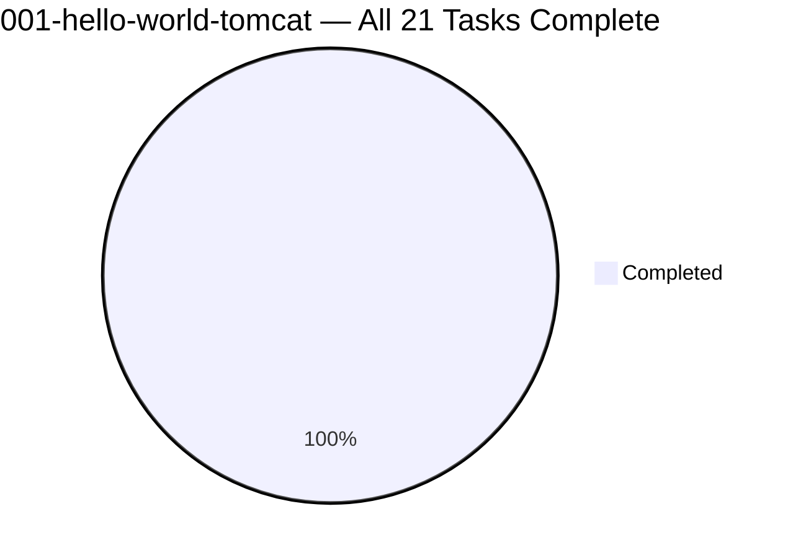

# Feature Progress Dashboard

**Generated**: 2026-05-30
**Last updated**: 2026-05-30 (feature complete)
**Branch**: `feat/001-hello-world-tomcat`

## SDD Lifecycle

```mermaid
gantt
    title ResumAIner — Feature Progress
    dateFormat X
    axisFormat %s

    section 001-hello-world-tomcat
    Specify :done, spec, 0, 1
    Plan    :done, plan, 1, 2
    Tasks   :done, tasks, 2, 3
    Implement :done, impl, 3, 4
    Verify  :done, veri, 4, 5
```

## Task Progress (all waves complete)

## Summary

| Feature | Phase | Tasks | Status |
|---|---|---|---|
| 001-hello-world-tomcat | ✅ **Complete** | 21/21 | All waves 0-13 ✅ |

## Phase Details

| SDD Phase | Status | Key Artifacts |
|---|---|---|
| 🔵 Specify | ✅ Complete | `spec.md`, brainstorm log, checklists |
| 🟢 Plan | ✅ Complete | `plan.md`, component/system/architecture diagrams |
| 🟡 Tasks | ✅ Complete | `tasks.md` (21 tasks), `task-dag.md`, `feature-status.md` |
| 🟠 Implement | ✅ **Complete** | All 14 waves, TDD cycle (RED→GREEN→REFACTOR) |
| 🔴 Review | ✅ Complete | Security review, spec compliance review, PR review |
| 🔬 Learn | ✅ Complete | `learn.md` (Docker decisions), durable memory (D1-D4, A1, B1-B2, W1) |

## Delivery Summary

```mermaid
flowchart LR
    subgraph MVP["🎯 MVP Delivered"]
        direction TB
        HW["Hello World page at localhost:8080<br/>ResumAIner · server time · dev profile"]
    end

    subgraph STACK["🛠️ Technology Stack"]
        direction TB
        J["Java 21 + Spring MVC 6.2.11"]
        T["Tomcat 10.1.55 (JRE runtime)"]
        D["Docker Compose + PostgreSQL 16"]
        M["Maven Wrapper (3.9.9)"]
    end

    subgraph QUALITY["✅ Quality Gates"]
        direction TB
        T1["1 test passing (MockMvc)"]
        C1["JaCoCo coverage configured"]
        S1["Security: non-root UID 10001, no stack traces"]
        P1["Playwright: 200 OK verified"]
    end

    subgraph IMAGE["🐳 Docker Image"]
        IMG["460 MB (was 715 MB)<br/>JRE, BuildKit cache,<br/>non-root, ARG versions"]
    end

    subgraph MEMORY["📚 Durable Memory"]
        M1["DECISIONS.md: D1-D4"]
        M2["ARCHITECTURE.md: A1"]
        M3["BUGS.md: B1-B2"]
        M4["WORKLOG.md: W1"]
    end

    MVP --> STACK
    STACK --> QUALITY
    QUALITY --> IMAGE
    IMAGE --> MEMORY
```

## Key Metrics

| Metric | Value |
|---|---|
| **Feature** | `001-hello-world-tomcat` |
| **Branch** | `feat/001-hello-world-tomcat` |
| **Total commits** | 9 |
| **Files changed** | 60+ |
| **Java classes** | 3 (AppInitializer, WebConfig, HelloWorldController) |
| **Test classes** | 1 (HelloWorldControllerTest) |
| **Docker image** | 460 MB (tomcat:10.1.55-jre21, non-root UID 10001) |
| **Durable memory** | 8 entries (D1-D4, A1, B1-B2, W1) |
| **Shared lessons** | 4 (L1-L4) |

## Commands

| Command | Purpose |
|---|---|
| `docker compose -f docker/docker-compose.yml up` | Start full stack |
| `cd backend && .\mvnw.cmd clean package` | Build WAR |
| `http://localhost:8080` | Hello World page |

## Next Feature

Ready to create PR and merge `feat/001-hello-world-tomcat` → `main`.
