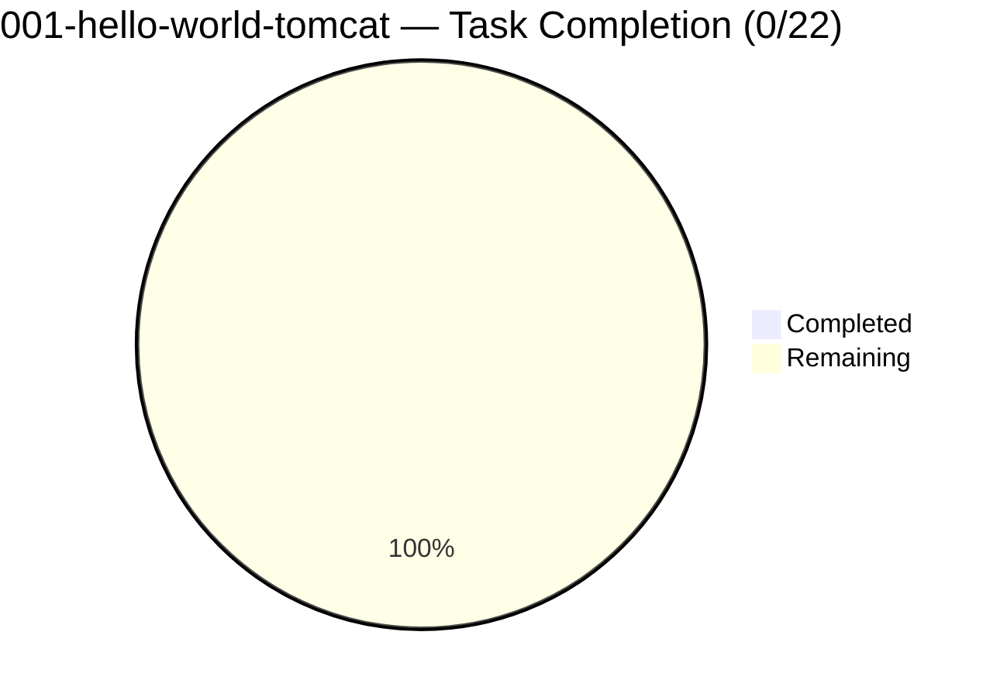

# Feature Progress Dashboard

**Generated**: 2026-05-30
**Branch**: `feat/001-hello-world-tomcat`

## SDD Lifecycle

```mermaid
gantt
    title ResumAIner — Feature Progress
    dateFormat X
    axisFormat %s

    section 001-hello-world-tomcat
    Specify :done, spec, 0, 1
    Plan    :done, plan, 1, 2
    Tasks   :active, tasks, 2, 3
    Implement :impl, 3, 4
    Verify  :veri, 4, 5
```



## Task Progress



## Summary

| Feature | Phase | Tasks | Progress | Artifacts |
|---|---|---|---|---|
| 001-hello-world-tomcat | 📋 Tasks | 0/22 | 0% | spec ✅ plan ✅ tasks ✅ DAG ✅ diagrams ✅ memory ✅ |

## Phase Details

| SDD Phase | Status | Artifacts |
|---|---|---|
| 🔵 Specify | ✅ Complete | `spec.md`, brainstrom log, checklists |
| 🟢 Plan | ✅ Complete | `plan.md`, component/system/architecture diagrams |
| 🟡 Tasks | 🟡 **Active** | `tasks.md` with 21 tasks + 1 build gate, `task-dag.md` |
| 🟠 Implement | ⏳ Pending | Ready to start — Wave 0 tasks are unblocked |
| 🔴 Verify | ⏳ Pending | `HelloWorldControllerTest` + full smoke test |

## Ready to Execute

```
Wave 0 (parallel):     T001  T002  T004          ← can start NOW
                      [SUBAGENT] [SUBAGENT] [SUBAGENT]

T001  → mkdir backend/src/main/java/com/resumainer/...
T002  → cd backend && mvn wrapper:wrapper -Dmaven=3.9.9
T004  → create .gitignore with Java/Maven/IDE/secrets patterns
```

## Next Command

```
/speckit.superpowers.execute 001
```
