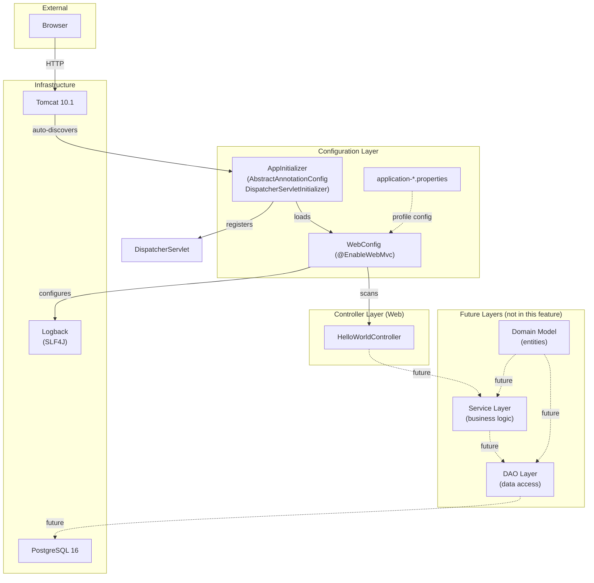

# Software Architecture: ResumAIner Backend

**Feature**: Java Spring MVC Hello World with Docker Compose (Tomcat + PostgreSQL)
**Generated**: 2026-05-30
**Scope**: Full project — architectural patterns for the backend application

---

## Overview

The backend follows a **layered architecture** (controller → service → DAO) as mandated by the project constitution. This Hello World feature implements only the controller layer; service and DAO layers will be added in subsequent features. The architecture prioritises clear layer boundaries, testability, and explicit wiring over convenience or boilerplate reduction.

## Architecture Diagram



## Architectural Pattern: Layered Architecture

**What it is**: Code is organized into horizontal layers where each layer has a specific responsibility. Controllers handle HTTP, services contain business logic, DAOs manage data access. Dependencies point inward — outer layers depend on inner layers, never the reverse.

**Why this pattern**: The project constitution explicitly requires "standard Java layered architecture: `controller/`, `service/`, `dao/`, `model/`, `config/`, `util/`." For a Capstone project with clear separation of concerns, layered architecture is the simplest pattern that enforces discipline without over-engineering. It's also the most familiar pattern for Java developers — any reviewer or future contributor will immediately understand the structure.

**Tradeoffs accepted**:
- ✓ Clear layer boundaries — each layer has one job
- ✓ Easy to test — each layer can be mocked independently
- ✓ Familiar to any Java developer — no learning curve
- ✗ More boilerplate than a flat structure — each layer requires interfaces, implementations, and wiring
- ✗ Can lead to anemic domain model if business logic leaks into services instead of models

## Layer Breakdown

### Controller Layer

**Responsibility**: Handle HTTP requests/responses, validate input, call services.

**Depends on**: Service layer (future)

**Depended on by**: Browser/HTTP client

**Why this boundary exists**: Separates HTTP concerns (parsing requests, setting response codes) from business logic. Without this boundary, service methods would need to know about HTTP headers, status codes, and session management — making them untestable without a running server.

---

### Service Layer (future)

**Responsibility**: Business logic, transaction boundaries, AI integration, PDF generation.

**Depends on**: DAO layer, Domain Model

**Depended on by**: Controller layer

**Why this boundary exists**: Business rules should not depend on HTTP or database implementations. The service layer orchestrates operations using domain objects and DAOs, keeping business logic independent of I/O.

---

### DAO Layer (future)

**Responsibility**: Database queries, result mapping, connection management.

**Depends on**: Domain Model, Connection Pool

**Depended on by**: Service layer

**Why this boundary exists**: Isolates SQL from business logic. DAOs return domain objects; services never write raw SQL. This allows query optimization, migration, or even database changes without affecting business logic.

---

### Configuration Layer

**Responsibility**: Spring MVC wiring, property loading, profile setup, view resolver configuration.

**Depends on**: Nothing (framework-level)

**Depended on by**: All layers (via dependency injection)

**Why this boundary exists**: Keeps framework configuration in one place. Without this boundary, configuration would be scattered across controllers and services, making it hard to understand the system's setup.

---

## Module Organization

**Strategy**: By layer (not by feature)

Files are organized by their architectural role: `controller/`, `config/`, `service/`, `dao/`, `model/`. This is the standard Spring MVC convention and matches the constitution's requirement.

For this Hello World feature, only `controller/` and `config/` exist:
```
backend/src/main/java/com/resumainer/
├── config/
│   └── WebConfig.java
└── controller/
    └── HelloWorldController.java
```

As the project grows, the structure will expand:
```
backend/src/main/java/com/resumainer/
├── config/
├── controller/
├── service/
├── dao/
├── model/
└── util/
```

## Cross-Cutting Concerns

| Concern | Implementation | Layer |
|---|---|---|
| Logging | SLF4J + Logback (dev=DEBUG, prod=INFO) | All layers |
| Error handling | `@ExceptionHandler` or `HandlerExceptionResolver` | Controller layer |
| Validation | Jakarta Validation (`@Valid`) + `BindingResult` | Controller layer (future) |
| Transaction management | Manual JDBC `commit()`/`rollback()` at Service layer | Service layer (future) |
| Security | `HandlerInterceptor` for authorization | Controller layer (future) |

## When This Architecture Evolves

The layered architecture will remain through the project's lifetime — it's required by the constitution. What will evolve:
- **Module granularity**: When the codebase grows beyond ~10 controllers, consider grouping by domain (e.g., `controller/auth/`, `controller/resume/`) while keeping the layer distinction.
- **Interface extraction**: Currently not needed for Hello World. When service and DAO layers are added, each layer should expose an interface that its consumers depend on — enabling mocking and future implementation swaps.
- **AOP**: The constitution requires Spring AOP with AspectJ for cross-cutting concerns (logging, monitoring). This will be added when service-layer business logic is introduced.
