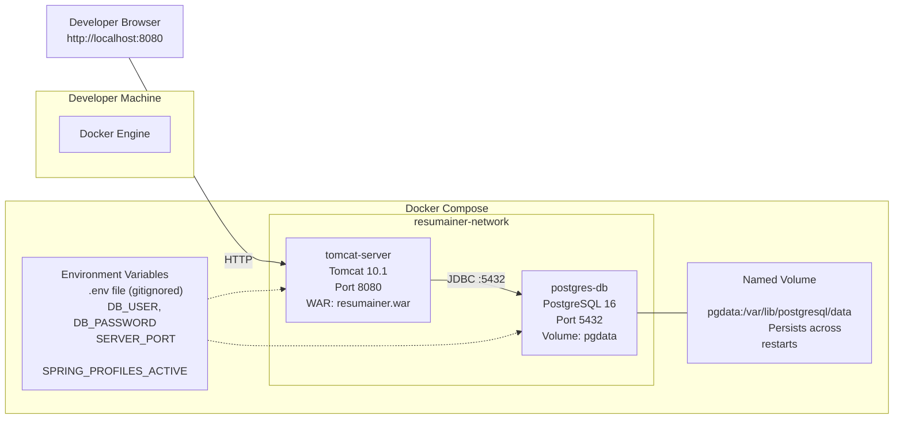
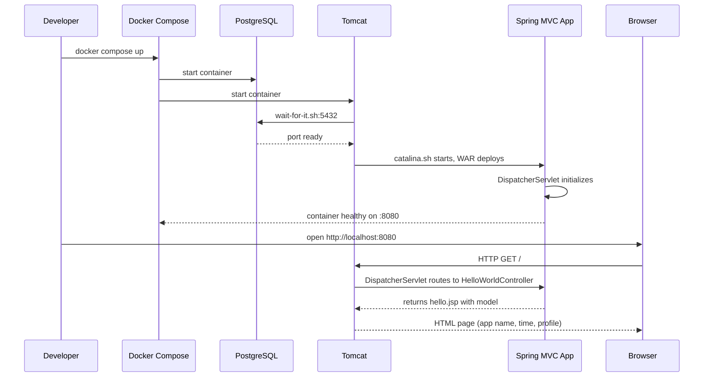

# System Design: Hello World Tomcat Setup

**Feature**: Java Spring MVC Hello World with Docker Compose (Tomcat + PostgreSQL)
**Generated**: 2026-05-30
**Scope**: Full project — infrastructure topology for local development

---

## Overview

The system runs entirely on the developer's machine via Docker Compose. Two containers are orchestrated: a Tomcat 10.1 server serving the Spring MVC WAR, and a PostgreSQL 16 database ready for future features. All communication is local — no external services, no cloud infrastructure, no load balancers.

## System Design Diagram

## Infrastructure Decisions

### Tomcat 10.1 as Servlet Container

**What**: Apache Tomcat 10.1.x (Jakarta Servlet 6.0 compatible) as the application server.

**Why**: Spring MVC requires a servlet container. Tomcat is the standard choice for WAR-based Spring deployment. Version 10.1 supports Jakarta Servlet 6.0 which is required by Spring 6.x. The constitution explicitly requires external Tomcat (no embedded server).

**Alternatives considered**:

| Option | Why it wasn't chosen |
|--------|---------------------|
| Jetty | Less common for Spring MVC; smaller community. Tomcat is the de facto standard. |
| WildFly | Overkill for a single WAR — includes EJB container, messaging engine not needed here. |
| Embedded Tomcat (Spring Boot) | Explicitly forbidden by constitution. |

**When you'd choose differently**: For a microservices architecture with many small services, embedded servers (Undertow, Jetty) would be more resource-efficient. For a monolith WAR, external Tomcat is correct.

---

### PostgreSQL 16

**What**: PostgreSQL 16 (Alpine image) as the database, included in Docker Compose but unused by Hello World.

**Why**: PostgreSQL is required by the project constitution for all persistent data. Adding it now ensures the Docker Compose topology doesn't change when the first database-dependent feature arrives. The Alpine image keeps the container lightweight (~200MB).

**Alternatives considered**:

| Option | Why it wasn't chosen |
|--------|---------------------|
| No database container (add later) | Risk: developer forgets to add it; Docker Compose changes mid-project causing confusion. |
| MySQL | PostgreSQL is specified in the project constitution. |
| H2 in-memory | Suitable for tests only — production data must survive restarts. |

**When you'd choose differently**: For ultra-lightweight development scenarios, SQLite would be simpler. But the project requires PostgreSQL for production parity.

---

### Docker Compose with wait-for-it.sh

**What**: Two containers orchestrated by Docker Compose with a startup script ensuring Tomcat waits for PostgreSQL readiness.

**Why**: Containers start in parallel. Without readiness checks, Tomcat attempts database connections before PostgreSQL is accepting them. The `wait-for-it.sh` script blocks Tomcat's entrypoint until port 5432 responds, giving a clean first startup.

**Alternatives considered**:

| Option | Why it wasn't chosen |
|--------|---------------------|
| `depends_on` alone | Docker Compose `depends_on` only waits for container start, not service readiness. |
| Docker HEALTHCHECK | Only signals health to Docker — doesn't prevent the Tomcat process from trying before DB is ready. |

**When you'd choose differently**: In Kubernetes, `initContainers` or `startupProbes` would be the standard approach instead of entrypoint scripts.

---

## Data Flow

## Scaling & Reliability Notes

For this feature, scaling is not applicable (single developer, local environment). Reliability considerations:
- PostgreSQL data persists via named volume (`pgdata`) across restarts.
- Port conflicts mitigated via environment variable overrides.
- Container restarts are handled by Docker Compose restart policy. No dedicated orchestration.
