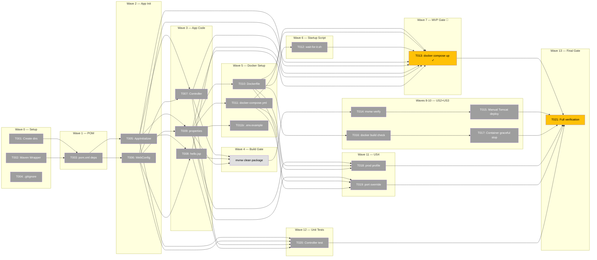

# Task Dependency Graph: Hello World Tomcat Setup



## Legend
- ⚪ Gray — Pending (not started)
- 🟡 Yellow — MVP gate / final gate (milestones)
- ⬜ White — Build step (automated)

## Critical Path
```
T001 → T003 → T005/T006 → T007/T008/T009 → BUILD → T010 → T012 → T013  (7 waves)
```

Longest chain determines minimum completion time: **7 sequential waves** to MVP.

## Statistics

| Метрика | Значение |
|---|---|
| **Total tasks** | 21 (+ 1 build gate) |
| **Completed** | 0 (0%) |
| **Ready to start** (Wave 0) | 3 (T001, T002, T004) |
| **Blocked** | 18 |
| **Execution waves** | 14 |
| **Waves to MVP** | 7 |
| **Parallel waves** | W0(3), W2(2), W3(3), W5(3), W8(2), W11(2) |

## Notes

- No circular dependencies detected ✅
- MVP reachable after Wave 7 (T013)
- Waves 8-13 can proceed independently after MVP milestone
- Generated from `specs/001-hello-world-tomcat/tasks.md`
