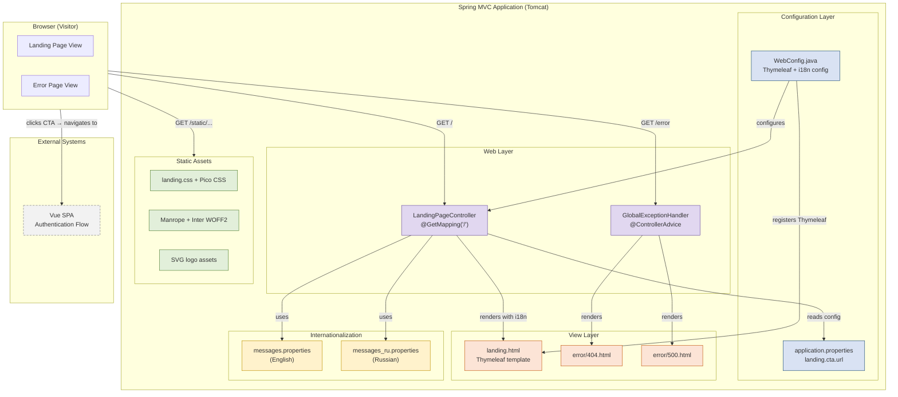

# Component Diagram: Thymeleaf Landing Page

**Feature**: Landing Page that introduces ResumAIner to first-time visitors — 8 sections, bilingual EN/RU, responsive, no auth required
**Generated**: 2026-05-31
**Scope**: Full feature

---

## Overview

This diagram shows the components involved in serving the Landing Page and how they interact. The Landing Page is a server-side rendered Thymeleaf template served through the existing Spring MVC stack. No new services, databases, or API endpoints are introduced — the feature extends the existing backend module with presentation-layer components only.

## Component Diagram

## Component Breakdown

### LandingPageController

**Role**: Serves the Landing Page HTML at the application root URL (`GET /`).

**Why this exists as a separate component**: A dedicated controller keeps the root URL mapping clean and separates landing page logic from other controllers (e.g., `HelloWorldController`). It's also the place where the externalized CTA URL (`landing.cta.url`) is injected via `@Value`, so the navigation target is configurable without code changes.

**Key interactions**:
- → `landing.html`: Renders the Thymeleaf template with i18n messages and CTA URL in the model
- → `application.properties`: Reads `landing.cta.url` for the CTA button target
- → `messages.properties` / `messages_ru.properties`: Resolves all UI text via `#{...}` expression in the template

---

### WebConfig

**Role**: Spring `@Configuration` class that registers the `LandingPageController` bean, configures Thymeleaf (`SpringTemplateEngine`, `ThymeleafViewResolver`), and sets up i18n (`MessageSource`, `LocaleChangeInterceptor`).

**Why this exists as a separate component**: In pure Spring MVC (no Spring Boot), all bean registration and infrastructure wiring must be explicit. `WebConfig` is the single place where the servlet layer's configuration converges. Per memory entry B1 (BUGS.md), `@Controller` alone is invisible — the bean MUST be registered here.

**Key interactions**:
- → `LandingPageController`: Registers it as a Spring bean (prevents 404)
- → `landing.html`: Configures `ThymeleafViewResolver` with `.html` suffix pointing to `templates/`
- → `messages.properties`: Wires `MessageSource` for `#{key}` resolution in Thymeleaf

---

### GlobalExceptionHandler

**Role**: `@ControllerAdvice` that catches unhandled exceptions and `NoHandlerFoundException` (404), returning user-friendly HTML pages without stack traces.

**Why this exists as a separate component**: Separating error handling from the controller keeps the controller focused on the happy path and ensures consistent error presentation across the application. Per Constitution V.2, stack traces must never be exposed to the client.

**Key interactions**:
- → `error/404.html`: Renders for missing pages
- → `error/500.html`: Renders for server errors

---

### landing.html (Thymeleaf Template)

**Role**: The actual HTML page with all 8 sections (Header, Hero, Problem, How It Works, Features, Trust & Control, FAQ, Final CTA). All text is resolved from i18n message keys via `th:text="#{key}"`.

**Why this exists as a separate component**: The template is the presentation layer. Keeping it separate from Java code follows the MVC pattern and allows visual changes without recompilation. The FAQ uses native `
`/`
` — no JavaScript needed (FR-020).

**Key interactions**:
- ← `LandingPageController`: Receives model data (CTA URL, page title)
- ← `messages.properties` / `messages_ru.properties`: Resolves all text based on the active locale
- → `static/...`: References CSS, fonts, and logo assets via static URLs

---

### Static Assets (CSS, Fonts, Logos, Error Pages)

**Role**: Serve visual identity (CSS design tokens, self-hosted fonts), brand assets (SVG logos), and fallback error pages.

**Why this exists as a separate component**: Static assets are served directly by Tomcat without passing through Spring MVC — no controller overhead for CSS/logo requests. Self-hosted fonts (SEC-002) eliminate third-party CDN requests for GDPR compliance and offline reliability.

**Key interactions**:
- ← Browser: Direct HTTP requests for `/static/css/...`, `/static/fonts/...`, `/static/images/...`

---

### i18n Messages (`messages.properties`, `messages_ru.properties`)

**Role**: Store all user-visible text in English and Russian. The active locale is selected via `?lang=en` or `?lang=ru` URL parameter (handled by `LocaleChangeInterceptor`).

**Why this exists as a separate component**: Externalizing all text into property files (Constitution III.1) enables language switching without code changes, keeps the template clean, and allows non-developers to review and edit translations.

**Key interactions**:
- ← `LocaleChangeInterceptor`: Reads `?lang=` parameter, sets locale for the request
- → `landing.html`: Resolves `#{key}` expressions at render time

---

## Design Reasoning

### Why this structure?

The Landing Page follows the standard Spring MVC **Model-View-Controller** pattern already established by the project. The controller (`LandingPageController`) handles routing and configuration injection. The view (`landing.html`) handles presentation with Thymeleaf. The model consists of the CTA URL and the i18n locale context — both externalized and configurable.

The structure is deliberately thin: this is a **static presentation page with no business logic, no database access, and no forms**. Adding unnecessary layers (service, DAO, repository) would violate YAGNI and create speculative complexity. The only non-controller component, `GlobalExceptionHandler`, is justified by the constitution requirement to never expose stack traces.

### Alternatives considered

Not applicable — this feature follows the existing Spring MVC pattern without introducing structural alternatives. The decomposition is the minimum needed for a clean MVC implementation.

### When you'd restructure

If the Landing Page later grows to include dynamic content (e.g., user-specific data, blog/news sections, server-side form processing), the controller would need to be split into multiple controllers or a service layer would be introduced. For the current scope (static presentation), the single-controller approach is correct.
