# Task Dependency Graph: Thymeleaf Landing Page

```mermaid
flowchart TD
    subgraph Phase1["Phase 1: Setup"]
        direction LR
        T001["T001: Remove JSP, add Thymeleaf"]
        T002["T002: Delete hello.jsp"]
        T003["T003: Delete WEB-INF"]
        T004["T004: Create templates/"]
    end

    subgraph Phase2["Phase 2: Foundational ⚠️ Blocks all"]
        direction LR
        T005["T005: LandingPageController"]
        T006["T006: WebConfig + i18n + Security"]
        T007["T007: GlobalExceptionHandler"]
        GATE1["🔧 mvnw clean package"]
    end

    subgraph Phase3["Phase 3: US1 — Content 🎯 MVP"]
        direction LR
        T008["T008: landing.html template"]
        T009["T009: landing.css"]
        T010["T010: Pico CSS"]
        T011["T011: Self-hosted fonts"]
        T012["T012: SVG logos"]
        T013["T013: Error pages 404/500"]
        MVP["✅ MVP: Landing Page visible"]
    end

    subgraph Phase4["Phase 4-6: US2-US4 (i18n + Responsive + Nav)"]
        direction LR
        T014["T014: messages.properties EN"]
        T015["T015: messages_ru.properties RU"]
        T016["T016: Update template i18n"]
        T017["T017: Responsive CSS"]
        T018["T018: Mobile hamburger"]
        T019["T019: Nav anchors scroll"]
        T020["T020: landing.cta.url config"]
        T021["T021: CTA buttons + no Login"]
    end

    subgraph Phase5["Phase 7: Cleanup & Testing"]
        direction LR
        T022["T022: Remove HelloWorldCtrl"]
        T023["T023: Remove old test"]
        T024["T024: Verify JSP removal"]
        T025["T025: LandingPageCtrlTest 🧪"]
        T026["T026: app.properties review"]
        T027["T027: dev.properties review"]
        T028["🏁 Final verification"]
    end

    %% Phase 1 → Phase 2
    T001 --> T004
    T002 --> T004
    T003 --> T004
    T004 --> T005
    T004 --> T006
    T004 --> T007

    %% Phase 2 → build gate
    T005 --> GATE1
    T006 --> GATE1
    T007 --> GATE1

    %% Build gate → Phase 3 (US1)
    GATE1 --> T008
    GATE1 --> T009
    GATE1 --> T010
    GATE1 --> T011
    GATE1 --> T012
    GATE1 --> T013

    %% US1 → MVP
    T008 --> MVP
    T009 --> MVP
    T010 --> MVP
    T011 --> MVP
    T012 --> MVP
    T013 --> MVP

    %% MVP → US2 (i18n)
    MVP --> T014
    MVP --> T015
    T014 --> T016
    T015 --> T016

    %% MVP → US3 (Responsive)
    MVP --> T017
    MVP --> T018

    %% MVP → US4 (Nav & CTA)
    MVP --> T019
    MVP --> T020
    MVP --> T021

    %% MVP → Cleanup
    MVP --> T022
    MVP --> T023
    MVP --> T024
    MVP --> T026
    MVP --> T027

    %% Foundational also feeds T025
    T005 --> T025
    T006 --> T025

    %% Final gate
    T016 --> T028
    T017 --> T028
    T018 --> T028
    T019 --> T028
    T020 --> T028
    T021 --> T028
    T022 --> T028
    T023 --> T028
    T024 --> T028
    T025 --> T028
    T026 --> T028
    T027 --> T028

    %% Styles — all pending
    style T001 fill:#9E9E9E,color:#fff
    style T002 fill:#9E9E9E,color:#fff
    style T003 fill:#9E9E9E,color:#fff
    style T004 fill:#9E9E9E,color:#fff
    style T005 fill:#9E9E9E,color:#fff
    style T006 fill:#9E9E9E,color:#fff
    style T007 fill:#9E9E9E,color:#fff
    style T008 fill:#9E9E9E,color:#fff
    style T009 fill:#9E9E9E,color:#fff
    style T010 fill:#9E9E9E,color:#fff
    style T011 fill:#9E9E9E,color:#fff
    style T012 fill:#9E9E9E,color:#fff
    style T013 fill:#9E9E9E,color:#fff
    style T014 fill:#9E9E9E,color:#fff
    style T015 fill:#9E9E9E,color:#fff
    style T016 fill:#9E9E9E,color:#fff
    style T017 fill:#9E9E9E,color:#fff
    style T018 fill:#9E9E9E,color:#fff
    style T019 fill:#9E9E9E,color:#fff
    style T020 fill:#9E9E9E,color:#fff
    style T021 fill:#9E9E9E,color:#fff
    style T022 fill:#9E9E9E,color:#fff
    style T023 fill:#9E9E9E,color:#fff
    style T024 fill:#9E9E9E,color:#fff
    style T025 fill:#9E9E9E,color:#fff
    style T026 fill:#9E9E9E,color:#fff
    style T027 fill:#9E9E9E,color:#fff
    style T028 fill:#FFC107,color:#000
    style GATE1 fill:#FF9800,color:#fff
    style MVP fill:#4CAF50,color:#fff
```



## Legend
- 🟢 Green — Gate reached (MVP)
- 🟡 Orange — Build gate
- ⚪ Gray — Pending task
- 🟡 Yellow — Final gate

## Critical Path

```
T001 → T004 → T006 → GATE1 → T008 → MVP → T014 → T016 → T028
(9 steps — Setup → Thymeleaf config → Build → Template → MVP → i18n → Final verify)
```

**Alternative critical path**: `T001 → T004 → T005 → GATE1 → T009 → MVP → T017 → T028`
(also 9 steps — same length, runs responsive CSS in parallel)

## Statistics

| Metric | Value |
|---|---|
| Total tasks | 28 |
| Completed | 0 (0%) |
| Pending | 28 (100%) |
| Execution phases | 5 |
| Sequential minimum | 9 waves (critical path) |
| Parallel task groups | 8 opportunities |
| MVP completion | Wave 5 (after Phase 1 → 2 → build → US1) |

## Key Parallel Groups

| Wave | Tasks | Description |
|---|---|---|
| **Wave 0** | T001, T002, T003 | pom.xml + file cleanup (3 parallel) |
| **Wave 2** | T005, T006, T007 | Controller + Config + Errors (3 parallel) |
| **Wave 4** | T008-T013 | Template + CSS + Pico + Fonts + Logos + Errors (6 parallel) |
| **Wave 6** | T014, T015 | EN + RU messages (2 parallel) |
| **Wave 8** | T017, T018 | Responsive CSS + mobile (2 parallel) |
| **Wave 9** | T019, T020, T021 | Nav + CTA config + buttons (3 parallel) |
| **Wave 10** | T022, T023, T024 | Cleanup old files (3 parallel) |
| **Wave 12** | T026, T027 | Config review (2 parallel) |

## Circular Dependency Check

**No circular dependencies detected.** The DAG is a valid directed acyclic graph. All edges flow forward through phases with no backward references.
