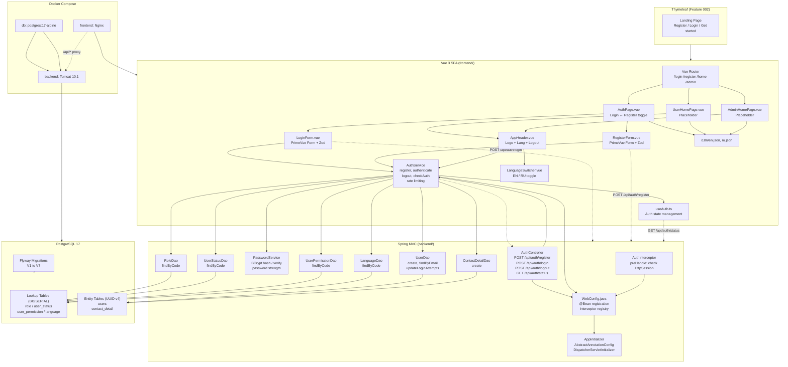

# Component Diagram: Vue Auth Page

**Feature**: Registration, Login, Logout, session management, role-based redirect (User Home / Admin Home placeholder)
**Generated**: 2026-06-02
**Scope**: Full feature — Phase 1 (Backend: Flyway migrations, DAO, Service, Controller, Interceptor), Phase 2 (Frontend: Vue Router, Auth Forms, Placeholder Pages, i18n)

---

## Overview

Auth data flows from the Vue SPA through REST API calls to the Spring MVC backend, where `AuthInterceptor` guards protected routes, `AuthController` handles auth requests, `AuthService` orchestrates business logic and rate limiting, and `UserDao` persists data via JDBC to PostgreSQL. The Landing Page (Thymeleaf, Feature 002) provides entry points to Register/Login.

## Component Diagram

## Component Breakdown

### AuthController

**Role**: HTTP entry point for all authentication operations.

**Why this exists as a separate component**: The controller layer isolates HTTP concerns (request parsing, response formatting, status codes) from business logic. Without it, service methods would need to understand HTTP semantics, making them harder to test and reuse.

**Key interactions**:
- → AuthService: delegates register/login/logout/checkAuth operations
- ← AuthService: receives AuthResponse (success, role, redirectUrl)
- → Jakarta Validation: validates @Valid request DTOs before service call

---

### AuthService

**Role**: Orchestrates authentication business logic: registration (transactional), credential verification, session setup, rate limiting.

**Why this exists as a separate component**: Auth is the only domain in this feature that combines BCrypt verification, rate limiting, transaction management, and integration across 6 different DAOs. Isolating it in a service keeps the controller thin and the DAOs focused on single-table operations.

**Key interactions**:
- → PasswordService: delegates BCrypt hash/verify
- → UserDao: create/find user records
- → RoleDao, StatusDao, PermissionDao, LanguageDao: read lookup values by code
- → ContactDetailDao: create empty profile on registration
- ← AuthController: receives validated requests, returns AuthResponse

---

### AuthInterceptor

**Role**: Guards protected API routes by checking HttpSession for authenticated user.

**Why this exists as a separate component**: Separating request filtering from controller logic keeps security concerns centralized. Adding a new protected path only requires updating path patterns in WebConfig, not modifying controller code. This follows the DRY principle — without it, every controller would need to check session state.

**Key interactions**:
- → HttpSession: reads `user` attribute; returns 401 if absent
- → WebConfig: registered via `addInterceptors()` with path matchers
- → AuthController (indirect): passes through if authenticated

---

### UserDao

**Role**: Single-table data access for the `users` entity (create, findByEmail, findById, updateLoginAttempts, resetLoginAttempts).

**Why this exists as a separate component**: DAO layer encapsulates all SQL behind PreparedStatements, keeping SQL out of service logic. Each DAO maps to one table — this keeps queries focused and testable. Without separate DAOs, service methods would mix business logic with raw JDBC.

**Key interactions**:
- → PostgreSQL `users` table: SELECT/INSERT/UPDATE via PreparedStatement
- ← AuthService: receives User model objects

---

### PasswordService

**Role**: BCrypt password hashing, verification, and strength validation.

**Why this exists as a separate component**: Password hashing is a security-sensitive, algorithm-specific concern. Isolating it means the hashing algorithm can be changed (e.g., upgrade BCrypt cost factor) without touching auth logic. Also independently testable — critical for security validation.

**Key interactions**:
- → BCrypt: `hashpw()`, `checkpw()` calls
- ← AuthService: receives hash/verify results

---

### LoginForm / RegisterForm (Vue)

**Role**: PrimeVue Form components with Zod resolver — handle user input, client-side validation, API submission, loading/error states.

**Why these exist as separate components**: Separating Login and Register into focused components keeps each form's validation schema, fields, and error handling isolated. The parent AuthPage.vue handles only toggle logic and layout. This separation makes each form independently testable and maintainable.

**Key interactions**:
- → authService.ts: sends API requests
- ← authService.ts: receives responses/errors
- → Zod resolver: validates fields before submission
- ← PrimeVue Form: manages field state, error display via Message component

---

### useAuth composable (Vue)

**Role**: Reactive auth state management — tracks `isAuthenticated`, `user`, `role` across the SPA.

**Why this exists as a separate composable**: Centralizing auth state prevents every component from making its own status API calls. It checks auth status once on app mount, then provides the state reactively to any component that needs it (router guards, headers, home pages).

**Key interactions**:
- → authService.ts: checkAuthStatus on mount
- ← AuthController (via authService): receives { authenticated, email, role }
- → Vue Router: updates route guards based on auth state

---

## Design Reasoning

### Why this structure?

The layered architecture (Controller → Service → DAO → JDBC) follows the project's constitution requirement and keeps each layer focused on one concern. The frontend follows Vue 3 Composition API patterns with PrimeVue 4 — separating forms, services, and composables by role. The auth interceptor is placed as a HandlerInterceptor because the project constitution explicitly forbids Spring Security, and an interceptor is the simplest Spring MVC mechanism for request filtering without adding framework dependencies.

The hybrid PK strategy (UUID for entities, BIGSERIAL for lookups) balances security (no ID enumeration on user-facing entities) with performance (small lookup tables don't need UUID overhead).

### Alternatives considered

| Structure | Why it wasn't chosen |
|-----------|---------------------|
| Spring Security filter chain | Constitution forbids Spring Security. HandlerInterceptor is the simplest pure Spring MVC alternative. |
| Monolithic controller handling register + login in one method | Separating by endpoint keeps each method focused, testable, and consistent with REST conventions. |
| JWT-based auth | Server-side sessions are simpler for a single-server Capstone project. JWT adds token refresh/revocation complexity with no benefit. |
| Single lookup table with type discriminator | Separate lookup tables maintain referential integrity via FKs (role_id → role.id), which a discriminator column cannot enforce. |

### When you'd restructure

If the project adds OAuth2 or social login, the `PasswordService` would evolve into an `AuthenticationProvider` interface with password, OAuth2, and maybe SSO implementations. The `AuthInterceptor` would need to coexist with or be replaced by a more sophisticated filter chain. For now, email+password with BCrypt is appropriate for MVP.
