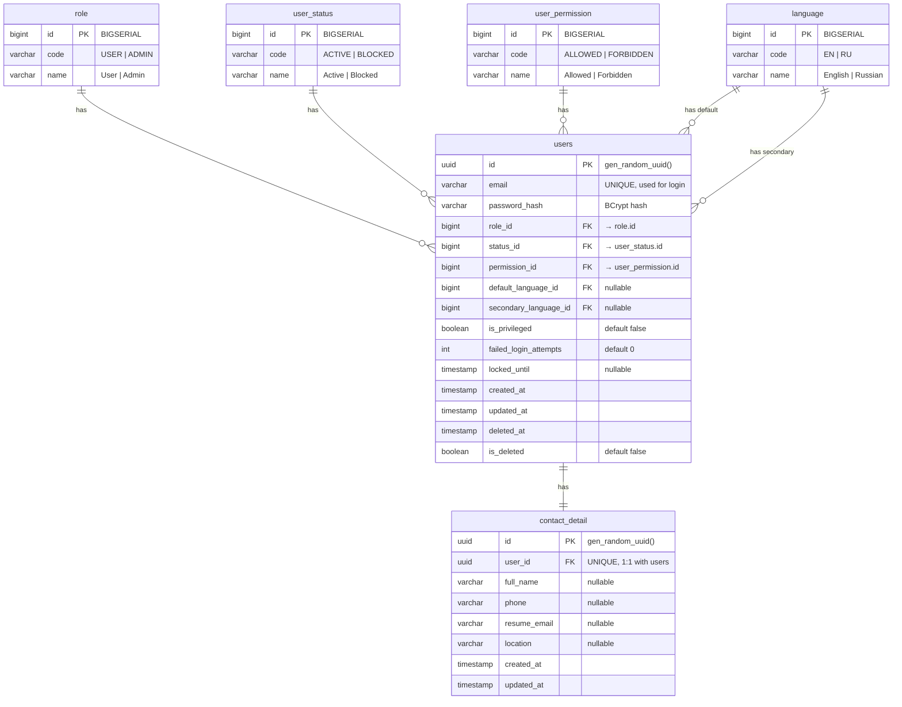

# Data Model: Vue Auth Page

**Date**: 2026-06-02  
**Source**: BA Data Dictionary (`ba-docs/docs/04_domain-and-data-model/data_dictionary.md`)  
**PK Strategy**: Hybrid approach — entity tables use PostgreSQL built-in `gen_random_uuid()` (UUID v4), lookup tables use `BIGSERIAL`. No custom UUID generators or extensions.

## Entity Overview

Six tables for the auth domain, organized as: 4 lookup tables (BIGSERIAL PK) → 2 data tables (UUID PK).



## Table Details

### role
| Column | Type | Constraints | Notes |
|--------|------|-------------|-------|
| id | BIGINT | PK, GENERATED BY DEFAULT AS IDENTITY | BIGSERIAL |
| code | VARCHAR(20) | UNIQUE, NOT NULL | USER, ADMIN |
| name | VARCHAR(50) | NOT NULL | User, Admin |

**Seed data**: USER (code=USER), ADMIN (code=ADMIN)

### user_status
| Column | Type | Constraints | Notes |
|--------|------|-------------|-------|
| id | BIGINT | PK, GENERATED BY DEFAULT AS IDENTITY | BIGSERIAL |
| code | VARCHAR(20) | UNIQUE, NOT NULL | ACTIVE, BLOCKED |
| name | VARCHAR(50) | NOT NULL | Active, Blocked |

**Seed data**: ACTIVE (code=ACTIVE), BLOCKED (code=BLOCKED)

### user_permission
| Column | Type | Constraints | Notes |
|--------|------|-------------|-------|
| id | BIGINT | PK, GENERATED BY DEFAULT AS IDENTITY | BIGSERIAL |
| code | VARCHAR(20) | UNIQUE, NOT NULL | ALLOWED, FORBIDDEN |
| name | VARCHAR(50) | NOT NULL | Allowed, Forbidden |

**Seed data**: ALLOWED (code=ALLOWED), FORBIDDEN (code=FORBIDDEN)

### language
| Column | Type | Constraints | Notes |
|--------|------|-------------|-------|
| id | BIGINT | PK, GENERATED BY DEFAULT AS IDENTITY | BIGSERIAL |
| code | VARCHAR(10) | UNIQUE, NOT NULL | EN, RU |
| name | VARCHAR(50) | NOT NULL | English, Russian |

**Seed data**: EN (code=EN), RU (code=RU)

### users
| Column | Type | Constraints | Notes |
|--------|------|-------------|-------|
| id | UUID | PK, DEFAULT gen_random_uuid() | Built-in UUID v4 |
| email | VARCHAR(255) | UNIQUE, NOT NULL | Used for authentication |
| password_hash | VARCHAR(255) | NOT NULL | BCrypt hash |
| username | VARCHAR(100) | UNIQUE, nullable | Set later in My Profile |
| role_id | BIGINT | FK → role.id, NOT NULL | Default: USER |
| status_id | BIGINT | FK → user_status.id, NOT NULL | Default: ACTIVE |
| permission_id | BIGINT | FK → user_permission.id, NOT NULL | Default: ALLOWED |
| default_language_id | BIGINT | FK → language.id, nullable | |
| secondary_language_id | BIGINT | FK → language.id, nullable | |
| is_privileged | BOOLEAN | NOT NULL, DEFAULT false | |
| failed_login_attempts | INTEGER | NOT NULL, DEFAULT 0 | Rate limiting counter |
| locked_until | TIMESTAMP | nullable | Rate limiting lockout |
| created_at | TIMESTAMP | NOT NULL, DEFAULT now() | |
| updated_at | TIMESTAMP | nullable | |
| deleted_at | TIMESTAMP | nullable | Soft-delete |
| is_deleted | BOOLEAN | NOT NULL, DEFAULT false | |

**Business rules:**
- Email is the unique identifier for authentication. Username is optional (set in My Profile feature).
- New users start with role=USER, status=ACTIVE, permission=ALLOWED.
- `failed_login_attempts` increments on each failed login, resets on successful login.
- When `locked_until > now()`, login returns lockout error regardless of password correctness.
- Soft-delete uses `is_deleted` flag; BLOCKED status uses `status_id`.

### contact_detail
| Column | Type | Constraints | Notes |
|--------|------|-------------|-------|
| id | UUID | PK, DEFAULT gen_random_uuid() | Built-in UUID v4 |
| user_id | UUID | FK → users.id, UNIQUE, NOT NULL | 1:1 with users (UUID) |
| full_name | VARCHAR(255) | nullable | Set later in My Profile |
| phone | VARCHAR(50) | nullable | |
| resume_email | VARCHAR(255) | nullable | |
| location | VARCHAR(255) | nullable | |
| created_at | TIMESTAMP | NOT NULL, DEFAULT now() | |
| updated_at | TIMESTAMP | nullable | |

**Business rules:**
- Created on registration with all nullable fields = NULL.
- User populates fields later in My Profile feature.
- 1:1 relationship enforced by UNIQUE constraint on `user_id`.

## State Transitions

### Account Status Lifecycle
```
Registration → ACTIVE (default)
ACTIVE → BLOCKED (admin action)
BLOCKED → ACTIVE (admin action)
```

### Auth Session Lifecycle
```
Login → Session created (HttpSession, server-side)
Session active → Authenticated requests
Logout → Session invalidated
Session timeout (30 min) → Session invalidated
```

### Rate Limiting State
```
Normal (0 failed) → Failed login → +1 counter
Counter >= 5 → locked_until = now + 15min
Locked → Login returns error (any attempt)
Locked → After 15min → Counter reset → Normal
Any state → Successful login → Counter reset → Normal
```
