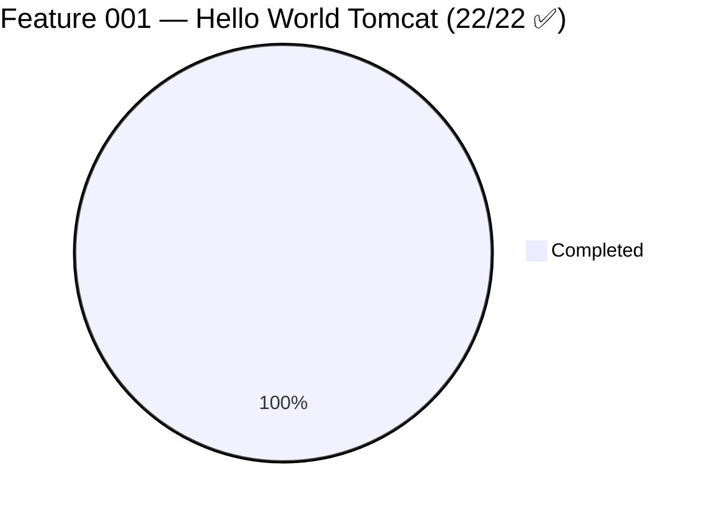
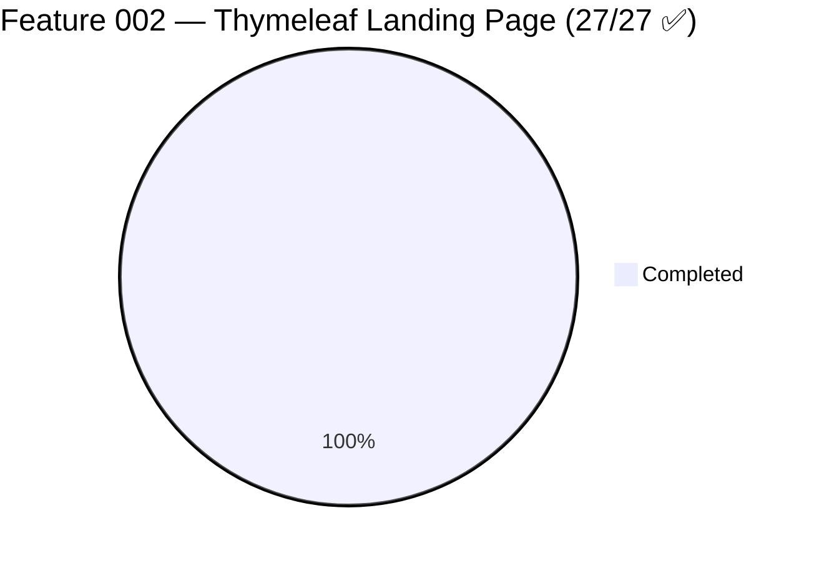
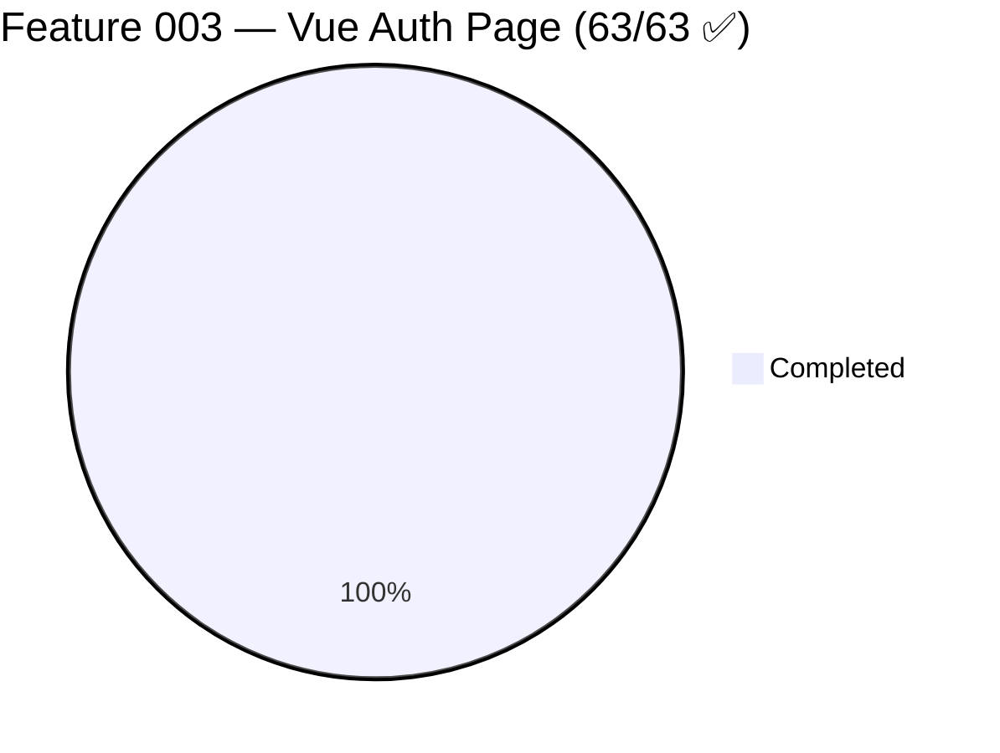

# Feature Progress Dashboard — ResumAIner

**Generated**: 2026-06-03
**Project**: ResumAIner — AI-assisted resume adaptation platform

---

## SDD Feature Progress

```mermaid
gantt
    title SDD Feature Progress — All Features Complete ✅
    dateFormat X
    axisFormat %s

    section 001-hello-world-tomcat
    Specify     :done, s1, 0, 1
    Plan        :done, p1, 1, 2
    Tasks       :done, t1, 2, 3
    Implement   :done, i1, 3, 4
    Verify      :done, v1, 4, 5
    Complete    :done, c1, 5, 6

    section 002-thymeleaf-landing-page
    Specify     :done, s2, 0, 1
    Plan        :done, p2, 1, 2
    Tasks       :done, t2, 2, 3
    Implement   :done, i2, 3, 4
    Verify      :done, v2, 4, 5
    Complete    :done, c2, 5, 6

    section 003-vue-auth-page
    Specify     :done, s3, 0, 1
    Plan        :done, p3, 1, 2
    Tasks       :done, t3, 2, 3
    Implement   :done, i3, 3, 4
    Verify      :done, v3, 4, 5
    Complete    :done, c3, 5, 6
```

---

## Task Completion per Feature

---

## Phase Breakdown

```mermaid
flowchart LR
    subgraph F1["Feature 001<br/>Hello World Tomcat"]
        F1S["📋 Specify"] --> F1P["📐 Plan"] --> F1T["📝 Tasks"] --> F1I["🔨 Implement"] --> F1V["✅ Verify"]
    end
    
    subgraph F2["Feature 002<br/>Thymeleaf Landing Page"]
        F2S["📋 Specify"] --> F2P["📐 Plan"] --> F2T["📝 Tasks"] --> F2I["🔨 Implement"] --> F2V["✅ Verify"]
    end
    
    subgraph F3["Feature 003<br/>Vue Auth Page (active)"]
        F3S["📋 Specify"] --> F3P["📐 Plan"] --> F3T["📝 Tasks"] --> F3I["🔨 Implement"] --> F3V["✅ Verify"]
    end

    F1V --->|Next →| F2S
    F2V --->|Next →| F3S

    style F1 fill:#E8F5E9,stroke:#4CAF50
    style F2 fill:#E8F5E9,stroke:#4CAF50
    style F3 fill:#E8F5E9,stroke:#4CAF50
    style F1V fill:#4CAF50,color:#fff
    style F2V fill:#4CAF50,color:#fff
    style F3V fill:#4CAF50,color:#fff
```

---

## Summary Table

| # | Feature | Status | Branch | Spec | Plan | Tasks | Complete |
|---|---------|--------|--------|------|------|-------|----------|
| 001 | Hello World Tomcat | ✅ **Complete** | `feat/001-hello-world-tomcat` | ✓ | ✓ | 22/22 | 100% |
| 002 | Thymeleaf Landing Page | ✅ **Complete** | `feat/002-thymeleaf-landing-page` | ✓ | ✓ | 27/27 | 100% |
| 003 | Vue Auth Page | ✅ **Complete** | `feat/003-vue-auth-page` | ✓ | ✓ | 63/63 | 100% |

## Detail: Feature 003 — Vue Auth Page

| Phase | Tasks | Status |
|-------|-------|--------|
| P1: Setup | T001–T004 | ✅ 4/4 |
| P2: Foundational | T005–T019 | ✅ 15/15 |
| P3: US1 Registration | T020–T028 | ✅ 9/9 |
| P4: US2 Login | T029–T035 | ✅ 7/7 |
| P5: Interceptor + Config + CSRF | T036–T038, T061–T063 | ✅ 7/7 |
| P6: US3 Redirect | T039–T041 | ✅ 3/3 |
| P7: US6 Placeholder Pages | T042–T046 | ✅ 5/5 |
| P8: US5 Bilingual Forms | T047–T049 | ✅ 3/3 |
| P9: Docker & Integration | T050–T056 | ✅ 7/7 |
| P10: Polish | T057–T060 | ✅ 4/4 |
| **Total** | | **63/63 ✅** |

## Backend Test Results

| Suite | Tests | Status |
|-------|-------|--------|
| AuthController | 7 | ✅ All pass |
| LandingPageController | 3 | ✅ All pass |
| AuthService | 10 | ✅ All pass |
| PasswordService | 9 | ✅ All pass |
| UserDao | 8 | ✅ All pass |
| ContactDetailDao | 2 | ✅ All pass |
| RoleDao / UserStatusDao / UserPermissionDao / LanguageDao | 4 each | ✅ All pass |
| CsrfFilter | 5 | ✅ All pass |
| AuthInterceptor | 2 | ✅ All pass |
| PasswordStrengthValidator | 12 | ✅ All pass |
| **Total** | **74** | **✅ BUILD SUCCESS** |

## JaCoCo Coverage

| Package | Coverage |
|---------|----------|
| Service | 89% ✅ |
| DAO | 82.3% ✅ |
| Controller | 84.5% ✅ |
| Filter | 100% ✅ |
| Interceptor | 96.3% ✅ |
| Config | 90.1% ✅ |
| **Overall** | **73.1% instructions** |
