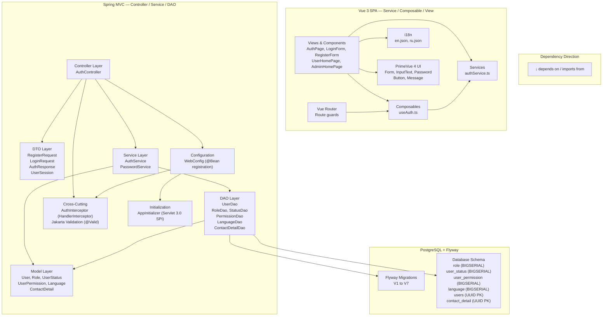

# Software Architecture: Vue Auth Page

**Feature**: Registration, Login, Logout, session management, role-based redirect
**Generated**: 2026-06-02
**Scope**: Architectural patterns for Feature 003 — layered backend (Controller/Service/DAO), Vue 3 Composition API frontend, cross-cutting auth interceptor

---

## Overview

The backend follows a strict **layered architecture** (Controller → Service → DAO) as mandated by the project constitution. Each layer has one responsibility, depends only on the layer below, and communicates through plain Java objects. The frontend uses Vue 3 Composition API with a **service-composable-view** pattern — separating API calls (services), shared state (composables), and presentation (views/components). Cross-cutting concerns (auth, logging, validation) are handled at the controller boundary via HandlerInterceptor and Jakarta Validation.

## Architecture Diagram



## Architectural Pattern: Layered Architecture (Backend)

**What it is**: Code is organized into horizontal layers where each layer has a specific responsibility. Controllers handle HTTP. Services handle business logic. DAOs handle data access. Models represent domain objects. Dependencies point downward — controllers depend on services, services depend on DAOs, never the reverse.

**Why this pattern**: The project constitution explicitly requires `controller/`, `service/`, `dao/`, `model/`, `config/`, `util/` packages. For a Capstone project with a single developer, layered architecture is the simplest pattern that enforces separation of concerns without the ceremony of ports-and-adapters or hexagonal architecture. Each layer is independently testable — you can test AuthService without starting the servlet container, and UserDao without the service layer.

**Tradeoffs accepted**:
- ✓ Clear separation of concerns — SQL never leaks into controllers
- ✓ Independent testability — service tests don't need HTTP context
- ✓ Familiar to any Java developer — no learning curve
- ✗ More files than a flat structure — each layer adds its own class files, but for auth (7 files across layers) this is negligible

---

## Architectural Pattern: Service-Composable-View (Frontend)

**What it is**: Vue 3 SPA code is organized into three conceptual layers: Views (pages and components that render UI), Composables (shared reactive state and operations), and Services (HTTP API calls). Views import composables, composables import services. Services are stateless — they just call fetch and return promises.

**Why this pattern**: Vue 3 Composition API naturally supports this separation. The `useAuth` composable provides a single source of truth for auth state across all components — instead of each component checking `/api/auth/status` independently. Services are pure API clients that can be tested with mocked fetch. Views remain focused on rendering and user interaction.

**Tradeoffs accepted**:
- ✓ Auth state is consistent across the entire SPA — one composable, one source of truth
- ✓ Services are independently testable with Vitest + MSW or similar
- ✓ Views are "dumb" — they just render what composables give them
- ✗ Extra abstraction for a small auth feature — but pays off as more features are added (profile, resume generation all need auth state)

---

## Layer Breakdown

### Controller Layer

**Responsibility**: Parse HTTP requests, validate input, delegate to service, format HTTP responses.

**Depends on**: DTO classes, Service interfaces, Jakarta Validation annotations

**Depended on by**: HTTP clients (Vue SPA, browser), AuthInterceptor (pre-filter)

**Why this boundary exists**: Without it, service methods would need to know about HTTP status codes, request headers, and serialization. A service that currently returns `AuthResponse` for a web controller would need changes if you added a CLI client. The controller adapts the service to the HTTP protocol.

---

### Service Layer

**Responsibility**: Business logic orchestration — registration (transactional), credential verification, rate limiting, session setup.

**Depends on**: DAO interfaces, Model classes, utility services (PasswordService)

**Depended on by**: Controller layer

**Why this boundary exists**: Business logic should not depend on HTTP or SQL. The service layer is where you'd add email notifications, audit logging, or OAuth2 integration without changing controllers or DAOs. It's also where transactions are managed — the service calls `connection.setAutoCommit(false)`, `commit()`, and `rollback()`.

---

### DAO Layer

**Responsibility**: Single-table data access via JDBC PreparedStatement. Maps ResultSet rows to Model objects.

**Depends on**: Model classes, javax.sql.DataSource (from custom Connection Pool)

**Depended on by**: Service layer

**Why this boundary exists**: Each DAO maps to exactly one table — `UserDao` → `users`, `RoleDao` → `role`, etc. This 1:1 mapping keeps SQL focused and testable. Without DAOs, SQL queries would be scattered across services, making it impossible to find all queries affecting the `users` table. The project constitution also requires `dao/` package and PreparedStatement for all SQL.

---

### Cross-Cutting: AuthInterceptor

**Responsibility**: Intercept HTTP requests before they reach controllers. Check HttpSession for authenticated user. Return 401 if missing.

**Depends on**: HttpSession, path pattern configuration in WebConfig

**Depended on by**: All protected API routes (any path not in `/api/auth/*`)

**Why this exists separately**: Security filtering is a cross-cutting concern — it applies to many controllers, not just AuthController. Implementing it in each controller would violate DRY. An interceptor is the simplest Spring MVC mechanism for this: it runs once per request, before the controller, and can block the request before any code executes.

---

### Frontend: Services (authService.ts)

**Responsibility**: Thin wrapper around `fetch()` for auth API endpoints. Returns typed promises.

**Depends on**: Browser `fetch` API, environment config (API base URL)

**Depended on by**: Composables (useAuth.ts), Views (direct calls from forms)

**Why this boundary exists**: Isolating fetch calls into a service means if the API changes (e.g., base URL, headers, response format), you only change one file. Components never call `fetch()` directly — they call `authService.login()`, which is testable with a mocked fetch.

---

### Frontend: Composables (useAuth.ts)

**Responsibility**: Maintain reactive auth state (`isAuthenticated`, `user`, `role`). Provide `login()`, `register()`, `logout()`, `checkAuth()` actions.

**Depends on**: authService.ts

**Depended on by**: Vue Router (route guards), AppHeader (logout button), AuthPage (redirect after auth), UserHomePage/AdminHomePage (display user info)

**Why this boundary exists**: A composable is Vue 3's mechanism for shared state without a global store (Vuex/Pinia). Without it, every component that needs auth state would call `checkAuthStatus()` on mount and manage its own `isAuthenticated` ref — leading to inconsistent state and repeated API calls.

---

## Module Organization

**Strategy**: By layer (backend) + by role (frontend)

**Backend**: All auth code follows the same package structure as the rest of the project:
```
com.resumainer.controller.AuthController
com.resumainer.service.AuthService, PasswordService
com.resumainer.dao.UserDao, RoleDao, UserStatusDao, UserPermissionDao, LanguageDao, ContactDetailDao
com.resumainer.model.User, Role, UserStatus, UserPermission, Language, ContactDetail
com.resumainer.dto.RegisterRequest, LoginRequest, AuthResponse, UserSession
com.resumainer.interceptor.AuthInterceptor
com.resumainer.config.WebConfig  (new @Bean registrations)
```

This package structure is mandated by the constitution (NFR-006) and consistent with Feature 001 (HelloWorldController) and Feature 002 (LandingPageController).

**Frontend**: Organized by role:
```
views/         — page-level components (AuthPage, UserHomePage, AdminHomePage)
components/   — reusable UI components (LoginForm, RegisterForm, LanguageSwitcher, AppHeader)
services/      — API client (authService.ts)
composables/   — shared state (useAuth.ts)
i18n/          — language strings (en.json, ru.json)
router/        — route definitions and guards
```

This follows Vue 3 community conventions and keeps the frontend navigable as more features are added.

---

## When This Architecture Evolves

If the project adds **OAuth2 social login** in the future, the architecture would need to evolve in three places:
1. **Controller layer**: Add `OAuth2Controller` — or adopt Spring Security's OAuth2 client support (which would replace the custom HandlerInterceptor entirely)
2. **Service layer**: Extract an `AuthenticationProvider` interface from `AuthService` — one implementation for password auth, another for OAuth2 tokens
3. **Interceptor**: The `AuthInterceptor` would need to coexist with or be replaced by Spring Security's `SecurityFilterChain`

If the project scales to **multiple Tomcat instances**, sessions would need external storage (Redis) or sticky sessions — the `HttpSession` abstraction makes this swap transparent to the auth code.

For now, the simple email+password approach with HandlerInterceptor is the right fit for MVP — it's secure, testable, and follows the constitution.
