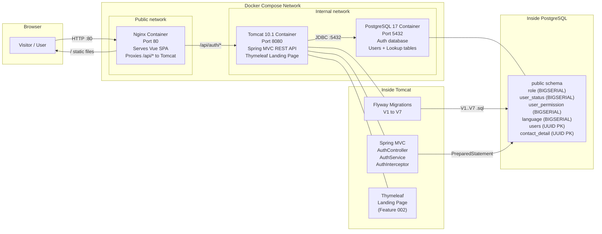
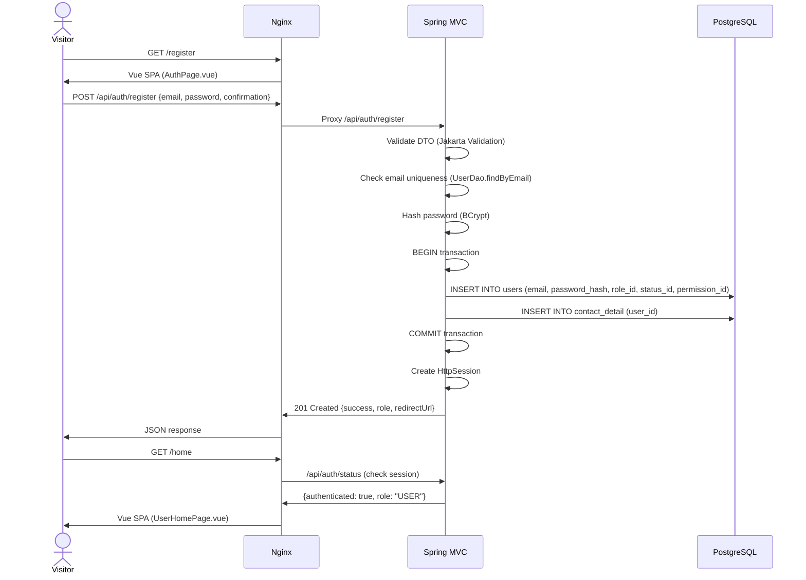
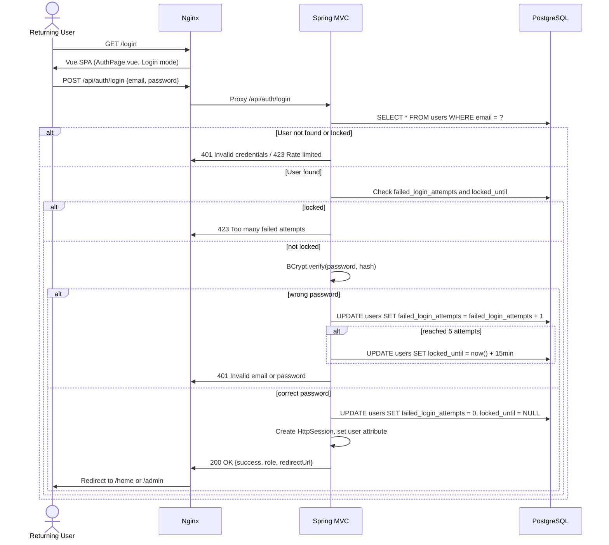

# System Design: Vue Auth Page

**Feature**: Registration, Login, session auth, placeholder home pages
**Generated**: 2026-06-02
**Scope**: New infrastructure for Feature 003 — PostgreSQL 17 container, Flyway migrations, Docker Compose orchestration

---

## Overview

Three Docker containers orchestrated via Docker Compose: PostgreSQL 17 (auth database), Tomcat 10.1 (Spring MVC backend API), and Nginx (Vue 3 SPA static files + API proxy). The Landing Page (Thymeleaf, Feature 002) runs on the same Tomcat instance. All auth data flows through the backend API to PostgreSQL. Frontend is a single-page Vue application served by Nginx with `/api/*` requests proxied to Tomcat.

## System Design Diagram

## Infrastructure Decisions

### PostgreSQL 17 for Auth Storage

**What**: PostgreSQL 17-alpine Docker container for all auth-related data.

**Why**: The project constitution mandates PostgreSQL. Version 17 is the latest stable release with improved UUID handling and performance. The `-alpine` variant keeps the image small (~200MB). PostgreSQL's ACID compliance is essential for transactional registration (user + contact_detail in one transaction).

**Alternatives considered**:

| Option | Why it wasn't chosen |
|--------|---------------------|
| H2 embedded database | In-memory only — data lost on restart. Limited PostgreSQL feature support. |
| MySQL | Constitution mandates PostgreSQL. No reason to override — PostgreSQL has better UUID support. |

**When you'd choose differently**: If the project required horizontal scaling beyond a single instance, you'd consider a managed PostgreSQL service (RDS, Cloud SQL) or connection pooling at the infrastructure level (PgBouncer).

---

### Tomcat 10.1 for Spring MVC Backend

**What**: Apache Tomcat 10.1.28 JDK 21 container running the Spring MVC WAR.

**Why**: Tomcat is the required servlet container for Spring MVC (non-Boot) with Jakarta EE 10 support. It handles the DispatcherServlet, serves Thymeleaf templates (Landing Page), and provides HttpSession management for auth. Multi-stage Docker build compiles with Maven, then deploys the WAR to Tomcat's webapps directory.

**Alternatives considered**:

| Option | Why it wasn't chosen |
|--------|---------------------|
| Jetty | Constitution doesn't specify Jetty. Tomcat is the standard reference implementation for Jakarta Servlet. |
| WildFly / Payara | Overkill for a Capstone project — Tomcat is lighter and simpler for servlet-only apps. |

**When you'd choose differently**: If the project needed full Jakarta EE (EJB, JMS, CDI), WildFly or Payara would be appropriate. For servlet-only + Spring MVC, Tomcat is the right fit.

---

### Nginx for Frontend Serving

**What**: Nginx-alpine container that serves the built Vue 3 SPA statically and proxies `/api/*` requests to Tomcat.

**Why**: Nginx is the industry standard for serving static files and reverse proxying. It handles CORS, compression, and caching better than a Java servlet container. Separating frontend (Nginx) from backend (Tomcat) follows the project's architectural split between `frontend/` and `backend/`.

**Alternatives considered**:

| Option | Why it wasn't chosen |
|--------|---------------------|
| Serve Vue from Tomcat | Mixes static files with Java app — harder to scale independently. Requires WAR packaging of frontend. |
| Dev-only Vite proxy | Only works in development. Production needs a real web server. |

**When you'd choose differently**: For a simpler deployment (single container), you could serve the Vue app from Tomcat's `webapps/ROOT`. But the two-container approach is more professional and matches production patterns.

---

### Flyway for Schema Migrations

**What**: Flyway community edition, auto-configuration via classpath scanning in `db/migration/`.

**Why**: The project constitution mandates Flyway. It version-controls the schema (`V1` to `V7`), ensures all environments are in sync, and runs automatically on application startup. No manual SQL execution needed.

**Alternatives considered**:

| Option | Why it wasn't chosen |
|--------|---------------------|
| Manual SQL scripts | Constitution mandates Flyway. Manual scripts are error-prone and not versioned. |
| Liquibase | Constitution specifies Flyway. Flyway is simpler (plain SQL vs XML/YAML/JSON). |

**When you'd choose differently**: If the project needed cross-database migration support, Liquibase's database-agnostic format would win. For single-database (PostgreSQL), Flyway's SQL-native approach is simpler.

---

## Data Flow

### Registration

### Login

## Scaling & Reliability Notes

- **Single instance**: All containers run on one host. No horizontal scaling for MVP — appropriate for Capstone scale (<100 users).
- **Session affinity**: Not needed — one Tomcat instance. If scaled horizontally, sessions would need external storage (Redis) or sticky sessions.
- **Database persistence**: PostgreSQL data stored in a Docker volume (`pgdata`). Survives container restarts. Backup via `pg_dump` script.
- **Health checks**: PostgreSQL health check via `pg_isready`. Backend depends on healthy DB via Docker Compose `depends_on` + `condition: service_healthy`.
- **Recovery**: On container crash, Docker Compose restarts automatically (`restart: unless-stopped`). DB volume preserves data.
