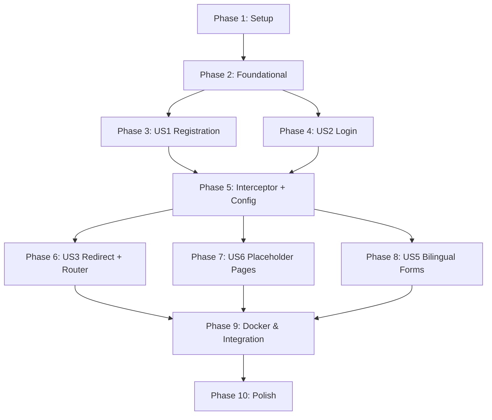

# Tasks: Vue Auth Page

**Input**: Design documents from `specs/003-vue-auth-page/`

**Prerequisites**: plan.md, spec.md, research.md, data-model.md, contracts/api-contracts.md

**Constitution Compliance**: Every task phase MUST reference the ResumAIner Constitution principles:
- **I** — Code Quality & Maintainability (layered architecture, SOLID, no Spring Boot/JPA/Hibernate)
- **II** — Testing Excellence (JUnit 5, Mockito, TDD for business logic, JaCoCo 50%+)
- **III** — User Experience (i18n, dual validation, PRG spinner, error safety)
- **IV** — Performance & Reliability (PreparedStatement, JDBC transactions, UTF-8)
- **V** — Security by Design (BCrypt, no email enumeration, session invalidation, rate limiting, no secrets in logs)

**Organization**: Tasks are grouped by user story to enable independent implementation and testing of each story.

## Format: `[ID] [P?] [Story] Description`

- **[P]**: Can run in parallel (different files, no dependencies)
- **[SUBAGENT]**: Can be delegated to a subagent
- **[TDD]**: Must follow RED-GREEN-REFACTOR discipline
- **[REVIEW]**: Requires code review before proceeding
- **[Story]**: Which user story this task belongs to (e.g., US1, US2)
- Include exact file paths in descriptions

## Path Conventions

- **Backend**: `backend/src/main/java/com/resumainer/`
- **Backend tests**: `backend/src/test/java/com/resumainer/`
- **Backend resources**: `backend/src/main/resources/`
- **Frontend**: `frontend/src/`
- **Docker**: `docker/`

---

## Phase 1: Setup — Scaffolding & Dependencies (P0 from plan)

**Purpose**: Project initialization, dependency management, Docker base setup. Foundation that ALL downstream tasks depend on.

**⚠️ CRITICAL**: No implementation work can begin until this phase is complete.

- [ ] T001 **[P]** Add backend dependencies to `backend/pom.xml`: Flyway, BCrypt (`org.mindrot:jbcrypt:0.4`), Jakarta Bean Validation API, Jackson Databind. Remove unused Thymeleaf dependency for auth (Thymeleaf stays for Landing Page only).
- [ ] T002 **Create Vue 3 + Vite project at `frontend/`** with: Vue 3 (Composition API), PrimeVue 4, Zod, @primevue/forms with zodResolver, Vue Router 4, vue-i18n. Scaffold `package.json`, `vite.config.ts`, `main.ts`, `App.vue`.
- [ ] T003 **[P]** Create base `docker/docker-compose.yml` with: `db` service (postgres:17-alpine, port 5432, volume pgdata, health check pg_isready).
- [ ] T004 Create `backend/src/main/resources/application.properties` with dev profile (DB host, Flyway auto-migration enabled). Create `application-prod.properties` for container DB.

**Checkpoint**: `mvn clean package` succeeds. `docker compose up db` starts PostgreSQL. `npm create vue` scaffold compiles.

---

## Phase 2: Foundational — Database & Backend Infrastructure

**Purpose**: Core infrastructure that MUST be complete before ANY user story can be implemented. Flyway migrations + model classes + DAO layer.

**⚠️ CRITICAL**: No user story work can begin until this phase is complete.

### Flyway Migrations (SQL scripts)

**Constitution IV**: All SQL via PreparedStatement. **Constitution I**: No ORM — plain JDBC only.

- [ ] T005 **[P] [FOUNDATION]** Create `V1__create_role_table.sql` — `role` table with BIGSERIAL PK, `code` (VARCHAR(20) UNIQUE), `name` (VARCHAR(50)).
- [ ] T006 **[P] [FOUNDATION]** Create `V2__create_user_status_table.sql` — `user_status` with BIGSERIAL PK, `code` (ACTIVE/BLOCKED), `name`.
- [ ] T007 **[P] [FOUNDATION]** Create `V3__create_user_permission_table.sql` — `user_permission` with BIGSERIAL PK, `code` (ALLOWED/FORBIDDEN), `name`.
- [ ] T008 **[P] [FOUNDATION]** Create `V4__create_language_table.sql` — `language` with BIGSERIAL PK, `code` (EN/RU), `name`.
- [ ] T009 **[FOUNDATION]** Create `V5__create_users_table.sql` — `users` with UUID PK (`DEFAULT gen_random_uuid()`), `email` (UNIQUE), `password_hash`, `username` (nullable), `role_id` (FK→role), `status_id` (FK→user_status), `permission_id` (FK→user_permission), `default_language_id` (FK→language, nullable), `secondary_language_id` (FK→language, nullable), `is_privileged`, `failed_login_attempts` (DEFAULT 0), `locked_until` (nullable), `created_at`, `updated_at`, `deleted_at`, `is_deleted`. All FKs to lookup tables use BIGINT type.
- [ ] T010 **[FOUNDATION]** Create `V6__create_contact_detail_table.sql` — `contact_detail` with UUID PK (`DEFAULT gen_random_uuid()`), `user_id` (FK→users, UNIQUE), `full_name`, `phone`, `resume_email`, `location`, `created_at`, `updated_at`. All nullable — created as empty shell on registration.
- [ ] T011 **[FOUNDATION]** Create `V7__seed_lookup_data.sql` — INSERT seed data: role (USER, ADMIN), user_status (ACTIVE, BLOCKED), user_permission (ALLOWED, FORBIDDEN), language (EN, RU).

### Model & DTO Classes

- [ ] T012 **[P] [FOUNDATION]** Create model classes in `backend/src/main/java/com/resumainer/model/`: `User.java` (UUID id, String email, String passwordHash, etc.), `Role.java`, `UserStatus.java`, `UserPermission.java`, `Language.java`, `ContactDetail.java`.
- [ ] T013 **[P] [FOUNDATION]** Create DTO classes in `backend/src/main/java/com/resumainer/dto/`: `RegisterRequest.java` (email, password, passwordConfirmation + @NotBlank/@Email/@Size), `LoginRequest.java` (email, password, rememberMe), `AuthResponse.java` (success, role, message, redirectUrl), `UserSession.java` (userId, email, role).

### DAO Layer

**Constitution IV**: All DAOs use PreparedStatement exclusively. **Constitution I**: Each DAO maps to one table.

- [ ] T014 **[P] [TDD] [FOUNDATION]** Create `UserDao.java` in `dao/`: `create(User)`, `findByEmail(String email)`, `findById(UUID id)`, `updateLoginAttempts(UUID id, int attempts, LocalDateTime lockedUntil)`, `resetLoginAttempts(UUID id)`. All via PreparedStatement.
- [ ] T015 **[P] [TDD] [FOUNDATION]** Create `RoleDao.java` in `dao/`: `findByCode(String code)` — returns Role by USER/ADMIN code.
- [ ] T016 **[P] [TDD] [FOUNDATION]** Create `UserStatusDao.java` in `dao/`: `findByCode(String code)`.
- [ ] T017 **[P] [TDD] [FOUNDATION]** Create `UserPermissionDao.java` in `dao/`: `findByCode(String code)`.
- [ ] T018 **[P] [TDD] [FOUNDATION]** Create `LanguageDao.java` in `dao/`: `findByCode(String code)`.
- [ ] T019 **[TDD] [FOUNDATION]** Create `ContactDetailDao.java` in `dao/`: `create(ContactDetail)` — creates empty profile shell on registration.

**Checkpoint**: All 6 Flyway migrations run successfully against PostgreSQL. All 6 model classes compile. All 6 DAOs compile. All 4 DTOs compile. `mvn clean compile` succeeds.

---

## Phase 3: User Story 1 — Registration (Priority: P1) 🎯 MVP

**Goal**: A first-time visitor can register with email + password, get auto-signed-in, and see the User Home placeholder. This is the MVP entry gate.

**Independent Test**: Open registration form, submit valid details, verify redirect to User Home. Submit duplicate email — verify error message.

**Constitution III**: i18n for all messages. **Constitution V**: BCrypt, no secrets in logs. **Constitution II**: TDD for business logic.

### Tests for User Story 1 [TDD]

> **NOTE**: Write these tests FIRST, ensure they FAIL (RED), then implement (GREEN), then refactor.

- [ ] T020 **[TDD] [SUBAGENT] [US1]** Write `PasswordServiceTest.java` in `service/`: `hashPassword_returnsValidHash()`, `verifyPassword_correctHash_returnsTrue()`, `verifyPassword_wrongHash_returnsFalse()`, `verifyPassword_nullInput_throwsException()`.
- [ ] T021 **[TDD] [SUBAGENT] [US1]** Write `AuthServiceTest.java` in `service/`: `register_validInput_createsUser()`, `register_duplicateEmail_throwsException()`, `register_createsContactDetail()`, `register_transactionalRollbackOnFailure()`.
- [ ] T022 **[TDD] [US1]** Write `UserDaoTest.java` in `dao/`: `create_user_persistsCorrectly()`, `findByEmail_existing_returnsUser()`, `findByEmail_missing_returnsNull()`, `findById_returnsCorrectUser()`.
- [ ] T023 **[TDD] [US1]** Write `AuthControllerTest.java` in `controller/` using MockMvc: `POST_register_validInput_returns201()`, `POST_register_duplicateEmail_returns409()`, `POST_register_invalidEmail_returns400()`, `POST_register_passwordMismatch_returns400()`.

### Implementation for User Story 1

- [ ] T024 **[TDD] [US1]** Implement `PasswordService.java` in `service/`: `hashPassword(String plain)` returns BCrypt hash via `org.mindrot.jbcrypt.BCrypt`. `verifyPassword(String plain, String hash)` returns boolean. `isStrongPassword(String)` validates min 8 chars, uppercase, lowercase, digit. **Constitution V**: BCrypt only, never log plaintext passwords.
- [ ] T025 **[TDD] [US1]** Implement `AuthService.java`` in `service/`: `register(RegisterRequest)` — check email uniqueness → hash password → BEGIN transaction → UserDao.create() → ContactDetailDao.create() → COMMIT. On failure: ROLLBACK + throw ServiceException. **Constitution IV**: JDBC transaction management.
- [ ] T026 **[US1]** Implement `AuthController.java` in `controller/`: `@PostMapping("/api/auth/register")` — validate `@Valid RegisterRequest`, call AuthService.register(), set Session attribute (UserSession), return `AuthResponse` with redirectUrl. **Constitution III**: Dual validation (Jakarta + frontend).
- [ ] T027 **[US1]** Add register form fields to `backend/src/main/resources/messages_en.properties` and `messages_ru.properties`: "Email is required", "Password is required", "Passwords do not match", "Email already registered", etc. **Constitution III**: i18n.
- [ ] T028 **[US1]** Add auth event logging in `AuthService`: Log successful registration (INFO with email, timestamp), log validation failures (WARN with field name, violation type). **Constitution V**: No secrets in logs — don't log passwords. Per FR-027.

**Checkpoint**: `POST /api/auth/register` returns 201 with valid input, 409 for duplicate email, 400 for invalid input. User persisted in DB. Session created. All unit tests pass. `mvn test` green.

---

## Phase 4: User Story 2 — Login (Priority: P1) 🎯 MVP

**Goal**: A registered user can log in with email + password, get an active session, and be redirected to User Home (or Admin Home for admin users). Failed attempts trigger rate limiting.

**Independent Test**: Login with valid credentials → User Home. Login with wrong password → error. 5 failed attempts → lockout for 15 min.

### Tests for User Story 2 [TDD]

- [ ] T029 **[TDD] [SUBAGENT] [US2]** Add tests to `AuthServiceTest.java`: `authenticate_validCredentials_returnsUser()`, `authenticate_wrongPassword_throwsException()`, `authenticate_blockedAccount_throwsException()`, `authenticate_after5FailedAttempts_locksAccount()`.
- [ ] T030 **[TDD] [US2]** Add tests to `AuthControllerTest.java` using MockMvc: `POST_login_validInput_returns200()`, `POST_login_wrongPassword_returns401()`, `POST_login_lockedAccount_returns423()`.

### Implementation for User Story 2

- [ ] T031 **[TDD] [US2]** Add `authenticate(LoginRequest)` to `AuthService.java`: find user by email → check status (ACTIVE?) → check locked_until → verify BCrypt password → on failure: increment failed_login_attempts, if >= 5 set locked_until = now+15min → on success: reset counter and locked_until. **Constitution V**: Generic "Invalid email or password" — no email enumeration. Per FR-014, FR-028.
- [ ] T032 **[US2]** Add `@PostMapping("/api/auth/login")` to `AuthController.java`: validate LoginRequest → call AuthService.authenticate() → **invalidate old session (`request.getSession(false).invalidate()`), create new session (`request.getSession(true)`)**, set session attribute with UserSession → return AuthResponse with role-based redirectUrl. Per FR-013, SEC-002.
- [ ] T033 **[US2]** Add `@PostMapping("/api/auth/logout")` to `AuthController.java`: invalidate session → return success response. Per FR-018.
- [ ] T034 **[TDD] [US2]** Add `@GetMapping("/api/auth/status")` to `AuthController.java`: check HttpSession for UserSession attribute → return `{authenticated: true/false, email, role}`.
- [ ] T035 **[US2]** Add login error logging: failed login at WARN level with email, timestamp, failure reason. Successful login at INFO level. Per FR-027.

**Checkpoint**: Login flow works end-to-end. 5 failed attempts → 423 with lockout message. Correct password after lockout expiry works. Session persists across requests. Logout invalidates session. All tests pass.

---

## Phase 5: Cross-cutting Backend — Interceptor & Configuration

**Purpose**: HandlerInterceptor to protect routes, WebConfig to register all beans, exception handling for auth errors. Required by US3 and US4.

- [ ] T036 **[TDD] [US3/US4]** Create `AuthInterceptor.java` in `interceptor/`: `preHandle()` — check HttpSession for `user` attribute. If missing and path requires auth → return 401 with JSON error. Exclude `/api/auth/*` from check. **Constitution V**: Session auth, no stack traces exposed.
- [ ] T062 **[US3/US4]** Create `CsrfFilter.java` in `filter/`: extend `OncePerRequestFilter` — for POST/PUT/DELETE requests, validate `X-CSRF-Token` header matches token stored in session. Skip validation for `/api/auth/*`, `/api/public/**`. On login, generate CSRF token via `SecureRandom`, store in session, send as non-HTTP-only cookie `XSRF-TOKEN` in response. Per OWASP cookie-to-header pattern, SEC-003.
- [ ] T063 **[US3/US4]** Update `AppInitializer.java`: override `getServletFilters()` to register `CsrfFilter`. Update `authService.ts` in Vue: create fetch interceptor that reads `XSRF-TOKEN` from `document.cookie` and adds `X-CSRF-Token` header to all POST/PUT/DELETE requests.
- [ ] T037 **[US3/US4]** Update `WebConfig.java` in `config/`: add `@Bean` methods for `AuthController`, `AuthService`, `PasswordService`, `UserDao`, `RoleDao`, `UserStatusDao`, `UserPermissionDao`, `LanguageDao`, `ContactDetailDao`, `AuthInterceptor`. Implement `WebMvcConfigurer.addInterceptors()` to register AuthInterceptor with path patterns. **Memory B1/B5**: ALL annotated classes need explicit @Bean — this is a critical constitution constraint.
- [ ] T038 **[US3/US4]** Create `AuthExceptionHandler.java` as `@ControllerAdvice` or handle errors directly in controller: map `ServiceException` → 400/401/409/423 with JSON `{message, errorCode, timestamp}`. No stack traces in response. **Constitution III**: Error safety.
- [ ] T061 **[US3/US4]** Configure session timeout: set 30 min default in `AppInitializer` via `dispatcherServlet.getSessionConfig().setMaxInactiveInterval(1800)`. Add "Remember me" support: when `rememberMe=true` in login request, set session max inactive interval to 604800 seconds (7 days). Per FR-011, SC-010.

**Checkpoint**: Unauthenticated requests to `/api/users/...` return 401. Authenticated requests pass through. All beans registered — no "ControllerAdvice beans: none" in logs.

---

## Phase 6: User Story 3 — Already-authenticated Redirect (Priority: P2)

**Goal**: Already signed-in users visiting `/login` or `/register` are redirected to their home page instead of seeing the auth form.

**Independent Test**: Log in, then navigate to `/login` — verify redirect to `/home`. Navigate to `/register` — verify redirect to `/home`. Admin → redirect to `/admin`.

**Implementation (frontend, once Vue is scaffolded)**

- [ ] T039 **[P] [US3]** Create `frontend/src/services/authService.ts`: `register()`, `login()`, `logout()`, `checkAuthStatus()` — fetch calls to `/api/auth/*`. Handle JSON responses, throw on error status codes.
- [ ] T040 **[US3]** Create `frontend/src/composables/useAuth.ts`: reactive `isAuthenticated`, `user` (email), `role`. `checkAuth()` calls `/api/auth/status` on mount. `login()` and `register()` call authService then update state. `logout()` calls authService then clears state.
- [ ] T041 **[US3]** Create `frontend/src/router/index.ts`: routes for `/login`, `/register`, `/home`, `/admin`. **Route guards**: if authenticated and navigating to `/login` or `/register` → redirect to `/home` (or `/admin`). If not authenticated and navigating to `/home` or `/admin` → redirect to `/login`. Per FR-017, FR-019.

**Checkpoint**: Logged-in user visiting `/login` → redirected to `/home`. Not-logged-in user visiting `/home` → redirected to `/login`.

---

## Phase 7: User Story 6 — Placeholder Home Pages (Priority: P2)

**Goal**: After authentication, users see functional placeholder pages (User Home / Admin Home) with navigation elements and empty-state guidance.

**Independent Test**: Login as regular user → User Home with buttons + empty table. Login as admin → Admin Home with nav cards. Verify logout works from both.

**Note**: These pages are structural shells for future features — navigation buttons are functional, stats show placeholder values.

- [ ] T042 **[P] [US6]** Create `frontend/src/components/AppHeader.vue`: logo, LanguageSwitcher, logout button (visible only when authenticated via useAuth).
- [ ] T043 **[P] [US6]** Create `frontend/src/components/LanguageSwitcher.vue`: EN/RU toggle button, calls vue-i18n `locale` change. Persists preference in **localStorage (for Vue SPA) AND in a cookie readable by the backend (for Landing Page Thymeleaf)**. On mount: reads cookie first, falls back to localStorage, falls back to browser default. Per FR-021.
- [ ] T044 **[US6]** Create `frontend/src/views/UserHomePage.vue`: page title "User Home", stats placeholder (0 values), "Edit my profile" button, "Generate new resume" button, empty resume table with "You haven't created any resumes yet" guidance. AppHeader with logout. **PrimeVue**: Button, Card, DataTable (empty), Message components. Per FR-022, FR-024.
- [ ] T045 **[US6]** Create `frontend/src/views/AdminHomePage.vue`: page title "Admin Home", stats placeholder (0 values), navigation cards/links to Users, Resumes, AI Models sections. AppHeader with logout. Per FR-023.
- [ ] T046 **[US6]** Create `frontend/src/views/AuthPage.vue`: single page container with Login/Register toggle. Left panel: info sidebar (logo, product description). Right panel: form card. Staggered slide animation for form switching (from reference CodePen). **PrimeVue**: Card, ScrollPanel.

**Checkpoint**: Auth → User Home with all elements. Admin auth → Admin Home with all elements. Logout works from both.

---

## Phase 8: User Story 5 — Bilingual Auth Pages (Priority: P3)

**Goal**: All auth pages and placeholder pages support English and Russian language switching.

**Independent Test**: Switch to Russian on Login page → all labels, errors, placeholders change. Switch to English → back. Preference persists.

- [ ] T047 **[P] [US5]** Create `frontend/src/i18n/en.json` and `frontend/src/i18n/ru.json`: all auth strings (form labels, placeholders, validation messages, error messages, button labels, home page titles, empty-state text). **Constitution III**: i18n via externalized resource files.
- [ ] T048 **[US5]** Create `frontend/src/components/LoginForm.vue`: PrimeVue Form + Zod resolver. Fields: email (InputText), password (Password with toggleMask), **rememberMe (Checkbox — extends session TTL to 7 days)**. Submit: disable button + spinner. Errors: inline via Message component + generic error banner. Link to Register. i18n via vue-i18n `$t()`. Per FR-010–FR-016, FR-020, FR-026. **Design**: Light Enterprise SaaS (emerald button, canvas background).
- [ ] T049 **[US5]** Create `frontend/src/components/RegisterForm.vue`: PrimeVue Form + Zod resolver. Fields: email (InputText), password (Password with toggleMask + strength meter), confirmPassword (Password). Submit: disable button + spinner. Errors: inline + duplicate email error. Link to Login. i18n. Per FR-001–FR-009, FR-020, FR-026.

**Checkpoint**: All text on Login and Register pages switches between EN/RU. Validation messages in both languages. Preference persists after navigation.

---

## Phase 9: Docker & Full Integration (P3 from plan)

**Purpose**: Containerize backend and frontend, wire them together, verify end-to-end flow.

- [ ] T050 **[P] [DOCKER]** Create `docker/Dockerfile` (backend): multi-stage — Maven build stage (mvn clean package) → Tomcat 10.1 deployment stage (copy WAR to webapps/ROOT.war). Non-root user. **Memory B4**: Ensure shell scripts have LF line endings for Linux.
- [ ] T051 **[P] [DOCKER]** Create `frontend/Dockerfile` (or separate dockerfile): multi-stage — Node build (npm ci && npm run build) → Nginx-alpine serve stage (copy dist/ to html/).
- [ ] T052 **[DOCKER]** Update `docker/docker-compose.yml`: add `backend` service (build from Dockerfile, port 8080, depends_on db with health check, env vars for DB URL). Add `frontend` service (build from frontend/Dockerfile, port 80, depends_on backend, proxy /api/* to backend).
- [ ] T053 **[DOCKER]** Create `docker/scripts/wait-for-it.sh`: bash TCP check (`/dev/tcp`) for PostgreSQL readiness. **Memory B4**: Ensure LF line endings. **Memory D3**: Use bash /dev/tcp not nc.
- [ ] T054 **[DOCKER]** Create `.env` template file: DB credentials (not committed). Create `application-prod.properties` for container environment (DB host from env var).
- [ ] T055 **[INTEGRATION]** Full integration test: `docker compose up --build` from clean checkout. Verify: PostgreSQL starts → Flyway runs V1-V7 → Tomcat deploys → Nginx serves Vue SPA → Register user → Login → User Home placeholder. Test: duplicate email → 409. Test: wrong password → 401. Test: 5 failed attempts → 423.
- [ ] T056 **[INTEGRATION]** Run `mvn clean package` from clean checkout — verify CLI build without IDE. Run `mvn test` — verify all unit tests pass, JaCoCo coverage report generated. Per Constitution I, II.

**Checkpoint**: Full stack runs from `docker compose up`. End-to-end registration + login + placeholder pages. `mvn clean package` succeeds.

---

## Phase 10: Polish & Cross-Cutting

**Purpose**: Final hardening, security review, cleanup.

- [ ] T057 **[REVIEW]** Security review: verify BCrypt used everywhere (no plaintext passwords), generic login errors (no email enumeration), session invalidation on logout, rate limiting tested, no secrets in logs, CSRF protection on auth forms. Per Constitution V, FR-014, FR-027, FR-028.
- [ ] T058 **[P]** Remove `backend/src/main/java/com/resumainer/util/UuidV7Generator.java` if mistakenly created (we use `gen_random_uuid()` in PostgreSQL, no Java-side UUID v7 generator needed). Clean up any references.
- [ ] T059 Implement `PasswordStrengthValidator.java` in `util/`: reusable password strength check (min 8 chars, uppercase, lowercase, digit). Used by both frontend (Zod) and backend (Jakarta Validation). Per FR-004, spec assumptions.
- [ ] T060 Run JaCoCo coverage report. Verify Service layer coverage >= 50%. Add tests for missed branches if below threshold. Per Constitution II.

**Checkpoint**: Security review passed. Coverage >= 50%. All edge cases handled.

---

## Dependencies & Execution Order

### Phase Dependencies

### Parallel Opportunities

| Tasks | Parallel With | Reason |
|-------|---------------|--------|
| T001 (pom.xml) + T002 (Vue scaffold) | Each other | Different directories, no shared files |
| T005-T008 (individual V migrations) | Each other | Each is a separate SQL file |
| T012 (models) + T013 (DTOs) | Each other | No dependencies between model and DTO classes |
| T014-T018 (DAOs) | Each other | Each DAO is a separate Java file |
| T020-T023 (tests for US1) | Each other [SUBAGENT] | Independent test classes |
| T039 (authService.ts) + T042 (AppHeader) | Each other | Different Vue files |
| T050 (Dockerfile) + T051 (frontend Dockerfile) | Each other | Independent Docker configurations |

### Within Each User Story

- Tests (TDD) MUST be written and FAIL before implementation
- DAO before Service, Service before Controller
- Story complete before moving to next priority

---

## Total Tasks: 63

| Phase | Tasks | Count |
|-------|-------|-------|
| P1: Setup | T001–T004 | 4 |
| P2: Foundational | T005–T019 | 15 |
| P3: US1 Registration | T020–T028 | 9 |
| P4: US2 Login | T029–T035 | 7 |
| P5: Interceptor + Config + CSRF | T036–T038, T061–T063 | 7 |
| P6: US3 Redirect | T039–T041 | 3 |
| P7: US6 Placeholder Pages | T042–T046 | 5 |
| P8: US5 Bilingual Forms | T047–T049 | 3 |
| P9: Docker & Integration | T050–T056 | 7 |
| P10: Polish | T057–T060 | 4 |
| **Total** | | **63** |

## Execution Markers Summary

| Marker | Count | Where |
|--------|-------|-------|
| `[P]` | 12 | Independent file creation tasks |
| `[TDD]` | 12 | All DAO (T014-T019), Service (T025, T031), Controller (T034), Interceptor (T036), plus existing tests (T020-T023, T029-T030) |
| `[SUBAGENT]` | 3 | Test classes that can run in parallel |
| `[REVIEW]` | 1 | Security review (Phase 10) |
