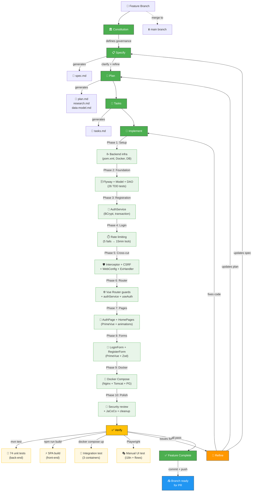

# SDD Workflow Diagram — ResumAIner Project

**Last updated**: 2026-06-03
**Project state**: 3 features completed (68 tasks total)



---

## Legend

| Color | Meaning | Count |
|-------|---------|-------|
| 🟢 **Green** (solid) | Phase completed | All SDD phases |
| 🟢 **Green** (light) | Implementation done | 10/10 phases |
| 🟡 **Yellow** (light) | Verification in progress | 4 test types |
| 🟠 **Orange** | Feedback/refinement | Active loop |
| 🔵 **Blue** | Ready for next step | Branch ready |

## Project Snapshot

| Metric | Value |
|--------|-------|
| **Active branch** | `feat/003-vue-auth-page` |
| **Features completed** | 3 (001 ✅, 002 ✅, 003 ✅) |
| **Total tasks** | 68 (22 + 27 + 63, all complete) |
| **Backend tests** | 74 passing |
| **Frontend build** | ✅ Built |
| **Docker** | 3 containers (Nginx + Tomcat + PG) |
| **Current position** | Feature 003 ready for PR → `main` |

## Phase Breakdown (Feature 003)

```
Phase 1-2:    Backend infrastructure → Flyway + Models + DAO + TDD
Phase 3-4:    Registration + Login with BCrypt + rate limiting
Phase 5:      AuthInterceptor + CsrfFilter + ExceptionHandler
Phase 6-8:    Vue SPA — router, AuthPage, PrimeVue forms, i18n
Phase 9:      Docker Compose — Nginx → Tomcat → PostgreSQL
Phase 10:     JaCoCo + PasswordValidator + security review
Manual test:  6 bugs found and fixed via Playwright + i18n audit
```
