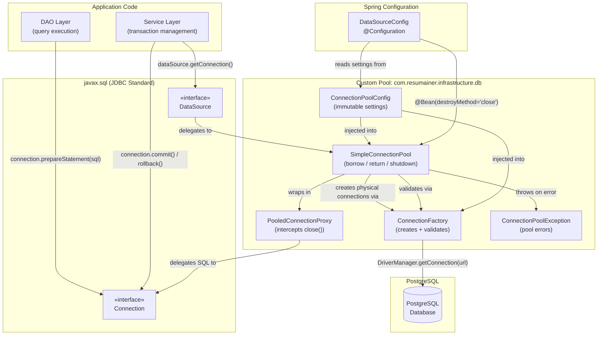

# Component Diagram: Custom JDBC Connection Pool

**Feature**: Replace direct DB connection management with a thread-safe custom JDBC connection pool
**Generated**: 2026-06-04
**Scope**: Full feature — 5 classes in `com.resumainer.infrastructure.db`

---

## Overview

This diagram shows the 5 internal components of the custom connection pool, how they relate to the standard `javax.sql.DataSource` interface, and how Service/DAO layers consume pool connections.

## Component Diagram

## Component Breakdown

### ConnectionPoolConfig

**Role**: Immutable holder of all pool configuration parameters (JDBC URL, credentials, pool sizes, timeouts).

**Why this exists as a separate component**: Configuration is a separate concern from pool mechanics. Keeping it immutable prevents accidental modification during runtime. If pool settings change (e.g., adding a new timeout), only this class changes — the pool logic stays untouched. Follows SRP.

**Key interactions**:
- → SimpleConnectionPool: provides pool size and timeout settings
- → ConnectionFactory: provides JDBC URL, credentials, validation timeout

---

### ConnectionFactory

**Role**: Creates and validates physical `java.sql.Connection` objects to PostgreSQL.

**Why this exists as a separate component**: Connection creation (`DriverManager.getConnection()`) and validation (`Connection.isValid()`) are database-specific concerns. Separating the factory from the pool means you could change how connections are created (e.g., switch to a different DriverManager strategy) without touching pool logic.

**Key interactions**:
- → PostgreSQL: creates actual TCP connections via `DriverManager.getConnection(url, user, pass)`
- → SimpleConnectionPool: returns physical connections for pooling
- ← SimpleConnectionPool: receives requests to validate or close connections

---

### PooledConnectionProxy

**Role**: A dynamic proxy wrapping a physical `java.sql.Connection` that intercepts `close()` and returns the physical connection to the pool instead of destroying it.

**Why this exists as a separate component**: The proxy pattern is non-trivial (Java `InvocationHandler`, method interception). Putting it in its own class keeps the pool logic clean and makes the interception behavior independently testable. Without this separation, `SimpleConnectionPool` would need to know about dynamic proxies, mixing concerns.

**Key interactions**:
- → SimpleConnectionPool: calls `returnConnection(physicalConn)` on `close()`
- → Physical Connection: delegates all SQL methods (prepareStatement, commit, etc.) via reflection
- ← SimpleConnectionPool: wraps borrowed physical connections

---

### SimpleConnectionPool

**Role**: The core pool manager — manages the idle connection queue, enforces max size, handles borrow timeout, and controls shutdown lifecycle. Implements `DataSource`.

**Why this exists as a separate component**: This is the orchestration hub. It coordinates thread-safe borrowing (via `ArrayBlockingQueue.poll(timeout)`), return (via `offer()`), lazy validation, and shutdown. Every other component feeds into this one. Making it the single point of coordination simplifies reasoning about thread safety.

**Key interactions**:
- → ConnectionFactory: creates new connections when pool is growing
- → ConnectionFactory: validates connections before returning to caller
- → PooledConnectionProxy: wraps borrowed connections
- → ConnectionPoolException: throws on timeout, exhaustion, or closed pool
- ← DataSourceConfig: instantiated as Spring `@Bean`
- ← Service Layer: `dataSource.getConnection()` → delegated here

---

### ConnectionPoolException

**Role**: A single runtime exception class for all pool-level errors.

**Why this exists as a separate component**: Having one exception type (instead of `PoolExhaustedException`, `PoolClosedException`, `ConfigInvalidException`, etc.) keeps the code simple for a Capstone project. Callers catch one type and can inspect the message for details. If the project grows, this can be split later.

**Key interactions**:
- → Caller: thrown from `getConnection()` on timeout, closed pool, or config validation failure

---

## Design Reasoning

### Why this structure?

The 5-class decomposition follows Single Responsibility Principle strictly. Each class has exactly one reason to change: config format (Config), connection mechanics (Factory), interception behavior (Proxy), pool policy (Pool), or error format (Exception). This mirrors how production pools like HikariCP are structured — but simplified to the essential 5 classes.

The key architectural decision is separating `ConnectionFactory` from `SimpleConnectionPool`. This means: (1) the pool doesn't know how connections are created — it just asks the factory, (2) testing the pool doesn't require real connections — mock the factory, (3) validation strategy can change independently.

### Alternatives considered

| Structure | Why it wasn't chosen |
|-----------|---------------------|
| Merge Config + Factory into Pool | Would make Pool responsible for: configuration parsing, connection creation, validation, borrowing, and shutdown — violating SRP and making testing harder |
| Separate exceptions per error type | Simpler for a Capstone project to have one exception. Splitting adds 4+ classes with no behavioral benefit at this scale |
| Static wrapper class instead of dynamic proxy | Would need to implement all ~20 Connection methods — error-prone and tedious. Dynamic Proxy delegates everything except close() automatically |

### When you'd restructure

If the project required per-query connection pooling or needed to support multiple database types, `ConnectionFactory` would need to become an interface with implementations (e.g., `PostgresConnectionFactory`, `H2ConnectionFactory`). The current architecture supports this — just add a new implementation without changing the pool.
