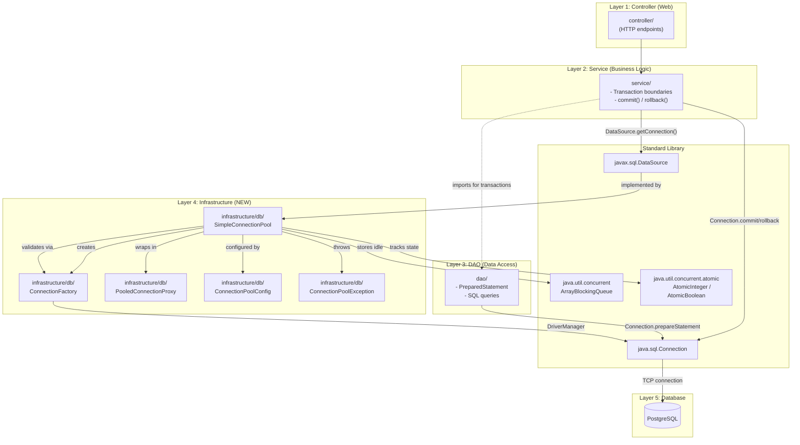

# Software Architecture: Custom JDBC Connection Pool

**Feature**: Custom JDBC Connection Pool — infrastructure for database access
**Generated**: 2026-06-04
**Scope**: New architectural layer and patterns within the existing ResumAIner backend

---

## Overview

The custom connection pool introduces a new `infrastructure/db/` package following a **Layered Architecture** with embedded **Proxy** and **Factory** design patterns. The pool implements the standard `javax.sql.DataSource` interface, making it transparent to the existing Service and DAO layers. Transactions remain managed at the Service layer (not by the pool), preserving the existing manual JDBC transaction pattern.

## Architecture Diagram

## Architectural Pattern: Layered Architecture with Infrastructure Package

**What it is**: Code is organized in horizontal layers where each layer has a specific responsibility. Controllers handle HTTP, services handle business logic, DAOs handle data access, and the new infrastructure package handles cross-cutting technical concerns (connection pooling). Dependencies point downward — outer layers depend on inner layers.

**Why this pattern**: The existing ResumAIner backend already uses this pattern (`controller/`, `service/`, `dao/`, `model/`, `config/`, `util/`). Adding `infrastructure/db/` extends the architecture without breaking it. The pool is a technical infrastructure concern — it doesn't belong in `service/` (business logic) or `dao/` (data mapping). The layered pattern makes it clear where each piece lives and simplifies future replacement with HikariCP.

**Tradeoffs accepted**:
- ✓ Clear separation of concerns — each layer has one job
- ✓ Easy to test — mock the DataSource interface, test the pool independently
- ✓ Easy to replace — swap the pool implementation without touching service or DAO code
- ✗ More files and packages than a flat structure — but the clarity payoff is worth it for reviewability

## Layer Breakdown

### Controller Layer (`controller/`)

**Responsibility**: Handle HTTP requests, validate input, call services, return responses.

**Depends on**: Service layer

**Depended on by**: Nothing (outermost layer)

**Why this boundary exists**: Separating HTTP concerns from business logic means you can test services without starting a web server. Also keeps controllers thin — they only route requests, not contain logic.

---

### Service Layer (`service/`)

**Responsibility**: Orchestrate business operations, manage JDBC transactions (`setAutoCommit(false)`, `commit()`, `rollback()`), coordinate multiple DAO calls atomically.

**Depends on**: DAO layer, DataSource (from infrastructure)

**Depended on by**: Controller layer

**Why this boundary exists**: The service layer owns transaction boundaries. By getting a `Connection` from the pool and passing it to DAO methods, the service ensures atomic multi-table operations either fully commit or fully roll back. If transaction logic were in controllers, you'd have to restart whole HTTP requests on failure.

---

### DAO Layer (`dao/`)

**Responsibility**: Execute SQL queries via `PreparedStatement`, map `ResultSet` to Java objects, throw `DaoException` on failures.

**Depends on**: `java.sql.Connection` (passed from Service layer)

**Depended on by**: Service layer

**Why this boundary exists**: DAO methods encapsulate SQL knowledge. The service doesn't know the table structure — it calls `userDao.createUser(connection, command)`. This means SQL changes (e.g., adding a column) affect only the DAO, not the service.

---

### Infrastructure Layer (`infrastructure/db/`) — NEW

**Responsibility**: Manage database connection lifecycle — create, pool, validate, recycle connections thread-safely.

**Depends on**: PostgreSQL JDBC driver, `java.sql.Connection`, `java.util.concurrent`

**Depended on by**: Service layer (through `DataSource` interface)

**Why this boundary exists**: Infrastructure concerns (connection pooling, thread safety, connection lifecycle) are not business logic. Separating them means:
- The pool can be replaced without touching business code
- Pool logic can be tested independently (mock the factory, no real DB needed)
- The pool is the only code that handles `DriverManager` — business code never sees it

---

### Database Layer (PostgreSQL)

**Responsibility**: Persist and query relational data.

**Depends on**: Nothing

**Depended on by**: Infrastructure layer (via JDBC driver)

## Design Patterns Applied

### GoF: Singleton Pattern (Connection Pool)

The `SimpleConnectionPool` is instantiated once as a Spring `@Bean` and shared across all services. There is exactly one pool instance per application context. This is the Singleton pattern — controlled by Spring's DI container, not by a private constructor.

**Why**: Every connection must go through a single coordinator that enforces the max size limit. Two pools would compete for connections and make resource management unpredictable.

---

### GoF: Factory Pattern (ConnectionFactory)

`ConnectionFactory` encapsulates the logic of creating and validating physical JDBC connections. The pool doesn't know `DriverManager` exists — it just calls `factory.createConnection()`.

**Why**: Decouples connection creation from pool logic. Makes testing possible (mock the factory). Allows changing how connections are created (e.g., add SSL) without touching pool code.

---

### GoF: Proxy Pattern (PooledConnectionProxy)

A Java dynamic proxy wraps every borrowed physical connection. The proxy intercepts the `close()` method to return the physical connection to the pool instead of closing it. All other methods are delegated unchanged to the physical connection.

**Why**: The proxy makes connection reuse transparent. The service/DAO code calls `connection.close()` as usual — the proxy silently returns the connection instead. No special "returnConnection" API needed.

## Module Organization

**Strategy**: By layer — the existing `controller/`, `service/`, `dao/`, `model/`, `config/`, `util/` structure, extended with `infrastructure/db/` for the new pool.

The pool classes live in `com.resumainer.infrastructure.db` because connection pooling is a cross-cutting infrastructure concern, not specific to any business domain. If the project grew to need more infrastructure (caching, rate limiting), they'd go in sibling packages under `infrastructure/`.

## When This Architecture Evolves

After Capstone acceptance, the custom pool would be replaced with HikariCP. Only the `DataSourceConfig` class and `pom.xml` change — the architecture (DataSource interface, service/DAO consuming it) stays identical. This is the primary reason for depending on `DataSource` rather than `SimpleConnectionPool` directly.

If the project grows to need read replicas or multiple database connections, the `DataSourceConfig` would need to create multiple pool instances (one per database) and services would choose which `DataSource` to use. The current single-pool design is intentionally minimal.
