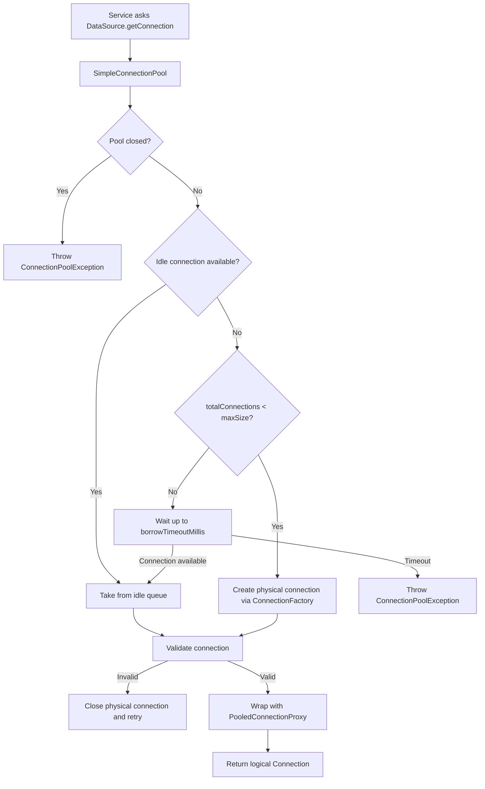
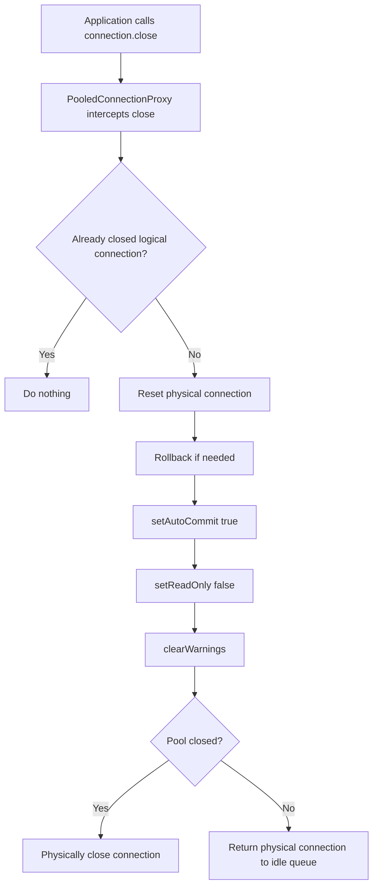

# connection_pool_idea.md

# ResumAIner — Custom JDBC Connection Pool Idea

**Target branch:** `feat/004-custom-jdbc-connection-pool`  
**Project:** ResumAIner Java + Vue Web App  
**Backend stack:** Java 21, Spring MVC without Spring Boot, plain JDBC, PostgreSQL, Flyway, Maven WAR, Tomcat 10.1+  
**Purpose:** Input document for OpenCode + DeepSeek V4 Flash + Spec Kit + Superspec workflow.

---

## 1. Purpose of this document

This document is the source idea for implementing a minimal, professional, thread-safe custom JDBC connection pool for the ResumAIner Capstone project.

The goal is not to build a production-grade replacement for HikariCP.  
The goal is to implement a simple, understandable, defensible, educational custom connection pool that:

- satisfies Capstone requirements;
- follows KISS;
- respects SRP;
- avoids overengineering;
- is easy to explain during code review;
- works reliably enough for a small pet project;
- allows easy post-Capstone replacement with HikariCP.

---

## 2. Important context

The Capstone project requires:

- Spring MVC without Spring Boot;
- plain JDBC, not ORM;
- PostgreSQL;
- Flyway migrations;
- custom thread-safe JDBC connection pool;
- no ready-made pools such as HikariCP, Apache DBCP, C3P0, Tomcat JDBC Pool;
- manual transaction management in the Service layer using:
  - `connection.setAutoCommit(false)`
  - `connection.commit()`
  - `connection.rollback()`
- DAO methods must use `PreparedStatement`;
- code must be understandable and reviewable.

---

## 3. Main architectural decision

Implement a custom connection pool as a Spring-managed `DataSource`.

Application code must depend on:

```java
DataSource dataSource;
```

not on:

```java
SimpleConnectionPool simpleConnectionPool;
```

This is important because after Capstone acceptance the educational custom pool can be replaced by HikariCP with minimal changes.

---

## 4. Final class structure

Use this exact package:

```text
com.resumainer.infrastructure.db
├── ConnectionPoolConfig.java       // stores pool settings
├── ConnectionFactory.java          // creates and validates physical JDBC connections
├── PooledConnectionProxy.java      // intercepts close() and returns connection to pool
├── SimpleConnectionPool.java       // manages borrow, return, initialization, shutdown
└── ConnectionPoolException.java    // one pool-level runtime exception
```

Do not add extra classes unless a real implementation need appears.

---

## 5. SRP explanation

### 5.1 ConnectionPoolConfig

Responsibility: store immutable connection pool settings.

Reason to change: pool/database configuration changes.

Fields:

```java
String jdbcUrl;
String username;
String password;
int initialSize;
int maxSize;
long borrowTimeoutMillis;
int validationTimeoutSeconds;
```

Recommended defaults for local development:

```properties
db.pool.initial-size=2
db.pool.max-size=10
db.pool.borrow-timeout-ms=5000
db.pool.validation-timeout-seconds=2
```

---

### 5.2 ConnectionFactory

Responsibility: create and validate physical JDBC connections.

Reason to change: physical connection creation or validation strategy changes.

Expected methods:

```java
Connection createConnection();
boolean isValid(Connection connection);
void closeQuietly(Connection connection);
```

Validation should be minimal:

```java
connection != null
!connection.isClosed()
connection.isValid(validationTimeoutSeconds)
```

No background scheduler.  
No idle eviction thread.  
No complex lifecycle management here.

This class represents the Factory pattern.

---

### 5.3 PooledConnectionProxy

Responsibility: create a logical `Connection` proxy around a physical JDBC connection.

Reason to change: logical close behavior changes.

Core idea:

- application receives a logical `Connection`;
- application calls `connection.close()`;
- physical connection is not closed;
- physical connection is reset and returned to the pool.

Important behavior:

```text
close() on proxy != physical close
close() on proxy == return to pool
```

Use Java dynamic proxy with `InvocationHandler`.

---

### 5.4 SimpleConnectionPool

Responsibility: manage pool lifecycle and resource coordination.

Reason to change: pool borrowing/returning/shutdown policy changes.

It should manage:

- initial connection creation;
- idle connection queue;
- max pool size;
- borrow timeout;
- validation before borrow;
- returning connections;
- graceful shutdown.

It should not:

- know business transactions;
- know DAO logic;
- know SQL;
- know user accounts;
- expose REST endpoints;
- expose statistics API;
- implement leak detection.

---

### 5.5 ConnectionPoolException

Responsibility: represent pool-level infrastructure errors.

Use one exception class only.

Examples of messages:

```text
Could not initialize connection pool.
Could not acquire database connection within 5000 ms. Pool may be exhausted.
Could not create physical database connection.
Connection pool is already closed.
```

Do not add separate `PoolExhaustedException` for the Capstone version.

---

## 6. Thread-safety design

Use:

```java
BlockingQueue<Connection> idleConnections = new ArrayBlockingQueue<>(maxSize);
AtomicInteger totalConnections = new AtomicInteger(0);
AtomicBoolean closed = new AtomicBoolean(false);
```

Why:

- `BlockingQueue` is thread-safe and safely coordinates multiple request threads;
- `AtomicInteger` safely tracks total physical connections;
- `AtomicBoolean` safely tracks pool shutdown state.

Do not use:

```java
ConcurrentHashMap borrowedConnections
```

Reason: borrowed connection tracking is mainly useful for leak detection and pool statistics.  
Both are intentionally excluded from this minimal Capstone implementation.

---

## 7. What we intentionally exclude

Do not implement:

- HikariCP;
- Apache DBCP;
- C3P0;
- Tomcat JDBC Pool;
- leak detection;
- borrowed connection tracking;
- pool statistics;
- REST endpoint for pool stats;
- JMX;
- hot reload configuration;
- scheduled idle eviction;
- background validation thread;
- prepared statement cache;
- async connection creation;
- per-user database credentials;
- `@Transactional`;
- Spring `JdbcTemplate`;
- ORM;
- Hibernate;
- JPA.

---

## 8. Borrow flow



---

## 9. Return flow



---

## 10. Minimal validation strategy

Validation happens lazily at borrow time.

That means:

- no background thread;
- no periodic idle validation;
- no scheduled eviction;
- dead connections are detected before being returned to application code.

If a connection is invalid:

1. close it physically;
2. decrease total connection count;
3. try to borrow/create another connection;
4. if no connection can be acquired before timeout, throw `ConnectionPoolException`.

Reasoning for code review:

> The implementation intentionally uses lazy validation at borrow time instead of background idle eviction. This keeps the pool simple, deterministic, and easy to explain while still protecting application code from receiving obviously dead connections.

---

## 11. getConnection(username, password)

`DataSource` includes:

```java
Connection getConnection();
Connection getConnection(String username, String password);
```

For this project only `getConnection()` is supported.

Implement:

```java
@Override
public Connection getConnection(String username, String password) throws SQLException {
    throw new SQLFeatureNotSupportedException(
            "Custom per-user database credentials are not supported by this connection pool"
    );
}
```

Reason:

- backend connects to PostgreSQL using one technical database user;
- application users are stored in the `users` table;
- database users are not created per application user;
- this feature is out of MVP/Capstone scope.

---

## 12. Transaction policy

Transactions are not managed by the pool.

Transactions must be managed manually in the Service layer.

Example:

```java
public Long registerUser(RegisterUserCommand command) {
    Connection connection = null;

    try {
        connection = dataSource.getConnection();
        connection.setAutoCommit(false);

        Long userId = userDao.createUser(connection, command);
        profileDao.createEmptyProfile(connection, userId);

        connection.commit();
        return userId;

    } catch (Exception e) {
        rollbackQuietly(connection);
        throw new ServiceException("Failed to register user", e);

    } finally {
        closeQuietly(connection);
    }
}
```

DAO methods receive `Connection` as an argument when they participate in a service transaction.

Example:

```java
public Long createUser(Connection connection, RegisterUserCommand command) {
    String sql = """
            INSERT INTO users (email, password_hash, role_id, status_id)
            VALUES (?, ?, ?, ?)
            RETURNING id
            """;

    try (PreparedStatement statement = connection.prepareStatement(sql)) {
        statement.setString(1, command.email());
        statement.setString(2, command.passwordHash());
        statement.setLong(3, command.roleId());
        statement.setLong(4, command.statusId());

        try (ResultSet resultSet = statement.executeQuery()) {
            if (resultSet.next()) {
                return resultSet.getLong("id");
            }
            throw new DaoException("User was not created");
        }
    } catch (SQLException e) {
        throw new DaoException("Failed to create user", e);
    }
}
```

---

## 13. Required Spring configuration

Create a Spring `@Configuration` class if not already present.

Example:

```java
@Configuration
public class DataSourceConfig {

    @Bean(destroyMethod = "close")
    public DataSource dataSource() {
        ConnectionPoolConfig config = new ConnectionPoolConfig(
                jdbcUrl,
                username,
                password,
                initialSize,
                maxSize,
                borrowTimeoutMillis,
                validationTimeoutSeconds
        );

        ConnectionFactory factory = new ConnectionFactory(config);
        return new SimpleConnectionPool(config, factory);
    }
}
```

Important:

- expose the bean as `DataSource`;
- do not inject `SimpleConnectionPool` into services/DAOs;
- use `@Bean(destroyMethod = "close")` for graceful shutdown;
- avoid Spring Boot configuration conventions.

---

## 14. Migration to HikariCP later

The educational pool must be easy to replace after Capstone.

To make migration easy:

- application code depends on `DataSource`;
- service code does not use `SimpleConnectionPool`;
- DAO code does not use `SimpleConnectionPool`;
- only Spring configuration creates the concrete pool.

Later post-MVP replacement:

```java
@Bean
public DataSource dataSource() {
    HikariConfig config = new HikariConfig();
    config.setJdbcUrl(jdbcUrl);
    config.setUsername(username);
    config.setPassword(password);
    config.setMaximumPoolSize(10);
    return new HikariDataSource(config);
}
```

Only configuration and `pom.xml` should change.

---

## 15. Old implementation cleanup

Before implementing this feature:

1. search for all existing connection-related classes;
2. identify any old or temporary connection manager implementation;
3. remove obsolete classes;
4. remove obsolete configuration;
5. remove unused imports;
6. remove direct `DriverManager.getConnection()` usage outside `ConnectionFactory`;
7. ensure no services/DAOs instantiate database connections manually;
8. ensure no code depends directly on old connection classes.

Search keywords:

```text
DriverManager.getConnection
ConnectionManager
DatabaseConnection
DbConnection
ConnectionProvider
SimpleConnectionPool
DataSource
getConnection
```

Final desired rule:

```text
Only ConnectionFactory may create physical JDBC connections.
Only Spring config may create the DataSource bean.
Services and DAOs must depend on DataSource or receive Connection explicitly.
```

---

## 16. Expected tests

Add unit tests for:

1. pool initializes `initialSize` connections;
2. `getConnection()` returns a non-null logical connection;
3. `connection.close()` returns connection to pool instead of physically closing it;
4. pool does not exceed `maxSize`;
5. pool waits and throws `ConnectionPoolException` when exhausted;
6. invalid connection is not returned to application code;
7. `close()` on pool closes idle physical connections;
8. `getConnection(username, password)` throws `SQLFeatureNotSupportedException`;
9. returned connection is reset before returning to idle queue;
10. repeated `close()` on proxy is safe.

Use JUnit 5 and Mockito.

Do not require real PostgreSQL for unit tests if mocks are enough.  
Integration tests with real PostgreSQL can be added later if needed.

---

## 17. Required Javadoc / documentation

Add Javadoc to public classes and important public methods.

Javadoc must explain:

- why custom pool exists;
- why ready-made pools are not used;
- thread-safety model;
- lifecycle;
- borrow timeout behavior;
- validation behavior;
- why `close()` returns connection to the pool;
- why `getConnection(username, password)` is unsupported;
- how this can be replaced with HikariCP later.

---

## 18. Acceptance criteria

The feature is complete when:

- custom pool implements `DataSource`;
- application uses `DataSource`, not concrete pool type;
- pool uses `BlockingQueue`;
- pool uses `AtomicInteger` or equivalent safe counter;
- pool creates `initialSize` connections on startup;
- pool never creates more than `maxSize` physical connections;
- borrow waits up to `borrowTimeoutMillis`;
- timeout gives clear `ConnectionPoolException`;
- connection is minimally validated before use;
- logical `connection.close()` returns physical connection to pool;
- physical connection is reset before returning;
- pool has graceful shutdown;
- old connection implementation is removed;
- no direct `DriverManager.getConnection()` remains outside `ConnectionFactory`;
- `getConnection(username, password)` is explicitly unsupported;
- tests cover core pool behavior;
- Javadoc/design notes are present;
- no HikariCP/DBCP/C3P0/Tomcat Pool dependency is added.

---

# Spec Kit / Superspec workflow guidance

## A. Brainstorming stage

Use this idea document as the authoritative input.

Brainstorming must answer:

1. Are the five classes enough?
2. Is SRP respected?
3. Are there any hidden old connection artifacts?
4. Is `DataSource` abstraction used correctly?
5. Are requirements still KISS?
6. Are we accidentally building a HikariCP clone?
7. Are there risks for service-layer manual transactions?
8. What exact files need to be created, modified, or deleted?

Output expected:

```text
docs/brainstorming/custom-jdbc-connection-pool-brainstorm.md
```

The brainstorm artifact must not add leak detection, stats, scheduler, JMX, hot reload, or ORM.

---

## B. Research stage

Research must focus only on practical implementation uncertainties:

- Java `DataSource` contract;
- dynamic proxy for `Connection`;
- `BlockingQueue` behavior;
- `AtomicInteger` usage;
- `Connection.isValid`;
- safe reset before returning connection;
- Spring MVC non-Boot bean lifecycle;
- unit testing strategy with mocks.

Output expected:

```text
specs/004-custom-jdbc-connection-pool/research.md
```

Research must not recommend HikariCP for the Capstone implementation.  
It may mention HikariCP only as post-Capstone replacement.

---

## C. Spec stage

Create a Spec Kit specification for:

```text
Custom JDBC Connection Pool
```

The spec must define user/developer stories like:

- As a backend developer, I want a custom thread-safe DataSource so that the app can use JDBC without third-party pools.
- As a reviewer, I want clear class responsibilities so that the design is easy to review.
- As a future maintainer, I want the app to depend on DataSource so that the custom pool can be replaced later.

Spec must include functional requirements and non-functional requirements.

---

## D. Plan stage

The implementation plan must be small and reviewable.

Recommended phases:

1. inspect and clean current DB connection implementation;
2. create config and factory;
3. create pool core;
4. create proxy;
5. wire Spring DataSource bean;
6. adapt services/DAOs to use DataSource/Connection correctly;
7. add tests;
8. add Javadocs and README/design notes;
9. run Maven tests/package.

---

## E. Tasks stage

Tasks must be small.

Example tasks:

- Find current direct usages of `DriverManager.getConnection`.
- Delete obsolete connection classes.
- Create `ConnectionPoolConfig`.
- Create `ConnectionFactory`.
- Create `ConnectionPoolException`.
- Create `PooledConnectionProxy`.
- Create `SimpleConnectionPool`.
- Add Spring `DataSource` bean.
- Update DAO/service connection usage.
- Add unit tests for borrow/return.
- Add unit tests for timeout.
- Add unit tests for unsupported credential method.
- Add Javadoc.
- Run `mvn clean test`.
- Run `mvn clean package`.

---

## F. Review checklist for Anna / ChatGPT

After DeepSeek creates artifacts, check:

- Did it keep exactly the agreed 5-class structure?
- Did it avoid `borrowedConnections`?
- Did it avoid leak detection?
- Did it avoid pool stats?
- Did it avoid background scheduler?
- Did it avoid HikariCP dependency?
- Did it use `DataSource` abstraction?
- Did it keep `ConnectionFactory`?
- Did it keep `PooledConnectionProxy` separate?
- Did it use one `ConnectionPoolException`?
- Did it keep validation minimal?
- Did it explicitly reject `getConnection(username, password)`?
- Did it keep transactions in Service layer?
- Did it use `PreparedStatement` in DAO examples?
- Did it remove old connection implementation artifacts?
- Did it write tests?
- Did it add Javadoc/design notes?

---

## Final expected branch

```text
feat/004-custom-jdbc-connection-pool
```

Reason: follows the existing numbered `feat/00x-*` branch convention in the project.
