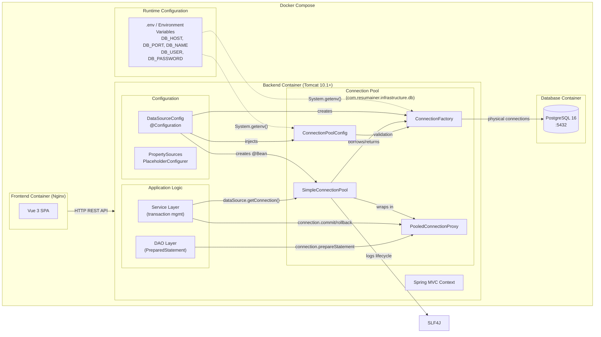

# System Design: Custom JDBC Connection Pool

**Feature**: Custom JDBC Connection Pool — infrastructure for database access
**Generated**: 2026-06-04
**Scope**: New infrastructure layer within existing backend

---

## Overview

This diagram shows how the custom JDBC connection pool fits into the existing ResumAIner backend infrastructure. The pool sits between the Service/DAO layers and PostgreSQL, managed by Spring as a `DataSource` bean. No new containers or services are introduced — the pool operates inside the existing Tomcat backend container.

## System Design Diagram

## Infrastructure Decisions

### Custom Connection Pool over HikariCP

**What**: Implement a custom thread-safe JDBC connection pool instead of using HikariCP, Apache DBCP, or Tomcat JDBC Pool.

**Why**: The Capstone project explicitly requires a custom pool to demonstrate understanding of thread-safe resource management, JDBC DataSource contract, connection lifecycle, and blocking queue coordination. The pool is designed to be replaceable with HikariCP after acceptance — only the Spring `@Bean` method and `pom.xml` dependency change.

**Alternatives considered**:
| Option | Why it wasn't chosen |
|--------|---------------------|
| HikariCP | Project constraint — custom pool required by Capstone. Will be used post-acceptance |
| Apache DBCP2 | Same constraint. Also: adds unnecessary dependencies |
| No pool (DriverManager per request) | Existed before this feature. Creates connection per request — exhausts database resources under load |

**When you'd choose differently**: After Capstone acceptance. Replace `SimpleConnectionPool` with `HikariDataSource` in `DataSourceConfig` and add `com.zaxxer:HikariCP` to `pom.xml`. No other code changes needed because all application code depends on `DataSource`, not `SimpleConnectionPool`.

---

### Configuration via Environment Variables

**What**: Pool reads database credentials from environment variables (`DB_HOST`, `DB_PORT`, `DB_NAME`, `DB_USER`, `DB_PASSWORD`) via `System.getenv()`.

**Why**: Pure Spring MVC (no Spring Boot) does not resolve `${...}` placeholders in strings automatically. Using `System.getenv()` works reliably in all environments — local dev, Docker Compose, and VPS. This follows the bug guard from project memory (B2 — DataSource URL placeholders).

**Alternatives considered**:
| Option | Why it wasn't chosen |
|--------|---------------------|
| Spring `${...}` placeholders | Would not resolve — B2 bug pattern. Works only with `PropertySourcesPlaceholderConfigurer` on `@Value` annotations, not in `DriverManager.getConnection()` |
| Hardcoded defaults | Unsafe — credentials in source code. `.gitignore` risk |

---

## Data Flow

### Primary Request Path (Connection Borrow)

1. Service layer calls `dataSource.getConnection()`
2. `SimpleConnectionPool` checks if pool is closed (`AtomicBoolean`)
3. If pool is open: `idleConnections.poll(borrowTimeoutMillis, TimeUnit.MILLISECONDS)`
4. If queue returned a connection: validate via `ConnectionFactory.isValid()`
5. If queue empty but `totalConnections < maxSize`: create new via `ConnectionFactory.createConnection()`
6. Wrap physical connection in `PooledConnectionProxy`
7. Return proxy to service layer
8. Service uses connection (sets autoCommit(false), calls DAO methods)
9. Service calls `connection.close()` (proxy intercepts → reset + return to idle queue)

### Connection Return (close intercept)

1. Service calls `proxy.close()`
2. `PooledConnectionProxy` intercepts: calls `physical.rollback()`, `physical.setAutoCommit(true)`, `physical.setReadOnly(false)`, `physical.clearWarnings()`
3. If pool is not closed: `idleConnections.offer(physicalConnection, timeout)`
4. If pool is closed: `physicalConnection.close()` (physical close)

## Scaling & Reliability Notes

- **Scale**: Capstone project — <100 concurrent users. Single PostgreSQL, single backend instance
- **Fail-fast**: Invalid config prevents startup (FR-016)
- **Dead connection handling**: Lazy validation at borrow time — invalid connections are closed and replaced
- **Graceful shutdown**: Spring's `@Bean(destroyMethod = "close")` calls `SimpleConnectionPool.close()` on context shutdown
- **Connection leak**: Leak detection is intentionally excluded (Capstone scope). If a connection is never returned, it stays borrowed until pool shutdown
