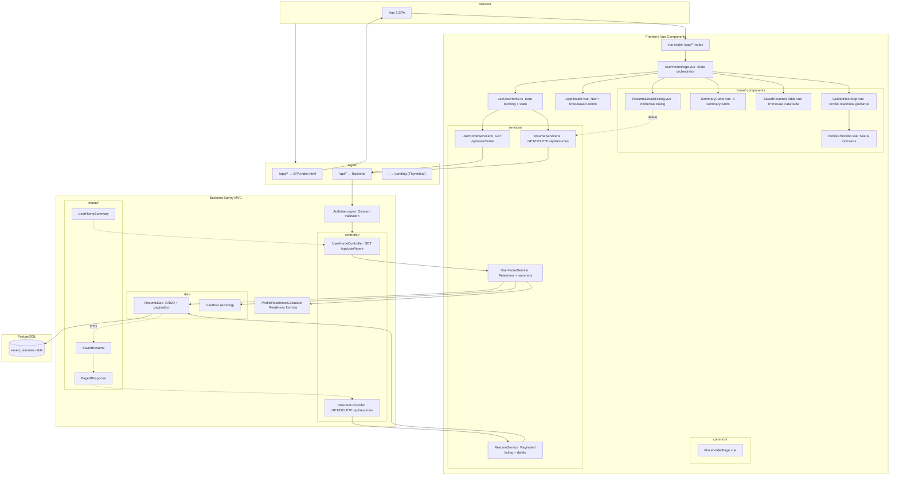

# Component Diagram: User Home Page & Resume Workspace

**Feature**: Production-ready User Home page with guided next-step block, summary cards, saved resumes DataTable, Resume Details modal, and delete flow
**Generated**: 2026-06-06
**Scope**: Full feature — backend API endpoints + frontend Vue SPA components

---

## Overview

This diagram shows the component architecture for the User Home / Resume Workspace feature. It covers the frontend Vue components, backend Spring MVC layers, and data flow between them. The architecture follows the existing project patterns: layered backend (controller → service → dao) and component-based frontend (view → composable → service → API).

## Component Diagram

## Component Breakdown

### UserHomePage.vue (View)

**Role**: Main page component that orchestrates all User Home child components.

**Why this exists as a separate component**: It's the single entry point for the Resume Workspace. It owns the loading/error/empty state logic, coordinates data from two independent API sources (home summary + resumes list), and delegates rendering to child components. Separating orchestration from presentation keeps both testable.

**Key interactions**:
- → `useUserHome` composable: triggers data fetching on mount
- ← `useUserHome` composable: receives reactive state (loading, data, errors)
- → `GuidedNextStep.vue`: passes `profileReady`, `profileChecklist`
- → `SummaryCards.vue`: passes `summary`, `lastResume`
- → `SavedResumesTable.vue`: passes `resumes[]`, loading state
- → `ResumeDetailsDialog.vue`: passes selected resume, opens/closes

---

### useUserHome (Composable)

**Role**: Encapsulates all data fetching, state management, and error handling for the User Home page.

**Why this exists as a separate component**: Keeps data logic out of the Vue template. The composable manages two independent API streams (`homeSummary` + `resumes`), retry state, delete flow, and the "clear on delete" cascade. Without it, `UserHomePage.vue` would mix API calls, loading state, and template — violating single responsibility.

**Key interactions**:
- → `userHomeService.fetchSummary()`: fetches profile readiness + summary
- → `resumeService.fetchResumes(params)`: fetches paginated resume list
- → `resumeService.deleteResume(id)`: soft-deletes a resume
- ← returns reactive `{ summary, resumes, loading, error, refresh }`

---

### SavedResumesTable.vue (DataTable Component)

**Role**: PrimeVue DataTable with search, language/adaptation/date filters, column sorting, and pagination.

**Why this exists as a separate component**: The table has significant internal complexity: debounced search (300ms, min 3 chars), MultiSelect + DatePicker filters, sort state management (removable sort), paginator config (10/20/50), and row click handling. Extracting it keeps `UserHomePage.vue` readable and makes the table independently testable.

**Key interactions**:
- ← receives `resumes[]` and `loading` from parent
- → emits `@openResume` on row click → `UserHomePage` opens modal
- → triggers search via URL parameter changes (debounced, 3-char minimum)

---

### ResumeDetailsDialog.vue (Modal Component)

**Role**: PrimeVue Dialog showing resume details with View, Download PDF, Copy Link, and Delete actions.

**Why this exists as a separate component**: Modal state (open/close, which resume, delete confirmation) is self-contained. Separating it avoids cluttering the page component with dialog visibility toggles and action handlers.

**Key interactions**:
- ← receives selected resume data + visibility flag from parent
- → View: opens `pdfUrl` in new browser tab
- → Download PDF: triggers file download via `pdfUrl`
- → Copy Link / Copy Cover Letter: uses Clipboard API, emits toast
- → Delete: opens ConfirmDialog, on accept emits `@delete` to parent

---

### AppHeader.vue (Layout Component)

**Role**: Shared navigation header visible on all SPA pages.

**Why this exists as a separate component**: Navigation state (active page, language, admin visibility) is consistent across all SPA routes. A single header component prevents duplication and ensures consistent logout/language switch behavior.

**Key interactions**:
- → `vue-router`: navigates on Home / My Profile / Generate Resume / Admin clicks
- → Auth service: triggers logout, redirects to `/app/auth`
- ← Auth state: determines admin link visibility

---

### UserHomeController (Backend Controller)

**Role**: REST endpoint `GET /api/user/home` — returns profile readiness, checklist, summary stats, and last resume.

**Why this exists as a separate controller**: It serves a different purpose from the resumes list controller. Combining them would mix responsibilities (one for dashboard data, one for CRUD) and make the response schema harder to evolve independently.

**Key interactions**:
- → `UserHomeService.getSummary(userId)`: delegates readiness calculation
- ← returns `UserHomeSummary` JSON
- Protected by `AuthInterceptor` (valid session required)

---

### ResumeController (Backend Controller)

**Role**: REST endpoints `GET /api/resumes` (paginated list) and `DELETE /api/resumes/{id}` (soft-delete).

**Why this exists as a separate controller**: Resume listing with 7 query parameters (search, language, adaptationLevel, createdDate, sort, page, size) requires parameter validation, whitelist checking, and paginated response construction. A dedicated controller keeps this logic focused and testable.

**Key interactions**:
- → `ResumeService.listResumes(userId, params)`: paginated query
- → `ResumeService.deleteResume(userId, resumeId)`: soft-delete with owner check
- ← returns `PagedResponse<SavedResume>` JSON
- Protected by `AuthInterceptor` + owner authorization in Service layer

---

### ResumeService (Backend Service)

**Role**: Business logic for resume listing and deletion: sort whitelist validation, owner authorization, pagination parameter handling.

**Why this exists as a separate service**: It enforces security constraints (SEC-001, SEC-002, SEC-003) between the controller and DAO layers. The controller handles HTTP concerns; the service handles business rules. This separation makes security rules testable without HTTP.

**Key interactions**:
- → `ResumeDao`: delegates paginated query with validated params
- → `ResumeDao`: delegates soft-delete with user_id filter
- Validates: sort field whitelist, sort direction enum, page/size bounds

---

### ResumeDao (Backend DAO)

**Role**: Direct database access for saved resumes: paginated SELECT with search/filter/sort, soft-delete UPDATE.

**Why this exists as a separate DAO**: The Constitution requires plain JDBC with PreparedStatement. A dedicated DAO encapsulates all SQL, preventing raw queries from leaking into service or controller code.

**Key interactions**:
- → PostgreSQL: `SELECT ... FROM saved_resumes WHERE user_id = ? AND deleted_at IS NULL ... LIMIT ? OFFSET ?`
- → PostgreSQL: `UPDATE saved_resumes SET deleted_at = NOW() WHERE id = ? AND user_id = ?`
- All queries use `PreparedStatement` — never string concatenation

---

## Design Reasoning

### Why this structure?

The component split follows the existing project patterns: backend uses strict layered architecture (controller → service → dao → model) per the Constitution's Code Quality principle. Frontend follows Vue 3 Composition API with a composable separating data logic from presentation. The independent block loading (FR-046) drove the decision to have two separate API endpoints rather than one combined endpoint — this allows the guided block to render even if the table fails, and vice versa.

### Alternatives considered

| Structure | Why it wasn't chosen |
|-----------|---------------------|
| Single monolithic API endpoint (`GET /api/user/home` returning everything) | Would violate FR-046 (independent block loading). A table failure would block the guided block from rendering. |
| Embedding table logic directly in `UserHomePage.vue` | Would make the component ~500+ lines. The table's filter/sort/pagination state is complex enough to warrant its own component. |
| No service layer — controllers calling DAOs directly | Would skip security validation (SEC-001, SEC-002). The service layer is the natural place for sort whitelist checks and owner authorization. |
| Separate composables for summary + resumes | Two composables would need cross-communication for the delete flow (delete refreshes both). A single `useUserHome` keeps the refresh cascade manageable. |

### When you'd restructure

If the feature grows to handle real-time resume updates or collaborative editing, the simple request-response pattern would need to evolve toward a state management solution (Pinia) and possibly WebSocket updates. The composable pattern makes this migration straightforward — swap the composable internals without changing the view components.
