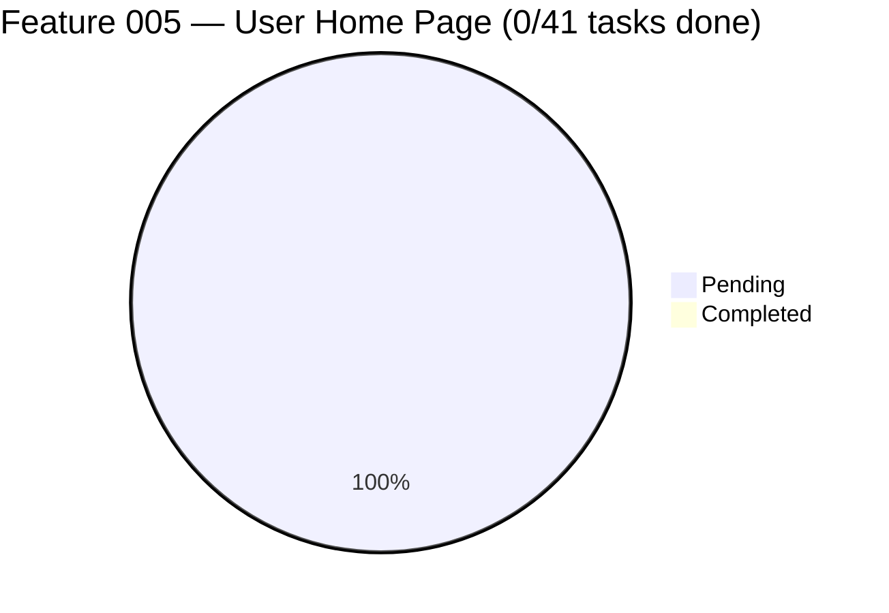

# Feature Progress Dashboard

**Generated**: 2026-06-06

## SDD Feature Progress

```mermaid
gantt
    title Feature Progress — ResumAIner
    dateFormat X
    axisFormat %s

    section 001-hello-world-tomcat
    Specify     :done, s1, 0, 1
    Plan        :done, p1, 1, 2
    Tasks       :done, t1, 2, 3
    Implement   :done, i1, 3, 4
    Verify      :done, v1, 4, 5

    section 002-thymeleaf-landing-page
    Specify     :done, s2, 0, 1
    Plan        :done, p2, 1, 2
    Tasks       :done, t2, 2, 3
    Implement   :done, i2, 3, 4
    Verify      :done, v2, 4, 5

    section 003-vue-auth-page
    Specify     :done, s3, 0, 1
    Plan        :done, p3, 1, 2
    Tasks       :done, t3, 2, 3
    Implement   :done, i3, 3, 4
    Verify      :done, v3, 4, 5

    section 004-custom-jdbc-pool
    Specify     :done, s4, 0, 1
    Plan        :done, p4, 1, 2
    Tasks       :done, t4, 2, 3
    Implement   :done, i4, 3, 4
    Verify      :done, v4, 4, 5

    section 005-user-home-page
    Specify     :done, s5, 0, 1
    Plan        :done, p5, 1, 2
    Tasks       :done, t5, 2, 3
    Implement   :active, i5, 3, 4
    Verify      :v5, 4, 5
```

## Feature 005 Task Progress

## Summary

| Feature | Phase | Tasks | Status |
|---------|-------|-------|--------|
| 001-hello-world-tomcat | ✅ Complete | 22/22 | Merged to main |
| 002-thymeleaf-landing-page | ✅ Complete | 27/27 | Merged to main |
| 003-vue-auth-page | ✅ Complete | 63/63 | Merged to main |
| 004-custom-jdbc-connection-pool | ✅ Complete | 55/55 | Merged to main |
| **005-user-home-page** | 🔵 **Plan (ready for implement)** | **0/41** | **Active branch: feat/005-user-home-page** |

### Phase Legend

| Phase | Description |
|-------|-------------|
| 🟢 Specify | spec.md exists |
| 🟢 Plan | plan.md exists |
| 🟢 Tasks | tasks.md exists |
| 🔵 Implement | Tasks ready, implementation in progress |
| 🟣 Verify | All tasks completed, ready for review |
