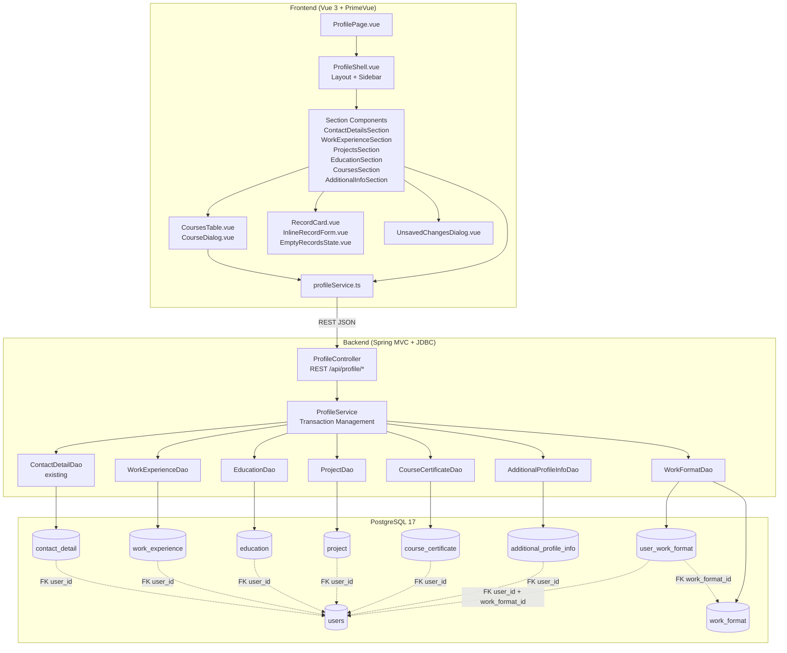

# Component Diagram: User Profile Page

**Feature**: 6-section User Profile management with backend persistence and frontend UI
**Generated**: 2026-06-07
**Scope**: Full feature

---

## Overview

Shows the component relationships and data flow between the Vue 3 frontend, Spring MVC backend, and PostgreSQL database for all six profile sections. Each section follows the same CRUD pattern, with Courses adding server-side pagination.

## Component Diagram

## Component Breakdown

### ProfilePage.vue (Route-Level Container)

**Role**: Route-level view that loads the ProfileShell and orchestrates section switching based on the current route path.

**Why this exists as a separate component**: Centralizes route-based section selection, dirty-state tracking across section navigation, and browser refresh warning logic. Without it, each section would need duplicate navigation guard logic.

**Key interactions**:
- → ProfileShell: passes active section and status metadata
- → UnsavedChangesDialog: triggers when dirty state exists during navigation

### ProfileShell.vue (Layout + Sidebar)

**Role**: Renders the sidebar (desktop) or tab grid (mobile), and the active section component in the main content area.

**Why this exists as a separate component**: Separates navigation chrome from section content. The sidebar/mobile tabs are a persistent layout concern — merging them into each section would duplicate responsive layout logic.

**Key interactions**:
- → Section Components: selects which section to render based on active route
- → ProfileSectionHeader: displays section title and purpose per route

### Section Components (6 individual Vue files)

**Role**: Each implements one profile section's form or record list with validation, save, and dirty-state logic.

**Why each is separate**: Six sections have distinct field sets, validation rules, and UX patterns (inline form vs DataTable). Merging them would create a single massive component with complex conditional rendering. Separation keeps each file focused and testable.

**Key interactions**:
- → profileService.ts: calls REST API for CRUD operations
- → RecordCard / InlineRecordForm: shared UI patterns
- → UnsavedChangesDialog: emits dirty state events to parent

### CoursesTable.vue + CourseDialog.vue

**Role**: PrimeVue DataTable with server-side lazy pagination, search (3+ chars), date filter range, and three-state column sorting. CourseDialog handles add/view/edit/delete in a modal.

**Why separate from CoursesSection**: The DataTable logic (pagination, filtering, sorting, reset) is complex enough to warrant its own component. The dialog is a separate concern (form vs list view).

**Key interactions**:
- → profileService.ts: supports `page`, `size`, `sort`, `search`, `dateFrom`, `dateTo` parameters
- → CourseDialog: emits save/delete events that trigger table refresh

### ProfileController (Backend REST)

**Role**: Single controller handling all `/api/profile/*` endpoints, delegating to ProfileService.

**Why one controller vs six**: All sections follow the same auth pattern (requiresAuth, owner-scoped) and error handling. A single controller avoids duplicating cross-cutting concerns. Method naming maps to sections: `getContact()`, `saveExperience()`, `deleteCourse()`, etc.

**Key interactions**:
- → ProfileService: delegates all business logic
- ← HttpSession: extracts authenticated user ID for owner-scoping (SEC-001)
- Returns `Cache-Control: no-store, private` (SEC-005)

### ProfileService (Backend Service)

**Role**: Business logic layer coordinating DAO calls within JDBC transactions where needed.

**Why it exists as a separate layer**: Encapsulates transaction boundaries and cross-sectional validation (e.g., username uniqueness, language mutual exclusivity). Keeps controllers thin.

**Key interactions**:
- → DAOs: passes `userId` from session for owner-scoped queries (SEC-001)
- Combines multiple DAO calls (e.g., AdditionalInfo + WorkFormat) in a single transaction

### DAO Layer (6 DAO classes)

**Role**: Data access with PreparedStatement, owner-scoped WHERE clauses, and soft-delete awareness.

**Why each entity has its own DAO**: Each table has distinct fields, queries, and validation. A generic DAO would add complexity (reflection, generics) that violates the plain JDBC constraint.

**Key interactions**:
- All SELECT queries include `WHERE user_id = ? AND is_deleted = FALSE` (SEC-001, SEC-003)
- DELETE performs `UPDATE is_deleted = TRUE` (SEC-003)
- Courses DAO supports pagination with `LIMIT ? OFFSET ?`

---

## Design Reasoning

### Why this structure?

The component structure follows the project's established layered architecture (controller → service → DAO) from Features 003 and 005. Each profile section is an independent module sharing the same CRUD pattern, which makes the architecture predictable and testable. The separation of frontend sections by profile domain (contact, experience, etc.) mirrors the backend entity decomposition — this alignment simplifies debugging and API contract tracing.

### Alternatives considered

| Structure | Why it wasn't chosen |
|---|---|
| Single monolithic ProfileSection.vue with conditional rendering | Would exceed 1000+ lines with all 6 sections' forms, validation, and state logic. Impossible to test independently. |
| One controller per section (ContactController, ExperienceController, etc.) | Duplicates auth, error handling, and routing config across 6 files. Single controller with section-specific methods is simpler. |
| Generic CRUD DAO with reflection | Violates plain JDBC constraint. Each entity has distinct fields and pagination needs. Separate DAOs are more maintainable. |

### When you'd restructure

If the profile grows beyond 6 sections (e.g., adding Skills, Certifications as separate sections), consider splitting into domain-specific sub-controllers (ProfileContactController, ProfileExperienceController) to keep the controller file size manageable.
