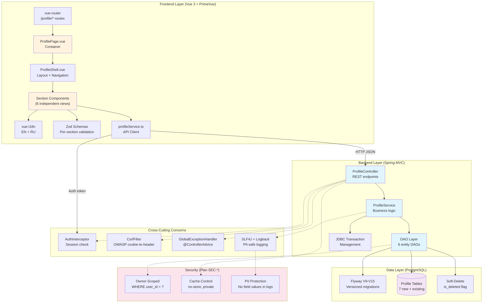

# Software Architecture: User Profile Page

**Feature**: 6-section User Profile management with backend persistence and frontend UI
**Generated**: 2026-06-07
**Scope**: Architectural patterns for full feature

---

## Overview

The Profile feature follows the project's established **layered architecture** with strict dependency direction: Controller → Service → DAO → Database. The frontend uses a **container-component pattern** where ProfilePage.vue orchestrates section components. All layers share cross-cutting concerns (auth, error handling, validation) through middleware and base classes.

## Architecture Diagram



## Architectural Pattern: Layered Architecture with Container-Component Frontend

**What it is**: The backend is organized into strict layers (Controller → Service → DAO) where each layer communicates only with the layer directly below it. The frontend uses a container-component pattern: a single container (ProfilePage.vue) manages state and delegates rendering to focused section components.

**Why this pattern**: The project constitution mandates layered architecture for the backend (Standard Java layered architecture: controller/service/dao/model/config/util). This pattern has been proven across Features 003, 004, and 005. For the frontend, the container-component pattern isolates dirty-state tracking and navigation logic in one place, preventing duplication across six sections.

**Tradeoffs accepted**:
- ✓ Each layer is independently testable — Controller tests with MockMvc, Service tests with mocked DAOs, DAO tests with mocked DataSource
- ✓ Adding a new section follows a predictable recipe: new DAO → new methods in Service → new route in Controller → new Vue component
- ✗ More files than a monolithic approach, but the separation prevents cascading complexity as the profile grows

## Layer Breakdown

### Frontend Container Layer (ProfilePage.vue)

**Responsibility**: Route-level orchestration — active section selection, dirty-state tracking, unsaved-changes dialog, browser refresh warning.

**Depends on**: vue-router (route params), vue-i18n (UI strings)

**Depended on by**: ProfileShell.vue (receives active section + status), UnsavedChangesDialog.vue (triggered on dirty navigation)

**Why this boundary exists**: Without a container, each section component would need its own dirty-state tracker and route guard logic. The container centralizes lifecycle management (onBeforeRouteLeave, beforeunload) that applies uniformly to all sections.

### Frontend Section Components (6 views)

**Responsibility**: Each implements one profile section's form fields, validation rules, and CRUD operations.

**Depends on**: profileService.ts (API calls), Zod schemas (validation), vue-i18n (translations)

**Depended on by**: ProfileShell (renders active section)

**Why this boundary exists**: Each section has different fields, validation rules, and UX patterns. Merging them would create a component with N×M conditional branches. Separation makes each section independently editable and testable.

### Backend Controller Layer (ProfileController)

**Responsibility**: HTTP endpoint definitions, request deserialization, response serialization, auth context extraction.

**Depends on**: ProfileService, HttpSession

**Depended on by**: Vue frontend (HTTP clients)

**Why this boundary exists**: Keeps HTTP concerns (status codes, headers, JSON mapping) separate from business logic. The controller is the only layer that touches HTTP request/response objects.

### Backend Service Layer (ProfileService)

**Responsibility**: Business rules (username uniqueness, language mutual exclusivity), transaction coordination, cross-sectional validation.

**Depends on**: All profile DAOs

**Depended on by**: ProfileController

**Why this boundary exists**: Transaction management and cross-sectional validation (e.g., ensuring username uniqueness across the Additional Info save) must happen in one place. Spreading this across DAOs would lose atomicity guarantees.

### Backend DAO Layer (6 DAOs + ContactDetailDao)

**Responsibility**: SQL query construction with PreparedStatement, result set mapping, owner-scoping.

**Depends on**: DataSource (connection pool), model classes

**Depended on by**: ProfileService

**Why this boundary exists**: Isolates SQL from business logic. If the schema changes (e.g., adding columns), only the DAO and model change — the Service and Controller remain untouched.

## Module Organization

**Strategy**: By layer (backend) + by domain (frontend)

The backend follows strict layer-based packaging: `dao/`, `service/`, `controller/`, `model/`, `dto/`. Within each layer, profile entities are grouped by section domain. The frontend groups by domain: `components/profile/sections/` for section views, `components/profile/courses/` for courses-specific UI, and `services/profileService.ts` for API calls.

```
backend/src/main/java/com/resumainer/
├── controller/ProfileController.java
├── service/ProfileService.java
├── dao/WorkExperienceDao.java, EducationDao.java, ...
├── model/WorkExperience.java, Education.java, ...
└── dto/ProfileSectionStatus.java, ProfileData.java, ...

frontend/src/
├── views/ProfilePage.vue
├── components/profile/
│   ├── sections/ContactDetailsSection.vue, ...
│   └── courses/CoursesTable.vue, CourseDialog.vue
└── services/profileService.ts
```

## When This Architecture Evolves

If the profile feature later adds real-time validation (e.g., checking username availability on keystroke), the service layer would need a lightweight async endpoint (`GET /api/profile/check-username?value=...`) — this is a natural extension of the existing pattern, not a restructuring. If the project adds offline support, the frontend service layer would need a local cache with sync queue, at which point the profileService.ts would split into a local-storage adapter and a remote API adapter.
