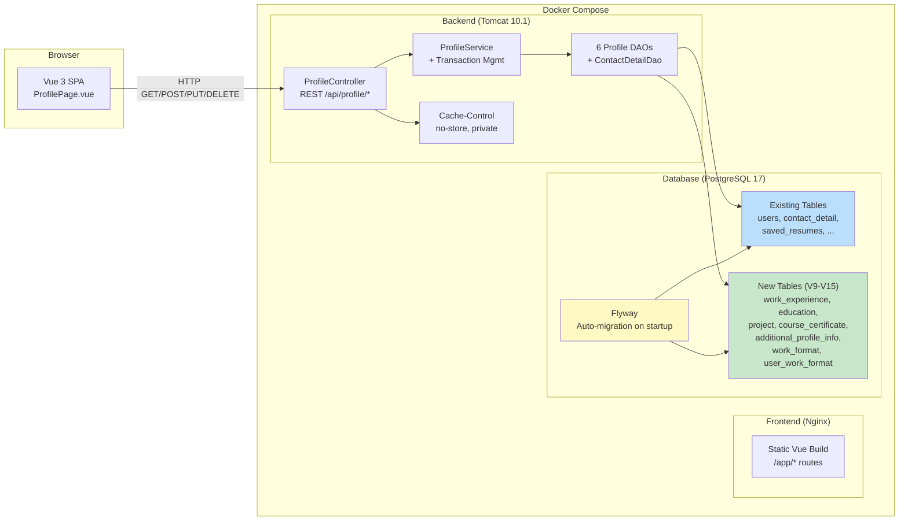
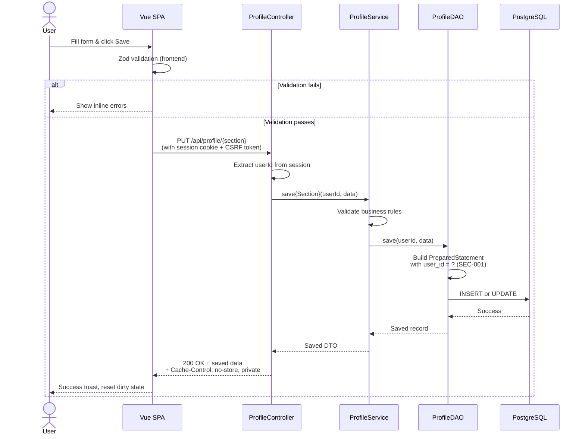
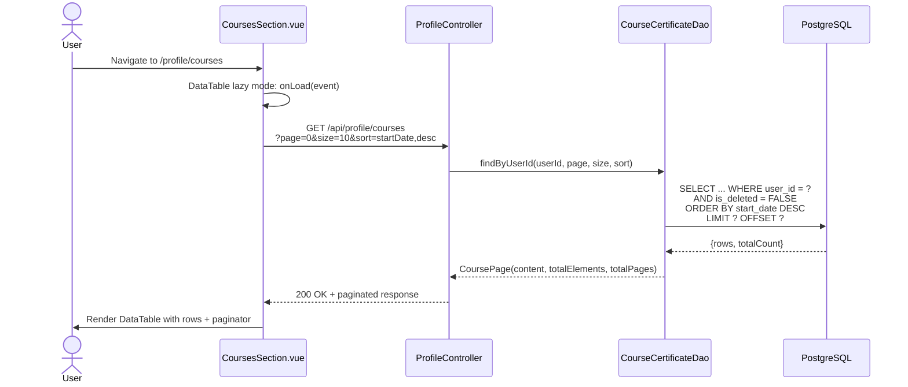

# System Design: User Profile Page

**Feature**: 6-section User Profile management with backend persistence and frontend UI
**Generated**: 2026-06-07
**Scope**: New persistence infrastructure for profile data

---

## Overview

The Profile feature adds 5 new database tables and 6 new API endpoint groups to the existing ResumAIner stack. The frontend communicates with the backend exclusively via REST JSON over HTTP. The existing Docker Compose topology (backend container + frontend container + PostgreSQL container) remains unchanged — no new infrastructure services are introduced.

## System Design Diagram

## Infrastructure Decisions

### PostgreSQL for Profile Data Storage

**What**: All profile data persisted in PostgreSQL 17, extending the existing database with 7 new tables (5 entity tables + 2 lookup/junction tables for work formats).

**Why**: The project already uses PostgreSQL for all persistence (Feature 003 established the schema). Adding profile tables to the same database keeps transaction management simple — the ProfileService can coordinate saves across `additional_profile_info` and `user_work_format` in a single JDBC transaction. A separate database would add cross-database transaction complexity with no benefit since all data belongs to the same application.

**Alternatives considered**:

| Option | Why it wasn't chosen |
|---|---|
| Separate profile database | Adds cross-database transaction complexity. Profile data is tightly coupled to `users` table via foreign keys. |
| MongoDB for profile flexibility | The schema is well-defined (BA data dictionary has complete field specs). No benefit from schema-less storage. Relational queries (e.g., "find users with specific work format") are simpler in PostgreSQL. |

**When you'd choose differently**: If the profile feature evolved into a separate microservice with its own team and release cycle, a separate database would make sense for deployment independence.

### Flyway for Schema Migrations

**What**: Versioned SQL migrations V9-V15 applied automatically on application startup.

**Why**: Consistent with the existing migration pattern (V1-V8 from Features 003 and 005). Flyway ensures all environments (dev, test, prod) have identical schemas and provides rollback documentation through versioned scripts.

**Alternatives considered**: Manual SQL scripts — rejected because they create drift between environments and require manual tracking.

## Data Flow

### Primary Request Path (Save a Profile Section)

### Courses Paginated Read Path

## Scaling & Reliability Notes

- **Database scaling**: The profile tables are scoped to a single user — no cross-user queries. Indexing on `user_id` ensures efficient lookups regardless of total user count. Current volume estimates (< 300 courses per user, < 20 others) do not require read replicas or sharding.
- **Connection pool**: The existing custom `SimpleConnectionPool` (Feature 004) handles all database connections. Profile DAOs use connection-accepting overloads for service-level transaction management.
- **Failure mode**: If the database is unreachable, the global exception handler returns a user-friendly error (NFR-004). The frontend shows a descriptive toast. Profile data in localStorage is not used as fallback — the user must retry when the database is available.
- **Cache strategy**: `Cache-Control: no-store, private` prevents caching of personal data. No server-side caching layer (Redis) is needed for MVP — profile data is per-user and accessed infrequently compared to resume generation.
