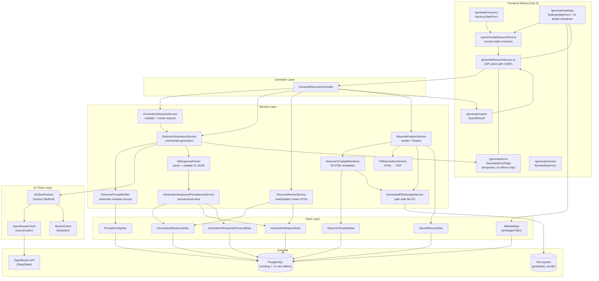

# Component Diagram: Resume Generation

**Feature**: AI-powered resume generation with bilingual support, editable review, and HTML/PDF export
**Generated**: 2026-06-12
**Scope**: Full feature — backend generation pipeline + frontend wizard

---

## Overview

This diagram shows the internal components of the generation pipeline and how data flows from user input through AI generation, review, finalization, and export. Each component is a distinct service or module with a single responsibility, communicating through the controller layer via DTOs.

## Component Diagram

## Component Breakdown

### GenerateResumeController

**Role**: HTTP endpoint handler for all generation-related APIs.

**Why this exists as a separate component**: Follows existing project pattern (controller layer). Keeps HTTP concerns (request parsing, response serialization, status codes) separate from business logic. Single controller for all generation endpoints makes routing and endpoint discovery predictable.

**Key interactions**:
- ← Frontend HTTP requests (vacancy/settings/review/finalize/export)
- → GenerationRequestService: create/get request
- → ResumeGenerationService: trigger generation
- → ResumeReviewService: read/update review data
- → ResumeFinalizeService: finalize and export

---

### GenerationRequestService

**Role**: Validates and persists generation request input (vacancy/company data, settings, AI model selection).

**Why this exists as a separate component**: Request creation has distinct validation rules (required fields, AI model availability against user privilege). Separating it from generation execution keeps the creation step lightweight and testable without AI dependencies.

**Key interactions**:
- → AiModelDao: verify selected model is available for current user
- → GenerationRequestDao: persist request with status=pending

---

### ResumeGenerationService

**Role**: Central orchestrator — triggers prompt building, AI call, response parsing, and response persistence.

**Why this exists as a separate component**: The generation flow is the core business transaction. It must coordinate 4+ sub-steps atomically with proper error handling. A dedicated orchestrator makes the flow visible and testable.

**Key interactions**:
- → ResumePromptBuilder: assemble final prompts
- → AiClientFactory: get AI client for selected model
- → AiResponseParser: validate and normalize AI output
- → GenerationResponsePersistenceService: save results in transaction

---

### ResumePromptBuilder (Builder pattern)

**Role**: Assembles the final system and request prompts from DB-backed modular fragments.

**Why this exists as a separate component**: The Builder pattern isolates prompt assembly logic from both the AI client and the parser. Prompt fragments evolve independently (system prompt, language rules, adaptation instructions, cover letter rules). A builder makes testing each fragment combination straightforward.

**Key interactions**:
- → PromptConfigDao: load active prompt config and fragments
- → (internal) build system prompt + language prompt + adaptation prompt + cover letter prompt
- → (internal) assemble profile payload from user data

---

### AiClientFactory (Factory Method pattern)

**Role**: Returns the correct AI client implementation based on context (OpenRouter for production, mock for tests).

**Why this exists as a separate component**: The Factory Method decouples generation orchestration from client instantiation. Tests inject MockAiClient without changing production code. New providers (e.g., OpenAI direct) can be added without modifying existing clients or the orchestrator.

**Key interactions**:
- → OpenRouterClient: for production with real API calls
- → MockAiClient: for automated tests and local dev

---

### AiResponseParser

**Role**: Parses structured JSON from AI output, validates required fields, normalizes keys, and rejects invalid output.

**Why this exists as a separate component**: AI output is unpredictable. Strict parsing must be isolated from the rest of the pipeline so that parsing failures don't corrupt database state. Separating parsing enables thorough unit testing (20+ edge cases) without AI dependencies.

**Key interactions**:
- ← Raw JSON from AI client
- → (produces) Parsed response DTOs for persistence

---

### GenerationResponsePersistenceService

**Role**: Saves parsed AI output into response tables within a single JDBC transaction.

**Why this exists as a separate component**: Persisting a generation response involves 6–12 child table inserts (response, experience, courses, projects, skills, personal info). All must succeed or roll back together. A dedicated persistence service manages this transaction boundary.

**Key interactions**:
- → GenerationResponseDao: insert response row
- → (internal) insert child section rows
- → GenerationRequestDao: update request status to completed/failed

---

### ResumeFinalizeService

**Role**: Validates the selected adaptation level, renders HTML, generates PDF, saves files, and creates saved_resume records.

**Why this exists as a separate component**: Finalization is the most complex transaction — it coordinates DB writes AND file I/O. Separating it from the review service keeps responsibilities clear and testable.

**Key interactions**:
- → ResumeTemplateRenderer: fill HTML from response data
- → PdfGenerationService: convert HTML to PDF
- → GeneratedFileStorageService: write files to disk
- → SavedResumeDao: insert saved_resume records

---

### ResumeTemplateRenderer

**Role**: Fills one-page or two-page HTML templates with response data and bilingual profile fields.

**Why this exists as a separate component**: Template rendering is pure string transformation with no side effects. Separating it from file I/O (GeneratedFileStorageService) makes it testable without disk access. It also keeps PDF conversion independent from HTML rendering — if PDF fails, HTML is already saved.

**Key interactions**:
- → ResumeTemplateDao: load HTML template
- → (internal) replace markers with response data
- → (internal) select bilingual Education fields by response language
- → GeneratedFileStorageService: save filled HTML

---

### GeneratedFileStorageService

**Role**: Builds safe file paths and writes/reads generated HTML and PDF files to disk.

**Why this exists as a separate component**: File I/O is a cross-cutting concern with security implications (path traversal prevention). Centralizing it in one service ensures consistent path validation, UTF-8 handling, and ownership checks.

**Key interactions**:
- ← Receives file content and metadata from renderer/finalizer
- → File system: writes to `generated_results/{username}/{public_code}/`
- (internal): sanitizes username segment against path traversal

---

## Design Reasoning

### Why this structure?

The component decomposition follows two driving principles: **single responsibility** and **transaction boundary isolation**. Each generation pipeline step (prompt building → AI call → parsing → persistence) is independent and testable in isolation. The finalization flow separates HTML rendering from PDF conversion — if PDF fails, HTML is already saved, preventing total data loss. The prompt builder uses the Builder pattern because prompt fragments (system, language, adaptation, cover letter) vary independently based on user settings. The AI client uses Factory Method because testability requires mock injection without touching production orchestration code.

### Alternatives considered

| Structure | Why it wasn't chosen |
|-----------|---------------------|
| Single monolithic GenerationService | Would mix prompt building, AI calls, parsing, and persistence into one class — untestable, violates SRP, hard to debug AI failures |
| AI response persistence inside parser | Parser's job is validation, not storage. Persistence has transaction concerns the parser shouldn't know about |
| PDF generation inside template renderer | PDF libraries have different failure modes than HTML rendering. Separating them ensures one failure doesn't lose the other artifact |
| Prompt assembly in AI client | The AI client shouldn't know about prompt fragment structure. Keeping fragments in a dedicated builder makes prompt versioning and testing independent of AI provider |

### When you'd restructure

If the generation pipeline becomes async (queue-based instead of synchronous HTTP request-response), the orchestration would need to split into command/event handlers. The component boundaries would remain the same — only the invocation pattern changes.
