# Software Architecture: Resume Generation

**Feature**: AI-powered resume generation with bilingual support, editable review, and HTML/PDF export
**Generated**: 2026-06-12
**Scope**: Architectural patterns and module organization for the generation pipeline

---

## Overview

The feature follows the project's established **layered architecture** (controller → service → dao → model) with two notable extensions: the **generation pipeline** introduces a series of focused service objects that each handle one step of the AI generation flow, and four GoF design patterns are explicitly applied to solve specific structural problems (Builder for prompt assembly, Factory Method for AI client creation, Strategy for adaptation levels, and Singleton for the Connection Pool as established in Feature 004).

## Architecture Diagram

```mermaid
flowchart TD
    subgraph Presentation["Presentation Layer"]
        Vue["Vue 3 SPA<br/>(wizard pages)"]
        GC["GenerateResumeController<br/>(REST API)"]
    end

    subgraph Service["Service Layer"]
        subgraph Pipeline["Generation Pipeline"]
            GRS["GenerationRequestService"]
            RGS["ResumeGenerationService"]
            RPB["ResumePromptBuilder<br/>(Builder Pattern)"]
            ARP["AiResponseParser"]
            GPS["GenerationResponsePersistenceService"]
        end
        subgraph ReviewFinalize["Review & Finalize"]
            RRS["ResumeReviewService"]
            RFS["ResumeFinalizeService"]
            RTR["ResumeTemplateRenderer"]
        end
        subgraph CrossCutting["Cross-Cutting"]
            PGS["PdfGenerationService"]
            FSS["GeneratedFileStorageService"]
            AF["AiClientFactory<br/>(Factory Method)"]
        end
    end

    subgraph AI["AI Providers"]
        AIi["AiClient (interface)"]
        OCR["OpenRouterClient"]
        MOCK["MockAiClient"]
    end

    subgraph DAO["Data Access Layer"]
        GRD["GenerationRequestDao"]
        PRD["GenerationResponseDao"]
        PRDP["GenerationResponsePersonalDao"]
        SRD["SavedResumeDao"]
        AMD["AiModelDao"]
        PCD["PromptConfigDao"]
        RTD["ResumeTemplateDao"]
    end

    subgraph Model["Domain Model"]
        M1["ResumeGenerationRequest"]
        M2["ResumeGenerationResponse"]
        M3["GenerationResponsePersonal"]
        M4["SavedResume"]
        M5["AiModel"]
        M6["PromptConfig entities"]
    end

    subgraph DTO["Data Transfer Objects"]
        D1["GenerationRequestCreateDto"]
        D2["ReviewDataDto"]
        D3["FinalizeRequestDto"]
        D4["ExportResultDto"]
    end

    subgraph Config["Configuration"]
        C1["WebConfig<br/>(@Bean registration)"]
        C2["Flyway @Bean<br/>(initMethod=migrate)"]
    end

    %% Layer dependencies (top-down: Controller → Service → DAO → Model)
    Vue --> GC
    GC --> GRS
    GC --> RGS
    GC --> RRS
    GC --> RFS
    GC --> PGS
    GC --> FSS

    GRS --> GRD
    RGS --> RPB
    RGS --> AF
    RGS --> ARP
    RGS --> GPS
    RRS --> PRD
    RFS --> RTR
    RFS --> PGS
    RFS --> FSS
    RFS --> SRD

    AF --> AIi
    AIi -.-> OCR
    AIi -.-> MOCK

    GRD --> M1
    PRD --> M2
    PRDP --> M3
    SRD --> M4
    AMD --> M5
    PCD --> M6
    RTD --> M6

    GRD --> D1
    PRD --> D2
    SRD --> D3
    SRD --> D4

    GC --> D1
    GC --> D2
    GC --> D3
    GC --> D4

    C1 --> GC
    C1 --> RGS
    C1 --> GRD
    C2 --> DB

    DB[(PostgreSQL)]
    GRD --> DB
    PRD --> DB
    PRDP --> DB
    SRD --> DB
    AMD --> DB
    PCD --> DB
    RTD --> DB
```

## Architectural Pattern: Layered Architecture with Pipeline Services

**What it is**: The system is organized into horizontal layers (Controller → Service → DAO → Model), where each layer communicates only with the layer directly below it. Within the Service layer, the generation flow is further decomposed into a pipeline of focused service objects, each handling exactly one step.

**Why this pattern**: The project constitution mandates layered architecture (controller/service/dao/model/config/util). For the generation feature specifically, the pipeline decomposition emerged from two constraints: (1) each step has different failure modes and testing requirements, and (2) the prompt assembly and AI response are independently versionable. A monolithic service would make it impossible to test parsing without triggering an AI call.

**Tradeoffs accepted**:
- ✓ Each component is independently testable with mocks
- ✓ Generates predictable file structure matching existing codebase
- ✓ Pipeline steps can be reordered or extended (e.g., add validation step) without touching other steps
- ✗ More files and boilerplate than a monolithic service — 10 service classes vs. 2-3 in a simpler design
- ✗ Pipeline coordination logic lives in ResumeGenerationService and ResumeFinalizeService, which need to understand all sub-step contracts

## Design Patterns

### Builder — ResumePromptBuilder

**What it is**: A Builder that constructs a complete prompt payload from modular DB-backed fragments: system prompt + language prompt + adaptation prompt + cover letter prompt + profile data payload.

**Why this pattern**: Prompt fragments vary independently based on user settings. A Builder encapsulates the construction logic so that adding a new fragment type (e.g., "industry-specific instructions") doesn't require changing the AI client or the generation orchestrator. The Builder also handles the `ai_prompt_render_log` persistence.

**Constitution alignment**: The project constitution explicitly requires documenting at least 4 GoF patterns. Builder is one of them.

### Factory Method — AiClientFactory

**What it is**: An interface `AiClient` with a Factory that returns `OpenRouterClient` for production or `MockAiClient` for tests, based on configuration or profile.

**Why this pattern**: The constitution mandates that no automated test calls real OpenRouter. The Factory Method ensures tests get a mock client without the generation orchestrator knowing about test configuration. Adding a new provider (e.g., OpenAI direct) means adding a new client class and updating the factory — the orchestrator doesn't change.

### Strategy — Adaptation Level Handling

**What it is**: The selection of adaptation level (Minimal, Balanced, Maximum) is a Strategy-like decision point. The response parser uses the adaptation selection to determine how many variants to expect, and the finalize service uses the selected level to determine which response rows to save.

**Why this pattern**: The adaptation level affects prompt assembly (what instructions to include), response parsing (how many variants to expect), and finalization (which rows to save). Modeling it as a Strategy-like parameter flowing through the pipeline keeps each level's behavior consistent across all phases.

### Singleton — Connection Pool (established in Feature 004)

**What it is**: The custom thread-safe Connection Pool is a Singleton, already established in Feature 004. All new DAOs use it.

**Why this pattern**: Required by the project constitution and Capstone specification. All DAO classes share the same pool instance.

## Layer Breakdown

### Controller Layer

**Responsibility**: Handle HTTP requests, parse/validate input, delegate to services, format responses.

**Depends on**: Service layer DTOs, service interfaces

**Depended on by**: Frontend (HTTP clients)

**Why this boundary exists**: Separates HTTP concerns (status codes, headers, serialization) from business logic. The GenerateResumeController has ~10 endpoints; mixing HTTP handling with generation logic would make both harder to test and evolve.

### Service Layer — Generation Pipeline

**Responsibility**: Orchestrate multi-step generation flow: validate input → build prompts → call AI → parse response → persist.

**Depends on**: AI client interface, DAO layer, Model layer

**Depended on by**: Controller layer

**Why this boundary exists**: Each pipeline service owns exactly one concern. `ResumePromptBuilder` knows only about prompt fragments. `AiResponseParser` knows only about JSON validation. `GenerationResponsePersistenceService` knows only about transactional saves. This isolation makes each step independently testable with mocks.

### Service Layer — AI Provider

**Responsibility**: Abstract the AI provider behind a common interface.

**Depends on**: HTTP client (OpenRouterClient), nothing (MockAiClient)

**Depended on by**: AiClientFactory, generation orchestrator

**Why this boundary exists**: AI providers change, have different failure modes, and must never be called during tests. Isolating them behind an interface with a Factory Method ensures no generation logic depends on a specific provider.

### DAO Layer

**Responsibility**: Execute SQL queries using PreparedStatement, map ResultSet to model objects.

**Depends on**: Connection Pool, Model layer

**Depended on by**: Service layer

**Why this boundary exists**: The constitution mandates plain JDBC with PreparedStatement. Isolating all SQL in DAO classes means services never construct SQL strings. Each DAO has connection-accepting overloads for transaction support.

### Model Layer

**Responsibility**: Plain Java objects representing database entities.

**Depends on**: Nothing (innermost layer)

**Depended on by**: All layers above

**Why this boundary exists**: Models are the shared vocabulary of the system. Keeping them free of framework annotations and business logic ensures they can be used by any layer without coupling.

## Module Organization

**Strategy**: By layer with feature grouping

The backend follows the existing convention: `controller/`, `service/`, `dao/`, `model/`, `dto/generate/`, `util/`, `config/`. Within `service/`, the generation-specific services are grouped by pipeline role (request, generation, review, finalize, rendering, file storage). The AI client hierarchy has its own sub-package `service/ai/`. DTOs are grouped under `dto/generate/` to keep them distinct from existing profile DTOs.

This hybrid approach (layer first, feature grouping second) aligns with the existing codebase structure (Feature 005, 006) and keeps the file tree navigable as the project grows.

## When This Architecture Evolves

The synchronous generation pipeline works well for MVP, but two signals would trigger architectural change:

1. **Async generation needed**: When generation requests exceed single-thread capacity or users need to navigate away during generation, the pipeline should become async. The component boundaries remain — only the invocation changes (controller submits a task instead of calling the service directly).

2. **Multi-provider routing**: If the system needs to route different users to different AI providers (e.g., privileged users get GPT-4, regular users get DeepSeek), the Factory Method pattern already supports this. The factory would need additional routing logic based on user context.
