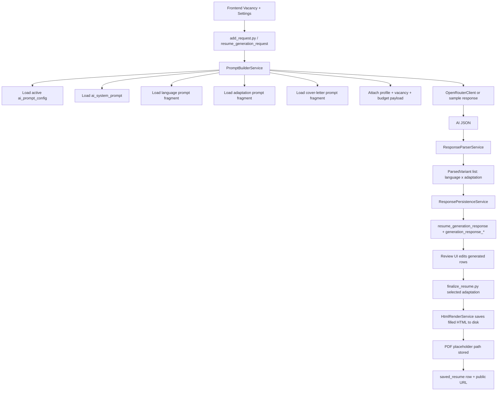

# Backend Prototype v3 Flow Overview

## Default test scenario

`generation_request.json` uses:

- language mode: `Bilingual`
- adaptation selection: `All`
- cover letter: `true`

That expands to six generated response rows:

- EN / MINIMAL
- EN / BALANCED
- EN / MAXIMUM
- RU / MINIMAL
- RU / BALANCED
- RU / MAXIMUM

Finalization with `BALANCED` creates:

- EN saved resume
- RU saved resume

Each saved resume receives its own public URL.

## v3.2 update

- Education is bilingual profile-owned data and is rendered from profile fields, not AI output.
- Personal Information is AI-generated/reviewed via `generation_response_personal`.
- Final HTML/PDF artifacts are stored under `generated_results/{username}/{public_code}/`.
- PDF conversion is placeholder-only in Python and must become Java HtmlToPdfConverter call.
