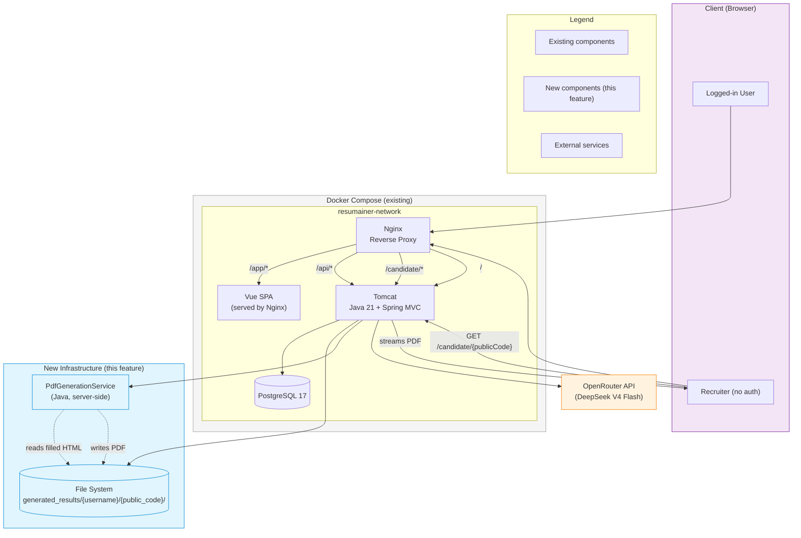
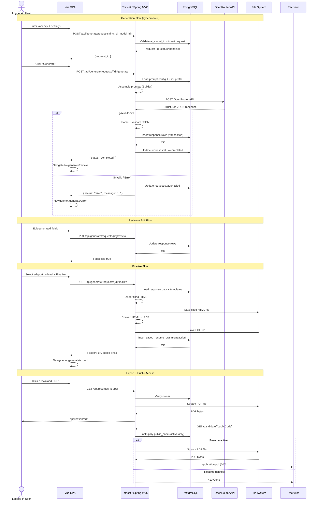

# System Design: Resume Generation

**Feature**: AI-powered resume generation with bilingual support, editable review, and HTML/PDF export
**Generated**: 2026-06-12
**Scope**: New infrastructure for feature — file storage, OpenRouter integration, PDF conversion

---

## Overview

The system extends the existing ResumAIner Docker Compose deployment (Tomcat + Nginx + PostgreSQL) with three new infrastructure concerns: server-side file storage for generated HTML and PDF artifacts, HTTP-based integration with OpenRouter API for AI generation, and an internal PDF conversion service. All user data flows through authenticated backend endpoints. Public access is limited to a single read-only PDF route.

## System Design Diagram

## Infrastructure Decisions

### File System Storage for Generated Artifacts

**What**: Server-side filesystem storage at `generated_results/{username}/{public_code}/` for filled HTML and PDF files.

**Why**: The spec requires HTML to be saved before PDF conversion (DEC-073). A deterministic file path structure makes artifacts discoverable without a database scan. Filesystem storage is the simplest approach for MVP — no cloud storage, CDN, or object store needed. The path includes the username for logical organization and public_code for unique file naming.

**Alternatives considered**:

| Option | Why it wasn't chosen |
|--------|---------------------|
| Database BLOB storage | Makes backups larger, harder to stream files, and doesn't simplify export. Filesystem is more natural for file delivery |
| Cloud object storage (S3) | Adds infrastructure complexity, dependency, and cost with no MVP benefit. Can be added post-MVP without changing the business logic |

**When you'd choose differently**: If the system needs to scale horizontally across multiple Tomcat instances, shared filesystem access becomes a problem. At that point, migrate to S3-compatible object storage with the same path structure.

---

### OpenRouter API Integration

**What**: Synchronous HTTP calls from the Java backend to OpenRouter API (DeepSeek model route) for AI-powered generation.

**Why**: The OpenRouter API provides access to multiple LLMs through a single unified endpoint. The `AiClient` interface abstracts the HTTP call behind a Java interface, so the provider can be swapped (to OpenAI, Anthropic, or a self-hosted model) without changing the generation orchestration. Synchronous calls keep the MVP simple — no queue, no async job system needed. The timeout-sensitive nature of LLM calls is handled at the HTTP client level.

**Alternatives considered**:

| Option | Why it wasn't chosen |
|--------|---------------------|
| Self-hosted LLM | Requires GPU infrastructure, significant operational cost, and doesn't fit the target deployment (VPS with limited resources) |
| Async queue-based generation | Adds RabbitMQ/Redis infrastructure for MVP. LLM calls are already slow (10-30s), so the user waits anyway. Queue adds complexity without UX benefit at MVP scale |

**When you'd choose differently**: If generation requests grow to 100+ per minute, an async queue with worker pool would prevent HTTP connection exhaustion and provide better load shedding.

---

### PdfGenerationService

**What**: A separate Java service class that converts a saved HTML file to PDF using a server-side library.

**Why**: The plan decouples PDF conversion from HTML rendering so that one can succeed without the other — if PDF conversion fails, the filled HTML is already saved and can be manually converted later or re-processed. A separate service class (not a separate process for MVP) keeps the architecture simple while maintaining clear separation of concerns.

**Alternatives considered**:

| Option | Why it wasn't chosen |
|--------|---------------------|
| Client-side PDF generation in Vue | Rejected by architecture decision (DEC-034, DEC-017). The backend must control final output for consistent layout, ATS-friendly formatting, and correct Cyrillic rendering |
| wkhtmltopdf as external process | More complex deployment (requires system dependency in Docker). A pure Java library is simpler to deploy and maintain |

**When you'd choose differently**: PDF library choice will be evaluated in a future feature. If the chosen library lacks features (e.g., CSS3 support, complex layouts), consider wkhtmltopdf or a dedicated microservice.

---

## Data Flow

## Scaling & Reliability Notes

- **Synchronous generation**: For MVP, generation is synchronous (user waits). At higher load, this should become async with a polling endpoint.
- **File storage**: Single-server filesystem works for MVP. Horizontal scaling requires shared/NFS storage or migration to object storage.
- **OpenRouter availability**: The spec mandates a mock AI client for testing. In production, timeouts and 5xx errors from OpenRouter should show the temporary error screen with retry/change settings options.
- **Backup strategy**: Generated HTML/PDF files should be included in regular server backups. The database is the source of truth for metadata; files can be re-generated from stored response data if lost.
- **Public PDF route**: The 410 Gone response for deleted resumes prevents broken links without exposing any user data.
