# Component Diagram: PDF/HTML Resume Export and Bullet-Point Review Hardening

**Feature**: Production PDF/HTML resume generation + structured bullet-point editing for ResumAIner
**Generated**: 2026-06-20
**Scope**: Full Feature 008 — all Phase Groups

---

## Overview

This diagram shows the internal component structure of Feature 008, focusing on the new and updated modules added to the existing ResumAIner codebase. Arrows represent data flow and dependency direction. Dashed boundaries group components by responsibility: Review/Bullets (Phase Group 1) and PDF/HTML Generation (Phase Group 2).

## Component Diagram

```mermaid
flowchart TB
    subgraph FRONTEND["Vue 3 SPA — /app/"]
        ReviewPage["GenerateReviewPage.vue\nBullet editing UI"]
        ExportPage["GenerateExportPage.vue\nDownload buttons + loading screen"]
        ReviewForm["ReviewStepForm.vue\nBullet fields under each record"]
        RecordGroup["GeneratedRecordGroup.vue\nWork/Project records + bullets"]
    end

    subgraph CONTROLLERS["Spring MVC Controllers"]
        GenCtrl["GenerateResumeController\n/finalize + /export + /candidate/{code}"]
        DLController["ResumeDownloadController\n/pdf + /html downloads"]
    end

    subgraph SERVICES["Service Layer"]
        direction TB
        ReviewSvc["ResumeReviewService\nBullet edit/save, update keys"]
        FinalizeSvc["ResumeFinalizeService\nFinalization orchestration, compensation"]
        LegacyRenderer["ResumeTemplateRenderer\n@Deprecated — not called"]
        GenPersistSvc["GenerationResponsePersistenceService\nBullet persistence + rollback"]
        ParserSvc["AiResponseParser\nbulletPoints[] parsing"]
        ValidatorSvc["AiResponseValidator\nBullet validation, 250 char limit"]
        BudgetResolver["WorkExperienceBudgetResolver\nExisting — production page split"]
        RenderConfigSvc["PdfRenderConfigService\nLoad active fit limits + fill targets"]
    end

    subgraph PDF_ENGINE["PDF Engine — Ported from Spike  service/pdf/"]
        direction TB
        XhtmlRenderer["XhtmlTemplateRenderer\nGenerate XHTML from ResumeRenderData"]
        PdfRenderer["OpenHtmlPdfRenderer\nOpenHTMLToPDF + PDFBox"]
        FitEngine["FeedbackFitEngine\nIterative font/gap adjustment"]
        PdfAnalyzer["PdfAnalyzer\nPage count + text extraction"]
        PdfValidator["PdfValidationService\nContent, anchors, fill validation"]
        CssInspector["CssSafetyInspector\nReject browser-only CSS"]
        ExpectationBuilder["ContentExpectationBuilder\nRequired text expectations"]
        PageCleaner["PdfBlankPageCleaner\nRemove trailing blank pages"]
        PageMerger["PdfPageMerger\nMulti-page assembly"]
    end

    subgraph DATA["Data Access Layer"]
        SavedResumeDao["SavedResumeDao\nCRUD + PDF metadata + publicCode lookup"]
        BulletDao["GenerationResponseExperienceDao / ProjectDao\nBullet row insert/read"]
        RenderConfigDao["PdfRenderConfigDao\nFit limits + fill targets"]
        BudgetDao["ResumeBudgetConfigDao\nExisting — reused"]
    end

    subgraph STORAGE["Storage"]
        PG[("PostgreSQL\nsaved_resumes, bullet tables,\nfit config tables, budget tables")]
        FS[("Filesystem\nStaging → Final storage\nPDF + HTML artifacts")]
    end

    %% Frontend → Backend
    ReviewPage --> ReviewForm
    ReviewForm --> RecordGroup
    ReviewPage -->|"POST /review/update"| GenCtrl
    ExportPage -->|"POST /finalize"| GenCtrl
    ExportPage -->|"GET /export"| GenCtrl
    ExportPage -->|"GET /pdf, /html"| DLController

    %% Controller → Service
    GenCtrl --> ReviewSvc
    GenCtrl --> FinalizeSvc
    DLController --> FinalizeSvc

    %% Review flow
    ReviewSvc --> ParserSvc
    ReviewSvc --> ValidatorSvc
    ReviewSvc --> GenPersistSvc
    GenPersistSvc --> BulletDao

    %% Finalization flow
    FinalizeSvc --> BudgetResolver
    FinalizeSvc --> RenderConfigSvc
    FinalizeSvc --> XhtmlRenderer
    FinalizeSvc --> PdfRenderer
    FinalizeSvc -.->|"@Deprecated — not called"| LegacyRenderer

    %% PDF Engine pipeline
    XhtmlRenderer --> CssInspector
    PdfRenderer --> FitEngine
    FitEngine --> PdfAnalyzer
    PdfAnalyzer --> PageCleaner
    PageCleaner --> PageMerger
    PdfAnalyzer --> PdfValidator
    PdfValidator --> ExpectationBuilder

    %% Service → Storage
    FinalizeSvc -->|"Staging files"| FS
    FinalizeSvc -->|"Commit metadata + promote files"| SavedResumeDao
    BulletDao --> PG
    SavedResumeDao --> PG
    RenderConfigDao --> PG
    BudgetDao --> PG
    RenderConfigSvc --> RenderConfigDao

    %% Public route
    GenCtrl -->|"GET /candidate/{code}"| SavedResumeDao
```

## Component Breakdown

### GenerateResumeController (Updated)

**Role**: Entry point for finalization and export flows. Now handles real PDF/HTML generation orchestration and the public `/candidate/{code}` route (replacing 501 placeholder).

**Why this exists as a separate component**: Single responsibility — all generate/resume HTTP endpoints in one place. The existing controller already owns the generate flow; adding finalization here keeps the API cohesive.

**Key interactions**:
- → `ResumeReviewService`: delegates review save before finalization
- → `ResumeFinalizeService`: orchestrates PDF/HTML generation + file promotion + DB commit
- ← `SavedResumeDao`: serves public PDF via `/candidate/{code}` lookup

### ResumeDownloadController (New)

**Role**: Serves authenticated PDF and HTML file downloads. Validates owner scope and resolves file paths safely.

**Why separate from GenerateResumeController**: Different auth pattern — these are resource-serving endpoints (Content-Disposition headers, streamed file responses), not JSON API endpoints. Separation keeps each controller focused on one HTTP responsibility.

**Key interactions**:
- → `SavedResumeDao`: load metadata + verify ownership
- → Filesystem: read and stream file content (with path traversal protection — SEC-001)

### ResumeFinalizeService (Updated)

**Role**: Central orchestrator — loads data, drives PDF engine, manages compensation (file + DB), sets FINALIZING status, handles bilingual atomicity.

**Why this exists**: The "glue" between AI-generated data and final artifacts. Compensation logic (file writes + DB commits that cannot share a transaction) is rightfully here rather than spread across multiple services.

**Key interactions**:
- → `WorkExperienceBudgetResolver`: decides page split (1-page vs 2-page)
- → `PdfRenderConfigService`: loads active fit limits + fill targets
- → `XhtmlTemplateRenderer` → `OpenHtmlPdfRenderer` → `FeedbackFitEngine` → validation: the PDF pipeline
- → `SavedResumeDao`: commit metadata after validation passes; rollback on failure
- → Filesystem: stage → validate → promote → cleanup

### PDF Engine (service/pdf/ — Ported from Spike)

**Role**: The entire rendering pipeline — 9 classes ported from the approved spike, responsible for taking structured `ResumeRenderData` and producing a validated, fitted, cleaned PDF plus parity HTML.

**Why ported, not rewritten**: The spike solved difficult layout problems (page-isolated fitting, PDF/HTML parity, adaptive fill targets, generic text anchors, trailing blank page cleanup, RU/EN normalization). Rewriting would reintroduce those problems. The plan explicitly forbids inventing a new renderer.

**Pipeline order**:
1. `XhtmlTemplateRenderer` — structured data → XHTML with PDF-safe CSS
2. `CssSafetyInspector` — rejects browser-only CSS tokens before PDF rendering
3. `OpenHtmlPdfRenderer` — XHTML → PDF via OpenHTMLToPDF + PDFBox
4. `FeedbackFitEngine` — iterative font/gap adjustment (bounded by DB config)
5. `PdfAnalyzer` — page count + text extraction
6. `PdfBlankPageCleaner` — remove trailing blank pages
7. `PdfPageMerger` — assemble multi-page PDF
8. `PdfValidationService` + `ContentExpectationBuilder` — validate page count, text presence, fill targets

### GeneratedFileStorageService (Existing — Reused)

**Role**: Builds safe filesystem paths under `generated_results/{username}/{public_code}/`. Sanitizes path segments. Already implemented in Feature 007.

**Why reused**: Path sanitization and directory structure already solved. Feature 008 extends usage to PDF + parity HTML files alongside existing legacy HTML.

---

## Design Reasoning

### Why this structure?

The component decomposition follows the **spike-proven pipeline pattern** with explicit separation between data preparation (ResumeRenderData, budget resolver), rendering (XHTML → PDF), fitting (FeedbackFitEngine), and validation (PdfValidationService). Each stage can be tested independently — the spike already proved this with 17 edge case scenarios. The plan mirrors this decomposition with project-conventional naming and package structure.

### Why port spike classes as-is instead of integrating into existing services?

The spike classes are **self-contained and side-effect-free** — they take immutable input, produce output files, and return metrics. Merging them into existing services (e.g., putting fitting logic into `ResumeFinalizeService`) would create a 500+ line service with mixed responsibilities. The dedicated `service/pdf/` package keeps the PDF concern isolated, testable, and replaceable — if OpenHTMLToPDF is ever swapped for another engine, only this package changes.

### Alternatives considered

| Structure | Why it wasn't chosen |
|---|---|
| Single monolithic `PdfGenerationService` with all rendering logic inlined | Spike already proved the pipeline benefits from decomposition — fitting, validation, and rendering are independently testable and reusable |
| Integrate PDF fitting into `WorkExperienceBudgetResolver` | Budget resolver is content-distribution (which sections go where), not rendering-fit (font size, line height, gaps). Mixing them would create a bloated class with two unrelated responsibilities |
| Generate PDF synchronously in the controller | PDF generation can take seconds (fitting attempts). Controller must return quickly; the plan uses FINALIZING status + frontend loading screen instead |

### When you'd restructure

If the project adds **multiple resume templates** (different visual layouts), the `XhtmlTemplateRenderer` would need to become a strategy pattern with template-specific implementations. The fitting engine and validator would remain template-agnostic. If PDF generation moves to a **background job queue** (currently out of MVP scope), `ResumeFinalizeService` would become a job producer, and a new `PdfGenerationWorker` would consume jobs from the queue.
