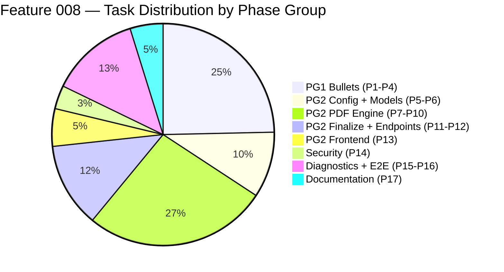

# Feature Progress Dashboard — ResumAIner

```mermaid
gantt
    title SDD Feature Progress
    dateFormat X
    axisFormat %s

    section 001-hello-world-tomcat
    Specify     :done, s1, 0, 1
    Plan        :done, p1, 1, 2
    Tasks       :done, t1, 2, 3
    Implement   :done, i1, 3, 4
    Verify      :done, v1, 4, 5

    section 002-thymeleaf-landing
    Specify     :done, s2, 0, 1
    Plan        :done, p2, 1, 2
    Tasks       :done, t2, 2, 3
    Implement   :done, i2, 3, 4
    Verify      :done, v2, 4, 5

    section 003-vue-auth-page
    Specify     :done, s3, 0, 1
    Plan        :done, p3, 1, 2
    Tasks       :done, t3, 2, 3
    Implement   :done, i3, 3, 4
    Verify      :done, v3, 4, 5

    section 004-custom-jdbc-pool
    Specify     :done, s4, 0, 1
    Plan        :done, p4, 1, 2
    Tasks       :done, t4, 2, 3
    Implement   :done, i4, 3, 4
    Verify      :done, v4, 4, 5

    section 005-user-home-page
    Specify     :done, s5, 0, 1
    Plan        :done, p5, 1, 2
    Tasks       :done, t5, 2, 3
    Implement   :done, i5, 3, 4
    Verify      :done, v5, 4, 5

    section 006-user-profile
    Specify     :done, s6, 0, 1
    Plan        :done, p6, 1, 2
    Tasks       :done, t6, 2, 3
    Implement   :done, i6, 3, 4
    Verify      :done, v6, 4, 5

    section 007-resume-generation
    Specify     :done, s7, 0, 1
    Plan        :done, p7, 1, 2
    Tasks       :done, t7, 2, 3
    Implement   :done, i7, 3, 4
    Verify      :done, v7, 4, 5

    section 008-pdf-generation
    Specify     :done, s8, 0, 1
    Plan        :done, p8, 1, 2
    Tasks       :done, t8, 2, 3
    Implement   :active, i8, 3, 4
    Verify      :v8, 4, 5
```

## Summary

| Feature | Phase | Tasks | Progress | Status |
|---|---|---|---|---|
| 001-hello-world-tomcat | ✅ Complete | 22/22 | 100% | 🟢 Done |
| 002-thymeleaf-landing-page | ✅ Complete | 27/27 | 100% | 🟢 Done |
| 003-vue-auth-page | ✅ Complete | 63/63 | 100% | 🟢 Done |
| 004-custom-jdbc-connection-pool | ✅ Complete | 55/55 | 100% | 🟢 Done |
| 005-user-home-page | ✅ Complete | 41/41 | 100% | 🟢 Done |
| 006-user-profile | ✅ Complete | 48/48 | 100% | 🟢 Done |
| 007-resume-generation | ✅ Complete | 160/160 | 100% | 🟢 Done |
| **008-pdf-generation** | 🔧 **Implement** | **0/152** | **0%** | 🟡 **Active** |

## Feature 008 Task Breakdown

## Project Totals

| Metric | Value |
|---|---|
| **Total features** | 8 |
| **Completed** | 7 (87.5%) |
| **Active** | 1 (008-pdf-generation) |
| **Total tasks across project** | 568 |
| **Completed tasks** | 416/568 (73%) |

---

🟢 **7 фич полностью завершены.**  
🟡 **Feature 008** — спецификация, план, и 152 задачи готовы. Реализация не начата.
