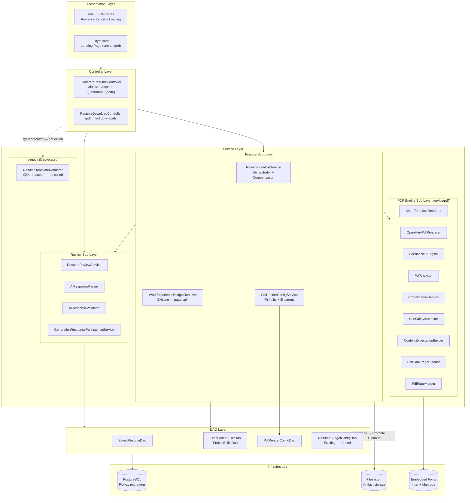

# Software Architecture: Feature 008 — PDF/HTML Export

**Feature**: Production PDF/HTML resume generation and bullet-point review hardening
**Generated**: 2026-06-20
**Scope**: Architectural patterns for the PDF rendering pipeline and review editing layer

---

## Overview

Feature 008 extends ResumAIner's existing **layered MVC architecture** with a dedicated **PDF rendering pipeline** (ported from the approved spike) and a **structured bullet editing layer**. The architecture follows the project constitution: controller → service → dao, with the PDF engine as an isolated sub-layer within the service tier. The legacy HTML renderer is preserved but explicitly excluded from the new flow.

## Architecture Diagram



## Architectural Pattern: Layered MVC + Isolated Pipeline

**What it is**: The classic three-layer architecture (controller → service → dao) with strict top-down dependency direction. Feature 008 adds a **pipeline sub-layer** within the service tier — the PDF engine is a self-contained chain of processing stages (render → fit → analyze → validate → clean → merge) that takes structured input and produces files + metrics. The finalization service orchestrates the pipeline but does not contain rendering logic.

**Why this pattern**: The constitution mandates layered architecture. The spike proved that the PDF pipeline benefits from **decomposition into independently testable stages** — each class has a single responsibility (e.g., `PdfAnalyzer` only counts pages and extracts text). The orchestrator (`ResumeFinalizeService`) handles cross-cutting concerns: transactions, compensation, status management, bilingual atomicity. This separation means each pipeline stage can be ported, tested, and verified in isolation before integration.

**Tradeoffs accepted**:
- ✓ Each pipeline stage testable independently (spike has 7 test classes proving this)
- ✓ Pipeline replaceable — if OpenHTMLToPDF changes, only `OpenHtmlPdfRenderer` needs updating
- ✓ Clean separation between business orchestration (finalize service) and rendering mechanics (PDF engine)
- ✗ More files than a monolithic approach (9 pipeline classes + 8 model classes) — justified by the spike's proven correctness and the risk of fitting bugs in a monolithic implementation

## Layer Breakdown

### Controller Layer

**Responsibility**: HTTP request/response handling. Validate authentication, delegate to services, format JSON responses. Download controllers handle file streaming with path traversal protection.

**Depends on**: Service Layer

**Depended on by**: Presentation Layer (Vue SPA)

**Why this boundary exists**: Controllers do not contain business logic — they translate between HTTP and the service layer. The public route (`/{username}/{code}`) lives here with rate limiting applied before service delegation.

### Service Layer — Review Sub-Layer

**Responsibility**: Parse AI response JSON, validate structured bullet points, persist bullets transactionally, expose review DTOs with opaque update keys.

**Depends on**: DAO Layer

**Depended on by**: Controller Layer, Finalize Sub-Layer

**Why this boundary exists**: Bullet editing is a distinct concern from PDF generation. The review sub-layer ensures bullets are validated and persisted before finalization consumes them. Opaque update keys (D27 pattern) prevent the frontend from constructing raw database paths.

### Service Layer — Finalize Sub-Layer

**Responsibility**: Orchestrate the end-to-end finalization flow. Load data, delegate to PDF engine, manage compensation (file + DB), enforce FINALIZING status, handle bilingual atomicity.

**Depends on**: Review Sub-Layer, Budget Resolver, PDF Engine, DAO Layer, Filesystem

**Depended on by**: Controller Layer

**Why this boundary exists**: Finalization is the most complex orchestration point in the feature. Keeping it in its own service prevents `GenerateResumeController` from becoming a "God controller" and allows the compensation logic to be tested independently of HTTP concerns.

### Service Layer — PDF Engine Sub-Layer (service/pdf/)

**Responsibility**: Pure rendering pipeline — structured data in, validated PDF + HTML files out. No database access, no HTTP awareness, no side effects beyond file writes.

**Depends on**: OpenHTMLToPDF, PDFBox, embedded fonts

**Depended on by**: Finalize Sub-Layer only

**Why this boundary exists**: This is the most critical architectural decision in Feature 008. The PDF engine is ported as a **self-contained subsystem** because:
1. The spike validated this decomposition across 17 edge cases
2. Each stage is independently testable
3. If a fitting bug is found, only `FeedbackFitEngine` needs debugging — not the entire finalization flow
4. The pipeline stages form a clear processing graph: Render → Fit → Analyze → Clean → Merge → Validate

### DAO Layer

**Responsibility**: All database access via `PreparedStatement`. CRUD for bullets, saved resumes (with PDF metadata), fit config. Connection-accepting overloads for transaction support (D10 pattern).

**Depends on**: PostgreSQL, custom connection pool

**Depended on by**: Service Layer

**Why this boundary exists**: Constitution mandates plain JDBC with DAO pattern. All new DAOs follow existing conventions. The `PdfRenderConfigDao` is a new addition — simple config loading with no write operations needed.

---

## Module Organization

**Strategy**: **Hybrid** — by layer (controller/service/dao/model) at the top level, by feature (pdf/, review/) within the service layer.

The top-level package structure follows the constitution's layered pattern:
```
com.resumainer/
├── controller/     ← All HTTP endpoints
├── service/        ← Business logic
│   └── pdf/        ← PDF engine (ported from spike, feature-specific sub-package)
├── dao/            ← Data access
├── model/          ← Domain objects
│   └── pdf/        ← PDF-specific models (ported from spike)
├── dto/            ← Data transfer objects
├── config/         ← Spring configuration
└── util/           ← Utilities (HtmlEscapeUtil, PublicCodeGenerator)
```

The `service/pdf/` and `model/pdf/` sub-packages isolate the spike-ported code from existing services. This makes it obvious which code came from the spike (for future maintenance) and prevents accidental coupling between PDF rendering and business logic.

---

## When This Architecture Evolves

- **Multiple templates**: If the project adds alternative resume templates (different visual layouts), `XhtmlTemplateRenderer` evolves into a strategy pattern with template-specific implementations. The fitting engine remains template-agnostic.
- **Background PDF generation**: If finalization moves from synchronous to async (job queue), `ResumeFinalizeService` becomes a job producer. A new `PdfGenerationWorker` consumes jobs. The PDF engine sub-layer remains unchanged — it doesn't care who calls it.
- **Cloud deployment**: If the project deploys to multiple nodes, the filesystem storage pattern evolves to cloud object storage (S3). The download controller changes to generate pre-signed URLs instead of streaming files directly. The compensation design adapts: delete objects via API instead of local file deletion.
