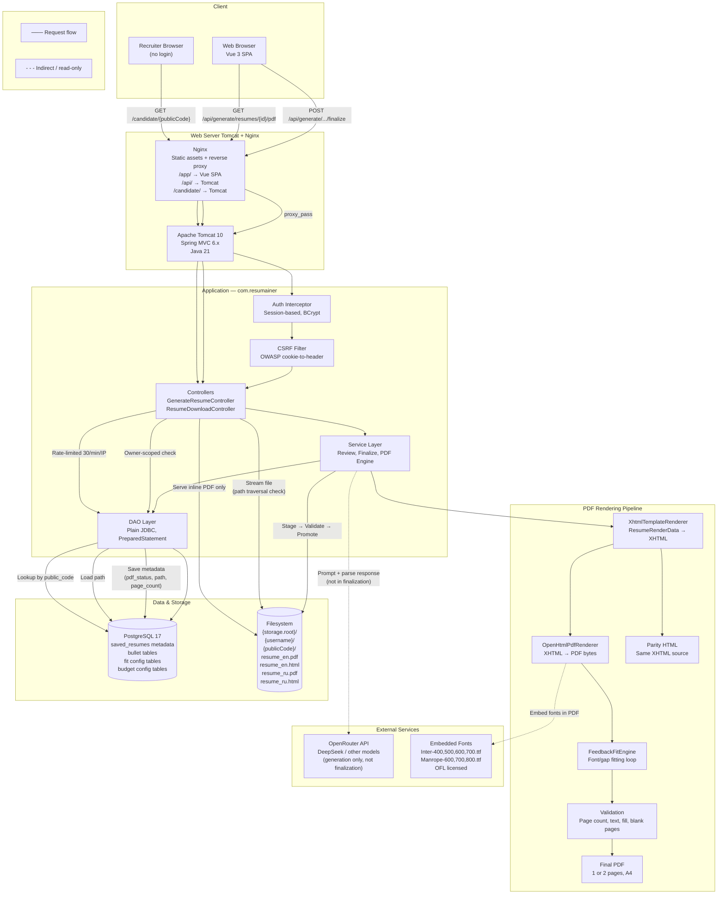
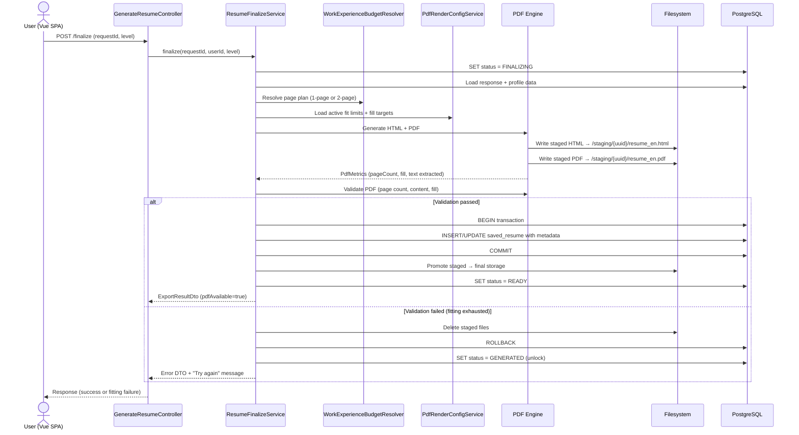

# System Design: PDF/HTML Resume Export — Feature 008

**Feature**: Production PDF/HTML resume generation infrastructure for ResumAIner
**Generated**: 2026-06-20
**Scope**: New infrastructure — PDF rendering pipeline, filesystem artifact storage, public PDF route

---

## Overview

Feature 008 adds the final export layer to ResumAIner's resume generation pipeline. Once AI generates structured resume content and the user reviews/edits it, the system renders a production-quality PDF (1 or 2 pages, selectable text, bilingual page notes) and a matching HTML artifact. Files are stored on the filesystem with metadata in PostgreSQL. Authenticated users download their own resumes; recruiters access public PDFs via a short unguessable URL without authentication.

## System Design Diagram

## Infrastructure Decisions

### PostgreSQL for Metadata + Filesystem for Artifacts

**What**: Resume metadata (status, paths, page count, public code) stored in PostgreSQL `saved_resumes` table. Generated PDF and HTML files stored on the filesystem in a configurable directory, organized by `{username}/{publicCode}/`.

**Why**: PDF files are 25–65 KB each. Storing them as BYTEA in PostgreSQL would bloat the database and slow backups. Filesystem storage is fast for streaming (the download controller streams directly from disk), and PostgreSQL holds just the small metadata rows needed for queries (lookup by publicCode, owner, status). The compensation design accounts for the split: if DB commit fails after file writes, staged files are deleted.

**Alternatives considered**:

| Option | Why it wasn't chosen |
|---|---|
| PostgreSQL BYTEA for PDF storage | PDF files are binary blobs; streaming from DB is slower; DB backups grow unnecessarily; no query advantage |
| Cloud object storage (S3) | Overkill for MVP Capstone project; adds network dependency; Docker Compose target doesn't include cloud services |
| In-memory only (no persistence) | PDF must survive restarts; metadata needed for public URL lookup after server restart |

**When you'd choose differently**: If the project deploys to a multi-node cluster where filesystem storage isn't shared, cloud object storage (S3-compatible) with pre-signed URLs would replace the local filesystem pattern.

### OpenHTMLToPDF 1.0.10 + PDFBox 2.0.30

**What**: Pure-Java HTML-to-PDF rendering using OpenHTMLToPDF with PDFBox 2.0.30 backend. No native dependencies, no external processes.

**Why**: The spike validated this exact combination across 17 bilingual edge cases. Pure Java avoids Docker/binary dependencies (unlike wkhtmltopdf). PDFBox 2.0.30 is the version tested in the spike — upgrading to PDFBox 3.x would risk compatibility. The `com.openhtmltopdf` group ID is used in the spike; the plan allows verifying the newer `io.github.openhtmltopdf` group at implementation time.

**Alternatives considered**:

| Option | Why it wasn't chosen |
|---|---|
| wkhtmltopdf (Qt WebKit) | Requires native binary in Docker image; Cyrillic font issues in older versions; external process management |
| iText 7 | AGPL licensing; overkill for simple resume layout; steeper learning curve |
| Apache FOP | XSL-FO required (no CSS); double the template maintenance |

**When you'd choose differently**: If OpenHTMLToPDF becomes unmaintained or fails on a critical CSS feature, Apache FOP with a separate XSL-FO transformation layer could replace it — but would require rewriting all templates.

### Inter + Manrope Fonts (OFL Licensed)

**What**: Inter (body text, 4 weights) and Manrope (headings, 3 weights) embedded directly in generated PDFs. Loaded programmatically via `PdfRendererBuilder.useFont()`.

**Why**: The spike's layout and fitting engine are calibrated to these fonts' metrics. Switching fonts would require recalibrating all 17 edge-case fitting tests. Both are OFL-licensed — free for embedding in documents. Fonts are isolated to the PDF pipeline — existing web fonts in the Vue SPA are unaffected.

---

## Data Flow — Finalization Sequence

---

## Scaling & Reliability Notes

- **Fitting attempts bounded**: `max_attempts` from DB config (default 30) prevents infinite loops. Each attempt generates a new PDF — worst case is short.
- **Single-user finalization**: FINALIZING status prevents concurrent finalization for the same request. No multi-user contention on finalization.
- **File cleanup on failure**: Staged files deleted before DB rollback. No orphan artifacts.
- **Bilingual atomicity**: EN and RU finalization within one transaction scope. Both succeed or neither.
- **Rate limiting**: Public route `/candidate/{code}` limited to 30 requests/minute/IP. Prevents brute-force enumeration of public codes.
- **Path traversal protection**: Download controllers validate resolved file path is within storage root before reading (SEC-001).
- **No background queue**: MVP does not use job queues. Finalization is synchronous with loading screen UX. The plan notes this can evolve to async in a future iteration.
