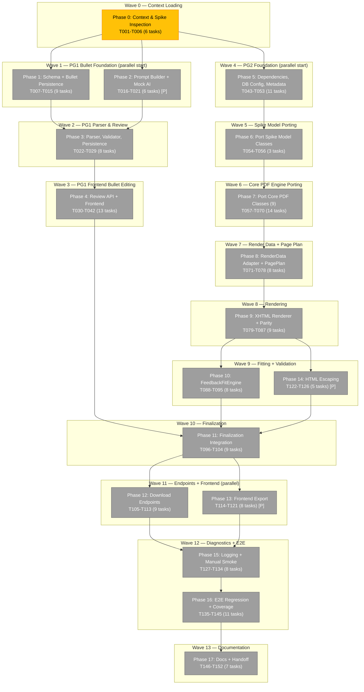

# Task Dependency Graph: Feature 008 — PDF/HTML Resume Export



## Legend

- 🟡 **Yellow** — Ready to start (no unresolved dependencies)
- ⚪ **Gray** — Blocked (waiting on preceding phases)

## Critical Path

```
Phase 0 → Phase 1 → Phase 3 → Phase 4 → Phase 5 → Phase 6 → Phase 7
→ Phase 8 → Phase 9 → Phase 10 → Phase 11 → Phase 12 → Phase 15
→ Phase 16 → Phase 17
```

**15 phases, ~152 tasks** — the longest chain from context loading to documentation handoff. Phase 0 is the only unblocked phase.

## Parallel Execution Windows

| Window | Phases | What runs together |
|---|---|---|
| **Wave 1** | P1 + P2 | Schema migration + Prompt builder (independent) |
| **Wave 9** | P10 + P14 | Fit engine + HTML escaping (independent — different packages) |
| **Wave 11** | P12 + P13 | Backend endpoints + Frontend export (contract-stable) |
| **Wave 13** | P17 (all [P]) | All 7 documentation tasks parallel |

## Phase Group Dependency Rule

```
PG1 (Phases 1-4) ──→ PG2 Finalization (Phase 11)
                        ↑
PG2 (Phases 5-10, 14) ──┘
```

Phase Group 1 (bullets) MUST complete before PG2 Finalization wiring, because PDF rendering must consume finalized structured bullets. However, PG2 foundation phases (5-10, 14) can start as soon as Phase 0 completes — they are independent of PG1.

## Statistics

| Metric | Value |
|---|---|
| **Total tasks** | 152 |
| **Completed** | 0 (0%) |
| **Ready to start** | 6 (Phase 0) |
| **Blocked** | 146 |
| **Execution waves** | 14 |
| **Phases** | 18 (0–17) |
| **Critical path length** | 15 phases |
| **Parallel phases** | 3 pairs (P1∥P2, P10∥P14, P12∥P13) |
