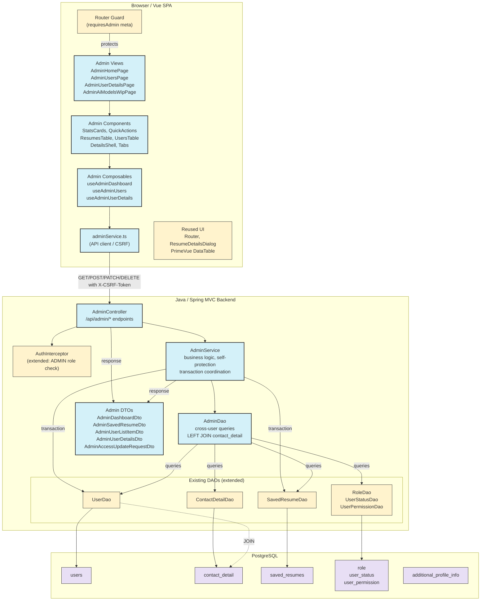

# Component Diagram: Admin Console Users and Resumes

**Feature**: Admin Home dashboard, Admin Users CRUD, resume moderation, account access management, AI Models WIP
**Generated**: 2026-06-26
**Scope**: Full feature

---

## Overview

This diagram shows the new and modified components for the admin console feature, their relationships, and data flow. Backend follows the existing layered architecture (controller/service/dao). Frontend follows the existing Vue 3 + PrimeVue pattern with composables and a dedicated admin API service.

## Component Diagram

## Component Breakdown

### AuthInterceptor (extended)

**Role**: Gatekeeper for all `/api/admin/**` requests — checks that the authenticated user has ADMIN role.

**Why this exists as a separate component**: The existing `AuthInterceptor` only checks authentication. Adding the ADMIN role check to the same interceptor keeps authorization logic centralized rather than scattering checks across every controller method. Using `request.getServletPath()` for context-path-safe matching.

**Key interactions**:
- ← HTTP request to `/api/admin/**`: intercepted before `AdminController`
- → Rejects non-admin with `403 Forbidden`, unauthenticated with `401 Unauthorized`

### AdminController (new)

**Role**: Exposes all read and mutation endpoints under `/api/admin/`: dashboard, resumes, users, user details, access update, delete.

**Why this exists as a separate component**: Dedicated controller keeps admin concerns isolated from user-facing controllers. Follows existing pattern of one controller per domain area.

**Key interactions**:
- → `AdminService`: delegates business logic
- ← `AdminDTOs`: returns safe DTOs without raw paths or sensitive fields

### AdminService (new)

**Role**: Business logic for admin operations: dashboard aggregation, self-protection validation, user soft-delete transaction coordination.

**Why this exists as a separate component**: Isolates admin-specific business rules (self-delete rejection, self-demotion blocking, cascade logic) from existing user services. Prevents accidental scope creep into user-facing service code.

**Key interactions**:
- → `AdminDao`: read queries
- → `UserDao` (connection-accepting overload): user soft-delete within transaction
- → `SavedResumeDao` (connection-accepting overload): cascade resume soft-delete

### AdminDao (new)

**Role**: Data access for admin-specific cross-user queries — dashboard counts, paginated all-resumes, paginated users, user details with joins.

**Why this exists as a separate component**: Keeps admin-specific SQL (cross-user queries, LEFT JOIN contact_detail for fullName, aggregation queries) separate from user-scoped DAOs. Avoids polluting existing DAOs with admin-only query methods.

**Key interactions**:
- → `UserDao`, `SavedResumeDao`, `ContactDetailDao`, lookup DAOs: delegates or extends existing queries
- → PostgreSQL: custom paginated queries with sort whitelist and date range filtering

### Admin DTOs (new)

**Role**: Safe response shapes for all admin endpoints — no `password_hash`, no raw file paths, no internal details.

**Why this exists as a separate component**: Dedicated DTOs ensure admin responses never accidentally include sensitive fields from entity models. `AdminSavedResumeDto` strips file paths, `AdminUserDetailsDto` separates contacts/account/additional sections cleanly.

**Key interactions**:
- ← `AdminController`/`AdminService`: populated from query results and returned as JSON

### Admin Service (frontend: adminService.ts, new)

**Role**: HTTP client for all `/api/admin/*` endpoints — uses shared `httpClient.ts` for CSRF token handling.

**Why this exists as a separate component**: Follows the existing pattern of one service file per backend domain (cf. `userHomeService.ts`, `profileService.ts`). Centralizes admin API URL construction and error handling.

**Key interactions**:
- → `AdminController`: sends fetch requests with `X-CSRF-Token` header for unsafe methods
- ← Returns typed DTOs to composables

### Admin Composables (new)

**Role**: Three composables (`useAdminDashboard`, `useAdminUsers`, `useAdminUserDetails`) manage page-level state: loading, data, filters, sort, pagination, error handling.

**Why this exists as a separate component**: Separates state management from view rendering, following the existing Vue 3 Composition API pattern. Each composable owns one page's state lifecycle, making views simpler and state logic testable independently.

**Key interactions**:
- → `adminService.ts`: fetches data
- ← Exposes reactive state (`data`, `loading`, `error`, `filters`, `page`) to Vue components

### Admin Views and Components (new)

**Role**: Vue pages and reusable components for rendering Admin Home dashboard, Admin Users table, Admin User Details tabs, and AI Models WIP page.

**Why these exist as separate components**: Each view/page follows the existing pattern (one view per route). Components are split by responsibility: `AdminStatsCards` for dashboard numbers, `AdminResumesTable` for the all-resumes grid, `AdminUserAccountTab` for editable account controls. This keeps each file focused and testable.

**Key interactions**:
- → Admin Composables: reads state, triggers actions
- → `RouterGuard`: protected by `requiresAdmin` meta

---

## Design Reasoning

### Why this structure?

The component structure follows the project's existing layered architecture exactly — no new patterns, no new infrastructure. Backend adds `AdminController`/`AdminService`/`AdminDao` as a new domain silo alongside existing domains (auth, profile, resume generation). Frontend adds `adminService.ts`, three composables, and ten components following the same patterns as User Home and Profile pages. This minimizes learning curve and risk: every component has a clear precedent in the codebase.

The key design decision is placing the ADMIN role check in `AuthInterceptor` rather than scattering it across controller methods. This ensures all `/api/admin/**` endpoints are protected by default — adding a new endpoint in the future can't accidentally skip authorization.

### Alternatives considered

| Structure | Why it wasn't chosen |
|-----------|---------------------|
| One monolithic Admin backend (no DAO, service, or controller split) | Violates existing layered architecture. Would create a god-component with mixed concerns that's hard to test and maintain. |
| ADMIN checks only in controller methods | Scatters security logic. A new endpoint could accidentally skip authorization. Centralized interceptor is safer. |
| Reuse UserHomeService for admin resume queries | Would add admin-specific cross-user query methods to a user-scoped service, breaking the single-responsibility principle. |
| Merge all admin frontend state into one composable | Would create a large state object with unrelated concerns (dashboard + users + details). Three focused composables are easier to test and evolve independently. |

### When you'd restructure

If the admin feature grows significantly (e.g., real-time monitoring, audit logs, bulk operations, AI model management), the single `AdminController` and `AdminService` would need to split by domain (e.g., `AdminUserController`, `AdminResumeController`, `AdminAnalyticsService`). The current single-controller structure is appropriate for MVP scope.
