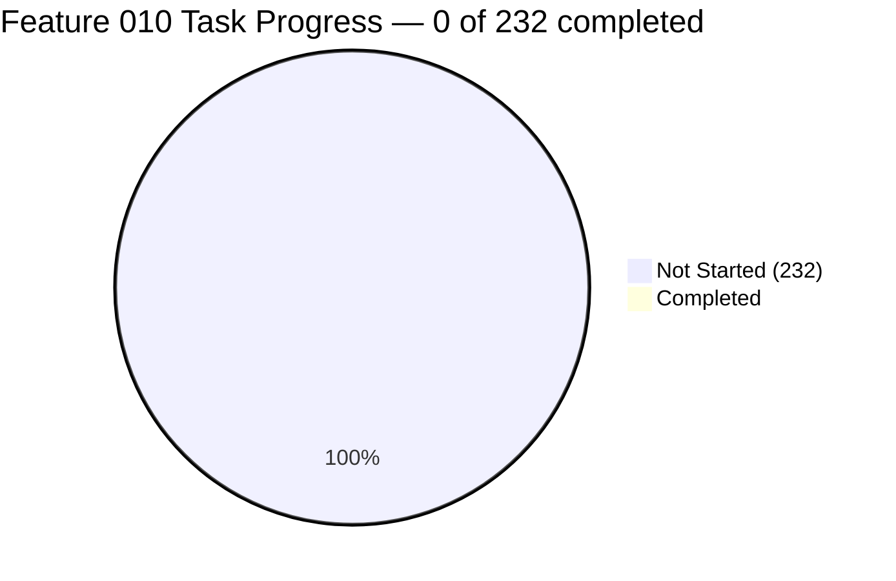

# Feature Progress Dashboard

```mermaid
gantt
    title SDD Feature Progress — ResumAIner
    dateFormat X
    axisFormat %s

    section 001-hello-world-tomcat
    Specify :done, s01, 0, 1
    Plan :done, p01, 1, 2
    Tasks :done, t01, 2, 3
    Implement :done, i01, 3, 4
    Verify :done, v01, 4, 5

    section 002-thymeleaf-landing-page
    Specify :done, s02, 0, 1
    Plan :done, p02, 1, 2
    Tasks :done, t02, 2, 3
    Implement :done, i02, 3, 4
    Verify :done, v02, 4, 5

    section 003-vue-auth-page
    Specify :done, s03, 0, 1
    Plan :done, p03, 1, 2
    Tasks :done, t03, 2, 3
    Implement :done, i03, 3, 4
    Verify :done, v03, 4, 5

    section 004-custom-jdbc-pool
    Specify :done, s04, 0, 1
    Plan :done, p04, 1, 2
    Tasks :done, t04, 2, 3
    Implement :done, i04, 3, 4
    Verify :done, v04, 4, 5

    section 005-user-home-page
    Specify :done, s05, 0, 1
    Plan :done, p05, 1, 2
    Tasks :done, t05, 2, 3
    Implement :done, i05, 3, 4
    Verify :done, v05, 4, 5

    section 006-user-profile
    Specify :done, s06, 0, 1
    Plan :done, p06, 1, 2
    Tasks :done, t06, 2, 3
    Implement :done, i06, 3, 4
    Verify :done, v06, 4, 5

    section 007-resume-generation
    Specify :done, s07, 0, 1
    Plan :done, p07, 1, 2
    Tasks :done, t07, 2, 3
    Implement :done, i07, 3, 4
    Verify :done, v07, 4, 5

    section 008-pdf-generation
    Specify :done, s08, 0, 1
    Plan :done, p08, 1, 2
    Tasks :done, t08, 2, 3
    Implement :done, i08, 3, 4
    Verify :done, v08, 4, 5

    section 009-home-modal-fix
    Specify :done, s09, 0, 1
    Plan :done, p09, 1, 2
    Tasks :done, t09, 2, 3
    Implement :done, i09, 3, 4
    Verify :done, v09, 4, 5

    section 010-admin-page-users
    Specify :done, s10, 0, 1
    Plan :done, p10, 1, 2
    Tasks :done, t10, 2, 3
    Implement :active, i10, 3, 4
    Verify :v10, 4, 5
```

---

## Summary

| # | Feature | Spec | Plan | Tasks | Done/Total | Progress | Phase |
|---|---|---|---|---|---|---|---|
| 001 | hello-world-tomcat | ✅ | ✅ | ✅ | 22/22 | ██████████ 100% | ✅ Verify |
| 002 | thymeleaf-landing-page | ✅ | ✅ | ✅ | 27/27 | ██████████ 100% | ✅ Verify |
| 003 | vue-auth-page | ✅ | ✅ | ✅ | 63/63 | ██████████ 100% | ✅ Verify |
| 004 | custom-jdbc-connection-pool | ✅ | ✅ | ✅ | 55/55 | ██████████ 100% | ✅ Verify |
| 005 | user-home-page | ✅ | ✅ | ✅ | 41/41 | ██████████ 100% | ✅ Verify |
| 006 | user-profile | ✅ | ✅ | ✅ | 48/48 | ██████████ 100% | ✅ Verify |
| 007 | resume-generation | ✅ | ✅ | ✅ | 160/160 | ██████████ 100% | ✅ Verify |
| 008 | pdf-generation | ✅ | ✅ | ✅ | 204/204 | ██████████ 100% | ✅ Verify |
| 009 | home-modal-fix | ✅ | ✅ | ✅ | 171/171 | ██████████ 100% | ✅ Verify |
| **010** | **admin-page-users** | ✅ | ✅ | ✅ | **0/232** | ░░░░░░░░░░ **0%** | 🟡 **Tasks → Implement** |

---

## Task Breakdown: Feature 010 Admin Page Users

### Phases (14 phases, 232 tasks)

| Phase | Tasks | Status |
|---|---|---|
| Phase 0 — Baseline Inspection | T001-T016 | 📋 Ready |
| Phase 1 — Backend Auth Foundation | T017-T025 | 📋 Ready |
| Phase 2 — Dashboard + Resumes Read | T026-T040 | 📋 Ready |
| Phase 3 — Admin Resume Delete | T041-T049 | 📋 Ready |
| Phase 4 — Admin Users List API | T050-T064 | 📋 Ready |
| Phase 5 — User Details Read API | T065-T074 | 📋 Ready |
| Phase 6 — Access Update + User Delete | T075-T099 | 📋 Ready |
| Phase 7 — Frontend Routes/Services/i18n | T100-T108 | 📋 Ready |
| Phase 8 — Frontend Admin Home | T109-T125 | 📋 Ready |
| Phase 9 — Frontend Admin Users | T126-T142 | 📋 Ready |
| Phase 10 — Frontend User Details | T143-T175 | 📋 Ready |
| Phase 11 — AI Models WIP | T176-T181 | 📋 Ready |
| Phase 12 — Tests + Playwright Evidence | T182-T215 | 📋 Ready |
| Phase 13 — Final Hardening + Audit | T216-T232 | 📋 Ready |

---

## Legend

| Phase | Gantt color | Meaning |
|---|---|---|
| Specify | :done | spec.md exists |
| Plan | :done | plan.md exists |
| Tasks | :done | tasks.md exists |
| Implement | :active | tasks partially completed |
| Verify | :done (future) | all tasks done + checklist |
