# Component Diagram: Auth Hardening and Spring Security Migration

**Feature**: Full migration from custom session auth to Spring Security
**Generated**: 2026-06-30
**Scope**: Full feature — 18 phases

---

## Overview

This diagram shows the key backend and frontend components after the Spring Security migration. Legacy components (AuthInterceptor, CsrfFilter, old session-based auth) are not shown — they will be removed during the migration.

## Component Diagram

```mermaid
flowchart TD
    subgraph External ["External Services"]
        Google["Google OAuth2 Provider"]
        Turnstile["Cloudflare Turnstile"]
        Resend["Resend Email API"]
    end

    subgraph Frontend ["Vue 3 Frontend"]
        AuthPage["AuthPage.vue<br/>Auth container"]
        LoginForm["LoginForm.vue<br/>Email + password + remember-me + captcha"]
        RegisterForm["RegisterForm.vue<br/>Email + username + password + captcha"]
        CheckEmail["CheckEmailPage.vue<br/>Check email / resend verification"]
        Verified["VerifiedPage.vue<br/>Success / expired / invalid"]
        ForgotPwd["ForgotPasswordPage.vue<br/>Email + captcha"]
        ResetPwd["ResetPasswordPage.vue<br/>Token validation + new password"]
        AuthService["authService.ts<br/>API client + CSRF X-XSRF-TOKEN"]
        UseAuth["useAuth.ts<br/>Auth state / status"]
    end

    subgraph ConfigLayer ["Spring Security Configuration"]
        SecurityConfig["SecurityConfig<br/>Filter chain, routes, CSRF,<br/>remember-me, OAuth2"]
    end

    subgraph BackendAuth ["Auth Handlers & Services (new)"]
        JsonLoginSuccess["JsonAuthenticationSuccessHandler<br/>JSON login success + role redirect"]
        JsonLoginFailure["JsonAuthenticationFailureHandler<br/>JSON error + failed attempt counter"]
        JsonLogout["JsonLogoutSuccessHandler<br/>JSON logout + session/remember-me clear"]
        OAuth2Success["OAuth2LoginSuccessHandler<br/>Verified email link/create + redirect"]
        OAuth2Failure["OAuth2LoginFailureHandler<br/>Safe JSON error + redirect"]
        CustomUserDetails["CustomUserDetailsService<br/>Load by email + authority mapping"]
    end

    subgraph BackendServices ["Auth Services (new)"]
        AuthTokenService["AuthTokenService<br/>Create/verify/consume hashed tokens"]
        EmailVerificationService["EmailVerificationService<br/>Register + verify email"]
        PasswordResetService["PasswordResetService<br/>Forgot + reset + token validation"]
        CaptchaService["CaptchaService<br/>Turnstile verification + dev bypass"]
        EmailService["ResendEmailService<br/>Bilingual email delivery"]
    end

    subgraph BackendExisting ["Existing Backend (updated)"]
        AuthController["AuthController<br/>Register, login, logout,<br/>status, verify, reset"]
        AuthService["AuthService<br/>Business logic (updated)"]
        UserDao["UserDao<br/>User CRUD by email"]
        PasswordService["PasswordService<br/>Password strength + encoding"]
    end

    subgraph DAO ["Data Access (new)"]
        AuthTokenDao["AuthTokenDao<br/>auth_tokens table"]
        OAuthAccountDao["OAuthAccountDao<br/>oauth_accounts table"]
    end

    subgraph Database ["PostgreSQL"]
        Users["users<br/>+ email_verified,<br/>password_login_enabled"]
        AuthTokens["auth_tokens<br/>hashed tokens,<br/>one-time use"]
        OAuthAccounts["oauth_accounts<br/>Google identity links"]
        PersistentLogins["persistent_logins<br/>Spring Security<br/>remember-me"]
    end

    %% Frontend connections
    AuthPage --> LoginForm
    AuthPage --> RegisterForm
    AuthPage --> ForgotPwd
    LoginForm --> AuthService
    RegisterForm --> AuthService
    CheckEmail --> AuthService
    Verified --> AuthService
    ForgotPwd --> AuthService
    ResetPwd --> AuthService
    AuthService --> UseAuth
    AuthService -->|X-XSRF-TOKEN| AuthController

    %% Backend config -> services
    SecurityConfig --> JsonLoginSuccess
    SecurityConfig --> JsonLoginFailure
    SecurityConfig --> JsonLogout
    SecurityConfig --> OAuth2Success
    SecurityConfig --> OAuth2Failure
    SecurityConfig --> CustomUserDetails

    %% Controller -> existing
    AuthController --> AuthService
    AuthController --> PasswordService

    %% Services -> new components
    JsonLoginFailure --> CaptchaService
    EmailVerificationService --> AuthTokenService
    EmailVerificationService --> EmailService
    PasswordResetService --> AuthTokenService
    PasswordResetService --> EmailService
    
    %% Services -> existing
    CustomUserDetails --> UserDao
    AuthService --> UserDao
    AuthService --> PasswordService
    AuthTokenService --> AuthTokenDao
    OAuth2Success --> OAuthAccountDao
    OAuth2Success --> UserDao

    %% DAO -> DB
    AuthTokenDao --> AuthTokens
    OAuthAccountDao --> OAuthAccounts
    UserDao --> Users

    %% External
    CaptchaService --> Turnstile
    EmailService --> Resend
    OAuth2Success --> Google
```

## Component Breakdown

### SecurityConfig

**Role**: Central Spring Security configuration — filter chain, route security, CSRF, remember-me, OAuth2 client registration.

**Why this exists as a separate component**: The config class owns all security boundaries in one place. Splitting it would spread security rules across files and increase the risk of misconfiguration. In a non-Boot app, the filter chain must be explicitly registered — this class is the single control point.

**Key interactions**:
- → JsonAuthenticationSuccessHandler: delegates login success JSON handling
- → JsonAuthenticationFailureHandler: delegates login failure JSON handling
- → JsonLogoutSuccessHandler: delegates logout JSON handling
- → OAuth2LoginSuccessHandler: delegates OAuth2 success
- → OAuth2LoginFailureHandler: delegates OAuth2 failure
- → CustomUserDetailsService: used for password/remember-me auth

---

### CustomUserDetailsService

**Role**: Loads user by email, maps role to Spring Security authorities, enforces account state checks.

**Why this exists as a separate component**: Spring Security requires a `UserDetailsService` interface implementation. Keeping it separate from the existing `UserService` prevents coupling security loading with business logic. The existing `UserDao` is reused for the DB query — no duplicate data access.

**Key interactions**:
- → UserDao: loads user by email
- ← SecurityConfig: wired as the authentication provider's user source

---

### JsonAuthenticationFailureHandler

**Role**: Returns JSON error responses for login failures with specific auth error codes.

**Why this exists as a separate component**: The default Spring Security failure handler returns HTML or redirects. For the SPA JSON contract, a custom handler is required. Separating success and failure handlers keeps each response path independently testable.

**Key interactions**:
- → CaptchaService: checks if captcha is required after failed attempts
- → UserDao: increments failed login counters

---

### CaptchaService

**Role**: Verifies Cloudflare Turnstile tokens. Supports dev bypass token in dev mode.

**Why this exists as a separate component**: Turnstile verification is a cross-cutting concern shared by registration, password reset, resend verification, and conditional login. Extracting it avoids duplicating HTTP client and verification logic across multiple services.

**Key interactions**:
- → Turnstile (external): POST /siteverify with secret + token
- ← JsonAuthenticationFailureHandler: checks if captcha is now required
- ← EmailVerificationService: validates captcha before registration
- ← PasswordResetService: validates captcha before reset request

---

### AuthTokenService

**Role**: Creates, hashes, validates, and consumes email verification and password reset tokens.

**Why this exists as a separate component**: Token lifecycle logic (hash generation, TTL enforcement, one-time consumption, invalidation) is non-trivial and shared by two flows (verification + reset). Isolating it from the email and password services keeps each service focused.

**Key interactions**:
- → AuthTokenDao: persist/read/update token records
- ← EmailVerificationService: create verification token
- ← PasswordResetService: create/validate/consume reset token

---

### EmailService (ResendEmailService)

**Role**: Sends bilingual verification and reset emails via Resend API. Falls back to dev logging when API key absent.

**Why this exists as a separate component**: Email delivery is a dedicated external integration with specific failure modes (missing API key, network error, rate limiting). Separating it from token logic allows independent mocking in tests and clear production vs dev behavior.

**Key interactions**:
- → Resend (external): sends email via Resend API
- ← EmailVerificationService: sends verification link
- ← PasswordResetService: sends password reset link

---

### AuthTokenDao / OAuthAccountDao

**Role**: New DAO classes for `auth_tokens` and `oauth_accounts` tables.

**Why these exist as separate components**: Following the project's existing DAO pattern. Each table gets its own DAO class with explicit SQL, no ORM. Keeps data access consistent with the rest of the codebase.

---

## Design Reasoning

### Why this structure?

The structure follows the existing project's layered architecture (controller → service → DAO) while adding Spring Security's standard interface-based extension points (`UserDetailsService`, `AuthenticationSuccessHandler`, `AuthenticationFailureHandler`, `LogoutSuccessHandler`, `OAuth2UserService`).

The key architectural decision: **replace custom security filters with Spring Security interfaces**, not with a custom security framework. Each Spring Security extension point maps to one focused class with a single responsibility. This keeps the migration incremental — old and new code can coexist during transition phases.

The external service integrations (Turnstile, Resend, Google OAuth2) are each isolated behind their own service class. This makes them independently testable with mocks and swappable if the provider changes.

### Alternatives considered

| Structure | Why it wasn't chosen |
|-----------|---------------------|
| Single `SecurityEverythingService` | Violates SRP. Would merge token logic, captcha, email, and OAuth into one untestable class. |
| Keep all auth in existing AuthService with Spring Security wrappers | AuthService already mixes controller response logic with business rules. Adding Spring Security handler logic would make it worse. |
| Use Spring Security default form login with HTML redirect | Breaks the SPA JSON contract. Frontend would need to switch from API-driven auth to form-based auth — major UX regression. |

### When you'd restructure

If the feature later adds multi-provider OAuth (GitHub, LinkedIn), the `OAuth2LoginSuccessHandler` would need to become provider-aware. If email volume grows significantly, the `EmailService` would need to split into a queue-backed sending layer.
