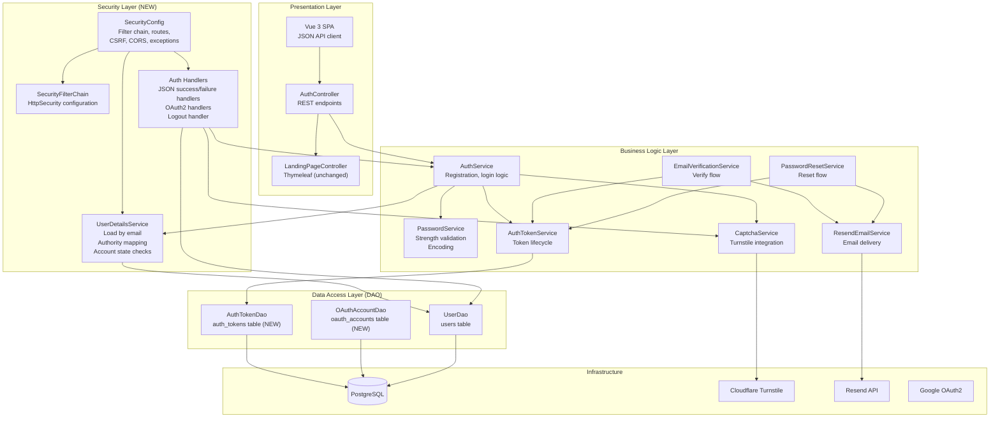

# Software Architecture: Auth Hardening and Spring Security Migration

**Feature**: Full migration from custom session auth to Spring Security
**Generated**: 2026-06-30
**Scope**: Architectural patterns for Spring Security integration in layered MVC app

---

## Overview

The project follows a layered MVC architecture (controller → service → DAO) with plain JDBC and Flyway migrations. This feature adds Spring Security as the authentication/authorization layer, integrating through standard Spring Security extension points rather than replacing the existing architecture. The architectural philosophy is "plug Spring Security into the existing MVC layers" — not "rewrite the app around Spring Security."

## Architecture Diagram



## Architectural Pattern: Layered + SecurityFilterChain

**What it is**: The project follows a traditional layered architecture (controller → service → DAO). Spring Security adds a filter-chain-based security layer that intercepts HTTP requests before they reach controllers. The security layer is NOT a new architectural layer in the business logic sense — it is a request-processing layer that Spring Security manages through its `SecurityFilterChain` pipeline.

**Why this pattern**: The existing codebase is already layered MVC. Adding Spring Security through its standard `SecurityFilterChain` approach requires minimal restructuring — the existing controllers, services, and DAOs stay largely unchanged. Spring Security handles authentication and authorization at the filter level; the business layer simply receives authenticated `Authentication` objects through standard mechanisms (`SecurityContextHolder`, `@AuthenticationPrincipal`, method security).

**Tradeoffs accepted**:
- ✓ Clear separation: security logic lives in config + handlers, not scattered across controllers
- ✓ Backward compatible: existing controller endpoints keep their signatures
- ✓ Testable: Spring Security provides `@WithMockUser` and `SecurityMockMvcRequestPostProcessors` for controller tests
- ✗ More boilerplate than custom session auth: each handler (success, failure, logout, OAuth) needs its own class. But the tradeoff is justified by Spring Security's production-grade session management, CSRF, and OAuth2 support.

## Layer Breakdown

### Security Layer (Spring Security)

**Responsibility**: Authenticate requests, enforce authorization rules, manage sessions, CSRF, remember-me, OAuth2 login.

**Depends on**: DAO layer (via UserDetailsService), Service layer (CaptchaService for failure handler)

**Depended on by**: Presentation layer (controllers receive authenticated requests)

**Why this boundary exists**: Security is cross-cutting. Putting auth logic into controllers would violate DRY — every controller would need to check session state. Spring Security's filter chain handles this before any controller is reached. The security layer is also independently configurable: you can change authentication providers, session policies, or CSRF behavior without touching business logic.

### Business Logic Layer

**Responsibility**: Registration, token lifecycle, password validation, email verification, password reset — all the process logic that doesn't belong in a controller or DAO.

**Depends on**: DAO layer (UserDao, AuthTokenDao, OAuthAccountDao)

**Depended on by**: Presentation layer (AuthController calls services)

**Why this boundary exists**: The existing project already separates service from DAO. This feature adds new focused services (AuthTokenService, EmailVerificationService, etc.) rather than bloating the existing AuthService. Each service has a single responsibility, making them independently testable.

### Data Access Layer (DAO)

**Responsibility**: Raw JDBC queries for users, auth_tokens, oauth_accounts, persistent_logins tables.

**Depends on**: PostgreSQL (via JDBC)

**Depended on by**: Security layer (UserDetailsService), Business layer (all services)

**Why this boundary exists**: Following the project's DAO pattern: plain JDBC with explicit SQL, no ORM. Each DAO maps to one table or query responsibility. The new `AuthTokenDao` and `OAuthAccountDao` follow the same pattern as the existing `UserDao`.

### Presentation Layer

**Responsibility**: REST endpoints for auth flows, SPA JSON responses.

**Depends on**: Business layer (AuthService and related services)

**Depended on by**: Vue frontend (HTTP client calls)

**Why this boundary exists**: Controllers are thin — they validate HTTP input, call services, and return JSON. No business logic lives in controllers. This keeps endpoints consistent and testable with MockMvc.

---

## Module Organization

**Strategy**: By layer (config / service / dao / dto) within the standard Java package structure `com.resumainer.*`.

New packages added by this feature:
```
com.resumainer.config
  SecurityConfig.java

com.resumainer.service.security
  CustomUserDetailsService.java
  CustomUserDetails.java
  JsonAuthenticationSuccessHandler.java
  JsonAuthenticationFailureHandler.java
  JsonLogoutSuccessHandler.java
  OAuth2LoginSuccessHandler.java
  OAuth2LoginFailureHandler.java
  CaptchaService.java
  TurnstileCaptchaService.java
  DevCaptchaService.java
  AuthTokenService.java
  EmailVerificationService.java
  PasswordResetService.java
  ResendEmailService.java
  EmailTemplateService.java

com.resumainer.dao
  AuthTokenDao.java (new)
  OAuthAccountDao.java (new)

com.resumainer.dto.auth
  AuthErrorResponse.java (new)
  LoginRequest.java (updated)
  RegisterRequest.java (updated)
  PasswordResetConfirmDto.java (new)
  PasswordResetValidateResponse.java (new)
  ResendVerificationRequestDto.java (new)
```

Existing files updated (not moved):
- `AuthController.java` — updated for JSON contract
- `AuthService.java` — updated for Spring Security integration
- `UserDao.java` — updated for new user columns
- `PasswordService.java` — updated for Spring Security PasswordEncoder
- `PasswordStrengthValidator.java` — unchanged

## When This Architecture Evolves

If the project adds multi-provider OAuth (GitHub, LinkedIn), the OAuth2 success handler would need to become provider-aware or split into provider-specific handlers. If the project grows to multiple backend instances, the in-memory rate limiting would need to move to a distributed store (PostgreSQL-based rate limit or Redis). If the project adds JWT-based auth for an API gateway, Spring Security's filter chain would need a new JWT authentication filter — but that is a future decision and explicitly out of scope for this feature.
