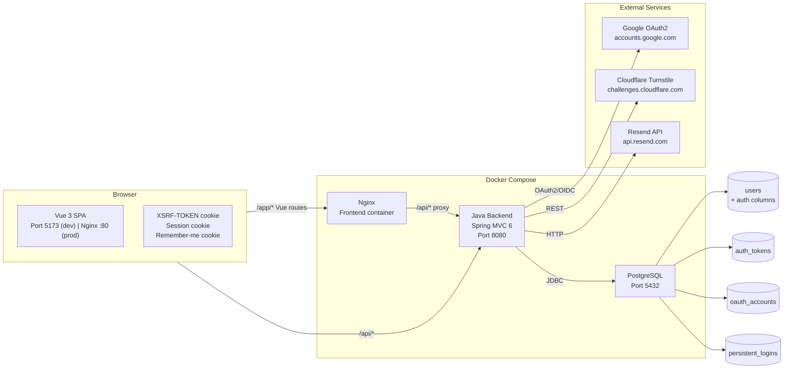
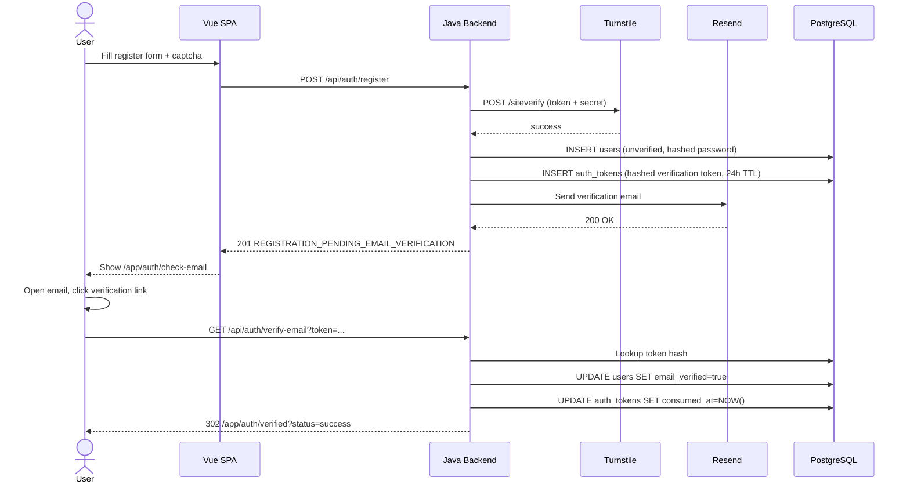
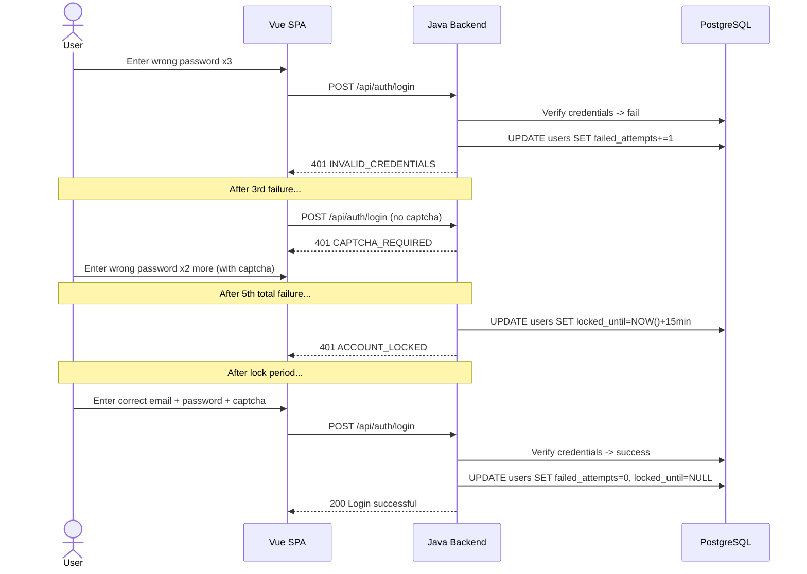
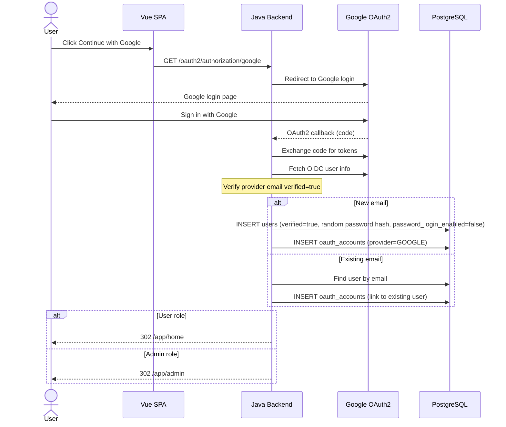

# System Design: Auth Hardening and Spring Security Migration

**Feature**: Full authentication hardening before production deployment
**Generated**: 2026-06-30
**Scope**: New infrastructure integrations (OAuth2, email, captcha) + Spring Security for existing deployment

---

## Overview

The system is a browser-based Vue SPA communicating with a Java backend via JSON REST API. This feature adds three new external integrations (Google OAuth2, Cloudflare Turnstile, Resend) and replaces the internal custom session auth with Spring Security. The database adds three new tables for token and identity storage. The deployment remains Docker Compose with three services: Java backend, Vue frontend (served by Nginx), and PostgreSQL.

## System Design Diagram

## Infrastructure Decisions

### PostgreSQL for Auth Data

**What**: Existing PostgreSQL instance with 4 new/updated tables: `users` (new columns), `auth_tokens`, `oauth_accounts`, `persistent_logins`.

**Why**: The project already uses PostgreSQL for all application data. Adding auth tables to the same database maintains transaction consistency (e.g., creating a user + verification token in the same transaction) without introducing a second data store. Spring Security's persistent remember-me also expects a relational database.

**Alternatives considered**:
| Option | Why it wasn't chosen |
|--------|---------------------|
| Redis for token storage | Adds operational complexity. Auth tokens are write-once/read-once with TTL — PostgreSQL handles this fine. Redis would be justified at higher scale. |
| Separate auth database | Adds connection pool complexity. No isolation benefit for a single-app deployment. |

**When you'd choose differently**: If the project scaled to multiple backend instances, a distributed token cache (Redis) for session/remember-me would reduce DB load on each auth request.

---

### Cloudflare Turnstile for Captcha

**What**: Server-side POST verification to `https://challenges.cloudflare.com/turnstile/v0/siteverify` with the Turnstile secret key and client token.

**Why**: Turnstile provides invisible captcha (no visual challenge) on a generous free tier suitable for portfolio deployment. Server-side verification ensures the captcha cannot be bypassed by client-side manipulation.

**Alternatives considered**:
| Option | Why it wasn't chosen |
|--------|---------------------|
| Google reCAPTCHA | Privacy concerns, visual challenges degrade UX. Turnstile is simpler to integrate. |
| hCaptcha | Higher latency, lower free tier limits for a portfolio project. |

**When you'd choose differently**: If the project required enterprise compliance with specific captcha providers mandated by policy.

---

### Resend for Email Delivery

**What**: HTTP API to `https://api.resend.com/emails` with sender identity, recipient, subject, and HTML+plain text body.

**Why**: Resend has a free tier (100 emails/day) sufficient for dev/test and low-traffic portfolio deployment. The API is simple REST — no SDK required, no complex SMTP configuration.

**Alternatives considered**:
| Option | Why it wasn't chosen |
|--------|---------------------|
| SMTP (Gmail, SendGrid) | SMTP credentials management is more complex. SendGrid requires dedicated domain setup. Resend's API-only approach is simpler. |
| JavaMailSession | Requires SMTP server configuration. Overkill for a single email provider. |

**When you'd choose differently**: If the project required high-volume transactional email (thousands/day), SendGrid or AWS SES would be more cost-effective at scale.

---

### Google OAuth2 via Spring Security

**What**: Standard OIDC authorization code flow. Spring Security manages the redirect, token exchange, and user info extraction.

**Why**: Spring Security's built-in OAuth2 client handles the protocol complexity. No custom OAuth2 client code needed. The frontend only needs a link to `/oauth2/authorization/google`.

**Alternatives considered**:
| Option | Why it wasn't chosen |
|--------|---------------------|
| Google Sign-In SDK on frontend | Exposes Google client ID to frontend, complex token handling. Backend-managed OAuth2 is more secure. |
| Custom OAuth2 implementation | Spring Security already provides production-grade OAuth2 client. Custom implementation would duplicate tested protocol handling. |

---

## Data Flow

### Registration + Verification (happy path)

### Login with failed attempt lockout

### Google OAuth2 new user

## Scaling & Reliability Notes

At the project's current scale (capstone/portfolio deployment), the architecture uses a single backend instance with one PostgreSQL database. The new auth tables add minimal load. Key reliability points:

- **Missing secrets**: Production startup fails safely if Turnstile, Resend, or Google OAuth2 secrets are missing (FR-139).
- **Email delivery failure**: Dev logs links. Production requires working API key (FR-118).
- **Database failure**: Auth becomes unavailable if DB is down — the design does not add a caching layer for a single-instance deployment. This is acceptable for the target scale.
- **Rate limiting**: Server-side rate limits protect public endpoints even without a distributed rate limiter (single instance → in-memory counts are sufficient for MVP).
