# Feature Progress Dashboard

**Generated**: 2026-06-30

```mermaid
gantt
    title SDD Feature Progress — ResumAIner
    dateFormat X
    axisFormat %s

    section 001-hello-world-tomcat
    Specify :done, s01, 0, 1
    Plan    :done, p01, 1, 2
    Tasks   :done, t01, 2, 3
    Implement :done, i01, 3, 4
    Verify  :done, v01, 4, 5

    section 002-thymeleaf-landing-page
    Specify :done, s02, 0, 1
    Plan    :done, p02, 1, 2
    Tasks   :done, t02, 2, 3
    Implement :done, i02, 3, 4
    Verify  :done, v02, 4, 5

    section 003-vue-auth-page
    Specify :done, s03, 0, 1
    Plan    :done, p03, 1, 2
    Tasks   :done, t03, 2, 3
    Implement :done, i03, 3, 4
    Verify  :done, v03, 4, 5

    section 004-custom-jdbc-pool
    Specify :done, s04, 0, 1
    Plan    :done, p04, 1, 2
    Tasks   :done, t04, 2, 3
    Implement :done, i04, 3, 4
    Verify  :done, v04, 4, 5

    section 005-user-home-page
    Specify :done, s05, 0, 1
    Plan    :done, p05, 1, 2
    Tasks   :done, t05, 2, 3
    Implement :done, i05, 3, 4
    Verify  :done, v05, 4, 5

    section 006-user-profile
    Specify :done, s06, 0, 1
    Plan    :done, p06, 1, 2
    Tasks   :done, t06, 2, 3
    Implement :done, i06, 3, 4
    Verify  :done, v06, 4, 5

    section 007-resume-generation
    Specify :done, s07, 0, 1
    Plan    :done, p07, 1, 2
    Tasks   :done, t07, 2, 3
    Implement :done, i07, 3, 4
    Verify  :done, v07, 4, 5

    section 008-pdf-generation
    Specify :done, s08, 0, 1
    Plan    :done, p08, 1, 2
    Tasks   :done, t08, 2, 3
    Implement :done, i08, 3, 4
    Verify  :done, v08, 4, 5

    section 009-home-modal-fix
    Specify :done, s09, 0, 1
    Plan    :done, p09, 1, 2
    Tasks   :done, t09, 2, 3
    Implement :done, i09, 3, 4
    Verify  :done, v09, 4, 5

    section 010-admin-page-users
    Specify :done, s10, 0, 1
    Plan    :done, p10, 1, 2
    Tasks   :done, t10, 2, 3
    Implement :done, i10, 3, 4
    Verify  :done, v10, 4, 5

    section 011-auth-hardening
    Specify :done, s11, 0, 1
    Plan    :done, p11, 1, 2
    Tasks   :active, t11, 2, 3
    Implement :a11, 3, 4
    Verify  :v11, 4, 5
```

## Summary

| # | Feature | Phase | Tasks | Status |
|---|---------|-------|-------|--------|
| 001 | Hello World Tomcat | Verify | 22/22 | ✅ Complete |
| 002 | Thymeleaf Landing Page | Verify | 27/27 | ✅ Complete |
| 003 | Vue Auth Page | Verify | 63/63 | ✅ Complete |
| 004 | Custom JDBC Connection Pool | Verify | 55/55 | ✅ Complete |
| 005 | User Home Page | Verify | 41/41 | ✅ Complete |
| 006 | User Profile | Verify | 48/48 | ✅ Complete |
| 007 | Resume Generation | Verify | 160/160 | ✅ Complete |
| 008 | PDF Generation | Verify | 204/204 | ✅ Complete |
| 009 | Home Modal Fix | Verify | 171/171 | ✅ Complete |
| 010 | Admin Console Users & Resumes | Verify | merged via PR #12 | ✅ Complete |
| 011 | **Auth Hardening & Spring Security** | **Tasks** | **0/335** | **🔄 In Progress** |

**9 features complete** · **1 complete (merged)** · **1 in progress (Tasks phase)**

**Next step**: Start implementation — Phase 0: Baseline Security Map.
