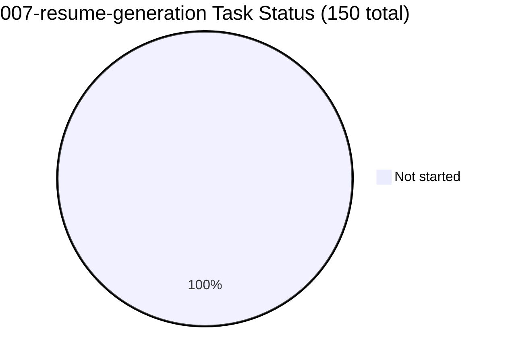
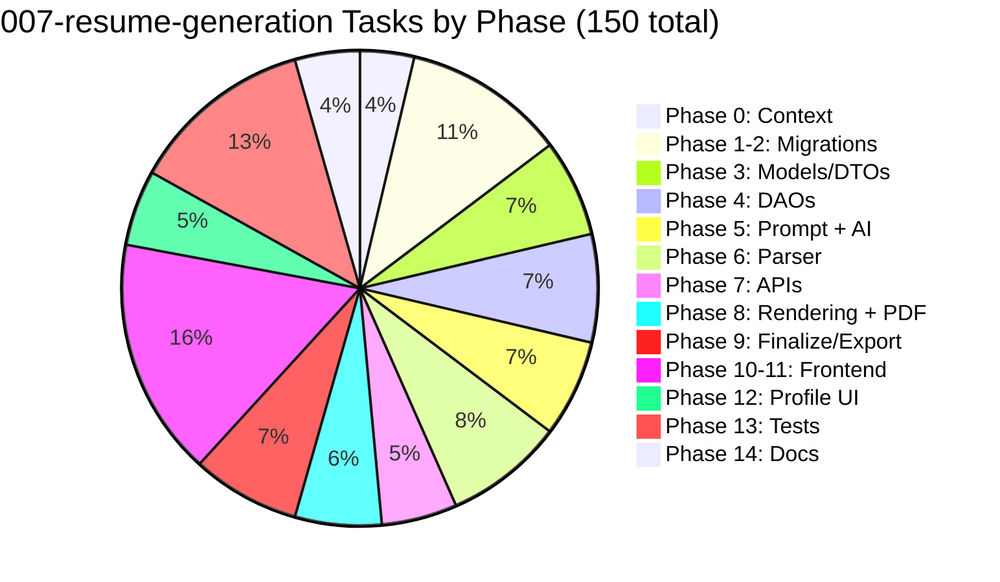

# Feature Progress Dashboard

**Generated**: 2026-06-12
**Current branch**: `feat/007-resume-generation`

---

## SDD Lifecycle Gantt

```mermaid
gantt
    title ResumAIner Feature Progress
    dateFormat X
    axisFormat %s

    section 001-hello-world-tomcat
    Specify     :done, f1s, 0, 1
    Plan        :done, f1p, 1, 2
    Tasks       :done, f1t, 2, 3
    Implement   :done, f1i, 3, 4
    Verify      :done, f1v, 4, 5

    section 002-thymeleaf-landing-page
    Specify     :done, f2s, 0, 1
    Plan        :done, f2p, 1, 2
    Tasks       :done, f2t, 2, 3
    Implement   :done, f2i, 3, 4
    Verify      :done, f2v, 4, 5

    section 003-vue-auth-page
    Specify     :done, f3s, 0, 1
    Plan        :done, f3p, 1, 2
    Tasks       :done, f3t, 2, 3
    Implement   :done, f3i, 3, 4
    Verify      :done, f3v, 4, 5

    section 004-custom-jdbc-connection-pool
    Specify     :done, f4s, 0, 1
    Plan        :done, f4p, 1, 2
    Tasks       :done, f4t, 2, 3
    Implement   :done, f4i, 3, 4
    Verify      :done, f4v, 4, 5

    section 005-user-home-page
    Specify     :done, f5s, 0, 1
    Plan        :done, f5p, 1, 2
    Tasks       :done, f5t, 2, 3
    Implement   :done, f5i, 3, 4
    Verify      :done, f5v, 4, 5

    section 006-user-profile
    Specify     :done, f6s, 0, 1
    Plan        :done, f6p, 1, 2
    Tasks       :done, f6t, 2, 3
    Implement   :done, f6i, 3, 4
    Verify      :done, f6v, 4, 5

    section 007-resume-generation [ACTIVE]
    Specify     :done, f7s, 0, 1
    Plan        :done, f7p, 1, 2
    Tasks       :done, f7t, 2, 3
    Implement   :active, f7i, 3, 4
    Verify      :f7v, 4, 5
```

---

## Summary

| Feature | Phase | Tasks | Progress | Branch | Status |
|---------|-------|-------|----------|--------|--------|
| 001-hello-world-tomcat | ✅ Complete | 22/22 | ██████████ 100% | `feat/001-hello-world-tomcat` | Merged to `main` |
| 002-thymeleaf-landing-page | ✅ Complete | 27/27 | ██████████ 100% | `feat/002-thymeleaf-landing-page` | Merged to `main` |
| 003-vue-auth-page | ✅ Complete | 63/63 | ██████████ 100% | `feat/003-vue-auth-page` | Merged to `main` |
| 004-custom-jdbc-connection-pool | ✅ Complete | 55/55 | ██████████ 100% | `feat/004-custom-jdbc-connection-pool` | Merged to `main` |
| 005-user-home-page | ✅ Complete | 41/41 | ██████████ 100% | `feat/005-user-home-page` | Merged to `main` |
| 006-user-profile | ✅ Complete | 48/48 | ██████████ 100% | `feat/006-profile-page` | Merged to `main` |
| **007-resume-generation** | 🔵 **Tasks — Ready for Implement** | **0/150** | ⬜⬜⬜⬜⬜⬜⬜⬜⬜⬜ **0%** | **`feat/007-resume-generation`** | **Active** |

---

## Feature 007 — Task Breakdown

---

## Legend

| Status | Meaning |
|--------|---------|
| ✅ Complete | Spec + Plan + Tasks + Implementation + Verification all done |
| 🔵 Tasks | Spec + Plan + Tasks ready, ready for implementation |
| 🟡 Implement | In development |
| ⬜ Not started | No work done yet |
