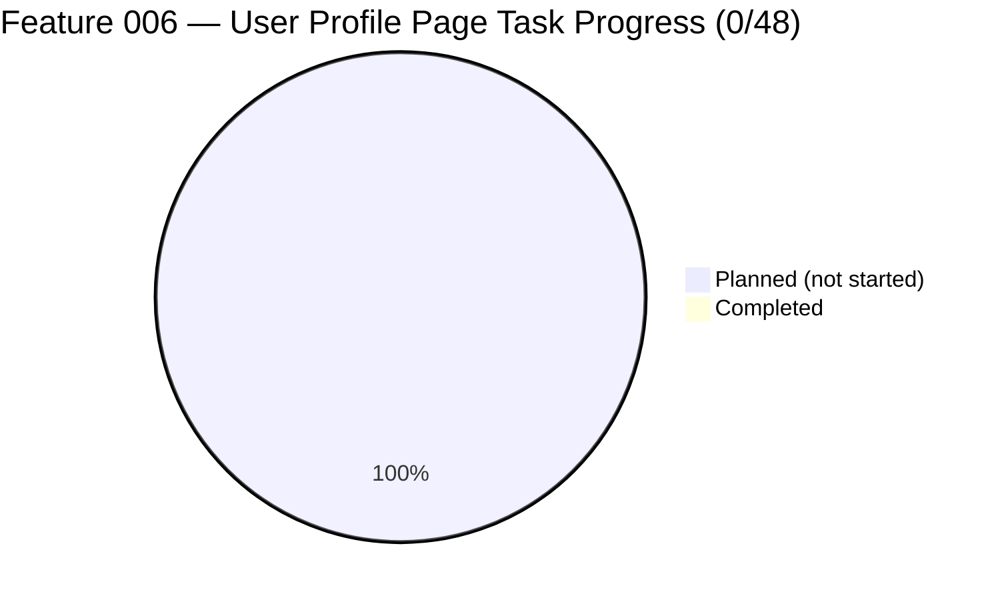

# Feature Progress Dashboard

**Generated**: 2026-06-07

```mermaid
gantt
    title SDD Feature Progress — ResumAIner
    dateFormat X
    axisFormat %s

    section 001-hello-world-tomcat
    Specify     :done, s1, 0, 1
    Plan        :done, p1, 1, 2
    Tasks       :done, t1, 2, 3
    Implement   :done, i1, 3, 4
    Verify      :done, v1, 4, 5

    section 002-thymeleaf-landing-page
    Specify     :done, s2, 0, 1
    Plan        :done, p2, 1, 2
    Tasks       :done, t2, 2, 3
    Implement   :done, i2, 3, 4
    Verify      :done, v2, 4, 5

    section 003-vue-auth-page
    Specify     :done, s3, 0, 1
    Plan        :done, p3, 1, 2
    Tasks       :done, t3, 2, 3
    Implement   :done, i3, 3, 4
    Verify      :done, v3, 4, 5

    section 004-custom-jdbc-pool
    Specify     :done, s4, 0, 1
    Plan        :done, p4, 1, 2
    Tasks       :done, t4, 2, 3
    Implement   :done, i4, 3, 4
    Verify      :done, v4, 4, 5

    section 005-user-home-page
    Specify     :done, s5, 0, 1
    Plan        :done, p5, 1, 2
    Tasks       :done, t5, 2, 3
    Implement   :done, i5, 3, 4
    Verify      :done, v5, 4, 5

    section 006-user-profile
    Specify     :done, s6, 0, 1
    Plan        :done, p6, 1, 2
    Tasks       :done, t6, 2, 3
    Implement   :active, i6, 3, 4
    Verify      :v6, 4, 5
```

## Summary

| Feature | Spec | Plan | Tasks | Progress | Phase | Branch |
|---|---|---|---|---|---|---|
| 001-hello-world-tomcat | ✅ | ✅ | ✅ | 22/22 (100%) | ✅ Complete | `main` |
| 002-thymeleaf-landing-page | ✅ | ✅ | ✅ | 27/27 (100%) | ✅ Complete | `main` |
| 003-vue-auth-page | ✅ | ✅ | ✅ | 63/63 (100%) | ✅ Complete | `main` |
| 004-custom-jdbc-connection-pool | ✅ | ✅ | ✅ | 55/55 (100%) | ✅ Complete | `main` |
| 005-user-home-page | ✅ | ✅ | ✅ | 41/41 (100%) | ✅ Complete | `main` |
| **006-user-profile** | ✅ | ✅ | ✅ | **0/48 (0%)** | 🟡 **Tasks Ready** | `feat/006-profile-page` |

## Legend

- ✅ Complete — all SDD phases finished, feature merged to main
- 🟡 In Progress — active feature on its branch
- 🔴 Not Started — no artifacts exist
