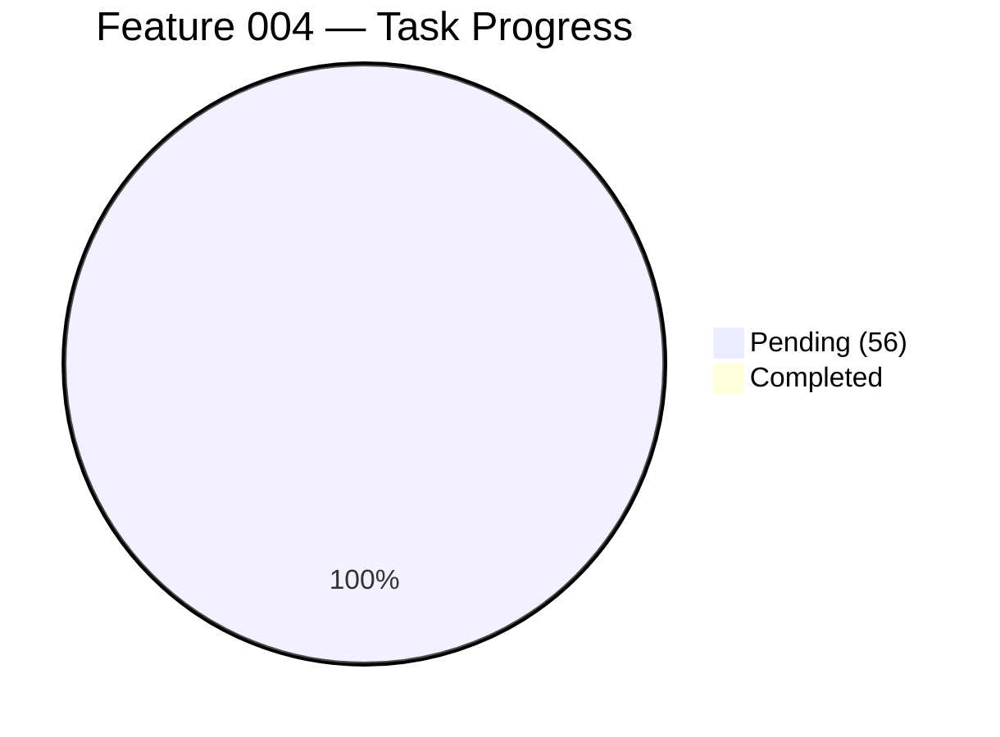

# Feature Progress Dashboard

**Generated**: 2026-06-04

```mermaid
gantt
    title SDD Feature Progress — ResumAIner
    dateFormat X
    axisFormat %s

    section 001-hello-world-tomcat
    Specify     :done, s1, 0, 1
    Plan        :done, p1, 1, 2
    Tasks       :done, t1, 2, 3
    Implement   :done, i1, 3, 4
    Verify      :done, v1, 4, 5

    section 002-thymeleaf-landing-page
    Specify     :done, s2, 0, 1
    Plan        :done, p2, 1, 2
    Tasks       :done, t2, 2, 3
    Implement   :done, i2, 3, 4
    Verify      :done, v2, 4, 5

    section 003-vue-auth-page
    Specify     :done, s3, 0, 1
    Plan        :done, p3, 1, 2
    Tasks       :done, t3, 2, 3
    Implement   :done, i3, 3, 4
    Verify      :done, v3, 4, 5

    section 004-custom-jdbc-connection-pool 🚧
    Specify     :done, s4, 0, 1
    Plan        :done, p4, 1, 2
    Tasks       :active, t4, 2, 3
    Implement   :i4, 3, 4
    Verify      :v4, 4, 5
```

## Summary

| # | Feature | Phase | Tasks | Status | Branch |
|---|---------|-------|-------|--------|--------|
| 001 | Hello World Tomcat | ✅ Complete | 22/22 | Merged to `main` | `feat/001-hello-world-tomcat` |
| 002 | Thymeleaf Landing Page | ✅ Complete | 27/27 | Merged to `main` | `feat/002-thymeleaf-landing-page` |
| 003 | Vue Auth Page | ✅ Complete | 63/63 | Merged to `main` | `feat/003-vue-auth-page` |
| 004 | **Custom JDBC Connection Pool** | 🔧 **Tasks** | 0/56 | 🚧 **Active** | `feat/004-custom-jdbc-connection-pool` |

## 004 Task Breakdown

### Artifact Status

| Artifact | 001 | 002 | 003 | 004 |
|----------|-----|-----|-----|-----|
| spec.md | ✅ | ✅ | ✅ | ✅ |
| plan.md | ✅ | ✅ | ✅ | ✅ |
| tasks.md | ✅ | ✅ | ✅ | ✅ |
| research.md | ✅ | — | — | ✅ |
| data-model.md | ✅ | — | ✅ | ✅ |
| contracts/ | — | — | ✅ | ✅ |
| quickstart.md | — | ✅ | ✅ | ✅ |
| security-review | — | — | — | ✅ |
| checklists | ✅ | ✅ | ✅ | ✅ |
| All tasks done | ✅ | ✅ | ✅ | ⏳ 0/56 |

### Suggested Next Steps

1. **Phase 0**: Run Task 001 — inspect existing connection artifacts
2. **Phase 1**: Dispatch parallel subagents for Tasks 003-006 (Config, Exception, Factory, Proxy)
3. **Phase 1**: Task 007 — SimpleConnectionPool (depends on 003-006)
