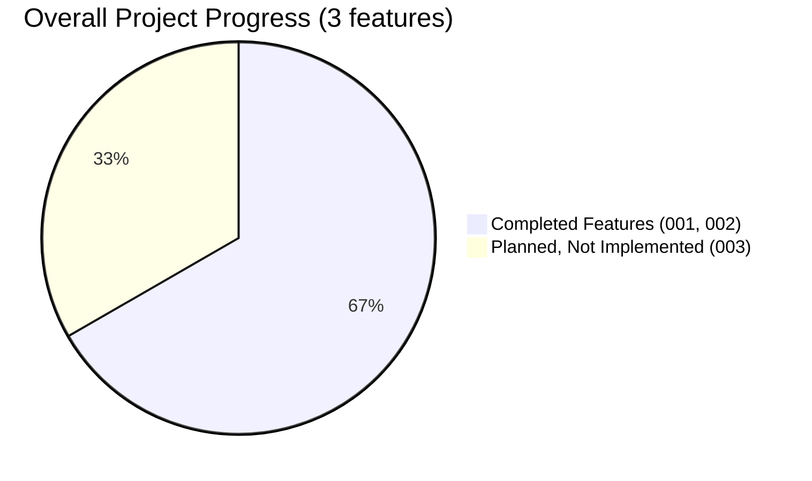

# Feature Progress Dashboard

**Generated**: 2026-06-02

---

```mermaid
gantt
    title SDD Feature Progress — ResumAIner
    dateFormat X
    axisFormat %s

    section 001-hello-world-tomcat
    Specify ✅     :done, f1s, 0, 1
    Plan ✅        :done, f1p, 1, 2
    Tasks ✅       :done, f1t, 2, 3
    Implement ✅   :done, f1i, 3, 4
    Verify ✅      :done, f1v, 4, 5

    section 002-thymeleaf-landing-page
    Specify ✅     :done, f2s, 0, 1
    Plan ✅        :done, f2p, 1, 2
    Tasks ✅       :done, f2t, 2, 3
    Implement ✅   :done, f2i, 3, 4
    Verify ✅      :done, f2v, 4, 5

    section 003-vue-auth-page
    Specify ✅     :done, f3s, 0, 1
    Plan ✅        :done, f3p, 1, 2
    Tasks ✅       :done, f3t, 2, 3
    Implement 🔄  :active, f3i, 3, 4
    Verify        :f3v, 4, 5
```

## Summary

| Feature | Phase | Tasks | Progress | Branch | Status |
|---------|-------|-------|----------|--------|--------|
| 001-hello-world-tomcat | **Verify** | 22/22 | **100%** ✅ | `feat/001-hello-world-tomcat` (merged) | Complete |
| 002-thymeleaf-landing-page | **Verify** | 27/27 | **100%** ✅ | `feat/002-thymeleaf-landing-page` (merged) | Complete |
| 003-vue-auth-page | **Tasks** 🔄 | 0/60 | **0%** | `feat/003-vue-auth-page` (current) | Active |

## Artifact Check

| Feature | spec.md | plan.md | tasks.md | checklists | Diagrams | Contracts |
|---------|---------|---------|----------|------------|----------|-----------|
| 001-hello-world-tomcat | ✅ | ✅ | ✅ 22/22 | ✅ | ✅ CD, SA, SD | — |
| 002-thymeleaf-landing-page | ✅ | ✅ | ✅ 27/27 | ✅ | ✅ CD | — |
| 003-vue-auth-page | ✅ | ✅ | ⬜ 0/60 | ✅ | ✅ CD, SA, SD | ✅ |

### Legend
- ✅ Complete
- 🔄 In Progress
- ⬜ Not Started / Empty
- CD = Component Diagram, SA = Software Architecture, SD = System Design

### Next Actions

1. **Feature 003**: Begin Phase 1 implementation — Flyway migrations + Maven dependencies
2. **Features 001/002**: Both complete — merged to `main` when ready

---

